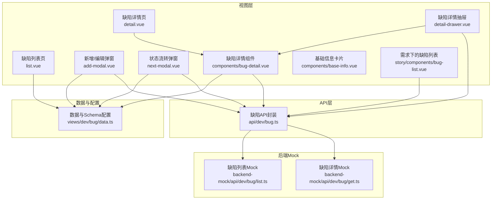
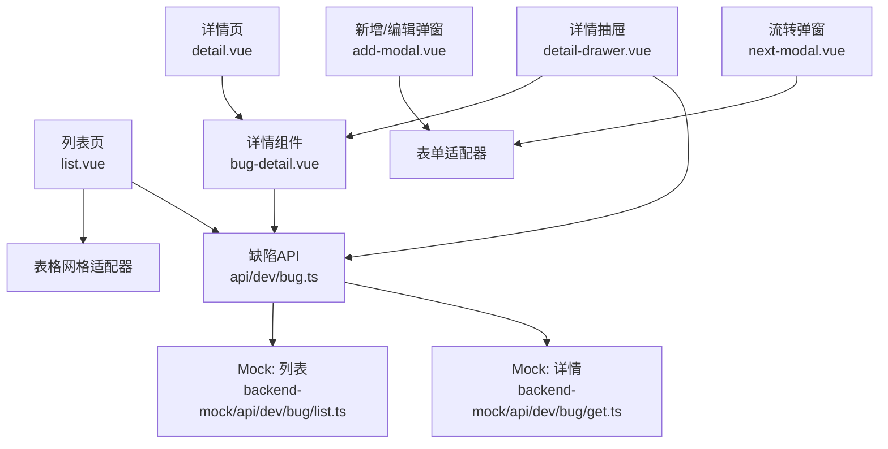
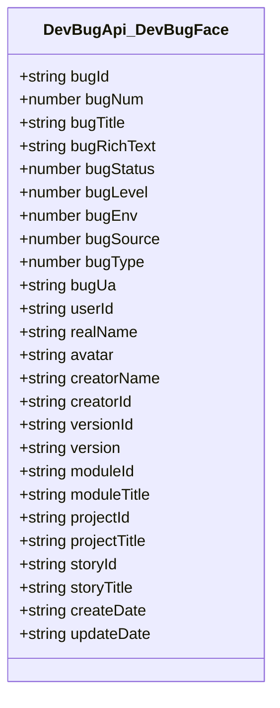
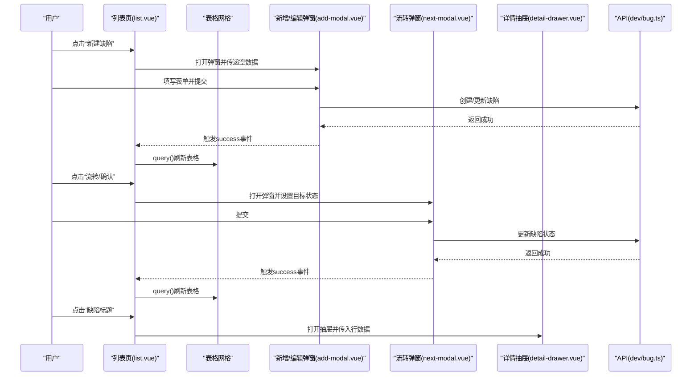
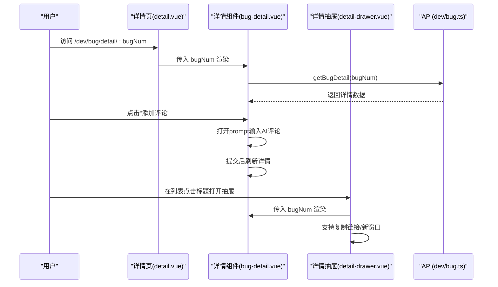
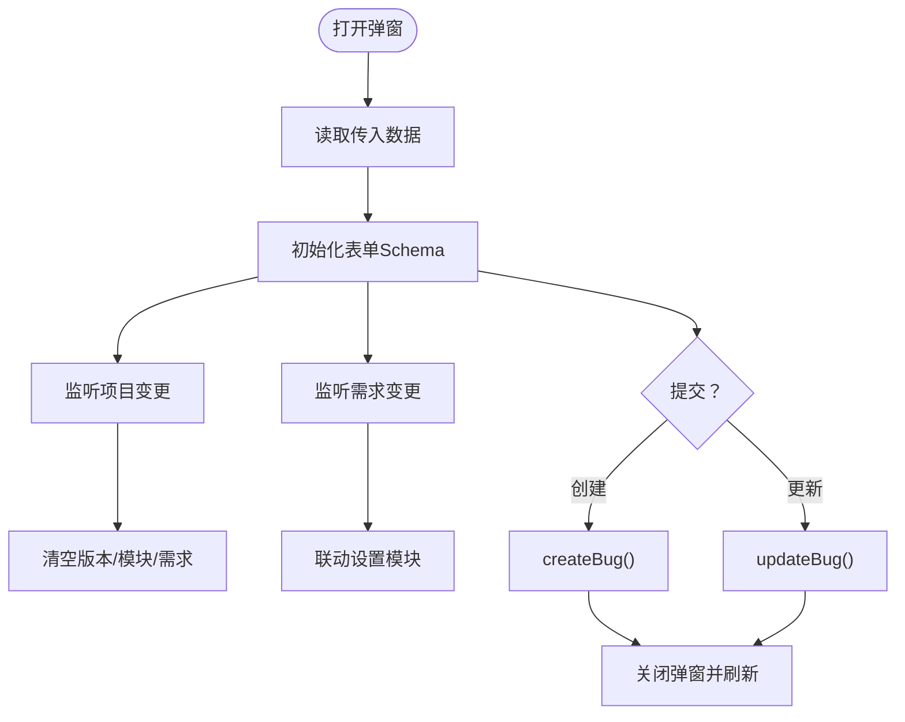
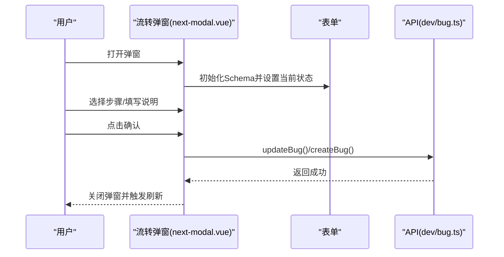
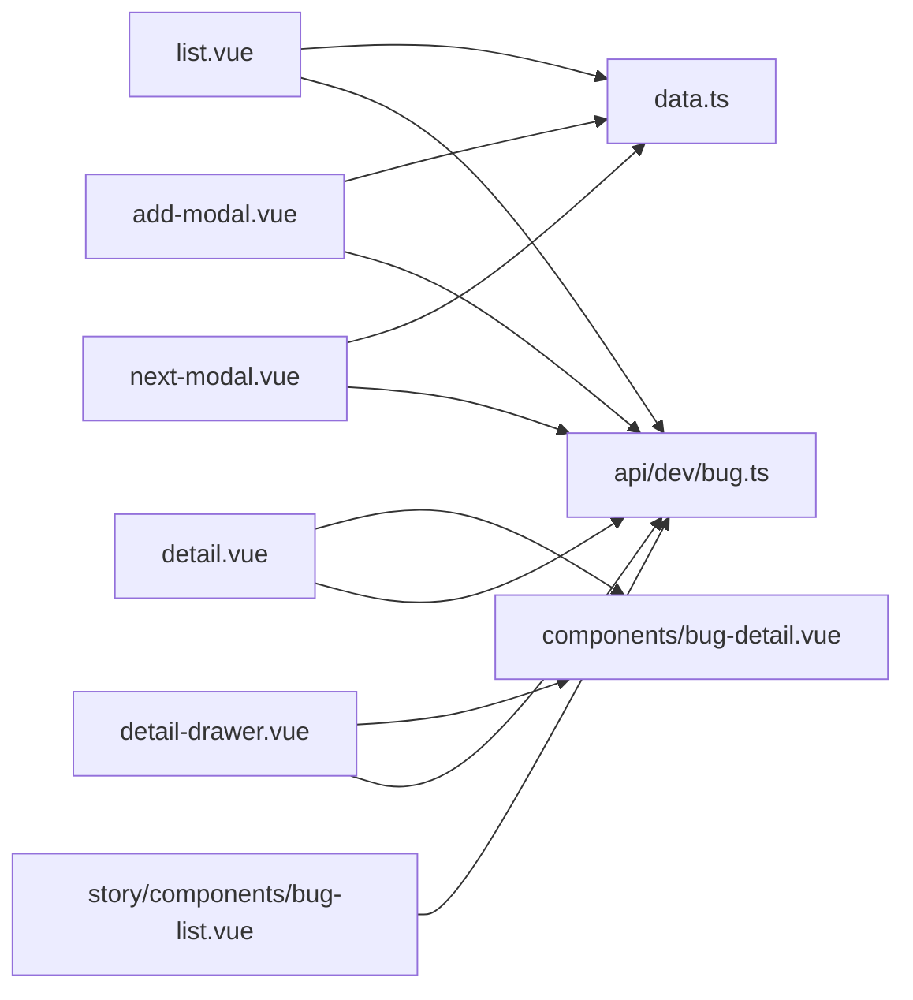

# 缺陷管理组件

<cite>
**本文档引用的文件**
- [apps/web-antd/src/views/dev/bug/list.vue](file://apps/web-antd/src/views/dev/bug/list.vue)
- [apps/web-antd/src/views/dev/bug/detail.vue](file://apps/web-antd/src/views/dev/bug/detail.vue)
- [apps/web-antd/src/views/dev/bug/detail-drawer.vue](file://apps/web-antd/src/views/dev/bug/detail-drawer.vue)
- [apps/web-antd/src/views/dev/bug/add-modal.vue](file://apps/web-antd/src/views/dev/bug/add-modal.vue)
- [apps/web-antd/src/views/dev/bug/components/bug-detail.vue](file://apps/web-antd/src/views/dev/bug/components/bug-detail.vue)
- [apps/web-antd/src/views/dev/bug/components/base-info.vue](file://apps/web-antd/src/views/dev/bug/components/base-info.vue)
- [apps/web-antd/src/views/dev/bug/data.ts](file://apps/web-antd/src/views/dev/bug/data.ts)
- [apps/web-antd/src/views/dev/bug/next-modal.vue](file://apps/web-antd/src/views/dev/bug/next-modal.vue)
- [apps/web-antd/src/views/dev/story/components/bug-list.vue](file://apps/web-antd/src/views/dev/story/components/bug-list.vue)
- [apps/web-antd/src/api/dev/bug.ts](file://apps/web-antd/src/api/dev/bug.ts)
- [apps/backend-mock/api/dev/bug/list.ts](file://apps/backend-mock/api/dev/bug/list.ts)
- [apps/backend-mock/api/dev/bug/get.ts](file://apps/backend-mock/api/dev/bug/get.ts)
</cite>

## 目录
1. [简介](#简介)
2. [项目结构](#项目结构)
3. [核心组件](#核心组件)
4. [架构总览](#架构总览)
5. [详细组件分析](#详细组件分析)
6. [依赖分析](#依赖分析)
7. [性能考虑](#性能考虑)
8. [故障排查指南](#故障排查指南)
9. [结论](#结论)
10. [附录](#附录)

## 简介
本文件系统性梳理缺陷管理组件的实现与使用，覆盖缺陷列表展示、缺陷详情查看、缺陷添加与编辑、缺陷详情抽屉、状态流转与业务规则、API 接口与事件处理机制，并结合实际场景给出扩展与最佳实践建议。缺陷管理以“缺陷”为核心实体，围绕其生命周期（创建、确认、流转、修复、关闭）构建视图与交互。

## 项目结构
缺陷管理功能主要位于前端应用的开发视图模块下，采用按页面/功能分层组织：
- 视图层：缺陷列表页、详情页、抽屉详情、新增/编辑弹窗、状态流转弹窗、基础信息卡片等
- 数据与配置：表格列与表单 Schema、字典映射、本地字典数据
- API 层：缺陷列表、详情、创建、更新、按需求查询缺陷等接口
- 后端 Mock：提供缺陷列表与详情的模拟数据

图表来源
- [apps/web-antd/src/views/dev/bug/list.vue:1-152](file://apps/web-antd/src/views/dev/bug/list.vue#L1-L152)
- [apps/web-antd/src/views/dev/bug/detail.vue:1-29](file://apps/web-antd/src/views/dev/bug/detail.vue#L1-L29)
- [apps/web-antd/src/views/dev/bug/detail-drawer.vue:1-80](file://apps/web-antd/src/views/dev/bug/detail-drawer.vue#L1-L80)
- [apps/web-antd/src/views/dev/bug/add-modal.vue:1-73](file://apps/web-antd/src/views/dev/bug/add-modal.vue#L1-L73)
- [apps/web-antd/src/views/dev/bug/components/bug-detail.vue:1-229](file://apps/web-antd/src/views/dev/bug/components/bug-detail.vue#L1-L229)
- [apps/web-antd/src/views/dev/bug/components/base-info.vue:1-51](file://apps/web-antd/src/views/dev/bug/components/base-info.vue#L1-L51)
- [apps/web-antd/src/views/dev/bug/data.ts:1-613](file://apps/web-antd/src/views/dev/bug/data.ts#L1-L613)
- [apps/web-antd/src/views/dev/bug/next-modal.vue:1-115](file://apps/web-antd/src/views/dev/bug/next-modal.vue#L1-L115)
- [apps/web-antd/src/views/dev/story/components/bug-list.vue:1-58](file://apps/web-antd/src/views/dev/story/components/bug-list.vue#L1-L58)
- [apps/web-antd/src/api/dev/bug.ts:1-104](file://apps/web-antd/src/api/dev/bug.ts#L1-L104)
- [apps/backend-mock/api/dev/bug/list.ts:1-166](file://apps/backend-mock/api/dev/bug/list.ts#L1-L166)
- [apps/backend-mock/api/dev/bug/get.ts:1-17](file://apps/backend-mock/api/dev/bug/get.ts#L1-L17)

章节来源
- [apps/web-antd/src/views/dev/bug/list.vue:1-152](file://apps/web-antd/src/views/dev/bug/list.vue#L1-L152)
- [apps/web-antd/src/views/dev/bug/detail.vue:1-29](file://apps/web-antd/src/views/dev/bug/detail.vue#L1-L29)
- [apps/web-antd/src/views/dev/bug/detail-drawer.vue:1-80](file://apps/web-antd/src/views/dev/bug/detail-drawer.vue#L1-L80)
- [apps/web-antd/src/views/dev/bug/add-modal.vue:1-73](file://apps/web-antd/src/views/dev/bug/add-modal.vue#L1-L73)
- [apps/web-antd/src/views/dev/bug/components/bug-detail.vue:1-229](file://apps/web-antd/src/views/dev/bug/components/bug-detail.vue#L1-L229)
- [apps/web-antd/src/views/dev/bug/components/base-info.vue:1-51](file://apps/web-antd/src/views/dev/bug/components/base-info.vue#L1-L51)
- [apps/web-antd/src/views/dev/bug/data.ts:1-613](file://apps/web-antd/src/views/dev/bug/data.ts#L1-L613)
- [apps/web-antd/src/views/dev/bug/next-modal.vue:1-115](file://apps/web-antd/src/views/dev/bug/next-modal.vue#L1-L115)
- [apps/web-antd/src/views/dev/story/components/bug-list.vue:1-58](file://apps/web-antd/src/views/dev/story/components/bug-list.vue#L1-L58)
- [apps/web-antd/src/api/dev/bug.ts:1-104](file://apps/web-antd/src/api/dev/bug.ts#L1-L104)
- [apps/backend-mock/api/dev/bug/list.ts:1-166](file://apps/backend-mock/api/dev/bug/list.ts#L1-L166)
- [apps/backend-mock/api/dev/bug/get.ts:1-17](file://apps/backend-mock/api/dev/bug/get.ts#L1-L17)

## 核心组件
- 列表页：集成表格网格、查询表单、工具栏、批量导出、行内编辑代理、操作按钮（编辑、删除、流转、确认、跳详情）
- 详情页：承载详情组件，支持路由参数驱动的缺陷编号加载
- 详情抽屉：侧滑抽屉展示详情，支持复制链接、新窗口打开、AI评论输入
- 新增/编辑弹窗：统一的表单弹窗，联动字段（项目/版本/模块/需求），提交时区分创建与更新
- 状态流转弹窗：基于步骤条的状态推进，支持常用语快速填充
- 基础信息卡片：右侧基本信息面板，字典标签渲染
- 需求下的缺陷列表：在需求详情页内嵌展示关联缺陷

章节来源
- [apps/web-antd/src/views/dev/bug/list.vue:1-152](file://apps/web-antd/src/views/dev/bug/list.vue#L1-L152)
- [apps/web-antd/src/views/dev/bug/detail.vue:1-29](file://apps/web-antd/src/views/dev/bug/detail.vue#L1-L29)
- [apps/web-antd/src/views/dev/bug/detail-drawer.vue:1-80](file://apps/web-antd/src/views/dev/bug/detail-drawer.vue#L1-L80)
- [apps/web-antd/src/views/dev/bug/add-modal.vue:1-73](file://apps/web-antd/src/views/dev/bug/add-modal.vue#L1-L73)
- [apps/web-antd/src/views/dev/bug/components/bug-detail.vue:1-229](file://apps/web-antd/src/views/dev/bug/components/bug-detail.vue#L1-L229)
- [apps/web-antd/src/views/dev/bug/components/base-info.vue:1-51](file://apps/web-antd/src/views/dev/bug/components/base-info.vue#L1-L51)
- [apps/web-antd/src/views/dev/bug/next-modal.vue:1-115](file://apps/web-antd/src/views/dev/bug/next-modal.vue#L1-L115)
- [apps/web-antd/src/views/dev/story/components/bug-list.vue:1-58](file://apps/web-antd/src/views/dev/story/components/bug-list.vue#L1-L58)

## 架构总览
缺陷管理采用“视图组件 + 数据配置 + API 封装”的分层设计，视图通过统一的适配器（表格、表单、抽屉、模态框）与业务 API 对接，形成清晰的职责边界。

图表来源
- [apps/web-antd/src/views/dev/bug/list.vue:1-152](file://apps/web-antd/src/views/dev/bug/list.vue#L1-L152)
- [apps/web-antd/src/views/dev/bug/detail.vue:1-29](file://apps/web-antd/src/views/dev/bug/detail.vue#L1-L29)
- [apps/web-antd/src/views/dev/bug/detail-drawer.vue:1-80](file://apps/web-antd/src/views/dev/bug/detail-drawer.vue#L1-L80)
- [apps/web-antd/src/views/dev/bug/add-modal.vue:1-73](file://apps/web-antd/src/views/dev/bug/add-modal.vue#L1-L73)
- [apps/web-antd/src/views/dev/bug/components/bug-detail.vue:1-229](file://apps/web-antd/src/views/dev/bug/components/bug-detail.vue#L1-L229)
- [apps/web-antd/src/views/dev/bug/next-modal.vue:1-115](file://apps/web-antd/src/views/dev/bug/next-modal.vue#L1-L115)
- [apps/web-antd/src/api/dev/bug.ts:1-104](file://apps/web-antd/src/api/dev/bug.ts#L1-L104)
- [apps/backend-mock/api/dev/bug/list.ts:1-166](file://apps/backend-mock/api/dev/bug/list.ts#L1-L166)
- [apps/backend-mock/api/dev/bug/get.ts:1-17](file://apps/backend-mock/api/dev/bug/get.ts#L1-L17)

## 详细组件分析

### 缺陷数据模型与字典
- 数据模型：缺陷实体包含主键、编号、标题、富文本描述、状态、级别、环境、来源、类型、浏览器 UA、修复人与创建人、关联项目/版本/模块/需求、时间戳等字段
- 字典类型：缺陷状态、确认状态、级别、环境、来源、类型等均通过本地字典映射渲染
- Schema 设计：表单与表格列均通过集中配置生成，支持动态联动、禁用、默认值、渲染插槽等

图表来源
- [apps/web-antd/src/api/dev/bug.ts:4-58](file://apps/web-antd/src/api/dev/bug.ts#L4-L58)

章节来源
- [apps/web-antd/src/api/dev/bug.ts:1-104](file://apps/web-antd/src/api/dev/bug.ts#L1-L104)
- [apps/web-antd/src/views/dev/bug/data.ts:24-297](file://apps/web-antd/src/views/dev/bug/data.ts#L24-L297)

### 列表页与表格交互
- 表格网格：支持分页代理、查询参数透传、单元格编辑、工具栏导出、列配置（含字典标签渲染）
- 查询表单：项目/版本/模块/状态/标题等筛选项
- 行内操作：确认、流转、编辑、删除；点击标题进入详情抽屉
- 新建/编辑：统一弹窗，提交后刷新表格

图表来源
- [apps/web-antd/src/views/dev/bug/list.vue:19-114](file://apps/web-antd/src/views/dev/bug/list.vue#L19-L114)
- [apps/web-antd/src/views/dev/bug/add-modal.vue:40-66](file://apps/web-antd/src/views/dev/bug/add-modal.vue#L40-L66)
- [apps/web-antd/src/views/dev/bug/next-modal.vue:36-76](file://apps/web-antd/src/views/dev/bug/next-modal.vue#L36-L76)
- [apps/web-antd/src/views/dev/bug/detail-drawer.vue:13-46](file://apps/web-antd/src/views/dev/bug/detail-drawer.vue#L13-L46)
- [apps/web-antd/src/api/dev/bug.ts:60-83](file://apps/web-antd/src/api/dev/bug.ts#L60-L83)

章节来源
- [apps/web-antd/src/views/dev/bug/list.vue:1-152](file://apps/web-antd/src/views/dev/bug/list.vue#L1-L152)
- [apps/web-antd/src/views/dev/bug/data.ts:299-562](file://apps/web-antd/src/views/dev/bug/data.ts#L299-L562)

### 详情页与详情抽屉
- 详情页：通过路由参数获取缺陷编号，设置标签页标题，容器化展示详情卡片
- 详情抽屉：抽屉内展示详情组件，支持复制链接、新窗口打开、AI评论输入与提交
- 详情组件：加载详情、监听编号变化、按钮组（添加评论、流转、编辑、删除）、弹窗引用

图表来源
- [apps/web-antd/src/views/dev/bug/detail.vue:13-20](file://apps/web-antd/src/views/dev/bug/detail.vue#L13-L20)
- [apps/web-antd/src/views/dev/bug/components/bug-detail.vue:70-88](file://apps/web-antd/src/views/dev/bug/components/bug-detail.vue#L70-L88)
- [apps/web-antd/src/views/dev/bug/detail-drawer.vue:25-46](file://apps/web-antd/src/views/dev/bug/detail-drawer.vue#L25-L46)
- [apps/web-antd/src/api/dev/bug.ts:99-103](file://apps/web-antd/src/api/dev/bug.ts#L99-L103)

章节来源
- [apps/web-antd/src/views/dev/bug/detail.vue:1-29](file://apps/web-antd/src/views/dev/bug/detail.vue#L1-L29)
- [apps/web-antd/src/views/dev/bug/detail-drawer.vue:1-80](file://apps/web-antd/src/views/dev/bug/detail-drawer.vue#L1-L80)
- [apps/web-antd/src/views/dev/bug/components/bug-detail.vue:1-229](file://apps/web-antd/src/views/dev/bug/components/bug-detail.vue#L1-L229)

### 新增/编辑弹窗与表单联动
- 表单 Schema：标题、项目/版本/模块/需求、修复人、级别/环境/状态/来源/类型、UA 等
- 联动逻辑：选择项目时清空版本/模块/需求；选择需求时联动模块字段；状态字段在编辑时禁用
- 提交策略：存在 bugId 则更新，否则创建；提交后关闭弹窗并触发父级刷新

图表来源
- [apps/web-antd/src/views/dev/bug/add-modal.vue:14-66](file://apps/web-antd/src/views/dev/bug/add-modal.vue#L14-L66)
- [apps/web-antd/src/views/dev/bug/data.ts:24-297](file://apps/web-antd/src/views/dev/bug/data.ts#L24-L297)
- [apps/web-antd/src/api/dev/bug.ts:66-83](file://apps/web-antd/src/api/dev/bug.ts#L66-L83)

章节来源
- [apps/web-antd/src/views/dev/bug/add-modal.vue:1-73](file://apps/web-antd/src/views/dev/bug/add-modal.vue#L1-L73)
- [apps/web-antd/src/views/dev/bug/data.ts:24-297](file://apps/web-antd/src/views/dev/bug/data.ts#L24-L297)
- [apps/web-antd/src/api/dev/bug.ts:60-83](file://apps/web-antd/src/api/dev/bug.ts#L60-L83)

### 状态流转弹窗与步骤条
- 步骤条：基于本地字典渲染状态步骤，点击切换当前状态
- 表单 Schema：包含缺陷主键、状态、来源标记、确认状态、变更说明等
- 常用语：提供快捷短语双击填充

图表来源
- [apps/web-antd/src/views/dev/bug/next-modal.vue:18-76](file://apps/web-antd/src/views/dev/bug/next-modal.vue#L18-L76)
- [apps/web-antd/src/views/dev/bug/data.ts:564-612](file://apps/web-antd/src/views/dev/bug/data.ts#L564-L612)
- [apps/web-antd/src/api/dev/bug.ts:77-83](file://apps/web-antd/src/api/dev/bug.ts#L77-L83)

章节来源
- [apps/web-antd/src/views/dev/bug/next-modal.vue:1-115](file://apps/web-antd/src/views/dev/bug/next-modal.vue#L1-L115)
- [apps/web-antd/src/views/dev/bug/data.ts:564-612](file://apps/web-antd/src/views/dev/bug/data.ts#L564-L612)

### 基础信息卡片与字典渲染
- 基本信息卡片：展示编号、版本、项目、模块、状态、级别、环境、类型、来源、修复人等
- 字典渲染：使用 DictTag 与用户头像组件进行标签化展示

章节来源
- [apps/web-antd/src/views/dev/bug/components/base-info.vue:1-51](file://apps/web-antd/src/views/dev/bug/components/base-info.vue#L1-L51)

### 需求下的缺陷列表
- 在需求详情页内嵌展示关联缺陷，支持点击跳转到缺陷详情页
- 使用字典标签展示状态、级别、环境

章节来源
- [apps/web-antd/src/views/dev/story/components/bug-list.vue:1-58](file://apps/web-antd/src/views/dev/story/components/bug-list.vue#L1-L58)

## 依赖分析
- 组件耦合：列表页对数据配置与 API 的依赖明确；详情页/抽屉通过路由与传参解耦；弹窗与表单通过适配器解耦
- 外部依赖：字典映射、用户头像、富文本编辑器、步骤条、常用语组件等
- 数据流：查询 -> 列表代理 -> 表格渲染；操作 -> 弹窗/抽屉 -> API -> 刷新

图表来源
- [apps/web-antd/src/views/dev/bug/list.vue:1-152](file://apps/web-antd/src/views/dev/bug/list.vue#L1-L152)
- [apps/web-antd/src/views/dev/bug/detail.vue:1-29](file://apps/web-antd/src/views/dev/bug/detail.vue#L1-L29)
- [apps/web-antd/src/views/dev/bug/detail-drawer.vue:1-80](file://apps/web-antd/src/views/dev/bug/detail-drawer.vue#L1-L80)
- [apps/web-antd/src/views/dev/bug/add-modal.vue:1-73](file://apps/web-antd/src/views/dev/bug/add-modal.vue#L1-L73)
- [apps/web-antd/src/views/dev/bug/next-modal.vue:1-115](file://apps/web-antd/src/views/dev/bug/next-modal.vue#L1-L115)
- [apps/web-antd/src/views/dev/story/components/bug-list.vue:1-58](file://apps/web-antd/src/views/dev/story/components/bug-list.vue#L1-L58)
- [apps/web-antd/src/views/dev/bug/data.ts:1-613](file://apps/web-antd/src/views/dev/bug/data.ts#L1-L613)
- [apps/web-antd/src/api/dev/bug.ts:1-104](file://apps/web-antd/src/api/dev/bug.ts#L1-L104)

## 性能考虑
- 表格代理分页：列表页使用代理查询，避免一次性加载全部数据
- 表单联动去抖：需求搜索使用防抖降低请求频率
- 懒加载与销毁：弹窗/抽屉设置 destroyOnClose，减少内存占用
- 富文本与大内容：详情页富文本区域按需渲染，避免阻塞首屏

## 故障排查指南
- 列表无数据或空白
  - 检查查询参数是否正确传递（项目/版本/状态/关键字）
  - 确认代理查询函数返回结构符合分页要求
- 表单字段无法联动
  - 检查依赖配置与触发字段是否一致
  - 确认 ApiSelect 的 key 与缓存策略
- 状态流转不可用
  - 检查按钮禁用条件（待确认/已关闭等）
  - 确认当前状态与步骤条索引匹配
- 详情加载失败
  - 检查路由参数 bugNum 是否存在
  - 确认 API 返回结构与组件期望一致
- Mock 数据问题
  - 检查后端 Mock 的权限校验与过滤逻辑

章节来源
- [apps/web-antd/src/views/dev/bug/list.vue:40-50](file://apps/web-antd/src/views/dev/bug/list.vue#L40-L50)
- [apps/web-antd/src/views/dev/bug/data.ts:194-196](file://apps/web-antd/src/views/dev/bug/data.ts#L194-L196)
- [apps/web-antd/src/views/dev/bug/next-modal.vue:58-62](file://apps/web-antd/src/views/dev/bug/next-modal.vue#L58-L62)
- [apps/web-antd/src/views/dev/bug/components/bug-detail.vue:70-88](file://apps/web-antd/src/views/dev/bug/components/bug-detail.vue#L70-L88)
- [apps/backend-mock/api/dev/bug/list.ts:117-165](file://apps/backend-mock/api/dev/bug/list.ts#L117-L165)

## 结论
缺陷管理组件通过清晰的分层设计与统一的适配器，实现了从列表到详情、从新增编辑到状态流转的完整闭环。数据模型与字典体系保证了展示一致性，弹窗/抽屉与表格网格的组合提供了良好的用户体验。后续可在状态机抽象、事件总线与变更日志完善方面进一步增强。

## 附录

### 配置选项与API调用方式
- 列表查询
  - 接口：/dev/bug/list
  - 参数：page、pageSize、projectId、versionId、bugStatus、keyword、includeId
  - 返回：分页数据
- 详情查询
  - 接口：/dev/bug/get
  - 参数：bugNum
  - 返回：单条缺陷详情
- 创建缺陷
  - 接口：/dev/bug
  - 方法：POST
  - 请求体：除主键外的缺陷字段
- 更新缺陷
  - 接口：/dev/bug/{id}
  - 方法：PUT
  - 请求体：除主键外的缺陷字段
- 按需求查询缺陷
  - 接口：/dev/bug/bugListByStoryId
  - 参数：storyId

章节来源
- [apps/web-antd/src/api/dev/bug.ts:60-103](file://apps/web-antd/src/api/dev/bug.ts#L60-L103)
- [apps/backend-mock/api/dev/bug/list.ts:111-165](file://apps/backend-mock/api/dev/bug/list.ts#L111-L165)
- [apps/backend-mock/api/dev/bug/get.ts:6-16](file://apps/backend-mock/api/dev/bug/get.ts#L6-L16)

### 事件处理机制
- 列表页：onActionClick 统一处理行内操作（编辑、删除、流转、确认、跳详情）
- 弹窗/抽屉：onConfirm 触发表单校验与提交；onOpenChange 初始化数据；success 事件用于刷新
- 详情组件：按钮组事件（添加评论、流转、编辑、删除）与弹窗引用解耦

章节来源
- [apps/web-antd/src/views/dev/bug/list.vue:55-86](file://apps/web-antd/src/views/dev/bug/list.vue#L55-L86)
- [apps/web-antd/src/views/dev/bug/add-modal.vue:40-54](file://apps/web-antd/src/views/dev/bug/add-modal.vue#L40-L54)
- [apps/web-antd/src/views/dev/bug/next-modal.vue:36-63](file://apps/web-antd/src/views/dev/bug/next-modal.vue#L36-L63)
- [apps/web-antd/src/views/dev/bug/components/bug-detail.vue:91-146](file://apps/web-antd/src/views/dev/bug/components/bug-detail.vue#L91-L146)

### 业务规则与状态流转
- 确认状态：未确认时禁止流转，已关闭时禁止确认/流转
- 状态推进：通过步骤条选择下一状态，支持常用语快速填充
- 编辑限制：已关闭状态禁止编辑
- 删除流程：二次确认后关闭标签页

章节来源
- [apps/web-antd/src/views/dev/bug/data.ts:534-544](file://apps/web-antd/src/views/dev/bug/data.ts#L534-L544)
- [apps/web-antd/src/views/dev/bug/components/bug-detail.vue:207-215](file://apps/web-antd/src/views/dev/bug/components/bug-detail.vue#L207-L215)

### 实际应用场景
- 缺陷创建：在列表页点击新建，填写表单并提交
- 缺陷分配：编辑弹窗设置修复人
- 缺陷修复：流转到“修复中”，填写变更说明
- 缺陷关闭：流转到“已关闭”，填写关闭说明

### 扩展与最佳实践
- 自定义字段：在表单 Schema 中新增字段并配置联动与校验
- 状态机：抽象状态枚举与转换规则，统一校验与提示
- 变更日志：在详情页集成变更日志组件，记录每次流转与评论
- 权限控制：在弹窗/按钮上增加权限位判断，避免越权操作
- 国际化：将固定文案迁移至多语言资源，保持界面一致性