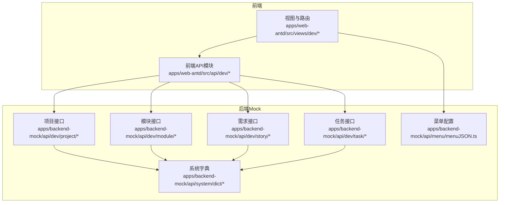
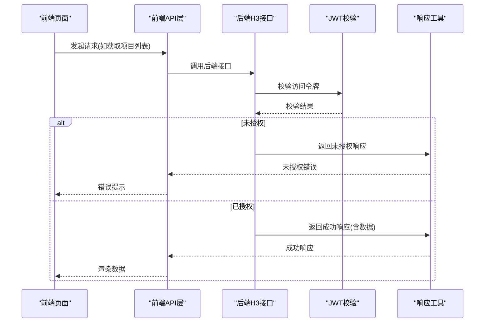
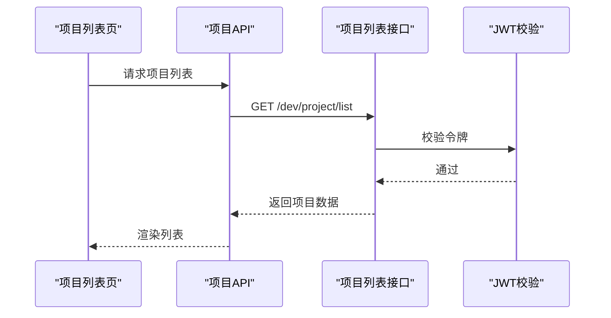
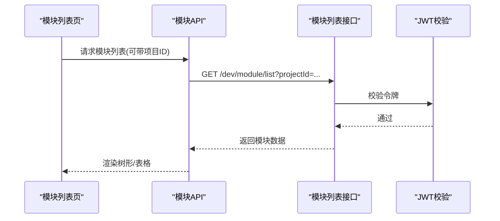
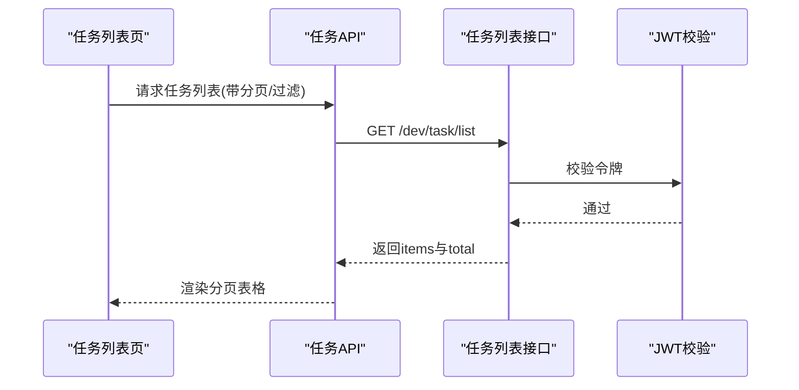
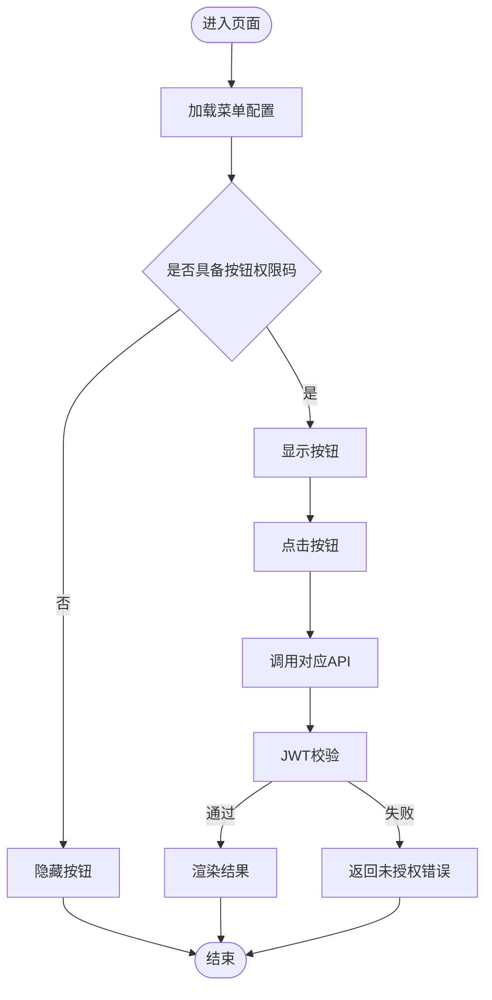
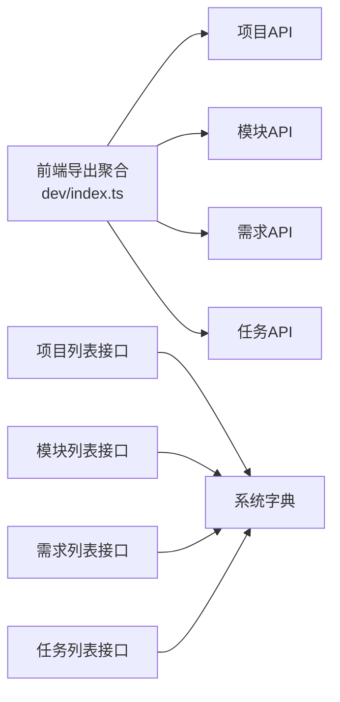
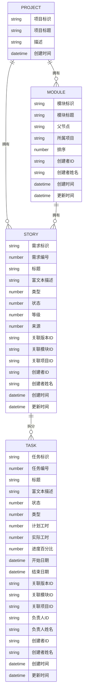

# 项目管理组件

<cite>
**本文引用的文件**
- [apps/web-antd/src/api/dev/index.ts](file://apps/web-antd/src/api/dev/index.ts)
- [apps/web-antd/src/api/dev/project.ts](file://apps/web-antd/src/api/dev/project.ts)
- [apps/web-antd/src/api/dev/module.ts](file://apps/web-antd/src/api/dev/module.ts)
- [apps/web-antd/src/api/dev/story.ts](file://apps/web-antd/src/api/dev/story.ts)
- [apps/web-antd/src/api/dev/task.ts](file://apps/web-antd/src/api/dev/task.ts)
- [apps/backend-mock/api/dev/project/list.ts](file://apps/backend-mock/api/dev/project/list.ts)
- [apps/backend-mock/api/dev/project/.post.ts](file://apps/backend-mock/api/dev/project/.post.ts)
- [apps/backend-mock/api/dev/module/list.ts](file://apps/backend-mock/api/dev/module/list.ts)
- [apps/backend-mock/api/dev/module/.post.ts](file://apps/backend-mock/api/dev/module/.post.ts)
- [apps/backend-mock/api/dev/story/list.ts](file://apps/backend-mock/api/dev/story/list.ts)
- [apps/backend-mock/api/dev/task/list.ts](file://apps/backend-mock/api/dev/task/list.ts)
- [apps/backend-mock/api/system/dict/list.ts](file://apps/backend-mock/api/system/dict/list.ts)
- [apps/backend-mock/api/menu/menuJSON.ts](file://apps/backend-mock/api/menu/menuJSON.ts)
</cite>

## 目录

1. [简介](#简介)
2. [项目结构](#项目结构)
3. [核心组件](#核心组件)
4. [架构总览](#架构总览)
5. [详细组件分析](#详细组件分析)
6. [依赖分析](#依赖分析)
7. [性能考虑](#性能考虑)
8. [故障排查指南](#故障排查指南)
9. [结论](#结论)
10. [附录](#附录)

## 简介

本文件面向“项目管理组件”的实现与使用，围绕项目主页展示、项目列表管理、项目新增与编辑、模块管理等核心能力进行系统化梳理。文档同时覆盖数据模型、生命周期管理、组织结构、配置项、API 接口、权限控制机制，并结合实际应用场景（项目创建、团队协作、资源分配、进度跟踪）给出实践建议。最后对组件与模块、故事、任务等下级组件的层级关系与数据关联进行说明，并提供扩展与定制开发指南及团队协作最佳实践。

## 项目结构

项目管理组件由前端 API 层与后端 Mock 层协同构成，前端通过统一请求客户端封装调用后端接口；后端以 H3 事件处理器形式提供 REST 风格接口，配合字典与菜单配置实现权限与页面导航控制。

图表来源

- [apps/web-antd/src/api/dev/index.ts:1-7](file://apps/web-antd/src/api/dev/index.ts#L1-L7)
- [apps/web-antd/src/api/dev/project.ts:1-49](file://apps/web-antd/src/api/dev/project.ts#L1-L49)
- [apps/web-antd/src/api/dev/module.ts:1-58](file://apps/web-antd/src/api/dev/module.ts#L1-L58)
- [apps/web-antd/src/api/dev/story.ts:1-91](file://apps/web-antd/src/api/dev/story.ts#L1-L91)
- [apps/web-antd/src/api/dev/task.ts:1-103](file://apps/web-antd/src/api/dev/task.ts#L1-L103)
- [apps/backend-mock/api/dev/project/list.ts:1-51](file://apps/backend-mock/api/dev/project/list.ts#L1-L51)
- [apps/backend-mock/api/dev/module/list.ts:1-74](file://apps/backend-mock/api/dev/module/list.ts#L1-L74)
- [apps/backend-mock/api/system/dict/list.ts:57-704](file://apps/backend-mock/api/system/dict/list.ts#L57-L704)
- [apps/backend-mock/api/menu/menuJSON.ts:134-185](file://apps/backend-mock/api/menu/menuJSON.ts#L134-L185)

章节来源

- [apps/web-antd/src/api/dev/index.ts:1-7](file://apps/web-antd/src/api/dev/index.ts#L1-L7)
- [apps/web-antd/src/api/dev/project.ts:1-49](file://apps/web-antd/src/api/dev/project.ts#L1-L49)
- [apps/web-antd/src/api/dev/module.ts:1-58](file://apps/web-antd/src/api/dev/module.ts#L1-L58)
- [apps/web-antd/src/api/dev/story.ts:1-91](file://apps/web-antd/src/api/dev/story.ts#L1-L91)
- [apps/web-antd/src/api/dev/task.ts:1-103](file://apps/web-antd/src/api/dev/task.ts#L1-L103)
- [apps/backend-mock/api/dev/project/list.ts:1-51](file://apps/backend-mock/api/dev/project/list.ts#L1-L51)
- [apps/backend-mock/api/dev/module/list.ts:1-74](file://apps/backend-mock/api/dev/module/list.ts#L1-L74)
- [apps/backend-mock/api/system/dict/list.ts:57-704](file://apps/backend-mock/api/system/dict/list.ts#L57-L704)
- [apps/backend-mock/api/menu/menuJSON.ts:134-185](file://apps/backend-mock/api/menu/menuJSON.ts#L134-L185)

## 核心组件

- 项目管理：负责项目主页展示、项目列表管理、项目新增与编辑。
- 模块管理：支持按项目维度筛选模块列表，提供模块新增与编辑。
- 故事（需求）管理：提供需求列表、详情查询、新增与编辑。
- 任务管理：提供任务列表、任务详情、按故事ID查询任务集合、新增与编辑。
- 字典与权限：通过系统字典维护状态、类型等枚举值；通过菜单配置与鉴权码控制页面与按钮权限。
- Mock 数据：后端提供基于 Faker 的模拟数据，便于前端联调与演示。

章节来源

- [apps/web-antd/src/api/dev/project.ts:18-49](file://apps/web-antd/src/api/dev/project.ts#L18-L49)
- [apps/web-antd/src/api/dev/module.ts:24-58](file://apps/web-antd/src/api/dev/module.ts#L24-L58)
- [apps/web-antd/src/api/dev/story.ts:49-91](file://apps/web-antd/src/api/dev/story.ts#L49-L91)
- [apps/web-antd/src/api/dev/task.ts:42-103](file://apps/web-antd/src/api/dev/task.ts#L42-L103)
- [apps/backend-mock/api/system/dict/list.ts:57-704](file://apps/backend-mock/api/system/dict/list.ts#L57-L704)
- [apps/backend-mock/api/menu/menuJSON.ts:134-185](file://apps/backend-mock/api/menu/menuJSON.ts#L134-L185)

## 架构总览

前端通过统一请求客户端封装 HTTP 调用，后端以 H3 事件处理器提供接口，接口在执行前进行访问令牌校验，成功后返回标准响应格式。字典与菜单配置为权限控制与页面渲染提供基础数据。

图表来源

- [apps/web-antd/src/api/dev/project.ts:18-22](file://apps/web-antd/src/api/dev/project.ts#L18-L22)
- [apps/backend-mock/api/dev/project/list.ts:37-50](file://apps/backend-mock/api/dev/project/list.ts#L37-L50)
- [apps/backend-mock/api/dev/project/.post.ts:9-16](file://apps/backend-mock/api/dev/project/.post.ts#L9-L16)
- [apps/backend-mock/api/dev/module/list.ts:54-73](file://apps/backend-mock/api/dev/module/list.ts#L54-L73)
- [apps/backend-mock/api/dev/module/.post.ts:9-16](file://apps/backend-mock/api/dev/module/.post.ts#L9-L16)

## 详细组件分析

### 项目管理模块

- 功能职责
  - 列表展示：分页或全量返回项目数据，字段包含标识、标题、描述、创建时间等。
  - 新增/编辑：提交项目信息，后端进行令牌校验与延迟响应模拟。
- 数据模型
  - 关键字段：项目标识、项目标题、项目图标、描述、创建/更新时间。
- 生命周期
  - 创建：提交新增请求 → 后端校验 → 延迟响应 → 成功。
  - 更新：提交更新请求 → 后端校验 → 延迟响应 → 成功。
- 权限控制
  - 接口层通过访问令牌校验，未授权返回未授权响应。
- 扩展建议
  - 支持项目成员管理、版本关联、统计看板等。

图表来源

- [apps/web-antd/src/api/dev/project.ts:18-22](file://apps/web-antd/src/api/dev/project.ts#L18-L22)
- [apps/backend-mock/api/dev/project/list.ts:37-50](file://apps/backend-mock/api/dev/project/list.ts#L37-L50)

章节来源

- [apps/web-antd/src/api/dev/project.ts:18-49](file://apps/web-antd/src/api/dev/project.ts#L18-L49)
- [apps/backend-mock/api/dev/project/list.ts:16-50](file://apps/backend-mock/api/dev/project/list.ts#L16-L50)
- [apps/backend-mock/api/dev/project/.post.ts:9-16](file://apps/backend-mock/api/dev/project/.post.ts#L9-L16)

### 模块管理模块

- 功能职责
  - 列表查询：支持按项目ID过滤模块列表。
  - 新增/编辑：提交模块信息，后端进行令牌校验与延迟响应模拟。
- 数据模型
  - 关键字段：模块标识、模块标题、父节点、所属项目、排序、创建者信息、创建/更新时间。
- 生命周期
  - 列表：可选传入项目ID → 过滤后返回模块数据。
  - 新增/更新：提交请求 → 校验 → 延迟响应 → 成功。
- 权限控制
  - 接口层通过访问令牌校验，未授权返回未授权响应。

图表来源

- [apps/web-antd/src/api/dev/module.ts:24-31](file://apps/web-antd/src/api/dev/module.ts#L24-L31)
- [apps/backend-mock/api/dev/module/list.ts:54-73](file://apps/backend-mock/api/dev/module/list.ts#L54-L73)
- [apps/backend-mock/api/dev/module/.post.ts:9-16](file://apps/backend-mock/api/dev/module/.post.ts#L9-L16)

章节来源

- [apps/web-antd/src/api/dev/module.ts:24-58](file://apps/web-antd/src/api/dev/module.ts#L24-L58)
- [apps/backend-mock/api/dev/module/list.ts:18-73](file://apps/backend-mock/api/dev/module/list.ts#L18-L73)
- [apps/backend-mock/api/dev/module/.post.ts:9-16](file://apps/backend-mock/api/dev/module/.post.ts#L9-L16)

### 故事（需求）管理模块

- 功能职责
  - 列表查询：支持分页与条件过滤。
  - 详情查询：根据需求编号获取详情。
  - 新增/编辑：提交需求信息。
- 数据模型
  - 关键字段：需求标识、编号、标题、富文本描述、类型/状态/等级、来源、关联版本/模块/项目、创建者、创建/更新时间、参与人列表等。
- 生命周期
  - 列表/详情：请求 → 校验 → 返回数据。
  - 新增/更新：请求 → 校验 → 延迟响应 → 成功。

章节来源

- [apps/web-antd/src/api/dev/story.ts:49-91](file://apps/web-antd/src/api/dev/story.ts#L49-L91)
- [apps/backend-mock/api/dev/story/list.ts](file://apps/backend-mock/api/dev/story/list.ts)

### 任务管理模块

- 功能职责
  - 列表查询：支持分页与条件过滤，返回条目与总数。
  - 详情查询：根据任务编号获取详情。
  - 按故事ID查询任务集合。
  - 新增/编辑：提交任务信息。
- 数据模型
  - 关键字段：任务标识、编号、标题、富文本描述、状态/类型、计划工时/实际工时、进度百分比、开始/结束日期、关联版本/模块/项目、负责人、创建者、创建/更新时间等。
- 生命周期
  - 列表/详情/按故事查询：请求 → 校验 → 返回数据。
  - 新增/更新：请求 → 校验 → 延迟响应 → 成功。

图表来源

- [apps/web-antd/src/api/dev/task.ts:42-49](file://apps/web-antd/src/api/dev/task.ts#L42-L49)
- [apps/backend-mock/api/dev/task/list.ts:64-101](file://apps/backend-mock/api/dev/task/list.ts#L64-L101)

章节来源

- [apps/web-antd/src/api/dev/task.ts:42-103](file://apps/web-antd/src/api/dev/task.ts#L42-L103)
- [apps/backend-mock/api/dev/task/list.ts:64-101](file://apps/backend-mock/api/dev/task/list.ts#L64-L101)

### 字典与权限控制

- 字典体系
  - 提供变更行为、变更类型、需求状态、需求来源、需求等级、需求类型、任务类型、任务状态、Bug级别、Bug类型、Bug来源等多类枚举字典，支撑前端下拉选择与状态展示。
- 权限控制
  - 菜单配置中包含按钮级权限码，用于控制页面按钮的可见与可操作性；接口层通过访问令牌校验保障后端安全。

图表来源

- [apps/backend-mock/api/system/dict/list.ts:57-704](file://apps/backend-mock/api/system/dict/list.ts#L57-L704)
- [apps/backend-mock/api/menu/menuJSON.ts:134-185](file://apps/backend-mock/api/menu/menuJSON.ts#L134-L185)
- [apps/web-antd/src/api/dev/project.ts:18-22](file://apps/web-antd/src/api/dev/project.ts#L18-L22)

章节来源

- [apps/backend-mock/api/system/dict/list.ts:57-704](file://apps/backend-mock/api/system/dict/list.ts#L57-L704)
- [apps/backend-mock/api/menu/menuJSON.ts:134-185](file://apps/backend-mock/api/menu/menuJSON.ts#L134-L185)

## 依赖分析

- 组件内聚与耦合
  - 前端 API 模块围绕 dev 子域聚合，职责清晰；后端接口按资源域划分，耦合度低。
  - 模块列表依赖项目数据进行过滤，体现跨资源的数据关联。
- 外部依赖
  - 前端统一请求客户端封装 HTTP 调用；后端使用 H3 事件处理器与响应工具。
- 循环依赖
  - 当前结构未见循环依赖迹象。

图表来源

- [apps/web-antd/src/api/dev/index.ts:1-7](file://apps/web-antd/src/api/dev/index.ts#L1-L7)
- [apps/web-antd/src/api/dev/project.ts:1-49](file://apps/web-antd/src/api/dev/project.ts#L1-L49)
- [apps/web-antd/src/api/dev/module.ts:1-58](file://apps/web-antd/src/api/dev/module.ts#L1-L58)
- [apps/web-antd/src/api/dev/story.ts:1-91](file://apps/web-antd/src/api/dev/story.ts#L1-L91)
- [apps/web-antd/src/api/dev/task.ts:1-103](file://apps/web-antd/src/api/dev/task.ts#L1-L103)
- [apps/backend-mock/api/dev/project/list.ts:1-51](file://apps/backend-mock/api/dev/project/list.ts#L1-L51)
- [apps/backend-mock/api/dev/module/list.ts:1-74](file://apps/backend-mock/api/dev/module/list.ts#L1-L74)
- [apps/backend-mock/api/system/dict/list.ts:57-704](file://apps/backend-mock/api/system/dict/list.ts#L57-L704)

章节来源

- [apps/web-antd/src/api/dev/index.ts:1-7](file://apps/web-antd/src/api/dev/index.ts#L1-L7)
- [apps/backend-mock/api/dev/project/list.ts:16-50](file://apps/backend-mock/api/dev/project/list.ts#L16-L50)
- [apps/backend-mock/api/dev/module/list.ts:18-73](file://apps/backend-mock/api/dev/module/list.ts#L18-L73)

## 性能考虑

- 前端
  - 使用统一请求客户端减少重复代码；合理设置分页参数，避免一次性加载过多数据。
  - 对高频查询进行防抖处理，降低后端压力。
- 后端
  - 接口层增加必要的校验与延迟响应，保证前后端联调体验；可引入缓存策略提升字典读取性能。
- 数据
  - Mock 数据采用结构化克隆与数组过滤，注意大数据量场景下的过滤开销。

## 故障排查指南

- 未授权访问
  - 现象：接口返回未授权错误。
  - 排查：确认访问令牌是否有效、是否过期；检查后端 JWT 校验逻辑。
- 列表为空
  - 现象：列表无数据或过滤后为空。
  - 排查：确认查询参数（如项目ID）是否正确；检查 Mock 数据生成逻辑与过滤条件。
- 响应延迟
  - 现象：接口响应较慢。
  - 排查：检查后端延迟响应配置；评估前端分页与查询频率。

章节来源

- [apps/backend-mock/api/dev/project/list.ts:37-50](file://apps/backend-mock/api/dev/project/list.ts#L37-L50)
- [apps/backend-mock/api/dev/module/list.ts:54-73](file://apps/backend-mock/api/dev/module/list.ts#L54-L73)
- [apps/backend-mock/api/dev/project/.post.ts:9-16](file://apps/backend-mock/api/dev/project/.post.ts#L9-L16)
- [apps/backend-mock/api/dev/module/.post.ts:9-16](file://apps/backend-mock/api/dev/module/.post.ts#L9-L16)

## 结论

项目管理组件以清晰的前后端分层与资源域划分实现了项目主页、列表、新增编辑与模块管理等核心功能。通过字典与菜单配置，系统具备良好的权限控制与可扩展性。建议在后续迭代中完善统计看板、成员管理、版本联动与更细粒度的权限控制，以满足复杂项目的管理需求。

## 附录

### 数据模型与层级关系

- 项目
  - 关键字段：标识、标题、描述、创建时间等。
- 模块
  - 关键字段：标识、标题、父节点、所属项目、排序、创建者、创建/更新时间等。
- 故事（需求）
  - 关键字段：标识、编号、标题、富文本描述、类型/状态/等级、来源、关联版本/模块/项目、创建者、创建/更新时间、参与人列表等。
- 任务
  - 关键字段：标识、编号、标题、富文本描述、状态/类型、计划工时/实际工时、进度百分比、开始/结束日期、关联版本/模块/项目、负责人、创建者、创建/更新时间等。

图表来源

- [apps/web-antd/src/api/dev/project.ts:4-12](file://apps/web-antd/src/api/dev/project.ts#L4-L12)
- [apps/web-antd/src/api/dev/module.ts:5-16](file://apps/web-antd/src/api/dev/module.ts#L5-L16)
- [apps/web-antd/src/api/dev/story.ts:12-42](file://apps/web-antd/src/api/dev/story.ts#L12-L42)
- [apps/web-antd/src/api/dev/task.ts:5-35](file://apps/web-antd/src/api/dev/task.ts#L5-L35)

### API 接口清单

- 项目
  - GET /dev/project/list → 获取项目列表
  - POST /dev/project → 创建项目
  - PUT /dev/project/{id} → 更新项目
- 模块
  - GET /dev/module/list → 获取模块列表（可选参数：projectId）
  - POST /dev/module → 创建模块
  - PUT /dev/module/{id} → 更新模块
- 故事（需求）
  - GET /dev/story/list → 获取需求列表
  - GET /dev/story/get?storyNum={num} → 获取需求详情
  - POST /dev/story → 创建需求
  - PUT /dev/story/{id} → 更新需求
- 任务
  - GET /dev/task/list → 获取任务列表（返回 items 与 total）
  - GET /dev/task/get?taskNum={num} → 获取任务详情
  - GET /dev/task/taskListByStoryId → 按故事ID查询任务
  - POST /dev/task → 创建任务
  - PUT /dev/task/{id} → 更新任务

章节来源

- [apps/web-antd/src/api/dev/project.ts:18-49](file://apps/web-antd/src/api/dev/project.ts#L18-L49)
- [apps/web-antd/src/api/dev/module.ts:24-58](file://apps/web-antd/src/api/dev/module.ts#L24-L58)
- [apps/web-antd/src/api/dev/story.ts:49-91](file://apps/web-antd/src/api/dev/story.ts#L49-L91)
- [apps/web-antd/src/api/dev/task.ts:42-103](file://apps/web-antd/src/api/dev/task.ts#L42-L103)

### 配置选项与权限控制

- 字典配置
  - 变更行为、变更类型、需求状态、需求来源、需求等级、需求类型、任务类型、任务状态、Bug级别、Bug类型、Bug来源等。
- 菜单与按钮权限
  - 菜单配置包含按钮级权限码，用于控制页面按钮的可见与可操作性。
- 访问令牌
  - 所有接口在执行前进行访问令牌校验，未授权返回未授权响应。

章节来源

- [apps/backend-mock/api/system/dict/list.ts:57-704](file://apps/backend-mock/api/system/dict/list.ts#L57-L704)
- [apps/backend-mock/api/menu/menuJSON.ts:134-185](file://apps/backend-mock/api/menu/menuJSON.ts#L134-L185)
- [apps/backend-mock/api/dev/project/list.ts:37-50](file://apps/backend-mock/api/dev/project/list.ts#L37-L50)
- [apps/backend-mock/api/dev/module/list.ts:54-73](file://apps/backend-mock/api/dev/module/list.ts#L54-L73)

### 应用场景与最佳实践

- 项目创建
  - 使用项目新增接口创建项目，随后在模块管理中为项目建立模块结构。
- 团队协作
  - 在需求与任务层面标注负责人与参与人，利用字典中的状态与类型字段规范流程。
- 资源分配
  - 通过任务的计划工时与实际工时字段跟踪资源消耗，结合进度百分比进行可视化展示。
- 进度跟踪
  - 借助任务列表与按故事ID查询任务的能力，构建甘特图或看板视图，持续跟踪迭代进度。

### 扩展与定制开发指南

- 新增资源域
  - 在前端 dev 目录下新增 API 文件，遵循现有命名与导出规范；在后端 dev 目录下新增对应接口与数据生成逻辑。
- 权限扩展
  - 在菜单配置中新增权限码，并在接口层增加相应校验逻辑。
- 字典扩展
  - 在系统字典中新增枚举项，前端自动获得下拉选择与状态展示能力。
- 视图扩展
  - 在视图层引入新的页面组件，结合 API 与权限配置实现完整的 CRUD 流程。
