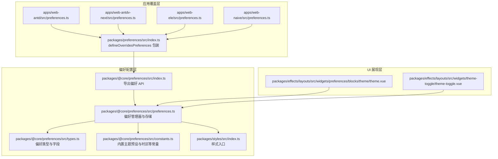
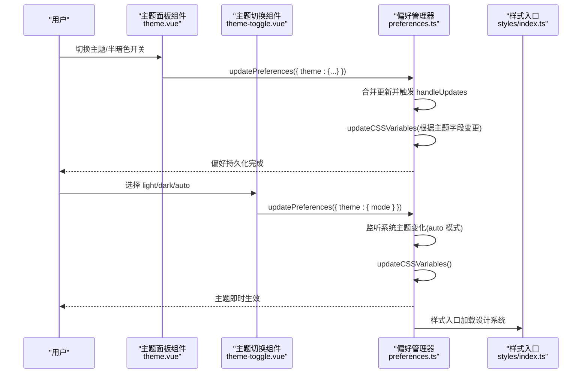
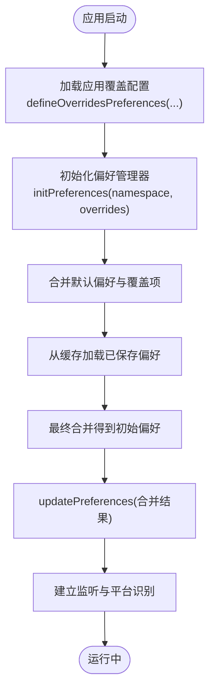
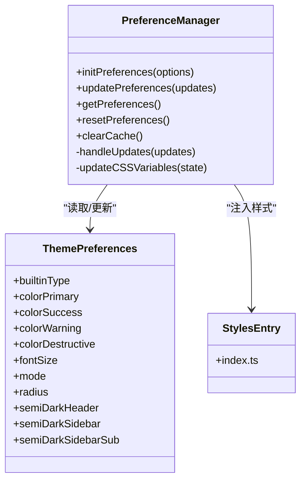
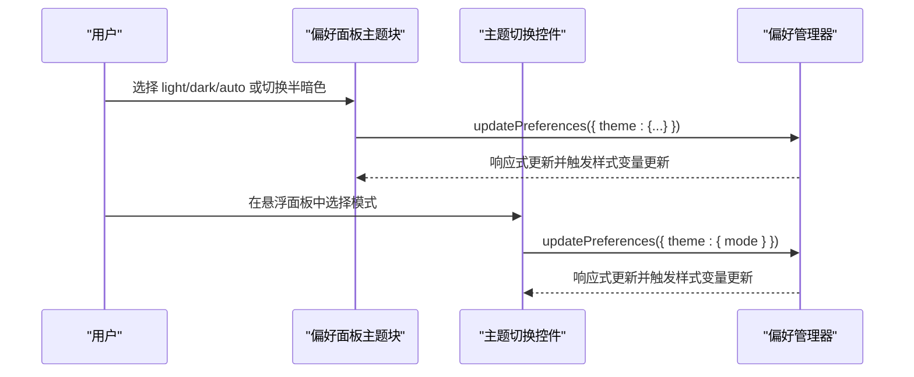
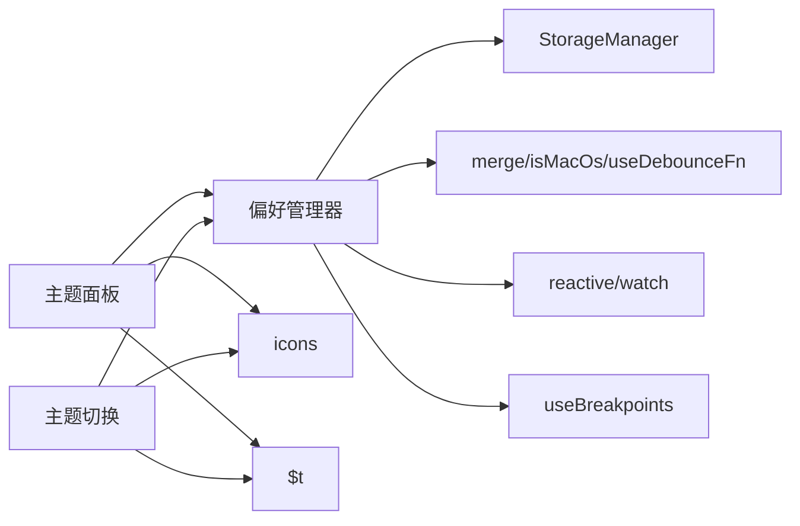

# 组件定制

<cite>
**本文引用的文件**
- [packages/preferences/src/index.ts](file://packages/preferences/src/index.ts)
- [apps/web-antd/src/preferences.ts](file://apps/web-antd/src/preferences.ts)
- [apps/web-antdv-next/src/preferences.ts](file://apps/web-antdv-next/src/preferences.ts)
- [apps/web-ele/src/preferences.ts](file://apps/web-ele/src/preferences.ts)
- [apps/web-naive/src/preferences.ts](file://apps/web-naive/src/preferences.ts)
- [packages/@core/preferences/src/index.ts](file://packages/@core/preferences/src/index.ts)
- [packages/@core/preferences/src/types.ts](file://packages/@core/preferences/src/types.ts)
- [packages/@core/preferences/src/constants.ts](file://packages/@core/preferences/src/constants.ts)
- [packages/@core/preferences/src/preferences.ts](file://packages/@core/preferences/src/preferences.ts)
- [packages/styles/src/index.ts](file://packages/styles/src/index.ts)
- [packages/effects/layouts/src/widgets/preferences/blocks/theme/theme.vue](file://packages/effects/layouts/src/widgets/preferences/blocks/theme/theme.vue)
- [packages/effects/layouts/src/widgets/theme-toggle/theme-toggle.vue](file://packages/effects/layouts/src/widgets/theme-toggle/theme-toggle.vue)
</cite>

## 目录
1. [简介](#简介)
2. [项目结构](#项目结构)
3. [核心组件](#核心组件)
4. [架构总览](#架构总览)
5. [详细组件分析](#详细组件分析)
6. [依赖分析](#依赖分析)
7. [性能考虑](#性能考虑)
8. [故障排查指南](#故障排查指南)
9. [结论](#结论)
10. [附录](#附录)

## 简介
本指南面向在 Vben Admin 中进行“组件定制”的开发者，围绕主题定制、样式覆盖、组件扩展与功能增强、组件偏好配置（颜色系统、字体、间距等）、样式自定义（CSS 变量、SCSS 变量、内联样式）、国际化与本地化、性能优化与最佳实践，提供系统化的方法论与可操作的步骤，并给出可直接定位到源码的路径指引，帮助你快速落地组件定制需求。

## 项目结构
Vben Admin 的组件定制能力由“偏好配置层”和“UI 展现层”共同构成：
- 偏好配置层：统一的偏好类型定义、默认值、存储与更新逻辑，以及各应用的覆盖配置入口。
- UI 展现层：提供主题切换、偏好设置面板等交互组件，驱动偏好变更并即时生效。

**图表来源**
- [packages/@core/preferences/src/index.ts:1-20](file://packages/@core/preferences/src/index.ts#L1-L20)
- [packages/@core/preferences/src/types.ts:296-323](file://packages/@core/preferences/src/types.ts#L296-L323)
- [packages/@core/preferences/src/constants.ts:1-117](file://packages/@core/preferences/src/constants.ts#L1-L117)
- [packages/@core/preferences/src/preferences.ts:1-235](file://packages/@core/preferences/src/preferences.ts#L1-L235)
- [packages/preferences/src/index.ts:1-18](file://packages/preferences/src/index.ts#L1-L18)
- [apps/web-antd/src/preferences.ts:1-31](file://apps/web-antd/src/preferences.ts#L1-L31)
- [apps/web-antdv-next/src/preferences.ts:1-14](file://apps/web-antdv-next/src/preferences.ts#L1-L14)
- [apps/web-ele/src/preferences.ts:1-14](file://apps/web-ele/src/preferences.ts#L1-L14)
- [apps/web-naive/src/preferences.ts:1-14](file://apps/web-naive/src/preferences.ts#L1-L14)
- [packages/styles/src/index.ts:1-2](file://packages/styles/src/index.ts#L1-L2)
- [packages/effects/layouts/src/widgets/preferences/blocks/theme/theme.vue:1-115](file://packages/effects/layouts/src/widgets/preferences/blocks/theme/theme.vue#L1-L115)
- [packages/effects/layouts/src/widgets/theme-toggle/theme-toggle.vue:1-84](file://packages/effects/layouts/src/widgets/theme-toggle/theme-toggle.vue#L1-L84)

**章节来源**
- [packages/@core/preferences/src/index.ts:1-20](file://packages/@core/preferences/src/index.ts#L1-L20)
- [packages/@core/preferences/src/types.ts:296-323](file://packages/@core/preferences/src/types.ts#L296-L323)
- [packages/@core/preferences/src/preferences.ts:1-235](file://packages/@core/preferences/src/preferences.ts#L1-L235)
- [packages/preferences/src/index.ts:1-18](file://packages/preferences/src/index.ts#L1-L18)
- [apps/web-antd/src/preferences.ts:1-31](file://apps/web-antd/src/preferences.ts#L1-L31)
- [apps/web-antdv-next/src/preferences.ts:1-14](file://apps/web-antdv-next/src/preferences.ts#L1-L14)
- [apps/web-ele/src/preferences.ts:1-14](file://apps/web-ele/src/preferences.ts#L1-L14)
- [apps/web-naive/src/preferences.ts:1-14](file://apps/web-naive/src/preferences.ts#L1-L14)
- [packages/styles/src/index.ts:1-2](file://packages/styles/src/index.ts#L1-L2)
- [packages/effects/layouts/src/widgets/preferences/blocks/theme/theme.vue:1-115](file://packages/effects/layouts/src/widgets/preferences/blocks/theme/theme.vue#L1-L115)
- [packages/effects/layouts/src/widgets/theme-toggle/theme-toggle.vue:1-84](file://packages/effects/layouts/src/widgets/theme-toggle/theme-toggle.vue#L1-L84)

## 核心组件
- 偏好配置 API：统一暴露 getPreferences、updatePreferences、resetPreferences、clearCache、initPreferences 等能力，便于在任意组件或服务中读取与更新偏好。
- 偏好类型系统：以强类型定义覆盖应用、面包屑、页脚、头部、Logo、导航、侧边栏、标签页、主题、过渡动画、小部件等模块的配置项。
- 偏好管理器：负责初始化、合并覆盖、持久化、响应式更新、系统主题监听、移动端识别、颜色模式（色弱/灰色）切换等。
- 样式入口：通过样式入口引入设计系统，确保主题变量与组件样式一致。
- 主题 UI 组件：提供偏好面板中的主题选择与半暗色开关，以及悬浮/弹出式主题切换控件。

**章节来源**
- [packages/@core/preferences/src/index.ts:5-11](file://packages/@core/preferences/src/index.ts#L5-L11)
- [packages/@core/preferences/src/types.ts:296-323](file://packages/@core/preferences/src/types.ts#L296-L323)
- [packages/@core/preferences/src/preferences.ts:25-100](file://packages/@core/preferences/src/preferences.ts#L25-L100)
- [packages/styles/src/index.ts:1-2](file://packages/styles/src/index.ts#L1-L2)
- [packages/effects/layouts/src/widgets/preferences/blocks/theme/theme.vue:1-115](file://packages/effects/layouts/src/widgets/preferences/blocks/theme/theme.vue#L1-L115)
- [packages/effects/layouts/src/widgets/theme-toggle/theme-toggle.vue:1-84](file://packages/effects/layouts/src/widgets/theme-toggle/theme-toggle.vue#L1-L84)

## 架构总览
下面的序列图展示了“用户在 UI 修改偏好 -> 偏好管理器持久化 -> 触发样式更新”的端到端流程。

**图表来源**
- [packages/effects/layouts/src/widgets/preferences/blocks/theme/theme.vue:1-115](file://packages/effects/layouts/src/widgets/preferences/blocks/theme/theme.vue#L1-L115)
- [packages/effects/layouts/src/widgets/theme-toggle/theme-toggle.vue:1-84](file://packages/effects/layouts/src/widgets/theme-toggle/theme-toggle.vue#L1-L84)
- [packages/@core/preferences/src/preferences.ts:120-152](file://packages/@core/preferences/src/preferences.ts#L120-L152)
- [packages/styles/src/index.ts:1-2](file://packages/styles/src/index.ts#L1-L2)

## 详细组件分析

### 偏好配置与覆盖机制
- 应用层通过 defineOverridesPreferences 定义覆盖项，仅需覆盖需要变更的部分，未覆盖字段自动采用默认值。
- 偏好管理器支持命名空间隔离、深度合并、防抖持久化、响应式更新与系统主题监听。
- 初始化时会合并 overrides 与默认偏好，再与缓存合并，最后写入响应式状态并建立监听。

**图表来源**
- [packages/preferences/src/index.ts:11-13](file://packages/preferences/src/index.ts#L11-L13)
- [apps/web-antd/src/preferences.ts:8-30](file://apps/web-antd/src/preferences.ts#L8-L30)
- [packages/@core/preferences/src/preferences.ts:70-100](file://packages/@core/preferences/src/preferences.ts#L70-L100)

**章节来源**
- [packages/preferences/src/index.ts:1-18](file://packages/preferences/src/index.ts#L1-L18)
- [apps/web-antd/src/preferences.ts:1-31](file://apps/web-antd/src/preferences.ts#L1-L31)
- [apps/web-antdv-next/src/preferences.ts:1-14](file://apps/web-antdv-next/src/preferences.ts#L1-L14)
- [apps/web-ele/src/preferences.ts:1-14](file://apps/web-ele/src/preferences.ts#L1-L14)
- [apps/web-naive/src/preferences.ts:1-14](file://apps/web-naive/src/preferences.ts#L1-L14)
- [packages/@core/preferences/src/preferences.ts:70-100](file://packages/@core/preferences/src/preferences.ts#L70-L100)

### 主题定制与样式覆盖
- 主题字段包括内置主题类型、主色/成功/警告/错误色、字号、圆角、明暗模式、半暗色开关等。
- 偏好更新时，若涉及主题相关字段，会触发 updateCSSVariables，将主题变量注入到 documentElement。
- 样式入口统一引入设计系统，保证组件样式与主题变量一致。

**图表来源**
- [packages/@core/preferences/src/types.ts:239-262](file://packages/@core/preferences/src/types.ts#L239-L262)
- [packages/@core/preferences/src/preferences.ts:136-152](file://packages/@core/preferences/src/preferences.ts#L136-L152)
- [packages/styles/src/index.ts:1-2](file://packages/styles/src/index.ts#L1-L2)

**章节来源**
- [packages/@core/preferences/src/types.ts:239-262](file://packages/@core/preferences/src/types.ts#L239-L262)
- [packages/@core/preferences/src/preferences.ts:136-152](file://packages/@core/preferences/src/preferences.ts#L136-L152)
- [packages/@core/preferences/src/constants.ts:10-79](file://packages/@core/preferences/src/constants.ts#L10-L79)
- [packages/styles/src/index.ts:1-2](file://packages/styles/src/index.ts#L1-L2)

### 主题 UI 组件
- 偏好面板主题块：提供明/暗/跟随系统三种模式选择，以及半暗色 Header/Sidebar/Sub 的开关联动。
- 主题切换控件：提供悬浮/弹出式切换，支持 hover 提示与单选组切换。

**图表来源**
- [packages/effects/layouts/src/widgets/preferences/blocks/theme/theme.vue:1-115](file://packages/effects/layouts/src/widgets/preferences/blocks/theme/theme.vue#L1-L115)
- [packages/effects/layouts/src/widgets/theme-toggle/theme-toggle.vue:1-84](file://packages/effects/layouts/src/widgets/theme-toggle/theme-toggle.vue#L1-L84)
- [packages/@core/preferences/src/preferences.ts:136-152](file://packages/@core/preferences/src/preferences.ts#L136-L152)

**章节来源**
- [packages/effects/layouts/src/widgets/preferences/blocks/theme/theme.vue:1-115](file://packages/effects/layouts/src/widgets/preferences/blocks/theme/theme.vue#L1-L115)
- [packages/effects/layouts/src/widgets/theme-toggle/theme-toggle.vue:1-84](file://packages/effects/layouts/src/widgets/theme-toggle/theme-toggle.vue#L1-L84)

### 组件偏好配置详解
- 应用级偏好：名称、默认首页、权限模式、紧凑模式、内容内边距、动态标题、检查更新、水印、z-index 等。
- 布局与导航：头部、侧边栏、标签页、面包屑、版权信息等。
- 主题与动画：内置主题、主色系、字号、圆角、明暗模式、页面过渡动画等。
- 小部件：语言切换、主题切换、全局搜索、通知、全屏、锁屏、时区等。

这些配置项均在类型定义中明确列出，可通过应用覆盖层进行按需覆盖。

**章节来源**
- [packages/@core/preferences/src/types.ts:21-90](file://packages/@core/preferences/src/types.ts#L21-L90)
- [packages/@core/preferences/src/types.ts:131-193](file://packages/@core/preferences/src/types.ts#L131-L193)
- [packages/@core/preferences/src/types.ts:296-323](file://packages/@core/preferences/src/types.ts#L296-L323)

### 样式自定义方法
- CSS 变量：偏好更新时自动注入主题变量，组件通过 CSS 变量读取颜色、字号、圆角等，实现无刷新主题切换。
- SCSS 变量：可在应用层的样式文件中覆盖设计系统提供的 SCSS 变量，以适配品牌色与设计规范。
- 内联样式：在极少数场景下，可通过内联样式进行局部覆盖，但建议优先使用 CSS 变量与类名控制。

**章节来源**
- [packages/@core/preferences/src/preferences.ts:136-152](file://packages/@core/preferences/src/preferences.ts#L136-L152)
- [packages/@core/preferences/src/constants.ts:10-79](file://packages/@core/preferences/src/constants.ts#L10-L79)

### 国际化与本地化
- 偏好面板与主题切换组件使用 $t 进行本地化文本渲染，主题模式名称与提示文案均来自语言包。
- 偏好管理器在持久化时会同步保存 app.locale，确保语言设置跨会话一致。

**章节来源**
- [packages/effects/layouts/src/widgets/preferences/blocks/theme/theme.vue:54-65](file://packages/effects/layouts/src/widgets/preferences/blocks/theme/theme.vue#L54-L65)
- [packages/effects/layouts/src/widgets/theme-toggle/theme-toggle.vue:36-52](file://packages/effects/layouts/src/widgets/theme-toggle/theme-toggle.vue#L36-L52)
- [packages/@core/preferences/src/preferences.ts:173-177](file://packages/@core/preferences/src/preferences.ts#L173-L177)

### 创建自定义组件与扩展现有功能
- 自定义组件：在应用层 components 目录下新增 Vue 组件，遵循现有命名与目录约定；通过偏好 API 读取主题与布局配置，实现与整体风格一致的外观。
- 扩展现有功能：在偏好面板或主题切换组件中增加新的开关或选项，调用 updatePreferences 更新对应字段，即可驱动样式与行为变化。

**章节来源**
- [packages/@core/preferences/src/index.ts:5-11](file://packages/@core/preferences/src/index.ts#L5-L11)
- [packages/@core/preferences/src/preferences.ts:120-130](file://packages/@core/preferences/src/preferences.ts#L120-L130)

## 依赖分析
- 偏好管理器依赖：
  - 存储管理：用于持久化偏好与语言/主题缓存。
  - 工具库：深度合并、平台检测、防抖函数。
  - 响应式：Vue 响应式系统与 VueUse 断点监听。
- UI 组件依赖：
  - 图标库：Sun/MoonStar/SunMoon 等。
  - 本地化：$t 文本翻译。
  - UI 组件库：ToggleGroup、Tooltip 等。

**图表来源**
- [packages/@core/preferences/src/preferences.ts:7-14](file://packages/@core/preferences/src/preferences.ts#L7-L14)
- [packages/effects/layouts/src/widgets/preferences/blocks/theme/theme.vue:8-10](file://packages/effects/layouts/src/widgets/preferences/blocks/theme/theme.vue#L8-L10)
- [packages/effects/layouts/src/widgets/theme-toggle/theme-toggle.vue:4-16](file://packages/effects/layouts/src/widgets/theme-toggle/theme-toggle.vue#L4-L16)

**章节来源**
- [packages/@core/preferences/src/preferences.ts:7-14](file://packages/@core/preferences/src/preferences.ts#L7-L14)
- [packages/effects/layouts/src/widgets/preferences/blocks/theme/theme.vue:8-10](file://packages/effects/layouts/src/widgets/preferences/blocks/theme/theme.vue#L8-L10)
- [packages/effects/layouts/src/widgets/theme-toggle/theme-toggle.vue:4-16](file://packages/effects/layouts/src/widgets/theme-toggle/theme-toggle.vue#L4-L16)

## 性能考虑
- 防抖持久化：对偏好更新进行 150ms 防抖，避免频繁写入缓存。
- 响应式最小化更新：仅当主题相关字段变更时才触发 CSS 变量更新，减少不必要的样式重算。
- 移动端识别：基于断点自动设置 isMobile，避免在桌面端执行移动端特有逻辑。
- 系统主题监听：在 auto 模式下监听系统主题变化，保证跟随系统且不阻塞主线程。

**章节来源**
- [packages/@core/preferences/src/preferences.ts:37-40](file://packages/@core/preferences/src/preferences.ts#L37-L40)
- [packages/@core/preferences/src/preferences.ts:136-152](file://packages/@core/preferences/src/preferences.ts#L136-L152)
- [packages/@core/preferences/src/preferences.ts:187-217](file://packages/@core/preferences/src/preferences.ts#L187-L217)

## 故障排查指南
- 偏好不生效：
  - 确认已调用 initPreferences 并传入正确的命名空间。
  - 清空浏览器缓存后重试，避免旧缓存覆盖新配置。
- 主题切换无效：
  - 检查是否更新了 theme 字段，确保触发 updateCSSVariables。
  - 确认样式入口已正确引入设计系统。
- 语言切换未持久化：
  - 检查 app.locale 是否被写入缓存，确认缓存键存在。

**章节来源**
- [packages/@core/preferences/src/preferences.ts:46-48](file://packages/@core/preferences/src/preferences.ts#L46-L48)
- [packages/@core/preferences/src/preferences.ts:173-177](file://packages/@core/preferences/src/preferences.ts#L173-L177)

## 结论
通过“应用覆盖层 + 偏好管理器 + UI 展现层”的分层设计，Vben Admin 实现了灵活、可扩展、高性能的组件定制能力。开发者只需在应用层覆盖必要的偏好项，即可驱动主题、布局、动画与小部件的行为变化；同时，完善的类型系统与本地化支持，确保定制过程安全、一致且易于维护。

## 附录
- 快速定位参考
  - 应用覆盖入口：[apps/web-antd/src/preferences.ts:8-30](file://apps/web-antd/src/preferences.ts#L8-L30)
  - 偏好 API 导出：[packages/@core/preferences/src/index.ts:5-11](file://packages/@core/preferences/src/index.ts#L5-L11)
  - 偏好类型定义：[packages/@core/preferences/src/types.ts:296-323](file://packages/@core/preferences/src/types.ts#L296-L323)
  - 偏好管理器实现：[packages/@core/preferences/src/preferences.ts:25-100](file://packages/@core/preferences/src/preferences.ts#L25-L100)
  - 主题面板组件：[packages/effects/layouts/src/widgets/preferences/blocks/theme/theme.vue:1-115](file://packages/effects/layouts/src/widgets/preferences/blocks/theme/theme.vue#L1-L115)
  - 主题切换组件：[packages/effects/layouts/src/widgets/theme-toggle/theme-toggle.vue:1-84](file://packages/effects/layouts/src/widgets/theme-toggle/theme-toggle.vue#L1-L84)
  - 样式入口：[packages/styles/src/index.ts:1-2](file://packages/styles/src/index.ts#L1-L2)