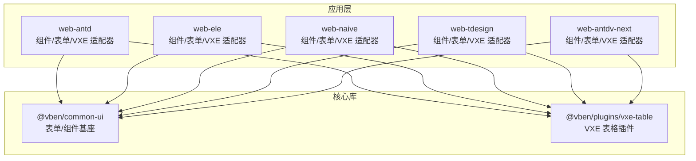
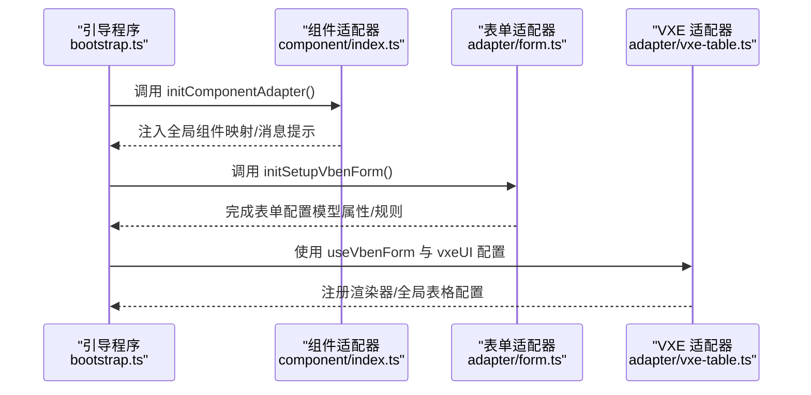
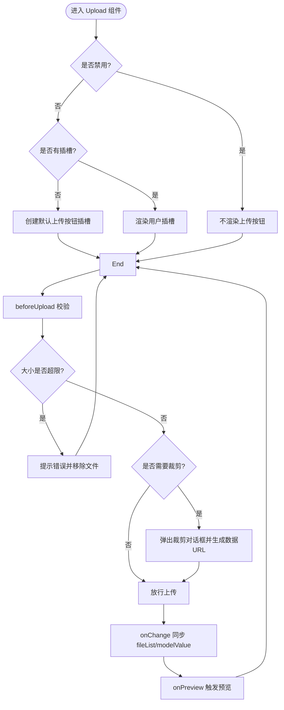
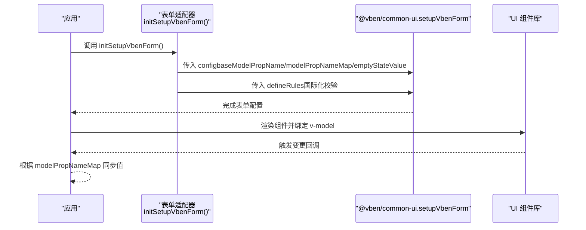
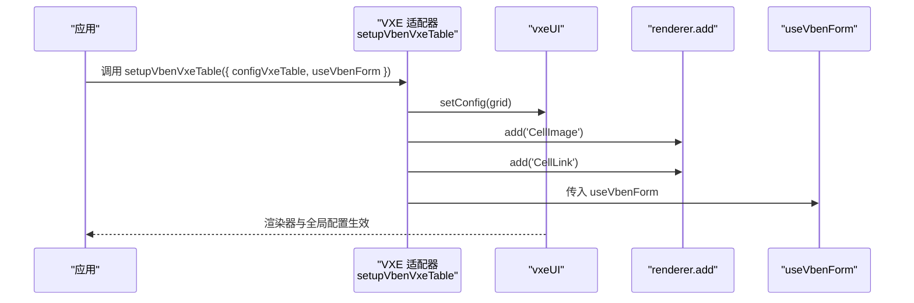
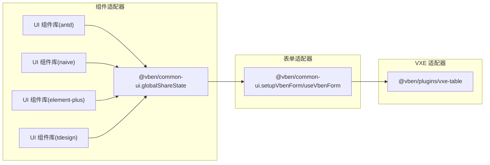

# 组件适配器

<cite>
**本文档引用的文件**
- [apps/web-antd/src/adapter/component/index.ts](file://apps/web-antd/src/adapter/component/index.ts)
- [apps/web-antd/src/adapter/form.ts](file://apps/web-antd/src/adapter/form.ts)
- [apps/web-antd/src/bootstrap.ts](file://apps/web-antd/src/bootstrap.ts)
- [apps/web-ele/src/adapter/form.ts](file://apps/web-ele/src/adapter/form.ts)
- [apps/web-ele/src/adapter/vxe-table.ts](file://apps/web-ele/src/adapter/vxe-table.ts)
- [apps/web-naive/src/adapter/form.ts](file://apps/web-naive/src/adapter/form.ts)
- [apps/web-naive/src/adapter/vxe-table.ts](file://apps/web-naive/src/adapter/vxe-table.ts)
- [apps/web-tdesign/src/adapter/form.ts](file://apps/web-tdesign/src/adapter/form.ts)
- [apps/web-tdesign/src/adapter/vxe-table.ts](file://apps/web-tdesign/src/adapter/vxe-table.ts)
- [apps/web-antdv-next/src/adapter/form.ts](file://apps/web-antdv-next/src/adapter/form.ts)
- [apps/web-antdv-next/src/adapter/vxe-table.ts](file://apps/web-antdv-next/src/adapter/vxe-table.ts)
</cite>

## 目录

1. [简介](#简介)
2. [项目结构](#项目结构)
3. [核心组件](#核心组件)
4. [架构总览](#架构总览)
5. [组件详解](#组件详解)
6. [依赖关系分析](#依赖关系分析)
7. [性能考量](#性能考量)
8. [故障排查指南](#故障排查指南)
9. [结论](#结论)
10. [附录](#附录)

## 简介

本文件系统性阐述 Vben Admin 的“组件适配器”架构，重点说明如何通过适配器模式统一接入不同 UI 框架（Ant Design Vue、Element Plus、Naive UI、TDesign），并覆盖以下主题：

- 设计原理：以“适配层”屏蔽 UI 差异，向上提供一致的组件类型与行为契约
- 实现机制：组件适配器、表单适配器、VXE 表格适配器三类适配器的职责边界与协作方式
- 扩展方法：如何为新 UI 框架添加适配器支持
- 配置选项与接口：模型属性映射、校验规则、消息提示等
- 性能优化与最佳实践：懒加载、事件隔离、内存清理
- 与核心组件的关系：与 @vben/common-ui、@vben/plugins/vxe-table 的集成关系

## 项目结构

Vben Admin 在每个 Web 应用子工程中均提供一套适配器目录，分别负责：

- 组件适配器：将 UI 组件库的原生组件封装为统一的组件类型集合，并注入全局共享状态
- 表单适配器：基于 @vben/common-ui 的表单能力，按 UI 框架差异配置模型属性名、校验规则等
- VXE 表格适配器：基于 @vben/plugins/vxe-table，按 UI 框架定制表格渲染器与全局配置

图表来源

- [apps/web-antd/src/bootstrap.ts:15-25](file://apps/web-antd/src/bootstrap.ts#L15-L25)
- [apps/web-antd/src/adapter/component/index.ts:526-608](file://apps/web-antd/src/adapter/component/index.ts#L526-L608)
- [apps/web-antd/src/adapter/form.ts:11-42](file://apps/web-antd/src/adapter/form.ts#L11-L42)
- [apps/web-ele/src/adapter/vxe-table.ts:1-72](file://apps/web-ele/src/adapter/vxe-table.ts#L1-L72)
- [apps/web-naive/src/adapter/vxe-table.ts:1-71](file://apps/web-naive/src/adapter/vxe-table.ts#L1-L71)
- [apps/web-tdesign/src/adapter/form.ts:11-42](file://apps/web-tdesign/src/adapter/form.ts#L11-L42)
- [apps/web-antdv-next/src/adapter/vxe-table.ts:1-71](file://apps/web-antdv-next/src/adapter/vxe-table.ts#L1-L71)

章节来源

- [apps/web-antd/src/bootstrap.ts:15-25](file://apps/web-antd/src/bootstrap.ts#L15-L25)

## 核心组件

- 组件适配器（Component Adapter）
  - 职责：将 UI 组件库的原生组件封装为统一的组件类型集合，注入全局共享状态；提供上传预览、裁剪、占位符等增强能力
  - 关键点：异步加载、默认占位符包装、上传预览组、图片裁剪、消息提示桥接
- 表单适配器（Form Adapter）
  - 职责：基于 @vben/common-ui 的 setupVbenForm/useVbenForm，按 UI 框架差异配置模型属性名映射、空值策略、校验规则
  - 关键点：baseModelPropName、modelPropNameMap、emptyStateValue、defineRules
- VXE 表格适配器（VXE Table Adapter）
  - 职责：基于 @vben/plugins/vxe-table，设置全局 grid 配置、注册单元格渲染器（如图片、链接）、注入 useVbenForm
  - 关键点：vxeUI.setConfig、renderer.add、proxyConfig、size、border、round 等

章节来源

- [apps/web-antd/src/adapter/component/index.ts:526-608](file://apps/web-antd/src/adapter/component/index.ts#L526-L608)
- [apps/web-antd/src/adapter/form.ts:11-42](file://apps/web-antd/src/adapter/form.ts#L11-L42)
- [apps/web-ele/src/adapter/vxe-table.ts:11-66](file://apps/web-ele/src/adapter/vxe-table.ts#L11-L66)
- [apps/web-naive/src/adapter/vxe-table.ts:11-66](file://apps/web-naive/src/adapter/vxe-table.ts#L11-L66)
- [apps/web-tdesign/src/adapter/form.ts:11-42](file://apps/web-tdesign/src/adapter/form.ts#L11-L42)
- [apps/web-antdv-next/src/adapter/vxe-table.ts:11-66](file://apps/web-antdv-next/src/adapter/vxe-table.ts#L11-L66)

## 架构总览

组件适配器在应用启动阶段初始化，随后被表单与 VXE 表格适配器消费，形成“UI 框架无关”的上层组件生态。

图表来源

- [apps/web-antd/src/bootstrap.ts:20-26](file://apps/web-antd/src/bootstrap.ts#L20-L26)
- [apps/web-antd/src/adapter/component/index.ts:526-608](file://apps/web-antd/src/adapter/component/index.ts#L526-L608)
- [apps/web-antd/src/adapter/form.ts:11-42](file://apps/web-antd/src/adapter/form.ts#L11-L42)
- [apps/web-ele/src/adapter/vxe-table.ts:11-66](file://apps/web-ele/src/adapter/vxe-table.ts#L11-L66)

## 组件详解

### 组件适配器（Component Adapter）

- 统一组件类型
  - 通过 ComponentType 聚合常用 UI 组件（输入、选择、日期、上传、图标选择、编辑器等），并可扩展 BaseFormComponentType
- 异步加载与默认占位符
  - 大组件采用 defineAsyncComponent 异步加载，减少首屏体积
  - withDefaultPlaceholder 包装组件，自动注入本地化占位符，提升可用性
- 上传组件增强
  - withPreviewUpload 提供：文件大小校验、图片裁剪（Modal + VCropper）、预览组（Image + ImagePreviewGroup）与非图片文件外链打开
  - 支持 listType 切换默认插槽样式，支持 aspectRatio 裁剪比例
- 全局消息提示桥接
  - 通过 globalShareState.defineMessage 注入复制成功等消息提示，统一 UI 框架的消息风格

图表来源

- [apps/web-antd/src/adapter/component/index.ts:378-491](file://apps/web-antd/src/adapter/component/index.ts#L378-L491)

章节来源

- [apps/web-antd/src/adapter/component/index.ts:526-608](file://apps/web-antd/src/adapter/component/index.ts#L526-L608)

### 表单适配器（Form Adapter）

- 模型属性映射
  - 不同 UI 框架对 v-model 的绑定字段不同，通过 modelPropNameMap 映射（如 Upload: fileList、Checkbox/Radio/Switch: checked）
  - baseModelPropName 作为默认映射（如 TDesign 默认 value）
- 空值策略
  - Naive UI 需要空值为 null，避免重置表单无效
- 校验规则
  - 定义 required、selectRequired 等规则，结合 $t 进行国际化提示

图表来源

- [apps/web-antd/src/adapter/form.ts:11-42](file://apps/web-antd/src/adapter/form.ts#L11-L42)
- [apps/web-ele/src/adapter/form.ts:11-34](file://apps/web-ele/src/adapter/form.ts#L11-L34)
- [apps/web-naive/src/adapter/form.ts:11-38](file://apps/web-naive/src/adapter/form.ts#L11-L38)
- [apps/web-tdesign/src/adapter/form.ts:11-42](file://apps/web-tdesign/src/adapter/form.ts#L11-L42)
- [apps/web-antdv-next/src/adapter/form.ts:11-42](file://apps/web-antdv-next/src/adapter/form.ts#L11-L42)

章节来源

- [apps/web-antd/src/adapter/form.ts:11-42](file://apps/web-antd/src/adapter/form.ts#L11-L42)
- [apps/web-ele/src/adapter/form.ts:11-34](file://apps/web-ele/src/adapter/form.ts#L11-L34)
- [apps/web-naive/src/adapter/form.ts:11-38](file://apps/web-naive/src/adapter/form.ts#L11-L38)
- [apps/web-tdesign/src/adapter/form.ts:11-42](file://apps/web-tdesign/src/adapter/form.ts#L11-L42)
- [apps/web-antdv-next/src/adapter/form.ts:11-42](file://apps/web-antdv-next/src/adapter/form.ts#L11-L42)

### VXE 表格适配器（VXE Table Adapter）

- 全局配置
  - 设置 grid 的 align/border/columnConfig/minHeight/proxyConfig/round/showOverflow/size 等
- 渲染器扩展
  - 注册 CellImage（展示图片）、CellLink（展示按钮链接），按 UI 框架选择对应组件（如 Naive Image/Button、Element Plus Image/Button、TDesign Button/Image）
- 与表单适配器联动
  - 通过 useVbenForm 注入统一的表单能力，避免 VXE 内置 formConfig 干扰

图表来源

- [apps/web-ele/src/adapter/vxe-table.ts:11-66](file://apps/web-ele/src/adapter/vxe-table.ts#L11-L66)
- [apps/web-naive/src/adapter/vxe-table.ts:11-66](file://apps/web-naive/src/adapter/vxe-table.ts#L11-L66)
- [apps/web-tdesign/src/adapter/vxe-table.ts:11-66](file://apps/web-tdesign/src/adapter/vxe-table.ts#L11-L66)
- [apps/web-antdv-next/src/adapter/vxe-table.ts:11-66](file://apps/web-antdv-next/src/adapter/vxe-table.ts#L11-L66)

章节来源

- [apps/web-ele/src/adapter/vxe-table.ts:11-66](file://apps/web-ele/src/adapter/vxe-table.ts#L11-L66)
- [apps/web-naive/src/adapter/vxe-table.ts:11-66](file://apps/web-naive/src/adapter/vxe-table.ts#L11-L66)
- [apps/web-tdesign/src/adapter/vxe-table.ts:11-66](file://apps/web-tdesign/src/adapter/vxe-table.ts#L11-L66)
- [apps/web-antdv-next/src/adapter/vxe-table.ts:11-66](file://apps/web-antdv-next/src/adapter/vxe-table.ts#L11-L66)

## 依赖关系分析

- 组件适配器依赖 UI 组件库（如 ant-design-vue、element-plus、naive-ui、tdesign-vue-next）与 @vben/common-ui 的共享状态
- 表单适配器依赖 @vben/common-ui 的 setupVbenForm/useVbenForm，并按 UI 框架差异注入配置
- VXE 适配器依赖 @vben/plugins/vxe-table，并在各 UI 框架下注册渲染器与全局配置

图表来源

- [apps/web-antd/src/adapter/component/index.ts:526-608](file://apps/web-antd/src/adapter/component/index.ts#L526-L608)
- [apps/web-antd/src/adapter/form.ts:11-42](file://apps/web-antd/src/adapter/form.ts#L11-L42)
- [apps/web-ele/src/adapter/vxe-table.ts:11-66](file://apps/web-ele/src/adapter/vxe-table.ts#L11-L66)
- [apps/web-naive/src/adapter/vxe-table.ts:11-66](file://apps/web-naive/src/adapter/vxe-table.ts#L11-L66)
- [apps/web-tdesign/src/adapter/form.ts:11-42](file://apps/web-tdesign/src/adapter/form.ts#L11-L42)
- [apps/web-antdv-next/src/adapter/vxe-table.ts:11-66](file://apps/web-antdv-next/src/adapter/vxe-table.ts#L11-L66)

## 性能考量

- 组件懒加载
  - 大组件通过 defineAsyncComponent 异步加载，降低首屏体积
- 事件与状态隔离
  - 上传组件内部维护 fileList 与 v-model 同步，避免外部处理器抛错导致的同步中断
- 内存与 DOM 清理
  - 预览组与裁剪对话框在关闭后延迟清理容器节点，确保动画完成后释放资源
- 上传预览优化
  - 仅对图片文件启用预览组，非图片文件直接外链打开，减少不必要的组件渲染

章节来源

- [apps/web-antd/src/adapter/component/index.ts:378-491](file://apps/web-antd/src/adapter/component/index.ts#L378-L491)

## 故障排查指南

- 上传文件大小限制不生效
  - 检查 beforeUpload 中的大小计算与提示文案是否正确
- 上传裁剪未触发或失败
  - 确认 crop 参数开启、单选且为图片类型；检查裁剪组件初始化与回调
- 预览组无法显示或点击无响应
  - 确认 isImageFile 判断逻辑与图片 URL/preview 生成流程
- 表单重置无效（Naive UI）
  - 确认 emptyStateValue 设置为 null，避免 undefined 导致重置失效
- VXE 表格渲染器不生效
  - 检查 renderer.add 是否在 setupVbenVxeTable 中调用，以及 UI 组件导入是否匹配当前框架

章节来源

- [apps/web-antd/src/adapter/component/index.ts:400-428](file://apps/web-antd/src/adapter/component/index.ts#L400-L428)
- [apps/web-antd/src/adapter/form.ts:14-23](file://apps/web-antd/src/adapter/form.ts#L14-L23)
- [apps/web-ele/src/adapter/vxe-table.ts:41-60](file://apps/web-ele/src/adapter/vxe-table.ts#L41-L60)
- [apps/web-naive/src/adapter/form.ts:14-21](file://apps/web-naive/src/adapter/form.ts#L14-L21)

## 结论

组件适配器通过“统一类型 + 异步封装 + 框架差异化配置”，有效屏蔽 UI 框架差异，使上层表单与表格组件获得一致的行为体验。配合懒加载、事件隔离与内存清理等优化手段，可在保证易用性的同时兼顾性能与稳定性。

## 附录

### 为新 UI 框架添加适配器支持（步骤清单）

- 组件适配器
  - 在适配器目录创建 component/index.ts，定义 ComponentType 类型集合，封装常用组件并注入 globalShareState
  - 如需上传增强，参考现有 withPreviewUpload 的实现，补充裁剪与预览逻辑
- 表单适配器
  - 在适配器目录创建 adapter/form.ts，调用 setupVbenForm，配置 baseModelPropName、modelPropNameMap、emptyStateValue、defineRules
- VXE 表格适配器
  - 在适配器目录创建 adapter/vxe-table.ts，调用 setupVbenVxeTable，设置 grid 全局配置与 renderer.add，导入当前 UI 的 Button/Image 组件
- 应用引导
  - 在应用入口 bootstrap.ts 中，先 initComponentAdapter，再 initSetupVbenForm，最后挂载 UI 框架与插件

章节来源

- [apps/web-antd/src/bootstrap.ts:20-26](file://apps/web-antd/src/bootstrap.ts#L20-L26)
- [apps/web-antd/src/adapter/component/index.ts:526-608](file://apps/web-antd/src/adapter/component/index.ts#L526-L608)
- [apps/web-antd/src/adapter/form.ts:11-42](file://apps/web-antd/src/adapter/form.ts#L11-L42)
- [apps/web-ele/src/adapter/vxe-table.ts:11-66](file://apps/web-ele/src/adapter/vxe-table.ts#L11-L66)
- [apps/web-naive/src/adapter/form.ts:11-38](file://apps/web-naive/src/adapter/form.ts#L11-L38)
- [apps/web-tdesign/src/adapter/vxe-table.ts:11-66](file://apps/web-tdesign/src/adapter/vxe-table.ts#L11-L66)
