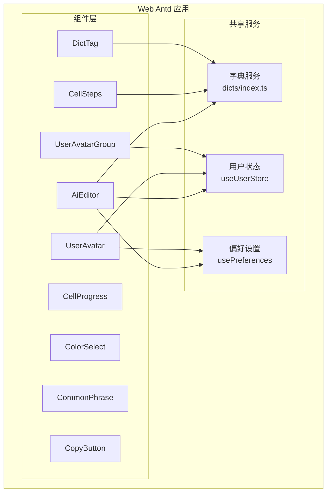
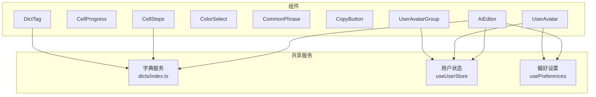
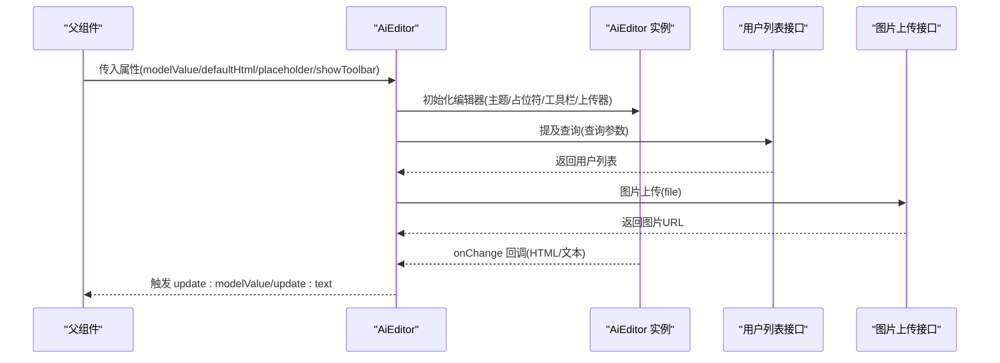
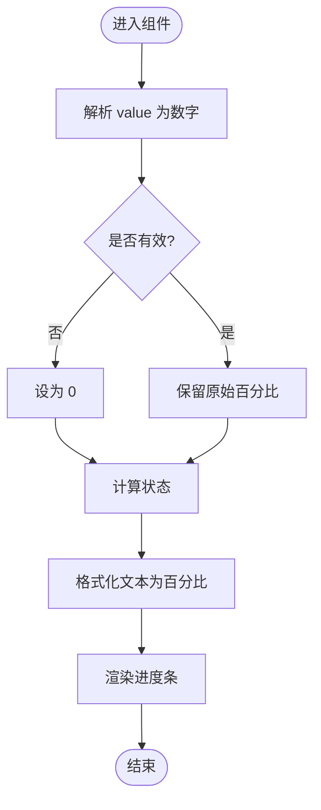
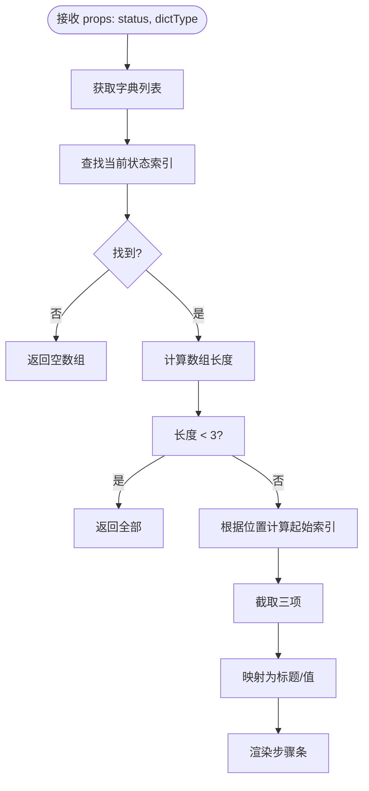
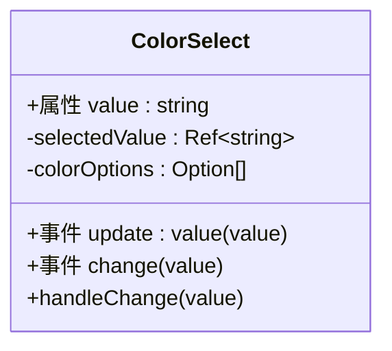
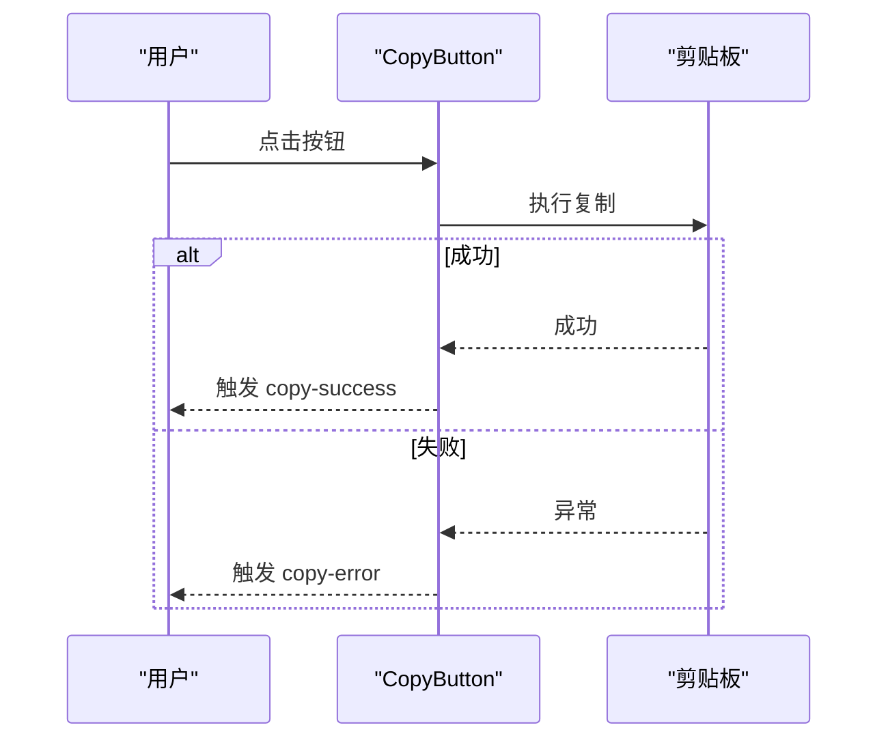
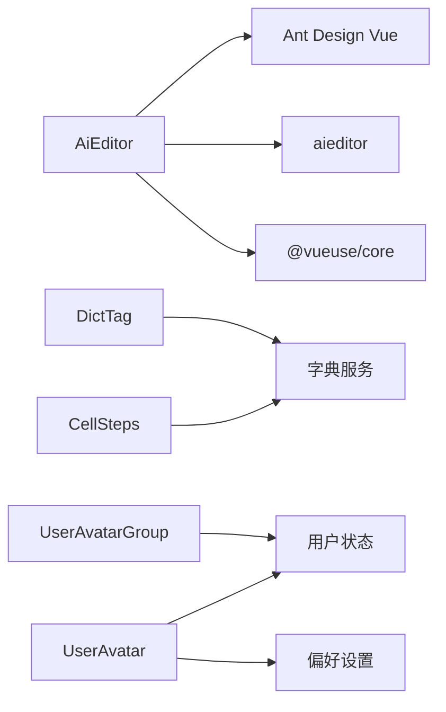

# 通用UI组件

<cite>
**本文引用的文件**
- [AiEditor/index.vue](file://apps/web-antd/src/components/AiEditor/index.vue)
- [CellProgress/index.vue](file://apps/web-antd/src/components/CellProgress/index.vue)
- [CellSteps/index.vue](file://apps/web-antd/src/components/CellSteps/index.vue)
- [ColorSelect/index.vue](file://apps/web-antd/src/components/ColorSelect/index.vue)
- [CommonPhrase/index.vue](file://apps/web-antd/src/components/CommonPhrase/index.vue)
- [CopyButton/index.vue](file://apps/web-antd/src/components/CopyButton/index.vue)
- [DictTag/index.vue](file://apps/web-antd/src/components/DictTag/index.vue)
- [UserAvatar/index.vue](file://apps/web-antd/src/components/UserAvatar/index.vue)
- [UserAvatarGroup/index.vue](file://apps/web-antd/src/components/UserAvatarGroup/index.vue)
- [dicts/index.ts](file://apps/web-antd/src/dicts/index.ts)
</cite>

## 目录

1. [简介](#简介)
2. [项目结构](#项目结构)
3. [核心组件](#核心组件)
4. [架构概览](#架构概览)
5. [详细组件分析](#详细组件分析)
6. [依赖分析](#依赖分析)
7. [性能考虑](#性能考虑)
8. [故障排查指南](#故障排查指南)
9. [结论](#结论)
10. [附录](#附录)

## 简介

本文件系统梳理 Vben Admin 项目中通用 UI 组件的设计与实现，重点覆盖以下组件：AiEditor 富文本编辑器、CellProgress 单元格进度条、CellSteps 步骤组件、ColorSelect 颜色选择器、CommonPhrase 常用短语、CopyButton 复制按钮、DictTag 字典标签、UserAvatar 用户头像、UserAvatarGroup 用户头像组。文档从属性配置、事件处理、插槽使用、样式定制、响应式与可访问性、跨浏览器兼容性、最佳实践与常见问题等方面进行说明，并通过图示与路径指引帮助读者快速定位源码与示例。

## 项目结构

这些通用组件位于 Web Antd 应用的组件目录下，采用按功能分层的组织方式，便于复用与维护。组件之间通过字典服务、偏好设置、用户状态等共享模块进行协作。

**图表来源**

- [AiEditor/index.vue:1-153](file://apps/web-antd/src/components/AiEditor/index.vue#L1-L153)
- [CellSteps/index.vue:1-93](file://apps/web-antd/src/components/CellSteps/index.vue#L1-L93)
- [DictTag/index.vue:1-20](file://apps/web-antd/src/components/DictTag/index.vue#L1-L20)
- [UserAvatar/index.vue:1-33](file://apps/web-antd/src/components/UserAvatar/index.vue#L1-L33)
- [UserAvatarGroup/index.vue:1-31](file://apps/web-antd/src/components/UserAvatarGroup/index.vue#L1-L31)
- [dicts/index.ts:1-76](file://apps/web-antd/src/dicts/index.ts#L1-L76)

**章节来源**

- [AiEditor/index.vue:1-153](file://apps/web-antd/src/components/AiEditor/index.vue#L1-L153)
- [CellProgress/index.vue:1-56](file://apps/web-antd/src/components/CellProgress/index.vue#L1-L56)
- [CellSteps/index.vue:1-93](file://apps/web-antd/src/components/CellSteps/index.vue#L1-L93)
- [ColorSelect/index.vue:1-76](file://apps/web-antd/src/components/ColorSelect/index.vue#L1-L76)
- [CommonPhrase/index.vue:1-31](file://apps/web-antd/src/components/CommonPhrase/index.vue#L1-L31)
- [CopyButton/index.vue:1-75](file://apps/web-antd/src/components/CopyButton/index.vue#L1-L75)
- [DictTag/index.vue:1-20](file://apps/web-antd/src/components/DictTag/index.vue#L1-L20)
- [UserAvatar/index.vue:1-33](file://apps/web-antd/src/components/UserAvatar/index.vue#L1-L33)
- [UserAvatarGroup/index.vue:1-31](file://apps/web-antd/src/components/UserAvatarGroup/index.vue#L1-L31)
- [dicts/index.ts:1-76](file://apps/web-antd/src/dicts/index.ts#L1-L76)

## 核心组件

本节对各组件的关键能力进行概述，便于快速了解其职责与适用场景。

- AiEditor 富文本编辑器：基于 aieditor 封装，支持提及用户、图片上传、占位符、工具栏开关、深浅主题切换、文本计数与双向绑定。
- CellProgress 单元格进度条：面向 vxe-table 单元格的进度展示组件，自动计算百分比与状态，统一格式化显示。
- CellSteps 步骤组件：根据字典类型与当前状态动态渲染步骤条，仅展示目标状态前后有限步数，适配表格列宽。
- ColorSelect 颜色选择器：基于 Ant Design Vue Select 的颜色枚举选择器，支持 v-model 与 change 事件。
- CommonPhrase 常用短语：展示文本列表，双击触发事件，结合省略文本组件提升可读性。
- CopyButton 复制按钮：封装剪贴板 API，提供复制成功/失败事件，支持图标与文本显隐。
- DictTag 字典标签：根据字典类型与值渲染带颜色的标签，简化字典展示。
- UserAvatar 用户头像：优先使用传入头像或用户信息头像，回退至应用默认头像；可选显示姓名与省略提示。
- UserAvatarGroup 用户头像组：展示用户列表的头像组，支持最大数量限制与悬浮提示。

**章节来源**

- [AiEditor/index.vue:1-153](file://apps/web-antd/src/components/AiEditor/index.vue#L1-L153)
- [CellProgress/index.vue:1-56](file://apps/web-antd/src/components/CellProgress/index.vue#L1-L56)
- [CellSteps/index.vue:1-93](file://apps/web-antd/src/components/CellSteps/index.vue#L1-L93)
- [ColorSelect/index.vue:1-76](file://apps/web-antd/src/components/ColorSelect/index.vue#L1-L76)
- [CommonPhrase/index.vue:1-31](file://apps/web-antd/src/components/CommonPhrase/index.vue#L1-L31)
- [CopyButton/index.vue:1-75](file://apps/web-antd/src/components/CopyButton/index.vue#L1-L75)
- [DictTag/index.vue:1-20](file://apps/web-antd/src/components/DictTag/index.vue#L1-L20)
- [UserAvatar/index.vue:1-33](file://apps/web-antd/src/components/UserAvatar/index.vue#L1-L33)
- [UserAvatarGroup/index.vue:1-31](file://apps/web-antd/src/components/UserAvatarGroup/index.vue#L1-L31)

## 架构概览

下图展示了通用组件与共享服务之间的交互关系，突出 AiEditor 与字典、用户、偏好设置的耦合，以及 DictTag、CellSteps 对字典服务的依赖。

**图表来源**

- [AiEditor/index.vue:1-153](file://apps/web-antd/src/components/AiEditor/index.vue#L1-L153)
- [CellSteps/index.vue:1-93](file://apps/web-antd/src/components/CellSteps/index.vue#L1-L93)
- [DictTag/index.vue:1-20](file://apps/web-antd/src/components/DictTag/index.vue#L1-L20)
- [UserAvatar/index.vue:1-33](file://apps/web-antd/src/components/UserAvatar/index.vue#L1-L33)
- [UserAvatarGroup/index.vue:1-31](file://apps/web-antd/src/components/UserAvatarGroup/index.vue#L1-L31)
- [dicts/index.ts:1-76](file://apps/web-antd/src/dicts/index.ts#L1-L76)

## 详细组件分析

### AiEditor 富文本编辑器

- 属性配置
  - modelValue：双向绑定的 HTML 内容
  - defaultHtml：初始化默认 HTML
  - width/height：容器尺寸
  - placeholder：占位符文本
  - showToolbar：是否显示工具栏
- 事件处理
  - update:modelValue：内容变更时触发
  - update:text：纯文本变更时触发
- 插槽使用
  - 无具名/命名插槽；通过工具栏配置与回调扩展
- 样式定制
  - 支持深浅主题切换
  - 工具栏尺寸与排除按钮可配置
  - 上传弹窗内容区域高度与滚动
- 关键流程
  - 挂载时初始化编辑器，设置占位符、主题、内容、工具栏、图片上传器与回调
  - 监听父组件 modelValue 变化，同步编辑器内容
  - 监听提及查询，调用用户列表接口
  - 销毁时释放资源

**图表来源**

- [AiEditor/index.vue:1-153](file://apps/web-antd/src/components/AiEditor/index.vue#L1-L153)

**章节来源**

- [AiEditor/index.vue:1-153](file://apps/web-antd/src/components/AiEditor/index.vue#L1-L153)

### CellProgress 单元格进度条

- 属性配置
  - value：当前值（Number），必填
- 事件处理
  - 无自定义事件
- 插槽使用
  - 无插槽
- 样式定制
  - 进度条宽度 100%，右侧留白，边距归零
  - 文本格式化为百分比字符串
- 关键逻辑
  - 计算百分比并校验 NaN
  - 根据百分比判定状态（异常/成功）

**图表来源**

- [CellProgress/index.vue:1-56](file://apps/web-antd/src/components/CellProgress/index.vue#L1-L56)

**章节来源**

- [CellProgress/index.vue:1-56](file://apps/web-antd/src/components/CellProgress/index.vue#L1-L56)

### CellSteps 步骤组件

- 属性配置
  - status：当前状态值
  - dictType：字典类型
- 事件处理
  - 无自定义事件
- 插槽使用
  - 无插槽
- 样式定制
  - 步骤条内联、小尺寸、占满宽度与固定高度
- 关键逻辑
  - 依据字典类型获取步骤列表
  - 查找当前状态索引，仅展示目标状态前后最多三项

**图表来源**

- [CellSteps/index.vue:1-93](file://apps/web-antd/src/components/CellSteps/index.vue#L1-L93)

**章节来源**

- [CellSteps/index.vue:1-93](file://apps/web-antd/src/components/CellSteps/index.vue#L1-L93)

### ColorSelect 颜色选择器

- 属性配置
  - value：当前选中颜色值（String）
- 事件处理
  - update:value：v-model 同步
  - change：选择变更
- 插槽使用
  - 无插槽
- 样式定制
  - 宽度 100%
  - 下拉项使用标签展示颜色
- 关键逻辑
  - 内部使用 ref 管理选中值
  - 监听外部 value 变化同步内部状态
  - 提供完整颜色枚举列表

**图表来源**

- [ColorSelect/index.vue:1-76](file://apps/web-antd/src/components/ColorSelect/index.vue#L1-L76)

**章节来源**

- [ColorSelect/index.vue:1-76](file://apps/web-antd/src/components/ColorSelect/index.vue#L1-L76)

### CommonPhrase 常用短语

- 属性配置
  - textList：文本数组（必填）
- 事件处理
  - dblClick(text)：双击某项触发
- 插槽使用
  - 无插槽
- 样式定制
  - 列表项垂直间距
  - 结合省略文本组件，溢出显示提示
- 关键逻辑
  - 遍历文本列表，逐项绑定双击事件

**章节来源**

- [CommonPhrase/index.vue:1-31](file://apps/web-antd/src/components/CommonPhrase/index.vue#L1-L31)

### CopyButton 复制按钮

- 属性配置
  - text：要复制的文本
  - showIcon：是否显示图标
  - showText：是否显示文本
- 事件处理
  - copy-success：复制成功
  - copy-error：复制失败
- 插槽使用
  - 无插槽
- 样式定制
  - 使用 Flex 布局与间距
  - 图标与文本条件渲染
- 关键逻辑
  - 使用剪贴板钩子执行复制
  - 暴露 copy 方法与 copied 状态

**图表来源**

- [CopyButton/index.vue:1-75](file://apps/web-antd/src/components/CopyButton/index.vue#L1-L75)

**章节来源**

- [CopyButton/index.vue:1-75](file://apps/web-antd/src/components/CopyButton/index.vue#L1-L75)

### DictTag 字典标签

- 属性配置
  - dictType：字典类型
  - value：字典值
- 事件处理
  - 无自定义事件
- 插槽使用
  - 无插槽
- 样式定制
  - 使用字典颜色渲染标签
- 关键逻辑
  - 通过字典服务获取行数据并渲染标签

**章节来源**

- [DictTag/index.vue:1-20](file://apps/web-antd/src/components/DictTag/index.vue#L1-L20)
- [dicts/index.ts:1-76](file://apps/web-antd/src/dicts/index.ts#L1-L76)

### UserAvatar 用户头像

- 属性配置
  - avatar：头像地址
  - name：显示姓名
- 事件处理
  - 无自定义事件
- 插槽使用
  - 无插槽
- 样式定制
  - 头像尺寸与最大尺寸约束
  - 名称省略与提示
- 关键逻辑
  - 优先使用传入头像或用户信息头像，否则使用应用默认头像
  - 名称存在时显示并启用省略提示

**章节来源**

- [UserAvatar/index.vue:1-33](file://apps/web-antd/src/components/UserAvatar/index.vue#L1-L33)

### UserAvatarGroup 用户头像组

- 属性配置
  - userList：用户数组（必填）
  - maxCount：最大显示数量
- 事件处理
  - 无自定义事件
- 插槽使用
  - 无插槽
- 样式定制
  - 头像组最大数量限制
  - 悬浮提示显示真实姓名
- 关键逻辑
  - 遍历用户列表渲染头像，首字母作为占位字符

**章节来源**

- [UserAvatarGroup/index.vue:1-31](file://apps/web-antd/src/components/UserAvatarGroup/index.vue#L1-L31)

## 依赖分析

- 组件间耦合
  - AiEditor 与字典、用户、偏好设置存在直接依赖
  - CellSteps、DictTag 依赖字典服务
  - UserAvatar 依赖用户状态与偏好设置
- 外部依赖
  - Ant Design Vue 组件库（Progress、Steps、Select、Tag、Avatar、Space、Typography 等）
  - aieditor 富文本编辑器
  - @vueuse/core 剪贴板钩子
- 循环依赖
  - 未发现循环依赖迹象

**图表来源**

- [AiEditor/index.vue:1-153](file://apps/web-antd/src/components/AiEditor/index.vue#L1-L153)
- [CellSteps/index.vue:1-93](file://apps/web-antd/src/components/CellSteps/index.vue#L1-L93)
- [DictTag/index.vue:1-20](file://apps/web-antd/src/components/DictTag/index.vue#L1-L20)
- [UserAvatar/index.vue:1-33](file://apps/web-antd/src/components/UserAvatar/index.vue#L1-L33)
- [UserAvatarGroup/index.vue:1-31](file://apps/web-antd/src/components/UserAvatarGroup/index.vue#L1-L31)
- [dicts/index.ts:1-76](file://apps/web-antd/src/dicts/index.ts#L1-L76)

**章节来源**

- [AiEditor/index.vue:1-153](file://apps/web-antd/src/components/AiEditor/index.vue#L1-L153)
- [CellSteps/index.vue:1-93](file://apps/web-antd/src/components/CellSteps/index.vue#L1-L93)
- [DictTag/index.vue:1-20](file://apps/web-antd/src/components/DictTag/index.vue#L1-L20)
- [UserAvatar/index.vue:1-33](file://apps/web-antd/src/components/UserAvatar/index.vue#L1-L33)
- [UserAvatarGroup/index.vue:1-31](file://apps/web-antd/src/components/UserAvatarGroup/index.vue#L1-L31)
- [dicts/index.ts:1-76](file://apps/web-antd/src/dicts/index.ts#L1-L76)

## 性能考虑

- 渲染优化
  - CellProgress 与 DictTag 仅做简单计算与渲染，开销低
  - CellSteps 仅在当前状态或字典类型变化时重算步骤列表
  - CommonPhrase 与 UserAvatarGroup 使用 v-for 遍历，建议传入稳定 key
- 资源管理
  - AiEditor 在卸载时销毁实例，避免内存泄漏
- 网络与异步
  - 提及查询与图片上传为异步操作，注意错误处理与加载状态
- 主题与样式
  - 通过偏好设置切换主题，减少重复渲染

[本节为通用指导，无需列出具体文件来源]

## 故障排查指南

- AiEditor
  - 无法显示工具栏：检查 showToolbar 与 toolbarExcludeKeys 配置
  - 图片上传失败：确认上传接口返回结构与字段一致
  - 提及用户列表为空：检查用户接口返回格式与查询参数
- CellSteps
  - 步骤不显示：确认 dictType 正确且字典已加载
  - 当前状态不在列表：检查状态值与字典 value 是否一致
- DictTag
  - 标签颜色不生效：确认字典行数据包含 color 字段
- UserAvatar
  - 头像不显示：检查 avatar/name 传入值与默认回退逻辑
- CopyButton
  - 复制失败：确认浏览器权限与安全上下文（HTTPS）

**章节来源**

- [AiEditor/index.vue:1-153](file://apps/web-antd/src/components/AiEditor/index.vue#L1-L153)
- [CellSteps/index.vue:1-93](file://apps/web-antd/src/components/CellSteps/index.vue#L1-L93)
- [DictTag/index.vue:1-20](file://apps/web-antd/src/components/DictTag/index.vue#L1-L20)
- [UserAvatar/index.vue:1-33](file://apps/web-antd/src/components/UserAvatar/index.vue#L1-L33)
- [CopyButton/index.vue:1-75](file://apps/web-antd/src/components/CopyButton/index.vue#L1-L75)

## 结论

上述通用组件围绕“易用、可复用、可扩展”的设计目标构建，通过与字典、用户、偏好设置等共享模块解耦，满足多场景下的 UI 需求。建议在实际业务中遵循组件的属性与事件约定，结合样式定制与错误处理，确保一致性与稳定性。

[本节为总结性内容，无需列出具体文件来源]

## 附录

- 最佳实践
  - 使用 v-model 与受控组件模式，避免直接操作 DOM
  - 对异步操作（上传、查询）提供加载与错误反馈
  - 合理使用省略文本与提示，兼顾可读性与可访问性
- 常见问题
  - 字典未加载导致标签为空：确保在组件挂载前完成字典初始化
  - 复制权限受限：在 HTTPS 环境下使用，或引导用户授权

[本节为通用指导，无需列出具体文件来源]
