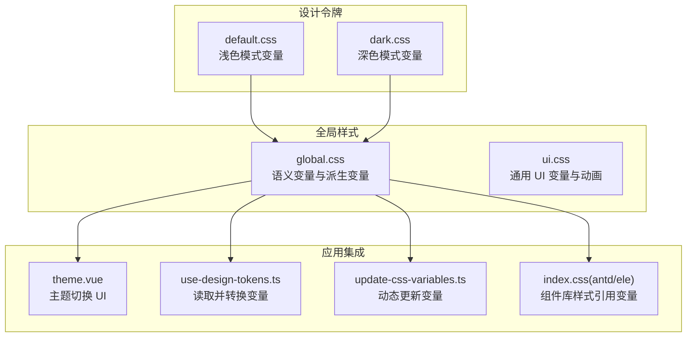
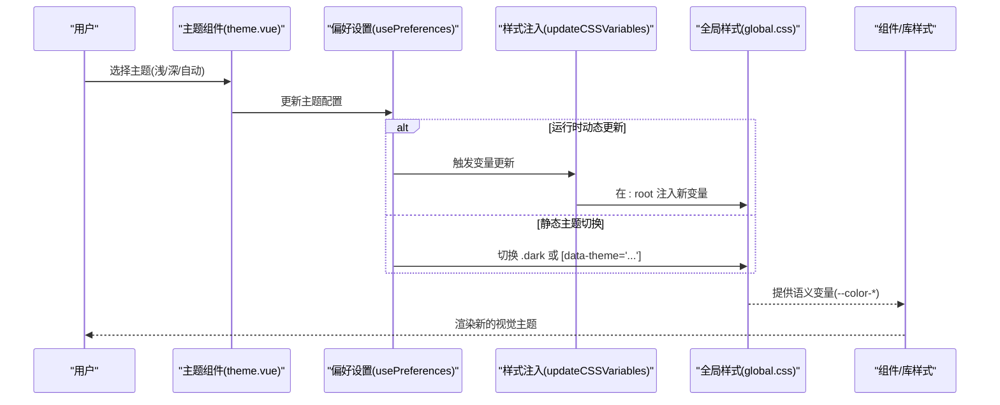
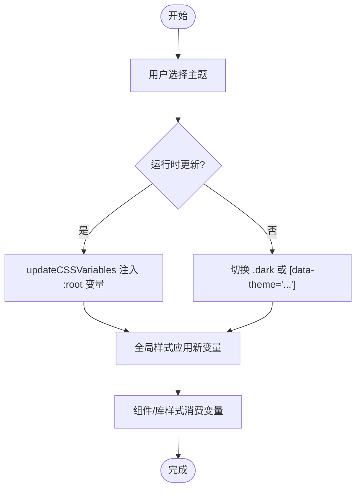
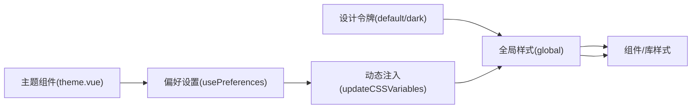

# CSS变量系统

<cite>
**本文档引用的文件**
- [default.css](file://packages/@core/base/design/src/design-tokens/default.css)
- [dark.css](file://packages/@core/base/design/src/design-tokens/dark.css)
- [global.css](file://packages/@core/base/design/src/css/global.css)
- [ui.css](file://packages/@core/base/design/src/css/ui.css)
- [theme.md](file://docs/src/guide/in-depth/theme.md)
- [theme.vue](file://packages/effects/layouts/src/widgets/preferences/blocks/theme/theme.vue)
- [index.css(antd)](file://packages/styles/src/antd/index.css)
- [index.css(ele)](file://packages/styles/src/ele/index.css)
- [update-css-variables.ts](file://packages/@core/base/shared/src/utils/update-css-variables.ts)
- [use-design-tokens.ts](file://packages/effects/hooks/src/use-design-tokens.ts)
</cite>

## 目录

1. [简介](#简介)
2. [项目结构](#项目结构)
3. [核心组件](#核心组件)
4. [架构总览](#架构总览)
5. [详细组件分析](#详细组件分析)
6. [依赖关系分析](#依赖关系分析)
7. [性能考量](#性能考量)
8. [故障排除指南](#故障排除指南)
9. [结论](#结论)
10. [附录](#附录)

## 简介

本文件系统性阐述 Vben Admin 的 CSS 变量体系，涵盖变量命名规范、层级结构、作用域管理、颜色组织（主色调、语义色、功能色）、布局变量（间距、圆角、阴影）以及继承与覆盖规则。同时提供变量使用最佳实践、在组件中的引用方式与动态修改方法，并给出具体变量定义与使用场景。

## 项目结构

Vben Admin 的 CSS 变量系统由“设计令牌”和“全局样式”两部分构成：

- 设计令牌：定义基础变量（浅色与深色模式），位于 design-tokens 目录
- 全局样式：将设计令牌映射为语义化变量与派生变量，统一注入到主题系统
- 文档与组件：通过文档说明变量规范，通过偏好设置组件与 hooks 动态切换主题

图表来源

- [default.css:1-384](file://packages/@core/base/design/src/design-tokens/default.css#L1-L384)
- [dark.css:1-447](file://packages/@core/base/design/src/design-tokens/dark.css#L1-L447)
- [global.css:17-234](file://packages/@core/base/design/src/css/global.css#L17-L234)
- [ui.css:85-87](file://packages/@core/base/design/src/css/ui.css#L85-L87)
- [theme.vue:18-47](file://packages/effects/layouts/src/widgets/preferences/blocks/theme/theme.vue#L18-L47)
- [use-design-tokens.ts:148-161](file://packages/effects/hooks/src/use-design-tokens.ts#L148-L161)
- [update-css-variables.ts:5-33](file://packages/@core/base/shared/src/utils/update-css-variables.ts#L5-L33)
- [index.css(antd):35-41](file://packages/styles/src/antd/index.css#L35-L41)

章节来源

- [default.css:1-384](file://packages/@core/base/design/src/design-tokens/default.css#L1-L384)
- [dark.css:1-447](file://packages/@core/base/design/src/design-tokens/dark.css#L1-L447)
- [global.css:17-234](file://packages/@core/base/design/src/css/global.css#L17-L234)
- [ui.css:1-102](file://packages/@core/base/design/src/css/ui.css#L1-L102)

## 核心组件

- 设计令牌（浅色/深色）
  - 定义基础变量：字体族、背景、前景、卡片、弹出层、主色、破坏色、成功色、警告色、次级色、强调色、边框、输入、焦点环、圆角、遮罩、字号、菜单与头部等
  - 深色模式通过 .dark 与 [data-theme='...'] 选择器覆盖浅色变量
- 全局样式（语义变量）
  - 将设计令牌变量映射为语义化变量（如 --color-background、--color-primary 等），并生成派生变量（如 --color-primary-50 到 --color-primary-700）
  - 注入动画、阴影、圆角等布局变量
- 主题切换与动态更新
  - 主题 UI 组件负责选择浅色/深色/自动
  - hooks 读取当前 CSS 变量并转换为 RGB/HSL 供组件库使用
  - 工具函数支持运行时动态更新 :root 变量

章节来源

- [default.css:1-123](file://packages/@core/base/design/src/design-tokens/default.css#L1-L123)
- [dark.css:1-108](file://packages/@core/base/design/src/design-tokens/dark.css#L1-L108)
- [global.css:43-234](file://packages/@core/base/design/src/css/global.css#L43-L234)
- [theme.vue:18-47](file://packages/effects/layouts/src/widgets/preferences/blocks/theme/theme.vue#L18-L47)
- [use-design-tokens.ts:123-161](file://packages/effects/hooks/src/use-design-tokens.ts#L123-L161)
- [update-css-variables.ts:5-33](file://packages/@core/base/shared/src/utils/update-css-variables.ts#L5-L33)

## 架构总览

CSS 变量系统采用“设计令牌 → 语义变量 → 组件引用”的分层架构。设计令牌提供原始 HSL 值；全局样式将其标准化为语义变量与派生色阶；组件与第三方 UI 库通过 CSS 变量或 hooks 读取并消费。

图表来源

- [theme.vue:25-47](file://packages/effects/layouts/src/widgets/preferences/blocks/theme/theme.vue#L25-L47)
- [update-css-variables.ts:5-33](file://packages/@core/base/shared/src/utils/update-css-variables.ts#L5-L33)
- [global.css:43-234](file://packages/@core/base/design/src/css/global.css#L43-L234)

## 详细组件分析

### 设计令牌（浅色/深色）

- 变量命名规范
  - 使用 HSL 格式的纯数值，不带 hsl() 与逗号
  - 采用语义化前缀：--background/--foreground/--card/--popover/--primary/--destructive/--success/--warning/--secondary/--accent/--border/--input/--ring/--radius/--overlay/--font-size-base/--menu/--header 等
- 浅色模式与深色模式
  - 浅色模式：:root 定义基础变量
  - 深色模式：.dark 与 [data-theme='...'] 覆盖关键变量，确保对比度与可读性
- 主题变体
  - 支持 default、violet、pink、rose、sky-blue、deep-blue、green、deep-green、orange、yellow、zinc、neutral、slate、gray 等内置主题，每种主题通过 [data-theme='...'] 覆盖主色与辅助色

章节来源

- [default.css:1-123](file://packages/@core/base/design/src/design-tokens/default.css#L1-L123)
- [dark.css:1-108](file://packages/@core/base/design/src/design-tokens/dark.css#L1-L108)
- [theme.md:299-318](file://docs/src/guide/in-depth/theme.md#L299-L318)

### 全局样式（语义变量与派生变量）

- 语义变量
  - 将设计令牌映射为 --color-background、--color-foreground、--color-card、--color-popover、--color-border、--color-input、--color-ring、--color-secondary 等
  - 主色系：--color-primary 及其 50/100/200/300/400/500/600/700/active/background-light/lighter/lightest/border/border-light/hover/text/text-active/text-hover
  - 语义色系：destructive/success/warning 及其对应色阶
- 派生变量
  - 圆角：--radius-sm/--radius-md/--radius-lg/--radius-xl
  - 阴影：--shadow-float
  - 动画：--animate-accordion-down/up、--animate-collapsible-down/up、--animate-float
- 基础样式
  - 通过 @layer base 设置全局盒模型、滚动条、视图过渡等

章节来源

- [global.css:17-234](file://packages/@core/base/design/src/css/global.css#L17-L234)
- [global.css:292-383](file://packages/@core/base/design/src/css/global.css#L292-L383)

### 主题切换与动态更新

- 主题 UI 组件
  - 提供浅色/深色/自动三态切换，支持半暗侧边栏与半暗头部
- hooks 读取变量
  - 从 document.documentElement 读取 CSS 变量，必要时转换为 RGB/HSL 供 Element Plus 等库使用
- 动态更新变量
  - 通过工具函数在 :root 注入新变量，实现无需刷新的主题切换

图表来源

- [theme.vue:25-47](file://packages/effects/layouts/src/widgets/preferences/blocks/theme/theme.vue#L25-L47)
- [update-css-variables.ts:5-33](file://packages/@core/base/shared/src/utils/update-css-variables.ts#L5-L33)
- [use-design-tokens.ts:163-192](file://packages/effects/hooks/src/use-design-tokens.ts#L163-L192)

章节来源

- [theme.vue:18-66](file://packages/effects/layouts/src/widgets/preferences/blocks/theme/theme.vue#L18-L66)
- [use-design-tokens.ts:123-161](file://packages/effects/hooks/src/use-design-tokens.ts#L123-L161)
- [update-css-variables.ts:5-33](file://packages/@core/base/shared/src/utils/update-css-variables.ts#L5-L33)

### 组件与第三方库的变量引用

- Ant Design Vue
  - 使用 hsl(var(--border))、hsl(var(--destructive)) 等直接引用语义变量
- Element Plus
  - 通过 hooks 将 CSS 变量转换为 Element Plus 所需的内部变量（如 --el-bg-color、--el-border-color 等）

章节来源

- [index.css(antd):35-41](file://packages/styles/src/antd/index.css#L35-L41)
- [index.css(antd):43-78](file://packages/styles/src/antd/index.css#L43-L78)
- [index.css(ele):1-45](file://packages/styles/src/ele/index.css#L1-L45)
- [use-design-tokens.ts:163-192](file://packages/effects/hooks/src/use-design-tokens.ts#L163-L192)

## 依赖关系分析

- 设计令牌 → 全局样式：全局样式依赖设计令牌提供的 HSL 原始值
- 全局样式 → 组件/库：组件与第三方库通过 CSS 变量或 hooks 消费语义变量
- 主题 UI → 偏好设置 → 样式注入：主题 UI 控制偏好设置，触发运行时注入或选择器切换

图表来源

- [default.css:1-123](file://packages/@core/base/design/src/design-tokens/default.css#L1-L123)
- [dark.css:1-108](file://packages/@core/base/design/src/design-tokens/dark.css#L1-L108)
- [global.css:43-234](file://packages/@core/base/design/src/css/global.css#L43-L234)
- [theme.vue:25-47](file://packages/effects/layouts/src/widgets/preferences/blocks/theme/theme.vue#L25-L47)
- [update-css-variables.ts:5-33](file://packages/@core/base/shared/src/utils/update-css-variables.ts#L5-L33)

章节来源

- [default.css:1-384](file://packages/@core/base/design/src/design-tokens/default.css#L1-L384)
- [dark.css:1-447](file://packages/@core/base/design/src/design-tokens/dark.css#L1-L447)
- [global.css:17-234](file://packages/@core/base/design/src/css/global.css#L17-L234)

## 性能考量

- 变量复用与派生：通过 @theme inline 一次性生成派生变量，减少重复计算
- 选择器覆盖：深色模式通过 .dark 与 [data-theme='...'] 覆盖，避免全量重绘
- 动态注入：仅在需要时注入 :root 变量，降低 DOM 操作成本
- 组件库桥接：hooks 读取一次变量并转换为库所需格式，避免频繁查询

## 故障排除指南

- 颜色格式错误
  - 症状：变量未生效或显示异常
  - 排查：确认变量值为 HSL 纯数值，不带 hsl() 与逗号
- 作用域优先级
  - 症状：深色模式变量未覆盖预期
  - 排查：确认 .dark 或 [data-theme='...'] 选择器优先级高于 :root
- 动态更新无效
  - 症状：运行时更新变量后界面未变化
  - 排查：检查注入的样式 ID 是否冲突，确认注入时机（建议在 head 中 append）
- 第三方库不识别
  - 症状：Element Plus 等库颜色不随主题变化
  - 排查：确认 hooks 已将 CSS 变量转换为库内部变量并正确写入

章节来源

- [theme.md:19-23](file://docs/src/guide/in-depth/theme.md#L19-L23)
- [update-css-variables.ts:5-33](file://packages/@core/base/shared/src/utils/update-css-variables.ts#L5-L33)
- [use-design-tokens.ts:163-192](file://packages/effects/hooks/src/use-design-tokens.ts#L163-L192)

## 结论

Vben Admin 的 CSS 变量系统以设计令牌为核心，通过全局样式标准化为语义变量与派生变量，并由主题组件与 hooks 实现灵活的主题切换与动态更新。该体系遵循 HSL 命名规范、清晰的作用域划分与覆盖规则，既保证了主题一致性，又便于扩展与维护。

## 附录

### 变量命名规范与层级结构

- 命名规范
  - HSL 纯数值：如 0 0% 100%
  - 语义化前缀：--background/--foreground/--card/--popover/--primary/--destructive/--success/--warning/--secondary/--accent/--border/--input/--ring/--radius/--overlay/--font-size-base/--menu/--header
- 层级结构
  - 原始变量（设计令牌）
  - 语义变量（全局样式）
  - 派生变量（色阶、阴影、圆角等）
  - 组件引用（CSS 变量或 hooks 转换）

章节来源

- [default.css:1-123](file://packages/@core/base/design/src/design-tokens/default.css#L1-L123)
- [dark.css:1-108](file://packages/@core/base/design/src/design-tokens/dark.css#L1-L108)
- [global.css:43-234](file://packages/@core/base/design/src/css/global.css#L43-L234)

### 颜色变量组织（主色调、语义色、功能色）

- 主色调：--primary 及其前景 --primary-foreground
- 语义色：--success、--warning、--destructive 及其前景与色阶
- 功能色：--accent、--accent-hover、--accent-lighter、--accent-dark、--accent-darker、--heavy、--heavy-foreground
- 辅助色：--secondary、--secondary-foreground、--muted、--muted-foreground、--border、--input、--input-placeholder、--input-background、--ring

章节来源

- [default.css:32-87](file://packages/@core/base/design/src/design-tokens/default.css#L32-L87)
- [dark.css:34-87](file://packages/@core/base/design/src/design-tokens/dark.css#L34-L87)
- [global.css:77-234](file://packages/@core/base/design/src/css/global.css#L77-L234)

### 布局变量（间距、圆角、阴影）

- 圆角：--radius、--radius-sm/--radius-md/--radius-lg/--radius-xl
- 阴影：--shadow-float
- 动画：--animate-accordion-down/up、--animate-collapsible-down/up、--animate-float
- 弹出层层级：--popup-z-index
- 字体与字号：--font-family、--font-size-base

章节来源

- [global.css:25-42](file://packages/@core/base/design/src/css/global.css#L25-L42)
- [ui.css:85-87](file://packages/@core/base/design/src/css/ui.css#L85-L87)

### 继承机制与覆盖规则

- 继承：组件通过 CSS 变量继承全局语义变量
- 覆盖：深色模式通过 .dark 与 [data-theme='...'] 覆盖设计令牌变量；运行时可通过注入 :root 变量即时覆盖

章节来源

- [default.css:1-123](file://packages/@core/base/design/src/design-tokens/default.css#L1-L123)
- [dark.css:1-108](file://packages/@core/base/design/src/design-tokens/dark.css#L1-L108)
- [update-css-variables.ts:5-33](file://packages/@core/base/shared/src/utils/update-css-variables.ts#L5-L33)

### 最佳实践与使用示例

- 在组件中引用
  - 直接使用语义变量：如 --color-primary、--color-background、--color-border
  - Ant Design Vue：使用 hsl(var(--destructive)) 等
  - Element Plus：通过 hooks 读取并转换为库内部变量
- 动态修改
  - 运行时注入：调用工具函数在 :root 注入变量
  - 主题切换：通过主题组件选择浅/深/自动，或在偏好设置中指定内置主题类型

章节来源

- [index.css(antd):35-78](file://packages/styles/src/antd/index.css#L35-L78)
- [index.css(ele):1-45](file://packages/styles/src/ele/index.css#L1-L45)
- [use-design-tokens.ts:163-192](file://packages/effects/hooks/src/use-design-tokens.ts#L163-L192)
- [update-css-variables.ts:5-33](file://packages/@core/base/shared/src/utils/update-css-variables.ts#L5-L33)
- [theme.vue:18-47](file://packages/effects/layouts/src/widgets/preferences/blocks/theme/theme.vue#L18-L47)
- [theme.md:247-275](file://docs/src/guide/in-depth/theme.md#L247-L275)
