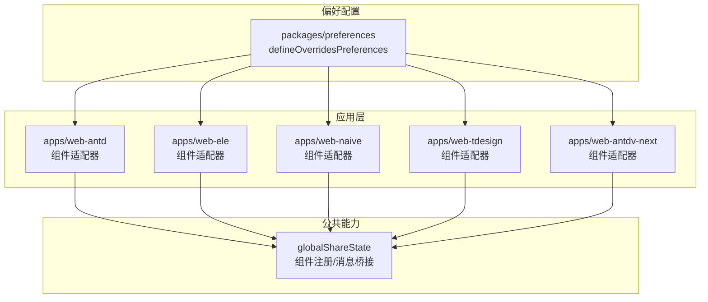
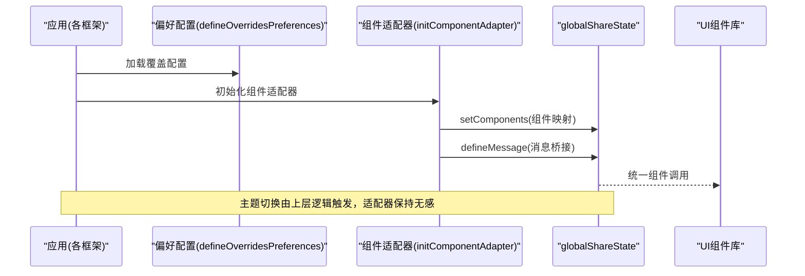
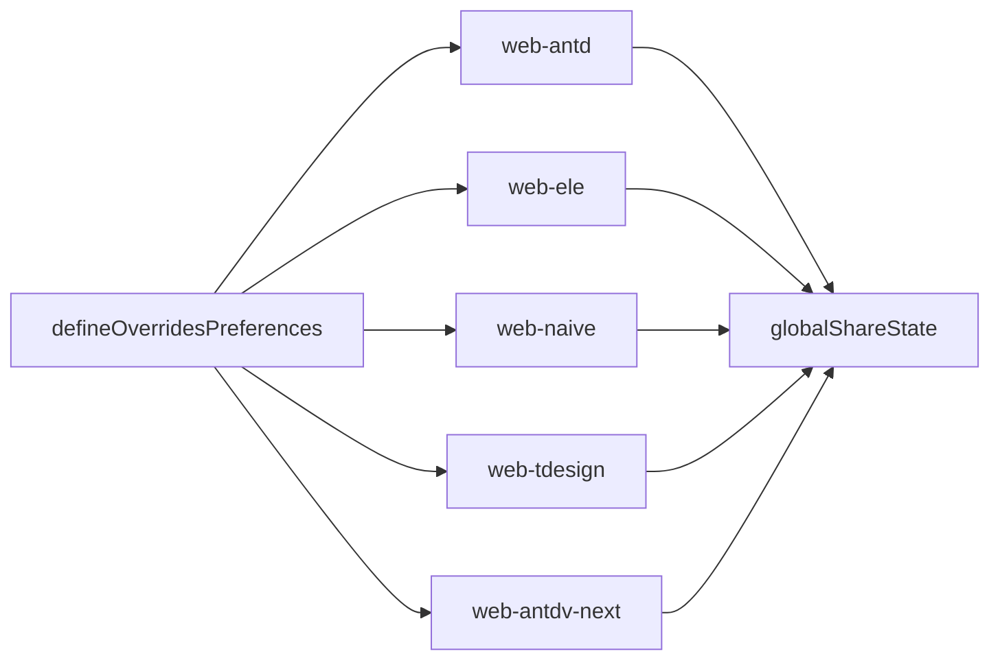

# UI框架主题适配

<cite>
**本文引用的文件**
- [apps/web-antd/src/preferences.ts](file://apps/web-antd/src/preferences.ts)
- [apps/web-ele/src/preferences.ts](file://apps/web-ele/src/preferences.ts)
- [apps/web-naive/src/preferences.ts](file://apps/web-naive/src/preferences.ts)
- [apps/web-tdesign/src/preferences.ts](file://apps/web-tdesign/src/preferences.ts)
- [apps/web-antdv-next/src/preferences.ts](file://apps/web-antdv-next/src/preferences.ts)
- [packages/preferences/src/index.ts](file://packages/preferences/src/index.ts)
- [apps/web-antd/src/adapter/component/index.ts](file://apps/web-antd/src/adapter/component/index.ts)
- [apps/web-ele/src/adapter/component/index.ts](file://apps/web-ele/src/adapter/component/index.ts)
- [apps/web-naive/src/adapter/component/index.ts](file://apps/web-naive/src/adapter/component/index.ts)
- [apps/web-tdesign/src/adapter/component/index.ts](file://apps/web-tdesign/src/adapter/component/index.ts)
</cite>

## 目录
1. [简介](#简介)
2. [项目结构](#项目结构)
3. [核心组件](#核心组件)
4. [架构总览](#架构总览)
5. [详细组件分析](#详细组件分析)
6. [依赖关系分析](#依赖关系分析)
7. [性能考量](#性能考量)
8. [故障排查指南](#故障排查指南)
9. [结论](#结论)
10. [附录](#附录)

## 简介
本文件面向Vben Admin多UI框架主题适配系统，系统性阐述适配器模式在主题与组件层的应用，如何统一不同UI框架（Ant Design、Element Plus、Naive UI、TDesign）的主题接口与组件行为，使上层业务逻辑与主题切换解耦。文档重点包括：
- 适配器模式在组件层的落地方式与职责边界
- 四大框架的主题变量映射关系与差异点
- 主题变量转换与映射机制，确保跨框架一致性体验
- 针对特定框架的主题定制步骤与注意事项
- 框架差异对比表与迁移指南

## 项目结构
Vben Admin采用“多应用”结构，每个前端应用对应一个UI框架，分别位于 apps/web-{framework}/src 下，核心适配逻辑集中在 adapter/component/index.ts 文件中；主题偏好配置通过各应用的 preferences.ts 统一管理。

图表来源
- [apps/web-antd/src/adapter/component/index.ts:526-608](file://apps/web-antd/src/adapter/component/index.ts#L526-L608)
- [apps/web-ele/src/adapter/component/index.ts:175-332](file://apps/web-ele/src/adapter/component/index.ts#L175-L332)
- [apps/web-naive/src/adapter/component/index.ts:121-232](file://apps/web-naive/src/adapter/component/index.ts#L121-L232)
- [apps/web-tdesign/src/adapter/component/index.ts:129-230](file://apps/web-tdesign/src/adapter/component/index.ts#L129-L230)
- [packages/preferences/src/index.ts:11-15](file://packages/preferences/src/index.ts#L11-L15)

章节来源
- [apps/web-antd/src/preferences.ts:1-31](file://apps/web-antd/src/preferences.ts#L1-L31)
- [apps/web-ele/src/preferences.ts:1-14](file://apps/web-ele/src/preferences.ts#L1-L14)
- [apps/web-naive/src/preferences.ts:1-14](file://apps/web-naive/src/preferences.ts#L1-L14)
- [apps/web-tdesign/src/preferences.ts:1-14](file://apps/web-tdesign/src/preferences.ts#L1-L14)
- [apps/web-antdv-next/src/preferences.ts:1-14](file://apps/web-antdv-next/src/preferences.ts#L1-L14)
- [packages/preferences/src/index.ts:1-18](file://packages/preferences/src/index.ts#L1-L18)

## 核心组件
- 偏好配置入口：defineOverridesPreferences 提供统一的偏好覆盖接口，各应用仅需覆盖所需字段，未覆盖项沿用默认值。
- 组件适配器：在各框架应用的 adapter/component/index.ts 中，通过 initComponentAdapter 注册组件映射与消息桥接，屏蔽底层UI库差异。
- 全局共享状态：globalShareState 负责组件注册与消息提示桥接，保证跨框架一致的行为体验。

章节来源
- [packages/preferences/src/index.ts:11-15](file://packages/preferences/src/index.ts#L11-L15)
- [apps/web-antd/src/adapter/component/index.ts:526-608](file://apps/web-antd/src/adapter/component/index.ts#L526-L608)
- [apps/web-ele/src/adapter/component/index.ts:175-332](file://apps/web-ele/src/adapter/component/index.ts#L175-L332)
- [apps/web-naive/src/adapter/component/index.ts:121-232](file://apps/web-naive/src/adapter/component/index.ts#L121-L232)
- [apps/web-tdesign/src/adapter/component/index.ts:129-230](file://apps/web-tdesign/src/adapter/component/index.ts#L129-L230)

## 架构总览
下图展示主题与组件适配的整体交互：应用偏好配置通过 defineOverridesPreferences 注入；组件适配器在启动时注册组件映射与消息桥接；globalShareState 作为中间层，向上提供统一接口，向下屏蔽UI库差异。

图表来源
- [packages/preferences/src/index.ts:11-15](file://packages/preferences/src/index.ts#L11-L15)
- [apps/web-antd/src/adapter/component/index.ts:526-608](file://apps/web-antd/src/adapter/component/index.ts#L526-L608)
- [apps/web-ele/src/adapter/component/index.ts:175-332](file://apps/web-ele/src/adapter/component/index.ts#L175-L332)
- [apps/web-naive/src/adapter/component/index.ts:121-232](file://apps/web-naive/src/adapter/component/index.ts#L121-L232)
- [apps/web-tdesign/src/adapter/component/index.ts:129-230](file://apps/web-tdesign/src/adapter/component/index.ts#L129-L230)

## 详细组件分析

### 适配器模式在组件层的应用
- 统一入口：initComponentAdapter 在各框架应用中负责注册组件映射与消息桥接，确保上层调用一致。
- 组件封装：通过 withDefaultPlaceholder 等高阶组件，统一样式占位符、事件名、模型属性等差异。
- 消息桥接：各框架的消息提示（如通知）通过 globalShareState.defineMessage 统一对外暴露。

章节来源
- [apps/web-antd/src/adapter/component/index.ts:103-135](file://apps/web-antd/src/adapter/component/index.ts#L103-L135)
- [apps/web-antd/src/adapter/component/index.ts:526-608](file://apps/web-antd/src/adapter/component/index.ts#L526-L608)
- [apps/web-ele/src/adapter/component/index.ts:121-153](file://apps/web-ele/src/adapter/component/index.ts#L121-L153)
- [apps/web-ele/src/adapter/component/index.ts:175-332](file://apps/web-ele/src/adapter/component/index.ts#L175-L332)
- [apps/web-naive/src/adapter/component/index.ts:67-99](file://apps/web-naive/src/adapter/component/index.ts#L67-L99)
- [apps/web-naive/src/adapter/component/index.ts:121-232](file://apps/web-naive/src/adapter/component/index.ts#L121-L232)
- [apps/web-tdesign/src/adapter/component/index.ts:66-98](file://apps/web-tdesign/src/adapter/component/index.ts#L66-L98)
- [apps/web-tdesign/src/adapter/component/index.ts:129-230](file://apps/web-tdesign/src/adapter/component/index.ts#L129-L230)

### Ant Design 适配要点
- 组件映射：通过 defineAsyncComponent 异步引入具体组件，避免首屏体积过大。
- 占位符与事件：统一使用 placeholder 与 visibleEvent 等约定，减少框架差异带来的调用复杂度。
- 上传组件增强：内置预览、裁剪、尺寸校验等能力，提升表单体验。
- 按钮类型：提供 DefaultButton 与 PrimaryButton 两类按钮封装，便于主题切换时统一风格。

章节来源
- [apps/web-antd/src/adapter/component/index.ts:42-93](file://apps/web-antd/src/adapter/component/index.ts#L42-L93)
- [apps/web-antd/src/adapter/component/index.ts:526-608](file://apps/web-antd/src/adapter/component/index.ts#L526-L608)

### Element Plus 适配要点
- 组件映射：使用 ElSelectV2、ElTreeSelect 等组件，结合 loadingSlot、visibleEvent 等属性统一行为。
- 分组组件：CheckboxGroup、RadioGroup 支持动态渲染选项，简化模板书写。
- 时间/日期选择：DatePicker、TimePicker 支持 range 类型自动拆分 name/id。
- 上传组件：直接使用 ElUpload，保持与 Element Plus 生态一致。

章节来源
- [apps/web-ele/src/adapter/component/index.ts:18-119](file://apps/web-ele/src/adapter/component/index.ts#L18-L119)
- [apps/web-ele/src/adapter/component/index.ts:175-332](file://apps/web-ele/src/adapter/component/index.ts#L175-L332)

### Naive UI 适配要点
- 组件映射：NSelect、NTreeSelect、NDatePicker 等组件按约定注入，支持 loadingSlot、visibleEvent 等。
- 分组组件：CheckboxGroup、RadioGroup 支持默认插槽与按钮样式组合。
- 按钮封装：DefaultButton 与 PrimaryButton 保持一致的类型语义。
- 上传组件：NUpload 直接使用，消息提示通过 message.success 统一。

章节来源
- [apps/web-naive/src/adapter/component/index.ts:18-65](file://apps/web-naive/src/adapter/component/index.ts#L18-L65)
- [apps/web-naive/src/adapter/component/index.ts:121-232](file://apps/web-naive/src/adapter/component/index.ts#L121-L232)

### TDesign 适配要点
- 组件映射：AutoComplete、Button、Select、TreeSelect、DatePicker 等组件按约定注入。
- 按钮变体：PrimaryButton 支持 theme/variant/ghost 等属性映射，满足多样式需求。
- 日期范围：RangePicker 通过 modelValue 默认值处理，兼容不同框架的双向绑定差异。
- 上传组件：TDesign Upload 直接使用，消息提示通过 notification.success 统一。

章节来源
- [apps/web-tdesign/src/adapter/component/index.ts:18-64](file://apps/web-tdesign/src/adapter/component/index.ts#L18-L64)
- [apps/web-tdesign/src/adapter/component/index.ts:129-230](file://apps/web-tdesign/src/adapter/component/index.ts#L129-L230)

### 主题变量映射与转换机制
- 统一入口：defineOverridesPreferences 返回的配置对象作为偏好覆盖，未覆盖字段沿用默认值，降低重复配置成本。
- 组件层映射：各框架适配器内部通过组件属性、事件名、模型属性的约定，将上层抽象统一到具体UI库。
- 消息层桥接：通过 globalShareState.defineMessage 统一消息提示，屏蔽各框架通知组件差异。

章节来源
- [packages/preferences/src/index.ts:11-15](file://packages/preferences/src/index.ts#L11-L15)
- [apps/web-antd/src/adapter/component/index.ts:595-604](file://apps/web-antd/src/adapter/component/index.ts#L595-L604)
- [apps/web-ele/src/adapter/component/index.ts:317-328](file://apps/web-ele/src/adapter/component/index.ts#L317-L328)
- [apps/web-naive/src/adapter/component/index.ts:221-228](file://apps/web-naive/src/adapter/component/index.ts#L221-L228)
- [apps/web-tdesign/src/adapter/component/index.ts:217-226](file://apps/web-tdesign/src/adapter/component/index.ts#L217-L226)

## 依赖关系分析
- 应用偏好配置依赖 packages/preferences 的 defineOverridesPreferences。
- 组件适配器依赖 globalShareState 进行组件注册与消息桥接。
- 各框架适配器独立维护，互不干扰，便于按需扩展或替换。

图表来源
- [packages/preferences/src/index.ts:11-15](file://packages/preferences/src/index.ts#L11-L15)
- [apps/web-antd/src/adapter/component/index.ts:591-608](file://apps/web-antd/src/adapter/component/index.ts#L591-L608)
- [apps/web-ele/src/adapter/component/index.ts:313-332](file://apps/web-ele/src/adapter/component/index.ts#L313-L332)
- [apps/web-naive/src/adapter/component/index.ts:217-232](file://apps/web-naive/src/adapter/component/index.ts#L217-L232)
- [apps/web-tdesign/src/adapter/component/index.ts:213-230](file://apps/web-tdesign/src/adapter/component/index.ts#L213-L230)

章节来源
- [packages/preferences/src/index.ts:1-18](file://packages/preferences/src/index.ts#L1-L18)
- [apps/web-antd/src/adapter/component/index.ts:526-608](file://apps/web-antd/src/adapter/component/index.ts#L526-L608)
- [apps/web-ele/src/adapter/component/index.ts:175-332](file://apps/web-ele/src/adapter/component/index.ts#L175-L332)
- [apps/web-naive/src/adapter/component/index.ts:121-232](file://apps/web-naive/src/adapter/component/index.ts#L121-L232)
- [apps/web-tdesign/src/adapter/component/index.ts:129-230](file://apps/web-tdesign/src/adapter/component/index.ts#L129-L230)

## 性能考量
- 组件懒加载：通过 defineAsyncComponent 异步引入组件，降低首屏体积与初始化时间。
- 事件与属性约定：统一事件名与模型属性，减少运行时适配开销。
- 消息桥接：集中定义消息提示，避免重复引入通知组件造成的包体积膨胀。

## 故障排查指南
- 配置未生效：确认已调用 defineOverridesPreferences 并在应用启动前加载；更改配置后需清理浏览器缓存。
- 组件不显示或报错：检查组件映射是否正确注册到 globalShareState，以及异步组件加载路径是否有效。
- 消息提示异常：核对 defineMessage 中的消息桥接是否与目标UI库一致。

章节来源
- [apps/web-antd/src/preferences.ts:6-7](file://apps/web-antd/src/preferences.ts#L6-L7)
- [apps/web-ele/src/preferences.ts:6-7](file://apps/web-ele/src/preferences.ts#L6-L7)
- [apps/web-naive/src/preferences.ts:6-7](file://apps/web-naive/src/preferences.ts#L6-L7)
- [apps/web-tdesign/src/preferences.ts:6-7](file://apps/web-tdesign/src/preferences.ts#L6-L7)
- [apps/web-antd/src/adapter/component/index.ts:595-604](file://apps/web-antd/src/adapter/component/index.ts#L595-L604)
- [apps/web-ele/src/adapter/component/index.ts:317-328](file://apps/web-ele/src/adapter/component/index.ts#L317-L328)
- [apps/web-naive/src/adapter/component/index.ts:221-228](file://apps/web-naive/src/adapter/component/index.ts#L221-L228)
- [apps/web-tdesign/src/adapter/component/index.ts:217-226](file://apps/web-tdesign/src/adapter/component/index.ts#L217-L226)

## 结论
Vben Admin通过 defineOverridesPreferences 与组件适配器模式，实现了跨UI框架的主题与组件一致性。各框架在组件层通过统一的映射与桥接策略，屏蔽了底层差异，使得主题切换与业务逻辑解耦，提升了可维护性与可扩展性。建议在新增或迁移UI框架时，遵循现有适配器模式，优先复用 globalShareState 的能力，确保跨框架体验一致。

## 附录

### 框架差异对比表
- 组件命名与属性
  - Ant Design：使用 visibleEvent、loadingSlot 等约定；按钮类型通过 type 区分。
  - Element Plus：使用 model-value、loading 等约定；分组组件支持默认插槽。
  - Naive UI：使用 suffix、arrow 等约定；分组组件支持按钮样式组合。
  - TDesign：使用 onDropdownVisibleChange、suffixIcon 等约定；按钮支持 theme/variant/ghost。
- 上传组件特性
  - Ant Design：内置预览、裁剪、尺寸校验；支持图片/非图片差异化处理。
  - Element Plus/Naive UI/TDesign：直接使用各自 Upload，按框架生态集成。
- 消息提示
  - Ant Design：notification.success；Element Plus：ElNotification；Naive UI：message.success；TDesign：notification.success。

章节来源
- [apps/web-antd/src/adapter/component/index.ts:526-608](file://apps/web-antd/src/adapter/component/index.ts#L526-L608)
- [apps/web-ele/src/adapter/component/index.ts:175-332](file://apps/web-ele/src/adapter/component/index.ts#L175-L332)
- [apps/web-naive/src/adapter/component/index.ts:121-232](file://apps/web-naive/src/adapter/component/index.ts#L121-L232)
- [apps/web-tdesign/src/adapter/component/index.ts:129-230](file://apps/web-tdesign/src/adapter/component/index.ts#L129-L230)

### 主题定制步骤与注意事项
- 步骤
  - 在应用的 preferences.ts 中调用 defineOverridesPreferences，仅覆盖需要的字段。
  - 如需新增组件映射或消息桥接，在对应框架的 adapter/component/index.ts 中扩展 initComponentAdapter。
  - 若需统一主题变量，可在 packages/preferences 中定义默认偏好，避免分散修改。
- 注意事项
  - 更改偏好后需清理浏览器缓存以确保新配置生效。
  - 组件映射应尽量遵循统一的属性/事件约定，减少跨框架差异。
  - 消息提示需与目标UI库的消息组件保持一致，避免样式与行为不一致。

章节来源
- [packages/preferences/src/index.ts:11-15](file://packages/preferences/src/index.ts#L11-L15)
- [apps/web-antd/src/preferences.ts:8-30](file://apps/web-antd/src/preferences.ts#L8-L30)
- [apps/web-ele/src/preferences.ts:8-13](file://apps/web-ele/src/preferences.ts#L8-L13)
- [apps/web-naive/src/preferences.ts:8-13](file://apps/web-naive/src/preferences.ts#L8-L13)
- [apps/web-tdesign/src/preferences.ts:8-13](file://apps/web-tdesign/src/preferences.ts#L8-L13)