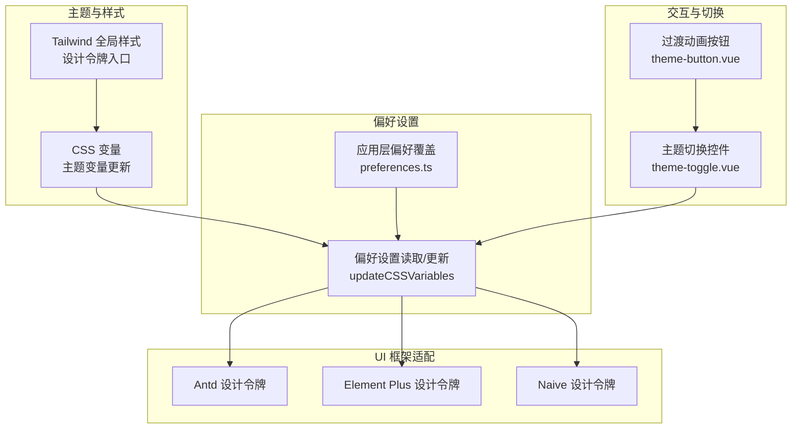
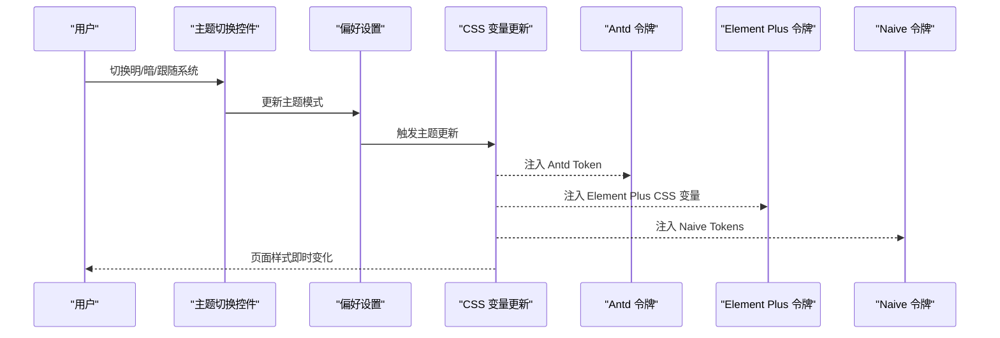
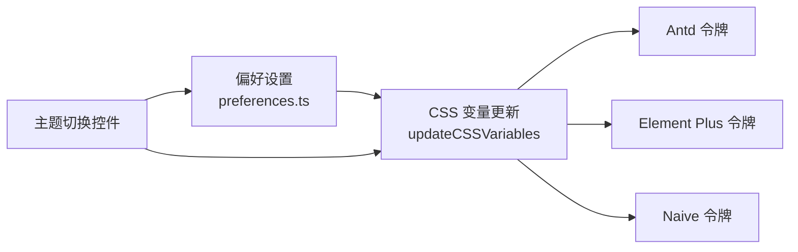

# 主题定制

<cite>
**本文引用的文件**   
- [use-design-tokens.ts](file://packages/effects/hooks/src/use-design-tokens.ts)
- [update-css-variables.ts](file://packages/@core/preferences/src/update-css-variables.ts)
- [theme.md](file://docs/src/guide/in-depth/theme.md)
- [theme-toggle.vue](file://packages/effects/layouts/src/widgets/theme-toggle/theme-toggle.vue)
- [theme-button.vue](file://packages/effects/layouts/src/widgets/theme-toggle/theme-button.vue)
- [global.css](file://packages/@core/base/design/src/css/global.css)
- [index.ts（设计令牌入口）](file://packages/@core/base/design/src/design-tokens/index.ts)
- [preferences.ts（web-antd 示例）](file://apps/web-antd/src/preferences.ts)
- [preferences.ts（@core/preferences）](file://packages/@core/preferences/src/preferences.ts)
- [component 适配器（web-antd）](file://apps/web-antd/src/adapter/component/index.ts)
- [component 适配器（web-ele）](file://apps/web-ele/src/adapter/component/index.ts)
- [component 适配器（web-naive）](file://apps/web-naive/src/adapter/component/index.ts)
</cite>

## 目录

1. [简介](#简介)
2. [项目结构](#项目结构)
3. [核心组件](#核心组件)
4. [架构总览](#架构总览)
5. [详细组件分析](#详细组件分析)
6. [依赖关系分析](#依赖关系分析)
7. [性能考量](#性能考量)
8. [故障排查指南](#故障排查指南)
9. [结论](#结论)
10. [附录](#附录)

## 简介

本文件面向 Vben Admin 主题定制系统，系统基于 shadcn-vue 与 Tailwind CSS 构建，采用 CSS 变量驱动的主题体系，并通过统一的偏好设置与设计令牌适配多 UI 框架（Ant Design、Element Plus、Naive UI 等）。文档涵盖：

- CSS 变量、Tailwind CSS 与 UI 框架样式的集成方式
- 主题变量配置与使用（颜色、字体、间距）
- 主题切换机制（动态样式加载与状态管理）
- 不同 UI 框架的主题适配策略
- 自定义主题创建流程与最佳实践
- 响应式与暗色主题支持

## 项目结构

围绕主题系统的关键目录与文件如下：

- 设计令牌与主题变量更新：packages/effects/hooks、packages/@core/preferences
- 文档与内置主题变量：docs/src/guide/in-depth/theme.md
- 主题切换控件：packages/effects/layouts/widgets/theme-toggle
- Tailwind 全局样式与设计令牌入口：packages/@core/base/design
- 应用层偏好设置示例：apps/web-\*/src/preferences.ts
- UI 框架组件适配器：apps/web-\*/src/adapter/component/index.ts

图示来源

- [update-css-variables.ts:12-129](file://packages/@core/preferences/src/update-css-variables.ts#L12-L129)
- [use-design-tokens.ts:10-321](file://packages/effects/hooks/src/use-design-tokens.ts#L10-L321)
- [global.css:1-43](file://packages/@core/base/design/src/css/global.css#L1-L43)
- [index.ts（设计令牌入口）:1-2](file://packages/@core/base/design/src/design-tokens/index.ts#L1-L2)
- [theme-toggle.vue:1-84](file://packages/effects/layouts/src/widgets/theme-toggle/theme-toggle.vue#L1-L84)
- [theme-button.vue:42-83](file://packages/effects/layouts/src/widgets/theme-toggle/theme-button.vue#L42-L83)

章节来源

- [update-css-variables.ts:12-129](file://packages/@core/preferences/src/update-css-variables.ts#L12-L129)
- [global.css:1-43](file://packages/@core/base/design/src/css/global.css#L1-L43)
- [index.ts（设计令牌入口）:1-2](file://packages/@core/base/design/src/design-tokens/index.ts#L1-L2)

## 核心组件

- CSS 变量与主题更新
  - 通过偏好设置读取主题配置，计算并更新根节点 CSS 变量，同时设置 .dark 类与 data-theme 属性，实现明暗主题与内置主题切换。
  - 支持将用户自定义主色映射到标准变量名，统一各 UI 框架使用。

- 设计令牌适配
  - Ant Design：将 CSS 变量映射为 Antd Token 结构，含主色、边框、容器背景、圆角等。
  - Element Plus：将 CSS 变量映射为 Element Plus CSS 变量集，覆盖背景、边框、文本、危险/成功/警告等系列色阶。
  - Naive UI：将 CSS 变量映射为 Naive Tokens，含主色、悬停/按下/补充色、文本、分隔线、卡片/气泡背景等。

- 主题切换控件
  - 提供明/暗/跟随系统三态切换，支持视图过渡动画，点击切换时触发偏好设置更新，进而驱动 CSS 变量与 UI 框架令牌刷新。

章节来源

- [update-css-variables.ts:12-129](file://packages/@core/preferences/src/update-css-variables.ts#L12-L129)
- [use-design-tokens.ts:10-321](file://packages/effects/hooks/src/use-design-tokens.ts#L10-L321)
- [theme-toggle.vue:1-84](file://packages/effects/layouts/src/widgets/theme-toggle/theme-toggle.vue#L1-L84)
- [theme-button.vue:42-83](file://packages/effects/layouts/src/widgets/theme-toggle/theme-button.vue#L42-L83)

## 架构总览

主题系统的核心流程：

- 用户在应用层 preferences 中覆盖主题配置
- 偏好设置变更触发 CSS 变量更新（含明暗模式、内置主题、主色映射）
- UI 框架适配层读取 CSS 变量，生成对应设计令牌
- 主题切换控件提供交互入口，联动偏好设置与过渡动画

图示来源

- [theme-toggle.vue:28-32](file://packages/effects/layouts/src/widgets/theme-toggle/theme-toggle.vue#L28-L32)
- [update-css-variables.ts:12-129](file://packages/@core/preferences/src/update-css-variables.ts#L12-L129)
- [use-design-tokens.ts:10-321](file://packages/effects/hooks/src/use-design-tokens.ts#L10-L321)

## 详细组件分析

### CSS 变量与主题更新

- 功能要点
  - 根据主题模式设置 documentElement 的 .dark 类与 data-theme 属性
  - 将内置主题与用户自定义主色映射到标准变量名，统一 UI 使用
  - 通过工具函数批量更新 CSS 变量，保证一致性与可维护性

- 关键行为
  - 明暗模式判断：auto 时依据系统偏好
  - 主色映射：将用户输入的颜色转换为 HSL 并写入 --primary 等变量
  - 圆角半径与字体大小：从 --radius 与 --font-size-base 推导

章节来源

- [update-css-variables.ts:12-129](file://packages/@core/preferences/src/update-css-variables.ts#L12-L129)

### 设计令牌适配（Ant Design）

- 适配目标
  - 将 CSS 变量映射为 Antd Token 字段，如 colorPrimary、colorBgContainer、colorBorder、borderRadius 等
  - 通过响应式监听偏好设置变化，实时更新令牌

- 数据流
  - 读取根节点 CSS 变量值（HSL）
  - 计算像素值（如圆角）与颜色字符串
  - 暴露 reactive 令牌对象供 UI 使用

章节来源

- [use-design-tokens.ts:10-75](file://packages/effects/hooks/src/use-design-tokens.ts#L10-L75)

### 设计令牌适配（Element Plus）

- 适配目标
  - 将 CSS 变量映射为 Element Plus 的 CSS 变量集合，覆盖背景、边框、文本、危险/成功/警告系列色阶
  - 根据明暗模式动态调整深浅色阶

- 数据流
  - 读取根节点 CSS 变量值
  - 构造变量映射表（如 --el-color-primary -> --primary）
  - 通过工具函数批量注入 CSS 变量

章节来源

- [use-design-tokens.ts:163-321](file://packages/effects/hooks/src/use-design-tokens.ts#L163-L321)

### 设计令牌适配（Naive UI）

- 适配目标
  - 将 CSS 变量映射为 Naive Tokens，含主色、悬停/按下/补充色、文本、分隔线、卡片/气泡背景、圆角等
  - 将 HSL 转换为 RGB 字符串以适配 Naive 颜色接口

- 数据流
  - 读取根节点 CSS 变量值（HSL 或数值）
  - 转换为 RGB 字符串
  - 暴露 reactive 令牌对象

章节来源

- [use-design-tokens.ts:77-161](file://packages/effects/hooks/src/use-design-tokens.ts#L77-L161)

### 主题切换控件

- 交互逻辑
  - 提供三态切换（明/暗/跟随系统），支持 Tooltip 与 ToggleGroup
  - 按钮支持视图过渡动画（View Transitions），提升切换体验

- 状态联动
  - 切换时更新偏好设置中的主题模式
  - 偏好设置变更触发 CSS 变量与 UI 令牌更新

章节来源

- [theme-toggle.vue:1-84](file://packages/effects/layouts/src/widgets/theme-toggle/theme-toggle.vue#L1-L84)
- [theme-button.vue:42-83](file://packages/effects/layouts/src/widgets/theme-toggle/theme-button.vue#L42-L83)

### Tailwind CSS 与设计令牌

- Tailwind 集成
  - 全局样式引入 tailwindcss 与相关插件
  - 使用 @theme 声明语义化变量（如圆角、阴影、动画）
  - 通过 @custom-variant dark 定义暗色变体选择器

- 设计令牌入口
  - 入口文件导入默认与暗色主题 CSS，确保样式优先级与覆盖顺序正确

章节来源

- [global.css:1-43](file://packages/@core/base/design/src/css/global.css#L1-L43)
- [index.ts（设计令牌入口）:1-2](file://packages/@core/base/design/src/design-tokens/index.ts#L1-L2)

### UI 框架组件适配器

- 作用
  - 将业务组件库（Antd、Element Plus、Naive UI）的组件与表单/弹窗等场景进行统一封装
  - 通过全局共享状态注册组件映射，便于跨模块复用

- 适配策略
  - 为每个 UI 框架提供组件注册清单，按需异步加载样式与组件
  - 统一占位符、消息提示等交互能力

章节来源

- [component 适配器（web-antd）:526-608](file://apps/web-antd/src/adapter/component/index.ts#L526-L608)
- [component 适配器（web-ele）:175-332](file://apps/web-ele/src/adapter/component/index.ts#L175-L332)
- [component 适配器（web-naive）:121-232](file://apps/web-naive/src/adapter/component/index.ts#L121-L232)

## 依赖关系分析

- 偏好设置与 CSS 变量更新
  - 偏好设置模块负责读取与更新主题配置
  - CSS 变量更新模块根据配置计算并写入根节点 CSS 变量

- 设计令牌适配层
  - 三个 UI 框架的适配函数均依赖偏好设置与 CSS 变量
  - 通过响应式监听偏好设置变化，实现动态刷新

- 主题切换控件
  - 控件通过更新偏好设置触发全链路刷新

图示来源

- [preferences.ts（@core/preferences）](file://packages/@core/preferences/src/preferences.ts)
- [update-css-variables.ts:12-129](file://packages/@core/preferences/src/update-css-variables.ts#L12-L129)
- [use-design-tokens.ts:10-321](file://packages/effects/hooks/src/use-design-tokens.ts#L10-L321)
- [theme-toggle.vue:1-84](file://packages/effects/layouts/src/widgets/theme-toggle/theme-toggle.vue#L1-L84)

章节来源

- [preferences.ts（@core/preferences）](file://packages/@core/preferences/src/preferences.ts)
- [update-css-variables.ts:12-129](file://packages/@core/preferences/src/update-css-variables.ts#L12-L129)
- [use-design-tokens.ts:10-321](file://packages/effects/hooks/src/use-design-tokens.ts#L10-L321)
- [theme-toggle.vue:1-84](file://packages/effects/layouts/src/widgets/theme-toggle/theme-toggle.vue#L1-L84)

## 性能考量

- 动态样式注入
  - 通过批量更新 CSS 变量减少重排与重绘次数
  - 使用响应式监听避免不必要的重复计算

- 组件懒加载
  - UI 框架组件按需异步加载，降低首屏体积
  - 适配器中对大组件采用异步注册，提升初始化性能

- 视图过渡动画
  - 主题切换按钮支持 View Transitions，仅在支持的浏览器启用，避免降级影响

[本节为通用指导，无需引用具体文件]

## 故障排查指南

- 主题切换无效
  - 检查偏好设置是否正确更新主题模式
  - 确认根节点 .dark 类与 data-theme 属性是否按预期切换
  - 清除浏览器缓存后重试

- 颜色不生效或异常
  - 确认颜色值使用 HSL 格式
  - 检查 CSS 变量是否被后续样式覆盖
  - 核对 UI 框架适配层是否正确注入对应变量/令牌

- UI 框架样式错乱
  - 确认适配器已注册并加载对应组件样式
  - 检查组件是否使用了正确的封装组件（如 DefaultButton/PrimaryButton）

章节来源

- [update-css-variables.ts:12-129](file://packages/@core/preferences/src/update-css-variables.ts#L12-L129)
- [use-design-tokens.ts:10-321](file://packages/effects/hooks/src/use-design-tokens.ts#L10-L321)
- [component 适配器（web-antd）:526-608](file://apps/web-antd/src/adapter/component/index.ts#L526-L608)
- [component 适配器（web-ele）:175-332](file://apps/web-ele/src/adapter/component/index.ts#L175-L332)
- [component 适配器（web-naive）:121-232](file://apps/web-naive/src/adapter/component/index.ts#L121-L232)

## 结论

Vben Admin 的主题系统以 CSS 变量为核心，结合 Tailwind CSS 与多 UI 框架设计令牌，实现了统一、灵活且高性能的主题定制方案。通过偏好设置与主题切换控件，用户可快速实现明暗模式、内置主题与品牌主色的定制；通过适配器与设计令牌映射，确保各 UI 框架的一致性与可维护性。建议在项目中遵循 HSL 颜色规范、合理组织 CSS 变量与 Tailwind 语义变量，并利用视图过渡动画优化用户体验。

[本节为总结，无需引用具体文件]

## 附录

### 主题变量配置与使用

- 默认 CSS 变量与内置主题
  - 包含背景、前景、卡片、气泡、输入、边框、圆角、遮罩、字号等变量
  - 内置主题覆盖主色、次色、危险/成功/警告色及明暗模式下的差异

- 覆盖默认 CSS 变量
  - 在应用层 CSS 中覆盖指定变量，即可实现主题定制
  - 暗色模式下需在 .dark 选择器中覆盖

章节来源

- [theme.md:27-221](file://docs/src/guide/in-depth/theme.md#L27-L221)
- [theme.md:223-275](file://docs/src/guide/in-depth/theme.md#L223-L275)
- [theme.md:277-320](file://docs/src/guide/in-depth/theme.md#L277-L320)

### 主题切换实现机制

- 状态管理
  - 偏好设置模块集中管理主题模式与内置主题类型
  - 主题切换控件通过更新偏好设置触发全链路刷新

- 动态样式加载
  - CSS 变量更新模块根据偏好设置计算并写入根节点 CSS 变量
  - UI 框架适配层读取 CSS 变量生成对应设计令牌

章节来源

- [preferences.ts（web-antd 示例）:8-30](file://apps/web-antd/src/preferences.ts#L8-L30)
- [update-css-variables.ts:12-129](file://packages/@core/preferences/src/update-css-variables.ts#L12-L129)
- [theme-toggle.vue:28-32](file://packages/effects/layouts/src/widgets/theme-toggle/theme-toggle.vue#L28-L32)

### UI 框架主题适配方法

- Ant Design
  - 将 CSS 变量映射为 Antd Token，含主色、容器背景、边框、圆角等
  - 通过响应式监听偏好设置变化，实时更新令牌

- Element Plus
  - 将 CSS 变量映射为 Element Plus CSS 变量集合，覆盖背景、边框、文本、危险/成功/警告系列色阶
  - 根据明暗模式动态调整深浅色阶

- Naive UI
  - 将 CSS 变量映射为 Naive Tokens，含主色、悬停/按下/补充色、文本、分隔线、卡片/气泡背景、圆角等
  - 将 HSL 转换为 RGB 字符串以适配 Naive 颜色接口

章节来源

- [use-design-tokens.ts:10-75](file://packages/effects/hooks/src/use-design-tokens.ts#L10-L75)
- [use-design-tokens.ts:163-321](file://packages/effects/hooks/src/use-design-tokens.ts#L163-L321)
- [use-design-tokens.ts:77-161](file://packages/effects/hooks/src/use-design-tokens.ts#L77-L161)

### 自定义主题创建步骤

- 步骤
  - 在应用层 preferences 中配置内置主题类型与主色
  - 在 CSS 中新增该主题的 CSS 变量覆盖
  - 如需 UI 框架特定变量，可在 Element Plus 适配层中补充对应映射

- 最佳实践
  - 使用 HSL 颜色格式，保持一致性
  - 优先通过 CSS 变量覆盖，减少重复代码
  - 为暗色模式单独维护变量，确保对比度与可读性

章节来源

- [theme.md:1140-1157](file://docs/src/guide/in-depth/theme.md#L1140-L1157)
- [preferences.ts（web-antd 示例）:8-30](file://apps/web-antd/src/preferences.ts#L8-L30)

### 响应式设计与暗色主题支持

- 响应式
  - Tailwind 通过 @theme 与语义变量实现动态间距与尺寸
  - 设计令牌入口确保默认与暗色主题样式优先级正确

- 暗色主题
  - 通过 .dark 类与 data-theme 属性控制明暗模式
  - 内置主题在暗色模式下提供差异化变量，保证视觉一致性

章节来源

- [global.css:16-43](file://packages/@core/base/design/src/css/global.css#L16-L43)
- [index.ts（设计令牌入口）:1-2](file://packages/@core/base/design/src/design-tokens/index.ts#L1-L2)
- [theme.md:128-219](file://docs/src/guide/in-depth/theme.md#L128-L219)
