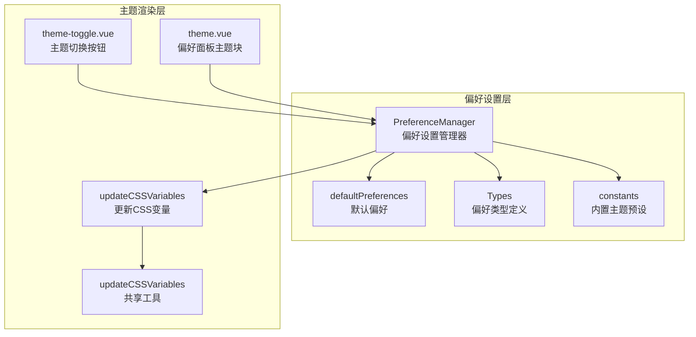
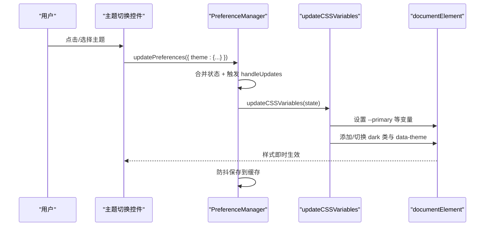
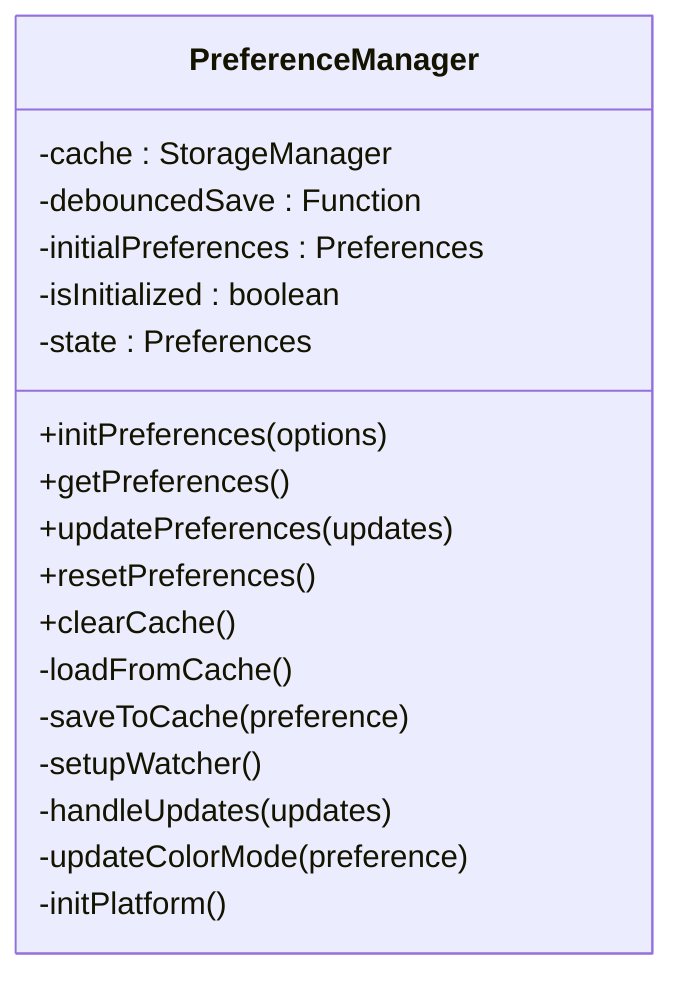
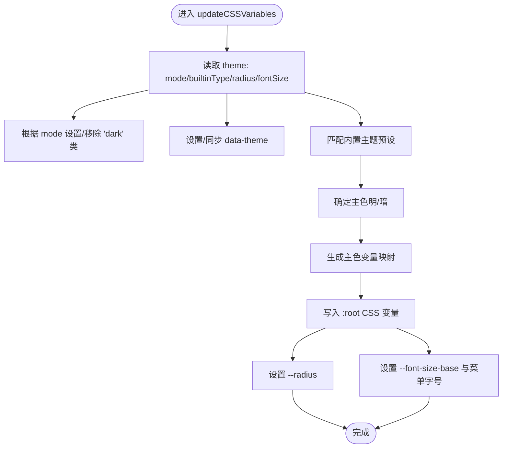
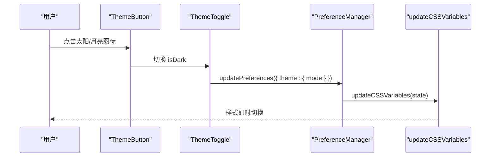
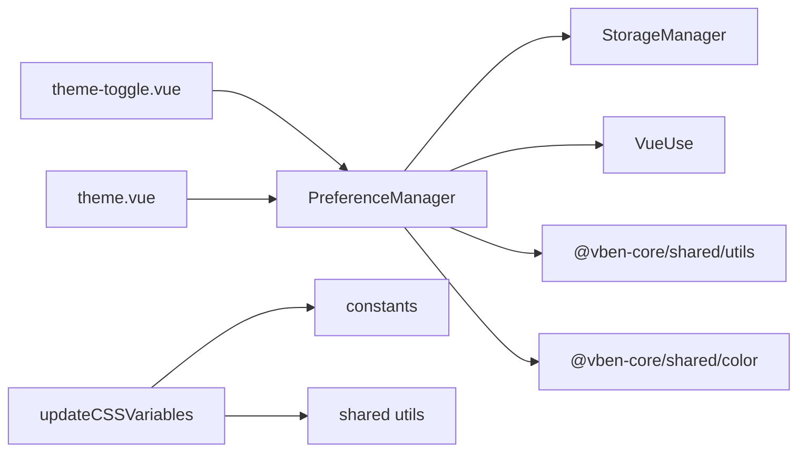

# 动态主题切换

<cite>
**本文引用的文件**
- [packages/@core/preferences/src/preferences.ts](file://packages/@core/preferences/src/preferences.ts)
- [packages/@core/preferences/src/update-css-variables.ts](file://packages/@core/preferences/src/update-css-variables.ts)
- [packages/@core/base/shared/src/utils/update-css-variables.ts](file://packages/@core/base/shared/src/utils/update-css-variables.ts)
- [packages/@core/preferences/src/config.ts](file://packages/@core/preferences/src/config.ts)
- [packages/@core/preferences/src/constants.ts](file://packages/@core/preferences/src/constants.ts)
- [packages/@core/preferences/src/types.ts](file://packages/@core/preferences/src/types.ts)
- [packages/effects/layouts/src/widgets/theme-toggle/theme-toggle.vue](file://packages/effects/layouts/src/widgets/theme-toggle/theme-toggle.vue)
- [packages/effects/layouts/src/widgets/theme-toggle/theme-button.vue](file://packages/effects/layouts/src/widgets/theme-toggle/theme-button.vue)
- [packages/effects/layouts/src/widgets/preferences/blocks/theme/theme.vue](file://packages/effects/layouts/src/widgets/preferences/blocks/theme/theme.vue)
- [packages/effects/layouts/src/widgets/preferences/blocks/theme/builtin.vue](file://packages/effects/layouts/src/widgets/preferences/blocks/theme/builtin.vue)
- [packages/effects/layouts/src/widgets/preferences/blocks/theme/font-size.vue](file://packages/effects/layouts/src/widgets/preferences/blocks/theme/font-size.vue)
- [packages/effects/layouts/src/widgets/preferences/blocks/theme/radius.vue](file://packages/effects/layouts/src/widgets/preferences/blocks/theme/radius.vue)
- [packages/effects/layouts/src/widgets/preferences/blocks/theme/color-mode.vue](file://packages/effects/layouts/src/widgets/preferences/blocks/theme/color-mode.vue)
- [docs/src/guide/in-depth/theme.md](file://docs/src/guide/in-depth/theme.md)
- [.agents/skills/vue-vben-admin/references/api_reference/update-css-variables.md](file://.agents/skills/vue-vben-admin/references/api_reference/update-css-variables.md)
</cite>

## 目录
1. [简介](#简介)
2. [项目结构](#项目结构)
3. [核心组件](#核心组件)
4. [架构总览](#架构总览)
5. [详细组件分析](#详细组件分析)
6. [依赖关系分析](#依赖关系分析)
7. [性能考量](#性能考量)
8. [故障排查指南](#故障排查指南)
9. [结论](#结论)
10. [附录](#附录)

## 简介
本文件系统性阐述 Vben Admin 的动态主题切换体系，涵盖技术实现（CSS 变量动态修改、样式热替换）、状态持久化与同步、触发时机与用户体验设计、缓存策略与性能优化、API 接口与使用示例，以及完整的主题切换流程图与错误处理机制。目标是帮助开发者快速理解并扩展主题系统。

## 项目结构
主题系统由“偏好设置管理器”“CSS 变量更新器”“UI 切换控件”三部分组成，并通过统一的偏好类型与常量进行约束与扩展。

图表来源
- [packages/@core/preferences/src/preferences.ts:25-235](file://packages/@core/preferences/src/preferences.ts#L25-L235)
- [packages/@core/preferences/src/update-css-variables.ts:12-129](file://packages/@core/preferences/src/update-css-variables.ts#L12-L129)
- [packages/@core/base/shared/src/utils/update-css-variables.ts:1-35](file://packages/@core/base/shared/src/utils/update-css-variables.ts#L1-L35)
- [packages/@core/preferences/src/config.ts:3-148](file://packages/@core/preferences/src/config.ts#L3-L148)
- [packages/@core/preferences/src/constants.ts:10-79](file://packages/@core/preferences/src/constants.ts#L10-L79)
- [packages/effects/layouts/src/widgets/theme-toggle/theme-toggle.vue:1-84](file://packages/effects/layouts/src/widgets/theme-toggle/theme-toggle.vue#L1-L84)
- [packages/effects/layouts/src/widgets/preferences/blocks/theme/theme.vue:1-115](file://packages/effects/layouts/src/widgets/preferences/blocks/theme/theme.vue#L1-L115)

章节来源
- [packages/@core/preferences/src/preferences.ts:1-235](file://packages/@core/preferences/src/preferences.ts#L1-L235)
- [packages/@core/preferences/src/config.ts:1-148](file://packages/@core/preferences/src/config.ts#L1-L148)
- [packages/@core/preferences/src/constants.ts:1-117](file://packages/@core/preferences/src/constants.ts#L1-L117)

## 核心组件
- 偏好设置管理器（PreferenceManager）
  - 负责加载/合并/持久化偏好；监听系统与断点变化；触发主题与颜色模式更新。
- CSS 变量更新器（updateCSSVariables）
  - 将主题偏好映射为 CSS 变量，写入 :root，支持暗色类、data-theme 属性、圆角与字号等。
- UI 控件
  - 主题切换按钮与偏好面板主题块，提供模式选择、内置主题与自定义主色、字号、圆角、灰/色弱模式开关。

章节来源
- [packages/@core/preferences/src/preferences.ts:25-235](file://packages/@core/preferences/src/preferences.ts#L25-L235)
- [packages/@core/preferences/src/update-css-variables.ts:12-129](file://packages/@core/preferences/src/update-css-variables.ts#L12-L129)
- [packages/effects/layouts/src/widgets/theme-toggle/theme-toggle.vue:1-84](file://packages/effects/layouts/src/widgets/theme-toggle/theme-toggle.vue#L1-L84)
- [packages/effects/layouts/src/widgets/preferences/blocks/theme/theme.vue:1-115](file://packages/effects/layouts/src/widgets/preferences/blocks/theme/theme.vue#L1-L115)

## 架构总览
主题切换采用“偏好驱动渲染”的架构：UI 触发更新 → 偏好设置管理器合并与持久化 → CSS 变量更新器批量写入 :root → 浏览器即时渲染。

图表来源
- [packages/effects/layouts/src/widgets/theme-toggle/theme-toggle.vue:28-32](file://packages/effects/layouts/src/widgets/theme-toggle/theme-toggle.vue#L28-L32)
- [packages/@core/preferences/src/preferences.ts:120-130](file://packages/@core/preferences/src/preferences.ts#L120-L130)
- [packages/@core/preferences/src/preferences.ts:136-152](file://packages/@core/preferences/src/preferences.ts#L136-L152)
- [packages/@core/preferences/src/update-css-variables.ts:12-82](file://packages/@core/preferences/src/update-css-variables.ts#L12-L82)

## 详细组件分析

### 偏好设置管理器（PreferenceManager）
- 职责
  - 初始化与命名空间隔离；加载缓存并合并默认值；提供只读快照；防抖保存；监听系统/断点变化；触发主题与颜色模式更新。
- 关键行为
  - updatePreferences：深度合并、触发 handleUpdates、防抖保存。
  - handleUpdates：当 theme 或 app 变更时分别调用 CSS 变量更新与颜色模式更新。
  - setupWatcher：监听 prefers-color-scheme 变化并在 auto 模式下跟随系统。
  - saveToCache：同时写入主偏好与 locale、theme 子键，便于跨模块读取。
- 性能与可靠性
  - 使用防抖降低频繁写入；使用 markRaw 保护不可响应对象；仅在必要字段存在时触发更新。

图表来源
- [packages/@core/preferences/src/preferences.ts:25-235](file://packages/@core/preferences/src/preferences.ts#L25-L235)

章节来源
- [packages/@core/preferences/src/preferences.ts:25-235](file://packages/@core/preferences/src/preferences.ts#L25-L235)

### CSS 变量更新器
- 能力
  - 将主题偏好映射为 CSS 变量，写入 :root；设置 html 的 dark 类与 data-theme；更新圆角与基础字号；生成主色变量映射。
- 关键逻辑
  - isDarkTheme：支持 auto 模式下跟随系统；根据 mode 计算是否添加 dark 类。
  - updateMainColorVariables：将主色与 alias 映射到 --primary/--success/--destructive/--warning 并写入 documentElement.style。
  - updateCSSVariables：综合内置主题、主色、圆角、字号等，调用共享工具写入内联样式。

图表来源
- [packages/@core/preferences/src/update-css-variables.ts:12-82](file://packages/@core/preferences/src/update-css-variables.ts#L12-L82)
- [packages/@core/base/shared/src/utils/update-css-variables.ts:1-35](file://packages/@core/base/shared/src/utils/update-css-variables.ts#L1-L35)

章节来源
- [packages/@core/preferences/src/update-css-variables.ts:12-129](file://packages/@core/preferences/src/update-css-variables.ts#L12-L129)
- [packages/@core/base/shared/src/utils/update-css-variables.ts:1-35](file://packages/@core/base/shared/src/utils/update-css-variables.ts#L1-L35)

### UI 切换控件与偏好面板
- 主题切换按钮（theme-toggle.vue + theme-button.vue）
  - 提供 light/dark/auto 三态切换；在支持的浏览器上使用 View Transitions 实现过渡动画；通过 updatePreferences 触发偏好变更。
- 偏好面板主题块（theme.vue）
  - 提供模式选择与半暗主题开关；与布局联动禁用某些选项。
- 内置主题与自定义主色（builtin.vue）
  - 展示内置主题色板；支持自定义色（custom）；根据 isDark 切换主色；节流更新主色。
- 字号与圆角（font-size.vue、radius.vue）
  - 数字输入与单选组，限制范围并即时生效。
- 灰/色弱模式（color-mode.vue）
  - 切换 html 上的 grayscale-mode 与 invert-mode 类，影响色彩呈现。

图表来源
- [packages/effects/layouts/src/widgets/theme-toggle/theme-button.vue:42-82](file://packages/effects/layouts/src/widgets/theme-toggle/theme-button.vue#L42-L82)
- [packages/effects/layouts/src/widgets/theme-toggle/theme-toggle.vue:28-32](file://packages/effects/layouts/src/widgets/theme-toggle/theme-toggle.vue#L28-L32)
- [packages/@core/preferences/src/preferences.ts:136-152](file://packages/@core/preferences/src/preferences.ts#L136-L152)

章节来源
- [packages/effects/layouts/src/widgets/theme-toggle/theme-toggle.vue:1-84](file://packages/effects/layouts/src/widgets/theme-toggle/theme-toggle.vue#L1-L84)
- [packages/effects/layouts/src/widgets/theme-toggle/theme-button.vue:1-165](file://packages/effects/layouts/src/widgets/theme-toggle/theme-button.vue#L1-L165)
- [packages/effects/layouts/src/widgets/preferences/blocks/theme/theme.vue:1-115](file://packages/effects/layouts/src/widgets/preferences/blocks/theme/theme.vue#L1-L115)
- [packages/effects/layouts/src/widgets/preferences/blocks/theme/builtin.vue:1-163](file://packages/effects/layouts/src/widgets/preferences/blocks/theme/builtin.vue#L1-L163)
- [packages/effects/layouts/src/widgets/preferences/blocks/theme/font-size.vue:1-63](file://packages/effects/layouts/src/widgets/preferences/blocks/theme/font-size.vue#L1-L63)
- [packages/effects/layouts/src/widgets/preferences/blocks/theme/radius.vue:1-39](file://packages/effects/layouts/src/widgets/preferences/blocks/theme/radius.vue#L1-L39)
- [packages/effects/layouts/src/widgets/preferences/blocks/theme/color-mode.vue:1-27](file://packages/effects/layouts/src/widgets/preferences/blocks/theme/color-mode.vue#L1-L27)

## 依赖关系分析
- PreferenceManager 依赖
  - StorageManager：本地/会话缓存封装。
  - VueUse：断点监听、防抖、节流。
  - @vben-core/shared/utils：工具函数（merge、isMacOs）。
  - @vben-core/shared/color：颜色变量生成。
- updateCSSVariables 依赖
  - constants：内置主题预设。
  - shared utils：通用 CSS 变量写入工具。
- UI 控件依赖
  - @vben-core/shadcn-ui：UI 组件库。
  - @vben/locales：国际化。
  - @vben/icons：图标库。

图表来源
- [packages/@core/preferences/src/preferences.ts:1-41](file://packages/@core/preferences/src/preferences.ts#L1-L41)
- [packages/@core/preferences/src/update-css-variables.ts:1-7](file://packages/@core/preferences/src/update-css-variables.ts#L1-L7)
- [packages/@core/preferences/src/constants.ts:1-117](file://packages/@core/preferences/src/constants.ts#L1-L117)
- [packages/effects/layouts/src/widgets/theme-toggle/theme-toggle.vue:1-18](file://packages/effects/layouts/src/widgets/theme-toggle/theme-toggle.vue#L1-L18)

章节来源
- [packages/@core/preferences/src/preferences.ts:1-41](file://packages/@core/preferences/src/preferences.ts#L1-L41)
- [packages/@core/preferences/src/update-css-variables.ts:1-7](file://packages/@core/preferences/src/update-css-variables.ts#L1-L7)
- [packages/@core/preferences/src/constants.ts:1-117](file://packages/@core/preferences/src/constants.ts#L1-L117)

## 性能考量
- 防抖写入
  - 使用防抖函数将多次偏好变更合并为一次持久化写入，减少 I/O 压力。
- 最小化 DOM 操作
  - 通过一次性构建 CSS 文本并写入内联样式表，避免逐项设置属性带来的多次回流。
- 视觉过渡优化
  - 在支持的浏览器中使用 View Transitions，结合动画半径计算实现平滑过渡，同时尊重“减少动态效果”偏好。
- 节流与限制
  - 自定义主色输入使用节流，限制字号范围，避免频繁重排与无效计算。

章节来源
- [packages/@core/preferences/src/preferences.ts:37-40](file://packages/@core/preferences/src/preferences.ts#L37-L40)
- [packages/effects/layouts/src/widgets/theme-toggle/theme-button.vue:23-82](file://packages/effects/layouts/src/widgets/theme-toggle/theme-button.vue#L23-L82)
- [packages/effects/layouts/src/widgets/preferences/blocks/theme/builtin.vue:24-31](file://packages/effects/layouts/src/widgets/preferences/blocks/theme/builtin.vue#L24-L31)
- [packages/effects/layouts/src/widgets/preferences/blocks/theme/font-size.vue:27-37](file://packages/effects/layouts/src/widgets/preferences/blocks/theme/font-size.vue#L27-L37)

## 故障排查指南
- 主题未生效
  - 检查是否正确调用 updatePreferences 更新 theme 字段。
  - 确认 handleUpdates 中已触发 updateCSSVariables。
  - 核对 :root 是否存在对应 CSS 变量。
- 暗色模式不跟随系统
  - 确认当前模式为 auto；检查系统媒体查询事件监听是否生效。
- 自定义主色无效
  - 确保传入颜色为 HSL 格式；确认节流与 watch 逻辑未阻断更新。
- 切换动画异常
  - 检查浏览器是否支持 View Transitions；确认未启用“减少动态效果”。

章节来源
- [packages/@core/preferences/src/preferences.ts:136-152](file://packages/@core/preferences/src/preferences.ts#L136-L152)
- [packages/@core/preferences/src/update-css-variables.ts:121-127](file://packages/@core/preferences/src/update-css-variables.ts#L121-L127)
- [packages/effects/layouts/src/widgets/theme-toggle/theme-button.vue:42-82](file://packages/effects/layouts/src/widgets/theme-toggle/theme-button.vue#L42-L82)

## 结论
Vben Admin 的动态主题系统以偏好设置为中心，通过“UI 触发 → 管理器合并 → CSS 变量更新 → 浏览器渲染”的链路实现高性能、可扩展的主题切换。内置主题与自定义主色、字号、圆角、颜色模式等配置共同构成灵活的外观定制能力。建议在扩展新主题时遵循现有类型与常量规范，并复用共享工具与 UI 组件，确保一致性与可维护性。

## 附录

### 主题切换 API 一览
- 函数
  - updateCSSVariables(preferences: Preferences)
  - updateMainColorVariables(preference: Preferences)
  - isDarkTheme(theme: string)
- 偏好类型
  - Preferences、ThemePreferences、AppPreferences 等
- 常量
  - BUILT_IN_THEME_PRESETS、DEFAULT_TIME_ZONE_OPTIONS

章节来源
- [.agents/skills/vue-vben-admin/references/api_reference/update-css-variables.md:11-44](file://.agents/skills/vue-vben-admin/references/api_reference/update-css-variables.md#L11-L44)
- [packages/@core/preferences/src/types.ts:239-262](file://packages/@core/preferences/src/types.ts#L239-L262)
- [packages/@core/preferences/src/constants.ts:10-79](file://packages/@core/preferences/src/constants.ts#L10-L79)

### 主题变量与文档参考
- 默认主题 CSS 变量清单与暗色模式变量
- 内置主题类型与主色预设

章节来源
- [docs/src/guide/in-depth/theme.md:27-126](file://docs/src/guide/in-depth/theme.md#L27-L126)
- [docs/src/guide/in-depth/theme.md:128-200](file://docs/src/guide/in-depth/theme.md#L128-L200)
- [packages/@core/preferences/src/constants.ts:10-79](file://packages/@core/preferences/src/constants.ts#L10-L79)