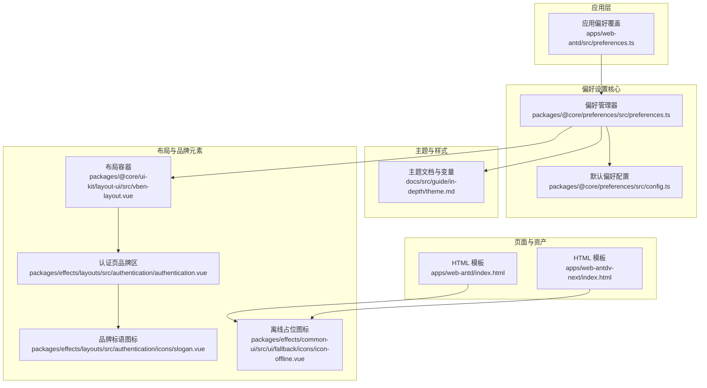
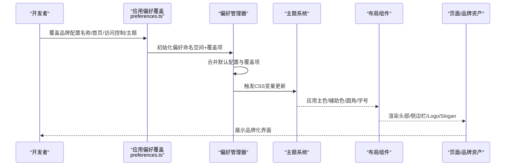
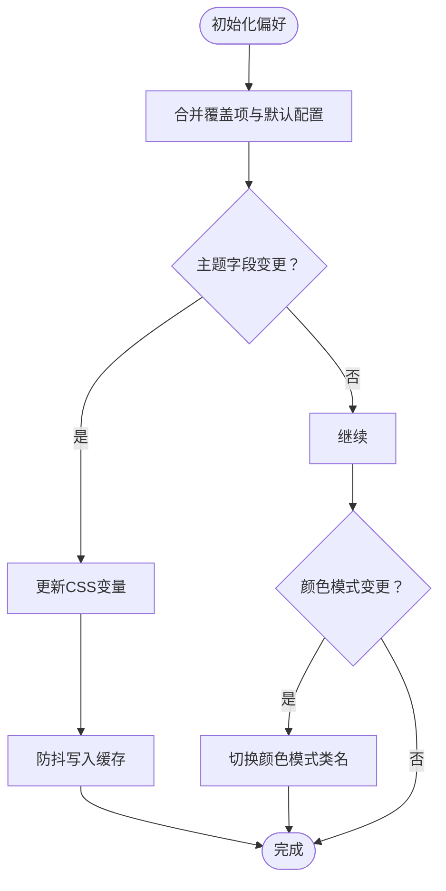
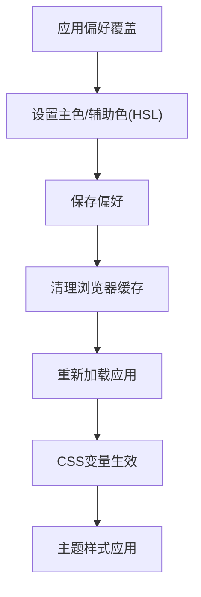
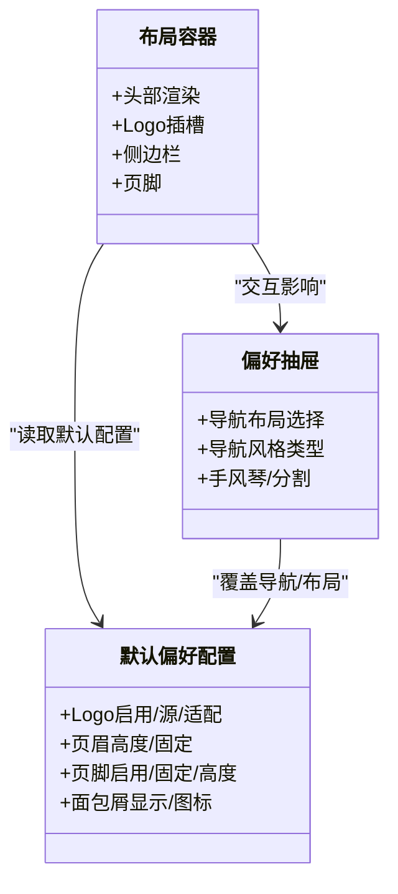
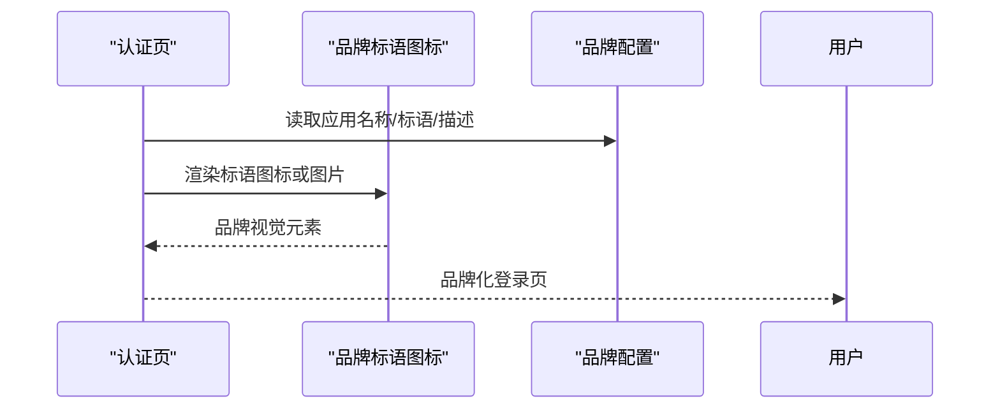
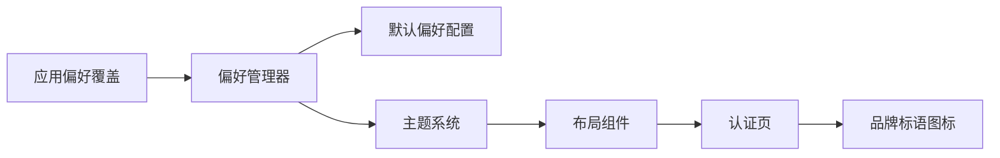

# 品牌元素定制

<cite>
**本文引用的文件**
- [apps/web-antd/src/preferences.ts](file://apps/web-antd/src/preferences.ts)
- [packages/@core/preferences/src/preferences.ts](file://packages/@core/preferences/src/preferences.ts)
- [packages/@core/preferences/src/config.ts](file://packages/@core/preferences/src/config.ts)
- [packages/@core/ui-kit/layout-ui/src/vben-layout.vue](file://packages/@core/ui-kit/layout-ui/src/vben-layout.vue)
- [packages/effects/layouts/src/widgets/preferences/icons/index.ts](file://packages/effects/layouts/src/widgets/preferences/icons/index.ts)
- [packages/effects/layouts/src/widgets/preferences/preferences-drawer.vue](file://packages/effects/layouts/src/widgets/preferences/preferences-drawer.vue)
- [packages/effects/layouts/src/widgets/preferences/blocks/layout/layout.vue](file://packages/effects/layouts/src/widgets/preferences/blocks/layout/layout.vue)
- [packages/effects/layouts/src/authentication/authentication.vue](file://packages/effects/layouts/src/authentication/authentication.vue)
- [packages/effects/layouts/src/authentication/icons/slogan.vue](file://packages/effects/layouts/src/authentication/icons/slogan.vue)
- [packages/effects/common-ui/src/ui/fallback/icons/icon-offline.vue](file://packages/effects/common-ui/src/ui/fallback/icons/icon-offline.vue)
- [docs/src/guide/in-depth/theme.md](file://docs/src/guide/in-depth/theme.md)
- [apps/web-antd/index.html](file://apps/web-antd/index.html)
- [apps/web-antdv-next/index.html](file://apps/web-antdv-next/index.html)
- [.agents/skills/vue-vben-admin/references/api_reference/use-layout-style.md](file://.agents/skills/vue-vben-admin/references/api_reference/use-layout-style.md)
</cite>

## 目录
1. [简介](#简介)
2. [项目结构](#项目结构)
3. [核心组件](#核心组件)
4. [架构总览](#架构总览)
5. [详细组件分析](#详细组件分析)
6. [依赖关系分析](#依赖关系分析)
7. [性能考量](#性能考量)
8. [故障排查指南](#故障排查指南)
9. [结论](#结论)
10. [附录](#附录)

## 简介
本文件面向企业级前端团队，系统性阐述 Vben Admin 品牌元素定制体系，涵盖品牌标识、Logo、色彩体系、VI 系统集成、导航与页眉页脚定制、favicon 与启动画面配置、以及品牌资产最佳实践与完整流程清单。通过偏好设置中心、主题系统与布局组件的协同，实现从“主色/辅助色/字体”到“页面骨架”的全链路品牌化。

## 项目结构
围绕品牌定制的关键模块分布如下：
- 应用层偏好配置：各应用入口的偏好覆盖文件，统一声明品牌名称、默认首页、访问控制等。
- 偏好设置核心：偏好管理器负责初始化、合并、持久化与变更响应，驱动主题与布局联动。
- 主题与样式：基于 CSS 变量的主题系统，支持内置主题与自定义主色；文档提供详尽变量清单与覆盖方式。
- 布局与品牌元素：布局容器、头部、侧边栏、页脚、Logo、Slogan 图标等品牌元素的可定制点。
- 页面与品牌资产：登录页背景图/图标、favicon、启动画面等。

图表来源
- [apps/web-antd/src/preferences.ts:1-31](file://apps/web-antd/src/preferences.ts#L1-L31)
- [packages/@core/preferences/src/preferences.ts:1-235](file://packages/@core/preferences/src/preferences.ts#L1-L235)
- [packages/@core/preferences/src/config.ts:1-148](file://packages/@core/preferences/src/config.ts#L1-L148)
- [packages/@core/ui-kit/layout-ui/src/vben-layout.vue:536-571](file://packages/@core/ui-kit/layout-ui/src/vben-layout.vue#L536-L571)
- [packages/effects/layouts/src/authentication/authentication.vue:106-136](file://packages/effects/layouts/src/authentication/authentication.vue#L106-L136)
- [packages/effects/layouts/src/authentication/icons/slogan.vue:1-57](file://packages/effects/layouts/src/authentication/icons/slogan.vue#L1-L57)
- [packages/effects/common-ui/src/ui/fallback/icons/icon-offline.vue:18-80](file://packages/effects/common-ui/src/ui/fallback/icons/icon-offline.vue#L18-L80)
- [apps/web-antd/index.html:1-36](file://apps/web-antd/index.html#L1-L36)
- [apps/web-antdv-next/index.html:1-36](file://apps/web-antdv-next/index.html#L1-L36)

章节来源
- [apps/web-antd/src/preferences.ts:1-31](file://apps/web-antd/src/preferences.ts#L1-L31)
- [packages/@core/preferences/src/preferences.ts:1-235](file://packages/@core/preferences/src/preferences.ts#L1-L235)
- [packages/@core/preferences/src/config.ts:1-148](file://packages/@core/preferences/src/config.ts#L1-L148)
- [packages/@core/ui-kit/layout-ui/src/vben-layout.vue:536-571](file://packages/@core/ui-kit/layout-ui/src/vben-layout.vue#L536-L571)
- [packages/effects/layouts/src/authentication/authentication.vue:106-136](file://packages/effects/layouts/src/authentication/authentication.vue#L106-L136)
- [packages/effects/layouts/src/authentication/icons/slogan.vue:1-57](file://packages/effects/layouts/src/authentication/icons/slogan.vue#L1-L57)
- [packages/effects/common-ui/src/ui/fallback/icons/icon-offline.vue:18-80](file://packages/effects/common-ui/src/ui/fallback/icons/icon-offline.vue#L18-L80)
- [apps/web-antd/index.html:1-36](file://apps/web-antd/index.html#L1-L36)
- [apps/web-antdv-next/index.html:1-36](file://apps/web-antdv-next/index.html#L1-L36)

## 核心组件
- 应用偏好覆盖：在应用根目录的偏好文件中声明品牌名称、默认首页、访问控制模式等，仅覆盖所需项，未覆盖项自动采用默认值。
- 偏好管理器：负责初始化、合并覆盖配置、持久化、响应主题与颜色模式变更，并触发样式更新。
- 默认偏好配置：集中定义品牌 Logo、页眉页脚、导航、侧边栏、主题、过渡效果、小部件等默认行为。
- 主题系统：通过 CSS 变量与内置主题实现主色/辅助色/字体/圆角/字号等品牌化定制，支持明暗模式与多主题切换。
- 布局与品牌元素：布局容器提供头部、侧边栏、页脚、Logo 插槽；认证页支持展示品牌标语与背景图；favicon 与启动画面由 HTML 模板注入。

章节来源
- [apps/web-antd/src/preferences.ts:1-31](file://apps/web-antd/src/preferences.ts#L1-L31)
- [packages/@core/preferences/src/preferences.ts:120-152](file://packages/@core/preferences/src/preferences.ts#L120-L152)
- [packages/@core/preferences/src/config.ts:66-70](file://packages/@core/preferences/src/config.ts#L66-L70)
- [docs/src/guide/in-depth/theme.md:247-275](file://docs/src/guide/in-depth/theme.md#L247-L275)

## 架构总览
品牌定制的运行时架构如下：

图表来源
- [apps/web-antd/src/preferences.ts:8-30](file://apps/web-antd/src/preferences.ts#L8-L30)
- [packages/@core/preferences/src/preferences.ts:70-100](file://packages/@core/preferences/src/preferences.ts#L70-L100)
- [packages/@core/preferences/src/preferences.ts:136-152](file://packages/@core/preferences/src/preferences.ts#L136-L152)
- [packages/@core/ui-kit/layout-ui/src/vben-layout.vue:558-571](file://packages/@core/ui-kit/layout-ui/src/vben-layout.vue#L558-L571)

## 详细组件分析

### 组件A：偏好设置与主题联动
- 初始化与合并：偏好管理器接收命名空间与覆盖项，与默认配置深度合并，确保最小覆盖。
- 变更响应：当主题相关字段更新时，触发 CSS 变量更新；当颜色模式开关更新时，切换页面颜色模式类名。
- 持久化与监听：偏好写入缓存并分片存储语言与主题模式；监听系统深色模式与移动端断点，动态调整。

图表来源
- [packages/@core/preferences/src/preferences.ts:70-100](file://packages/@core/preferences/src/preferences.ts#L70-L100)
- [packages/@core/preferences/src/preferences.ts:136-152](file://packages/@core/preferences/src/preferences.ts#L136-L152)
- [packages/@core/preferences/src/preferences.ts:173-177](file://packages/@core/preferences/src/preferences.ts#L173-L177)
- [packages/@core/preferences/src/preferences.ts:202-216](file://packages/@core/preferences/src/preferences.ts#L202-L216)

章节来源
- [packages/@core/preferences/src/preferences.ts:70-152](file://packages/@core/preferences/src/preferences.ts#L70-L152)
- [packages/@core/preferences/src/preferences.ts:173-177](file://packages/@core/preferences/src/preferences.ts#L173-L177)
- [packages/@core/preferences/src/preferences.ts:202-216](file://packages/@core/preferences/src/preferences.ts#L202-L216)

### 组件B：品牌主色与辅助色定制
- 主色定制：在应用偏好中设置主色与辅助色（成功/警告/错误），需使用 HSL 格式；修改后需清理缓存。
- 内置主题：支持 16 种内置主题，亦可扩展自定义主题；通过主题类型切换实现快速换肤。
- CSS 变量覆盖：可在项目 CSS 中覆盖指定 CSS 变量，分别针对浅色与深色模式。

图表来源
- [apps/web-antd/src/preferences.ts:8-30](file://apps/web-antd/src/preferences.ts#L8-L30)
- [docs/src/guide/in-depth/theme.md:247-275](file://docs/src/guide/in-depth/theme.md#L247-L275)
- [docs/src/guide/in-depth/theme.md:296-318](file://docs/src/guide/in-depth/theme.md#L296-L318)
- [docs/src/guide/in-depth/theme.md:322-422](file://docs/src/guide/in-depth/theme.md#L322-L422)

章节来源
- [apps/web-antd/src/preferences.ts:8-30](file://apps/web-antd/src/preferences.ts#L8-L30)
- [docs/src/guide/in-depth/theme.md:247-275](file://docs/src/guide/in-depth/theme.md#L247-L275)
- [docs/src/guide/in-depth/theme.md:296-318](file://docs/src/guide/in-depth/theme.md#L296-L318)
- [docs/src/guide/in-depth/theme.md:322-422](file://docs/src/guide/in-depth/theme.md#L322-L422)

### 组件C：布局中的品牌元素定制
- 头部与Logo：布局容器提供头部渲染与 Logo 插槽，支持根据布局模式与滚动状态动态阴影与宽度。
- 导航样式：偏好抽屉提供多种导航布局与风格类型，支持手风琴、分割、混合等模式。
- 页脚与面包屑：页脚高度与固定策略、面包屑显示与图标策略均可在默认配置中调整。

图表来源
- [packages/@core/ui-kit/layout-ui/src/vben-layout.vue:558-571](file://packages/@core/ui-kit/layout-ui/src/vben-layout.vue#L558-L571)
- [packages/effects/layouts/src/widgets/preferences/icons/index.ts:1-12](file://packages/effects/layouts/src/widgets/preferences/icons/index.ts#L1-L12)
- [packages/effects/layouts/src/widgets/preferences/preferences-drawer.vue:384-392](file://packages/effects/layouts/src/widgets/preferences/preferences-drawer.vue#L384-L392)
- [packages/effects/layouts/src/widgets/preferences/blocks/layout/layout.vue:45-86](file://packages/effects/layouts/src/widgets/preferences/blocks/layout/layout.vue#L45-L86)
- [packages/@core/preferences/src/config.ts:53-64](file://packages/@core/preferences/src/config.ts#L53-L64)
- [packages/@core/preferences/src/config.ts:66-70](file://packages/@core/preferences/src/config.ts#L66-L70)
- [packages/@core/preferences/src/config.ts:37-43](file://packages/@core/preferences/src/config.ts#L37-L43)

章节来源
- [packages/@core/ui-kit/layout-ui/src/vben-layout.vue:558-571](file://packages/@core/ui-kit/layout-ui/src/vben-layout.vue#L558-L571)
- [packages/effects/layouts/src/widgets/preferences/icons/index.ts:1-12](file://packages/effects/layouts/src/widgets/preferences/icons/index.ts#L1-L12)
- [packages/effects/layouts/src/widgets/preferences/preferences-drawer.vue:384-392](file://packages/effects/layouts/src/widgets/preferences/preferences-drawer.vue#L384-L392)
- [packages/effects/layouts/src/widgets/preferences/blocks/layout/layout.vue:45-86](file://packages/effects/layouts/src/widgets/preferences/blocks/layout/layout.vue#L45-L86)
- [packages/@core/preferences/src/config.ts:53-64](file://packages/@core/preferences/src/config.ts#L53-L64)
- [packages/@core/preferences/src/config.ts:66-70](file://packages/@core/preferences/src/config.ts#L66-L70)
- [packages/@core/preferences/src/config.ts:37-43](file://packages/@core/preferences/src/config.ts#L37-L43)

### 组件D：认证页品牌资产
- 品牌标语与背景：认证页左侧区域支持展示品牌标语图标或自定义图片，配合标题与描述形成品牌第一印象。
- 登录背景：认证页背景使用全局背景色变量，确保与主题一致。

图表来源
- [packages/effects/layouts/src/authentication/authentication.vue:106-136](file://packages/effects/layouts/src/authentication/authentication.vue#L106-L136)
- [packages/effects/layouts/src/authentication/icons/slogan.vue:1-57](file://packages/effects/layouts/src/authentication/icons/slogan.vue#L1-L57)

章节来源
- [packages/effects/layouts/src/authentication/authentication.vue:106-136](file://packages/effects/layouts/src/authentication/authentication.vue#L106-L136)
- [packages/effects/layouts/src/authentication/icons/slogan.vue:1-57](file://packages/effects/layouts/src/authentication/icons/slogan.vue#L1-L57)

### 组件E：favicon 与启动画面
- favicon：在 HTML 模板中通过链接标签注入，支持多尺寸与多类型图标。
- 启动画面：可通过模板中引入启动图资源或在构建阶段配置 PWA 资源，实现应用启动时的品牌呈现。

章节来源
- [apps/web-antd/index.html:14-16](file://apps/web-antd/index.html#L14-L16)
- [apps/web-antdv-next/index.html:14-16](file://apps/web-antdv-next/index.html#L14-L16)

## 依赖关系分析
- 应用偏好覆盖依赖偏好管理器进行初始化与持久化。
- 偏好管理器依赖默认配置与 CSS 变量更新函数，驱动主题系统。
- 布局组件依赖偏好配置决定头部、侧边栏、Logo、页脚等渲染策略。
- 认证页依赖品牌配置与图标组件，形成统一品牌输出。

图表来源
- [apps/web-antd/src/preferences.ts:8-30](file://apps/web-antd/src/preferences.ts#L8-L30)
- [packages/@core/preferences/src/preferences.ts:70-100](file://packages/@core/preferences/src/preferences.ts#L70-L100)
- [packages/@core/preferences/src/config.ts:66-70](file://packages/@core/preferences/src/config.ts#L66-L70)
- [packages/@core/ui-kit/layout-ui/src/vben-layout.vue:558-571](file://packages/@core/ui-kit/layout-ui/src/vben-layout.vue#L558-L571)
- [packages/effects/layouts/src/authentication/authentication.vue:106-136](file://packages/effects/layouts/src/authentication/authentication.vue#L106-L136)
- [packages/effects/layouts/src/authentication/icons/slogan.vue:1-57](file://packages/effects/layouts/src/authentication/icons/slogan.vue#L1-L57)

章节来源
- [apps/web-antd/src/preferences.ts:8-30](file://apps/web-antd/src/preferences.ts#L8-L30)
- [packages/@core/preferences/src/preferences.ts:70-100](file://packages/@core/preferences/src/preferences.ts#L70-L100)
- [packages/@core/preferences/src/config.ts:66-70](file://packages/@core/preferences/src/config.ts#L66-L70)
- [packages/@core/ui-kit/layout-ui/src/vben-layout.vue:558-571](file://packages/@core/ui-kit/layout-ui/src/vben-layout.vue#L558-L571)
- [packages/effects/layouts/src/authentication/authentication.vue:106-136](file://packages/effects/layouts/src/authentication/authentication.vue#L106-L136)
- [packages/effects/layouts/src/authentication/icons/slogan.vue:1-57](file://packages/effects/layouts/src/authentication/icons/slogan.vue#L1-L57)

## 性能考量
- 偏好更新采用防抖写入缓存，避免频繁 I/O。
- 主题变更仅在主题字段更新时触发 CSS 变量更新，减少无关重绘。
- 布局组件按需渲染头部与侧边栏，结合滚动阴影与宽度计算，降低不必要的 DOM 更新。

## 故障排查指南
- 主色不生效：确认使用 HSL 格式并清理缓存；检查偏好覆盖是否正确合并。
- 深色模式异常：确认系统深色模式监听逻辑与自动模式配置；验证 CSS 变量覆盖范围。
- 布局错位：检查默认配置中的头部/侧边栏高度与宽度；确认布局模式与导航风格类型。
- 认证页品牌元素缺失：检查品牌标语图标资源路径与认证页布局配置。

章节来源
- [packages/@core/preferences/src/preferences.ts:136-152](file://packages/@core/preferences/src/preferences.ts#L136-L152)
- [packages/@core/preferences/src/preferences.ts:202-216](file://packages/@core/preferences/src/preferences.ts#L202-L216)
- [packages/@core/preferences/src/config.ts:58-64](file://packages/@core/preferences/src/config.ts#L58-L64)
- [packages/effects/layouts/src/authentication/authentication.vue:106-136](file://packages/effects/layouts/src/authentication/authentication.vue#L106-L136)

## 结论
通过偏好设置中心、主题系统与布局组件的协同，Vben Admin 提供了从主色/辅助色到 Logo/页眉页脚的全链路品牌定制能力。遵循最小覆盖原则与 HSL 主色规范，结合布局与认证页的品牌元素，可快速实现企业 VI 的落地与一致性呈现。

## 附录

### 品牌定制最佳实践
- 使用 HSL 格式定义主色与辅助色，确保明暗模式一致性。
- 仅覆盖必要字段，避免过度定制导致维护成本上升。
- 在 CSS 中覆盖关键变量（如卡片、输入框、边框）以保证组件级品牌一致性。
- 通过偏好抽屉与布局预设快速试错，最终固化到默认配置。

### 设计规范
- 字体与字号：通过主题变量统一字号基线，确保各级标题与正文比例一致。
- 圆角与阴影：统一圆角半径与阴影层级，提升界面整体感。
- 颜色模式：明暗模式下保持对比度与可读性，避免纯黑/纯白高亮。

### 品牌定制流程与检查清单
- 明确品牌主色与辅助色（HSL 格式）
- 在应用偏好中覆盖主题主色与辅助色
- 配置品牌名称与默认首页
- 自定义 Logo 与页眉页脚参数
- 选择合适的导航布局与风格类型
- 配置认证页品牌标语与背景
- 注入 favicon 与启动画面
- 清理缓存并全量回归测试（明/暗模式、移动端、各布局）