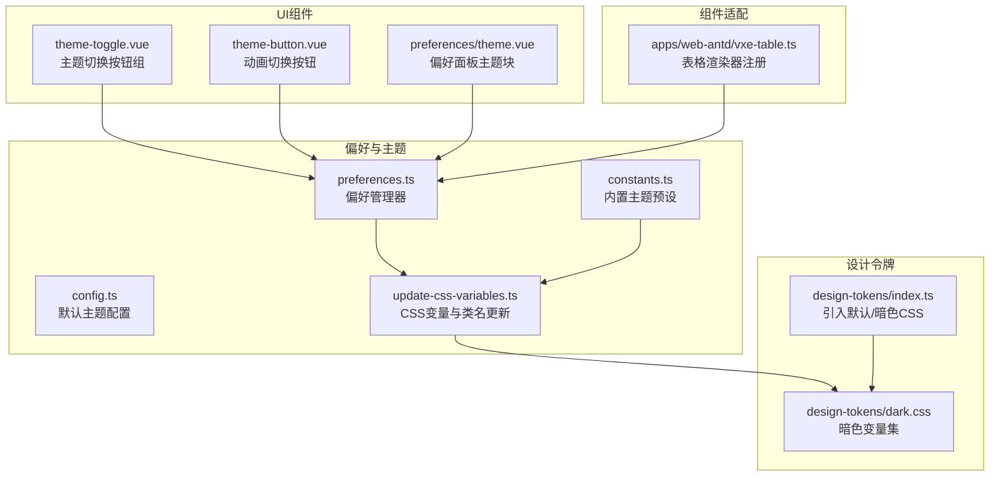
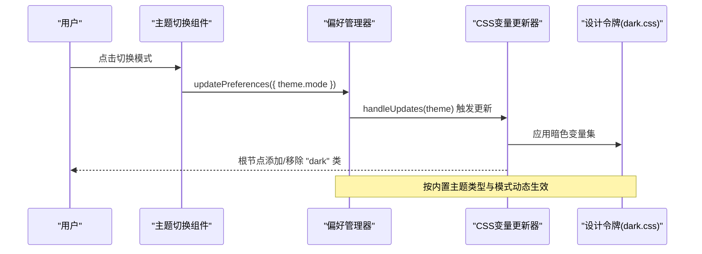
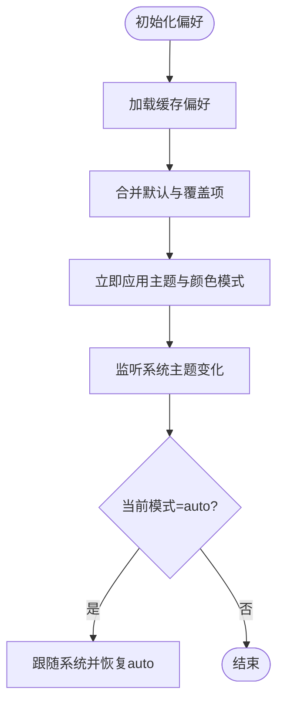
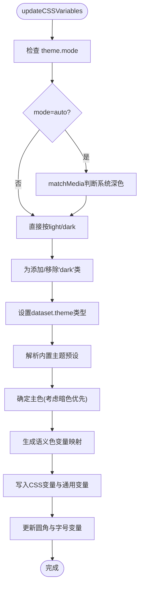
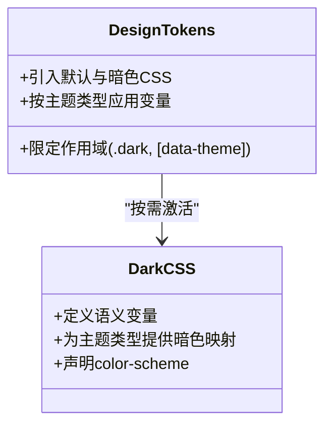
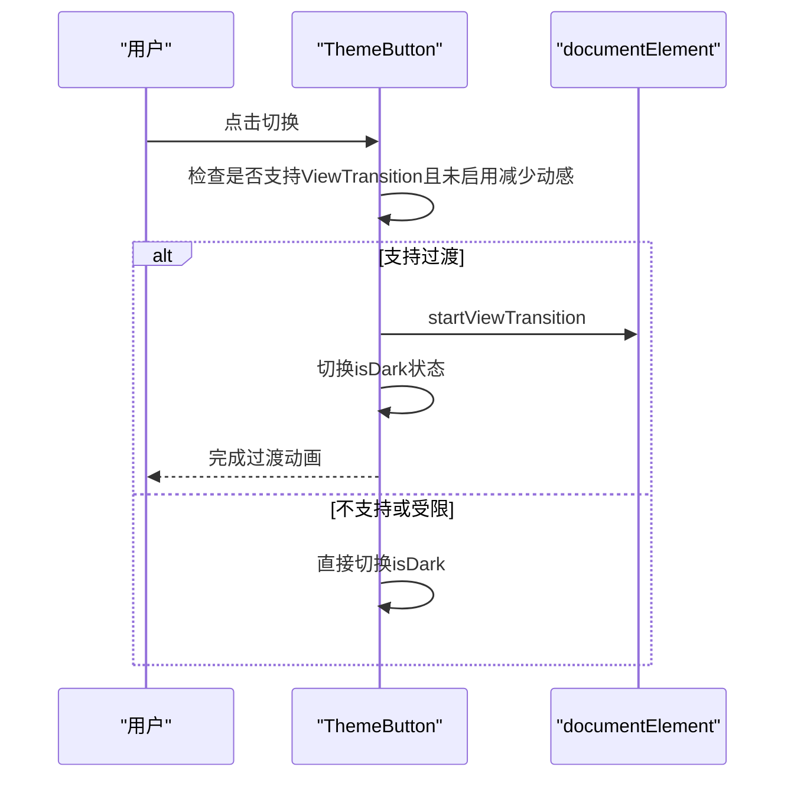
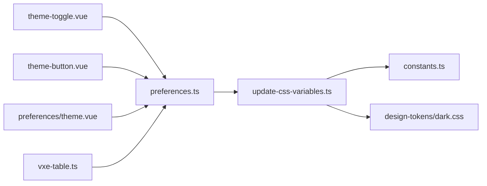

# 暗色主题支持

<cite>
**本文引用的文件**
- [packages/@core/preferences/src/config.ts](file://packages/@core/preferences/src/config.ts)
- [packages/@core/preferences/src/update-css-variables.ts](file://packages/@core/preferences/src/update-css-variables.ts)
- [packages/@core/preferences/src/preferences.ts](file://packages/@core/preferences/src/preferences.ts)
- [packages/@core/preferences/src/constants.ts](file://packages/@core/preferences/src/constants.ts)
- [packages/@core/base/design/src/design-tokens/index.ts](file://packages/@core/base/design/src/design-tokens/index.ts)
- [packages/@core/base/design/src/design-tokens/dark.css](file://packages/@core/base/design/src/design-tokens/dark.css)
- [packages/effects/layouts/src/widgets/theme-toggle/theme-toggle.vue](file://packages/effects/layouts/src/widgets/theme-toggle/theme-toggle.vue)
- [packages/effects/layouts/src/widgets/theme-toggle/theme-button.vue](file://packages/effects/layouts/src/widgets/theme-toggle/theme-button.vue)
- [packages/effects/layouts/src/widgets/preferences/blocks/theme/theme.vue](file://packages/effects/layouts/src/widgets/preferences/blocks/theme/theme.vue)
- [apps/web-antd/src/adapter/vxe-table.ts](file://apps/web-antd/src/adapter/vxe-table.ts)
- [packages/@core/base/shared/src/color/color.ts](file://packages/@core/base/shared/src/color/color.ts)
- [packages/@core/base/typings/src/app.d.ts](file://packages/@core/base/typings/src/app.d.ts)
- [packages/@core/preferences/__tests__/preferences.test.ts](file://packages/@core/preferences/__tests__/preferences.test.ts)
</cite>

## 目录
1. [简介](#简介)
2. [项目结构](#项目结构)
3. [核心组件](#核心组件)
4. [架构总览](#架构总览)
5. [详细组件分析](#详细组件分析)
6. [依赖关系分析](#依赖关系分析)
7. [性能考量](#性能考量)
8. [故障排查指南](#故障排查指南)
9. [结论](#结论)
10. [附录](#附录)

## 简介
本文件系统性阐述 Vben Admin 的暗色主题体系，涵盖设计原理、实现机制、色彩映射规则、自动切换逻辑、组件适配策略、系统检测与用户偏好设置、测试与质量保障，以及设计规范与实现示例路径。目标是帮助开发者与设计师在不同 UI 框架与业务场景中稳定地落地暗色主题，并确保可读性与视觉舒适度。

## 项目结构
围绕暗色主题的关键目录与文件如下：
- 主题偏好与变量更新：packages/@core/preferences
- 设计令牌与暗色 CSS：packages/@core/base/design
- 主题切换 UI 组件：packages/effects/layouts/widgets/theme-toggle
- 偏好设置面板中的主题区块：packages/effects/layouts/widgets/preferences/blocks/theme
- 表格等组件适配：apps/web-antd/src/adapter/vxe-table.ts
- 颜色工具与类型定义：packages/@core/base/shared/src/color 与 packages/@core/base/typings/src/app.d.ts

**图示来源**
- [packages/@core/preferences/src/config.ts:1-148](file://packages/@core/preferences/src/config.ts#L1-L148)
- [packages/@core/preferences/src/update-css-variables.ts:1-130](file://packages/@core/preferences/src/update-css-variables.ts#L1-L130)
- [packages/@core/preferences/src/preferences.ts:1-235](file://packages/@core/preferences/src/preferences.ts#L1-L235)
- [packages/@core/preferences/src/constants.ts:1-117](file://packages/@core/preferences/src/constants.ts#L1-L117)
- [packages/@core/base/design/src/design-tokens/index.ts:1-3](file://packages/@core/base/design/src/design-tokens/index.ts#L1-L3)
- [packages/@core/base/design/src/design-tokens/dark.css:1-447](file://packages/@core/base/design/src/design-tokens/dark.css#L1-L447)
- [packages/effects/layouts/src/widgets/theme-toggle/theme-toggle.vue:1-84](file://packages/effects/layouts/src/widgets/theme-toggle/theme-toggle.vue#L1-L84)
- [packages/effects/layouts/src/widgets/theme-toggle/theme-button.vue:1-165](file://packages/effects/layouts/src/widgets/theme-toggle/theme-button.vue#L1-L165)
- [packages/effects/layouts/src/widgets/preferences/blocks/theme/theme.vue:1-115](file://packages/effects/layouts/src/widgets/preferences/blocks/theme/theme.vue#L1-L115)
- [apps/web-antd/src/adapter/vxe-table.ts:1-119](file://apps/web-antd/src/adapter/vxe-table.ts#L1-L119)

**章节来源**
- [packages/@core/preferences/src/config.ts:1-148](file://packages/@core/preferences/src/config.ts#L1-L148)
- [packages/@core/preferences/src/update-css-variables.ts:1-130](file://packages/@core/preferences/src/update-css-variables.ts#L1-L130)
- [packages/@core/preferences/src/preferences.ts:1-235](file://packages/@core/preferences/src/preferences.ts#L1-L235)
- [packages/@core/preferences/src/constants.ts:1-117](file://packages/@core/preferences/src/constants.ts#L1-L117)
- [packages/@core/base/design/src/design-tokens/index.ts:1-3](file://packages/@core/base/design/src/design-tokens/index.ts#L1-L3)
- [packages/@core/base/design/src/design-tokens/dark.css:1-447](file://packages/@core/base/design/src/design-tokens/dark.css#L1-L447)
- [packages/effects/layouts/src/widgets/theme-toggle/theme-toggle.vue:1-84](file://packages/effects/layouts/src/widgets/theme-toggle/theme-toggle.vue#L1-L84)
- [packages/effects/layouts/src/widgets/theme-toggle/theme-button.vue:1-165](file://packages/effects/layouts/src/widgets/theme-toggle/theme-button.vue#L1-L165)
- [packages/effects/layouts/src/widgets/preferences/blocks/theme/theme.vue:1-115](file://packages/effects/layouts/src/widgets/preferences/blocks/theme/theme.vue#L1-L115)
- [apps/web-antd/src/adapter/vxe-table.ts:1-119](file://apps/web-antd/src/adapter/vxe-table.ts#L1-L119)

## 核心组件
- 偏好管理器：负责加载/合并/持久化用户偏好，触发主题与颜色模式更新。
- CSS 变量更新器：根据主题模式与内置主题类型，计算并写入 CSS 变量与类名。
- 设计令牌：提供默认与暗色两套 CSS 变量集合，按主题类型动态生效。
- 主题切换 UI：提供“亮/暗/跟随系统”三态切换，支持过渡动画与无障碍标签。
- 偏好面板主题块：在设置面板中展示与编辑主题模式、半暗侧边栏/头部等。
- 组件适配：表格等复杂组件通过渲染器注册与样式继承，自然适配暗色。

**章节来源**
- [packages/@core/preferences/src/preferences.ts:120-152](file://packages/@core/preferences/src/preferences.ts#L120-L152)
- [packages/@core/preferences/src/update-css-variables.ts:12-82](file://packages/@core/preferences/src/update-css-variables.ts#L12-L82)
- [packages/@core/base/design/src/design-tokens/dark.css:1-108](file://packages/@core/base/design/src/design-tokens/dark.css#L1-L108)
- [packages/effects/layouts/src/widgets/theme-toggle/theme-toggle.vue:28-32](file://packages/effects/layouts/src/widgets/theme-toggle/theme-toggle.vue#L28-L32)
- [packages/effects/layouts/src/widgets/preferences/blocks/theme/theme.vue:25-32](file://packages/effects/layouts/src/widgets/preferences/blocks/theme/theme.vue#L25-L32)
- [apps/web-antd/src/adapter/vxe-table.ts:34-104](file://apps/web-antd/src/adapter/vxe-table.ts#L34-L104)

## 架构总览
暗色主题的控制流从用户交互开始，经偏好管理器更新状态，再由 CSS 变量更新器写入根节点类名与 CSS 变量，最终由设计令牌与组件样式共同呈现。

**图示来源**
- [packages/effects/layouts/src/widgets/theme-toggle/theme-toggle.vue:28-32](file://packages/effects/layouts/src/widgets/theme-toggle/theme-toggle.vue#L28-L32)
- [packages/@core/preferences/src/preferences.ts:136-152](file://packages/@core/preferences/src/preferences.ts#L136-L152)
- [packages/@core/preferences/src/update-css-variables.ts:12-82](file://packages/@core/preferences/src/update-css-variables.ts#L12-L82)
- [packages/@core/base/design/src/design-tokens/dark.css:1-108](file://packages/@core/base/design/src/design-tokens/dark.css#L1-L108)

## 详细组件分析

### 偏好管理器与自动切换
- 初始化与合并：从缓存加载用户偏好，与默认配置与覆盖项合并，立即应用。
- 主题更新：当 theme 字段变更时，调用 CSS 变量更新器；当 app.colorGrayMode 或 app.colorWeakMode 变更时，切换页面颜色模式类名。
- 自动模式监听：监听系统 prefers-color-scheme 变化，仅在 mode 为 auto 时跟随系统并恢复 auto 状态，避免用户手动切换被覆盖。

**图示来源**
- [packages/@core/preferences/src/preferences.ts:70-100](file://packages/@core/preferences/src/preferences.ts#L70-L100)
- [packages/@core/preferences/src/preferences.ts:182-217](file://packages/@core/preferences/src/preferences.ts#L182-L217)

**章节来源**
- [packages/@core/preferences/src/preferences.ts:70-100](file://packages/@core/preferences/src/preferences.ts#L70-L100)
- [packages/@core/preferences/src/preferences.ts:182-217](file://packages/@core/preferences/src/preferences.ts#L182-L217)

### CSS 变量与类名更新
- 模式判定：支持 light/dark/auto；auto 时通过 matchMedia 判断系统偏好。
- 根节点类名：根据模式为 documentElement 添加/移除 "dark" 类，驱动 CSS 选择器。
- 主题类型：通过 dataset.theme 切换内置主题类型，配合设计令牌按类型应用变量。
- 颜色映射：将主题主色与语义色映射到统一 CSS 变量，再由通用工具写入根节点。
- 圆角与字号：同步更新 --radius 与 --font-size-base 等基础变量。

**图示来源**
- [packages/@core/preferences/src/update-css-variables.ts:12-82](file://packages/@core/preferences/src/update-css-variables.ts#L12-L82)
- [packages/@core/preferences/src/update-css-variables.ts:88-119](file://packages/@core/preferences/src/update-css-variables.ts#L88-L119)
- [packages/@core/preferences/src/constants.ts:10-79](file://packages/@core/preferences/src/constants.ts#L10-L79)

**章节来源**
- [packages/@core/preferences/src/update-css-variables.ts:12-82](file://packages/@core/preferences/src/update-css-variables.ts#L12-L82)
- [packages/@core/preferences/src/update-css-variables.ts:88-119](file://packages/@core/preferences/src/update-css-variables.ts#L88-L119)
- [packages/@core/preferences/src/constants.ts:10-79](file://packages/@core/preferences/src/constants.ts#L10-L79)

### 设计令牌与暗色变量
- 默认与暗色：通过引入 default.css 与 dark.css，形成两套变量集。
- 暗色作用域：.dark 与[data-theme='...'] 选择器限定变量生效范围，避免全局污染。
- 主题类型变量：每种内置主题类型在暗色下拥有独立变量集，确保一致性与可读性。
- 颜色方案：color-scheme: dark 提升浏览器与系统级可访问性体验。

**图示来源**
- [packages/@core/base/design/src/design-tokens/index.ts:1-3](file://packages/@core/base/design/src/design-tokens/index.ts#L1-L3)
- [packages/@core/base/design/src/design-tokens/dark.css:1-108](file://packages/@core/base/design/src/design-tokens/dark.css#L1-L108)

**章节来源**
- [packages/@core/base/design/src/design-tokens/index.ts:1-3](file://packages/@core/base/design/src/design-tokens/index.ts#L1-L3)
- [packages/@core/base/design/src/design-tokens/dark.css:1-108](file://packages/@core/base/design/src/design-tokens/dark.css#L1-L108)

### 主题切换 UI 与动画
- 切换组件：提供三态切换（亮/暗/跟随系统），支持 Tooltip 与分组按钮。
- 动画按钮：基于 View Transition API 实现从光/影到暗/亮的圆形扩散过渡，尊重用户减少动感偏好。
- 无障碍：按钮具备 aria-label 与 aria-live，便于屏幕阅读器播报。

**图示来源**
- [packages/effects/layouts/src/widgets/theme-toggle/theme-button.vue:42-82](file://packages/effects/layouts/src/widgets/theme-toggle/theme-button.vue#L42-L82)

**章节来源**
- [packages/effects/layouts/src/widgets/theme-toggle/theme-toggle.vue:28-32](file://packages/effects/layouts/src/widgets/theme-toggle/theme-toggle.vue#L28-L32)
- [packages/effects/layouts/src/widgets/theme-toggle/theme-button.vue:42-82](file://packages/effects/layouts/src/widgets/theme-toggle/theme-button.vue#L42-L82)

### 偏好面板主题块
- 模式选择：以图标直观展示 light/dark/auto 三种模式。
- 半暗开关：根据布局与当前模式禁用/启用，避免无效配置。
- 本地化文案：通过 $t 提供多语言名称与提示。

**章节来源**
- [packages/effects/layouts/src/widgets/preferences/blocks/theme/theme.vue:25-32](file://packages/effects/layouts/src/widgets/preferences/blocks/theme/theme.vue#L25-L32)
- [packages/effects/layouts/src/widgets/preferences/blocks/theme/theme.vue:68-113](file://packages/effects/layouts/src/widgets/preferences/blocks/theme/theme.vue#L68-L113)

### 组件适配：表格与渲染器
- 渲染器注册：通过 setupVbenVxeTable 注册单元格渲染器（如 CellImage、CellLink、CellTag、CellSwitch、CellOperation 等）。
- 适配策略：渲染器复用通用样式变量，随根节点暗色类与 CSS 变量自动适配。
- 交互组件：集成 Button、Popconfirm、Switch、Tag 等，确保在暗色下对比度与可读性。

**章节来源**
- [apps/web-antd/src/adapter/vxe-table.ts:34-104](file://apps/web-antd/src/adapter/vxe-table.ts#L34-L104)

### 颜色工具与类型约束
- 颜色工具：提供 isDarkColor 辅助判断颜色明暗，用于组件内部对比度校验。
- 类型约束：ThemeModeType 支持 'auto' | 'dark' | 'light'，确保模式枚举安全。

**章节来源**
- [packages/@core/base/shared/src/color/color.ts:2-3](file://packages/@core/base/shared/src/color/color.ts#L2-L3)
- [packages/@core/base/typings/src/app.d.ts:9](file://packages/@core/base/typings/src/app.d.ts#L9)

## 依赖关系分析
- 偏好管理器依赖：StorageManager（持久化）、Vue 响应式与 watch（状态监听）、matchMedia（系统偏好）。
- CSS 变量更新器依赖：内置主题常量、颜色变量生成器、通用 CSS 变量更新工具。
- 设计令牌依赖：通过入口文件引入默认与暗色 CSS，按主题类型与模式生效。
- UI 组件依赖：偏好管理器提供的 usePreferences/usePreferences 等组合式 API。

**图示来源**
- [packages/@core/preferences/src/preferences.ts:136-152](file://packages/@core/preferences/src/preferences.ts#L136-L152)
- [packages/@core/preferences/src/update-css-variables.ts:12-82](file://packages/@core/preferences/src/update-css-variables.ts#L12-L82)
- [packages/@core/preferences/src/constants.ts:10-79](file://packages/@core/preferences/src/constants.ts#L10-L79)
- [packages/@core/base/design/src/design-tokens/dark.css:1-108](file://packages/@core/base/design/src/design-tokens/dark.css#L1-L108)
- [packages/effects/layouts/src/widgets/theme-toggle/theme-toggle.vue:10-18](file://packages/effects/layouts/src/widgets/theme-toggle/theme-toggle.vue#L10-L18)
- [packages/effects/layouts/src/widgets/theme-toggle/theme-button.vue:1-165](file://packages/effects/layouts/src/widgets/theme-toggle/theme-button.vue#L1-L165)
- [packages/effects/layouts/src/widgets/preferences/blocks/theme/theme.vue:1-115](file://packages/effects/layouts/src/widgets/preferences/blocks/theme/theme.vue#L1-L115)
- [apps/web-antd/src/adapter/vxe-table.ts:10-17](file://apps/web-antd/src/adapter/vxe-table.ts#L10-L17)

**章节来源**
- [packages/@core/preferences/src/preferences.ts:136-152](file://packages/@core/preferences/src/preferences.ts#L136-L152)
- [packages/@core/preferences/src/update-css-variables.ts:12-82](file://packages/@core/preferences/src/update-css-variables.ts#L12-L82)
- [packages/@core/preferences/src/constants.ts:10-79](file://packages/@core/preferences/src/constants.ts#L10-L79)
- [packages/@core/base/design/src/design-tokens/dark.css:1-108](file://packages/@core/base/design/src/design-tokens/dark.css#L1-L108)
- [packages/effects/layouts/src/widgets/theme-toggle/theme-toggle.vue:10-18](file://packages/effects/layouts/src/widgets/theme-toggle/theme-toggle.vue#L10-L18)
- [packages/effects/layouts/src/widgets/theme-toggle/theme-button.vue:1-165](file://packages/effects/layouts/src/widgets/theme-toggle/theme-button.vue#L1-L165)
- [packages/effects/layouts/src/widgets/preferences/blocks/theme/theme.vue:1-115](file://packages/effects/layouts/src/widgets/preferences/blocks/theme/theme.vue#L1-L115)
- [apps/web-antd/src/adapter/vxe-table.ts:10-17](file://apps/web-antd/src/adapter/vxe-table.ts#L10-L17)

## 性能考量
- 防抖持久化：偏好更新采用防抖保存，降低频繁写入缓存的开销。
- 条件更新：仅在主题或颜色模式相关字段变更时触发 CSS 变量更新，避免无谓重绘。
- 动画条件：View Transition 仅在支持且未启用减少动感时启用，兼顾性能与体验。
- 变量粒度：通过 CSS 变量集中管理颜色与尺寸，减少样式计算与回流。

[本节为通用指导，无需列出具体文件来源]

## 故障排查指南
- 暗色不生效
  - 检查根节点是否正确添加/移除 "dark" 类。
  - 确认 dataset.theme 是否与期望一致。
  - 核对内置主题类型与模式映射是否正确。
- 自动模式未跟随系统
  - 确认当前模式为 auto，且系统 prefers-color-scheme 事件已触发。
  - 检查监听器是否被覆盖或重复初始化。
- 颜色模式（灰/色弱）异常
  - 确认 invert-mode 与 grayscale-mode 类是否按预期切换。
- 测试验证
  - 使用测试用例覆盖自动模式判断与偏好更新流程，模拟 matchMedia 返回值。

**章节来源**
- [packages/@core/preferences/src/preferences.ts:202-216](file://packages/@core/preferences/src/preferences.ts#L202-L216)
- [packages/@core/preferences/src/update-css-variables.ts:24-27](file://packages/@core/preferences/src/update-css-variables.ts#L24-L27)
- [packages/@core/preferences/__tests__/preferences.test.ts:11-23](file://packages/@core/preferences/__tests__/preferences.test.ts#L11-L23)
- [packages/@core/preferences/__tests__/preferences.test.ts:226-249](file://packages/@core/preferences/__tests__/preferences.test.ts#L226-L249)

## 结论
Vben Admin 的暗色主题体系以“偏好管理器 + CSS 变量 + 设计令牌 + UI 组件”为核心，实现了高内聚、低耦合的主题控制链路。通过内置主题类型、系统偏好监听与动画过渡，既保证了可读性与视觉舒适度，又提供了灵活的用户偏好与组件适配能力。建议在新组件开发中遵循统一的 CSS 变量命名与对比度准则，确保暗色体验的一致性。

[本节为总结性内容，无需列出具体文件来源]

## 附录
- 设计规范与实现示例路径
  - 主题模式类型：ThemeModeType
    - [packages/@core/base/typings/src/app.d.ts:9](file://packages/@core/base/typings/src/app.d.ts#L9)
  - 默认主题配置（含默认模式）
    - [packages/@core/preferences/src/config.ts:115-127](file://packages/@core/preferences/src/config.ts#L115-L127)
  - 内置主题预设与主色映射
    - [packages/@core/preferences/src/constants.ts:10-79](file://packages/@core/preferences/src/constants.ts#L10-L79)
  - CSS 变量更新与类名切换
    - [packages/@core/preferences/src/update-css-variables.ts:12-82](file://packages/@core/preferences/src/update-css-variables.ts#L12-L82)
  - 暗色变量集
    - [packages/@core/base/design/src/design-tokens/dark.css:1-108](file://packages/@core/base/design/src/design-tokens/dark.css#L1-L108)
  - 主题切换 UI
    - [packages/effects/layouts/src/widgets/theme-toggle/theme-toggle.vue:28-32](file://packages/effects/layouts/src/widgets/theme-toggle/theme-toggle.vue#L28-L32)
    - [packages/effects/layouts/src/widgets/theme-toggle/theme-button.vue:42-82](file://packages/effects/layouts/src/widgets/theme-toggle/theme-button.vue#L42-L82)
  - 偏好面板主题块
    - [packages/effects/layouts/src/widgets/preferences/blocks/theme/theme.vue:68-113](file://packages/effects/layouts/src/widgets/preferences/blocks/theme/theme.vue#L68-L113)
  - 表格渲染器注册与适配
    - [apps/web-antd/src/adapter/vxe-table.ts:34-104](file://apps/web-antd/src/adapter/vxe-table.ts#L34-L104)

[本节为索引性内容，无需列出具体文件来源]