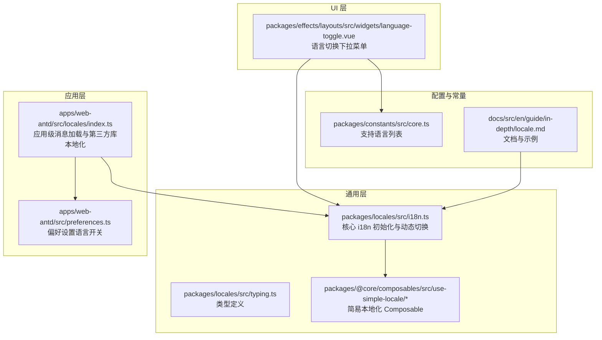
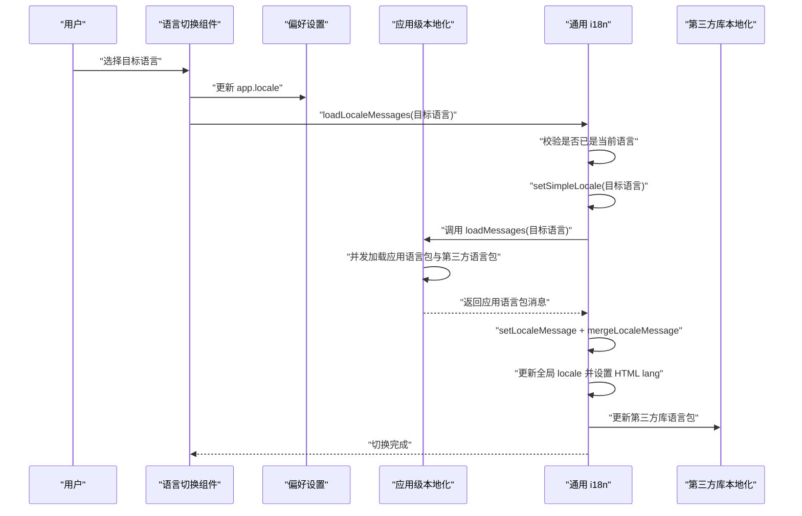
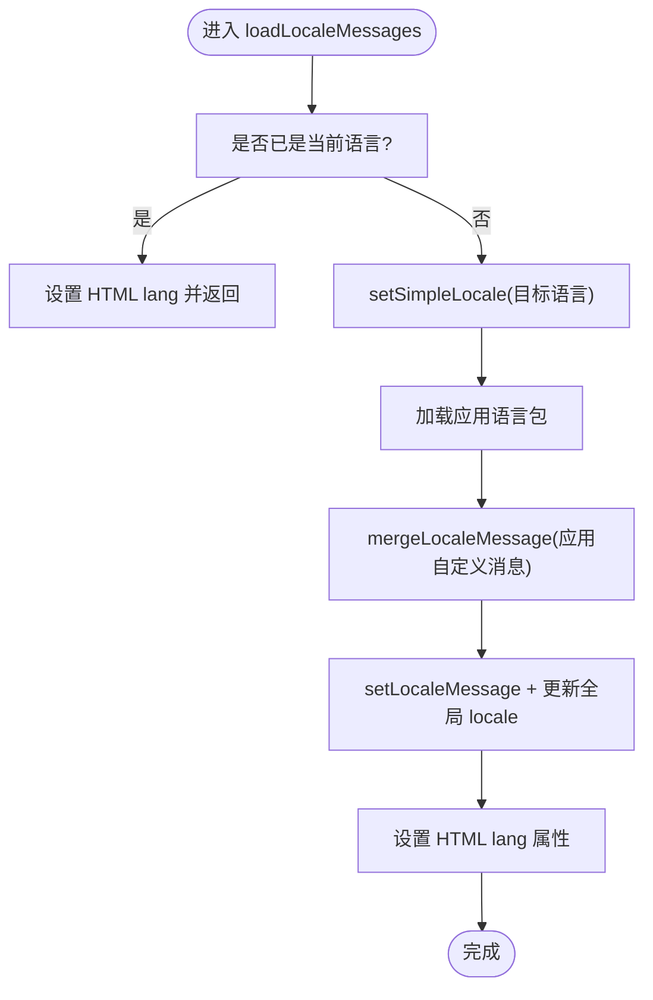
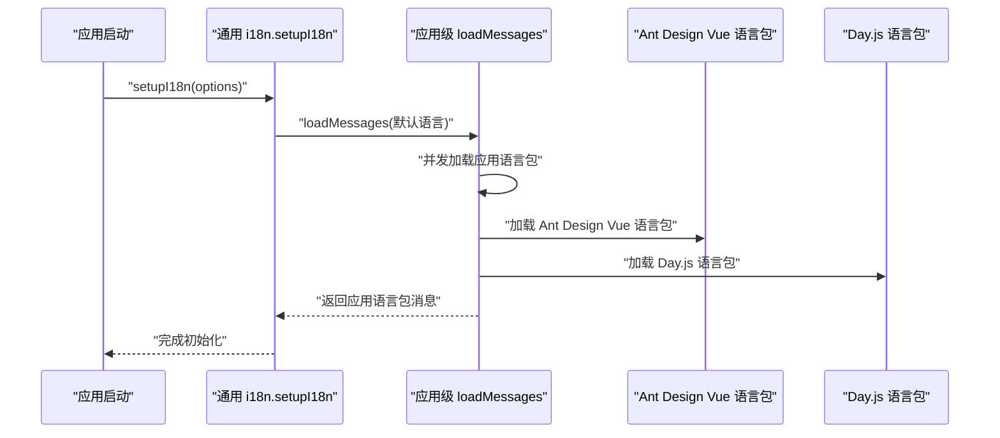
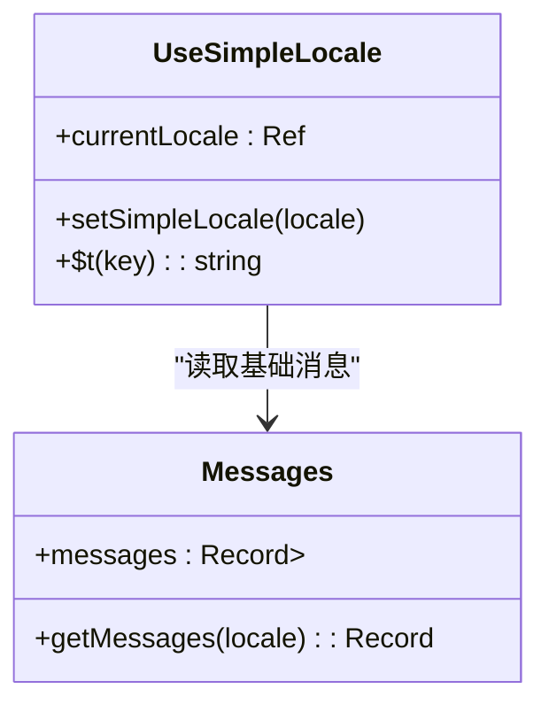
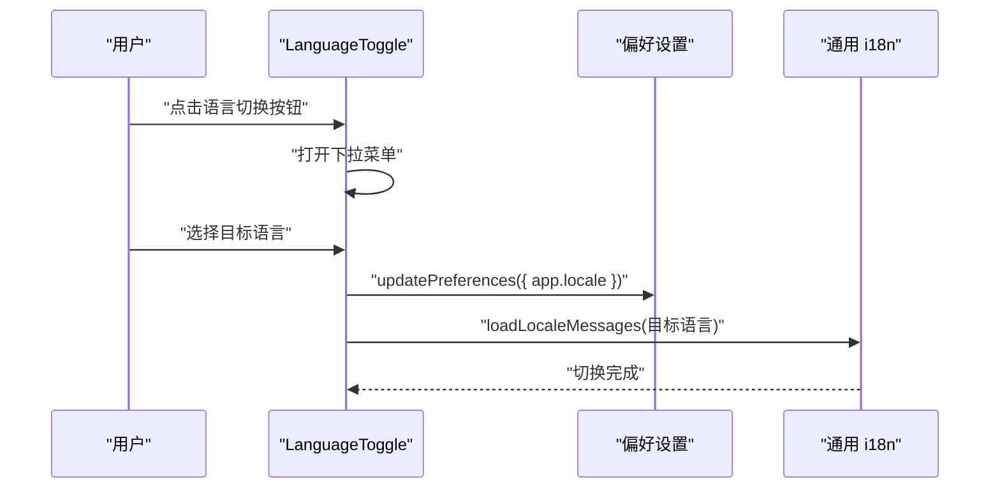
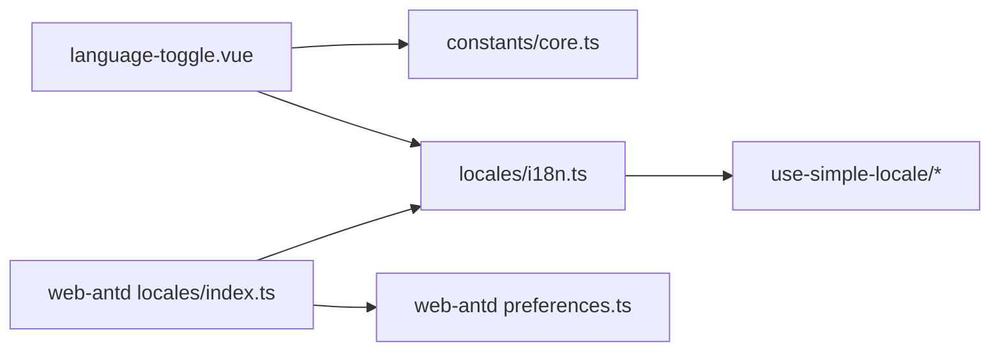

# 动态语言切换

<cite>
**本文引用的文件**
- [packages/locales/src/i18n.ts](file://packages/locales/src/i18n.ts)
- [apps/web-antd/src/locales/index.ts](file://apps/web-antd/src/locales/index.ts)
- [packages/@core/composables/src/use-simple-locale/index.ts](file://packages/@core/composables/src/use-simple-locale/index.ts)
- [packages/@core/composables/src/use-simple-locale/messages.ts](file://packages/@core/composables/src/use-simple-locale/messages.ts)
- [packages/effects/layouts/src/widgets/language-toggle.vue](file://packages/effects/layouts/src/widgets/language-toggle.vue)
- [packages/constants/src/core.ts](file://packages/constants/src/core.ts)
- [apps/web-antd/src/preferences.ts](file://apps/web-antd/src/preferences.ts)
- [packages/locales/src/typing.ts](file://packages/locales/src/typing.ts)
- [docs/src/en/guide/in-depth/locale.md](file://docs/src/en/guide/in-depth/locale.md)
</cite>

## 目录

1. [简介](#简介)
2. [项目结构](#项目结构)
3. [核心组件](#核心组件)
4. [架构总览](#架构总览)
5. [详细组件分析](#详细组件分析)
6. [依赖关系分析](#依赖关系分析)
7. [性能考量](#性能考量)
8. [故障排查指南](#故障排查指南)
9. [结论](#结论)
10. [附录](#附录)

## 简介

本文件系统性阐述 Vben Admin 的动态语言切换能力，涵盖语言状态管理、响应式更新机制、触发方式（用户界面与程序化）、语言包加载与缓存策略、对 UI 组件的影响、API 使用方法（含 $locale.setLocale 的等价流程）、用户体验优化（过渡与加载提示）、错误处理与回滚机制，并提供可直接定位到源码的路径指引与典型使用场景。

## 项目结构

围绕“动态语言切换”的关键目录与文件如下：

- 通用 i18n 核心：packages/locales/src/i18n.ts
- 应用层集成（以 Ant Design Vue 版本为例）：apps/web-antd/src/locales/index.ts
- 简易本地化 Composable：packages/@core/composables/src/use-simple-locale/\*
- 语言切换 UI 组件：packages/effects/layouts/src/widgets/language-toggle.vue
- 支持语言常量与类型：packages/constants/src/core.ts、packages/locales/src/typing.ts
- 偏好设置（控制语言切换按钮显隐）：apps/web-antd/src/preferences.ts
- 文档说明：docs/src/en/guide/in-depth/locale.md

图表来源

- [packages/locales/src/i18n.ts:102-139](file://packages/locales/src/i18n.ts#L102-L139)
- [apps/web-antd/src/locales/index.ts:93-102](file://apps/web-antd/src/locales/index.ts#L93-L102)
- [packages/effects/layouts/src/widgets/language-toggle.vue:15-24](file://packages/effects/layouts/src/widgets/language-toggle.vue#L15-L24)
- [packages/constants/src/core.ts:14-23](file://packages/constants/src/core.ts#L14-L23)
- [packages/@core/composables/src/use-simple-locale/index.ts:9-27](file://packages/@core/composables/src/use-simple-locale/index.ts#L9-L27)

章节来源

- [packages/locales/src/i18n.ts:102-139](file://packages/locales/src/i18n.ts#L102-L139)
- [apps/web-antd/src/locales/index.ts:93-102](file://apps/web-antd/src/locales/index.ts#L93-L102)
- [packages/effects/layouts/src/widgets/language-toggle.vue:15-24](file://packages/effects/layouts/src/widgets/language-toggle.vue#L15-L24)
- [packages/constants/src/core.ts:14-23](file://packages/constants/src/core.ts#L14-L23)
- [packages/@core/composables/src/use-simple-locale/index.ts:9-27](file://packages/@core/composables/src/use-simple-locale/index.ts#L9-L27)

## 核心组件

- 通用 i18n 初始化与动态切换：负责创建 i18n 实例、按需加载语言包、合并应用级消息、设置 HTML lang 属性、以及通过简单本地化 Composable 同步当前语言。
- 应用级本地化集成：在应用启动时注入 i18n，加载默认语言包，并同时加载第三方组件库（如 Ant Design Vue、Day.js）的语言资源。
- 简易本地化 Composable：提供基于内存的消息表与响应式 $t 计算函数，用于轻量场景或快速回退。
- 语言切换 UI 组件：提供下拉菜单选择器，写入偏好设置并触发语言切换。
- 支持语言与类型：统一声明受支持语言集合与类型约束。
- 偏好设置：控制语言切换按钮是否显示。

章节来源

- [packages/locales/src/i18n.ts:16-21](file://packages/locales/src/i18n.ts#L16-L21)
- [apps/web-antd/src/locales/index.ts:33-39](file://apps/web-antd/src/locales/index.ts#L33-L39)
- [packages/@core/composables/src/use-simple-locale/messages.ts:3-24](file://packages/@core/composables/src/use-simple-locale/messages.ts#L3-L24)
- [packages/effects/layouts/src/widgets/language-toggle.vue:29-37](file://packages/effects/layouts/src/widgets/language-toggle.vue#L29-L37)
- [packages/constants/src/core.ts:6-23](file://packages/constants/src/core.ts#L6-L23)
- [apps/web-antd/src/preferences.ts:26-30](file://apps/web-antd/src/preferences.ts#L26-L30)

## 架构总览

动态语言切换由“UI 触发 → 偏好设置更新 → 语言包加载与合并 → 全局语言生效”构成的闭环。核心要点：

- UI 层通过语言切换组件触发切换逻辑。
- 切换逻辑调用通用 i18n 的加载函数，按需异步加载目标语言包。
- 应用层可扩展加载第三方库语言包与日期库语言包。
- 语言切换后同步更新 HTML lang 属性，确保无障碍与 SEO 友好。
- 简易本地化 Composable 作为后备方案，保证在异步加载期间仍可显示基础文案。

图表来源

- [packages/effects/layouts/src/widgets/language-toggle.vue:15-24](file://packages/effects/layouts/src/widgets/language-toggle.vue#L15-L24)
- [apps/web-antd/src/locales/index.ts:33-39](file://apps/web-antd/src/locales/index.ts#L33-L39)
- [packages/locales/src/i18n.ts:123-139](file://packages/locales/src/i18n.ts#L123-L139)
- [apps/web-antd/src/locales/index.ts:53-74](file://apps/web-antd/src/locales/index.ts#L53-L74)

## 详细组件分析

### 通用 i18n 初始化与动态切换（packages/locales/src/i18n.ts）

- 负责创建 vue-i18n 实例，初始化空消息集与默认语言占位。
- 通过目录扫描生成语言包映射，按需异步加载目标语言的所有 JSON 片段并合并为完整消息对象。
- 提供 setupI18n 与 loadLocaleMessages：
  - setupI18n：注册 i18n 插件、加载默认语言、设置缺失键告警处理器。
  - loadLocaleMessages：若非当前语言则执行以下步骤：
    - 更新简易本地化语言；
    - 异步加载语言包；
    - 合并应用自定义消息；
    - 设置全局语言与 HTML lang 属性。
- 与简易本地化 Composable 协作，确保 UI 在语言切换过程中仍能显示基础文案。

图表来源

- [packages/locales/src/i18n.ts:123-139](file://packages/locales/src/i18n.ts#L123-L139)
- [packages/locales/src/i18n.ts:96-100](file://packages/locales/src/i18n.ts#L96-L100)

章节来源

- [packages/locales/src/i18n.ts:102-139](file://packages/locales/src/i18n.ts#L102-L139)
- [packages/locales/src/i18n.ts:16-21](file://packages/locales/src/i18n.ts#L16-L21)

### 应用级本地化集成（apps/web-antd/src/locales/index.ts）

- 在应用启动时调用通用 i18n 的 setupI18n，并传入应用级 loadMessages。
- loadMessages 并发加载：
  - 应用语言包（来自 src/locales/langs 下的 JSON）；
  - 第三方语言包（Ant Design Vue、Day.js）。
- 提供 antdLocale 与 dayjs 语言包切换，确保 UI 组件与日期显示符合当前语言。

图表来源

- [apps/web-antd/src/locales/index.ts:93-102](file://apps/web-antd/src/locales/index.ts#L93-L102)
- [apps/web-antd/src/locales/index.ts:33-39](file://apps/web-antd/src/locales/index.ts#L33-L39)
- [apps/web-antd/src/locales/index.ts:53-74](file://apps/web-antd/src/locales/index.ts#L53-L74)

章节来源

- [apps/web-antd/src/locales/index.ts:93-102](file://apps/web-antd/src/locales/index.ts#L93-L102)
- [apps/web-antd/src/locales/index.ts:33-39](file://apps/web-antd/src/locales/index.ts#L33-L39)
- [apps/web-antd/src/locales/index.ts:53-74](file://apps/web-antd/src/locales/index.ts#L53-L74)

### 简易本地化 Composable（packages/@core/composables/src/use-simple-locale）

- 维护当前语言与基础消息表，提供响应式 $t 函数，作为异步语言包加载期间的后备。
- 与通用 i18n 的 setSimpleLocale 协同，确保 UI 不出现空白文案。

图表来源

- [packages/@core/composables/src/use-simple-locale/index.ts:9-27](file://packages/@core/composables/src/use-simple-locale/index.ts#L9-L27)
- [packages/@core/composables/src/use-simple-locale/messages.ts:3-24](file://packages/@core/composables/src/use-simple-locale/messages.ts#L3-L24)

章节来源

- [packages/@core/composables/src/use-simple-locale/index.ts:9-27](file://packages/@core/composables/src/use-simple-locale/index.ts#L9-L27)
- [packages/@core/composables/src/use-simple-locale/messages.ts:3-24](file://packages/@core/composables/src/use-simple-locale/messages.ts#L3-L24)

### 语言切换 UI 组件（packages/effects/layouts/src/widgets/language-toggle.vue）

- 基于支持语言列表渲染下拉菜单，绑定当前语言偏好。
- 用户选择后：
  - 更新偏好设置中的 app.locale；
  - 调用通用 i18n 的 loadLocaleMessages 完成切换。
- 通过图标按钮与下拉菜单提供直观交互。

图表来源

- [packages/effects/layouts/src/widgets/language-toggle.vue:15-24](file://packages/effects/layouts/src/widgets/language-toggle.vue#L15-L24)
- [packages/effects/layouts/src/widgets/language-toggle.vue:29-37](file://packages/effects/layouts/src/widgets/language-toggle.vue#L29-L37)

章节来源

- [packages/effects/layouts/src/widgets/language-toggle.vue:15-24](file://packages/effects/layouts/src/widgets/language-toggle.vue#L15-L24)
- [packages/effects/layouts/src/widgets/language-toggle.vue:29-37](file://packages/effects/layouts/src/widgets/language-toggle.vue#L29-L37)

### 支持语言与类型（packages/constants/src/core.ts、packages/locales/src/typing.ts）

- 支持语言列表：统一维护受支持语言选项，供 UI 组件与类型约束使用。
- 类型约束：限定语言值域与加载函数签名，保证跨模块一致性。

章节来源

- [packages/constants/src/core.ts:6-23](file://packages/constants/src/core.ts#L6-L23)
- [packages/locales/src/typing.ts:1-26](file://packages/locales/src/typing.ts#L1-L26)

### 偏好设置（apps/web-antd/src/preferences.ts）

- 控制语言切换按钮是否显示（widget.languageToggle）。
- 控制默认语言（app.locale），影响首次加载与回退行为。

章节来源

- [apps/web-antd/src/preferences.ts:26-30](file://apps/web-antd/src/preferences.ts#L26-L30)
- [apps/web-antd/src/preferences.ts:13-25](file://apps/web-antd/src/preferences.ts#L13-L25)

## 依赖关系分析

- UI 组件依赖支持语言常量与通用 i18n 的加载函数。
- 应用级本地化依赖通用 i18n 的 setupI18n 与 loadMessages 签名。
- 通用 i18n 依赖简易本地化 Composable 作为后备。
- 偏好设置贯穿 UI 与初始化阶段，决定默认语言与 UI 显示。

图表来源

- [packages/effects/layouts/src/widgets/language-toggle.vue:4-6](file://packages/effects/layouts/src/widgets/language-toggle.vue#L4-L6)
- [packages/locales/src/i18n.ts:14-25](file://packages/locales/src/i18n.ts#L14-L25)
- [apps/web-antd/src/locales/index.ts:14-14](file://apps/web-antd/src/locales/index.ts#L14-L14)
- [apps/web-antd/src/preferences.ts:8-30](file://apps/web-antd/src/preferences.ts#L8-L30)

章节来源

- [packages/effects/layouts/src/widgets/language-toggle.vue:4-6](file://packages/effects/layouts/src/widgets/language-toggle.vue#L4-L6)
- [packages/locales/src/i18n.ts:14-25](file://packages/locales/src/i18n.ts#L14-L25)
- [apps/web-antd/src/locales/index.ts:14-14](file://apps/web-antd/src/locales/index.ts#L14-L14)
- [apps/web-antd/src/preferences.ts:8-30](file://apps/web-antd/src/preferences.ts#L8-L30)

## 性能考量

- 按需异步加载：语言包通过 import.meta.glob 扫描并在切换时按需加载，避免首屏体积膨胀。
- 并发加载：应用语言包与第三方语言包通过 Promise.all 并发加载，缩短切换等待时间。
- 缓存策略：已加载语言包通过 vue-i18n 的 setLocaleMessage 与 mergeLocaleMessage 缓存在全局实例中，后续切换无需重复下载。
- 回退机制：在语言包未就绪时，简易本地化 Composable 提供基础文案，避免空白显示。

章节来源

- [packages/locales/src/i18n.ts:23-30](file://packages/locales/src/i18n.ts#L23-L30)
- [apps/web-antd/src/locales/index.ts:33-39](file://apps/web-antd/src/locales/index.ts#L33-L39)
- [packages/@core/composables/src/use-simple-locale/index.ts:9-27](file://packages/@core/composables/src/use-simple-locale/index.ts#L9-L27)

## 故障排查指南

- 语言包缺失键告警：可通过 setupI18n 的 missingWarn 选项控制是否在开发环境输出缺失键警告。
- 第三方库语言包加载失败：检查 loadDayjsLocale/loadAntdLocale 的分支与导入路径，确保目标语言存在对应包。
- 切换后 UI 未更新：确认是否正确调用 loadLocaleMessages，并检查 HTML lang 属性是否更新。
- 语言切换按钮不显示：检查偏好设置中 widget.languageToggle 的值。
- 新增语言包未生效：确保在支持列表与类型定义中添加新语言，并在应用 locales 目录下提供对应 JSON 文件。

章节来源

- [packages/locales/src/i18n.ts:110-116](file://packages/locales/src/i18n.ts#L110-L116)
- [apps/web-antd/src/locales/index.ts:53-74](file://apps/web-antd/src/locales/index.ts#L53-L74)
- [apps/web-antd/src/preferences.ts:26-30](file://apps/web-antd/src/preferences.ts#L26-L30)
- [docs/src/en/guide/in-depth/locale.md:104-157](file://docs/src/en/guide/in-depth/locale.md#L104-L157)

## 结论

Vben Admin 的动态语言切换以“通用 i18n + 应用级扩展 + UI 组件 + 偏好设置”为核心，实现了按需加载、并发优化、缓存复用与 UI 响应式更新。通过清晰的触发链路与完善的回退机制，既保证了良好的用户体验，也便于扩展新的语言包与第三方库本地化。

## 附录

### API 使用方法与等价流程

- 程序化切换语言（等价于 $locale.setLocale 的调用流程）：
  - 更新偏好设置中的 app.locale；
  - 调用通用 i18n 的 loadLocaleMessages(目标语言)；
  - 等待应用语言包与第三方语言包加载完成后，UI 自动刷新。
- 关键调用路径参考：
  - [packages/effects/layouts/src/widgets/language-toggle.vue:15-24](file://packages/effects/layouts/src/widgets/language-toggle.vue#L15-L24)
  - [apps/web-antd/src/locales/index.ts:93-102](file://apps/web-antd/src/locales/index.ts#L93-L102)
  - [packages/locales/src/i18n.ts:123-139](file://packages/locales/src/i18n.ts#L123-L139)

### 用户体验优化建议

- 切换时显示加载指示（可在调用 loadLocaleMessages 前后增加局部 loading 状态）。
- 对于长列表语言选择，提供搜索过滤与分组展示。
- 首次加载默认语言时预热常用语言包，减少首次切换延迟。

### 错误处理与回滚

- 若语言包加载失败，保留当前语言不变，并在控制台输出错误信息；必要时回退至基础语言包。
- 第三方库语言包加载失败时，记录错误并继续运行，避免阻塞主流程。

章节来源

- [packages/locales/src/i18n.ts:110-116](file://packages/locales/src/i18n.ts#L110-L116)
- [apps/web-antd/src/locales/index.ts:53-74](file://apps/web-antd/src/locales/index.ts#L53-L74)
