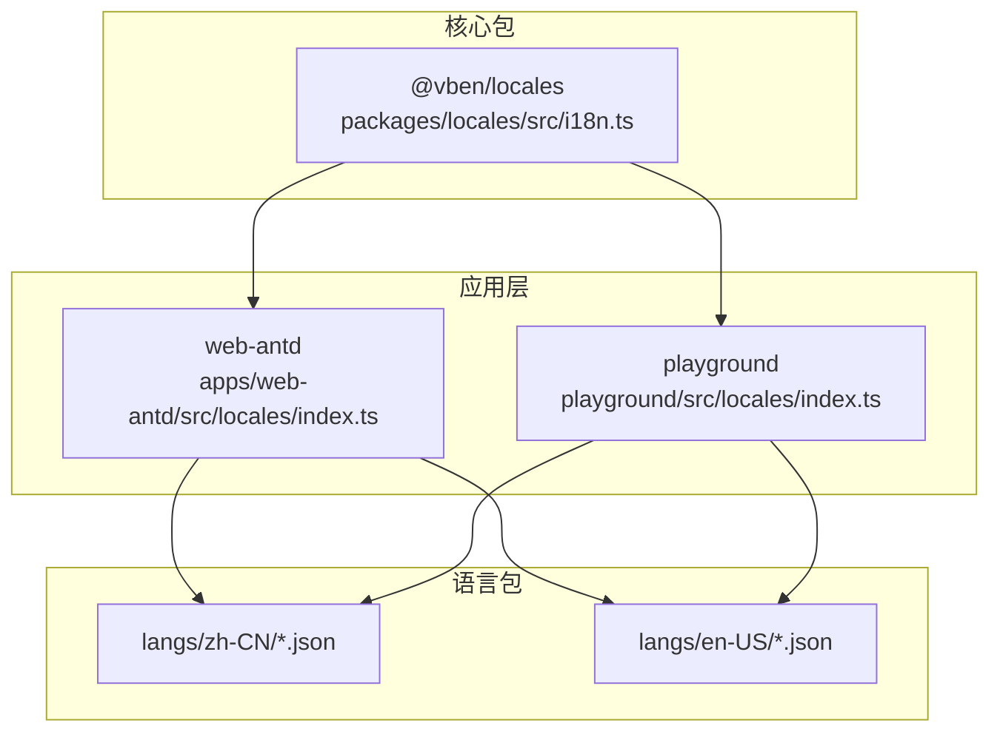
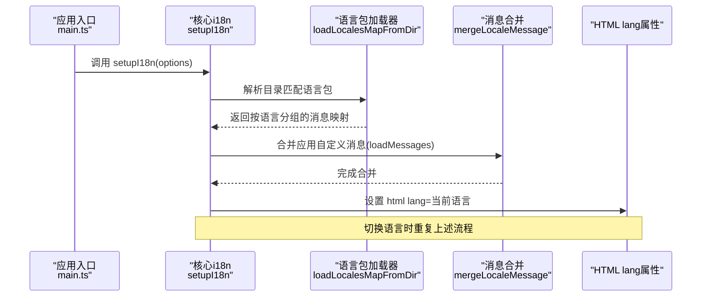
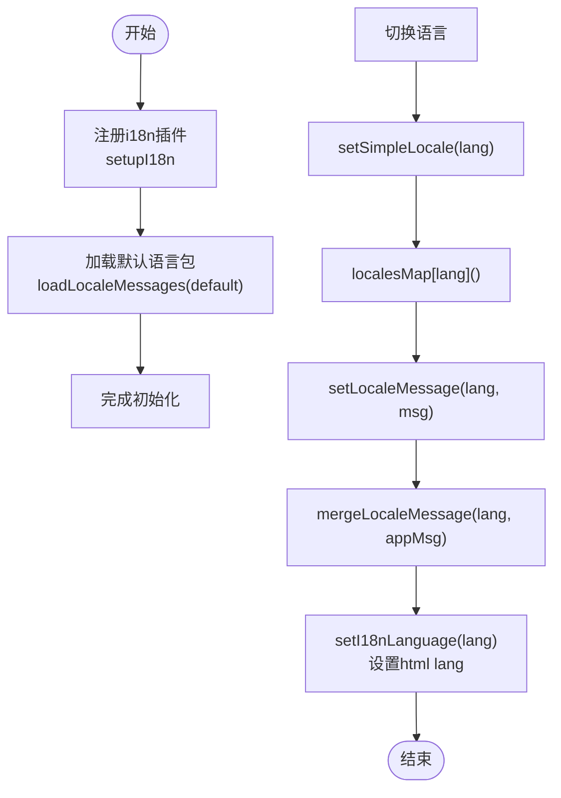
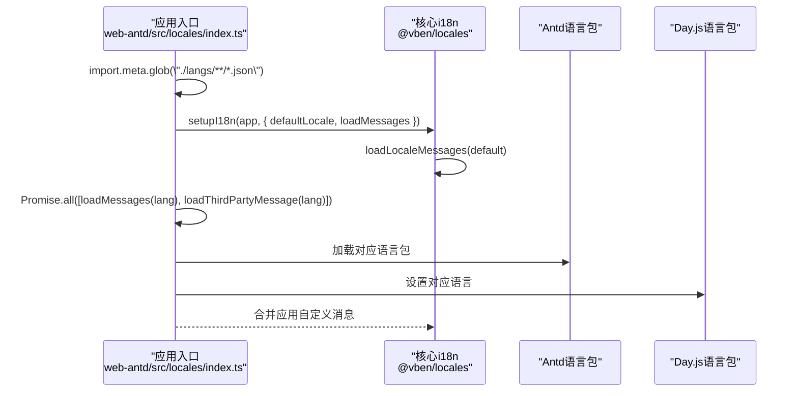
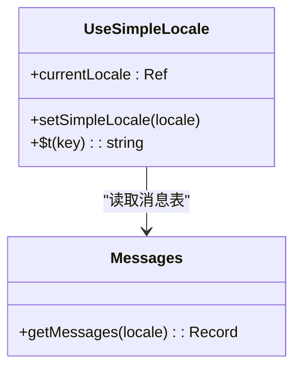
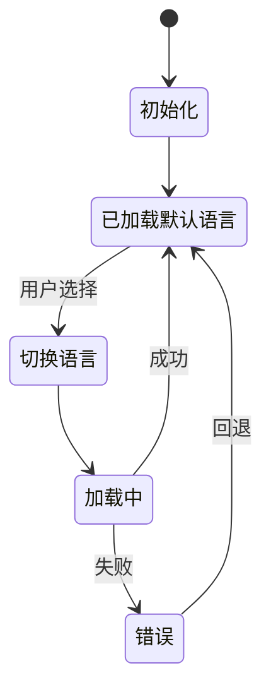
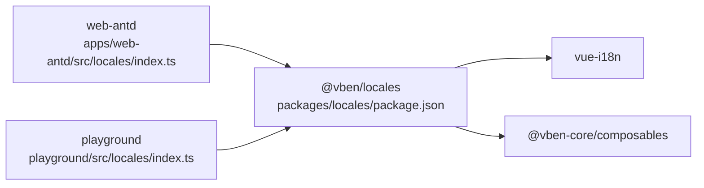

# 国际化系统

<cite>
**本文引用的文件**
- [packages/locales/src/i18n.ts](file://packages/locales/src/i18n.ts)
- [packages/locales/package.json](file://packages/locales/package.json)
- [packages/@core/composables/src/use-simple-locale/index.ts](file://packages/@core/composables/src/use-simple-locale/index.ts)
- [packages/@core/composables/src/use-simple-locale/messages.ts](file://packages/@core/composables/src/use-simple-locale/messages.ts)
- [apps/web-antd/src/locales/index.ts](file://apps/web-antd/src/locales/index.ts)
- [apps/web-antd/src/locales/langs/zh-CN/basic.json](file://apps/web-antd/src/locales/langs/zh-CN/basic.json)
- [apps/web-antd/src/locales/langs/en-US/basic.json](file://apps/web-antd/src/locales/langs/en-US/basic.json)
- [apps/web-antd/src/locales/langs/zh-CN/route.json](file://apps/web-antd/src/locales/langs/zh-CN/route.json)
- [apps/web-antd/src/locales/langs/en-US/route.json](file://apps/web-antd/src/locales/langs/en-US/route.json)
- [apps/web-antd/src/locales/langs/zh-CN/form.json](file://apps/web-antd/src/locales/langs/zh-CN/form.json)
- [apps/web-antd/src/locales/langs/en-US/form.json](file://apps/web-antd/src/locales/langs/en-US/form.json)
- [apps/web-antd/src/app.vue](file://apps/web-antd/src/app.vue)
- [apps/web-antd/src/main.ts](file://apps/web-antd/src/main.ts)
- [apps/web-antd/src/layouts/basic.vue](file://apps/web-antd/src/layouts/basic.vue)
- [apps/web-antd/src/components/dev/ProjectSelect/index.vue](file://apps/web-antd/src/components/dev/ProjectSelect/index.vue)
- [apps/web-antd/src/views/dashboard/workspace/index.vue](file://apps/web-antd/src/views/dashboard/workspace/index.vue)
- [apps/web-antd/src/router/routes/core.ts](file://apps/web-antd/src/router/routes/core.ts)
- [apps/web-antd/src/router/guard.ts](file://apps/web-antd/src/router/guard.ts)
- [apps/web-antd/src/store/auth.ts](file://apps/web-antd/src/store/auth.ts)
- [apps/web-antd/src/preferences.ts](file://apps/web-antd/src/preferences.ts)
- [playground/src/locales/index.ts](file://playground/src/locales/index.ts)
- [playground/src/locales/langs/zh-CN/basic.json](file://playground/src/locales/langs/zh-CN/basic.json)
- [playground/src/locales/langs/en-US/basic.json](file://playground/src/locales/langs/en-US/basic.json)
- [playground/src/app.vue](file://playground/src/app.vue)
- [playground/src/main.ts](file://playground/src/main.ts)
</cite>

## 目录
1. [简介](#简介)
2. [项目结构](#项目结构)
3. [核心组件](#核心组件)
4. [架构总览](#架构总览)
5. [详细组件分析](#详细组件分析)
6. [依赖关系分析](#依赖关系分析)
7. [性能考量](#性能考量)
8. [故障排查指南](#故障排查指南)
9. [结论](#结论)
10. [附录](#附录)

## 简介
本文件系统性阐述 Vben Admin 的国际化（i18n）体系：设计架构、实现原理、语言包组织方式、动态语言切换机制、文本翻译使用方法、新增语言步骤与最佳实践、本地化格式处理（日期/数字/货币），并结合仓库中的真实代码路径给出可操作的工作流程与排错建议。

## 项目结构
Vben Admin 将 i18n 能力抽象在独立包中，并在各 Web 应用入口中进行集成与扩展。核心位置如下：
- 核心 i18n 包：packages/locales
- 应用侧集成：apps/web-antd、playground 等
- 语言包目录：apps/*/src/locales/langs/{语言代码}/
- 组件与页面中通过 $t 或路由/表单等模块的本地化键值使用

图表来源
- [packages/locales/src/i18n.ts:102-117](file://packages/locales/src/i18n.ts#L102-L117)
- [apps/web-antd/src/locales/index.ts:22-39](file://apps/web-antd/src/locales/index.ts#L22-L39)
- [playground/src/locales/index.ts](file://playground/src/locales/index.ts)

章节来源
- [packages/locales/src/i18n.ts:102-117](file://packages/locales/src/i18n.ts#L102-L117)
- [apps/web-antd/src/locales/index.ts:22-39](file://apps/web-antd/src/locales/index.ts#L22-L39)
- [playground/src/locales/index.ts](file://playground/src/locales/index.ts)

## 核心组件
- 核心 i18n 实例与工具
  - 创建 vue-i18n 实例，提供 setupI18n、loadLocaleMessages、loadLocalesMapFromDir 等能力
  - 通过 import.meta.glob 收集语言包映射，支持按目录结构动态聚合
- 应用侧适配器
  - 在具体应用中定义 loadMessages/loadThirdPartyMessage，分别加载应用自有的语言包与第三方库（如 Ant Design Vue、Day.js）的语言包
- 简易本地化组合式函数
  - 提供 useSimpleLocale，用于简单场景下的语言切换与 $t 计算

章节来源
- [packages/locales/src/i18n.ts:16-21](file://packages/locales/src/i18n.ts#L16-L21)
- [packages/locales/src/i18n.ts:55-90](file://packages/locales/src/i18n.ts#L55-L90)
- [packages/locales/src/i18n.ts:102-117](file://packages/locales/src/i18n.ts#L102-L117)
- [packages/locales/src/i18n.ts:123-139](file://packages/locales/src/i18n.ts#L123-L139)
- [packages/@core/composables/src/use-simple-locale/index.ts:9-27](file://packages/@core/composables/src/use-simple-locale/index.ts#L9-L27)

## 架构总览
下图展示从应用启动到语言切换的完整链路：应用初始化时注册 i18n，加载默认语言包；用户切换语言时触发异步加载与合并，最终更新 DOM lang 属性与全局语言状态。

图表来源
- [packages/locales/src/i18n.ts:102-117](file://packages/locales/src/i18n.ts#L102-L117)
- [packages/locales/src/i18n.ts:123-139](file://packages/locales/src/i18n.ts#L123-L139)
- [apps/web-antd/src/locales/index.ts:33-39](file://apps/web-antd/src/locales/index.ts#L33-L39)

## 详细组件分析

### 核心 i18n 包（@vben/locales）
- 设计要点
  - 使用 vue-i18n（组合式 API 模式），通过 createI18n 初始化
  - 通过 import.meta.glob 动态收集语言包，支持按目录结构自动聚合
  - 提供 loadLocalesMapFromDir 将同名文件按语言维度合并为消息对象
  - 提供 setupI18n 注册插件、设置默认语言、缺失键告警
  - 提供 loadLocaleMessages 异步加载与合并消息，并设置 HTML lang 属性
- 关键流程
  - 初始化：注册 i18n 插件，加载默认语言
  - 切换：setSimpleLocale -> 加载对应语言包 -> setLocaleMessage -> mergeLocaleMessage -> setI18nLanguage
- 复杂度与性能
  - 语言包加载为异步，避免阻塞主线程
  - 消息合并为浅合并，避免深拷贝开销

图表来源
- [packages/locales/src/i18n.ts:102-117](file://packages/locales/src/i18n.ts#L102-L117)
- [packages/locales/src/i18n.ts:123-139](file://packages/locales/src/i18n.ts#L123-L139)

章节来源
- [packages/locales/src/i18n.ts:16-21](file://packages/locales/src/i18n.ts#L16-L21)
- [packages/locales/src/i18n.ts:55-90](file://packages/locales/src/i18n.ts#L55-L90)
- [packages/locales/src/i18n.ts:102-117](file://packages/locales/src/i18n.ts#L102-L117)
- [packages/locales/src/i18n.ts:123-139](file://packages/locales/src/i18n.ts#L123-L139)

### 应用侧适配器（以 web-antd 为例）
- 语言包加载
  - 通过 import.meta.glob 收集 ./langs/**/*.json
  - 使用 loadLocalesMapFromDir 生成 localesMap
  - loadMessages(lang) 返回对应语言的应用消息
- 第三方库本地化
  - 加载 Ant Design Vue 与 Day.js 的语言包，保持 UI 与日期显示一致
- 集成入口
  - setupI18n(app, { defaultLocale, loadMessages }) 完成注册与初始加载

图表来源
- [apps/web-antd/src/locales/index.ts:22-39](file://apps/web-antd/src/locales/index.ts#L22-L39)
- [apps/web-antd/src/locales/index.ts:45-74](file://apps/web-antd/src/locales/index.ts#L45-L74)
- [apps/web-antd/src/locales/index.ts:93-100](file://apps/web-antd/src/locales/index.ts#L93-L100)

章节来源
- [apps/web-antd/src/locales/index.ts:22-39](file://apps/web-antd/src/locales/index.ts#L22-L39)
- [apps/web-antd/src/locales/index.ts:45-74](file://apps/web-antd/src/locales/index.ts#L45-L74)
- [apps/web-antd/src/locales/index.ts:93-100](file://apps/web-antd/src/locales/index.ts#L93-L100)

### 简易本地化组合式函数（useSimpleLocale）
- 作用
  - 提供 currentLocale 与 $t 计算函数，便于简单场景快速切换与翻译
- 行为
  - setSimpleLocale 更新当前语言
  - $t 基于当前语言的消息表返回对应键值或回退为键名

图表来源
- [packages/@core/composables/src/use-simple-locale/index.ts:9-27](file://packages/@core/composables/src/use-simple-locale/index.ts#L9-L27)
- [packages/@core/composables/src/use-simple-locale/messages.ts](file://packages/@core/composables/src/use-simple-locale/messages.ts)

章节来源
- [packages/@core/composables/src/use-simple-locale/index.ts:9-27](file://packages/@core/composables/src/use-simple-locale/index.ts#L9-L27)

### 语言包组织与命名规范
- 目录结构
  - apps/*/src/locales/langs/{语言代码}/{模块名}.json
  - 示例：basic.json、route.json、form.json 等
- 命名规范
  - 语言代码采用标准标签（如 zh-CN、en-US）
  - 模块名小写，语义清晰，避免跨语言差异
- 加载机制
  - 核心包通过正则提取语言与文件名，按语言聚合为消息对象
  - 应用侧可扩展 loadMessages 以合并应用特定消息

章节来源
- [packages/locales/src/i18n.ts:55-90](file://packages/locales/src/i18n.ts#L55-L90)
- [apps/web-antd/src/locales/index.ts:22-27](file://apps/web-antd/src/locales/index.ts#L22-L27)

### 动态语言切换与界面更新
- 切换流程
  - 触发 setSimpleLocale -> loadLocaleMessages(lang)
  - 异步加载对应语言包与应用自定义消息 -> setLocaleMessage + mergeLocaleMessage
  - setI18nLanguage(lang) 更新全局语言与 HTML lang 属性
- 状态管理
  - 核心：i18n.global.locale
  - 应用偏好：preferences.app.locale（作为默认语言来源）

图表来源
- [packages/locales/src/i18n.ts:123-139](file://packages/locales/src/i18n.ts#L123-L139)
- [apps/web-antd/src/preferences.ts](file://apps/web-antd/src/preferences.ts)

章节来源
- [packages/locales/src/i18n.ts:96-100](file://packages/locales/src/i18n.ts#L96-L100)
- [packages/locales/src/i18n.ts:123-139](file://packages/locales/src/i18n.ts#L123-L139)
- [apps/web-antd/src/preferences.ts](file://apps/web-antd/src/preferences.ts)

### 文本翻译使用方法
- 模板字符串
  - 在 .vue 模板中使用 $t 计算属性访问翻译键
- 函数调用
  - 在逻辑中通过 $t(key) 获取翻译文本
- 组件属性
  - 在表单、表格等组件属性中使用翻译键，确保随语言切换自动更新
- 路由与菜单
  - 路由标题、面包屑文案等通过本地化键值配置

章节来源
- [apps/web-antd/src/components/dev/ProjectSelect/index.vue](file://apps/web-antd/src/components/dev/ProjectSelect/index.vue)
- [apps/web-antd/src/views/dashboard/workspace/index.vue](file://apps/web-antd/src/views/dashboard/workspace/index.vue)
- [apps/web-antd/src/router/routes/core.ts](file://apps/web-antd/src/router/routes/core.ts)

### 新增语言步骤与最佳实践
- 步骤
  1) 在 apps/*/src/locales/langs 下新增语言目录（如 fr-FR）
  2) 复制现有语言目录的模块文件，仅翻译对应键值
  3) 在应用侧 setupI18n 中确保 defaultLocale 支持该语言
  4) 如需第三方库本地化，补充对应语言包加载逻辑
- 最佳实践
  - 保持模块命名一致性，避免深层嵌套
  - 键名使用点号分隔的层级结构，便于维护
  - 对缺失键启用缺失告警，便于发现遗漏
  - 将常用短语抽取为公共模块，减少重复

章节来源
- [apps/web-antd/src/locales/index.ts:93-100](file://apps/web-antd/src/locales/index.ts#L93-L100)
- [packages/locales/src/i18n.ts:110-116](file://packages/locales/src/i18n.ts#L110-L116)

### 本地化格式处理（日期、数字、货币）
- 日期
  - 通过 Day.js 语言包切换本地化格式
- 数字/货币
  - 可在应用侧扩展 loadMessages，注入数值格式化规则
  - 或在组件中使用浏览器 Intl API 进行格式化

章节来源
- [apps/web-antd/src/locales/index.ts:53-74](file://apps/web-antd/src/locales/index.ts#L53-L74)

### 实际语言包示例与翻译工作流程
- 示例文件
  - apps/web-antd/src/locales/langs/zh-CN/basic.json
  - apps/web-antd/src/locales/langs/en-US/basic.json
  - apps/web-antd/src/locales/langs/zh-CN/route.json
  - apps/web-antd/src/locales/langs/en-US/route.json
  - apps/web-antd/src/locales/langs/zh-CN/form.json
  - apps/web-antd/src/locales/langs/en-US/form.json
- 工作流程
  - 在 basic.json 中定义基础键值
  - 在 route.json 中定义路由标题与面包屑
  - 在 form.json 中定义表单字段与提示
  - 通过 $t(key) 在模板与逻辑中使用

章节来源
- [apps/web-antd/src/locales/langs/zh-CN/basic.json](file://apps/web-antd/src/locales/langs/zh-CN/basic.json)
- [apps/web-antd/src/locales/langs/en-US/basic.json](file://apps/web-antd/src/locales/langs/en-US/basic.json)
- [apps/web-antd/src/locales/langs/zh-CN/route.json](file://apps/web-antd/src/locales/langs/zh-CN/route.json)
- [apps/web-antd/src/locales/langs/en-US/route.json](file://apps/web-antd/src/locales/langs/en-US/route.json)
- [apps/web-antd/src/locales/langs/zh-CN/form.json](file://apps/web-antd/src/locales/langs/zh-CN/form.json)
- [apps/web-antd/src/locales/langs/en-US/form.json](file://apps/web-antd/src/locales/langs/en-US/form.json)

## 依赖关系分析
- 核心依赖
  - @vben/locales 依赖 vue-i18n、@vben-core/composables
  - 应用侧依赖 @vben/locales 与第三方 UI 库语言包
- 导入关系
  - 应用入口导入 @vben/locales 并调用 setupI18n
  - 语言包通过 import.meta.glob 注入核心包

图表来源
- [packages/locales/package.json:22-27](file://packages/locales/package.json#L22-L27)
- [apps/web-antd/src/locales/index.ts:9-13](file://apps/web-antd/src/locales/index.ts#L9-L13)
- [playground/src/locales/index.ts](file://playground/src/locales/index.ts)

章节来源
- [packages/locales/package.json:22-27](file://packages/locales/package.json#L22-L27)
- [apps/web-antd/src/locales/index.ts:9-13](file://apps/web-antd/src/locales/index.ts#L9-L13)

## 性能考量
- 异步加载：语言包按需加载，避免首屏阻塞
- 浅合并：mergeLocaleMessage 为浅合并，减少深拷贝成本
- 缺失键告警：开发环境输出告警，便于早期发现缺失
- 第三方库本地化：按需加载，避免不必要的体积增长

## 故障排查指南
- 语言切换无效
  - 检查是否正确调用 setupI18n 与 loadLocaleMessages
  - 确认 HTML lang 是否被设置
- 缺失键
  - 开启 missingWarn 查看控制台告警
  - 检查语言包中是否存在对应键
- 第三方库显示异常
  - 确认已加载对应语言包（Antd/Day.js）
- 默认语言不生效
  - 检查 preferences.app.locale 与 setupI18n 的 defaultLocale

章节来源
- [packages/locales/src/i18n.ts:110-116](file://packages/locales/src/i18n.ts#L110-L116)
- [packages/locales/src/i18n.ts:96-100](file://packages/locales/src/i18n.ts#L96-L100)
- [apps/web-antd/src/locales/index.ts:93-100](file://apps/web-antd/src/locales/index.ts#L93-L100)

## 结论
Vben Admin 的国际化系统以 @vben/locales 为核心，结合应用侧适配器实现“目录驱动”的语言包加载与“按需合并”的消息注入。通过统一的切换流程与第三方库本地化策略，既保证了开发体验，也兼顾了运行时性能。遵循本文档的组织规范与最佳实践，可高效扩展多语言支持并维持高质量的翻译质量。

## 附录
- 入口与布局
  - 应用入口：apps/web-antd/src/main.ts、playground/src/main.ts
  - 根组件：apps/web-antd/src/app.vue、playground/src/app.vue
  - 基础布局：apps/web-antd/src/layouts/basic.vue
- 路由与守卫
  - 路由配置：apps/web-antd/src/router/routes/core.ts
  - 路由守卫：apps/web-antd/src/router/guard.ts
- 认证与偏好
  - 认证状态：apps/web-antd/src/store/auth.ts
  - 应用偏好：apps/web-antd/src/preferences.ts

章节来源
- [apps/web-antd/src/main.ts](file://apps/web-antd/src/main.ts)
- [playground/src/main.ts](file://playground/src/main.ts)
- [apps/web-antd/src/app.vue](file://apps/web-antd/src/app.vue)
- [playground/src/app.vue](file://playground/src/app.vue)
- [apps/web-antd/src/layouts/basic.vue](file://apps/web-antd/src/layouts/basic.vue)
- [apps/web-antd/src/router/routes/core.ts](file://apps/web-antd/src/router/routes/core.ts)
- [apps/web-antd/src/router/guard.ts](file://apps/web-antd/src/router/guard.ts)
- [apps/web-antd/src/store/auth.ts](file://apps/web-antd/src/store/auth.ts)
- [apps/web-antd/src/preferences.ts](file://apps/web-antd/src/preferences.ts)