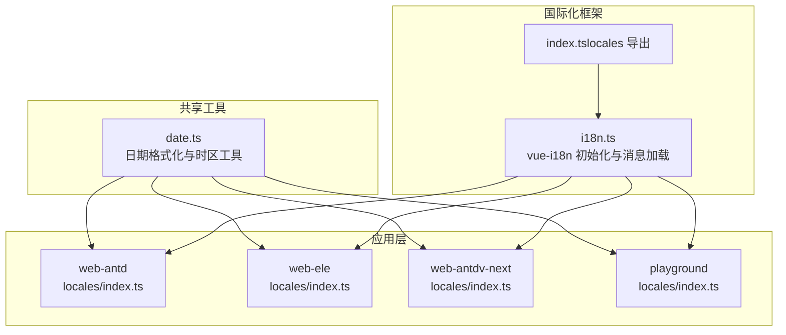
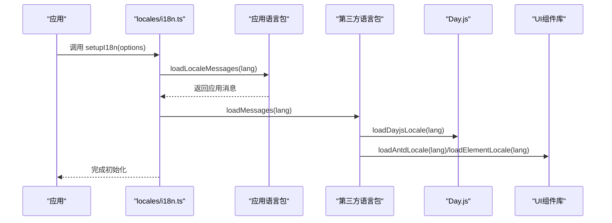
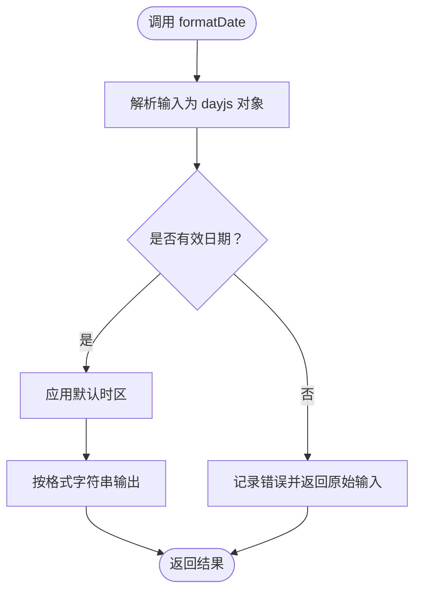
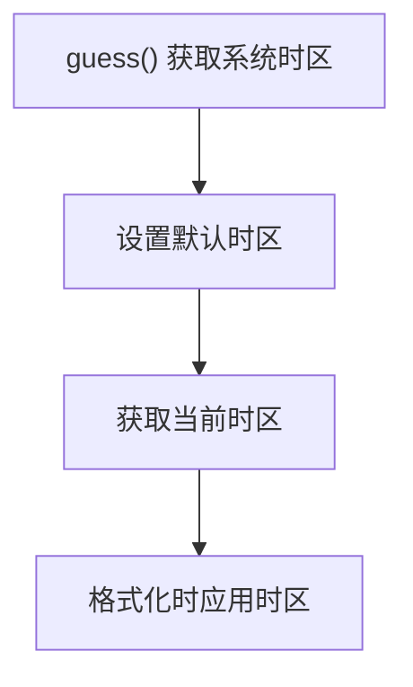
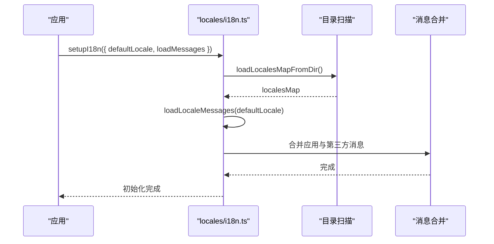
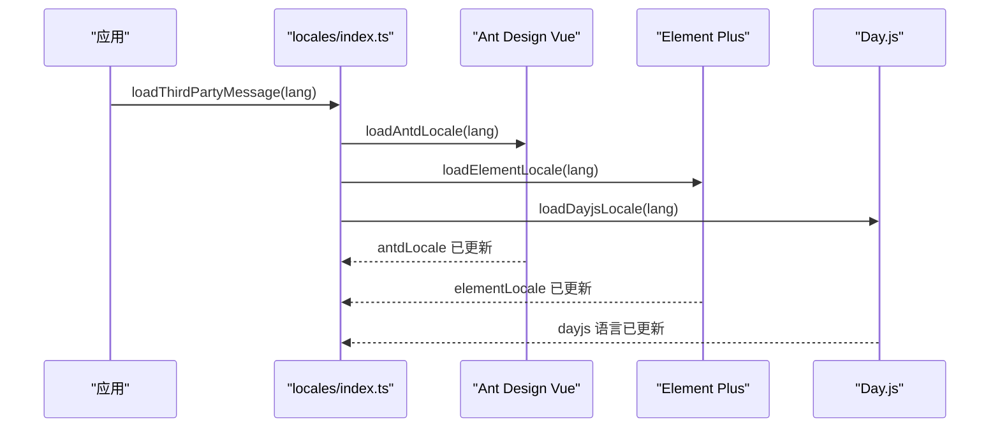
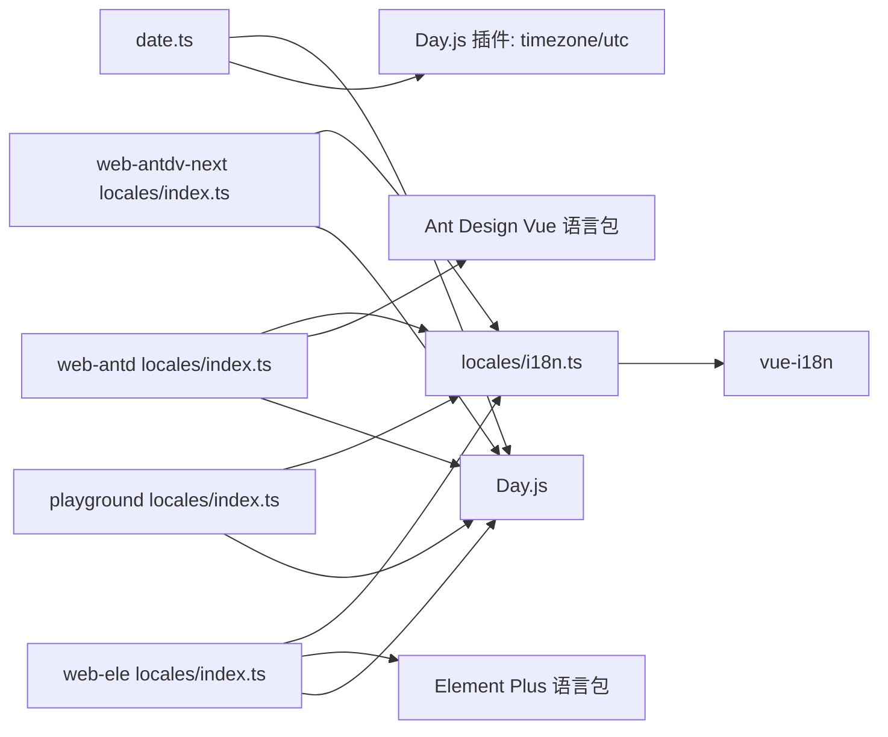

# 本地化格式处理

<cite>
**本文引用的文件**
- [date.ts](file://packages/@core/base/shared/src/utils/date.ts)
- [date.test.ts](file://packages/@core/base/shared/src/utils/__tests__/date.test.ts)
- [locale.md](file://docs/src/guide/in-depth/locale.md)
- [i18n.ts](file://packages/locales/src/i18n.ts)
- [index.ts（locales 导出）](file://packages/locales/src/index.ts)
- [index.ts（web-antd 本地化入口）](file://apps/web-antd/src/locales/index.ts)
- [index.ts（web-ele 本地化入口）](file://apps/web-ele/src/locales/index.ts)
- [index.ts（web-antdv-next 本地化入口）](file://apps/web-antdv-next/src/locales/index.ts)
- [index.ts（playground 本地化入口）](file://playground/src/locales/index.ts)
</cite>

## 目录

1. [简介](#简介)
2. [项目结构](#项目结构)
3. [核心组件](#核心组件)
4. [架构总览](#架构总览)
5. [详细组件分析](#详细组件分析)
6. [依赖关系分析](#依赖关系分析)
7. [性能考量](#性能考量)
8. [故障排查指南](#故障排查指南)
9. [结论](#结论)
10. [附录](#附录)

## 简介

本文件聚焦于 Vben Admin 的本地化格式处理，围绕以下主题展开：

- 日期格式化：基于 Day.js 的集成与自定义格式化规则
- 数字与货币格式化：千分位分隔符、小数位数、货币符号的本地化策略
- 时间格式化：24 小时制与 12 小时制的切换与本地化
- 文本方向与布局：LTR/RTL 的支持策略
- 数字分组与小数点符号：地区差异处理
- 配置方法：全局设置与局部覆盖
- 第三方库本地化：Ant Design Vue、Element Plus、Naive UI、TDesign 的国际化集成
- 示例与自定义格式化函数：提供可复用的实现路径
- 测试方法与验证工具：确保格式化行为稳定可靠

## 项目结构

本地化格式处理涉及多层协作：

- 通用日期格式化工具位于共享工具库
- 通用国际化框架由 locales 包提供
- 各前端应用（web-antd、web-ele、web-antdv-next、playground）在各自 locales 入口集中加载第三方组件库与 Day.js 的语言包，并按需切换语言
- 文档 guide 中提供了第三方语言包加载的参考实现

图表来源

- [date.ts:1-76](file://packages/@core/base/shared/src/utils/date.ts#L1-L76)
- [i18n.ts:1-148](file://packages/locales/src/i18n.ts#L1-L148)
- [index.ts（locales 导出）:1-31](file://packages/locales/src/index.ts#L1-L31)
- [index.ts（web-antd 本地化入口）:1-103](file://apps/web-antd/src/locales/index.ts#L1-L103)
- [index.ts（web-ele 本地化入口）:1-102](file://apps/web-ele/src/locales/index.ts#L1-L102)
- [index.ts（web-antdv-next 本地化入口）:1-102](file://apps/web-antdv-next/src/locales/index.ts#L1-L102)
- [index.ts（playground 本地化入口）:1-102](file://playground/src/locales/index.ts#L1-L102)

章节来源

- [date.ts:1-76](file://packages/@core/base/shared/src/utils/date.ts#L1-L76)
- [i18n.ts:1-148](file://packages/locales/src/i18n.ts#L1-L148)
- [index.ts（locales 导出）:1-31](file://packages/locales/src/index.ts#L1-L31)
- [index.ts（web-antd 本地化入口）:1-103](file://apps/web-antd/src/locales/index.ts#L1-L103)
- [index.ts（web-ele 本地化入口）:1-102](file://apps/web-ele/src/locales/index.ts#L1-L102)
- [index.ts（web-antdv-next 本地化入口）:1-102](file://apps/web-antdv-next/src/locales/index.ts#L1-L102)
- [index.ts（playground 本地化入口）:1-102](file://playground/src/locales/index.ts#L1-L102)

## 核心组件

- 日期格式化工具：提供统一的日期/时间格式化入口，支持多种输入类型与错误兜底
- 时区管理：自动探测系统时区并可手动设置默认时区，确保格式化结果符合预期
- 国际化框架：基于 vue-i18n，提供消息加载、合并与语言切换能力
- 第三方库本地化：在应用级入口集中加载 Day.js 与各 UI 组件库的语言包

章节来源

- [date.ts:22-37](file://packages/@core/base/shared/src/utils/date.ts#L22-L37)
- [date.ts:47-75](file://packages/@core/base/shared/src/utils/date.ts#L47-L75)
- [i18n.ts:102-139](file://packages/locales/src/i18n.ts#L102-L139)
- [index.ts（web-antd 本地化入口）:45-91](file://apps/web-antd/src/locales/index.ts#L45-L91)
- [index.ts（web-ele 本地化入口）:76-91](file://apps/web-ele/src/locales/index.ts#L76-L91)

## 架构总览

本地化格式处理的关键流程：

- 应用启动时调用国际化初始化，加载默认语言与第三方语言包
- 日期格式化统一走共享工具，内部使用 Day.js 并结合时区插件
- UI 组件库与 Day.js 的语言包按语言切换动态加载
- 文档提供了第三方语言包加载的参考实现，便于扩展

图表来源

- [i18n.ts:102-139](file://packages/locales/src/i18n.ts#L102-L139)
- [index.ts（web-antd 本地化入口）:33-47](file://apps/web-antd/src/locales/index.ts#L33-L47)
- [index.ts（web-ele 本地化入口）:76-91](file://apps/web-ele/src/locales/index.ts#L76-L91)
- [index.ts（web-antdv-next 本地化入口）:76-91](file://apps/web-antdv-next/src/locales/index.ts#L76-L91)
- [index.ts（playground 本地化入口）:76-91](file://playground/src/locales/index.ts#L76-L91)

## 详细组件分析

### 日期格式化组件

- 支持输入类型：Date、dayjs 对象、时间戳、字符串
- 默认格式：'YYYY-MM-DD'；提供 formatDateTime 快捷方法
- 错误处理：非法日期返回原始输入字符串或空串
- 时区：默认使用系统时区，可通过 setCurrentTimezone 设置全局默认时区

图表来源

- [date.ts:22-33](file://packages/@core/base/shared/src/utils/date.ts#L22-L33)

章节来源

- [date.ts:8-37](file://packages/@core/base/shared/src/utils/date.ts#L8-L37)
- [date.ts:47-75](file://packages/@core/base/shared/src/utils/date.ts#L47-L75)
- [date.test.ts:19-142](file://packages/@core/base/shared/src/utils/__tests__/date.test.ts#L19-L142)

### 时区管理组件

- 自动探测系统时区
- 可设置全局默认时区，影响后续日期格式化
- 提供获取当前设置时区的能力

图表来源

- [date.ts:51-75](file://packages/@core/base/shared/src/utils/date.ts#L51-L75)

章节来源

- [date.ts:51-75](file://packages/@core/base/shared/src/utils/date.ts#L51-L75)

### 国际化框架（locales）

- 基于 vue-i18n 创建实例，支持目录扫描生成语言包映射
- 提供 setupI18n 初始化、loadLocaleMessages 加载与合并消息、setI18nLanguage 设置语言
- 支持第三方语言包加载钩子，允许应用层扩展

图表来源

- [i18n.ts:27-90](file://packages/locales/src/i18n.ts#L27-L90)
- [i18n.ts:102-139](file://packages/locales/src/i18n.ts#L102-L139)
- [index.ts（locales 导出）:1-31](file://packages/locales/src/index.ts#L1-L31)

章节来源

- [i18n.ts:1-148](file://packages/locales/src/i18n.ts#L1-L148)
- [index.ts（locales 导出）:1-31](file://packages/locales/src/index.ts#L1-L31)

### 第三方库本地化集成

- Ant Design Vue：在应用入口集中加载 antd 语言包与 Day.js 语言包
- Element Plus：同上，分别加载对应语言包
- Ant Design Vue Next、Naive UI、TDesign：均在各自应用入口提供类似模式

图表来源

- [index.ts（web-antd 本地化入口）:45-91](file://apps/web-antd/src/locales/index.ts#L45-L91)
- [index.ts（web-ele 本地化入口）:76-91](file://apps/web-ele/src/locales/index.ts#L76-L91)
- [index.ts（web-antdv-next 本地化入口）:76-91](file://apps/web-antdv-next/src/locales/index.ts#L76-L91)
- [index.ts（playground 本地化入口）:76-91](file://playground/src/locales/index.ts#L76-L91)

章节来源

- [index.ts（web-antd 本地化入口）:45-91](file://apps/web-antd/src/locales/index.ts#L45-L91)
- [index.ts（web-ele 本地化入口）:76-91](file://apps/web-ele/src/locales/index.ts#L76-L91)
- [index.ts（web-antdv-next 本地化入口）:76-91](file://apps/web-antdv-next/src/locales/index.ts#L76-L91)
- [index.ts（playground 本地化入口）:76-91](file://playground/src/locales/index.ts#L76-L91)
- [locale.md:176-207](file://docs/src/guide/in-depth/locale.md#L176-L207)

## 依赖关系分析

- 日期格式化依赖 Day.js 与 timezone 插件
- 国际化框架依赖 vue-i18n，应用层通过入口文件扩展第三方语言包
- 各应用入口文件对第三方库语言包与 Day.js 语言包进行统一加载

图表来源

- [date.ts:1-6](file://packages/@core/base/shared/src/utils/date.ts#L1-L6)
- [i18n.ts:12-21](file://packages/locales/src/i18n.ts#L12-L21)
- [index.ts（web-antd 本地化入口）:16-18](file://apps/web-antd/src/locales/index.ts#L16-L18)
- [index.ts（web-ele 本地化入口）:1-14](file://apps/web-ele/src/locales/index.ts#L1-L14)
- [index.ts（web-antdv-next 本地化入口）:1-14](file://apps/web-antdv-next/src/locales/index.ts#L1-L14)
- [index.ts（playground 本地化入口）:1-14](file://playground/src/locales/index.ts#L1-L14)

章节来源

- [date.ts:1-6](file://packages/@core/base/shared/src/utils/date.ts#L1-L6)
- [i18n.ts:12-21](file://packages/locales/src/i18n.ts#L12-L21)
- [index.ts（web-antd 本地化入口）:16-18](file://apps/web-antd/src/locales/index.ts#L16-L18)
- [index.ts（web-ele 本地化入口）:1-14](file://apps/web-ele/src/locales/index.ts#L1-L14)
- [index.ts（web-antdv-next 本地化入口）:1-14](file://apps/web-antdv-next/src/locales/index.ts#L1-L14)
- [index.ts（playground 本地化入口）:1-14](file://playground/src/locales/index.ts#L1-L14)

## 性能考量

- 按需异步加载第三方语言包，避免首屏体积膨胀
- 时区设置仅在初始化阶段执行一次，减少重复计算
- 日期格式化采用统一入口，便于缓存与复用

## 故障排查指南

- 日期格式化异常：检查输入类型与有效性，确认时区设置是否正确
- 语言包缺失：确认 locales 目录结构与命名规范，检查 loadLocalesMapFromDir 的正则匹配
- 第三方库语言包未生效：确认应用入口中的 loadThirdPartyMessage 是否被调用，以及对应语言包导入路径是否正确

章节来源

- [date.test.ts:19-142](file://packages/@core/base/shared/src/utils/__tests__/date.test.ts#L19-L142)
- [i18n.ts:55-90](file://packages/locales/src/i18n.ts#L55-L90)
- [index.ts（web-antd 本地化入口）:45-91](file://apps/web-antd/src/locales/index.ts#L45-L91)

## 结论

Vben Admin 的本地化格式处理以共享工具与国际化框架为核心，辅以应用层入口对第三方库语言包的集中加载。通过统一的日期格式化与时区管理，配合灵活的国际化机制，能够满足多语言、多地区场景下的格式化需求。

## 附录

### 本地化格式配置方法

- 全局默认语言：在应用偏好设置中覆盖默认 locale
- 动态切换语言：更新偏好设置并加载对应语言包
- 远程加载语言包：在应用入口的 loadMessages 中替换为远程接口加载
- 关闭国际化警告：在 setupI18n 中将 missingWarn 设为 false

章节来源

- [locale.md:11-48](file://docs/src/guide/in-depth/locale.md#L11-L48)
- [locale.md:155-174](file://docs/src/guide/in-depth/locale.md#L155-L174)
- [locale.md:209-227](file://docs/src/guide/in-depth/locale.md#L209-L227)
- [i18n.ts:102-117](file://packages/locales/src/i18n.ts#L102-L117)

### 第三方库本地化集成要点

- Ant Design Vue：分别加载 antd 语言包与 Day.js 语言包
- Element Plus：分别加载 element-plus 语言包与 Day.js 语言包
- 其他 UI 框架：在各自应用入口提供类似的加载逻辑

章节来源

- [index.ts（web-antd 本地化入口）:76-91](file://apps/web-antd/src/locales/index.ts#L76-L91)
- [index.ts（web-ele 本地化入口）:76-91](file://apps/web-ele/src/locales/index.ts#L76-L91)
- [index.ts（web-antdv-next 本地化入口）:76-91](file://apps/web-antdv-next/src/locales/index.ts#L76-L91)
- [index.ts（playground 本地化入口）:76-91](file://playground/src/locales/index.ts#L76-L91)
- [locale.md:176-207](file://docs/src/guide/in-depth/locale.md#L176-L207)

### 数字与货币格式化（策略与实现路径）

- 千分位分隔符与小数点符号：遵循地区约定，可在 UI 层使用各组件库提供的数值/货币组件
- 小数位数：通过组件属性或格式化函数控制
- 货币符号：优先使用组件库内置的货币格式化能力，或在格式化函数中拼接货币符号
- 实现路径参考：各应用入口的 locales/index.ts 中的 loadThirdPartyMessage 与 loadMessages，用于加载第三方语言包与应用特定消息

章节来源

- [index.ts（web-antd 本地化入口）:33-47](file://apps/web-antd/src/locales/index.ts#L33-L47)
- [index.ts（web-ele 本地化入口）:33-39](file://apps/web-ele/src/locales/index.ts#L33-L39)
- [index.ts（web-antdv-next 本地化入口）:33-39](file://apps/web-antdv-next/src/locales/index.ts#L33-L39)
- [index.ts（playground 本地化入口）:33-39](file://playground/src/locales/index.ts#L33-L39)

### 时间格式化本地化策略（24/12 小时制）

- 通过 Day.js 的语言包与组件库语言包共同决定时间显示风格
- 在应用入口集中加载 Day.js 语言包与 UI 组件库语言包，确保时间格式随语言切换而变化

章节来源

- [index.ts（web-antd 本地化入口）:53-74](file://apps/web-antd/src/locales/index.ts#L53-L74)
- [index.ts（web-ele 本地化入口）:53-74](file://apps/web-ele/src/locales/index.ts#L53-L74)
- [index.ts（web-antdv-next 本地化入口）:53-74](file://apps/web-antdv-next/src/locales/index.ts#L53-L74)
- [index.ts（playground 本地化入口）:53-74](file://playground/src/locales/index.ts#L53-L74)

### 文本方向与布局（LTR/RTL）

- HTML lang 属性在国际化初始化时设置，便于样式与布局适配
- UI 组件库通常提供 RTL 支持，可在应用入口加载对应语言包时一并启用

章节来源

- [i18n.ts:96-100](file://packages/locales/src/i18n.ts#L96-L100)

### 数字分组与小数点符号地区差异

- 通过组件库的本地化语言包自动适配
- 若需自定义，可在应用层提供格式化函数并在组件中使用

章节来源

- [index.ts（web-antd 本地化入口）:45-91](file://apps/web-antd/src/locales/index.ts#L45-L91)
- [index.ts（web-ele 本地化入口）:76-91](file://apps/web-ele/src/locales/index.ts#L76-L91)

### 本地化格式示例与自定义格式化函数

- 日期格式化示例：参考共享工具中的 formatDate/formatDateTime
- 自定义格式化函数：在应用层封装格式化逻辑，并在组件中调用

章节来源

- [date.ts:22-37](file://packages/@core/base/shared/src/utils/date.ts#L22-L37)
- [date.test.ts:36-55](file://packages/@core/base/shared/src/utils/__tests__/date.test.ts#L36-L55)

### 本地化格式测试方法与验证工具

- 单元测试：使用 Vitest 对日期格式化进行断言，覆盖多种输入类型与时区场景
- 验证工具：在浏览器控制台观察国际化警告，确认消息键是否存在

章节来源

- [date.test.ts:19-142](file://packages/@core/base/shared/src/utils/__tests__/date.test.ts#L19-L142)
- [i18n.ts:110-116](file://packages/locales/src/i18n.ts#L110-L116)
