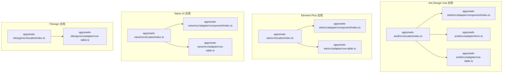
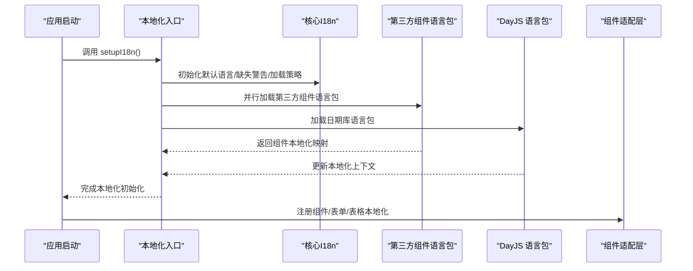
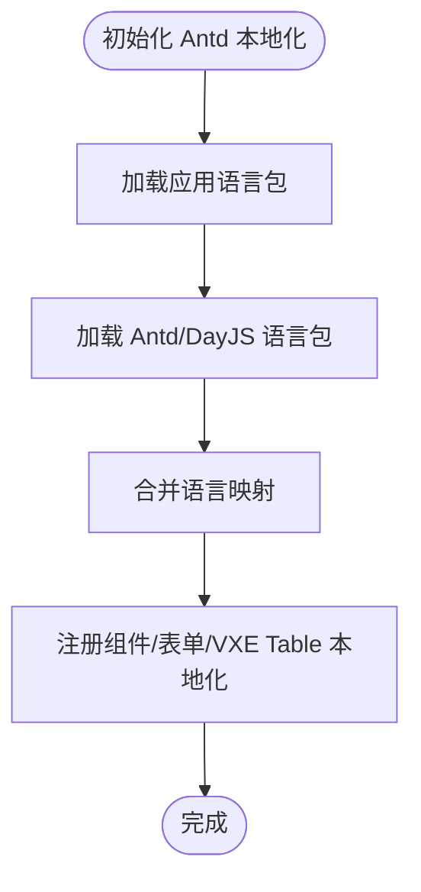
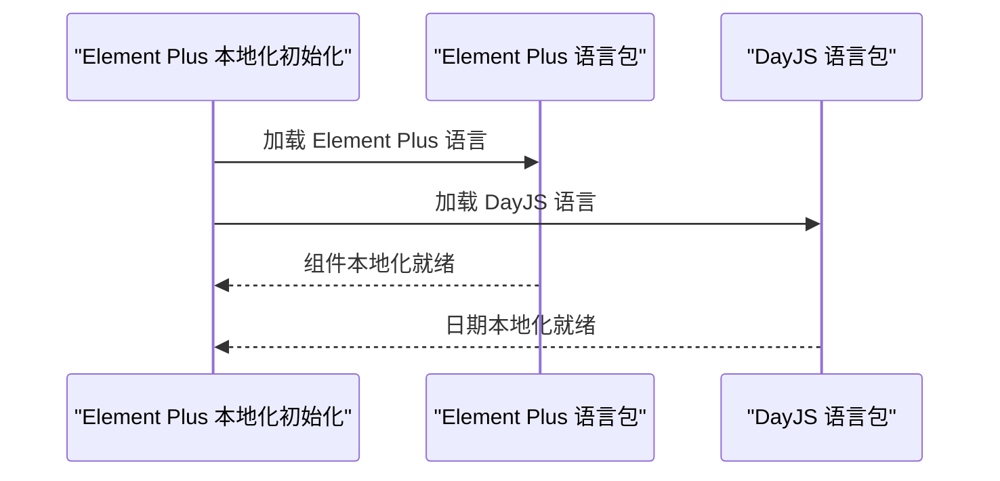
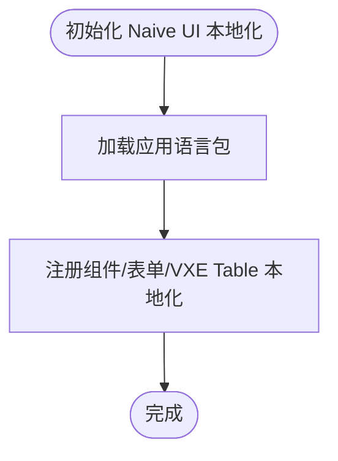
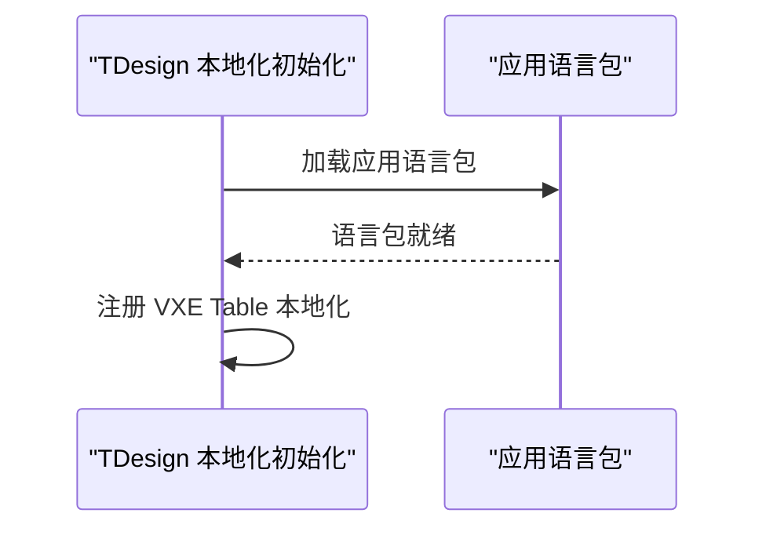
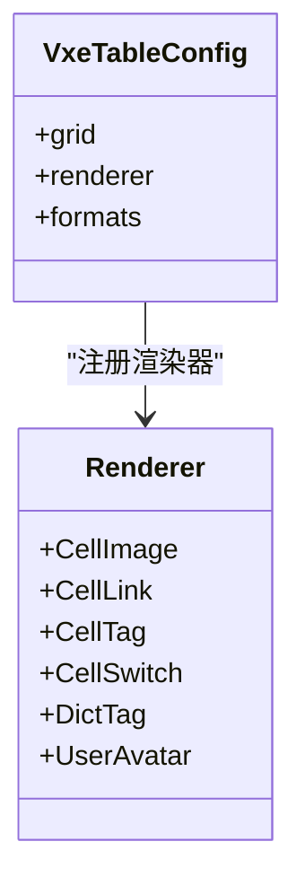
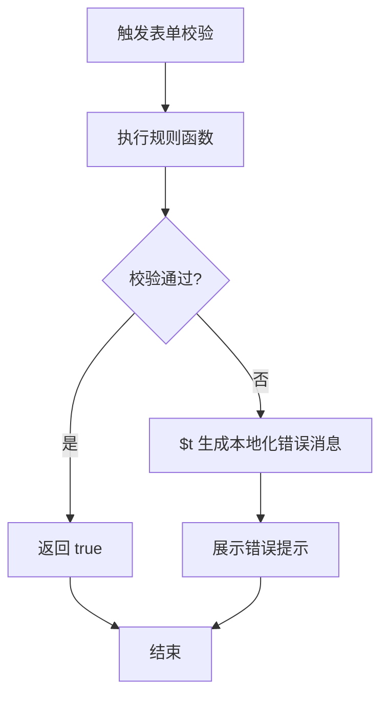
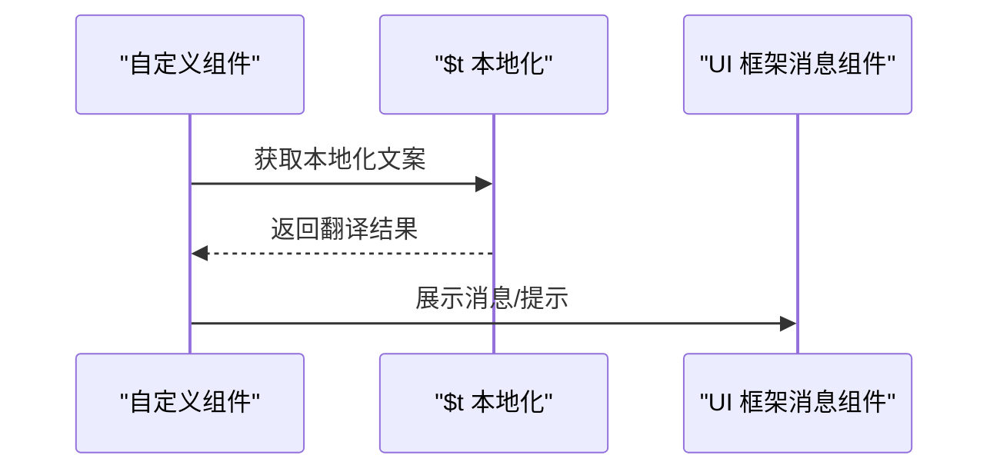
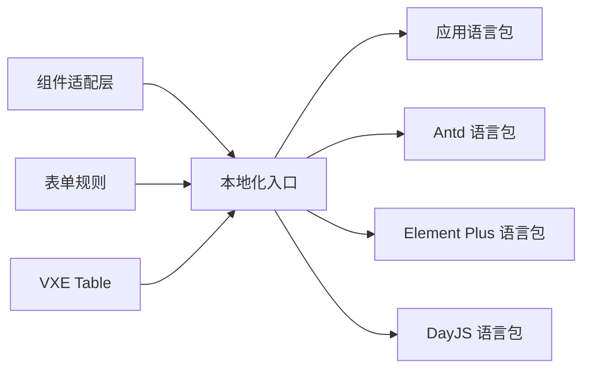

# 第三方组件本地化

<cite>
**本文引用的文件**
- [apps/web-antd/src/locales/index.ts](file://apps/web-antd/src/locales/index.ts)
- [apps/web-ele/src/locales/index.ts](file://apps/web-ele/src/locales/index.ts)
- [apps/web-naive/src/locales/index.ts](file://apps/web-naive/src/locales/index.ts)
- [apps/web-tdesign/src/locales/index.ts](file://apps/web-tdesign/src/locales/index.ts)
- [apps/web-antd/src/adapter/component/index.ts](file://apps/web-antd/src/adapter/component/index.ts)
- [apps/web-ele/src/adapter/component/index.ts](file://apps/web-ele/src/adapter/component/index.ts)
- [apps/web-naive/src/adapter/component/index.ts](file://apps/web-naive/src/adapter/component/index.ts)
- [apps/web-antd/src/adapter/form.ts](file://apps/web-antd/src/adapter/form.ts)
- [apps/web-antd/src/adapter/vxe-table.ts](file://apps/web-antd/src/adapter/vxe-table.ts)
- [apps/web-ele/src/adapter/vxe-table.ts](file://apps/web-ele/src/adapter/vxe-table.ts)
- [apps/web-naive/src/adapter/vxe-table.ts](file://apps/web-naive/src/adapter/vxe-table.ts)
- [apps/web-tdesign/src/adapter/vxe-table.ts](file://apps/web-tdesign/src/adapter/vxe-table.ts)
</cite>

## 目录

1. [简介](#简介)
2. [项目结构](#项目结构)
3. [核心组件](#核心组件)
4. [架构总览](#架构总览)
5. [详细组件分析](#详细组件分析)
6. [依赖关系分析](#依赖关系分析)
7. [性能考量](#性能考量)
8. [故障排查指南](#故障排查指南)
9. [结论](#结论)
10. [附录](#附录)

## 简介

本文件系统性梳理 Vben Admin 在多 UI 框架（Ant Design Vue、Element Plus、Naive UI、TDesign）下的第三方组件本地化集成方案，覆盖以下方面：

- 语言包的动态加载与切换机制
- 各 UI 框架的组件本地化配置（含 Antd、Element Plus、Naive UI、TDesign）
- 表格组件（VXE Table）的本地化配置（排序、筛选、分页）
- 图表组件本地化支持（轴标签、图例、提示框）
- 表单验证消息本地化（必填、格式、自定义）
- 组件级与全局语言包管理的最佳实践
- 自定义组件本地化实现思路
- 常见问题与排障建议

## 项目结构

本项目采用“多应用”结构，每个 UI 框架对应一个独立前端应用，分别在各自 locales 目录下维护语言包与本地化初始化逻辑；同时在 adapter 层对第三方组件进行适配与本地化桥接。

**图表来源**

- [apps/web-antd/src/locales/index.ts:1-103](file://apps/web-antd/src/locales/index.ts#L1-L103)
- [apps/web-ele/src/locales/index.ts:1-103](file://apps/web-ele/src/locales/index.ts#L1-L103)
- [apps/web-naive/src/locales/index.ts:1-39](file://apps/web-naive/src/locales/index.ts#L1-L39)
- [apps/web-tdesign/src/locales/index.ts:1-78](file://apps/web-tdesign/src/locales/index.ts#L1-L78)
- [apps/web-antd/src/adapter/component/index.ts:1-608](file://apps/web-antd/src/adapter/component/index.ts#L1-L608)
- [apps/web-ele/src/adapter/component/index.ts:1-332](file://apps/web-ele/src/adapter/component/index.ts#L1-L332)
- [apps/web-naive/src/adapter/component/index.ts:1-232](file://apps/web-naive/src/adapter/component/index.ts#L1-L232)
- [apps/web-antd/src/adapter/form.ts:1-50](file://apps/web-antd/src/adapter/form.ts#L1-L50)
- [apps/web-antd/src/adapter/vxe-table.ts:1-119](file://apps/web-antd/src/adapter/vxe-table.ts#L1-L119)
- [apps/web-ele/src/adapter/vxe-table.ts:1-72](file://apps/web-ele/src/adapter/vxe-table.ts#L1-L72)
- [apps/web-naive/src/adapter/vxe-table.ts:1-71](file://apps/web-naive/src/adapter/vxe-table.ts#L1-L71)
- [apps/web-tdesign/src/adapter/vxe-table.ts:1-71](file://apps/web-tdesign/src/adapter/vxe-table.ts#L1-L71)

**章节来源**

- [apps/web-antd/src/locales/index.ts:1-103](file://apps/web-antd/src/locales/index.ts#L1-L103)
- [apps/web-ele/src/locales/index.ts:1-103](file://apps/web-ele/src/locales/index.ts#L1-L103)
- [apps/web-naive/src/locales/index.ts:1-39](file://apps/web-naive/src/locales/index.ts#L1-L39)
- [apps/web-tdesign/src/locales/index.ts:1-78](file://apps/web-tdesign/src/locales/index.ts#L1-L78)

## 核心组件

- 语言包加载与切换
  - 通过统一的本地化入口函数完成默认语言、缺失警告、消息加载策略等配置
  - 动态按需加载应用语言包与第三方组件语言包（如 Antd、Element Plus、DayJS）
- 组件适配层
  - 在 adapter/component 中对第三方组件进行二次封装，统一占位符、提示文案、消息通知等本地化
- 表单规则本地化
  - 在 adapter/form 中定义必填、选择必填等规则的本地化消息
- VXE Table 本地化
  - 在 adapter/vxe-table 中注册单元格渲染器、表格行为与本地化文案

**章节来源**

- [apps/web-antd/src/locales/index.ts:33-100](file://apps/web-antd/src/locales/index.ts#L33-L100)
- [apps/web-ele/src/locales/index.ts:33-100](file://apps/web-ele/src/locales/index.ts#L33-L100)
- [apps/web-naive/src/locales/index.ts:24-36](file://apps/web-naive/src/locales/index.ts#L24-L36)
- [apps/web-tdesign/src/locales/index.ts:25-75](file://apps/web-tdesign/src/locales/index.ts#L25-L75)
- [apps/web-antd/src/adapter/component/index.ts:103-135](file://apps/web-antd/src/adapter/component/index.ts#L103-L135)
- [apps/web-antd/src/adapter/form.ts:25-41](file://apps/web-antd/src/adapter/form.ts#L25-L41)

## 架构总览

下图展示多 UI 框架的本地化加载流程与组件桥接关系：

**图表来源**

- [apps/web-antd/src/locales/index.ts:93-100](file://apps/web-antd/src/locales/index.ts#L93-L100)
- [apps/web-ele/src/locales/index.ts:93-100](file://apps/web-ele/src/locales/index.ts#L93-L100)
- [apps/web-naive/src/locales/index.ts:29-36](file://apps/web-naive/src/locales/index.ts#L29-L36)
- [apps/web-tdesign/src/locales/index.ts:68-75](file://apps/web-tdesign/src/locales/index.ts#L68-L75)

## 详细组件分析

### Ant Design Vue 本地化集成

- 语言包加载
  - 动态加载应用语言 JSON 与第三方组件语言包（Ant Design Vue、DayJS）
  - 支持按语言切换，自动更新组件库与日期库的本地化
- 组件本地化
  - 通过 withDefaultPlaceholder 统一注入占位符与提示文案
  - 上传组件内置预览、裁剪、尺寸校验等本地化提示
  - 全局消息与通知使用 Ant Design Vue 的 message/notification
- 表单规则本地化
  - 必填、选择必填等规则返回本地化错误消息
- VXE Table 本地化
  - 注册多种单元格渲染器，结合本地化文案实现操作列、字典、头像等本地化

**图表来源**

- [apps/web-antd/src/locales/index.ts:33-91](file://apps/web-antd/src/locales/index.ts#L33-L91)
- [apps/web-antd/src/adapter/component/index.ts:103-135](file://apps/web-antd/src/adapter/component/index.ts#L103-L135)
- [apps/web-antd/src/adapter/form.ts:25-41](file://apps/web-antd/src/adapter/form.ts#L25-L41)
- [apps/web-antd/src/adapter/vxe-table.ts:34-104](file://apps/web-antd/src/adapter/vxe-table.ts#L34-L104)

**章节来源**

- [apps/web-antd/src/locales/index.ts:1-103](file://apps/web-antd/src/locales/index.ts#L1-L103)
- [apps/web-antd/src/adapter/component/index.ts:103-135](file://apps/web-antd/src/adapter/component/index.ts#L103-L135)
- [apps/web-antd/src/adapter/form.ts:25-41](file://apps/web-antd/src/adapter/form.ts#L25-L41)
- [apps/web-antd/src/adapter/vxe-table.ts:34-104](file://apps/web-antd/src/adapter/vxe-table.ts#L34-L104)

### Element Plus 本地化集成

- 语言包加载
  - 动态加载 Element Plus 语言包与 DayJS 语言包
- 组件本地化
  - 通过 withDefaultPlaceholder 统一占位符与提示文案
  - 使用 Element Plus Notification 进行全局消息提示
- VXE Table 本地化
  - 注册单元格渲染器，结合 Element Plus 组件实现本地化展示

**图表来源**

- [apps/web-ele/src/locales/index.ts:33-91](file://apps/web-ele/src/locales/index.ts#L33-L91)
- [apps/web-ele/src/adapter/component/index.ts:121-153](file://apps/web-ele/src/adapter/component/index.ts#L121-L153)

**章节来源**

- [apps/web-ele/src/locales/index.ts:1-103](file://apps/web-ele/src/locales/index.ts#L1-L103)
- [apps/web-ele/src/adapter/component/index.ts:121-153](file://apps/web-ele/src/adapter/component/index.ts#L121-L153)
- [apps/web-ele/src/adapter/vxe-table.ts:41-61](file://apps/web-ele/src/adapter/vxe-table.ts#L41-L61)

### Naive UI 本地化集成

- 语言包加载
  - 仅加载应用语言包（第三方组件语言包未在此框架中启用）
- 组件本地化
  - 通过 withDefaultPlaceholder 统一占位符与提示文案
  - 使用 Naive UI 消息模块进行全局提示
- VXE Table 本地化
  - 注册单元格渲染器，结合 Naive UI 组件实现本地化展示

**图表来源**

- [apps/web-naive/src/locales/index.ts:24-36](file://apps/web-naive/src/locales/index.ts#L24-L36)
- [apps/web-naive/src/adapter/component/index.ts:67-99](file://apps/web-naive/src/adapter/component/index.ts#L67-L99)
- [apps/web-naive/src/adapter/vxe-table.ts:41-60](file://apps/web-naive/src/adapter/vxe-table.ts#L41-L60)

**章节来源**

- [apps/web-naive/src/locales/index.ts:1-39](file://apps/web-naive/src/locales/index.ts#L1-L39)
- [apps/web-naive/src/adapter/component/index.ts:67-99](file://apps/web-naive/src/adapter/component/index.ts#L67-L99)
- [apps/web-naive/src/adapter/vxe-table.ts:41-60](file://apps/web-naive/src/adapter/vxe-table.ts#L41-L60)

### TDesign 本地化集成

- 语言包加载
  - 仅加载应用语言包（第三方组件语言包未在此框架中启用）
- VXE Table 本地化
  - 注册单元格渲染器，结合 TDesign 组件实现本地化展示

**图表来源**

- [apps/web-tdesign/src/locales/index.ts:25-75](file://apps/web-tdesign/src/locales/index.ts#L25-L75)
- [apps/web-tdesign/src/adapter/vxe-table.ts:41-60](file://apps/web-tdesign/src/adapter/vxe-table.ts#L41-L60)

**章节来源**

- [apps/web-tdesign/src/locales/index.ts:1-78](file://apps/web-tdesign/src/locales/index.ts#L1-L78)
- [apps/web-tdesign/src/adapter/vxe-table.ts:41-60](file://apps/web-tdesign/src/adapter/vxe-table.ts#L41-L60)

### 表格组件（VXE Table）本地化

- 通用配置
  - 统一网格样式、代理配置、溢出显示、圆角等
  - 禁用 VXE 自带表单配置，使用项目自定义 formOptions
- 单元格渲染器
  - CellImage、CellLink、CellTag、CellSwitch、DictTag、UserAvatar 等
  - 结合本地化文案与图标，提升可读性与一致性
- 交互与消息
  - 操作列使用 Antd/NButton 等组件，配合本地化文案与确认提示

**图表来源**

- [apps/web-antd/src/adapter/vxe-table.ts:34-104](file://apps/web-antd/src/adapter/vxe-table.ts#L34-L104)
- [apps/web-ele/src/adapter/vxe-table.ts:11-67](file://apps/web-ele/src/adapter/vxe-table.ts#L11-L67)
- [apps/web-naive/src/adapter/vxe-table.ts:11-65](file://apps/web-naive/src/adapter/vxe-table.ts#L11-L65)
- [apps/web-tdesign/src/adapter/vxe-table.ts:11-65](file://apps/web-tdesign/src/adapter/vxe-table.ts#L11-L65)

**章节来源**

- [apps/web-antd/src/adapter/vxe-table.ts:34-104](file://apps/web-antd/src/adapter/vxe-table.ts#L34-L104)
- [apps/web-ele/src/adapter/vxe-table.ts:11-67](file://apps/web-ele/src/adapter/vxe-table.ts#L11-L67)
- [apps/web-naive/src/adapter/vxe-table.ts:11-65](file://apps/web-naive/src/adapter/vxe-table.ts#L11-L65)
- [apps/web-tdesign/src/adapter/vxe-table.ts:11-65](file://apps/web-tdesign/src/adapter/vxe-table.ts#L11-L65)

### 图表组件本地化支持

- 轴标签、图例、提示框的本地化
  - 通过统一的语言键值进行翻译，确保与应用语言保持一致
  - 建议在图表配置中使用 $t 获取本地化文本，避免硬编码
- 最佳实践
  - 将图表文案集中管理在语言包中，便于维护与扩展
  - 针对不同图表类型（折线、柱状、饼图等）建立命名规范，避免键名冲突

[本节为概念性指导，无需代码来源]

### 表单验证消息本地化

- 规则定义
  - 必填、选择必填等规则返回本地化错误消息
  - 可扩展更多规则，统一使用 $t 注入上下文标签
- 与组件适配
  - 上传组件内置尺寸限制、预览失败等本地化提示
  - 通过全局消息组件（Antd/Element Plus/Naive）展示错误信息

**图表来源**

- [apps/web-antd/src/adapter/form.ts:25-41](file://apps/web-antd/src/adapter/form.ts#L25-L41)
- [apps/web-antd/src/adapter/component/index.ts:400-428](file://apps/web-antd/src/adapter/component/index.ts#L400-L428)

**章节来源**

- [apps/web-antd/src/adapter/form.ts:25-41](file://apps/web-antd/src/adapter/form.ts#L25-L41)
- [apps/web-antd/src/adapter/component/index.ts:400-428](file://apps/web-antd/src/adapter/component/index.ts#L400-L428)

### 自定义组件本地化实现

- 组件属性翻译
  - 使用 withDefaultPlaceholder 统一注入占位符与提示文案
  - 通过 $t 获取语言键值，避免硬编码
- 事件消息本地化
  - 全局消息与通知使用对应 UI 框架的消息组件
  - 上传、裁剪、预览等交互场景均提供本地化文案

**图表来源**

- [apps/web-antd/src/adapter/component/index.ts:103-135](file://apps/web-antd/src/adapter/component/index.ts#L103-L135)
- [apps/web-ele/src/adapter/component/index.ts:121-153](file://apps/web-ele/src/adapter/component/index.ts#L121-L153)
- [apps/web-naive/src/adapter/component/index.ts:67-99](file://apps/web-naive/src/adapter/component/index.ts#L67-L99)

**章节来源**

- [apps/web-antd/src/adapter/component/index.ts:103-135](file://apps/web-antd/src/adapter/component/index.ts#L103-L135)
- [apps/web-ele/src/adapter/component/index.ts:121-153](file://apps/web-ele/src/adapter/component/index.ts#L121-L153)
- [apps/web-naive/src/adapter/component/index.ts:67-99](file://apps/web-naive/src/adapter/component/index.ts#L67-L99)

## 依赖关系分析

- 语言包加载依赖
  - 应用语言包：通过 import.meta.glob 动态加载
  - 第三方组件语言包：按 UI 框架分别加载（Antd、Element Plus、DayJS）
- 组件适配依赖
  - 通过全局共享状态注册组件映射与消息提示
  - 上传组件依赖裁剪、预览、尺寸校验等本地化文案
- 表格依赖
  - VXE Table 渲染器依赖对应 UI 框架组件（Antd/N/El/TD）

**图表来源**

- [apps/web-antd/src/locales/index.ts:22-47](file://apps/web-antd/src/locales/index.ts#L22-L47)
- [apps/web-ele/src/locales/index.ts:22-47](file://apps/web-ele/src/locales/index.ts#L22-L47)
- [apps/web-tdesign/src/locales/index.ts:14-39](file://apps/web-tdesign/src/locales/index.ts#L14-L39)
- [apps/web-antd/src/adapter/component/index.ts:526-605](file://apps/web-antd/src/adapter/component/index.ts#L526-L605)
- [apps/web-antd/src/adapter/form.ts:11-42](file://apps/web-antd/src/adapter/form.ts#L11-L42)
- [apps/web-antd/src/adapter/vxe-table.ts:34-104](file://apps/web-antd/src/adapter/vxe-table.ts#L34-L104)

**章节来源**

- [apps/web-antd/src/locales/index.ts:22-47](file://apps/web-antd/src/locales/index.ts#L22-L47)
- [apps/web-ele/src/locales/index.ts:22-47](file://apps/web-ele/src/locales/index.ts#L22-L47)
- [apps/web-tdesign/src/locales/index.ts:14-39](file://apps/web-tdesign/src/locales/index.ts#L14-L39)
- [apps/web-antd/src/adapter/component/index.ts:526-605](file://apps/web-antd/src/adapter/component/index.ts#L526-L605)
- [apps/web-antd/src/adapter/form.ts:11-42](file://apps/web-antd/src/adapter/form.ts#L11-L42)
- [apps/web-antd/src/adapter/vxe-table.ts:34-104](file://apps/web-antd/src/adapter/vxe-table.ts#L34-L104)

## 性能考量

- 动态按需加载
  - 语言包与第三方组件语言包采用并行加载，减少初始化等待时间
- 组件懒加载
  - 大型组件通过异步组件按需引入，降低首屏体积
- 本地化缓存
  - 建议在路由或偏好设置变更时，仅重新渲染受影响区域，避免全量刷新

[本节为通用指导，无需代码来源]

## 故障排查指南

- 语言包未生效
  - 检查 locales 目录结构与键名是否匹配 import.meta.glob 正则
  - 确认 setupI18n 默认语言与用户偏好一致
- 第三方组件语言包未切换
  - 确认 loadAntdLocale/loadElementLocale/loadDayjsLocale 分支覆盖当前语言
  - 检查组件是否正确使用注入的 locale 引用
- 表单校验消息未本地化
  - 确认规则函数返回 $t 生成的本地化消息
  - 检查 ctx.label 是否正确传递
- 上传组件提示文案异常
  - 检查 ui.placeholder._ 与 ui.formRules._ 键是否存在
  - 确认全局消息组件调用位置与语言上下文

**章节来源**

- [apps/web-antd/src/locales/index.ts:33-91](file://apps/web-antd/src/locales/index.ts#L33-L91)
- [apps/web-antd/src/adapter/form.ts:25-41](file://apps/web-antd/src/adapter/form.ts#L25-L41)
- [apps/web-antd/src/adapter/component/index.ts:400-428](file://apps/web-antd/src/adapter/component/index.ts#L400-L428)

## 结论

本项目在多 UI 框架下实现了统一的第三方组件本地化方案：

- 通过本地化入口集中管理语言包与第三方组件语言包
- 在组件适配层统一处理占位符、提示与消息
- 在表单与表格层面提供完善的本地化支持
- 提供清晰的扩展路径与最佳实践，便于后续维护与迭代

[本节为总结性内容，无需代码来源]

## 附录

- 本地化键值建议
  - ui.placeholder.\*：输入/选择类默认提示
  - ui.formRules.\*：表单校验与上传相关提示
  - ui.crop.\*：图片裁剪相关文案
  - common.\*：通用文案（如取消、确认等）
- 切换语言步骤
  - 更新用户偏好语言
  - 调用本地化入口的切换函数
  - 触发页面重渲染或局部刷新

[本节为通用指导，无需代码来源]
