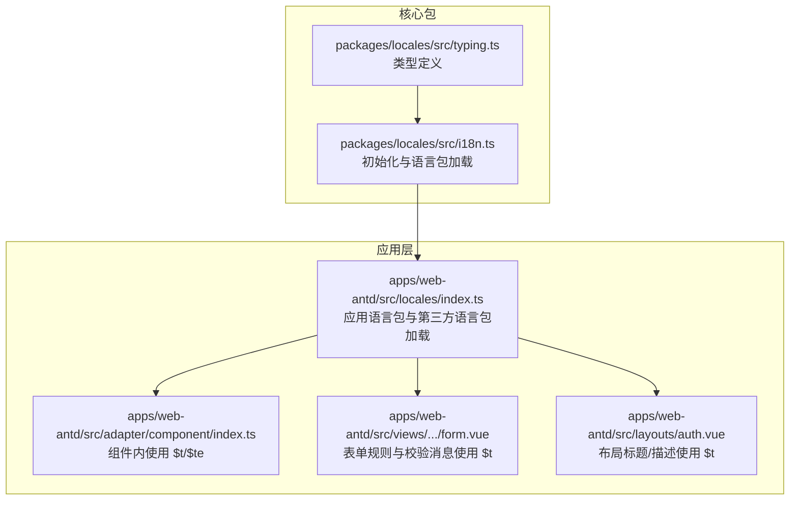
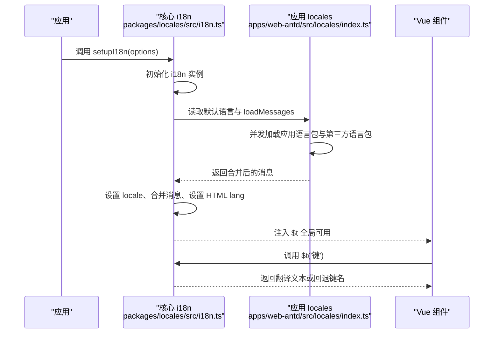
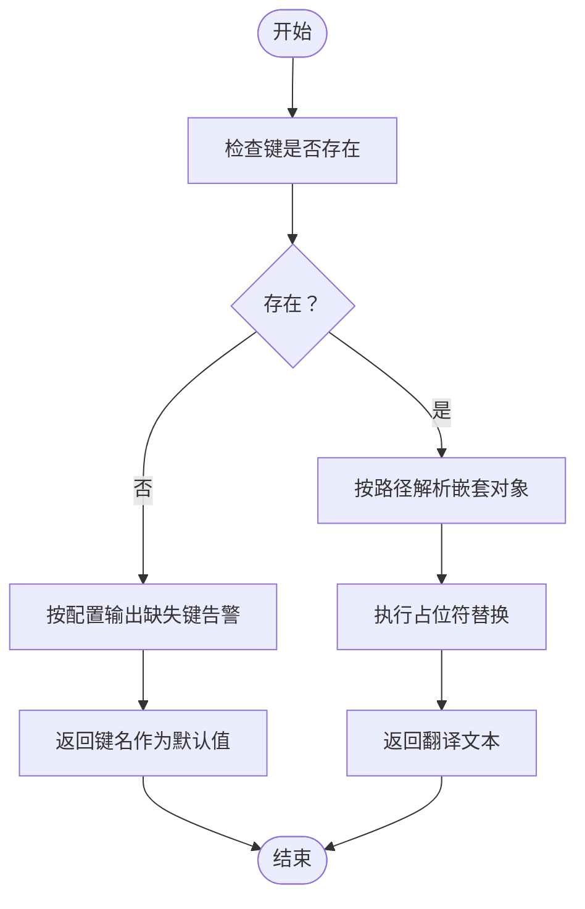
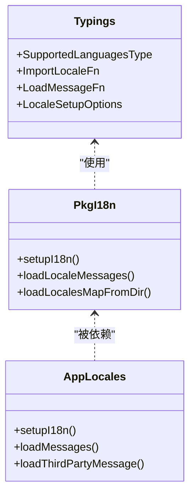

# 翻译处理机制

<cite>
**本文引用的文件**
- [packages/locales/src/i18n.ts](file://packages/locales/src/i18n.ts)
- [apps/web-antd/src/locales/index.ts](file://apps/web-antd/src/locales/index.ts)
- [packages/@core/composables/src/use-simple-locale/index.ts](file://packages/@core/composables/src/use-simple-locale/index.ts)
- [packages/@core/composables/src/use-simple-locale/messages.ts](file://packages/@core/composables/src/use-simple-locale/messages.ts)
- [packages/locales/src/typing.ts](file://packages/locales/src/typing.ts)
- [apps/web-antd/src/views/system/menu/modules/form.vue](file://apps/web-antd/src/views/system/menu/modules/form.vue)
- [apps/web-antd/src/layouts/auth.vue](file://apps/web-antd/src/layouts/auth.vue)
- [apps/web-antd/src/adapter/component/index.ts](file://apps/web-antd/src/adapter/component/index.ts)
- [apps/web-antd/src/locales/langs/zh-CN/system.json](file://apps/web-antd/src/locales/langs/zh-CN/system.json)
- [apps/web-antd/src/locales/langs/en-US/system.json](file://apps/web-antd/src/locales/langs/en-US/system.json)
</cite>

## 目录
1. [简介](#简介)
2. [项目结构](#项目结构)
3. [核心组件](#核心组件)
4. [架构总览](#架构总览)
5. [详细组件分析](#详细组件分析)
6. [依赖关系分析](#依赖关系分析)
7. [性能考量](#性能考量)
8. [故障排查指南](#故障排查指南)
9. [结论](#结论)
10. [附录](#附录)

## 简介
本文件系统性阐述 Vben Admin 的翻译处理机制，重点围绕 $t 函数的工作原理与使用方法，涵盖参数传递、占位符替换、复数形式处理、翻译键查找与匹配算法（含嵌套对象路径解析与默认值）、翻译缓存与性能优化、翻译上下文（组件上下文与全局上下文）、高级用法（条件翻译、动态键、函数式翻译）、在不同组件中的使用方式（模板表达式、计算属性、生命周期钩子），以及错误处理与调试方法。文中所有技术细节均基于仓库源码进行归纳总结。

## 项目结构
Vben Admin 的翻译体系由“核心包”和“应用层”两部分构成：
- 核心包（packages/locales）：封装 vue-i18n 初始化、语言包加载、缺失键告警、语言切换等能力，并导出 $t、setupI18n 等公共 API。
- 应用层（apps/web-antd/src/locales）：在核心包之上扩展应用特定语言包、第三方组件库语言包（如 Ant Design、Day.js）的加载与合并逻辑，并导出 $t、antdLocale 等供业务组件使用。

图表来源
- [packages/locales/src/i18n.ts:102-139](file://packages/locales/src/i18n.ts#L102-L139)
- [apps/web-antd/src/locales/index.ts:93-102](file://apps/web-antd/src/locales/index.ts#L93-L102)
- [apps/web-antd/src/adapter/component/index.ts:114-139](file://apps/web-antd/src/adapter/component/index.ts#L114-L139)
- [apps/web-antd/src/views/system/menu/modules/form.vue:47-68](file://apps/web-antd/src/views/system/menu/modules/form.vue#L47-L68)
- [apps/web-antd/src/layouts/auth.vue:19-20](file://apps/web-antd/src/layouts/auth.vue#L19-L20)

章节来源
- [packages/locales/src/i18n.ts:102-139](file://packages/locales/src/i18n.ts#L102-L139)
- [apps/web-antd/src/locales/index.ts:93-102](file://apps/web-antd/src/locales/index.ts#L93-L102)

## 核心组件
- 核心 i18n 初始化与语言包加载
  - 使用 vue-i18n 创建实例，开启全局注入与组合式 API 支持；通过 import.meta.glob 收集语言包目录下的 JSON 文件，按目录结构生成异步导入映射。
  - 提供 setupI18n、loadLocaleMessages、loadLocalesMapFromDir 等方法，支持默认语言设置、缺失键告警、语言切换与消息合并。
- 应用层语言包与第三方语言包
  - 在应用层通过 loadLocalesMapFromDir 加载应用语言包，并并发加载第三方语言包（Ant Design、Day.js）。
  - 通过 loadMessages 将应用语言包与第三方语言包合并到同一 locale 下，保证 UI 组件与日期库的本地化一致。
- 简易本地化（use-simple-locale）
  - 提供轻量级 $t 实现，适用于不需要 vue-i18n 全能力的场景，内部以内存映射表返回翻译或回退键名。

章节来源
- [packages/locales/src/i18n.ts:16-31](file://packages/locales/src/i18n.ts#L16-L31)
- [packages/locales/src/i18n.ts:102-139](file://packages/locales/src/i18n.ts#L102-L139)
- [apps/web-antd/src/locales/index.ts:24-39](file://apps/web-antd/src/locales/index.ts#L24-L39)
- [apps/web-antd/src/locales/index.ts:93-102](file://apps/web-antd/src/locales/index.ts#L93-L102)
- [packages/@core/composables/src/use-simple-locale/index.ts:9-27](file://packages/@core/composables/src/use-simple-locale/index.ts#L9-L27)
- [packages/@core/composables/src/use-simple-locale/messages.ts:3-24](file://packages/@core/composables/src/use-simple-locale/messages.ts#L3-L24)

## 架构总览
下图展示从应用启动到运行期翻译调用的关键流程：应用初始化 -> 加载默认语言包 -> 合并第三方语言包 -> 注入 $t 到全局 -> 组件中通过 $t 获取文本。

图表来源
- [packages/locales/src/i18n.ts:102-139](file://packages/locales/src/i18n.ts#L102-L139)
- [apps/web-antd/src/locales/index.ts:93-102](file://apps/web-antd/src/locales/index.ts#L93-L102)

## 详细组件分析

### $t 函数工作原理与使用
- 工作模式
  - 应用层导出的 $t 来自核心包的 i18n 实例，遵循 vue-i18n 的键查找与占位符替换语义。
  - 当键不存在时，若未配置回退策略，将直接返回键名；可通过缺失键告警选项在开发环境输出警告。
- 参数与占位符
  - $t('键', 插值数组或命名插值对象) 支持位置参数与命名参数两种占位符写法。
  - 在表单规则中，$t 作为错误消息模板，结合 zod 验证器动态生成带参数的提示文本。
- 复数形式
  - 复数形式由 vue-i18n 的 pluralization 机制支持，需在语言包中按约定提供复数变体键（如 'count=one'、'count=other'）。本仓库未见显式复数键示例，建议在新增翻译时遵循 vue-i18n 的复数键规范。

章节来源
- [apps/web-antd/src/views/system/menu/modules/form.vue:56-68](file://apps/web-antd/src/views/system/menu/modules/form.vue#L56-L68)
- [apps/web-antd/src/views/system/menu/modules/form.vue:134-151](file://apps/web-antd/src/views/system/menu/modules/form.vue#L134-L151)
- [packages/locales/src/i18n.ts:110-116](file://packages/locales/src/i18n.ts#L110-L116)

### 翻译键查找与匹配算法
- 键路径解析
  - 语言包采用 JSON 结构组织，键可为简单字符串或嵌套对象路径（如 'system.menu.title'）。vue-i18n 会根据路径逐层解析，直至命中叶子节点。
  - 若路径任一层缺失，将导致最终找不到对应文本，此时可依赖缺失键告警定位问题。
- 默认值处理
  - 当键不存在时，返回键名本身；可在开发环境开启 missingWarn 以便快速发现缺失键。
- 嵌套对象与默认值
  - 语言包示例展示了多层级嵌套（如 system.menu.badgeType.dot），组件中通过 $t('system.menu.badgeType.dot') 访问具体文案。

章节来源
- [apps/web-antd/src/locales/langs/zh-CN/system.json:42-46](file://apps/web-antd/src/locales/langs/zh-CN/system.json#L42-L46)
- [apps/web-antd/src/locales/langs/en-US/system.json:42-46](file://apps/web-antd/src/locales/langs/en-US/system.json#L42-L46)
- [packages/locales/src/i18n.ts:110-116](file://packages/locales/src/i18n.ts#L110-L116)

### 翻译缓存机制与性能优化
- 缓存策略
  - 语言包通过 import.meta.glob 预构建，运行时按需异步加载并合并至 i18n.global.messages 中，避免重复请求。
  - 语言切换时仅更新 i18n.global.locale 并设置 HTML lang 属性，不重建 i18n 实例，降低开销。
- 性能优化建议
  - 将高频使用的键拆分为独立 JSON 文件，减少单文件体积，提升按需加载效率。
  - 对于第三方语言包（Ant Design、Day.js），采用并发加载（Promise.all）缩短首屏等待时间。
  - 在生产环境关闭 missingWarn，减少控制台输出带来的额外开销。

章节来源
- [packages/locales/src/i18n.ts:23-30](file://packages/locales/src/i18n.ts#L23-L30)
- [packages/locales/src/i18n.ts:123-139](file://packages/locales/src/i18n.ts#L123-L139)
- [apps/web-antd/src/locales/index.ts:34-38](file://apps/web-antd/src/locales/index.ts#L34-L38)
- [apps/web-antd/src/locales/index.ts:45-47](file://apps/web-antd/src/locales/index.ts#L45-L47)

### 翻译上下文：组件上下文与全局上下文
- 全局上下文（全局 $t）
  - 通过 setupI18n 注入后，$t 在任意组件模板与脚本中均可直接使用，适合跨组件共享的文案。
- 组件上下文（局部作用域）
  - 在组件脚本中，可将 $t 作为计算属性或局部变量使用，便于在组件内部进行条件判断或动态拼接键名。
- 上下文差异
  - 全局 $t 由 i18n 实例统一管理，组件上下文的 $t 可来自简易实现（非本仓库主流程），两者在能力上存在差异（如复数、格式化等）。

章节来源
- [apps/web-antd/src/layouts/auth.vue:19-20](file://apps/web-antd/src/layouts/auth.vue#L19-L20)
- [apps/web-antd/src/views/system/menu/modules/form.vue:47-68](file://apps/web-antd/src/views/system/menu/modules/form.vue#L47-L68)
- [packages/@core/composables/src/use-simple-locale/index.ts:16-21](file://packages/@core/composables/src/use-simple-locale/index.ts#L16-L21)

### 高级用法：条件翻译、动态键与函数式翻译
- 条件翻译
  - 使用 $te 检测键是否存在，再决定是否回退到备用文案或直接渲染键名。
  - 示例：在菜单树过滤时，先判断输入值是否为可翻译键，若是则渲染翻译结果，否则直接显示原始值。
- 动态键
  - 将组件元信息（如 meta.title）作为键名动态传入 $t，实现“键名即文案”的灵活模式。
- 函数式翻译
  - 在表单规则的 refine 回调中，通过 $t 生成动态错误消息，结合参数数组完成占位符替换。

章节来源
- [apps/web-antd/src/views/system/menu/modules/form.vue:113-113](file://apps/web-antd/src/views/system/menu/modules/form.vue#L113-L113)
- [apps/web-antd/src/views/system/menu/modules/form.vue:100-100](file://apps/web-antd/src/views/system/menu/modules/form.vue#L100-L100)
- [apps/web-antd/src/views/system/menu/modules/form.vue:58-68](file://apps/web-antd/src/views/system/menu/modules/form.vue#L58-L68)
- [apps/web-antd/src/views/system/menu/modules/form.vue:140-140](file://apps/web-antd/src/views/system/menu/modules/form.vue#L140-L140)

### 在不同组件中的使用方式
- 模板表达式
  - 在布局组件中直接使用 $t 渲染页面标题与描述。
- 计算属性
  - 在视图组件中将 $t 用于计算属性，结合外部配置或偏好设置生成动态文案。
- 生命周期钩子
  - 在路由守卫或页面挂载阶段，根据当前语言动态加载语言包或切换第三方库语言包。
- 组件适配层
  - 在组件适配层（如表格单元格、表单规则）中广泛使用 $t/$te，确保 UI 文案与业务键解耦。

章节来源
- [apps/web-antd/src/layouts/auth.vue:19-20](file://apps/web-antd/src/layouts/auth.vue#L19-L20)
- [apps/web-antd/src/adapter/component/index.ts:114-139](file://apps/web-antd/src/adapter/component/index.ts#L114-L139)
- [apps/web-antd/src/adapter/component/index.ts:205-205](file://apps/web-antd/src/adapter/component/index.ts#L205-L205)

### 翻译键的查找与匹配算法（算法流程）

图表来源
- [packages/locales/src/i18n.ts:110-116](file://packages/locales/src/i18n.ts#L110-L116)
- [apps/web-antd/src/locales/langs/zh-CN/system.json:42-46](file://apps/web-antd/src/locales/langs/zh-CN/system.json#L42-L46)

## 依赖关系分析
- 类型与接口
  - typing.ts 定义了语言包加载函数签名、默认语言类型与 setupI18n 选项，约束了核心包与应用层的契约。
- 组件关系
  - 应用层 locales 依赖核心包 i18n，同时负责加载第三方语言包并与核心包合并。
  - 视图与适配层组件通过应用层导出的 $t/$te 使用翻译能力。

图表来源
- [packages/locales/src/typing.ts:1-26](file://packages/locales/src/typing.ts#L1-L26)
- [packages/locales/src/i18n.ts:102-139](file://packages/locales/src/i18n.ts#L102-L139)
- [apps/web-antd/src/locales/index.ts:93-102](file://apps/web-antd/src/locales/index.ts#L93-L102)

章节来源
- [packages/locales/src/typing.ts:1-26](file://packages/locales/src/typing.ts#L1-L26)
- [packages/locales/src/i18n.ts:102-139](file://packages/locales/src/i18n.ts#L102-L139)
- [apps/web-antd/src/locales/index.ts:93-102](file://apps/web-antd/src/locales/index.ts#L93-L102)

## 性能考量
- 按需加载与缓存
  - 通过 import.meta.glob 预构建语言包模块，运行时仅加载当前语言包与第三方语言包，避免全量打包。
- 并发加载
  - 应用语言包与第三方语言包采用 Promise.all 并发加载，缩短初始化耗时。
- 开发体验与生产成本
  - 开启 missingWarn 有助于开发阶段发现缺失键；生产环境关闭以减少控制台输出与潜在性能损耗。
- 内存占用
  - 合并后的语言包驻留在 i18n.global.messages 中，建议按模块拆分语言包，避免单文件过大。

章节来源
- [packages/locales/src/i18n.ts:23-30](file://packages/locales/src/i18n.ts#L23-L30)
- [packages/locales/src/i18n.ts:123-139](file://packages/locales/src/i18n.ts#L123-L139)
- [apps/web-antd/src/locales/index.ts:34-38](file://apps/web-antd/src/locales/index.ts#L34-L38)
- [apps/web-antd/src/locales/index.ts:45-47](file://apps/web-antd/src/locales/index.ts#L45-L47)

## 故障排查指南
- 缺失键告警
  - 当键不存在且配置了 missingWarn，将在控制台输出类似“未在某语言中找到某键”的警告，便于定位问题。
- 键名拼写错误
  - 检查语言包 JSON 中是否存在大小写、路径错误或遗漏层级。
- 占位符未替换
  - 确认传入的参数顺序与命名与语言包占位符一致；在表单规则中注意参数数组长度与顺序。
- 第三方库语言包不生效
  - 确认已并发加载 Ant Design 与 Day.js 的语言包，并在切换语言时同步更新。

章节来源
- [packages/locales/src/i18n.ts:110-116](file://packages/locales/src/i18n.ts#L110-L116)
- [apps/web-antd/src/locales/index.ts:53-74](file://apps/web-antd/src/locales/index.ts#L53-L74)
- [apps/web-antd/src/locales/index.ts:80-91](file://apps/web-antd/src/locales/index.ts#L80-L91)

## 结论
Vben Admin 的翻译体系以 vue-i18n 为核心，结合应用层对第三方语言包的统一加载与合并，提供了稳定、可扩展的国际化能力。$t 函数在模板与脚本中广泛使用，配合 $te 的存在性检测与动态键机制，满足复杂业务场景下的文案需求。通过按需加载、并发合并与缺失键告警等策略，兼顾了性能与开发体验。建议在新增翻译时遵循嵌套路径与占位符规范，并合理拆分语言包以优化加载性能。

## 附录
- 简易本地化（use-simple-locale）
  - 该实现提供轻量级 $t，直接从内存映射表返回翻译或回退键名，适合不需要 vue-i18n 全能力的场景。与核心 i18n 流程并行存在，不参与主流程的合并与缓存。

章节来源
- [packages/@core/composables/src/use-simple-locale/index.ts:9-27](file://packages/@core/composables/src/use-simple-locale/index.ts#L9-L27)
- [packages/@core/composables/src/use-simple-locale/messages.ts:3-24](file://packages/@core/composables/src/use-simple-locale/messages.ts#L3-L24)