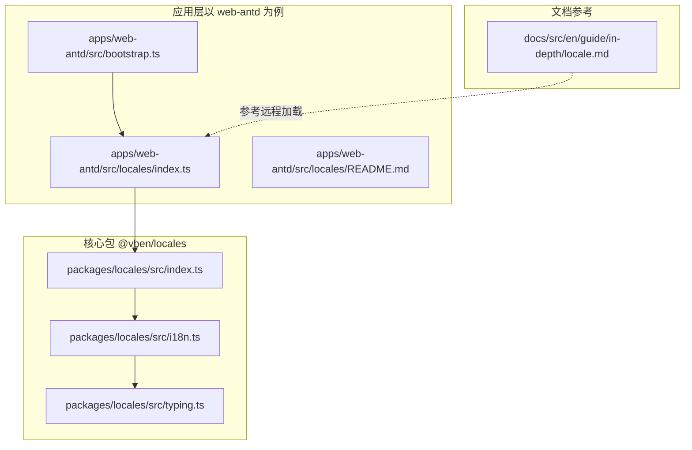
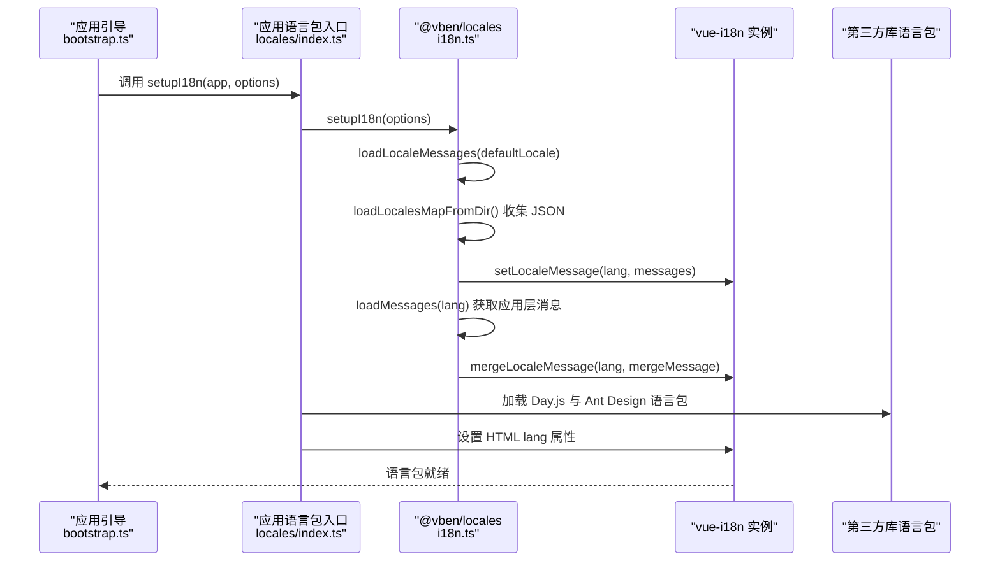
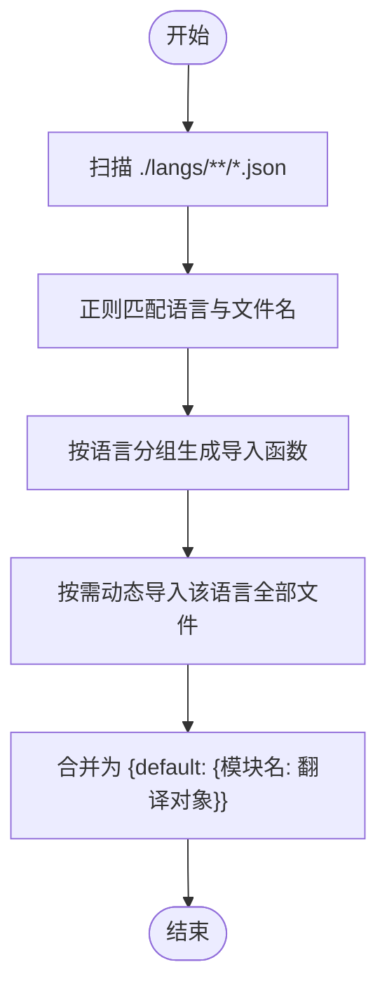
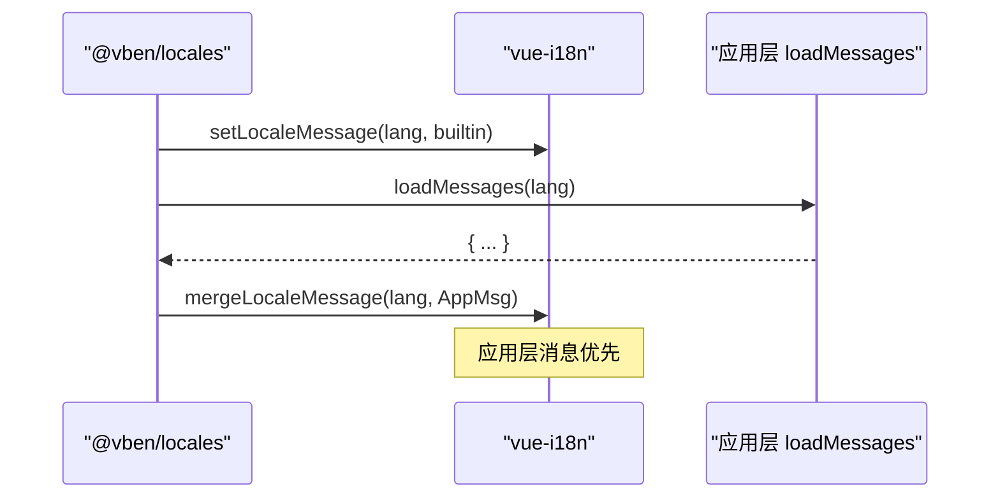
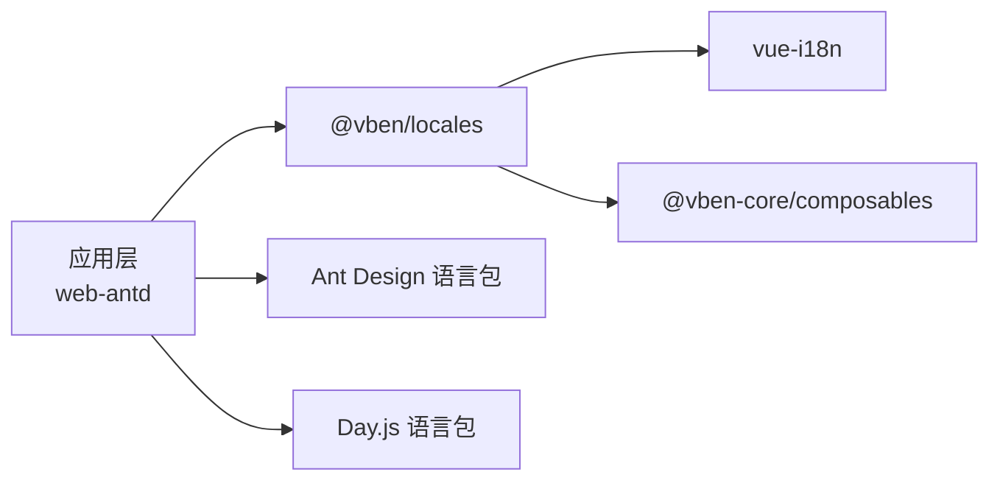

# 语言包管理

<cite>
**本文引用的文件**
- [packages/locales/src/i18n.ts](file://packages/locales/src/i18n.ts)
- [packages/locales/src/index.ts](file://packages/locales/src/index.ts)
- [packages/locales/src/typing.ts](file://packages/locales/src/typing.ts)
- [apps/web-antd/src/locales/index.ts](file://apps/web-antd/src/locales/index.ts)
- [apps/web-antd/src/bootstrap.ts](file://apps/web-antd/src/bootstrap.ts)
- [apps/web-antd/src/locales/README.md](file://apps/web-antd/src/locales/README.md)
- [docs/src/en/guide/in-depth/locale.md](file://docs/src/en/guide/in-depth/locale.md)
</cite>

## 目录

1. [简介](#简介)
2. [项目结构](#项目结构)
3. [核心组件](#核心组件)
4. [架构总览](#架构总览)
5. [详细组件分析](#详细组件分析)
6. [依赖分析](#依赖分析)
7. [性能考虑](#性能考虑)
8. [故障排查指南](#故障排查指南)
9. [结论](#结论)
10. [附录](#附录)

## 简介

本文件系统性阐述 Vben Admin 的语言包（i18n）管理体系，覆盖语言包目录与命名规范、JSON 语言文件结构、自动加载机制（含 import.meta.glob 与动态导入）、合并与优先级策略、编写规范与最佳实践、新增语言包与维护流程等。目标是帮助开发者快速理解并正确扩展多语言支持。

## 项目结构

- 语言包核心能力位于 @vben/locales 包中，提供 i18n 初始化、消息加载、目录映射与合并等能力。
- 应用侧在各自 src/locales 中声明本地化资源，并通过 setupI18n 完成初始化与第三方库语言包注入（如 Ant Design、Day.js）。
- 文档中提供了远程加载语言包的参考实现思路。

图表来源

- [packages/locales/src/index.ts:1-31](file://packages/locales/src/index.ts#L1-L31)
- [packages/locales/src/i18n.ts:1-148](file://packages/locales/src/i18n.ts#L1-L148)
- [packages/locales/src/typing.ts:1-26](file://packages/locales/src/typing.ts#L1-L26)
- [apps/web-antd/src/locales/index.ts:1-103](file://apps/web-antd/src/locales/index.ts#L1-L103)
- [apps/web-antd/src/bootstrap.ts:1-60](file://apps/web-antd/src/bootstrap.ts#L1-L60)
- [apps/web-antd/src/locales/README.md:1-4](file://apps/web-antd/src/locales/README.md#L1-L4)
- [docs/src/en/guide/in-depth/locale.md:159-174](file://docs/src/en/guide/in-depth/locale.md#L159-L174)

章节来源

- [packages/locales/src/index.ts:1-31](file://packages/locales/src/index.ts#L1-L31)
- [packages/locales/src/i18n.ts:1-148](file://packages/locales/src/i18n.ts#L1-L148)
- [apps/web-antd/src/locales/index.ts:1-103](file://apps/web-antd/src/locales/index.ts#L1-L103)
- [apps/web-antd/src/locales/README.md:1-4](file://apps/web-antd/src/locales/README.md#L1-L4)
- [apps/web-antd/src/bootstrap.ts:1-60](file://apps/web-antd/src/bootstrap.ts#L1-L60)
- [docs/src/en/guide/in-depth/locale.md:159-174](file://docs/src/en/guide/in-depth/locale.md#L159-L174)

## 核心组件

- 语言包初始化与合并
  - 核心初始化：setupI18n 接收默认语言与自定义 loadMessages 函数，完成 i18n 实例注册、默认语言加载、缺失键告警设置。
  - 消息加载：loadLocaleMessages 先加载 @vben/locales 内置的 JSON 语言包，再合并应用层 loadMessages 返回的额外消息。
- 目录映射与自动加载
  - 使用 import.meta.glob 收集 ./langs/\*_/_.json 资源，通过 loadLocalesMapFromDir 基于正则提取语言与文件名，生成按语言分组的异步导入函数。
- 第三方库语言包注入
  - 应用层在 setupI18n 中调用 loadThirdPartyMessage，分别加载 Day.js 与 Ant Design 组件库的语言包，保持界面与数据展示的本地化一致。
- 类型与配置
  - SupportedLanguagesType、LoadMessageFn、LocaleSetupOptions 等类型定义了语言集合、消息加载函数签名与初始化选项。

章节来源

- [packages/locales/src/i18n.ts:102-139](file://packages/locales/src/i18n.ts#L102-L139)
- [packages/locales/src/i18n.ts:55-90](file://packages/locales/src/i18n.ts#L55-L90)
- [packages/locales/src/typing.ts:1-26](file://packages/locales/src/typing.ts#L1-L26)
- [apps/web-antd/src/locales/index.ts:93-100](file://apps/web-antd/src/locales/index.ts#L93-L100)
- [apps/web-antd/src/locales/index.ts:45-47](file://apps/web-antd/src/locales/index.ts#L45-L47)

## 架构总览

下图展示了从应用启动到语言包生效的关键流程：应用引导 -> 初始化 i18n -> 加载内置 JSON 语言包 -> 合并应用层消息 -> 注入第三方库语言包 -> 设置 HTML lang 属性。

图表来源

- [apps/web-antd/src/bootstrap.ts:1-60](file://apps/web-antd/src/bootstrap.ts#L1-L60)
- [apps/web-antd/src/locales/index.ts:93-100](file://apps/web-antd/src/locales/index.ts#L93-L100)
- [packages/locales/src/i18n.ts:102-139](file://packages/locales/src/i18n.ts#L102-L139)

## 详细组件分析

### 目录结构与命名规范

- 目录层级
  - 语言包统一放置在各应用的 src/locales/langs 下，采用“语言代码/模块或页面名.json”的组织方式。
  - @vben/locales 内部同样遵循 ./langs/\*_/_ 目录收集规则，通过正则匹配语言与文件名。
- 文件命名规则
  - 文件名即模块名，最终作为 JSON 根对象的键被合并进对应语言的消息对象。
  - 示例：zh-CN/dashboard.json、en-US/common.json 等。
- 应用扩展说明
  - 应用可在此基础上扩展第三方库语言包（如 Day.js、Ant Design），并在 locales/index.ts 中集中管理。

章节来源

- [apps/web-antd/src/locales/README.md:1-4](file://apps/web-antd/src/locales/README.md#L1-L4)
- [packages/locales/src/i18n.ts:23-30](file://packages/locales/src/i18n.ts#L23-L30)
- [apps/web-antd/src/locales/index.ts:22-27](file://apps/web-antd/src/locales/index.ts#L22-L27)

### JSON 语言文件结构与字段定义

- 结构组织
  - 每个 JSON 文件代表一个模块或页面的翻译集合，根对象的键为具体翻译键名，值为字符串。
  - 复杂场景可通过点号分隔进行层级组织，如 common.submit、form.rules.required。
- 键值组织方式
  - 建议按功能域拆分文件（common、form、table、modal 等），便于维护与增量更新。
  - 避免深层嵌套，推荐扁平化键名并使用语义化前缀区分模块。
- 占位符与复数
  - 占位符使用 vue-i18n 的插值语法；复数形式建议通过逻辑层根据计数选择不同键，避免在 JSON 中硬编码复数变体。

章节来源

- [packages/locales/src/i18n.ts:80-86](file://packages/locales/src/i18n.ts#L80-L86)
- [apps/web-antd/src/locales/index.ts:33-39](file://apps/web-antd/src/locales/index.ts#L33-L39)

### 自动加载机制与动态导入策略

- import.meta.glob 收集
  - 通过 import.meta.glob('./langs/\*_/_.json') 收集所有语言 JSON 文件，形成模块映射。
- 正则解析与分组
  - 使用正则提取语言代码与文件名，生成 localesRaw，再转换为按语言分组的异步导入函数 localesMap。
- 动态导入与合并
  - 首次加载时按需动态 import 对应语言的所有文件，返回 { default: { 模块名: 翻译对象 } }，随后由 i18n 合并到全局消息表。

图表来源

- [packages/locales/src/i18n.ts:23-30](file://packages/locales/src/i18n.ts#L23-L30)
- [packages/locales/src/i18n.ts:55-90](file://packages/locales/src/i18n.ts#L55-L90)

章节来源

- [packages/locales/src/i18n.ts:23-90](file://packages/locales/src/i18n.ts#L23-L90)

### 合并与优先级处理逻辑

- 加载顺序
  - 先加载 @vben/locales 内置 JSON 语言包（setLocaleMessage）。
  - 再合并应用层 loadMessages 返回的额外消息（mergeLocaleMessage）。
- 优先级
  - 应用层消息优先于内置消息，用于覆盖或补充通用语言包中的条目。
- 缺失键告警
  - 在开发环境可开启 missingWarn，当键包含点号且未命中时输出告警，辅助发现未翻译项。

图表来源

- [packages/locales/src/i18n.ts:123-139](file://packages/locales/src/i18n.ts#L123-L139)

章节来源

- [packages/locales/src/i18n.ts:123-139](file://packages/locales/src/i18n.ts#L123-L139)

### 第三方库语言包注入

- Day.js 语言包
  - 根据当前语言动态导入对应语言包并设置全局语言。
- Ant Design 语言包
  - 根据语言切换 antdLocale，确保表格、弹窗等组件文案本地化。
- 并发加载
  - 通过 Promise.all 并行加载第三方语言包，提升初始化效率。

章节来源

- [apps/web-antd/src/locales/index.ts:45-74](file://apps/web-antd/src/locales/index.ts#L45-L74)
- [apps/web-antd/src/locales/index.ts:80-91](file://apps/web-antd/src/locales/index.ts#L80-L91)

### 初始化与使用流程

- 应用引导阶段调用 setupI18n，传入默认语言与 loadMessages。
- 初始化完成后，$t 可直接使用；HTML lang 属性会同步为目标语言，利于 SEO 与无障碍。

章节来源

- [apps/web-antd/src/bootstrap.ts:1-60](file://apps/web-antd/src/bootstrap.ts#L1-L60)
- [apps/web-antd/src/locales/index.ts:93-100](file://apps/web-antd/src/locales/index.ts#L93-L100)
- [packages/locales/src/index.ts:9-11](file://packages/locales/src/index.ts#L9-L11)

## 依赖分析

- @vben/locales 依赖
  - vue-i18n：提供国际化核心能力。
  - @vben-core/composables：提供 useSimpleLocale 等工具。
- 应用层依赖
  - 各 UI 框架（如 Ant Design）的语言包与 Day.js 语言包。
- 关系图

图表来源

- [packages/locales/src/i18n.ts:12-14](file://packages/locales/src/i18n.ts#L12-L14)
- [apps/web-antd/src/locales/index.ts:16-18](file://apps/web-antd/src/locales/index.ts#L16-L18)

章节来源

- [packages/locales/src/i18n.ts:12-14](file://packages/locales/src/i18n.ts#L12-L14)
- [apps/web-antd/src/locales/index.ts:16-18](file://apps/web-antd/src/locales/index.ts#L16-L18)

## 性能考虑

- 按需加载
  - 仅在切换语言或首次访问时动态导入对应语言的 JSON 文件，避免一次性加载全部语言包。
- 并发加载
  - 第三方语言包与应用层消息通过并发方式加载，缩短初始化时间。
- 缓存与去重
  - 已加载的语言包不会重复导入；建议在应用层避免重复合并相同消息。

## 故障排查指南

- 未找到翻译键告警
  - 若开启 missingWarn 且键包含点号，控制台会提示缺失键，便于定位问题。
- 语言包未生效
  - 检查是否在 setupI18n 中传入正确的 defaultLocale 与 loadMessages。
  - 确认 JSON 文件路径与命名符合 ./langs/\*_/_ 规范。
- 第三方库文案未切换
  - 确保在 setupI18n 中调用了加载 Day.js 与 Ant Design 语言包的方法，并注意并发加载顺序。

章节来源

- [packages/locales/src/i18n.ts:110-116](file://packages/locales/src/i18n.ts#L110-L116)
- [apps/web-antd/src/locales/index.ts:93-100](file://apps/web-antd/src/locales/index.ts#L93-L100)

## 结论

Vben Admin 的语言包体系以 @vben/locales 为核心，结合 import.meta.glob 的自动收集与动态导入，实现了高效、可扩展的多语言支持。通过内置 JSON 语言包与应用层消息的合并机制，既保证通用性又允许灵活定制。配合第三方库语言包注入，可实现界面与数据展示的一致本地化体验。

## 附录

### 编写规范与最佳实践

- 键名命名
  - 使用小驼峰或点号分隔的层级键，避免空格与特殊字符；建议按模块前缀区分（如 common.submit）。
- 占位符
  - 使用 vue-i18n 插值语法；避免在 JSON 中拼接复杂逻辑。
- 复数形式
  - 通过调用侧根据数量选择不同键，不直接在 JSON 中枚举复数变体。
- 文件拆分
  - 将高频使用与低频使用的内容拆分到不同 JSON 文件，便于维护与按需加载。
- 语言代码
  - 使用标准语言代码（如 zh-CN、en-US），确保与 UI 框架与 Day.js 兼容。

### 新增语言包与维护流程

- 新增语言
  - 在应用的 src/locales/langs 下新增对应语言目录（如 fr-FR），并将翻译文件放入。
  - 确保文件名唯一且符合模块划分。
- 维护更新
  - 通过修改应用层 loadMessages 或引入远程加载逻辑，实现动态更新与热替换。
  - 如需覆盖通用语言包，将应用层消息合并到同名键上即可。

章节来源

- [apps/web-antd/src/locales/README.md:1-4](file://apps/web-antd/src/locales/README.md#L1-L4)
- [docs/src/en/guide/in-depth/locale.md:159-174](file://docs/src/en/guide/in-depth/locale.md#L159-L174)
