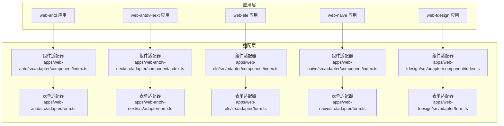
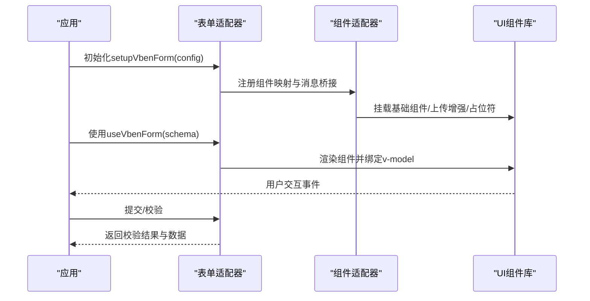
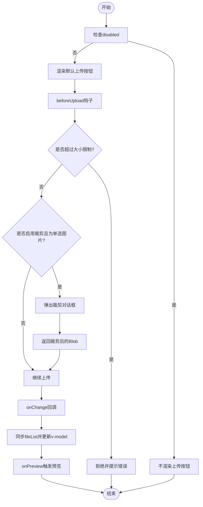
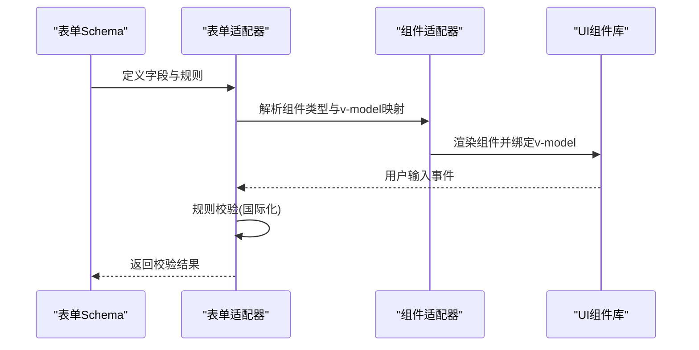
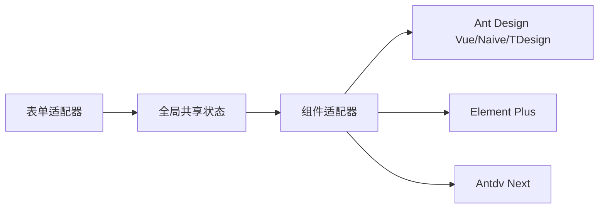

# 兼容性对照表

<cite>
**本文引用的文件**
- [apps/web-antd/src/adapter/component/index.ts](file://apps/web-antd/src/adapter/component/index.ts)
- [apps/web-antdv-next/src/adapter/component/index.ts](file://apps/web-antdv-next/src/adapter/component/index.ts)
- [apps/web-ele/src/adapter/component/index.ts](file://apps/web-ele/src/adapter/component/index.ts)
- [apps/web-naive/src/adapter/component/index.ts](file://apps/web-naive/src/adapter/component/index.ts)
- [apps/web-tdesign/src/adapter/component/index.ts](file://apps/web-tdesign/src/adapter/component/index.ts)
- [apps/web-antd/src/adapter/form.ts](file://apps/web-antd/src/adapter/form.ts)
- [apps/web-antdv-next/src/adapter/form.ts](file://apps/web-antdv-next/src/adapter/form.ts)
- [apps/web-ele/src/adapter/form.ts](file://apps/web-ele/src/adapter/form.ts)
- [apps/web-naive/src/adapter/form.ts](file://apps/web-naive/src/adapter/form.ts)
- [apps/web-tdesign/src/adapter/form.ts](file://apps/web-tdesign/src/adapter/form.ts)
</cite>

## 目录
1. [简介](#简介)
2. [项目结构](#项目结构)
3. [核心组件](#核心组件)
4. [架构总览](#架构总览)
5. [详细组件分析](#详细组件分析)
6. [依赖关系分析](#依赖关系分析)
7. [性能考量](#性能考量)
8. [故障排查指南](#故障排查指南)
9. [结论](#结论)
10. [附录](#附录)

## 简介
本技术文档聚焦于UI框架兼容性对照，围绕四个支持框架（Ant Design Vue、Antdv Next、Element Plus、Naive UI、TDesign）在组件API、样式系统、主题配置与功能特性方面的差异展开。文档提供组件级别的兼容性矩阵，解释样式系统差异（CSS变量、主题定制、样式覆盖），并给出上传组件、表单验证、国际化等关键特性的兼容性说明与最佳实践。

## 项目结构
四个框架的适配层均采用“组件适配器 + 表单适配器”的分层设计：
- 组件适配器：统一注册基础组件映射、默认占位符注入、上传预览与裁剪增强、消息提示桥接。
- 表单适配器：统一表单模型属性命名约定、校验规则国际化、空值策略等。



图表来源
- [apps/web-antd/src/adapter/component/index.ts:526-608](file://apps/web-antd/src/adapter/component/index.ts#L526-L608)
- [apps/web-antdv-next/src/adapter/component/index.ts:524-604](file://apps/web-antdv-next/src/adapter/component/index.ts#L524-L604)
- [apps/web-ele/src/adapter/component/index.ts:175-332](file://apps/web-ele/src/adapter/component/index.ts#L175-L332)
- [apps/web-naive/src/adapter/component/index.ts:121-232](file://apps/web-naive/src/adapter/component/index.ts#L121-L232)
- [apps/web-tdesign/src/adapter/component/index.ts:129-230](file://apps/web-tdesign/src/adapter/component/index.ts#L129-L230)
- [apps/web-antd/src/adapter/form.ts:11-42](file://apps/web-antd/src/adapter/form.ts#L11-L42)
- [apps/web-antdv-next/src/adapter/form.ts:11-42](file://apps/web-antdv-next/src/adapter/form.ts#L11-L42)
- [apps/web-ele/src/adapter/form.ts:11-34](file://apps/web-ele/src/adapter/form.ts#L11-L34)
- [apps/web-naive/src/adapter/form.ts:11-38](file://apps/web-naive/src/adapter/form.ts#L11-L38)
- [apps/web-tdesign/src/adapter/form.ts:11-42](file://apps/web-tdesign/src/adapter/form.ts#L11-L42)

章节来源
- [apps/web-antd/src/adapter/component/index.ts:526-608](file://apps/web-antd/src/adapter/component/index.ts#L526-L608)
- [apps/web-antdv-next/src/adapter/component/index.ts:524-604](file://apps/web-antdv-next/src/adapter/component/index.ts#L524-L604)
- [apps/web-ele/src/adapter/component/index.ts:175-332](file://apps/web-ele/src/adapter/component/index.ts#L175-L332)
- [apps/web-naive/src/adapter/component/index.ts:121-232](file://apps/web-naive/src/adapter/component/index.ts#L121-L232)
- [apps/web-tdesign/src/adapter/component/index.ts:129-230](file://apps/web-tdesign/src/adapter/component/index.ts#L129-L230)
- [apps/web-antd/src/adapter/form.ts:11-42](file://apps/web-antd/src/adapter/form.ts#L11-L42)
- [apps/web-antdv-next/src/adapter/form.ts:11-42](file://apps/web-antdv-next/src/adapter/form.ts#L11-L42)
- [apps/web-ele/src/adapter/form.ts:11-34](file://apps/web-ele/src/adapter/form.ts#L11-L34)
- [apps/web-naive/src/adapter/form.ts:11-38](file://apps/web-naive/src/adapter/form.ts#L11-L38)
- [apps/web-tdesign/src/adapter/form.ts:11-42](file://apps/web-tdesign/src/adapter/form.ts#L11-L42)

## 核心组件
- 组件注册：各框架通过统一的全局共享状态注册基础组件映射，覆盖输入类、选择类、日期时间类、开关与评分、上传、图标选择、编辑器等。
- 默认占位符注入：对输入/选择类组件自动注入本地化占位符，提升一致性。
- 上传增强：Ant Design Vue与Antdv Next版本提供预览组、图片裁剪、尺寸限制、事件桥接；Element Plus、Naive UI、TDesign版本提供原生上传组件映射。
- 消息提示桥接：统一复制成功提示的消息桥接，分别对接各组件库的通知系统。

章节来源
- [apps/web-antd/src/adapter/component/index.ts:526-608](file://apps/web-antd/src/adapter/component/index.ts#L526-L608)
- [apps/web-antdv-next/src/adapter/component/index.ts:524-604](file://apps/web-antdv-next/src/adapter/component/index.ts#L524-L604)
- [apps/web-ele/src/adapter/component/index.ts:175-332](file://apps/web-ele/src/adapter/component/index.ts#L175-L332)
- [apps/web-naive/src/adapter/component/index.ts:121-232](file://apps/web-naive/src/adapter/component/index.ts#L121-L232)
- [apps/web-tdesign/src/adapter/component/index.ts:129-230](file://apps/web-tdesign/src/adapter/component/index.ts#L129-L230)

## 架构总览
统一的表单适配器负责：
- 模型属性命名约定：不同组件的v-model名称（如 checked、fileList）通过映射统一。
- 国际化校验规则：必填、选择必填等规则基于$ t进行本地化。
- 空值策略：部分框架（如Naive UI）使用null作为空值，影响表单重置行为。



图表来源
- [apps/web-antd/src/adapter/form.ts:11-42](file://apps/web-antd/src/adapter/form.ts#L11-L42)
- [apps/web-antd/src/adapter/component/index.ts:526-608](file://apps/web-antd/src/adapter/component/index.ts#L526-L608)
- [apps/web-antdv-next/src/adapter/form.ts:11-42](file://apps/web-antdv-next/src/adapter/form.ts#L11-L42)
- [apps/web-antdv-next/src/adapter/component/index.ts:524-604](file://apps/web-antdv-next/src/adapter/component/index.ts#L524-L604)
- [apps/web-ele/src/adapter/form.ts:11-34](file://apps/web-ele/src/adapter/form.ts#L11-L34)
- [apps/web-ele/src/adapter/component/index.ts:175-332](file://apps/web-ele/src/adapter/component/index.ts#L175-L332)
- [apps/web-naive/src/adapter/form.ts:11-38](file://apps/web-naive/src/adapter/form.ts#L11-L38)
- [apps/web-naive/src/adapter/component/index.ts:121-232](file://apps/web-naive/src/adapter/component/index.ts#L121-L232)
- [apps/web-tdesign/src/adapter/form.ts:11-42](file://apps/web-tdesign/src/adapter/form.ts#L11-L42)
- [apps/web-tdesign/src/adapter/component/index.ts:129-230](file://apps/web-tdesign/src/adapter/component/index.ts#L129-L230)

## 详细组件分析

### 组件API与行为差异矩阵
以下矩阵总结四框架在常用组件上的API与行为差异（以字段名、事件名、v-model属性为主）：

- 输入类
  - Input/InputNumber/InputPassword/Textarea：Ant Design Vue、Antdv Next、TDesign、Element Plus、Naive UI均提供对应组件映射；Element Plus与Naive UI在RadioGroup/CheckboxGroup中支持选项数组渲染。
- 选择类
  - Select/ApiSelect：Ant Design Vue、Antdv Next、TDesign、Naive UI提供映射；Element Plus使用SelectV2；ApiTreeSelect在Ant Design系与TDesign支持树形数据，Naive UI通过nodeKey与optionsPropName映射。
- 日期时间类
  - DatePicker/RangePicker/TimePicker：Ant Design系与TDesign支持RangePicker；Element Plus与Naive UI对Range场景做name/id扩展处理；TDesign提供DateRangePicker别名。
- 开关与评分
  - Switch/Rate：各框架均有对应组件映射。
- 上传
  - Ant Design Vue与Antdv Next：提供预览组、图片裁剪、beforeUpload尺寸限制、onChange事件桥接、fileList同步；Element Plus、Naive UI、TDesign：提供原生Upload映射。
- 图标选择与分割线
  - 各框架均提供IconPicker与Divider映射，插槽位置与modelValue属性略有差异。

章节来源
- [apps/web-antd/src/adapter/component/index.ts:526-608](file://apps/web-antd/src/adapter/component/index.ts#L526-L608)
- [apps/web-antdv-next/src/adapter/component/index.ts:524-604](file://apps/web-antdv-next/src/adapter/component/index.ts#L524-L604)
- [apps/web-ele/src/adapter/component/index.ts:175-332](file://apps/web-ele/src/adapter/component/index.ts#L175-L332)
- [apps/web-naive/src/adapter/component/index.ts:121-232](file://apps/web-naive/src/adapter/component/index.ts#L121-L232)
- [apps/web-tdesign/src/adapter/component/index.ts:129-230](file://apps/web-tdesign/src/adapter/component/index.ts#L129-L230)

### 样式系统与主题配置差异
- 样式引入方式
  - Element Plus：组件与样式按模块引入，确保按需加载与样式隔离。
  - Ant Design Vue/Naive/TDesign：组件按包导入，样式随组件库提供。
- 主题定制
  - Ant Design Vue/Naive/TDesign：通过各自主题变量或构建期配置进行定制。
  - Element Plus：通过CSS变量与样式覆盖实现主题切换。
- 样式覆盖
  - 各框架均通过全局样式或局部作用域样式覆盖；注意Element Plus的样式作用域与组件库样式优先级。
- 上传组件样式
  - Ant Design Vue/Naive/TDesign：列表样式与按钮插槽位置存在差异，需针对listType与插槽进行适配。

章节来源
- [apps/web-ele/src/adapter/component/index.ts:18-119](file://apps/web-ele/src/adapter/component/index.ts#L18-L119)
- [apps/web-antd/src/adapter/component/index.ts:137-192](file://apps/web-antd/src/adapter/component/index.ts#L137-L192)
- [apps/web-tdesign/src/adapter/component/index.ts:167-193](file://apps/web-tdesign/src/adapter/component/index.ts#L167-L193)

### 功能特性兼容性
- 上传组件
  - Ant Design Vue/Naive/TDesign：提供预览组与裁剪能力；Antdv Next：预览组事件openChange与visible控制略有差异；Element Plus：原生Upload映射。
- 表单验证
  - 四框架均提供required与selectRequired规则；Ant Design Vue/Naive/TDesign使用value作为基础模型属性；Element Plus对CheckboxGroup使用model-value。
- 国际化
  - 统一通过$ t进行规则文案本地化；各框架保持一致的国际化调用方式。

章节来源
- [apps/web-antd/src/adapter/form.ts:11-42](file://apps/web-antd/src/adapter/form.ts#L11-L42)
- [apps/web-antdv-next/src/adapter/form.ts:11-42](file://apps/web-antdv-next/src/adapter/form.ts#L11-L42)
- [apps/web-ele/src/adapter/form.ts:11-34](file://apps/web-ele/src/adapter/form.ts#L11-L34)
- [apps/web-naive/src/adapter/form.ts:11-38](file://apps/web-naive/src/adapter/form.ts#L11-L38)
- [apps/web-tdesign/src/adapter/form.ts:11-42](file://apps/web-tdesign/src/adapter/form.ts#L11-L42)

### 组件类图（代码级）
```mermaid
classDiagram
class 组件适配器_Antd {
+注册组件映射
+默认占位符注入
+上传预览与裁剪
+消息桥接
}
class 组件适配器_Ele {
+注册组件映射
+默认占位符注入
+SelectV2/TreeSelect映射
+消息桥接
}
class 组件适配器_Naive {
+注册组件映射
+默认占位符注入
+RadioGroup/CheckboxGroup数组渲染
+消息桥接
}
class 组件适配器_TDesign {
+注册组件映射
+默认占位符注入
+RangePicker别名
+消息桥接
}
class 组件适配器_AntdvNext {
+注册组件映射
+默认占位符注入
+上传预览与裁剪
+消息桥接
}
组件适配器_Antd --> "Ant Design Vue"
组件适配器_Ele --> "Element Plus"
组件适配器_Naive --> "Naive UI"
组件适配器_TDesign --> "TDesign"
组件适配器_AntdvNext --> "Antdv Next"
```

图表来源
- [apps/web-antd/src/adapter/component/index.ts:526-608](file://apps/web-antd/src/adapter/component/index.ts#L526-L608)
- [apps/web-ele/src/adapter/component/index.ts:175-332](file://apps/web-ele/src/adapter/component/index.ts#L175-L332)
- [apps/web-naive/src/adapter/component/index.ts:121-232](file://apps/web-naive/src/adapter/component/index.ts#L121-L232)
- [apps/web-tdesign/src/adapter/component/index.ts:129-230](file://apps/web-tdesign/src/adapter/component/index.ts#L129-L230)
- [apps/web-antdv-next/src/adapter/component/index.ts:524-604](file://apps/web-antdv-next/src/adapter/component/index.ts#L524-L604)

### 上传组件流程图（Ant Design Vue/Naive/TDesign）


图表来源
- [apps/web-antd/src/adapter/component/index.ts:137-192](file://apps/web-antd/src/adapter/component/index.ts#L137-L192)
- [apps/web-antdv-next/src/adapter/component/index.ts:137-192](file://apps/web-antdv-next/src/adapter/component/index.ts#L137-L192)
- [apps/web-tdesign/src/adapter/component/index.ts:167-193](file://apps/web-tdesign/src/adapter/component/index.ts#L167-L193)

### 表单适配序列图


图表来源
- [apps/web-antd/src/adapter/form.ts:11-42](file://apps/web-antd/src/adapter/form.ts#L11-L42)
- [apps/web-antdv-next/src/adapter/form.ts:11-42](file://apps/web-antdv-next/src/adapter/form.ts#L11-L42)
- [apps/web-ele/src/adapter/form.ts:11-34](file://apps/web-ele/src/adapter/form.ts#L11-L34)
- [apps/web-naive/src/adapter/form.ts:11-38](file://apps/web-naive/src/adapter/form.ts#L11-L38)
- [apps/web-tdesign/src/adapter/form.ts:11-42](file://apps/web-tdesign/src/adapter/form.ts#L11-L42)

## 依赖关系分析
- 组件适配器对UI组件库的依赖：
  - Ant Design Vue/Naive/TDesign：按组件包导入，样式随库提供。
  - Element Plus：组件与样式按模块导入，便于按需加载。
  - Antdv Next：组件导出路径与Ant Design Vue略有差异。
- 表单适配器对组件适配器的依赖：
  - 通过全局共享状态读取组件映射与消息桥接，保证表单渲染与校验的一致性。



图表来源
- [apps/web-antd/src/adapter/component/index.ts:591-605](file://apps/web-antd/src/adapter/component/index.ts#L591-L605)
- [apps/web-ele/src/adapter/component/index.ts:313-329](file://apps/web-ele/src/adapter/component/index.ts#L313-L329)
- [apps/web-naive/src/adapter/component/index.ts:217-229](file://apps/web-naive/src/adapter/component/index.ts#L217-L229)
- [apps/web-tdesign/src/adapter/component/index.ts:213-227](file://apps/web-tdesign/src/adapter/component/index.ts#L213-L227)
- [apps/web-antdv-next/src/adapter/component/index.ts:587-601](file://apps/web-antdv-next/src/adapter/component/index.ts#L587-L601)

章节来源
- [apps/web-antd/src/adapter/component/index.ts:591-605](file://apps/web-antd/src/adapter/component/index.ts#L591-L605)
- [apps/web-ele/src/adapter/component/index.ts:313-329](file://apps/web-ele/src/adapter/component/index.ts#L313-L329)
- [apps/web-naive/src/adapter/component/index.ts:217-229](file://apps/web-naive/src/adapter/component/index.ts#L217-L229)
- [apps/web-tdesign/src/adapter/component/index.ts:213-227](file://apps/web-tdesign/src/adapter/component/index.ts#L213-L227)
- [apps/web-antdv-next/src/adapter/component/index.ts:587-601](file://apps/web-antdv-next/src/adapter/component/index.ts#L587-L601)

## 性能考量
- 按需加载：Element Plus与Ant Design Vue/Naive/TDesign均支持异步组件与样式按需加载，减少首屏体积。
- 预览与裁剪：Ant Design Vue/Naive/TDesign的上传预览与裁剪涉及DOM挂载与内存管理，需注意延迟清理与URL对象释放。
- 表单渲染：统一的组件映射与v-model映射可避免重复渲染，提高表单响应速度。

## 故障排查指南
- 上传组件无法预览
  - 检查listType与插槽是否正确；确认图片类型判断逻辑与URL解析。
  - Antdv Next预览事件为openChange，需与visible控制区分。
- 裁剪失败或无返回
  - 确认裁剪对话框是否正确初始化与关闭；检查getCropImage返回值与错误提示。
- 表单重置无效
  - 检查空值策略：Naive UI使用null作为空值，需在重置时保持一致。
- 校验规则不生效
  - 确认v-model属性映射是否正确（如Element Plus的CheckboxGroup使用model-value）。

章节来源
- [apps/web-antd/src/adapter/component/index.ts:137-192](file://apps/web-antd/src/adapter/component/index.ts#L137-L192)
- [apps/web-antdv-next/src/adapter/component/index.ts:137-192](file://apps/web-antdv-next/src/adapter/component/index.ts#L137-L192)
- [apps/web-ele/src/adapter/form.ts:14-18](file://apps/web-ele/src/adapter/form.ts#L14-L18)
- [apps/web-naive/src/adapter/form.ts:14-16](file://apps/web-naive/src/adapter/form.ts#L14-L16)

## 结论
通过统一的组件与表单适配器，四个UI框架在组件API、表单模型与国际化方面实现了高度一致的使用体验。差异主要体现在组件命名、事件名、v-model属性以及上传增强能力上。遵循本文提供的兼容性矩阵与最佳实践，可在多框架间平滑迁移与维护。

## 附录
- 组件映射与v-model属性对照（节选）
  - Checkbox/Radio/Switch：Ant Design系与TDesign使用checked；Element Plus/Naive UI使用checked。
  - Upload：各框架均使用fileList。
  - CheckboxGroup/ApiSelect：Element Plus使用model-value；其余框架使用value。
- 上传增强能力对照
  - Ant Design Vue/Naive/TDesign：支持预览组、裁剪、尺寸限制与事件桥接。
  - Antdv Next：预览事件openChange与destroyOnHidden等属性需注意。
- 样式与主题
  - Element Plus：按模块引入样式，便于主题切换。
  - Ant Design系/Naive/TDesign：通过各自主题变量与构建配置定制。