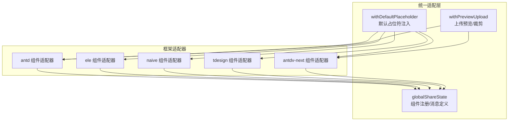
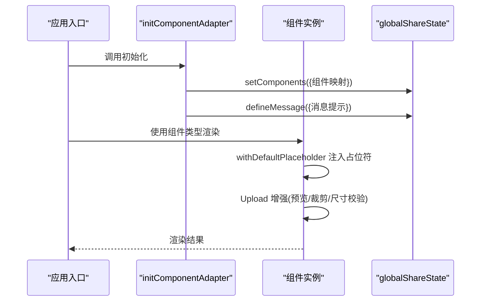
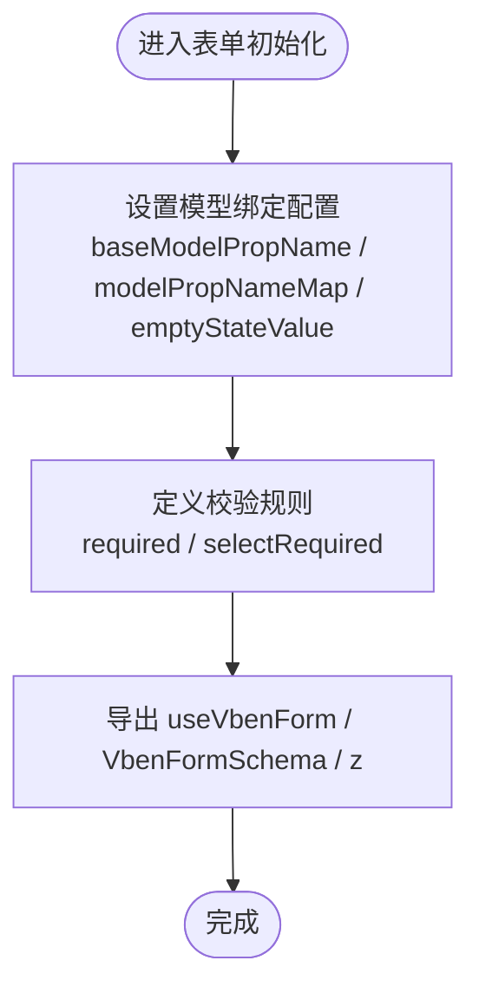
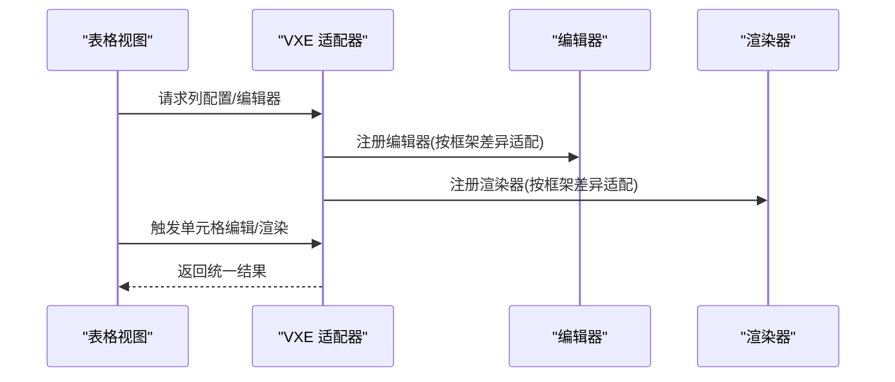
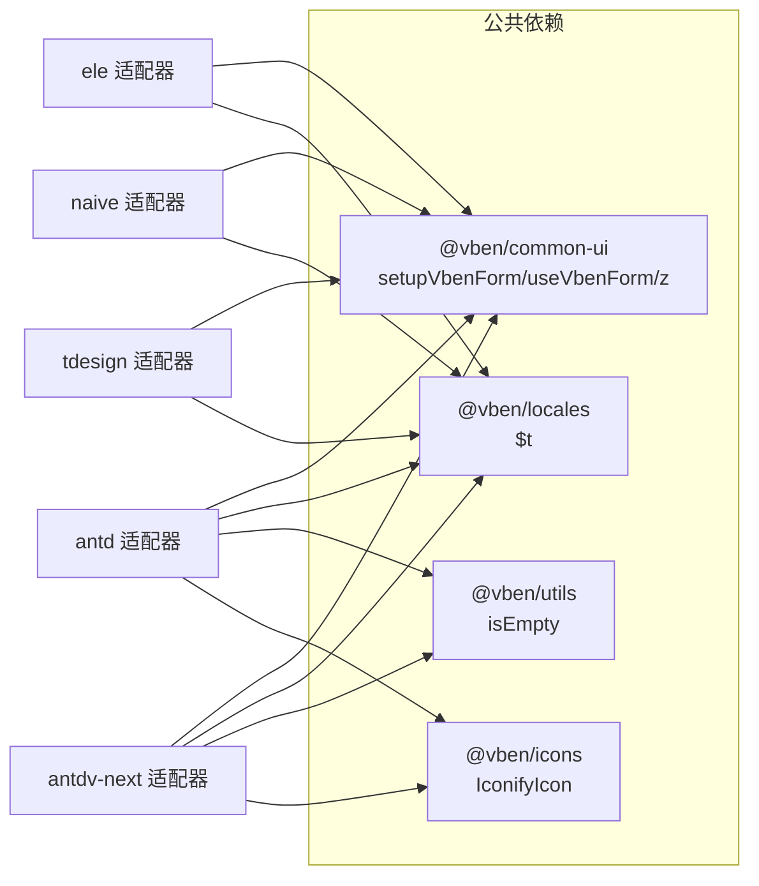

# 多框架支持

<cite>
**本文引用的文件**
- [apps/web-antd/src/adapter/component/index.ts](file://apps/web-antd/src/adapter/component/index.ts)
- [apps/web-ele/src/adapter/component/index.ts](file://apps/web-ele/src/adapter/component/index.ts)
- [apps/web-naive/src/adapter/component/index.ts](file://apps/web-naive/src/adapter/component/index.ts)
- [apps/web-tdesign/src/adapter/component/index.ts](file://apps/web-tdesign/src/adapter/component/index.ts)
- [apps/web-antdv-next/src/adapter/component/index.ts](file://apps/web-antdv-next/src/adapter/component/index.ts)
- [apps/web-antd/src/adapter/form.ts](file://apps/web-antd/src/adapter/form.ts)
- [apps/web-ele/src/adapter/form.ts](file://apps/web-ele/src/adapter/form.ts)
- [apps/web-naive/src/adapter/form.ts](file://apps/web-naive/src/adapter/form.ts)
- [apps/web-tdesign/src/adapter/form.ts](file://apps/web-tdesign/src/adapter/form.ts)
- [apps/web-antdv-next/src/adapter/form.ts](file://apps/web-antdv-next/src/adapter/form.ts)
- [apps/web-antd/src/adapter/vxe-table.ts](file://apps/web-antd/src/adapter/vxe-table.ts)
- [apps/web-ele/src/adapter/vxe-table.ts](file://apps/web-ele/src/adapter/vxe-table.ts)
- [apps/web-naive/src/adapter/vxe-table.ts](file://apps/web-naive/src/adapter/vxe-table.ts)
- [apps/web-tdesign/src/adapter/vxe-table.ts](file://apps/web-tdesign/src/adapter/vxe-table.ts)
- [apps/web-antdv-next/src/adapter/vxe-table.ts](file://apps/web-antdv-next/src/adapter/vxe-table.ts)
- [apps/web-antd/src/adapter/naive.ts](file://apps/web-antd/src/adapter/naive.ts)
- [apps/web-tdesign/src/adapter/tdesign.ts](file://apps/web-tdesign/src/adapter/tdesign.ts)
- [apps/web-naive/src/adapter/naive.ts](file://apps/web-naive/src/adapter/naive.ts)
- [apps/web-antd/src/main.ts](file://apps/web-antd/src/main.ts)
- [apps/web-ele/src/main.ts](file://apps/web-ele/src/main.ts)
- [apps/web-naive/src/main.ts](file://apps/web-naive/src/main.ts)
- [apps/web-tdesign/src/main.ts](file://apps/web-tdesign/src/main.ts)
- [apps/web-antdv-next/src/main.ts](file://apps/web-antdv-next/src/main.ts)
</cite>

## 目录
1. [简介](#简介)
2. [项目结构](#项目结构)
3. [核心组件](#核心组件)
4. [架构总览](#架构总览)
5. [详细组件分析](#详细组件分析)
6. [依赖关系分析](#依赖关系分析)
7. [性能考量](#性能考量)
8. [故障排查指南](#故障排查指南)
9. [结论](#结论)
10. [附录](#附录)

## 简介
本文件系统性阐述 Vben Admin 在多 UI 框架（Ant Design Vue、Element Plus、Naive UI、TDesign、Antdv Next）下的“多框架支持”实现。重点围绕“适配器模式”的统一抽象层设计，说明如何通过统一的组件适配器、表单适配器与 VXE 表格适配器，屏蔽各框架在 props 映射、事件命名、模型绑定、样式与交互上的差异，从而实现跨框架一致的开发体验与无缝迁移。

## 项目结构
- 每个前端应用子工程均包含一套独立的适配器目录：apps/web-{framework}/src/adapter
- 适配器分为三类：
  - 组件适配器：封装各 UI 组件库的输入控件、按钮、上传等，统一对外接口
  - 表单适配器：统一表单模型绑定、校验规则、空值策略
  - VXE 表格适配器：统一表格编辑器、渲染器、交互行为
- 各框架的 main.ts 中调用各自的 initXxxAdapter 初始化函数，完成全局注册

```mermaid
graph TB
subgraph "应用层"
A_antd["web-antd<br/>main.ts"]
A_ele["web-ele<br/>main.ts"]
A_naive["web-naive<br/>main.ts"]
A_tdesign["web-tdesign<br/>main.ts"]
A_antdv_next["web-antdv-next<br/>main.ts"]
end
subgraph "适配器层"
C_antd["antd 组件适配器<br/>component/index.ts"]
C_ele["ele 组件适配器<br/>component/index.ts"]
C_naive["naive 组件适配器<br/>component/index.ts"]
C_tdesign["tdesign 组件适配器<br/>component/index.ts"]
C_antdv_next["antdv-next 组件适配器<br/>component/index.ts"]
F_antd["antd 表单适配器<br/>form.ts"]
F_ele["ele 表单适配器<br/>form.ts"]
F_naive["naive 表单适配器<br/>form.ts"]
F_tdesign["tdesign 表单适配器<br/>form.ts"]
F_antdv_next["antdv-next 表单适配器<br/>form.ts"]
V_antd["antd VXE 适配器<br/>vxe-table.ts"]
V_ele["ele VXE 适配器<br/>vxe-table.ts"]
V_naive["naive VXE 适配器<br/>vxe-table.ts"]
V_tdesign["tdesign VXE 适配器<br/>vxe-table.ts"]
V_antdv_next["antdv-next VXE 适配器<br/>vxe-table.ts"]
end
A_antd --> C_antd
A_ele --> C_ele
A_naive --> C_naive
A_tdesign --> C_tdesign
A_antdv_next --> C_antdv_next
A_antd --> F_antd
A_ele --> F_ele
A_naive --> F_naive
A_tdesign --> F_tdesign
A_antdv_next --> F_antdv_next
A_antd --> V_antd
A_ele --> V_ele
A_naive --> V_naive
A_tdesign --> V_tdesign
A_antdv_next --> V_antdv_next
```

**图表来源**
- [apps/web-antd/src/main.ts](file://apps/web-antd/src/main.ts)
- [apps/web-ele/src/main.ts](file://apps/web-ele/src/main.ts)
- [apps/web-naive/src/main.ts](file://apps/web-naive/src/main.ts)
- [apps/web-tdesign/src/main.ts](file://apps/web-tdesign/src/main.ts)
- [apps/web-antdv-next/src/main.ts](file://apps/web-antdv-next/src/main.ts)
- [apps/web-antd/src/adapter/component/index.ts](file://apps/web-antd/src/adapter/component/index.ts)
- [apps/web-ele/src/adapter/component/index.ts](file://apps/web-ele/src/adapter/component/index.ts)
- [apps/web-naive/src/adapter/component/index.ts](file://apps/web-naive/src/adapter/component/index.ts)
- [apps/web-tdesign/src/adapter/component/index.ts](file://apps/web-tdesign/src/adapter/component/index.ts)
- [apps/web-antdv-next/src/adapter/component/index.ts](file://apps/web-antdv-next/src/adapter/component/index.ts)
- [apps/web-antd/src/adapter/form.ts](file://apps/web-antd/src/adapter/form.ts)
- [apps/web-ele/src/adapter/form.ts](file://apps/web-ele/src/adapter/form.ts)
- [apps/web-naive/src/adapter/form.ts](file://apps/web-naive/src/adapter/form.ts)
- [apps/web-tdesign/src/adapter/form.ts](file://apps/web-tdesign/src/adapter/form.ts)
- [apps/web-antdv-next/src/adapter/form.ts](file://apps/web-antdv-next/src/adapter/form.ts)
- [apps/web-antd/src/adapter/vxe-table.ts](file://apps/web-antd/src/adapter/vxe-table.ts)
- [apps/web-ele/src/adapter/vxe-table.ts](file://apps/web-ele/src/adapter/vxe-table.ts)
- [apps/web-naive/src/adapter/vxe-table.ts](file://apps/web-naive/src/adapter/vxe-table.ts)
- [apps/web-tdesign/src/adapter/vxe-table.ts](file://apps/web-tdesign/src/adapter/vxe-table.ts)
- [apps/web-antdv-next/src/adapter/vxe-table.ts](file://apps/web-antdv-next/src/adapter/vxe-table.ts)

**章节来源**
- [apps/web-antd/src/adapter/component/index.ts:526-608](file://apps/web-antd/src/adapter/component/index.ts#L526-L608)
- [apps/web-ele/src/adapter/component/index.ts:175-332](file://apps/web-ele/src/adapter/component/index.ts#L175-L332)
- [apps/web-naive/src/adapter/component/index.ts:121-232](file://apps/web-naive/src/adapter/component/index.ts#L121-L232)
- [apps/web-tdesign/src/adapter/component/index.ts:129-230](file://apps/web-tdesign/src/adapter/component/index.ts#L129-L230)
- [apps/web-antdv-next/src/adapter/component/index.ts:524-604](file://apps/web-antdv-next/src/adapter/component/index.ts#L524-L604)

## 核心组件
- 组件适配器（Component Adapter）
  - 职责：将各 UI 框架的原生组件包装为统一的组件类型集合，提供统一的 props、事件、插槽与默认占位符能力
  - 关键点：异步按需加载、withDefaultPlaceholder 默认占位符注入、Upload 预览与裁剪增强、全局共享状态注册
- 表单适配器（Form Adapter）
  - 职责：统一表单模型绑定属性名、空值策略、校验规则国际化
  - 关键点：baseModelPropName、modelPropNameMap、emptyStateValue、defineRules
- VXE 表格适配器（VXE Adapter）
  - 职责：统一表格编辑器、渲染器、交互事件，屏蔽各框架在 API 上的差异
  - 关键点：编辑器/渲染器注册、事件桥接、列配置兼容

**章节来源**
- [apps/web-antd/src/adapter/form.ts:11-42](file://apps/web-antd/src/adapter/form.ts#L11-L42)
- [apps/web-ele/src/adapter/form.ts:11-34](file://apps/web-ele/src/adapter/form.ts#L11-L34)
- [apps/web-naive/src/adapter/form.ts:11-38](file://apps/web-naive/src/adapter/form.ts#L11-L38)
- [apps/web-tdesign/src/adapter/form.ts:11-42](file://apps/web-tdesign/src/adapter/form.ts#L11-L42)
- [apps/web-antdv-next/src/adapter/form.ts:11-42](file://apps/web-antdv-next/src/adapter/form.ts#L11-L42)

## 架构总览
下图展示了“统一适配层”如何对接各 UI 框架，并通过全局共享状态对外提供统一能力：

**图表来源**
- [apps/web-antd/src/adapter/component/index.ts:103-135](file://apps/web-antd/src/adapter/component/index.ts#L103-L135)
- [apps/web-antd/src/adapter/component/index.ts:137-491](file://apps/web-antd/src/adapter/component/index.ts#L137-L491)
- [apps/web-ele/src/adapter/component/index.ts:121-153](file://apps/web-ele/src/adapter/component/index.ts#L121-L153)
- [apps/web-naive/src/adapter/component/index.ts:67-99](file://apps/web-naive/src/adapter/component/index.ts#L67-L99)
- [apps/web-tdesign/src/adapter/component/index.ts:66-98](file://apps/web-tdesign/src/adapter/component/index.ts#L66-L98)
- [apps/web-antdv-next/src/adapter/component/index.ts:103-135](file://apps/web-antdv-next/src/adapter/component/index.ts#L103-L135)
- [apps/web-antdv-next/src/adapter/component/index.ts:137-491](file://apps/web-antdv-next/src/adapter/component/index.ts#L137-L491)

## 详细组件分析

### 组件适配器工作机制
- 统一类型体系
  - 每个框架的组件适配器导出 ComponentType 类型，覆盖基础输入控件、ApiSelect/ApiTreeSelect、上传、图标选择等
- 默认占位符注入
  - withDefaultPlaceholder 包装组件，自动注入 placeholder，优先级：显式 props > attrs > 国际化文案
- 上传组件增强
  - withPreviewUpload 为 Ant Design Vue 与 Antdv Next 提供图片预览组、裁剪弹窗、尺寸校验、onChange 同步等能力
- 全局注册
  - initComponentAdapter 将组件映射注册到 globalShareState，供 vben-form、vben-modal 等复用

**图表来源**
- [apps/web-antd/src/adapter/component/index.ts:526-608](file://apps/web-antd/src/adapter/component/index.ts#L526-L608)
- [apps/web-ele/src/adapter/component/index.ts:175-332](file://apps/web-ele/src/adapter/component/index.ts#L175-L332)
- [apps/web-naive/src/adapter/component/index.ts:121-232](file://apps/web-naive/src/adapter/component/index.ts#L121-L232)
- [apps/web-tdesign/src/adapter/component/index.ts:129-230](file://apps/web-tdesign/src/adapter/component/index.ts#L129-L230)
- [apps/web-antdv-next/src/adapter/component/index.ts:524-604](file://apps/web-antdv-next/src/adapter/component/index.ts#L524-L604)

**章节来源**
- [apps/web-antd/src/adapter/component/index.ts:103-135](file://apps/web-antd/src/adapter/component/index.ts#L103-L135)
- [apps/web-antd/src/adapter/component/index.ts:137-491](file://apps/web-antd/src/adapter/component/index.ts#L137-L491)
- [apps/web-ele/src/adapter/component/index.ts:121-153](file://apps/web-ele/src/adapter/component/index.ts#L121-L153)
- [apps/web-naive/src/adapter/component/index.ts:67-99](file://apps/web-naive/src/adapter/component/index.ts#L67-L99)
- [apps/web-tdesign/src/adapter/component/index.ts:66-98](file://apps/web-tdesign/src/adapter/component/index.ts#L66-L98)
- [apps/web-antdv-next/src/adapter/component/index.ts:103-135](file://apps/web-antdv-next/src/adapter/component/index.ts#L103-L135)
- [apps/web-antdv-next/src/adapter/component/index.ts:137-491](file://apps/web-antdv-next/src/adapter/component/index.ts#L137-L491)

### 表单适配器实现
- 模型绑定统一
  - baseModelPropName：多数框架为 value；少数为 checked 或 fileList
  - modelPropNameMap：针对 Checkbox/Radio/Switch/Upload 等组件覆盖默认模型属性
- 空值策略
  - Naive UI 使用 null 作为空值，避免重置无效
- 校验规则国际化
  - defineRules 提供 required 与 selectRequired 的本地化提示

**图表来源**
- [apps/web-antd/src/adapter/form.ts:11-42](file://apps/web-antd/src/adapter/form.ts#L11-L42)
- [apps/web-ele/src/adapter/form.ts:11-34](file://apps/web-ele/src/adapter/form.ts#L11-L34)
- [apps/web-naive/src/adapter/form.ts:11-38](file://apps/web-naive/src/adapter/form.ts#L11-L38)
- [apps/web-tdesign/src/adapter/form.ts:11-42](file://apps/web-tdesign/src/adapter/form.ts#L11-L42)
- [apps/web-antdv-next/src/adapter/form.ts:11-42](file://apps/web-antdv-next/src/adapter/form.ts#L11-L42)

**章节来源**
- [apps/web-antd/src/adapter/form.ts:11-42](file://apps/web-antd/src/adapter/form.ts#L11-L42)
- [apps/web-ele/src/adapter/form.ts:11-34](file://apps/web-ele/src/adapter/form.ts#L11-L34)
- [apps/web-naive/src/adapter/form.ts:11-38](file://apps/web-naive/src/adapter/form.ts#L11-L38)
- [apps/web-tdesign/src/adapter/form.ts:11-42](file://apps/web-tdesign/src/adapter/form.ts#L11-L42)
- [apps/web-antdv-next/src/adapter/form.ts:11-42](file://apps/web-antdv-next/src/adapter/form.ts#L11-L42)

### 表格组件适配策略
- 编辑器与渲染器
  - 各框架的 vxe-table.ts 注册统一的编辑器与渲染器，屏蔽 props 差异
- 交互与事件
  - 通过事件桥接，统一 on-cell-edit、on-checkbox-change 等回调
- 列配置兼容
  - 字段名、节点键、加载态插槽等差异通过配置项对齐

**图表来源**
- [apps/web-antd/src/adapter/vxe-table.ts](file://apps/web-antd/src/adapter/vxe-table.ts)
- [apps/web-ele/src/adapter/vxe-table.ts](file://apps/web-ele/src/adapter/vxe-table.ts)
- [apps/web-naive/src/adapter/vxe-table.ts](file://apps/web-naive/src/adapter/vxe-table.ts)
- [apps/web-tdesign/src/adapter/vxe-table.ts](file://apps/web-tdesign/src/adapter/vxe-table.ts)
- [apps/web-antdv-next/src/adapter/vxe-table.ts](file://apps/web-antdv-next/src/adapter/vxe-table.ts)

**章节来源**
- [apps/web-antd/src/adapter/vxe-table.ts](file://apps/web-antd/src/adapter/vxe-table.ts)
- [apps/web-ele/src/adapter/vxe-table.ts](file://apps/web-ele/src/adapter/vxe-table.ts)
- [apps/web-naive/src/adapter/vxe-table.ts](file://apps/web-naive/src/adapter/vxe-table.ts)
- [apps/web-tdesign/src/adapter/vxe-table.ts](file://apps/web-tdesign/src/adapter/vxe-table.ts)
- [apps/web-antdv-next/src/adapter/vxe-table.ts](file://apps/web-antdv-next/src/adapter/vxe-table.ts)

### 框架切换步骤与注意事项
- 步骤
  - 选择目标框架的应用目录（如 apps/web-tdesign）
  - 在 main.ts 中调用该框架的 initXxxAdapter 初始化函数
  - 确认组件类型与表单 schema 保持一致，避免硬编码特定框架属性
- 注意事项
  - props 名称差异：如 Checkbox/Radio 的 v-model 属性在不同框架可能为 checked
  - 事件命名差异：如 dropdownVisibleChange、onVisibleChange 等
  - 上传组件 fileList 绑定与预览逻辑需按框架适配
  - 消息提示与通知组件需在各自 adapter 中定义

**章节来源**
- [apps/web-antd/src/main.ts](file://apps/web-antd/src/main.ts)
- [apps/web-ele/src/main.ts](file://apps/web-ele/src/main.ts)
- [apps/web-naive/src/main.ts](file://apps/web-naive/src/main.ts)
- [apps/web-tdesign/src/main.ts](file://apps/web-tdesign/src/main.ts)
- [apps/web-antdv-next/src/main.ts](file://apps/web-antdv-next/src/main.ts)

### 各框架特有功能适配与最佳实践
- Ant Design Vue
  - Upload 支持裁剪与预览组，建议开启 crop 与 aspectRatio
  - 按钮类型通过 DefaultButton/PrimaryButton 统一
- Element Plus
  - SelectV2 与 TreeSelect 的数据结构与字段映射需注意
  - RadioGroup/CheckboxGroup 支持按钮风格，可通过 isButton 控制
- Naive UI
  - 空值策略使用 null，重置表单更可靠
  - IconPicker 插槽位置为 suffix
- TDesign
  - 按钮主题通过 theme/variant 控制，支持 ghost
  - RangePicker 默认值需保证数组存在性
- Antdv Next
  - 与 Ant Design Vue 类似，但导入路径与部分事件名略有差异

**章节来源**
- [apps/web-antd/src/adapter/component/index.ts:526-608](file://apps/web-antd/src/adapter/component/index.ts#L526-L608)
- [apps/web-ele/src/adapter/component/index.ts:175-332](file://apps/web-ele/src/adapter/component/index.ts#L175-L332)
- [apps/web-naive/src/adapter/component/index.ts:121-232](file://apps/web-naive/src/adapter/component/index.ts#L121-L232)
- [apps/web-tdesign/src/adapter/component/index.ts:129-230](file://apps/web-tdesign/src/adapter/component/index.ts#L129-L230)
- [apps/web-antdv-next/src/adapter/component/index.ts:524-604](file://apps/web-antdv-next/src/adapter/component/index.ts#L524-L604)

## 依赖关系分析
- 组件适配器依赖
  - 各框架组件库（如 ant-design-vue、element-plus、naive-ui、tdesign-vue-next）
  - 公共 UI 组件（ApiComponent、IconPicker、VCropper 等）
  - 国际化与工具（$t、isEmpty 等）
- 表单适配器依赖
  - @vben/common-ui 的 setupVbenForm/useVbenForm/z
  - 各框架的消息/通知组件（message/notification/ElNotification 等）
- VXE 适配器依赖
  - 各框架的表格/编辑器组件
  - 与 vben-vxe-table 的交互协议

**图表来源**
- [apps/web-antd/src/adapter/component/index.ts:30-40](file://apps/web-antd/src/adapter/component/index.ts#L30-L40)
- [apps/web-ele/src/adapter/component/index.ts:11-16](file://apps/web-ele/src/adapter/component/index.ts#L11-L16)
- [apps/web-naive/src/adapter/component/index.ts:11-16](file://apps/web-naive/src/adapter/component/index.ts#L11-L16)
- [apps/web-tdesign/src/adapter/component/index.ts:6-11](file://apps/web-tdesign/src/adapter/component/index.ts#L6-L11)
- [apps/web-antdv-next/src/adapter/component/index.ts:15-36](file://apps/web-antdv-next/src/adapter/component/index.ts#L15-L36)

**章节来源**
- [apps/web-antd/src/adapter/component/index.ts:30-40](file://apps/web-antd/src/adapter/component/index.ts#L30-L40)
- [apps/web-ele/src/adapter/component/index.ts:11-16](file://apps/web-ele/src/adapter/component/index.ts#L11-L16)
- [apps/web-naive/src/adapter/component/index.ts:11-16](file://apps/web-naive/src/adapter/component/index.ts#L11-L16)
- [apps/web-tdesign/src/adapter/component/index.ts:6-11](file://apps/web-tdesign/src/adapter/component/index.ts#L6-L11)
- [apps/web-antdv-next/src/adapter/component/index.ts:15-36](file://apps/web-antdv-next/src/adapter/component/index.ts#L15-L36)

## 性能考量
- 异步组件加载
  - 通过 defineAsyncComponent 按需加载，减少首屏体积
- 事件与渲染优化
  - 上传 handleChange 中捕获用户错误，避免破坏 v-model 同步
  - 预览组延迟清理，确保动画完成后再卸载
- 消息提示
  - 不同框架的消息组件统一通过 globalShareState.defineMessage 定义，避免重复引入

**章节来源**
- [apps/web-antd/src/adapter/component/index.ts:430-447](file://apps/web-antd/src/adapter/component/index.ts#L430-L447)
- [apps/web-antd/src/adapter/component/index.ts:254-266](file://apps/web-antd/src/adapter/component/index.ts#L254-L266)
- [apps/web-ele/src/adapter/component/index.ts:317-328](file://apps/web-ele/src/adapter/component/index.ts#L317-L328)
- [apps/web-naive/src/adapter/component/index.ts:221-228](file://apps/web-naive/src/adapter/component/index.ts#L221-L228)
- [apps/web-tdesign/src/adapter/component/index.ts:217-226](file://apps/web-tdesign/src/adapter/component/index.ts#L217-L226)

## 故障排查指南
- 表单模型未更新
  - 检查 modelPropNameMap 是否覆盖对应组件
  - 确认 handleChange 中异常被捕获且不影响 v-model 同步
- 上传预览失败或裁剪无响应
  - 确认 isImageFile 判断逻辑与文件类型匹配
  - 检查预览组与裁剪弹窗的 destroyOnClose/destroyOnHidden 配置
- 按钮主题不一致
  - 检查 DefaultButton/PrimaryButton 的类型/variant/theme 参数
- 消息提示未显示
  - 确认 globalShareState.defineMessage 已在 initXxxAdapter 中定义

**章节来源**
- [apps/web-antd/src/adapter/component/index.ts:400-428](file://apps/web-antd/src/adapter/component/index.ts#L400-L428)
- [apps/web-antd/src/adapter/component/index.ts:194-283](file://apps/web-antd/src/adapter/component/index.ts#L194-L283)
- [apps/web-antdv-next/src/adapter/component/index.ts:286-376](file://apps/web-antdv-next/src/adapter/component/index.ts#L286-L376)
- [apps/web-tdesign/src/adapter/component/index.ts:167-193](file://apps/web-tdesign/src/adapter/component/index.ts#L167-L193)

## 结论
通过统一的适配器层，Vben Admin 实现了对 Ant Design Vue、Element Plus、Naive UI、TDesign、Antdv Next 的多框架支持。组件适配器、表单适配器与 VXE 表格适配器分别解决了 UI 组件差异、表单模型绑定与表格交互差异，使开发者可以在不同框架间平滑迁移与扩展，同时保持一致的开发体验与可维护性。

## 附录
- 各框架 main.ts 初始化适配器入口
  - [apps/web-antd/src/main.ts](file://apps/web-antd/src/main.ts)
  - [apps/web-ele/src/main.ts](file://apps/web-ele/src/main.ts)
  - [apps/web-naive/src/main.ts](file://apps/web-naive/src/main.ts)
  - [apps/web-tdesign/src/main.ts](file://apps/web-tdesign/src/main.ts)
  - [apps/web-antdv-next/src/main.ts](file://apps/web-antdv-next/src/main.ts)
- 框架特有消息适配模块
  - [apps/web-antd/src/adapter/naive.ts](file://apps/web-antd/src/adapter/naive.ts)
  - [apps/web-tdesign/src/adapter/tdesign.ts](file://apps/web-tdesign/src/adapter/tdesign.ts)
  - [apps/web-naive/src/adapter/naive.ts](file://apps/web-naive/src/adapter/naive.ts)