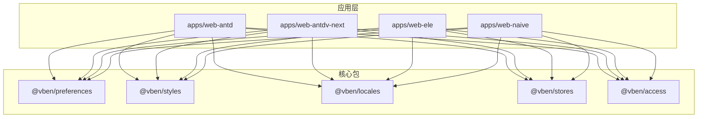
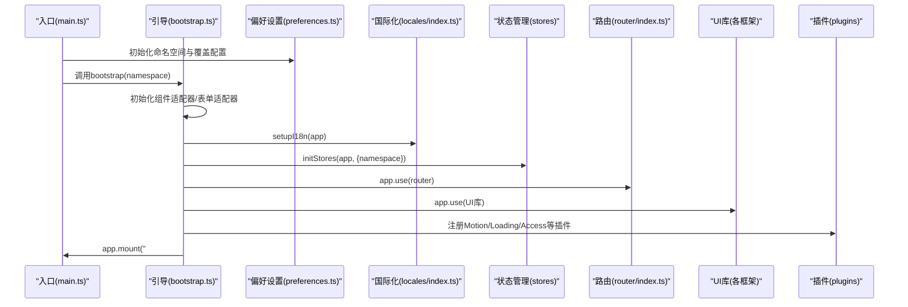
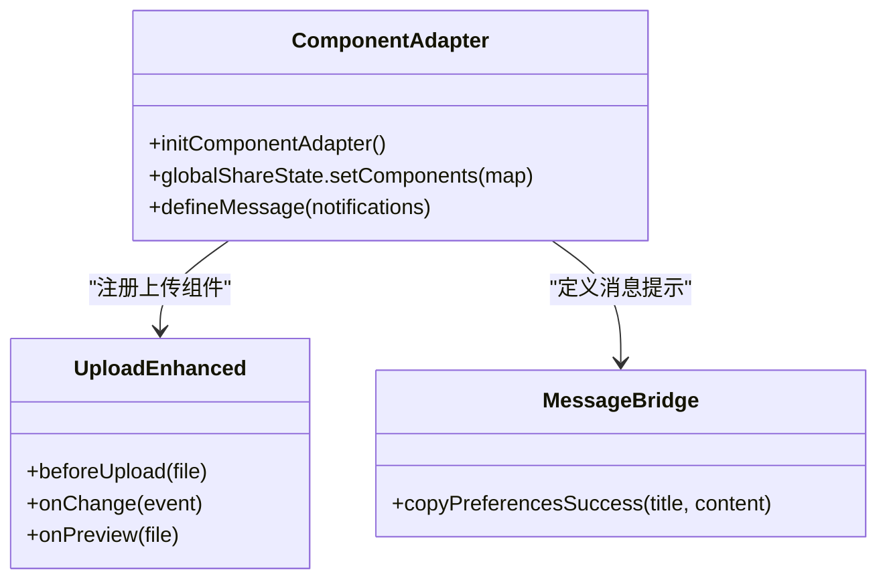
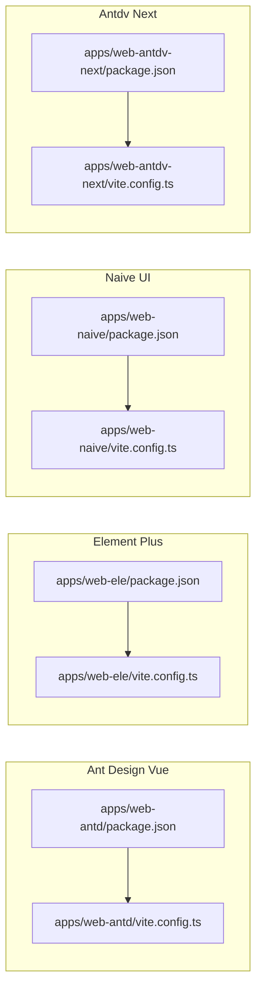
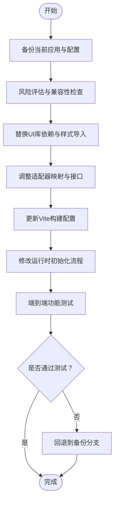

# 框架切换指南

<cite>
**本文引用的文件**
- [apps/web-antd/package.json](file://apps/web-antd/package.json)
- [apps/web-antd/vite.config.ts](file://apps/web-antd/vite.config.ts)
- [apps/web-antd/src/main.ts](file://apps/web-antd/src/main.ts)
- [apps/web-antd/src/bootstrap.ts](file://apps/web-antd/src/bootstrap.ts)
- [apps/web-antd/src/preferences.ts](file://apps/web-antd/src/preferences.ts)
- [apps/web-antd/src/adapter/component/index.ts](file://apps/web-antd/src/adapter/component/index.ts)
- [apps/web-antd/src/adapter/form.ts](file://apps/web-antd/src/adapter/form.ts)
- [apps/web-antd/src/adapter/vxe-table.ts](file://apps/web-antd/src/adapter/vxe-table.ts)
- [apps/web-antd/src/locales/index.ts](file://apps/web-antd/src/locales/index.ts)
- [apps/web-antd/src/router/index.ts](file://apps/web-antd/src/router/index.ts)
- [apps/web-antdv-next/package.json](file://apps/web-antdv-next/package.json)
- [apps/web-antdv-next/vite.config.ts](file://apps/web-antdv-next/vite.config.ts)
- [apps/web-ele/package.json](file://apps/web-ele/package.json)
- [apps/web-ele/vite.config.ts](file://apps/web-ele/vite.config.ts)
- [apps/web-naive/package.json](file://apps/web-naive/package.json)
- [apps/web-naive/vite.config.ts](file://apps/web-naive/vite.config.ts)
</cite>

## 目录

1. [简介](#简介)
2. [项目结构](#项目结构)
3. [核心组件](#核心组件)
4. [架构总览](#架构总览)
5. [详细组件分析](#详细组件分析)
6. [依赖关系分析](#依赖关系分析)
7. [性能考量](#性能考量)
8. [故障排查指南](#故障排查指南)
9. [结论](#结论)
10. [附录](#附录)

## 简介

本指南面向需要在多个UI框架间进行切换的团队与个人，基于仓库中已实现的多框架应用（Ant Design Vue、Element Plus、Naive UI、TDesign、Antdv Next）给出可复用的切换步骤、配置要点、兼容性注意事项与迁移策略。内容涵盖：

- 项目配置修改与依赖替换
- Vite构建与开发服务器配置
- 运行时初始化流程与插件装配
- 组件API差异、样式冲突与功能限制
- 切换前准备、风险评估与回退方案
- 主题系统、国际化与权限控制的迁移方法
- 常见场景的迁移示例与注意事项

## 项目结构

该仓库采用多应用（apps）组织方式，每个框架对应一个独立的应用目录，共享核心包（packages）与公共配置（internal）。切换时只需替换目标应用目录中的依赖、适配器与样式导入即可。

图表来源

- [apps/web-antd/package.json:1-67](file://apps/web-antd/package.json#L1-L67)
- [apps/web-antdv-next/package.json:1-51](file://apps/web-antdv-next/package.json#L1-L51)
- [apps/web-ele/package.json:1-54](file://apps/web-ele/package.json#L1-L54)
- [apps/web-naive/package.json:1-50](file://apps/web-naive/package.json#L1-L50)

章节来源

- [apps/web-antd/package.json:1-67](file://apps/web-antd/package.json#L1-L67)
- [apps/web-antdv-next/package.json:1-51](file://apps/web-antdv-next/package.json#L1-L51)
- [apps/web-ele/package.json:1-54](file://apps/web-ele/package.json#L1-L54)
- [apps/web-naive/package.json:1-50](file://apps/web-naive/package.json#L1-L50)

## 核心组件

- 应用入口与初始化
  - 入口脚本负责初始化偏好设置、启动引导与移除全局loading。
  - 引导函数负责注册指令、国际化、状态管理、路由、UI库、插件与动态标题等。
- 适配器体系
  - 组件适配器：将通用表单/表格组件映射到具体UI库组件，并处理占位符、上传预览、裁剪等增强能力。
  - 表单适配器：定义模型属性名映射、校验规则国际化等。
  - Vxe表格适配器：注册单元格渲染器、全局表格配置、与表单联动。
- 国际化与本地化
  - 加载应用语言包与第三方组件库语言包（如Ant Design Vue、Day.js），支持缺失警告与默认语言。
- 路由与守卫
  - 支持hash/history两种路由模式，提供滚动行为与静态路由重置能力。
- 偏好设置
  - 覆盖应用名称、更新检查、访问模式、默认首页路径、语言切换与时区等。

章节来源

- [apps/web-antd/src/main.ts:1-32](file://apps/web-antd/src/main.ts#L1-L32)
- [apps/web-antd/src/bootstrap.ts:1-85](file://apps/web-antd/src/bootstrap.ts#L1-L85)
- [apps/web-antd/src/adapter/component/index.ts:1-608](file://apps/web-antd/src/adapter/component/index.ts#L1-L608)
- [apps/web-antd/src/adapter/form.ts:1-50](file://apps/web-antd/src/adapter/form.ts#L1-L50)
- [apps/web-antd/src/adapter/vxe-table.ts:1-119](file://apps/web-antd/src/adapter/vxe-table.ts#L1-L119)
- [apps/web-antd/src/locales/index.ts:1-103](file://apps/web-antd/src/locales/index.ts#L1-L103)
- [apps/web-antd/src/router/index.ts:1-38](file://apps/web-antd/src/router/index.ts#L1-L38)
- [apps/web-antd/src/preferences.ts:1-31](file://apps/web-antd/src/preferences.ts#L1-L31)

## 架构总览

下图展示了从入口到运行时的关键交互，体现“入口初始化 → 引导装配 → 插件与UI库注入 → 国际化与路由”的整体流程。

图表来源

- [apps/web-antd/src/main.ts:1-32](file://apps/web-antd/src/main.ts#L1-L32)
- [apps/web-antd/src/bootstrap.ts:1-85](file://apps/web-antd/src/bootstrap.ts#L1-L85)
- [apps/web-antd/src/preferences.ts:1-31](file://apps/web-antd/src/preferences.ts#L1-L31)
- [apps/web-antd/src/locales/index.ts:1-103](file://apps/web-antd/src/locales/index.ts#L1-L103)
- [apps/web-antd/src/router/index.ts:1-38](file://apps/web-antd/src/router/index.ts#L1-L38)

## 详细组件分析

### 组件适配器（Ant Design Vue）

- 作用：将通用组件类型映射到Ant Design Vue组件，统一占位符、上传预览/裁剪、消息提示等行为。
- 关键点：
  - 使用异步组件按需加载，降低首屏体积。
  - 上传组件增强：支持裁剪、预览组、尺寸校验、错误提示。
  - 消息提示：通过通知组件统一风格。
- 适用场景：复杂表单、数据表格、富文本编辑器等。

图表来源

- [apps/web-antd/src/adapter/component/index.ts:526-608](file://apps/web-antd/src/adapter/component/index.ts#L526-L608)

章节来源

- [apps/web-antd/src/adapter/component/index.ts:1-608](file://apps/web-antd/src/adapter/component/index.ts#L1-L608)

### 表单适配器（Ant Design Vue）

- 作用：定义基础模型属性名与部分组件的特殊属性名映射，提供校验规则国际化。
- 关键点：
  - 基础模型属性名：value
  - 特殊映射：Checkbox/Radio/Switch/Upload
  - 规则国际化：必填、选择必填等

章节来源

- [apps/web-antd/src/adapter/form.ts:1-50](file://apps/web-antd/src/adapter/form.ts#L1-L50)

### Vxe表格适配器（Ant Design Vue）

- 作用：注册单元格渲染器（头像、链接、标签、开关、进度、操作列等），配置全局表格行为并与表单联动。
- 关键点：
  - 渲染器注册：CellImage、CellLink、CellTag、CellSwitch、CellOperation、DictTag、UserAvatar、UserSelect、CellProgress等。
  - 全局配置：边框、圆角、溢出、大小、分页响应字段等。
  - 热更新兼容：清理旧渲染器避免异常。

章节来源

- [apps/web-antd/src/adapter/vxe-table.ts:1-119](file://apps/web-antd/src/adapter/vxe-table.ts#L1-L119)

### 国际化与本地化（Ant Design Vue）

- 作用：加载应用语言包与第三方组件库语言包，支持Day.js与Ant Design Vue本地化。
- 关键点：
  - 应用语言包：按语言目录动态加载。
  - 第三方语言包：按语言切换加载Ant Design Vue与Day.js语言包。
  - 缺失警告：开发环境打印缺失信息。

章节来源

- [apps/web-antd/src/locales/index.ts:1-103](file://apps/web-antd/src/locales/index.ts#L1-L103)

### 路由与守卫（Ant Design Vue）

- 作用：创建路由实例，支持hash/history模式，提供滚动行为与静态路由重置。
- 关键点：
  - 历史模式选择：通过环境变量控制。
  - 滚动行为：支持锚点平滑滚动与位置恢复。
  - 静态路由重置：便于权限变更后的路由重建。

章节来源

- [apps/web-antd/src/router/index.ts:1-38](file://apps/web-antd/src/router/index.ts#L1-L38)

### 偏好设置（跨框架一致）

- 作用：覆盖应用名称、更新检查、访问模式、默认首页路径、语言切换与时区等。
- 关键点：
  - 命名空间：结合版本与环境生成唯一标识，隔离存储。
  - 访问模式：前端/混合/后端等模式可灵活切换。

章节来源

- [apps/web-antd/src/preferences.ts:1-31](file://apps/web-antd/src/preferences.ts#L1-L31)

## 依赖关系分析

- 依赖替换原则
  - UI库：将Ant Design Vue替换为其他框架（如Element Plus、Naive UI、TDesign、Antdv Next）。
  - 样式：同步替换样式导入与主题变量。
  - 适配器：保持组件类型与表单/Vxe适配器接口一致，仅替换底层组件实现。
- 框架差异对照
  - Ant Design Vue：依赖较多，组件丰富，适配器复杂度中等。
  - Element Plus：按需引入与插件集成（如unplugin-element-plus）。
  - Naive UI：轻量简洁，适配器可简化。
  - TDesign：企业级组件，适配器与Ant Design Vue类似但API略有差异。
  - Antdv Next：新版本Ant Design Vue生态，适配器可复用大部分逻辑。

图表来源

- [apps/web-antd/package.json:1-67](file://apps/web-antd/package.json#L1-L67)
- [apps/web-antd/vite.config.ts:1-21](file://apps/web-antd/vite.config.ts#L1-L21)
- [apps/web-ele/package.json:1-54](file://apps/web-ele/package.json#L1-L54)
- [apps/web-ele/vite.config.ts:1-28](file://apps/web-ele/vite.config.ts#L1-L28)
- [apps/web-naive/package.json:1-50](file://apps/web-naive/package.json#L1-L50)
- [apps/web-naive/vite.config.ts:1-21](file://apps/web-naive/vite.config.ts#L1-L21)
- [apps/web-antdv-next/package.json:1-51](file://apps/web-antdv-next/package.json#L1-L51)
- [apps/web-antdv-next/vite.config.ts:1-21](file://apps/web-antdv-next/vite.config.ts#L1-L21)

章节来源

- [apps/web-antd/package.json:1-67](file://apps/web-antd/package.json#L1-L67)
- [apps/web-ele/package.json:1-54](file://apps/web-ele/package.json#L1-L54)
- [apps/web-naive/package.json:1-50](file://apps/web-naive/package.json#L1-L50)
- [apps/web-antdv-next/package.json:1-51](file://apps/web-antdv-next/package.json#L1-L51)

## 性能考量

- 按需加载与懒编译
  - 组件适配器使用异步组件按需加载，减少首屏体积。
  - 上传组件预览与裁剪在交互时才创建DOM，避免常驻内存。
- 构建优化
  - Vite代理与插件配置保持一致，避免重复代理导致的请求延迟。
  - Element Plus按需引入插件可显著减少打包体积。
- 运行时优化
  - 动态标题与国际化按需更新，避免不必要的重渲染。
  - 表格渲染器在热更新时清理旧实例，防止内存泄漏。

## 故障排查指南

- 国际化未生效
  - 检查语言包目录与文件命名是否符合约定。
  - 确认第三方组件库语言包加载顺序与语言匹配。
- 上传组件异常
  - 检查裁剪与预览逻辑是否被覆盖或拦截。
  - 确认文件类型判断与预览URL生成逻辑。
- 路由跳转失效
  - 检查路由历史模式配置与基础路径。
  - 确认静态路由重置调用时机。
- 权限控制异常
  - 检查访问模式配置与守卫注册顺序。
  - 确认命名空间隔离是否影响用户状态。

章节来源

- [apps/web-antd/src/locales/index.ts:1-103](file://apps/web-antd/src/locales/index.ts#L1-L103)
- [apps/web-antd/src/adapter/component/index.ts:137-491](file://apps/web-antd/src/adapter/component/index.ts#L137-L491)
- [apps/web-antd/src/router/index.ts:1-38](file://apps/web-antd/src/router/index.ts#L1-L38)
- [apps/web-antd/src/preferences.ts:1-31](file://apps/web-antd/src/preferences.ts#L1-L31)

## 结论

通过统一的适配器体系与偏好设置，项目可在多个UI框架间平滑切换。切换的关键在于：

- 明确替换UI库与样式导入
- 保持组件类型与表单/Vxe适配器接口一致
- 同步国际化与第三方组件库语言包
- 严格遵循构建与运行时配置一致性
- 制定完善的回退方案与测试验证

## 附录

### 切换前准备清单

- 备份策略
  - 备份当前应用目录与核心配置文件（package.json、vite.config.ts、bootstrap.ts、适配器等）。
  - 备份语言包与主题变量，以便快速回退。
- 风险评估
  - 组件API差异：确认目标框架的组件属性、事件与插槽差异。
  - 样式冲突：评估第三方组件库样式对全局样式的覆盖。
  - 功能限制：如权限控制、国际化、表格渲染器等是否完全兼容。
- 回退方案
  - 保留原应用目录作为回退分支。
  - 记录关键配置差异，便于一键还原。

### 切换步骤（从Ant Design Vue到Element Plus）

- 步骤一：依赖替换
  - 替换UI库依赖与样式导入，删除Ant Design Vue相关依赖。
  - 新增Element Plus与按需插件依赖。
- 步骤二：适配器调整
  - 更新组件适配器中的组件映射，替换为Element Plus组件。
  - 保持表单与Vxe适配器接口一致。
- 步骤三：构建配置
  - 在Vite配置中启用Element Plus按需插件。
  - 保持代理与开发服务器配置一致。
- 步骤四：运行时初始化
  - 在引导函数中替换UI库安装与样式导入。
  - 确保国际化与第三方组件库语言包加载顺序正确。
- 步骤五：验证与回退
  - 进行端到端测试，验证表单、表格、上传、国际化等功能。
  - 准备回退分支，记录差异点以便快速恢复。

### 框架特有功能迁移

- 主题系统
  - 统一通过偏好设置与样式包管理，避免硬编码主题变量。
- 国际化支持
  - 保持语言包目录结构与加载逻辑一致，确保第三方组件库语言包同步加载。
- 权限控制
  - 保持访问模式与守卫注册顺序不变，确保命名空间隔离不影响权限状态。

### 示例：组件API差异处理

- Ant Design Vue vs Element Plus
  - 属性映射：如上传组件的文件列表属性名在不同框架下可能不同，需在适配器中统一。
  - 事件处理：确认事件名与回调参数一致，必要时在适配器中做兼容转换。
- 样式冲突
  - 使用框架专属样式导入，避免全局样式污染。
  - 通过主题变量与CSS模块化隔离样式边界。
