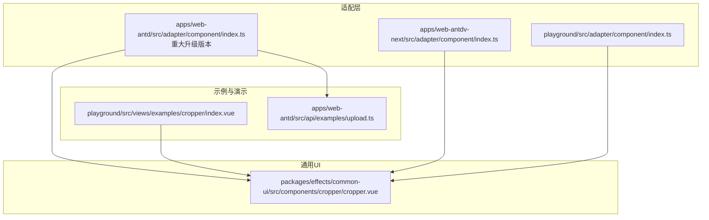
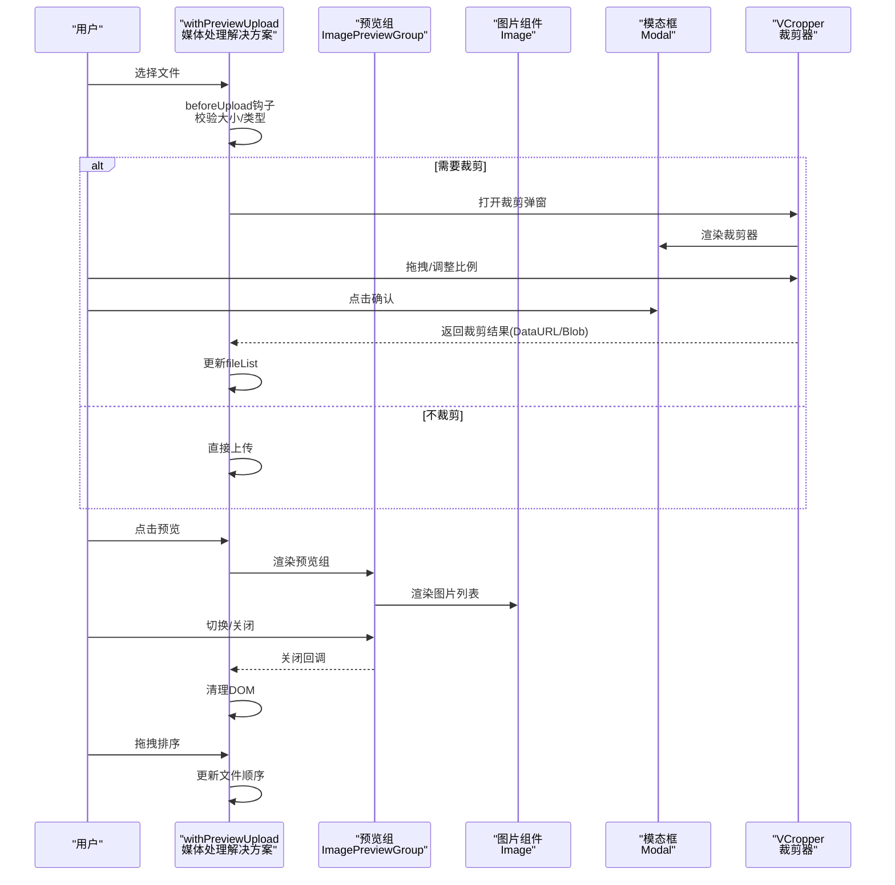
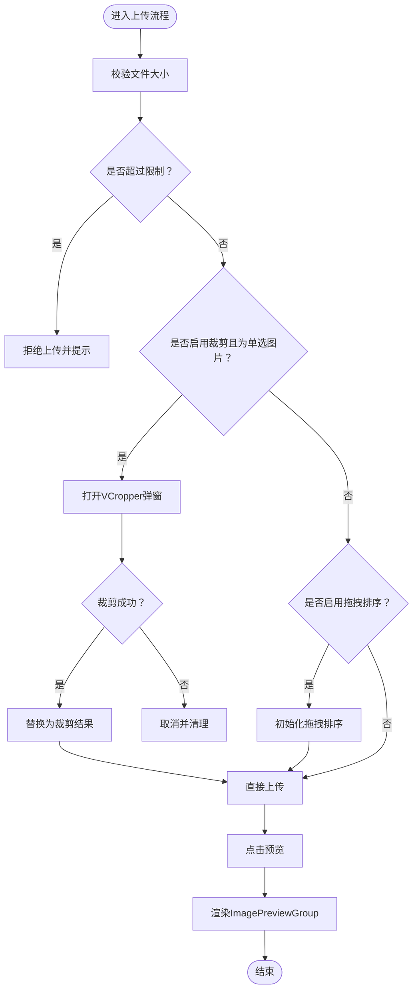
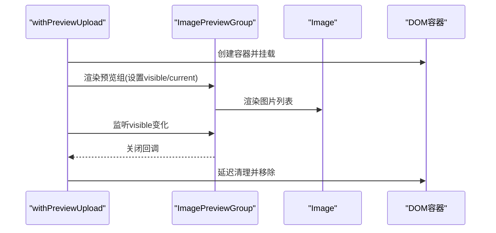
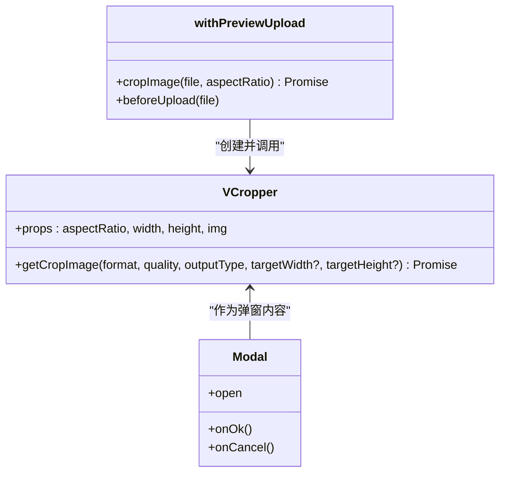
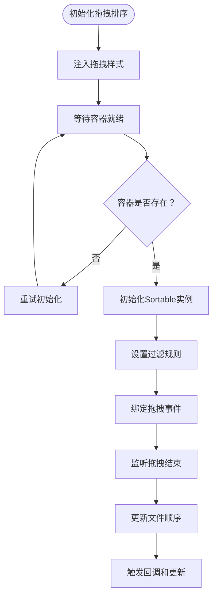
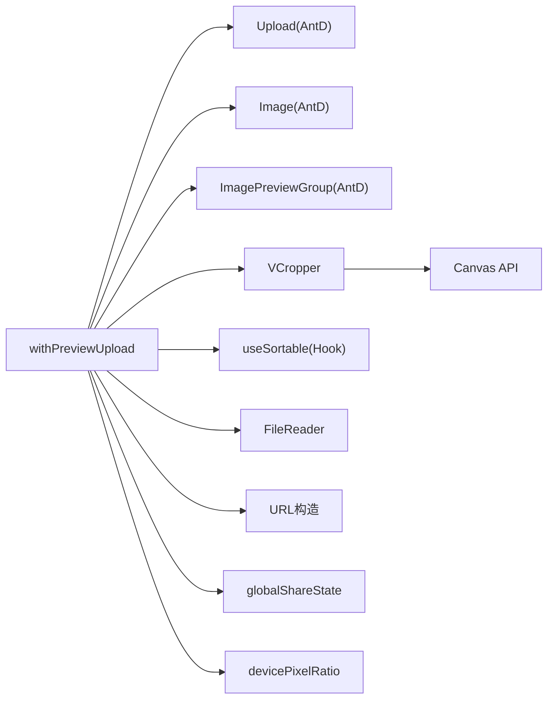

# 上传预览功能

<cite>
**本文档引用的文件**
- [apps/web-antd/src/adapter/component/index.ts](file://apps/web-antd/src/adapter/component/index.ts)
- [packages/effects/common-ui/src/components/cropper/cropper.vue](file://packages/effects/common-ui/src/components/cropper/cropper.vue)
- [playground/src/views/examples/cropper/index.vue](file://playground/src/views/examples/cropper/index.vue)
- [apps/web-antd/src/api/examples/upload.ts](file://apps/web-antd/src/api/examples/upload.ts)
- [apps/web-antdv-next/src/adapter/component/index.ts](file://apps/web-antdv-next/src/adapter/component/index.ts)
- [playground/src/adapter/component/index.ts](file://playground/src/adapter/component/index.ts)
</cite>

## 更新摘要

**变更内容**

- 重大升级：withPreviewUpload 从基础上传包装器升级为复杂的媒体处理解决方案
- 新增拖拽排序功能，支持文件列表的重新排列
- 增强文件验证机制，提供更严格的文件类型和大小检查
- 集成高级图像预览功能，支持预览组渲染和切换
- 优化裁剪功能，提供更好的用户体验和错误处理

## 目录

1. [简介](#简介)
2. [项目结构](#项目结构)
3. [核心组件](#核心组件)
4. [架构总览](#架构总览)
5. [详细组件分析](#详细组件分析)
6. [依赖关系分析](#依赖关系分析)
7. [性能考量](#性能考量)
8. [故障排查指南](#故障排查指南)
9. [结论](#结论)
10. [附录](#附录)

## 简介

本文件系统性阐述"上传预览功能"的实现与使用，重点围绕 withPreviewUpload 高阶组件展开，说明其如何为 Upload 组件注入预览与裁剪能力。经过重大升级后，该组件现已发展为复杂的媒体处理解决方案，涵盖：

- 图片文件检测逻辑（类型判断、URL 解析、扩展名匹配）
- 预览组协作机制（Image 与 ImagePreviewGroup 的配合）
- 图片裁剪流程（VCropper 组件集成、裁剪参数配置与结果处理）
- **新增**：拖拽排序功能（文件列表的重新排列）
- **新增**：文件验证机制（大小限制、类型检查、错误处理）
- 上传组件配置项（最大文件大小、裁剪模式、列表类型等）
- 实际使用示例与最佳实践

## 项目结构

该功能横跨多个应用与包：

- 适配层组件：在不同 UI 框架（Ant Design Vue、Naive UI 等）下统一适配 Upload 组件
- 裁剪组件：VCropper 提供可视化的图片裁剪能力
- 示例与演示：Playground 提供裁剪组件的独立示例页面
- API 示例：提供上传接口调用示例

**图表来源**

- [apps/web-antd/src/adapter/component/index.ts:1-687](file://apps/web-antd/src/adapter/component/index.ts#L1-L687)
- [packages/effects/common-ui/src/components/cropper/cropper.vue:1-982](file://packages/effects/common-ui/src/components/cropper/cropper.vue#L1-L982)
- [playground/src/views/examples/cropper/index.vue:1-145](file://playground/src/views/examples/cropper/index.vue#L1-L145)
- [apps/web-antd/src/api/examples/upload.ts:1-25](file://apps/web-antd/src/api/examples/upload.ts#L1-L25)

**章节来源**

- [apps/web-antd/src/adapter/component/index.ts:1-687](file://apps/web-antd/src/adapter/component/index.ts#L1-L687)
- [packages/effects/common-ui/src/components/cropper/cropper.vue:1-982](file://packages/effects/common-ui/src/components/cropper/cropper.vue#L1-L982)
- [playground/src/views/examples/cropper/index.vue:1-145](file://playground/src/views/examples/cropper/index.vue#L1-L145)
- [apps/web-antd/src/api/examples/upload.ts:1-25](file://apps/web-antd/src/api/examples/upload.ts#L1-L25)

## 核心组件

- **withPreviewUpload 高阶组件**：封装 Upload 的预览与裁剪增强逻辑，现已成为复杂的媒体处理解决方案
- **VCropper 裁剪组件**：提供可视化裁剪、比例控制、导出裁剪结果的能力
- **Image 与 ImagePreviewGroup**：用于图片预览组的渲染与切换
- **拖拽排序功能**：基于 useSortable 的文件列表重新排列能力
- **文件验证机制**：提供严格的数据验证和错误处理

**章节来源**

- [apps/web-antd/src/adapter/component/index.ts:1-687](file://apps/web-antd/src/adapter/component/index.ts#L1-L687)
- [packages/effects/common-ui/src/components/cropper/cropper.vue:1-982](file://packages/effects/common-ui/src/components/cropper/cropper.vue#L1-L982)

## 架构总览

以下序列图展示了用户选择文件、触发裁剪、生成预览并关闭弹窗的整体流程，以及新增的拖拽排序功能。

**图表来源**

- [apps/web-antd/src/adapter/component/index.ts:406-454](file://apps/web-antd/src/adapter/component/index.ts#L406-L454)
- [packages/effects/common-ui/src/components/cropper/cropper.vue:313-376](file://packages/effects/common-ui/src/components/cropper/cropper.vue#L313-L376)
- [apps/web-antd/src/adapter/component/index.ts:488-535](file://apps/web-antd/src/adapter/component/index.ts#L488-L535)

**章节来源**

- [apps/web-antd/src/adapter/component/index.ts:406-454](file://apps/web-antd/src/adapter/component/index.ts#L406-L454)
- [packages/effects/common-ui/src/components/cropper/cropper.vue:313-376](file://packages/effects/common-ui/src/components/cropper/cropper.vue#L313-L376)
- [apps/web-antd/src/adapter/component/index.ts:488-535](file://apps/web-antd/src/adapter/component/index.ts#L488-L535)

## 详细组件分析

### withPreviewUpload 高阶组件（重大升级版）

**更新** 该组件已从基础上传包装器升级为复杂的媒体处理解决方案，集成了多项高级功能：

- **文件类型检测**
  - 优先通过 URL 解析扩展名；若 URL 非法，则回退到 URL 字符串末尾扩展名
  - 若无 URL，则通过文件名扩展名判断
  - 最后兜底使用 MIME 类型前缀 image/
- **预览组渲染**
  - 过滤出所有图片文件，为无预览地址的图片生成 DataURL
  - 使用 ImagePreviewGroup 包裹一组 Image，实现点击预览与切换
- **裁剪流程**
  - 在单选、非多选、启用裁剪且为图片文件时触发
  - 通过 VCropper 弹窗进行裁剪，返回裁剪结果并替换原文件
- **拖拽排序功能**
  - 基于 useSortable 实现文件列表的拖拽重新排列
  - 支持动画效果和延迟拖拽
  - 过滤不可拖拽的元素（选择器、错误状态、上传中状态）
- **文件验证机制**
  - beforeUpload 中进行大小限制校验
  - 严格的文件类型检查
  - 错误处理和用户反馈
- **上传与变更**
  - onChange 中同步 fileList 并更新 v-model
  - 支持拖拽排序事件回调

**图表来源**

- [apps/web-antd/src/adapter/component/index.ts:406-454](file://apps/web-antd/src/adapter/component/index.ts#L406-L454)
- [apps/web-antd/src/adapter/component/index.ts:194-283](file://apps/web-antd/src/adapter/component/index.ts#L194-L283)
- [apps/web-antd/src/adapter/component/index.ts:488-535](file://apps/web-antd/src/adapter/component/index.ts#L488-L535)

**章节来源**

- [apps/web-antd/src/adapter/component/index.ts:1-687](file://apps/web-antd/src/adapter/component/index.ts#L1-L687)

### 图片文件检测逻辑

- **URL 解析优先**：尝试构造 URL 并取路径扩展名，异常时回退到字符串扩展名
- **扩展名白名单**：bmp、gif、jpeg、jpg、png、svg、webp
- **MIME 类型兜底**：当无扩展名时，检查 type 是否以 image/ 开头

**图表来源**

- [apps/web-antd/src/adapter/component/index.ts:155-171](file://apps/web-antd/src/adapter/component/index.ts#L155-L171)

**章节来源**

- [apps/web-antd/src/adapter/component/index.ts:155-171](file://apps/web-antd/src/adapter/component/index.ts#L155-L171)

### 预览组实现机制

- **预览组渲染**
  - 动态导入 Image 与 ImagePreviewGroup
  - 为无预览地址的图片生成 DataURL，确保预览可用
  - 通过 PreviewGroup 的 preview 属性控制可见性与初始索引
- **生命周期管理**
  - 使用 render 动态挂载/卸载，避免内存泄漏
  - onVisibleChange/onOpenChange 回调中延迟清理，确保动画完成

**图表来源**

- [apps/web-antd/src/adapter/component/index.ts:210-284](file://apps/web-antd/src/adapter/component/index.ts#L210-L284)
- [apps/web-antdv-next/src/adapter/component/index.ts:194-283](file://apps/web-antdv-next/src/adapter/component/index.ts#L194-L283)

**章节来源**

- [apps/web-antd/src/adapter/component/index.ts:210-284](file://apps/web-antd/src/adapter/component/index.ts#L210-L284)
- [apps/web-antdv-next/src/adapter/component/index.ts:194-283](file://apps/web-antdv-next/src/adapter/component/index.ts#L194-L283)

### 图片裁剪功能（VCropper 集成）

- **组件参数**
  - aspectRatio：裁剪比例（如 '1:1'、'16:9'），支持动态变更
  - width/height：容器尺寸
  - img：待裁剪图片的 URL
- **裁剪过程**
  - 打开 Modal 弹窗，内部渲染 VCropper
  - 用户拖拽调整裁剪区域，支持自由比例与固定比例
  - 点击确认后，VCropper 导出裁剪结果（DataURL/Blob）
- **结果处理**
  - withPreviewUpload 接收裁剪结果，替换原文件并更新 fileList
  - 支持错误提示与取消处理

**图表来源**

- [packages/effects/common-ui/src/components/cropper/cropper.vue:5-14](file://packages/effects/common-ui/src/components/cropper/cropper.vue#L5-L14)
- [packages/effects/common-ui/src/components/cropper/cropper.vue:530-675](file://packages/effects/common-ui/src/components/cropper/cropper.vue#L530-L675)
- [apps/web-antd/src/adapter/component/index.ts:289-381](file://apps/web-antd/src/adapter/component/index.ts#L289-L381)

**章节来源**

- [packages/effects/common-ui/src/components/cropper/cropper.vue:1-982](file://packages/effects/common-ui/src/components/cropper/cropper.vue#L1-L982)
- [apps/web-antd/src/adapter/component/index.ts:289-381](file://apps/web-antd/src/adapter/component/index.ts#L289-L381)

### 拖拽排序功能（新增）

**更新** 新增的拖拽排序功能提供了文件列表的重新排列能力：

- **初始化流程**
  - 通过 useSortable 初始化拖拽功能
  - 注入样式以提供拖拽指示和悬停效果
  - 支持动画效果和延迟拖拽
- **过滤规则**
  - 过滤不可拖拽的元素：选择器、错误状态、上传中状态
  - 确保拖拽操作的准确性和用户体验
- **排序逻辑**
  - 监听拖拽结束事件
  - 更新文件列表的顺序
  - 触发 onDragSort 回调和 v-model 更新
- **样式管理**
  - 动态注入和移除拖拽样式
  - 提供视觉反馈和交互效果

**图表来源**

- [apps/web-antd/src/adapter/component/index.ts:488-535](file://apps/web-antd/src/adapter/component/index.ts#L488-L535)

**章节来源**

- [apps/web-antd/src/adapter/component/index.ts:463-535](file://apps/web-antd/src/adapter/component/index.ts#L463-L535)

### 文件验证机制（增强）

**更新** 增强的文件验证机制提供了更严格的检查和处理：

- **大小验证**
  - 在 beforeUpload 中进行文件大小检查
  - 支持 MB 单位的大小限制
  - 提供用户友好的错误提示
- **类型验证**
  - 严格的图片文件类型检查
  - 支持多种图片格式（bmp、gif、jpeg、jpg、png、svg、webp）
  - MIME 类型和扩展名双重验证
- **错误处理**
  - 完善的错误捕获和处理机制
  - 用户友好的错误提示
  - 状态管理和清理

**章节来源**

- [apps/web-antd/src/adapter/component/index.ts:406-433](file://apps/web-antd/src/adapter/component/index.ts#L406-L433)

### 上传组件配置选项

**更新** 配置选项已扩展以支持新功能：

- **基础配置**
  - maxSize：最大文件大小（MB），在 beforeUpload 中校验
  - aspectRatio：裁剪比例，传递给 VCropper
  - listType：列表类型（如 text、picture-card），影响默认插槽渲染
  - crop：是否启用裁剪（需满足单选且为图片）
  - draggable：是否启用拖拽排序
- **事件与行为**
  - beforeUpload：大小校验、裁剪触发、类型检查
  - onChange：同步 fileList、更新 v-model
  - onPreview：触发预览组渲染
  - onDragSort：拖拽排序完成回调
- **新增配置**
  - disabled：禁用状态支持
  - placeholder：占位符文本
  - modelValue：双向绑定支持

**章节来源**

- [apps/web-antd/src/adapter/component/index.ts:390-461](file://apps/web-antd/src/adapter/component/index.ts#L390-L461)

### 实际使用示例

- **Playground 裁剪示例**
  - 通过 Upload 选择图片，FileReader 读取为 DataURL
  - VCropper 展示并导出裁剪结果，支持下载
- **上传接口示例**
  - 提供 upload_file 方法，演示进度与成功回调
- **拖拽排序示例**
  - 展示文件列表的拖拽重新排列功能
  - 支持多种比例设置和实时预览

**章节来源**

- [playground/src/views/examples/cropper/index.vue:1-145](file://playground/src/views/examples/cropper/index.vue#L1-L145)
- [apps/web-antd/src/api/examples/upload.ts:1-25](file://apps/web-antd/src/api/examples/upload.ts#L1-L25)

## 依赖关系分析

**更新** 依赖关系已扩展以支持新功能：

- **组件依赖**
  - withPreviewUpload 依赖 Ant Design Vue 的 Upload、Image、ImagePreviewGroup
  - 裁剪依赖 VCropper 组件
  - 拖拽排序依赖 useSortable Hook
- **外部依赖**
  - 浏览器 FileReader、URL 构造、Canvas API
  - 国际化与消息提示（$t、message、notification）
  - 全局共享状态（globalShareState）
- **新增依赖**
  - Sortable：拖拽排序功能
  - 设备像素比（devicePixelRatio）：高清屏幕适配

**图表来源**

- [apps/web-antd/src/adapter/component/index.ts:8-45](file://apps/web-antd/src/adapter/component/index.ts#L8-L45)
- [packages/effects/common-ui/src/components/cropper/cropper.vue:530-675](file://packages/effects/common-ui/src/components/cropper/cropper.vue#L530-L675)

**章节来源**

- [apps/web-antd/src/adapter/component/index.ts:8-45](file://apps/web-antd/src/adapter/component/index.ts#L8-L45)
- [packages/effects/common-ui/src/components/cropper/cropper.vue:530-675](file://packages/effects/common-ui/src/components/cropper/cropper.vue#L530-L675)

## 性能考量

**更新** 性能考量已扩展以适应新功能：

- **预览生成**
  - 仅对无预览地址的图片生成 DataURL，避免重复转换
  - 使用一次性生成与缓存策略，减少 IO 开销
- **裁剪导出**
  - 使用 Canvas 高清导出，结合 devicePixelRatio 抵抗 Retina 模糊
  - 质量参数边界校验，防止无效值导致性能问题
- **拖拽排序**
  - 优化的动画性能，支持 300ms 动画时长
  - 延迟拖拽机制，提升用户体验
  - 过滤规则减少不必要的拖拽处理
- **DOM 管理**
  - 动态挂载/卸载，延迟清理确保动画完成后再销毁，避免闪烁与内存泄漏
  - 样式注入和移除的智能管理
- **文件验证**
  - 预先检查文件大小和类型，避免不必要的上传请求
  - 错误处理的性能优化

## 故障排查指南

**更新** 故障排查指南已扩展以覆盖新功能：

- **无法识别图片**
  - 检查 URL 是否合法、扩展名是否在白名单、MIME 类型是否正确
- **裁剪弹窗不出现**
  - 确认启用了 crop、单选、且文件为图片
  - 检查 VCropper 是否正确渲染
- **预览组无法切换**
  - 确认 fileList 中存在图片且已生成预览
  - 检查 onVisibleChange/onOpenChange 回调是否被正确触发
- **拖拽排序失效**
  - 检查 draggable 属性是否正确设置
  - 确认容器元素是否存在且可拖拽
  - 验证过滤规则是否正确配置
- **上传失败或过大**
  - 检查 maxSize 配置与文件大小
  - 查看 beforeUpload 返回值与错误提示
- **拖拽样式问题**
  - 检查样式注入是否成功
  - 确认 CSS 选择器是否正确
  - 验证样式是否被其他样式覆盖

**章节来源**

- [apps/web-antd/src/adapter/component/index.ts:406-454](file://apps/web-antd/src/adapter/component/index.ts#L406-L454)
- [packages/effects/common-ui/src/components/cropper/cropper.vue:530-675](file://packages/effects/common-ui/src/components/cropper/cropper.vue#L530-L675)
- [apps/web-antd/src/adapter/component/index.ts:488-535](file://apps/web-antd/src/adapter/component/index.ts#L488-L535)

## 结论

withPreviewUpload 高阶组件经过重大升级，现已发展为功能完备的媒体处理解决方案。通过统一的文件类型检测、预览组渲染、VCropper 裁剪集成、拖拽排序和文件验证机制，为 Upload 组件提供了完整的"上传+预览+裁剪+排序"能力。其设计兼顾易用性与性能，支持复杂的媒体处理场景，适合在多套 UI 框架中复用。建议在生产环境中结合业务需求合理配置 maxSize、aspectRatio、listType 和 draggable，并注意 DOM 清理、错误处理和拖拽样式的维护，以获得稳定可靠的用户体验。

## 附录

- **代码片段路径参考**
  - [文件类型检测实现:155-171](file://apps/web-antd/src/adapter/component/index.ts#L155-L171)
  - [预览组渲染逻辑:210-284](file://apps/web-antd/src/adapter/component/index.ts#L210-L284)
  - [裁剪弹窗与结果处理:289-381](file://apps/web-antd/src/adapter/component/index.ts#L289-L381)
  - [拖拽排序实现:488-535](file://apps/web-antd/src/adapter/component/index.ts#L488-L535)
  - [文件验证机制:406-433](file://apps/web-antd/src/adapter/component/index.ts#L406-L433)
  - [VCropper 参数与导出:5-14](file://packages/effects/common-ui/src/components/cropper/cropper.vue#L5-L14)
  - [VCropper 导出实现:530-675](file://packages/effects/common-ui/src/components/cropper/cropper.vue#L530-L675)
  - [Playground 裁剪示例:1-145](file://playground/src/views/examples/cropper/index.vue#L1-L145)
  - [上传接口示例:1-25](file://apps/web-antd/src/api/examples/upload.ts#L1-L25)
