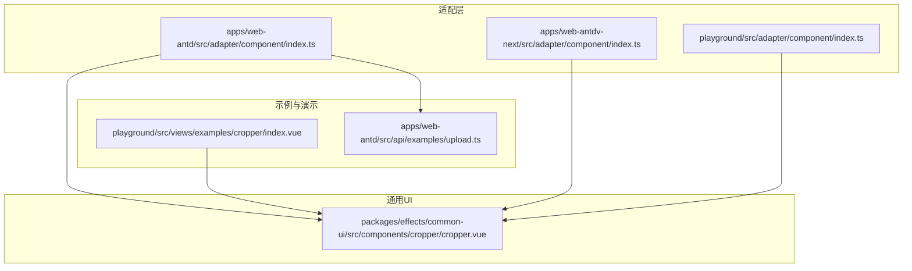
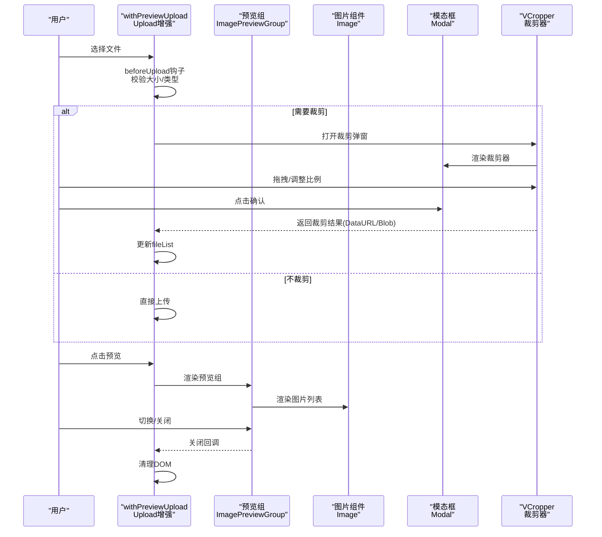
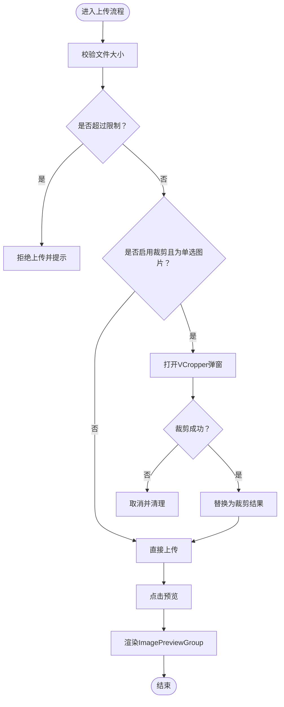
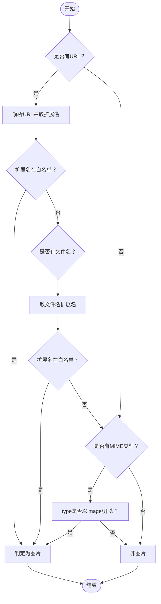
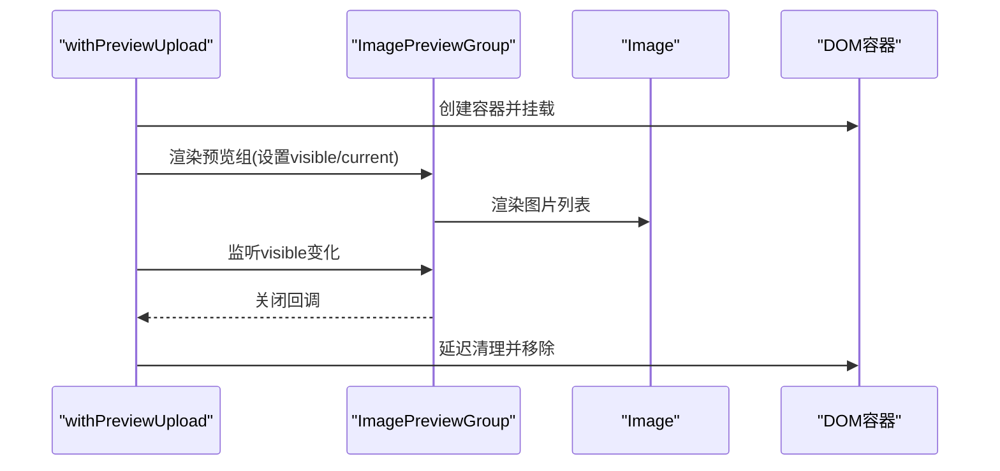
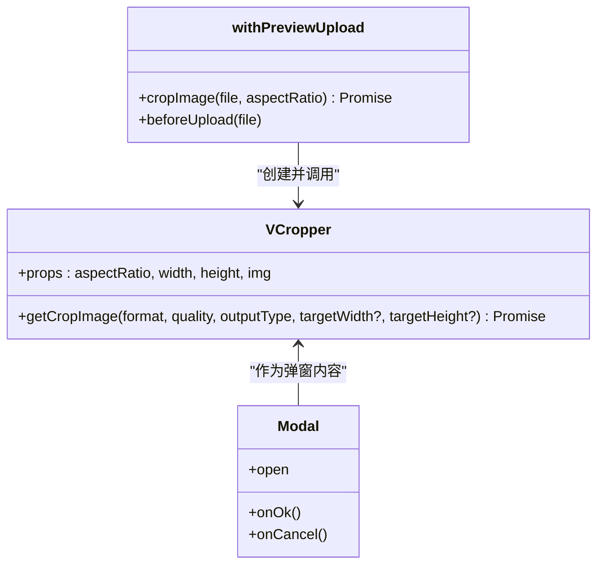
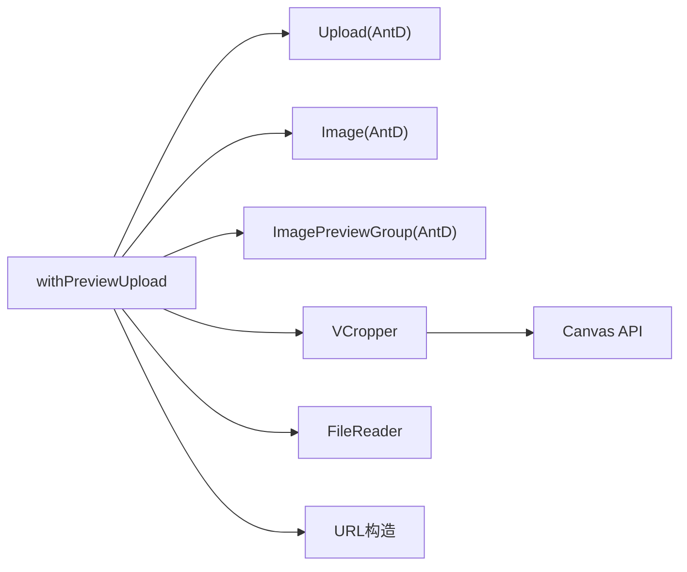

# 上传预览功能

<cite>
**本文档引用的文件**
- [apps/web-antd/src/adapter/component/index.ts](file://apps/web-antd/src/adapter/component/index.ts)
- [packages/effects/common-ui/src/components/cropper/cropper.vue](file://packages/effects/common-ui/src/components/cropper/cropper.vue)
- [playground/src/views/examples/cropper/index.vue](file://playground/src/views/examples/cropper/index.vue)
- [apps/web-antd/src/api/examples/upload.ts](file://apps/web-antd/src/api/examples/upload.ts)
- [apps/web-antdv-next/src/adapter/component/index.ts](file://apps/web-antdv-next/src/adapter/component/index.ts)
- [playground/src/adapter/component/index.ts](file://playground/src/adapter/component/index.ts)
</cite>

## 目录
1. [简介](#简介)
2. [项目结构](#项目结构)
3. [核心组件](#核心组件)
4. [架构总览](#架构总览)
5. [详细组件分析](#详细组件分析)
6. [依赖关系分析](#依赖关系分析)
7. [性能考量](#性能考量)
8. [故障排查指南](#故障排查指南)
9. [结论](#结论)
10. [附录](#附录)

## 简介
本文件系统性阐述“上传预览功能”的实现与使用，重点围绕 withPreviewUpload 高阶组件展开，说明其如何为 Upload 组件注入预览与裁剪能力。内容涵盖：
- 图片文件检测逻辑（类型判断、URL 解析、扩展名匹配）
- 预览组协作机制（Image 与 ImagePreviewGroup 的配合）
- 图片裁剪流程（VCropper 组件集成、裁剪参数配置与结果处理）
- 上传组件配置项（最大文件大小、裁剪模式、列表类型等）
- 实际使用示例与最佳实践

## 项目结构
该功能横跨多个应用与包：
- 适配层组件：在不同 UI 框架（Ant Design Vue、Naive UI 等）下统一适配 Upload 组件
- 裁剪组件：VCropper 提供可视化的图片裁剪能力
- 示例与演示：Playground 提供裁剪组件的独立示例页面
- API 示例：提供上传接口调用示例

图表来源
- [apps/web-antd/src/adapter/component/index.ts:137-491](file://apps/web-antd/src/adapter/component/index.ts#L137-L491)
- [packages/effects/common-ui/src/components/cropper/cropper.vue:1-982](file://packages/effects/common-ui/src/components/cropper/cropper.vue#L1-L982)
- [playground/src/views/examples/cropper/index.vue:1-145](file://playground/src/views/examples/cropper/index.vue#L1-L145)
- [apps/web-antd/src/api/examples/upload.ts:1-25](file://apps/web-antd/src/api/examples/upload.ts#L1-L25)

章节来源
- [apps/web-antd/src/adapter/component/index.ts:137-491](file://apps/web-antd/src/adapter/component/index.ts#L137-L491)
- [packages/effects/common-ui/src/components/cropper/cropper.vue:1-982](file://packages/effects/common-ui/src/components/cropper/cropper.vue#L1-L982)
- [playground/src/views/examples/cropper/index.vue:1-145](file://playground/src/views/examples/cropper/index.vue#L1-L145)
- [apps/web-antd/src/api/examples/upload.ts:1-25](file://apps/web-antd/src/api/examples/upload.ts#L1-L25)

## 核心组件
- withPreviewUpload 高阶组件：封装 Upload 的预览与裁剪增强逻辑，提供统一的上传体验
- VCropper 裁剪组件：提供可视化裁剪、比例控制、导出裁剪结果的能力
- Image 与 ImagePreviewGroup：用于图片预览组的渲染与切换

章节来源
- [apps/web-antd/src/adapter/component/index.ts:137-491](file://apps/web-antd/src/adapter/component/index.ts#L137-L491)
- [packages/effects/common-ui/src/components/cropper/cropper.vue:1-982](file://packages/effects/common-ui/src/components/cropper/cropper.vue#L1-L982)

## 架构总览
以下序列图展示了用户选择文件、触发裁剪、生成预览并关闭弹窗的整体流程。

图表来源
- [apps/web-antd/src/adapter/component/index.ts:400-452](file://apps/web-antd/src/adapter/component/index.ts#L400-L452)
- [packages/effects/common-ui/src/components/cropper/cropper.vue:313-376](file://packages/effects/common-ui/src/components/cropper/cropper.vue#L313-L376)

章节来源
- [apps/web-antd/src/adapter/component/index.ts:400-452](file://apps/web-antd/src/adapter/component/index.ts#L400-L452)
- [packages/effects/common-ui/src/components/cropper/cropper.vue:313-376](file://packages/effects/common-ui/src/components/cropper/cropper.vue#L313-L376)

## 详细组件分析

### withPreviewUpload 高阶组件
- 文件类型检测
  - 优先通过 URL 解析扩展名；若 URL 非法，则回退到 URL 字符串末尾扩展名
  - 若无 URL，则通过文件名扩展名判断
  - 最后兜底使用 MIME 类型前缀 image/
- 预览组渲染
  - 过滤出所有图片文件，为无预览地址的图片生成 DataURL
  - 使用 ImagePreviewGroup 包裹一组 Image，实现点击预览与切换
- 裁剪流程
  - 在单选、非多选、启用裁剪且为图片文件时触发
  - 通过 VCropper 弹窗进行裁剪，返回裁剪结果并替换原文件
- 上传与变更
  - beforeUpload 中进行大小限制校验
  - onChange 中同步 fileList 并更新 v-model

图表来源
- [apps/web-antd/src/adapter/component/index.ts:400-452](file://apps/web-antd/src/adapter/component/index.ts#L400-L452)
- [apps/web-antd/src/adapter/component/index.ts:194-283](file://apps/web-antd/src/adapter/component/index.ts#L194-L283)

章节来源
- [apps/web-antd/src/adapter/component/index.ts:137-491](file://apps/web-antd/src/adapter/component/index.ts#L137-L491)

### 图片文件检测逻辑
- URL 解析优先：尝试构造 URL 并取路径扩展名，异常时回退到字符串扩展名
- 扩展名白名单：bmp、gif、jpeg、jpg、png、svg、webp
- MIME 类型兜底：当无扩展名时，检查 type 是否以 image/ 开头

图表来源
- [apps/web-antd/src/adapter/component/index.ts:139-164](file://apps/web-antd/src/adapter/component/index.ts#L139-L164)

章节来源
- [apps/web-antd/src/adapter/component/index.ts:139-164](file://apps/web-antd/src/adapter/component/index.ts#L139-L164)

### 预览组实现机制
- 预览组渲染
  - 动态导入 Image 与 ImagePreviewGroup
  - 为无预览地址的图片生成 DataURL，确保预览可用
  - 通过 PreviewGroup 的 preview 属性控制可见性与初始索引
- 生命周期管理
  - 使用 render 动态挂载/卸载，避免内存泄漏
  - onVisibleChange/onOpenChange 回调中延迟清理，确保动画完成

图表来源
- [apps/web-antd/src/adapter/component/index.ts:194-283](file://apps/web-antd/src/adapter/component/index.ts#L194-L283)
- [apps/web-antdv-next/src/adapter/component/index.ts:194-283](file://apps/web-antdv-next/src/adapter/component/index.ts#L194-L283)

章节来源
- [apps/web-antd/src/adapter/component/index.ts:194-283](file://apps/web-antd/src/adapter/component/index.ts#L194-L283)
- [apps/web-antdv-next/src/adapter/component/index.ts:194-283](file://apps/web-antdv-next/src/adapter/component/index.ts#L194-L283)

### 图片裁剪功能（VCropper 集成）
- 组件参数
  - aspectRatio：裁剪比例（如 '1:1'、'16:9'），支持动态变更
  - width/height：容器尺寸
  - img：待裁剪图片的 URL
- 裁剪过程
  - 打开 Modal 弹窗，内部渲染 VCropper
  - 用户拖拽调整裁剪区域，支持自由比例与固定比例
  - 点击确认后，VCropper 导出裁剪结果（DataURL/Blob）
- 结果处理
  - withPreviewUpload 接收裁剪结果，替换原文件并更新 fileList
  - 支持错误提示与取消处理

图表来源
- [packages/effects/common-ui/src/components/cropper/cropper.vue:5-14](file://packages/effects/common-ui/src/components/cropper/cropper.vue#L5-L14)
- [packages/effects/common-ui/src/components/cropper/cropper.vue:530-675](file://packages/effects/common-ui/src/components/cropper/cropper.vue#L530-L675)
- [apps/web-antd/src/adapter/component/index.ts:286-376](file://apps/web-antd/src/adapter/component/index.ts#L286-L376)

章节来源
- [packages/effects/common-ui/src/components/cropper/cropper.vue:1-982](file://packages/effects/common-ui/src/components/cropper/cropper.vue#L1-L982)
- [apps/web-antd/src/adapter/component/index.ts:286-376](file://apps/web-antd/src/adapter/component/index.ts#L286-L376)

### 上传组件配置选项
- 基础配置
  - maxSize：最大文件大小（MB），在 beforeUpload 中校验
  - aspectRatio：裁剪比例，传递给 VCropper
  - listType：列表类型（如 text、picture-card），影响默认插槽渲染
  - crop：是否启用裁剪（需满足单选且为图片）
- 事件与行为
  - beforeUpload：大小校验、裁剪触发
  - onChange：同步 fileList、更新 v-model
  - onPreview：触发预览组渲染

章节来源
- [apps/web-antd/src/adapter/component/index.ts:395-452](file://apps/web-antd/src/adapter/component/index.ts#L395-L452)

### 实际使用示例
- Playground 裁剪示例
  - 通过 Upload 选择图片，FileReader 读取为 DataURL
  - VCropper 展示并导出裁剪结果，支持下载
- 上传接口示例
  - 提供 upload_file 方法，演示进度与成功回调

章节来源
- [playground/src/views/examples/cropper/index.vue:1-145](file://playground/src/views/examples/cropper/index.vue#L1-L145)
- [apps/web-antd/src/api/examples/upload.ts:1-25](file://apps/web-antd/src/api/examples/upload.ts#L1-L25)

## 依赖关系分析
- 组件依赖
  - withPreviewUpload 依赖 Ant Design Vue 的 Upload、Image、ImagePreviewGroup
  - 裁剪依赖 VCropper 组件
- 外部依赖
  - 浏览器 FileReader、URL 构造、Canvas API
  - 国际化与消息提示（$t、message、notification）

图表来源
- [apps/web-antd/src/adapter/component/index.ts:89-93](file://apps/web-antd/src/adapter/component/index.ts#L89-L93)
- [packages/effects/common-ui/src/components/cropper/cropper.vue:530-675](file://packages/effects/common-ui/src/components/cropper/cropper.vue#L530-L675)

章节来源
- [apps/web-antd/src/adapter/component/index.ts:89-93](file://apps/web-antd/src/adapter/component/index.ts#L89-L93)
- [packages/effects/common-ui/src/components/cropper/cropper.vue:530-675](file://packages/effects/common-ui/src/components/cropper/cropper.vue#L530-L675)

## 性能考量
- 预览生成
  - 仅对无预览地址的图片生成 DataURL，避免重复转换
  - 使用一次性生成与缓存策略，减少 IO 开销
- 裁剪导出
  - 使用 Canvas 高清导出，结合 devicePixelRatio 抵抗 Retina 模糊
  - 质量参数边界校验，防止无效值导致性能问题
- DOM 管理
  - 动态挂载/卸载，延迟清理确保动画完成后再销毁，避免闪烁与内存泄漏

## 故障排查指南
- 无法识别图片
  - 检查 URL 是否合法、扩展名是否在白名单、MIME 类型是否正确
- 裁剪弹窗不出现
  - 确认启用了 crop、单选、且文件为图片
  - 检查 VCropper 是否正确渲染
- 预览组无法切换
  - 确认 fileList 中存在图片且已生成预览
  - 检查 onVisibleChange/onOpenChange 回调是否被正确触发
- 上传失败或过大
  - 检查 maxSize 配置与文件大小
  - 查看 beforeUpload 返回值与错误提示

章节来源
- [apps/web-antd/src/adapter/component/index.ts:400-452](file://apps/web-antd/src/adapter/component/index.ts#L400-L452)
- [packages/effects/common-ui/src/components/cropper/cropper.vue:530-675](file://packages/effects/common-ui/src/components/cropper/cropper.vue#L530-L675)

## 结论
withPreviewUpload 高阶组件通过统一的文件类型检测、预览组渲染与 VCropper 裁剪集成，为 Upload 组件提供了完整的“上传+预览+裁剪”能力。其设计兼顾易用性与性能，适合在多套 UI 框架中复用。建议在生产环境中结合业务需求合理配置 maxSize、aspectRatio 与 listType，并注意 DOM 清理与错误处理，以获得稳定可靠的用户体验。

## 附录
- 代码片段路径参考
  - [文件类型检测实现:139-164](file://apps/web-antd/src/adapter/component/index.ts#L139-L164)
  - [预览组渲染逻辑:194-283](file://apps/web-antd/src/adapter/component/index.ts#L194-L283)
  - [裁剪弹窗与结果处理:286-376](file://apps/web-antd/src/adapter/component/index.ts#L286-L376)
  - [VCropper 参数与导出:5-14](file://packages/effects/common-ui/src/components/cropper/cropper.vue#L5-L14)
  - [VCropper 导出实现:530-675](file://packages/effects/common-ui/src/components/cropper/cropper.vue#L530-L675)
  - [Playground 裁剪示例:1-145](file://playground/src/views/examples/cropper/index.vue#L1-L145)
  - [上传接口示例:1-25](file://apps/web-antd/src/api/examples/upload.ts#L1-L25)