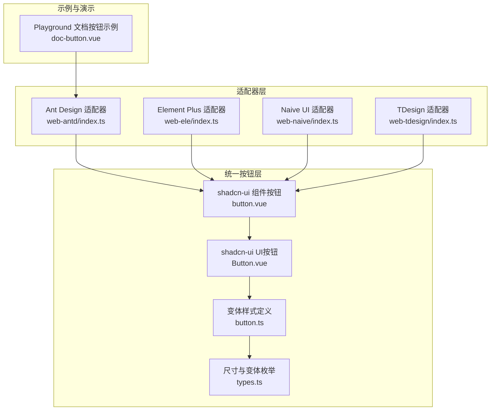
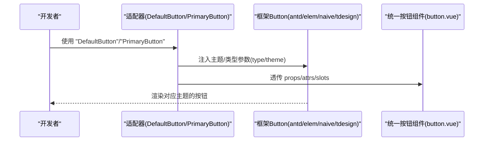
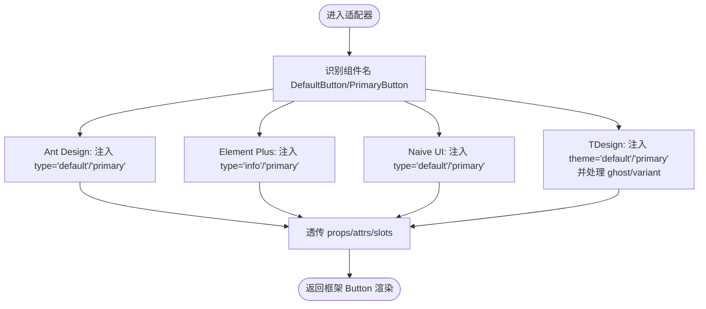
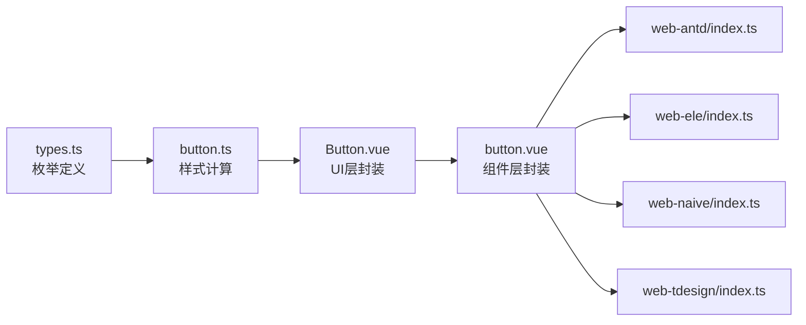

# 按钮变体适配

<cite>
**本文引用的文件**
- [packages/@core/ui-kit/shadcn-ui/src/components/button/button.vue](file://packages/@core/ui-kit/shadcn-ui/src/components/button/button.vue)
- [packages/@core/ui-kit/shadcn-ui/src/components/button/button.ts](file://packages/@core/ui-kit/shadcn-ui/src/components/button/button.ts)
- [packages/@core/ui-kit/shadcn-ui/src/ui/button/Button.vue](file://packages/@core/ui-kit/shadcn-ui/src/ui/button/Button.vue)
- [packages/@core/ui-kit/shadcn-ui/src/ui/button/button.ts](file://packages/@core/ui-kit/shadcn-ui/src/ui/button/button.ts)
- [packages/@core/ui-kit/shadcn-ui/src/ui/button/types.ts](file://packages/@core/ui-kit/shadcn-ui/src/ui/button/types.ts)
- [apps/web-antd/src/adapter/component/index.ts](file://apps/web-antd/src/adapter/component/index.ts)
- [apps/web-ele/src/adapter/component/index.ts](file://apps/web-ele/src/adapter/component/index.ts)
- [apps/web-naive/src/adapter/component/index.ts](file://apps/web-naive/src/adapter/component/index.ts)
- [apps/web-tdesign/src/adapter/component/index.ts](file://apps/web-tdesign/src/adapter/component/index.ts)
- [playground/src/views/examples/doc-button.vue](file://playground/src/views/examples/doc-button.vue)
</cite>

## 目录
1. [简介](#简介)
2. [项目结构](#项目结构)
3. [核心组件](#核心组件)
4. [架构总览](#架构总览)
5. [详细组件分析](#详细组件分析)
6. [依赖分析](#依赖分析)
7. [性能考虑](#性能考虑)
8. [故障排查指南](#故障排查指南)
9. [结论](#结论)
10. [附录](#附录)

## 简介
本文件聚焦“按钮变体适配”的技术实现，系统性阐述在多UI框架（Ant Design、Element Plus、Naive UI、TDesign）中，如何通过高阶组件（HOC）统一暴露 DefaultButton 与 PrimaryButton 两种按钮变体，并说明其属性继承、事件冒泡与插槽透传机制。同时给出样式定制策略、跨框架一致性保障、使用指南与最佳实践，帮助开发者在不同UI生态中保持一致的外观与行为。

## 项目结构
围绕按钮变体适配的关键位置如下：
- 统一的按钮基础组件与变体样式：位于 shadcn-ui 的组件层与 UI 层
- 各UI框架的适配器：在各应用适配目录中，通过高阶组件映射 DefaultButton/PrimaryButton 到对应框架的 Button 组件
- 示例与演示：在 Playground 中提供按钮使用示例

图表来源
- [packages/@core/ui-kit/shadcn-ui/src/components/button/button.vue:1-43](file://packages/@core/ui-kit/shadcn-ui/src/components/button/button.vue#L1-L43)
- [packages/@core/ui-kit/shadcn-ui/src/ui/button/Button.vue:1-33](file://packages/@core/ui-kit/shadcn-ui/src/ui/button/Button.vue#L1-L33)
- [packages/@core/ui-kit/shadcn-ui/src/ui/button/button.ts:1-35](file://packages/@core/ui-kit/shadcn-ui/src/ui/button/button.ts#L1-L35)
- [packages/@core/ui-kit/shadcn-ui/src/ui/button/types.ts:1-21](file://packages/@core/ui-kit/shadcn-ui/src/ui/button/types.ts#L1-L21)
- [apps/web-antd/src/adapter/component/index.ts:503-575](file://apps/web-antd/src/adapter/component/index.ts#L503-L575)
- [apps/web-ele/src/adapter/component/index.ts:227-234](file://apps/web-ele/src/adapter/component/index.ts#L227-L234)
- [apps/web-naive/src/adapter/component/index.ts:172-179](file://apps/web-naive/src/adapter/component/index.ts#L172-L179)
- [apps/web-tdesign/src/adapter/component/index.ts:166-193](file://apps/web-tdesign/src/adapter/component/index.ts#L166-L193)
- [playground/src/views/examples/doc-button.vue:1-23](file://playground/src/views/examples/doc-button.vue#L1-L23)

章节来源
- [packages/@core/ui-kit/shadcn-ui/src/components/button/button.vue:1-43](file://packages/@core/ui-kit/shadcn-ui/src/components/button/button.vue#L1-L43)
- [packages/@core/ui-kit/shadcn-ui/src/ui/button/Button.vue:1-33](file://packages/@core/ui-kit/shadcn-ui/src/ui/button/Button.vue#L1-L33)
- [apps/web-antd/src/adapter/component/index.ts:503-575](file://apps/web-antd/src/adapter/component/index.ts#L503-L575)
- [apps/web-ele/src/adapter/component/index.ts:227-234](file://apps/web-ele/src/adapter/component/index.ts#L227-L234)
- [apps/web-naive/src/adapter/component/index.ts:172-179](file://apps/web-naive/src/adapter/component/index.ts#L172-L179)
- [apps/web-tdesign/src/adapter/component/index.ts:166-193](file://apps/web-tdesign/src/adapter/component/index.ts#L166-L193)

## 核心组件
- 统一按钮组件（支持变体与尺寸）
  - 组件：提供 variant、size、loading、disabled、as/asChild 等属性，内部组合 Primitive 元素与样式计算函数
  - 类型：定义 VbenButtonProps 接口，约束属性与可选值
- UI 按钮（最小化封装）
  - 组件：仅负责接收 PrimitiveProps 并应用 buttonVariants
  - 类型：导出 ButtonVariants 与 ButtonVariantSize 枚举
- 适配器（高阶组件）
  - 在各框架中，通过 HOC 将 DefaultButton/PrimaryButton 映射到对应框架的 Button，并注入主题/类型参数

章节来源
- [packages/@core/ui-kit/shadcn-ui/src/components/button/button.vue:1-43](file://packages/@core/ui-kit/shadcn-ui/src/components/button/button.vue#L1-L43)
- [packages/@core/ui-kit/shadcn-ui/src/components/button/button.ts:7-24](file://packages/@core/ui-kit/shadcn-ui/src/components/button/button.ts#L7-L24)
- [packages/@core/ui-kit/shadcn-ui/src/ui/button/Button.vue:1-33](file://packages/@core/ui-kit/shadcn-ui/src/ui/button/Button.vue#L1-L33)
- [packages/@core/ui-kit/shadcn-ui/src/ui/button/button.ts:1-35](file://packages/@core/ui-kit/shadcn-ui/src/ui/button/button.ts#L1-L35)
- [packages/@core/ui-kit/shadcn-ui/src/ui/button/types.ts:1-21](file://packages/@core/ui-kit/shadcn-ui/src/ui/button/types.ts#L1-L21)

## 架构总览
多UI框架通过统一的高阶组件接口，将 DefaultButton/PrimaryButton 语义映射到各自框架的 Button 主题/类型参数上，从而在不改变调用方式的前提下，实现跨框架的一致体验。

图表来源
- [apps/web-antd/src/adapter/component/index.ts:558-575](file://apps/web-antd/src/adapter/component/index.ts#L558-L575)
- [apps/web-ele/src/adapter/component/index.ts:227-234](file://apps/web-ele/src/adapter/component/index.ts#L227-L234)
- [apps/web-naive/src/adapter/component/index.ts:172-179](file://apps/web-naive/src/adapter/component/index.ts#L172-L179)
- [apps/web-tdesign/src/adapter/component/index.ts:166-193](file://apps/web-tdesign/src/adapter/component/index.ts#L166-L193)
- [packages/@core/ui-kit/shadcn-ui/src/components/button/button.vue:1-43](file://packages/@core/ui-kit/shadcn-ui/src/components/button/button.vue#L1-L43)

## 详细组件分析

### 统一按钮组件（button.vue）
- 职责
  - 接收 variant/size/loading/disabled/as/asChild/class 等属性
  - 计算禁用态（disabled 或 loading）
  - 应用 buttonVariants 计算出的类名
  - 透传插槽内容
- 关键点
  - 使用 Primitive 作为底层渲染元素，支持 as/asChild 组合
  - loading 时显示加载指示器
  - 类名合并通过 cn 工具函数实现

章节来源
- [packages/@core/ui-kit/shadcn-ui/src/components/button/button.vue:1-43](file://packages/@core/ui-kit/shadcn-ui/src/components/button/button.vue#L1-L43)

### 统一按钮类型与变体（button.ts、types.ts）
- VbenButtonProps
  - 支持 as/asChild、禁用、加载、尺寸、变体等
- ButtonVariants/ButtonVariantSize
  - 定义可用的变体与尺寸集合，保证跨框架一致性

章节来源
- [packages/@core/ui-kit/shadcn-ui/src/components/button/button.ts:7-24](file://packages/@core/ui-kit/shadcn-ui/src/components/button/button.ts#L7-L24)
- [packages/@core/ui-kit/shadcn-ui/src/ui/button/types.ts:1-21](file://packages/@core/ui-kit/shadcn-ui/src/ui/button/types.ts#L1-L21)

### UI 按钮（Button.vue）
- 职责
  - 最小化封装，直接应用 buttonVariants
  - 适合在各框架中作为“原生”按钮使用
- 关系
  - 与统一组件 button.vue 共享样式计算逻辑

章节来源
- [packages/@core/ui-kit/shadcn-ui/src/ui/button/Button.vue:1-33](file://packages/@core/ui-kit/shadcn-ui/src/ui/button/Button.vue#L1-L33)
- [packages/@core/ui-kit/shadcn-ui/src/ui/button/button.ts:1-35](file://packages/@core/ui-kit/shadcn-ui/src/ui/button/button.ts#L1-L35)

### 高阶组件：DefaultButton 与 PrimaryButton
- Ant Design
  - DefaultButton -> type='default'
  - PrimaryButton -> type='primary'
- Element Plus
  - DefaultButton -> type='info'
  - PrimaryButton -> type='primary'
- Naive UI
  - DefaultButton -> type='default'
  - PrimaryButton -> type='primary'
- TDesign
  - DefaultButton -> theme='default'
  - PrimaryButton -> theme='primary'（含 ghost/variant 映射）

图表来源
- [apps/web-antd/src/adapter/component/index.ts:558-575](file://apps/web-antd/src/adapter/component/index.ts#L558-L575)
- [apps/web-ele/src/adapter/component/index.ts:227-234](file://apps/web-ele/src/adapter/component/index.ts#L227-L234)
- [apps/web-naive/src/adapter/component/index.ts:172-179](file://apps/web-naive/src/adapter/component/index.ts#L172-L179)
- [apps/web-tdesign/src/adapter/component/index.ts:166-193](file://apps/web-tdesign/src/adapter/component/index.ts#L166-L193)

章节来源
- [apps/web-antd/src/adapter/component/index.ts:503-575](file://apps/web-antd/src/adapter/component/index.ts#L503-L575)
- [apps/web-ele/src/adapter/component/index.ts:227-234](file://apps/web-ele/src/adapter/component/index.ts#L227-L234)
- [apps/web-naive/src/adapter/component/index.ts:172-179](file://apps/web-naive/src/adapter/component/index.ts#L172-L179)
- [apps/web-tdesign/src/adapter/component/index.ts:166-193](file://apps/web-tdesign/src/adapter/component/index.ts#L166-L193)

### 属性继承、事件冒泡与插槽透传机制
- 属性继承
  - 适配器通过解构 props/attrs，将用户传入的属性与框架所需参数合并后传给目标 Button
- 插槽透传
  - 适配器直接将 slots 透传给目标 Button，保证默认插槽与具名插槽均可用
- 事件冒泡
  - 事件由目标 Button 触发，再由上层组件或框架处理；适配器不拦截默认事件流

章节来源
- [apps/web-antd/src/adapter/component/index.ts:558-575](file://apps/web-antd/src/adapter/component/index.ts#L558-L575)
- [apps/web-ele/src/adapter/component/index.ts:227-234](file://apps/web-ele/src/adapter/component/index.ts#L227-L234)
- [apps/web-naive/src/adapter/component/index.ts:172-179](file://apps/web-naive/src/adapter/component/index.ts#L172-L179)
- [apps/web-tdesign/src/adapter/component/index.ts:166-193](file://apps/web-tdesign/src/adapter/component/index.ts#L166-L193)

### 样式定制策略
- 统一入口
  - 使用 buttonVariants 计算类名，确保尺寸与变体的样式一致性
- 尺寸与变体
  - 通过 ButtonVariantSize 与 ButtonVariants 枚举约束，避免无效值导致的样式异常
- 框架差异
  - TDesign 的 PrimaryButton 会将 variant/ghost 映射为框架支持的主题参数，确保视觉一致
- 自定义扩展
  - 可在业务层基于统一按钮组件二次封装，新增业务变体或覆盖样式

章节来源
- [packages/@core/ui-kit/shadcn-ui/src/ui/button/button.ts:1-35](file://packages/@core/ui-kit/shadcn-ui/src/ui/button/button.ts#L1-L35)
- [packages/@core/ui-kit/shadcn-ui/src/ui/button/types.ts:1-21](file://packages/@core/ui-kit/shadcn-ui/src/ui/button/types.ts#L1-L21)
- [apps/web-tdesign/src/adapter/component/index.ts:180-193](file://apps/web-tdesign/src/adapter/component/index.ts#L180-L193)

### 使用指南
- 组件类型选择
  - 默认按钮：DefaultButton（语义明确，适合次要操作）
  - 主要按钮：PrimaryButton（强调主操作）
- 尺寸配置
  - 通过 size 属性选择 default/lg/sm/xs 等尺寸
- 状态管理
  - 使用 disabled 控制禁用态；loading 控制加载态（自动禁用）
- 插槽与图标
  - 支持默认插槽；可在框架层面配合图标组件使用
- 示例参考
  - Playground 中的文档按钮示例展示了如何在业务场景中使用框架按钮（可对照理解适配器的透传行为）

章节来源
- [packages/@core/ui-kit/shadcn-ui/src/components/button/button.vue:15-26](file://packages/@core/ui-kit/shadcn-ui/src/components/button/button.vue#L15-L26)
- [playground/src/views/examples/doc-button.vue:1-23](file://playground/src/views/examples/doc-button.vue#L1-L23)

## 依赖分析
- 组件耦合
  - 适配器对框架 Button 的依赖是单向的，统一按钮组件不依赖具体框架
- 变体与尺寸
  - 通过 types.ts 与 button.ts 的枚举与计算函数，形成稳定的契约
- 可能的循环依赖
  - 当前结构清晰，无明显循环依赖风险

图表来源
- [packages/@core/ui-kit/shadcn-ui/src/ui/button/types.ts:1-21](file://packages/@core/ui-kit/shadcn-ui/src/ui/button/types.ts#L1-L21)
- [packages/@core/ui-kit/shadcn-ui/src/ui/button/button.ts:1-35](file://packages/@core/ui-kit/shadcn-ui/src/ui/button/button.ts#L1-L35)
- [packages/@core/ui-kit/shadcn-ui/src/ui/button/Button.vue:1-33](file://packages/@core/ui-kit/shadcn-ui/src/ui/button/Button.vue#L1-L33)
- [packages/@core/ui-kit/shadcn-ui/src/components/button/button.vue:1-43](file://packages/@core/ui-kit/shadcn-ui/src/components/button/button.vue#L1-L43)
- [apps/web-antd/src/adapter/component/index.ts:558-575](file://apps/web-antd/src/adapter/component/index.ts#L558-L575)
- [apps/web-ele/src/adapter/component/index.ts:227-234](file://apps/web-ele/src/adapter/component/index.ts#L227-L234)
- [apps/web-naive/src/adapter/component/index.ts:172-179](file://apps/web-naive/src/adapter/component/index.ts#L172-L179)
- [apps/web-tdesign/src/adapter/component/index.ts:166-193](file://apps/web-tdesign/src/adapter/component/index.ts#L166-L193)

## 性能考虑
- 异步组件加载
  - 适配器中对框架组件采用异步加载，降低首屏包体
- 渲染最小化
  - UI 按钮仅做样式透传，避免多余逻辑开销
- 属性合并
  - 通过透传减少中间层渲染节点，提升渲染效率

## 故障排查指南
- 按钮未生效或样式异常
  - 检查是否正确使用 DefaultButton/PrimaryButton
  - 确认框架版本与适配器映射是否匹配
- 禁用/加载状态不生效
  - 确保传入 disabled/ loading 属性；注意 loading 会自动禁用
- 插槽内容未显示
  - 确认插槽名称与框架要求一致；检查适配器是否透传 slots
- 主题不一致
  - TDesign 的 PrimaryButton 会进行 ghost/variant 映射，确认传参是否符合预期

章节来源
- [packages/@core/ui-kit/shadcn-ui/src/components/button/button.vue:24-26](file://packages/@core/ui-kit/shadcn-ui/src/components/button/button.vue#L24-L26)
- [apps/web-tdesign/src/adapter/component/index.ts:180-193](file://apps/web-tdesign/src/adapter/component/index.ts#L180-L193)

## 结论
通过统一的按钮组件与高阶组件适配，项目在多UI框架中实现了“DefaultButton/PrimaryButton”的一致语义与行为。借助枚举约束与样式计算函数，既保证了跨框架一致性，又为后续扩展提供了稳定契约。建议在业务层基于统一组件进行二次封装，以满足更复杂的样式与交互需求。

## 附录
- 实际使用示例路径
  - Playground 文档按钮示例：[playground/src/views/examples/doc-button.vue:1-23](file://playground/src/views/examples/doc-button.vue#L1-L23)
- 适配器映射参考
  - Ant Design：[apps/web-antd/src/adapter/component/index.ts:558-575](file://apps/web-antd/src/adapter/component/index.ts#L558-L575)
  - Element Plus：[apps/web-ele/src/adapter/component/index.ts:227-234](file://apps/web-ele/src/adapter/component/index.ts#L227-L234)
  - Naive UI：[apps/web-naive/src/adapter/component/index.ts:172-179](file://apps/web-naive/src/adapter/component/index.ts#L172-L179)
  - TDesign：[apps/web-tdesign/src/adapter/component/index.ts:166-193](file://apps/web-tdesign/src/adapter/component/index.ts#L166-L193)
- 统一组件与样式
  - 组件：[packages/@core/ui-kit/shadcn-ui/src/components/button/button.vue:1-43](file://packages/@core/ui-kit/shadcn-ui/src/components/button/button.vue#L1-L43)
  - 类型与样式：[packages/@core/ui-kit/shadcn-ui/src/ui/button/button.ts:1-35](file://packages/@core/ui-kit/shadcn-ui/src/ui/button/button.ts#L1-L35)、[packages/@core/ui-kit/shadcn-ui/src/ui/button/types.ts:1-21](file://packages/@core/ui-kit/shadcn-ui/src/ui/button/types.ts#L1-L21)