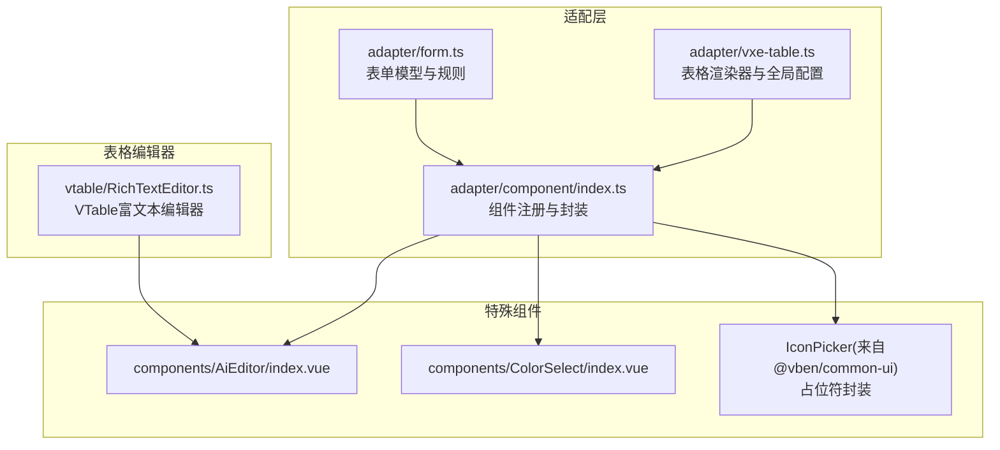
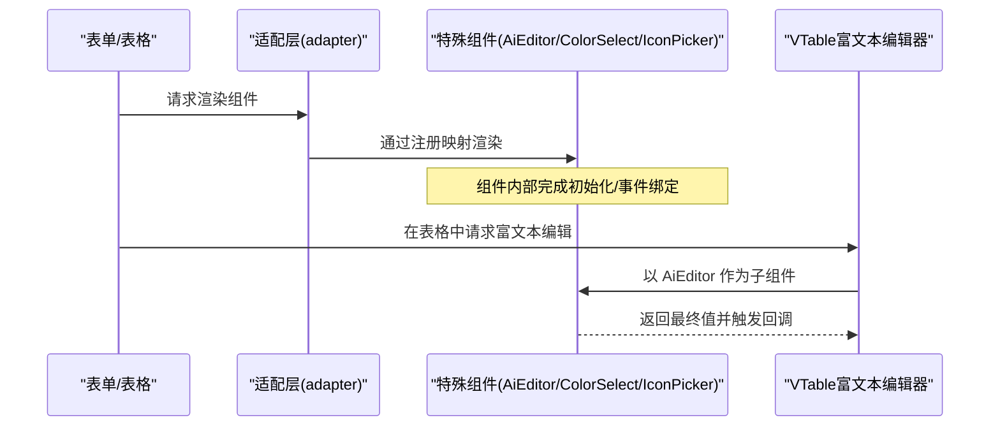
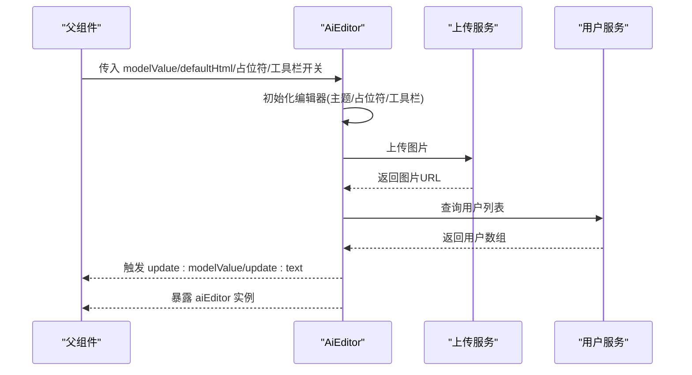
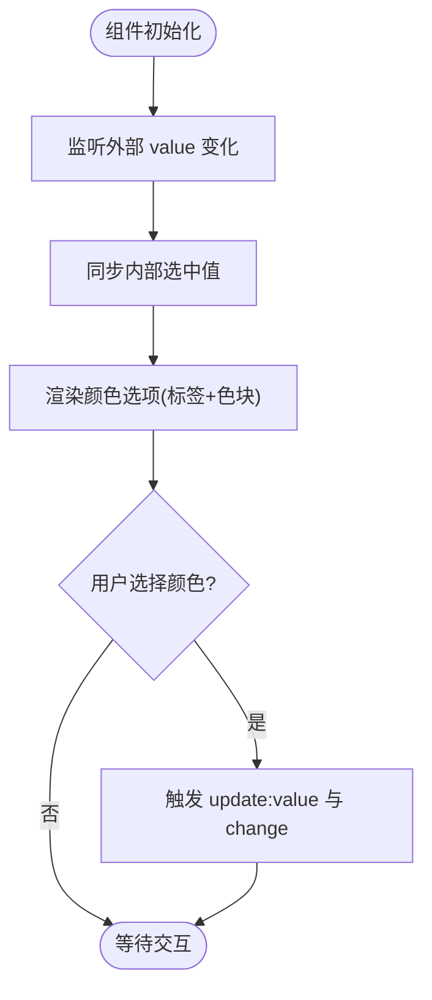
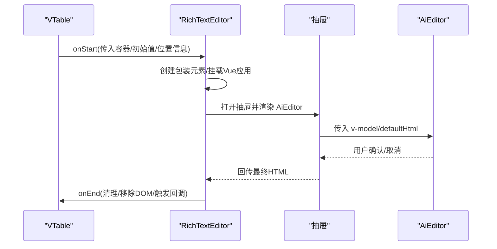
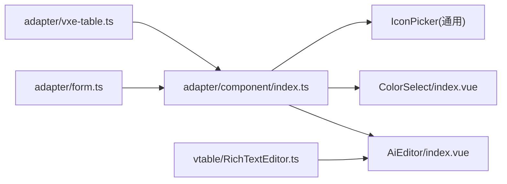

# 特殊组件适配

<cite>
**本文引用的文件**
- [AiEditor/index.vue](file://apps/web-antd/src/components/AiEditor/index.vue)
- [ColorSelect/index.vue](file://apps/web-antd/src/components/ColorSelect/index.vue)
- [adapter/component/index.ts](file://apps/web-antd/src/adapter/component/index.ts)
- [adapter/form.ts](file://apps/web-antd/src/adapter/form.ts)
- [adapter/vxe-table.ts](file://apps/web-antd/src/adapter/vxe-table.ts)
- [vtable/RichTextEditor.ts](file://apps/web-antd/src/vtable/RichTextEditor.ts)
- [CommonPhrase/index.vue](file://apps/web-antd/src/components/CommonPhrase/index.vue)
</cite>

## 目录
1. [简介](#简介)
2. [项目结构](#项目结构)
3. [核心组件](#核心组件)
4. [架构总览](#架构总览)
5. [详细组件分析](#详细组件分析)
6. [依赖关系分析](#依赖关系分析)
7. [性能考量](#性能考量)
8. [故障排查指南](#故障排查指南)
9. [结论](#结论)
10. [附录](#附录)

## 简介
本文件聚焦于特殊组件的适配与集成实践，围绕以下三类组件展开：
- AiEditor：富文本编辑器组件，集成第三方编辑器并在项目中以统一表单/表格/抽屉方式复用。
- ColorSelect：颜色选择器组件，基于 UI 框架的选择器封装，提供颜色值与标签映射。
- IconPicker：图标选择器组件，作为通用组件在适配层中注册，支持占位符与输入插槽。

文档将系统阐述组件的封装模式、事件与状态管理、与 UI 框架的适配关系，并给出在不同 UI 框架下的适配策略与最佳实践。

## 项目结构
本项目采用多 UI 框架适配方案，核心适配层位于 web-antd 应用中，通过统一的组件注册与表单/表格适配器，将通用组件映射到具体 UI 框架（如 Ant Design Vue）。特殊组件（AiEditor、ColorSelect、IconPicker）均在适配层集中注册，并在表单与表格场景中统一使用。

图表来源
- [adapter/component/index.ts:526-608](file://apps/web-antd/src/adapter/component/index.ts#L526-L608)
- [adapter/form.ts:11-42](file://apps/web-antd/src/adapter/form.ts#L11-L42)
- [adapter/vxe-table.ts:34-104](file://apps/web-antd/src/adapter/vxe-table.ts#L34-L104)
- [vtable/RichTextEditor.ts:27-265](file://apps/web-antd/src/vtable/RichTextEditor.ts#L27-L265)

章节来源
- [adapter/component/index.ts:526-608](file://apps/web-antd/src/adapter/component/index.ts#L526-L608)
- [adapter/form.ts:11-42](file://apps/web-antd/src/adapter/form.ts#L11-L42)
- [adapter/vxe-table.ts:34-104](file://apps/web-antd/src/adapter/vxe-table.ts#L34-L104)
- [vtable/RichTextEditor.ts:27-265](file://apps/web-antd/src/vtable/RichTextEditor.ts#L27-L265)

## 核心组件
- AiEditor：基于第三方富文本编辑器的 Vue 组件，负责初始化、内容同步、占位符、工具栏、图片上传、提及用户等功能。
- ColorSelect：基于 UI 框架选择器的颜色选择器，提供颜色值与标签映射，支持双向绑定与变更事件。
- IconPicker：通用图标选择器组件，通过占位符封装统一到表单/表格场景。

章节来源
- [AiEditor/index.vue:1-153](file://apps/web-antd/src/components/AiEditor/index.vue#L1-L153)
- [ColorSelect/index.vue:1-76](file://apps/web-antd/src/components/ColorSelect/index.vue#L1-L76)
- [adapter/component/index.ts:563-567](file://apps/web-antd/src/adapter/component/index.ts#L563-L567)

## 架构总览
适配层通过统一注册机制将特殊组件映射到 UI 框架组件，并在表单与表格场景中按需使用。AiEditor 在表格中通过自定义编辑器类接入 VTable；在表单中通过组件注册与占位符封装统一使用。

图表来源
- [adapter/component/index.ts:526-608](file://apps/web-antd/src/adapter/component/index.ts#L526-L608)
- [vtable/RichTextEditor.ts:196-245](file://apps/web-antd/src/vtable/RichTextEditor.ts#L196-L245)

章节来源
- [adapter/component/index.ts:526-608](file://apps/web-antd/src/adapter/component/index.ts#L526-L608)
- [vtable/RichTextEditor.ts:196-245](file://apps/web-antd/src/vtable/RichTextEditor.ts#L196-L245)

## 详细组件分析

### AiEditor 组件
- 功能要点
  - 基于第三方富文本编辑器初始化，支持占位符、主题、工具栏、图片上传、提及用户查询、文本计数等。
  - 通过 v-model 双向绑定 HTML 内容，同时提供文本内容更新事件。
  - 生命周期内正确挂载与销毁，避免内存泄漏。
  - 与 UI 主题联动，动态切换明暗主题。
- 适配策略
  - 在适配层注册为通用组件类型，统一在表单/表格中使用。
  - 在 VTable 中通过自定义编辑器类注入 AiEditor，实现单元格内富文本编辑。
- 事件与状态
  - 通过 update:modelValue 与 update:text 向外暴露内容变化。
  - 监听外部 modelValue 变化，保持与外部状态同步。
- 图片上传与提及
  - 提供图片上传器，对接后端上传接口，返回标准结构。
  - 提供提及用户查询，将用户列表转换为编辑器可识别的格式。

图表来源
- [AiEditor/index.vue:36-114](file://apps/web-antd/src/components/AiEditor/index.vue#L36-L114)
- [AiEditor/index.vue:131-139](file://apps/web-antd/src/components/AiEditor/index.vue#L131-L139)

章节来源
- [AiEditor/index.vue:1-153](file://apps/web-antd/src/components/AiEditor/index.vue#L1-L153)
- [adapter/component/index.ts:587-588](file://apps/web-antd/src/adapter/component/index.ts#L587-L588)
- [vtable/RichTextEditor.ts:196-245](file://apps/web-antd/src/vtable/RichTextEditor.ts#L196-L245)

### ColorSelect 组件
- 功能要点
  - 基于 UI 框架选择器，提供一组预设颜色选项（含中文标签与值）。
  - 支持 v-model 双向绑定与 change 事件。
  - 内部使用 ref 管理选中值，监听外部 value 变化以保持同步。
- 适配策略
  - 在适配层注册为通用组件类型，统一在表单/表格中使用。
  - 通过占位符封装，自动注入默认占位提示。
- 事件与状态
  - 触发 update:value 与 change 事件，便于上层监听与联动。

图表来源
- [ColorSelect/index.vue:37-72](file://apps/web-antd/src/components/ColorSelect/index.vue#L37-L72)

章节来源
- [ColorSelect/index.vue:1-76](file://apps/web-antd/src/components/ColorSelect/index.vue#L1-L76)
- [adapter/component/index.ts:588](file://apps/web-antd/src/adapter/component/index.ts#L588)

### IconPicker 组件
- 功能要点
  - 作为通用图标选择器，提供图标库选择与搜索能力。
  - 通过占位符封装，自动注入默认占位提示与输入插槽。
- 适配策略
  - 在适配层注册为通用组件类型，统一在表单/表格中使用。
  - 通过 inputComponent 与 addonAfter 插槽增强交互体验。

章节来源
- [adapter/component/index.ts:563-567](file://apps/web-antd/src/adapter/component/index.ts#L563-L567)

### VTable 富文本编辑器集成
- 功能要点
  - 自定义实现 IEditor 接口，基于 AiEditor 在抽屉中提供富文本编辑体验。
  - 通过 createApp 挂载 AiEditor，调整位置与尺寸，支持确认/取消流程。
  - 在单元格结束编辑时，回传最终 HTML 值并触发表格回调。
- 适配策略
  - 将 AiEditor 作为子组件注入，统一在表格场景中使用富文本编辑能力。

图表来源
- [vtable/RichTextEditor.ts:123-144](file://apps/web-antd/src/vtable/RichTextEditor.ts#L123-L144)
- [vtable/RichTextEditor.ts:205-216](file://apps/web-antd/src/vtable/RichTextEditor.ts#L205-L216)
- [vtable/RichTextEditor.ts:104-115](file://apps/web-antd/src/vtable/RichTextEditor.ts#L104-L115)

章节来源
- [vtable/RichTextEditor.ts:27-265](file://apps/web-antd/src/vtable/RichTextEditor.ts#L27-L265)

## 依赖关系分析
- 组件注册与封装
  - 适配层集中注册 AiEditor、ColorSelect、IconPicker 等组件，并通过占位符封装统一行为。
  - 组件类型在适配层定义，供表单/表格/抽屉等场景复用。
- 表单与表格适配
  - 表单适配器定义 v-model 映射与校验规则，保证各 UI 框架组件一致性。
  - 表格适配器注册单元格渲染器与全局配置，支持复杂列渲染与操作按钮。
- 第三方编辑器集成
  - VTable 富文本编辑器通过自定义 IEditor 实现，内部复用 AiEditor 组件。

图表来源
- [adapter/component/index.ts:526-608](file://apps/web-antd/src/adapter/component/index.ts#L526-L608)
- [adapter/form.ts:11-42](file://apps/web-antd/src/adapter/form.ts#L11-L42)
- [adapter/vxe-table.ts:34-104](file://apps/web-antd/src/adapter/vxe-table.ts#L34-L104)
- [vtable/RichTextEditor.ts:27-265](file://apps/web-antd/src/vtable/RichTextEditor.ts#L27-L265)

章节来源
- [adapter/component/index.ts:526-608](file://apps/web-antd/src/adapter/component/index.ts#L526-L608)
- [adapter/form.ts:11-42](file://apps/web-antd/src/adapter/form.ts#L11-L42)
- [adapter/vxe-table.ts:34-104](file://apps/web-antd/src/adapter/vxe-table.ts#L34-L104)
- [vtable/RichTextEditor.ts:27-265](file://apps/web-antd/src/vtable/RichTextEditor.ts#L27-L265)

## 性能考量
- 组件懒加载
  - 通过 defineAsyncComponent 异步加载大型组件（如 AiEditor、ColorSelect、IconPicker），减少首屏体积。
- 事件与状态同步
  - 使用 watch 监听外部值变化，避免不必要的重复渲染；在 AiEditor 中仅在值不一致时 setContent。
- DOM 与资源清理
  - 在组件卸载时销毁编辑器实例，避免内存泄漏；VTable 富文本编辑器在结束编辑时清理 Vue 应用与 DOM。
- 图片上传与预览
  - 上传前进行大小校验，裁剪图片时使用 URL.createObjectURL 并在关闭后及时释放。

章节来源
- [adapter/component/index.ts:95-101](file://apps/web-antd/src/adapter/component/index.ts#L95-L101)
- [AiEditor/index.vue:116-118](file://apps/web-antd/src/components/AiEditor/index.vue#L116-L118)
- [vtable/RichTextEditor.ts:176-182](file://apps/web-antd/src/vtable/RichTextEditor.ts#L176-L182)

## 故障排查指南
- AiEditor 未显示或无响应
  - 检查初始化参数（占位符、主题、工具栏、图片上传器）是否正确传入。
  - 确认父组件传入的 modelValue 与 defaultHtml 是否为空，必要时提供默认值。
  - 确认编辑器生命周期钩子（onMounted/onUnmounted）是否执行。
- 图片上传失败
  - 检查上传器返回的数据结构是否符合约定（包含 errorCode 与 data.src）。
  - 确认上传接口与鉴权头设置。
- VTable 富文本编辑器无法关闭或值未回传
  - 检查抽屉确认/取消回调是否正确触发。
  - 确认 onEnd 流程是否执行（清理 Vue 应用与 DOM）。
- ColorSelect 选中值不同步
  - 检查外部 value 是否被正确传入，watch 是否生效。
  - 确认事件触发顺序（update:value 在 change 之前）。

章节来源
- [AiEditor/index.vue:36-114](file://apps/web-antd/src/components/AiEditor/index.vue#L36-L114)
- [vtable/RichTextEditor.ts:205-216](file://apps/web-antd/src/vtable/RichTextEditor.ts#L205-L216)
- [ColorSelect/index.vue:37-72](file://apps/web-antd/src/components/ColorSelect/index.vue#L37-L72)

## 结论
通过统一的适配层，AiEditor、ColorSelect、IconPicker 等特殊组件得以在不同 UI 框架与场景中复用。适配层提供了：
- 组件注册与占位符封装，降低使用成本；
- 表单与表格的统一模型与渲染器，提升一致性；
- VTable 富文本编辑器的深度集成，满足复杂表格编辑需求。

建议在新项目中遵循该适配模式，优先封装为通用组件类型，再在适配层注册，确保跨 UI 框架的一致体验与可维护性。

## 附录
- 开发指南（面向自定义组件）
  - 封装模式
    - 使用 defineAsyncComponent 异步加载，减少首屏体积。
    - 通过 withDefaultPlaceholder 统一占位符与输入/选择器行为。
  - 事件与状态
    - 明确 v-model 映射（value/checked/fileList 等），确保与 UI 框架一致。
    - 提供 update:value 与业务事件（如 change），便于上层监听。
  - 与 UI 框架适配
    - 在适配层注册组件类型，统一在表单/表格中使用。
    - 对于复杂编辑器（如富文本），提供独立的 IEditor 实现或封装组件。
  - 示例路径
    - 组件注册与封装：[adapter/component/index.ts:526-608](file://apps/web-antd/src/adapter/component/index.ts#L526-L608)
    - 表单模型与规则：[adapter/form.ts:11-42](file://apps/web-antd/src/adapter/form.ts#L11-L42)
    - 表格渲染器与全局配置：[adapter/vxe-table.ts:34-104](file://apps/web-antd/src/adapter/vxe-table.ts#L34-L104)
    - VTable 富文本编辑器：[vtable/RichTextEditor.ts:27-265](file://apps/web-antd/src/vtable/RichTextEditor.ts#L27-L265)
    - AiEditor 组件：[AiEditor/index.vue:1-153](file://apps/web-antd/src/components/AiEditor/index.vue#L1-L153)
    - ColorSelect 组件：[ColorSelect/index.vue:1-76](file://apps/web-antd/src/components/ColorSelect/index.vue#L1-L76)
    - IconPicker 组件（占位符封装）：[adapter/component/index.ts:563-567](file://apps/web-antd/src/adapter/component/index.ts#L563-L567)
    - 常用短语组件（参考用法）：[CommonPhrase/index.vue:1-31](file://apps/web-antd/src/components/CommonPhrase/index.vue#L1-L31)