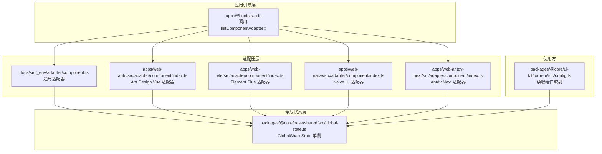
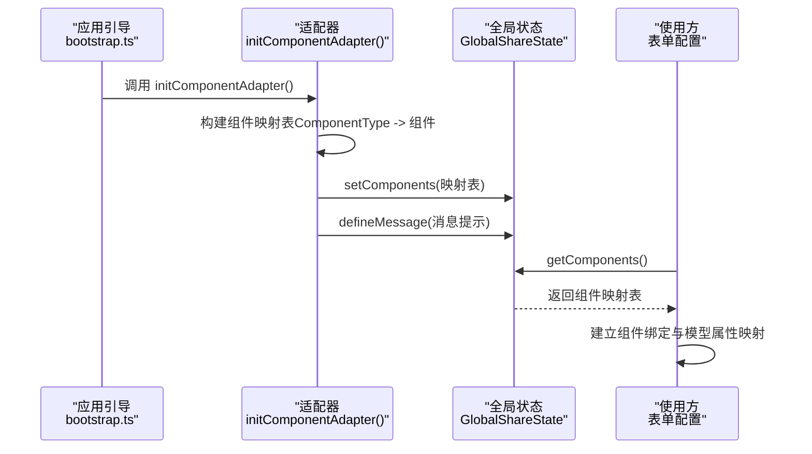
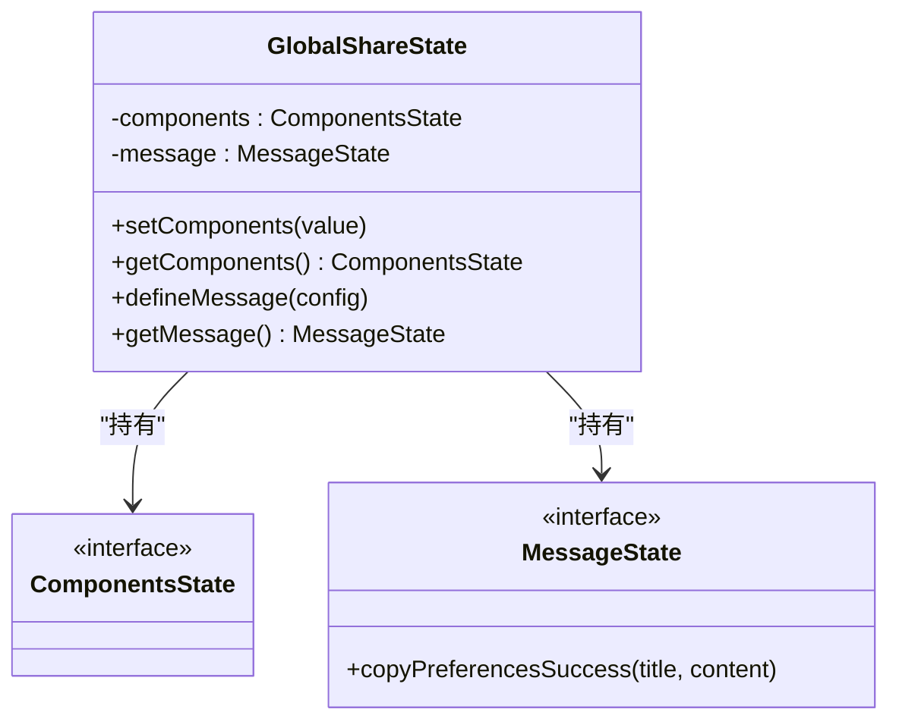
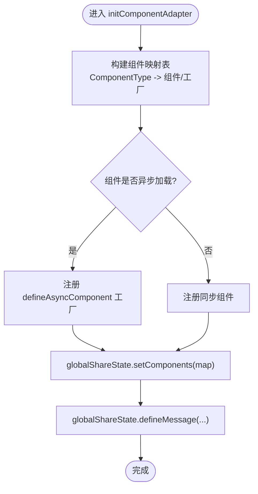
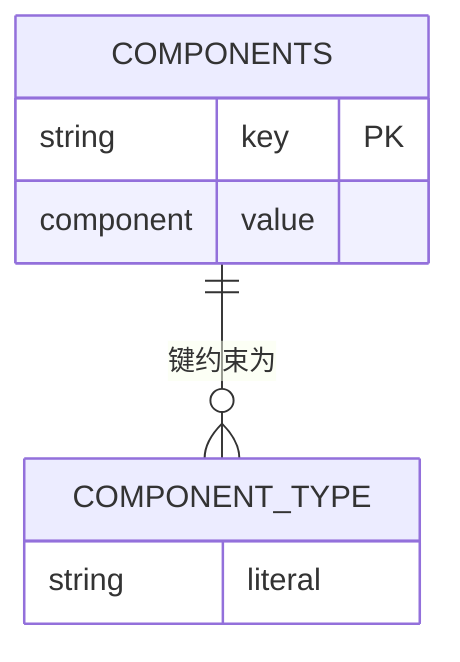
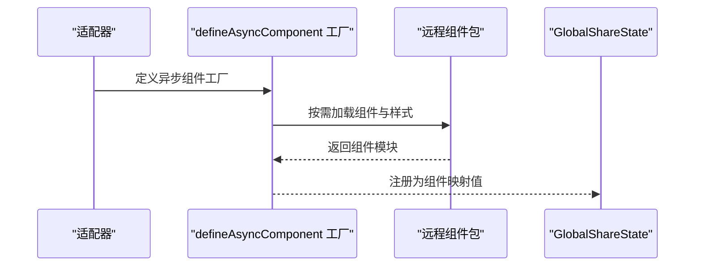
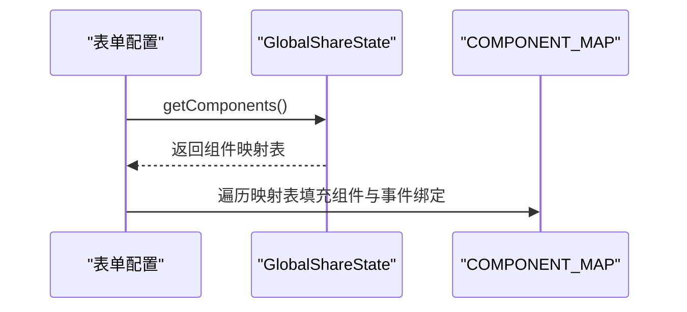
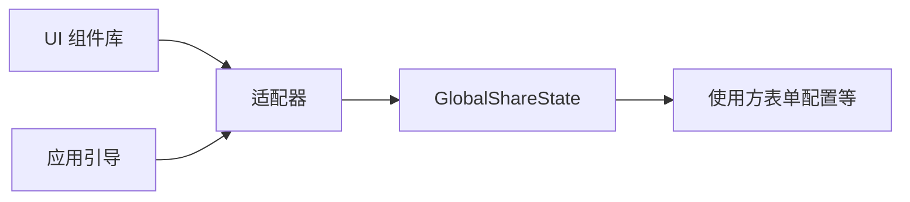

# 组件注册机制

<cite>
**本文引用的文件**
- [global-state.ts](file://packages/@core/base/shared/src/global-state.ts)
- [component.ts（通用适配器）](file://docs/src/_env/adapter/component.ts)
- [component.ts（Ant Design Vue 适配器）](file://apps/web-antd/src/adapter/component/index.ts)
- [component.ts（Element Plus 适配器）](file://apps/web-ele/src/adapter/component/index.ts)
- [component.ts（Naive UI 适配器）](file://apps/web-naive/src/adapter/component/index.ts)
- [component.ts（Antdv Next 适配器）](file://apps/web-antdv-next/src/adapter/component/index.ts)
- [config.ts（表单配置）](file://packages/@core/ui-kit/form-ui/src/config.ts)
- [bootstrap.ts（Ant Design 应用引导）](file://apps/web-antd/src/bootstrap.ts)
- [bootstrap.ts（Element Plus 应用引导）](file://apps/web-ele/src/bootstrap.ts)
- [bootstrap.ts（Naive UI 应用引导）](file://apps/web-naive/src/bootstrap.ts)
- [bootstrap.ts（Antdv Next 应用引导）](file://apps/web-antdv-next/src/bootstrap.ts)
</cite>

## 目录
1. [简介](#简介)
2. [项目结构](#项目结构)
3. [核心组件](#核心组件)
4. [架构总览](#架构总览)
5. [详细组件分析](#详细组件分析)
6. [依赖关系分析](#依赖关系分析)
7. [性能考量](#性能考量)
8. [故障排查指南](#故障排查指南)
9. [结论](#结论)
10. [附录](#附录)

## 简介
本文件系统性阐述组件注册机制，重点解析以下内容：
- globalShareState 的作用与数据结构
- initComponentAdapter 如何将适配后的组件注册到全局状态
- 组件注册的时机、注册格式与生命周期管理
- 组件映射表结构、ComponentType 类型定义与组件别名机制
- 异步组件加载策略与 defineAsyncComponent 的使用场景与性能优化
- 最佳实践：命名规范、类型安全、错误处理
- 实际示例路径：如何正确注册新组件与处理注册异常

## 项目结构
组件注册机制围绕“应用引导 → 适配器初始化 → 全局状态注册 → 使用方消费”展开。不同 UI 框架（Ant Design Vue、Element Plus、Naive UI、Antdv Next）提供各自的适配器，统一通过 globalShareState 提供组件映射。

**图表来源**
- [bootstrap.ts（Ant Design 应用引导）:20-25](file://apps/web-antd/src/bootstrap.ts#L20-L25)
- [bootstrap.ts（Element Plus 应用引导）:20-25](file://apps/web-ele/src/bootstrap.ts#L20-L25)
- [bootstrap.ts（Naive UI 应用引导）:20-25](file://apps/web-naive/src/bootstrap.ts#L20-L25)
- [bootstrap.ts（Antdv Next 应用引导）:19-24](file://apps/web-antdv-next/src/bootstrap.ts#L19-L24)
- [global-state.ts:19-45](file://packages/@core/base/shared/src/global-state.ts#L19-L45)
- [config.ts（表单配置）:72-87](file://packages/@core/ui-kit/form-ui/src/config.ts#L72-L87)

**章节来源**
- [bootstrap.ts（Ant Design 应用引导）:20-25](file://apps/web-antd/src/bootstrap.ts#L20-L25)
- [bootstrap.ts（Element Plus 应用引导）:20-25](file://apps/web-ele/src/bootstrap.ts#L20-L25)
- [bootstrap.ts（Naive UI 应用引导）:20-25](file://apps/web-naive/src/bootstrap.ts#L20-L25)
- [bootstrap.ts（Antdv Next 应用引导）:19-24](file://apps/web-antdv-next/src/bootstrap.ts#L19-L24)

## 核心组件
- GlobalShareState 单例：提供 components 与 message 的全局共享存储，并支持 setComponents 与 defineMessage。
- ComponentType 类型：约束可用组件键名集合，支持业务扩展类型 BaseFormComponentType。
- initComponentAdapter：按 UI 框架适配具体组件，构建组件映射表并写入 globalShareState。
- 使用方（如表单配置）：通过 globalShareState.getComponents() 获取映射表，建立组件绑定关系。

**章节来源**
- [global-state.ts:14-45](file://packages/@core/base/shared/src/global-state.ts#L14-L45)
- [component.ts（通用适配器）:51-74](file://docs/src/_env/adapter/component.ts#L51-L74)
- [config.ts（表单配置）:72-87](file://packages/@core/ui-kit/form-ui/src/config.ts#L72-L87)

## 架构总览
组件注册的端到端流程如下：

**图表来源**
- [bootstrap.ts（Ant Design 应用引导）:20-25](file://apps/web-antd/src/bootstrap.ts#L20-L25)
- [global-state.ts:32-42](file://packages/@core/base/shared/src/global-state.ts#L32-L42)
- [config.ts（表单配置）:72-87](file://packages/@core/ui-kit/form-ui/src/config.ts#L72-L87)

## 详细组件分析

### GlobalShareState 设计与职责
- 数据结构
  - components: 记录组件映射表，键为 ComponentType，值为 Vue 组件或异步组件工厂
  - message: 记录框架内部消息提示方法
- 关键方法
  - setComponents(value): 替换组件映射表
  - getComponents(): 读取组件映射表
  - defineMessage(config): 定义消息提示方法
- 单例模式：保证跨模块共享且不受请求上下文影响

**图表来源**
- [global-state.ts:6-45](file://packages/@core/base/shared/src/global-state.ts#L6-L45)

**章节来源**
- [global-state.ts:19-45](file://packages/@core/base/shared/src/global-state.ts#L19-L45)

### initComponentAdapter 的注册流程
- 适配器职责
  - 将 UI 框架组件包装为统一签名的组件（如带默认占位符的 Input/Select）
  - 支持异步组件工厂（defineAsyncComponent），按需加载大组件
  - 构建组件映射表并调用 globalShareState.setComponents 注册
  - 定义消息提示方法（如复制偏好设置成功提示）
- 注册时机
  - 在应用引导阶段尽早执行，确保后续使用方能立即获取组件映射
- 注册格式
  - 映射表键：ComponentType（字符串字面量联合类型）
  - 映射表值：Vue 组件或 defineAsyncComponent 工厂
- 生命周期
  - 仅在应用启动时初始化一次；后续通过 getComponents() 读取，避免重复构建

**图表来源**
- [component.ts（通用适配器）:76-126](file://docs/src/_env/adapter/component.ts#L76-L126)
- [component.ts（Ant Design Vue 适配器）:526-605](file://apps/web-antd/src/adapter/component/index.ts#L526-L605)
- [component.ts（Element Plus 适配器）:175-329](file://apps/web-ele/src/adapter/component/index.ts#L175-L329)
- [component.ts（Naive UI 适配器）:121-229](file://apps/web-naive/src/adapter/component/index.ts#L121-L229)
- [component.ts（Antdv Next 适配器）:524-601](file://apps/web-antdv-next/src/adapter/component/index.ts#L524-L601)

**章节来源**
- [component.ts（通用适配器）:76-126](file://docs/src/_env/adapter/component.ts#L76-L126)
- [component.ts（Ant Design Vue 适配器）:526-605](file://apps/web-antd/src/adapter/component/index.ts#L526-L605)
- [component.ts（Element Plus 适配器）:175-329](file://apps/web-ele/src/adapter/component/index.ts#L175-L329)
- [component.ts（Naive UI 适配器）:121-229](file://apps/web-naive/src/adapter/component/index.ts#L121-L229)
- [component.ts（Antdv Next 适配器）:524-601](file://apps/web-antdv-next/src/adapter/component/index.ts#L524-L601)

### 组件映射表与 ComponentType 类型
- 组件映射表结构
  - 键：ComponentType（字符串字面量联合类型）
  - 值：Vue 组件或 defineAsyncComponent 工厂
- ComponentType 类型定义
  - 由各 UI 框架适配器导出，覆盖常用基础组件与业务组件
  - 支持 BaseFormComponentType 扩展，便于表单等场景复用
- 组件别名机制
  - 通过映射表键名实现别名，如 DefaultButton/PrimaryButton
  - 使用方通过键名访问组件，无需关心底层实现细节

**图表来源**
- [component.ts（通用适配器）:51-74](file://docs/src/_env/adapter/component.ts#L51-L74)
- [component.ts（Ant Design Vue 适配器）:494-524](file://apps/web-antd/src/adapter/component/index.ts#L494-L524)
- [component.ts（Element Plus 适配器）:155-173](file://apps/web-ele/src/adapter/component/index.ts#L155-L173)
- [component.ts（Naive UI 适配器）:101-119](file://apps/web-naive/src/adapter/component/index.ts#L101-L119)
- [component.ts（Antdv Next 适配器）:493-522](file://apps/web-antdv-next/src/adapter/component/index.ts#L493-L522)

**章节来源**
- [component.ts（通用适配器）:51-74](file://docs/src/_env/adapter/component.ts#L51-L74)
- [component.ts（Ant Design Vue 适配器）:494-524](file://apps/web-antd/src/adapter/component/index.ts#L494-L524)
- [component.ts（Element Plus 适配器）:155-173](file://apps/web-ele/src/adapter/component/index.ts#L155-L173)
- [component.ts（Naive UI 适配器）:101-119](file://apps/web-naive/src/adapter/component/index.ts#L101-L119)
- [component.ts（Antdv Next 适配器）:493-522](file://apps/web-antdv-next/src/adapter/component/index.ts#L493-L522)

### 异步组件加载策略与 defineAsyncComponent
- 使用场景
  - 组件体积较大或非首屏必需时，采用 defineAsyncComponent 按需加载
  - 适配器中对大量 UI 组件统一使用异步加载，降低首屏包体
- 性能优化
  - 将样式与组件分离加载，减少阻塞
  - 结合路由懒加载与组件懒加载，实现分层优化
- 示例路径
  - Ant Design Vue 适配器中对多个组件使用 defineAsyncComponent
  - Element Plus 适配器对组件与样式分别引入
  - Naive UI 适配器对组件进行异步加载
  - Antdv Next 适配器对组件进行异步加载

**图表来源**
- [component.ts（Ant Design Vue 适配器）:42-89](file://apps/web-antd/src/adapter/component/index.ts#L42-L89)
- [component.ts（Element Plus 适配器）:18-119](file://apps/web-ele/src/adapter/component/index.ts#L18-L119)
- [component.ts（Naive UI 适配器）:18-65](file://apps/web-naive/src/adapter/component/index.ts#L18-L65)
- [component.ts（Antdv Next 适配器）:38-101](file://apps/web-antdv-next/src/adapter/component/index.ts#L38-L101)

**章节来源**
- [component.ts（Ant Design Vue 适配器）:42-89](file://apps/web-antd/src/adapter/component/index.ts#L42-L89)
- [component.ts（Element Plus 适配器）:18-119](file://apps/web-ele/src/adapter/component/index.ts#L18-L119)
- [component.ts（Naive UI 适配器）:18-65](file://apps/web-naive/src/adapter/component/index.ts#L18-L65)
- [component.ts（Antdv Next 适配器）:38-101](file://apps/web-antdv-next/src/adapter/component/index.ts#L38-L101)

### 使用方消费与生命周期
- 消费方式
  - 表单配置通过 globalShareState.getComponents() 获取映射表
  - 遍历映射表建立 COMPONENT_MAP 与事件绑定映射
- 生命周期
  - 注册发生在应用启动阶段（bootstrap 中调用 initComponentAdapter）
  - 使用阶段仅读取，不重复构建，保证一致性与性能

**图表来源**
- [config.ts（表单配置）:72-87](file://packages/@core/ui-kit/form-ui/src/config.ts#L72-L87)

**章节来源**
- [config.ts（表单配置）:72-87](file://packages/@core/ui-kit/form-ui/src/config.ts#L72-L87)

## 依赖关系分析
- 适配器对 UI 框架的依赖：各适配器导入对应 UI 组件库并封装为统一签名
- 适配器对 GlobalShareState 的依赖：通过 setComponents/defineMessage 写入全局状态
- 使用方对 GlobalShareState 的依赖：通过 getComponents 读取映射表
- 引导层对适配器的依赖：在 bootstrap 中优先初始化适配器

**图表来源**
- [bootstrap.ts（Ant Design 应用引导）:20-25](file://apps/web-antd/src/bootstrap.ts#L20-L25)
- [global-state.ts:32-42](file://packages/@core/base/shared/src/global-state.ts#L32-L42)
- [config.ts（表单配置）:72-87](file://packages/@core/ui-kit/form-ui/src/config.ts#L72-L87)

**章节来源**
- [bootstrap.ts（Ant Design 应用引导）:20-25](file://apps/web-antd/src/bootstrap.ts#L20-L25)
- [global-state.ts:32-42](file://packages/@core/base/shared/src/global-state.ts#L32-L42)
- [config.ts（表单配置）:72-87](file://packages/@core/ui-kit/form-ui/src/config.ts#L72-L87)

## 性能考量
- 异步加载优先：对体积较大的组件采用 defineAsyncComponent，结合样式分离加载
- 避免重复构建：组件映射表仅在启动时构建一次，使用方直接读取
- 按需注册：仅注册实际使用的组件键，减少映射表规模
- 路由与组件双懒加载：结合路由懒加载与组件懒加载，进一步降低首屏负担

[本节为通用指导，无需特定文件引用]

## 故障排查指南
- 组件未注册
  - 确认 bootstrap 中已调用 initComponentAdapter
  - 检查适配器中是否遗漏某组件键
- 组件加载失败
  - 检查 defineAsyncComponent 的导入路径与打包产物
  - 确认样式资源是否随组件一起加载
- 使用方读取不到组件
  - 确认在 initComponentAdapter 之后再调用 getComponents
  - 检查键名是否与 ComponentType 一致

**章节来源**
- [bootstrap.ts（Ant Design 应用引导）:20-25](file://apps/web-antd/src/bootstrap.ts#L20-L25)
- [component.ts（Ant Design Vue 适配器）:42-89](file://apps/web-antd/src/adapter/component/index.ts#L42-L89)
- [config.ts（表单配置）:72-87](file://packages/@core/ui-kit/form-ui/src/config.ts#L72-L87)

## 结论
组件注册机制通过 GlobalShareState 提供统一的组件映射表，适配器在应用启动阶段完成注册，使用方在运行期读取并建立绑定关系。该机制具备良好的扩展性与性能表现，配合异步加载策略可有效控制首屏体积。遵循本文最佳实践，可确保组件注册的稳定性与可维护性。

[本节为总结，无需特定文件引用]

## 附录

### 最佳实践清单
- 命名规范
  - 组件键名使用语义化名称，避免与 UI 框架内置组件冲突
  - 别名使用约定前缀（如 DefaultButton/PrimaryButton）提升可读性
- 类型安全
  - 在适配器中显式声明 ComponentType，确保键名与值类型一致
  - 使用 BaseFormComponentType 扩展，保持表单场景一致性
- 错误处理
  - 异步组件加载失败时，提供降级方案或错误提示
  - 在 handleChange 等回调中捕获用户异常，避免破坏内部状态同步
- 示例路径
  - 正确注册新组件：参考任一适配器中的组件映射表构建与 setComponents 调用
  - 处理注册异常：参考适配器中对用户回调的异常捕获与日志输出

**章节来源**
- [component.ts（通用适配器）:76-126](file://docs/src/_env/adapter/component.ts#L76-L126)
- [component.ts（Ant Design Vue 适配器）:526-605](file://apps/web-antd/src/adapter/component/index.ts#L526-L605)
- [component.ts（Element Plus 适配器）:175-329](file://apps/web-ele/src/adapter/component/index.ts#L175-L329)
- [component.ts（Naive UI 适配器）:121-229](file://apps/web-naive/src/adapter/component/index.ts#L121-L229)
- [component.ts（Antdv Next 适配器）:524-601](file://apps/web-antdv-next/src/adapter/component/index.ts#L524-L601)