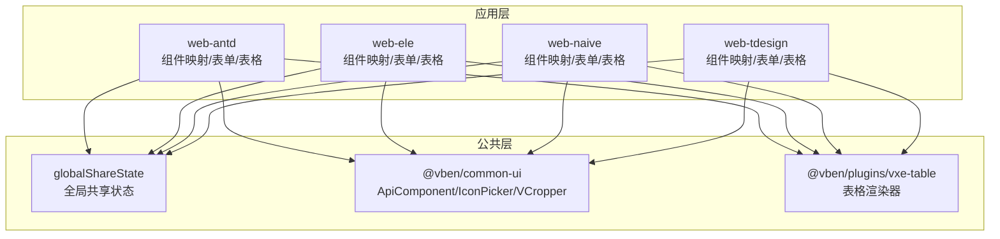
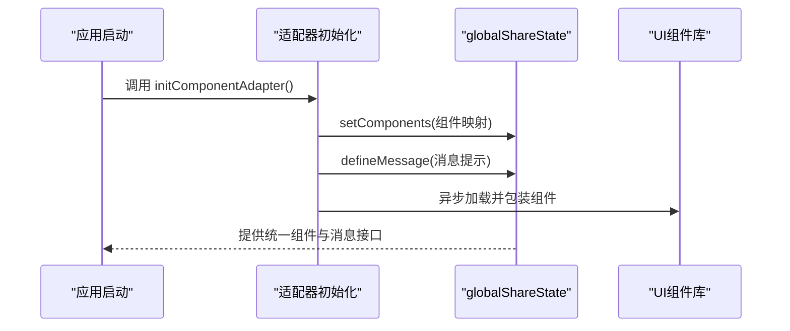
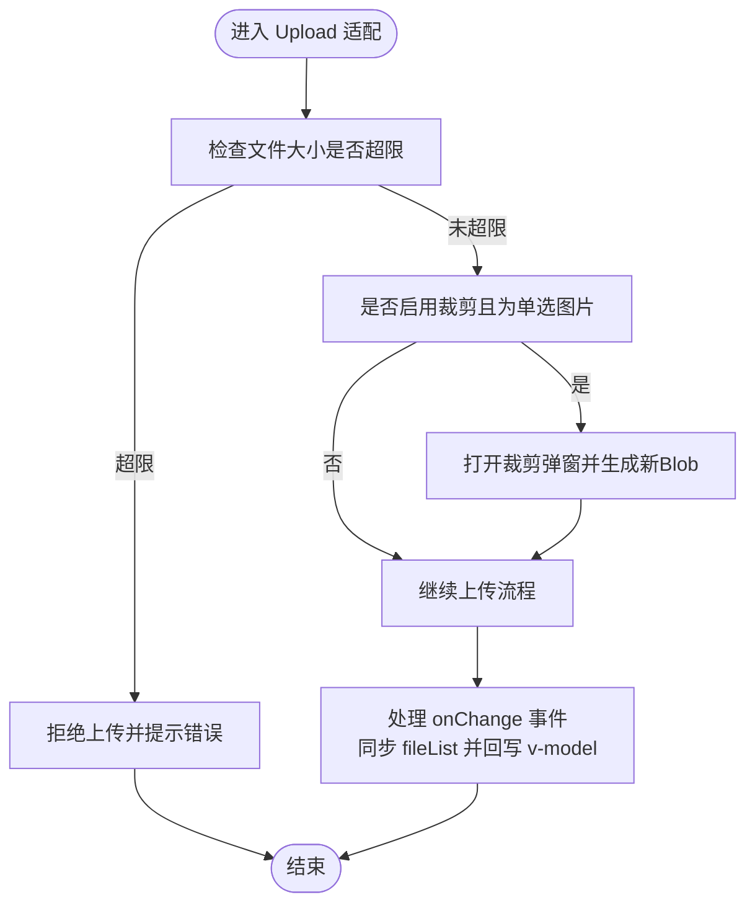
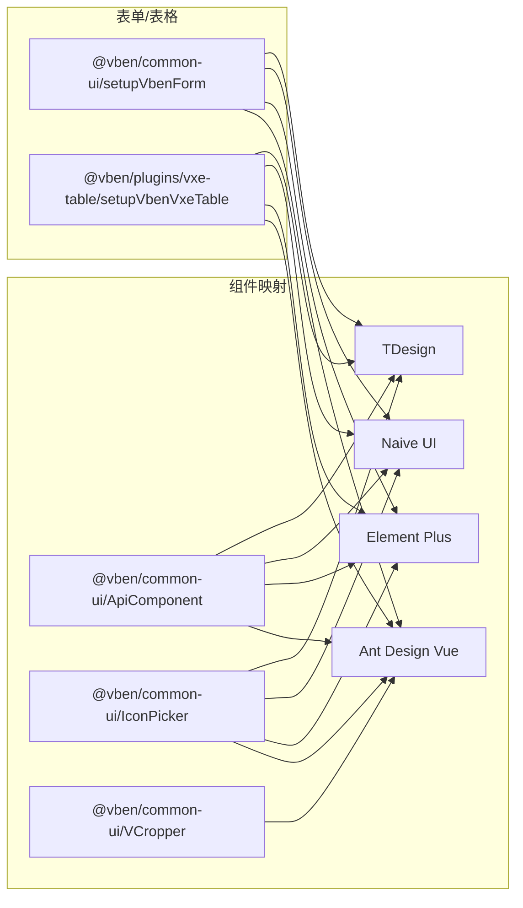

# 组件适配机制

<cite>
**本文引用的文件**
- [apps/web-antd/src/adapter/component/index.ts](file://apps/web-antd/src/adapter/component/index.ts)
- [apps/web-ele/src/adapter/component/index.ts](file://apps/web-ele/src/adapter/component/index.ts)
- [apps/web-naive/src/adapter/component/index.ts](file://apps/web-naive/src/adapter/component/index.ts)
- [apps/web-tdesign/src/adapter/component/index.ts](file://apps/web-tdesign/src/adapter/component/index.ts)
- [apps/web-antd/src/adapter/form.ts](file://apps/web-antd/src/adapter/form.ts)
- [apps/web-ele/src/adapter/form.ts](file://apps/web-ele/src/adapter/form.ts)
- [apps/web-naive/src/adapter/form.ts](file://apps/web-naive/src/adapter/form.ts)
- [apps/web-tdesign/src/adapter/form.ts](file://apps/web-tdesign/src/adapter/form.ts)
- [apps/web-antd/src/adapter/vxe-table.ts](file://apps/web-antd/src/adapter/vxe-table.ts)
- [apps/web-ele/src/adapter/vxe-table.ts](file://apps/web-ele/src/adapter/vxe-table.ts)
- [apps/web-naive/src/adapter/vxe-table.ts](file://apps/web-naive/src/adapter/vxe-table.ts)
- [apps/web-tdesign/src/adapter/vxe-table.ts](file://apps/web-tdesign/src/adapter/vxe-table.ts)
</cite>

## 目录

1. [简介](#简介)
2. [项目结构](#项目结构)
3. [核心组件](#核心组件)
4. [架构总览](#架构总览)
5. [详细组件分析](#详细组件分析)
6. [依赖分析](#依赖分析)
7. [性能考虑](#性能考虑)
8. [故障排查指南](#故障排查指南)
9. [结论](#结论)
10. [附录](#附录)

## 简介

本文件系统性阐述“组件适配机制”的设计与实现，目标是通过统一的适配层屏蔽不同 UI 框架（Ant Design Vue、Element Plus、Naive UI、TDesign）之间的差异，使上层表单、表格等能力可跨框架复用。重点覆盖：

- 适配器如何将各框架组件映射为统一的组件类型
- 组件注册流程与 globalShareState 的作用
- 属性适配策略（props 映射、事件转换、插槽处理）
- 特殊组件的适配方案（Upload 预览、ApiSelect 动态加载、IconPicker 图标选择等）
- 组件扩展指南与最佳实践
- 结合真实源码路径的实现细节与使用方法

## 项目结构

适配层位于每个应用的 adapter 目录下，按框架拆分：

- 组件映射与注册：apps/\*/src/adapter/component/index.ts
- 表单配置：apps/\*/src/adapter/form.ts
- 表格适配：apps/\*/src/adapter/vxe-table.ts

图表来源

- [apps/web-antd/src/adapter/component/index.ts:526-608](file://apps/web-antd/src/adapter/component/index.ts#L526-L608)
- [apps/web-ele/src/adapter/component/index.ts:175-332](file://apps/web-ele/src/adapter/component/index.ts#L175-L332)
- [apps/web-naive/src/adapter/component/index.ts:121-232](file://apps/web-naive/src/adapter/component/index.ts#L121-L232)
- [apps/web-tdesign/src/adapter/component/index.ts:129-230](file://apps/web-tdesign/src/adapter/component/index.ts#L129-L230)

章节来源

- [apps/web-antd/src/adapter/component/index.ts:526-608](file://apps/web-antd/src/adapter/component/index.ts#L526-L608)
- [apps/web-ele/src/adapter/component/index.ts:175-332](file://apps/web-ele/src/adapter/component/index.ts#L175-L332)
- [apps/web-naive/src/adapter/component/index.ts:121-232](file://apps/web-naive/src/adapter/component/index.ts#L121-L232)
- [apps/web-tdesign/src/adapter/component/index.ts:129-230](file://apps/web-tdesign/src/adapter/component/index.ts#L129-L230)

## 核心组件

- 组件注册与映射：在各框架的 component/index.ts 中，通过 initComponentAdapter 初始化组件映射，并调用 globalShareState.setComponents 注册到全局共享状态。
- 表单配置：各框架的 form.ts 调用 setupVbenForm，定义 baseModelPropName、modelPropNameMap、校验规则等，保证表单字段在不同框架下的 v-model 行为一致。
- 表格适配：各框架的 vxe-table.ts 通过 setupVbenVxeTable 注册单元格渲染器与表格全局配置。

章节来源

- [apps/web-antd/src/adapter/component/index.ts:526-608](file://apps/web-antd/src/adapter/component/index.ts#L526-L608)
- [apps/web-ele/src/adapter/form.ts:11-42](file://apps/web-ele/src/adapter/form.ts#L11-L42)
- [apps/web-naive/src/adapter/form.ts:11-46](file://apps/web-naive/src/adapter/form.ts#L11-L46)
- [apps/web-tdesign/src/adapter/form.ts:11-50](file://apps/web-tdesign/src/adapter/form.ts#L11-L50)
- [apps/web-antd/src/adapter/vxe-table.ts:34-104](file://apps/web-antd/src/adapter/vxe-table.ts#L34-L104)

## 架构总览

适配机制的核心在于“统一抽象 + 框架特化”：

- 统一抽象：通过 globalShareState 提供统一的组件注册与消息提示接口；通过 setupVbenForm 定义表单模型属性名与校验规则。
- 框架特化：在各框架的 component/index.ts 中，将具体 UI 组件包装为统一的 ComponentType，并注入默认占位符、事件转换、插槽处理等适配逻辑。
- 上层复用：表单、表格等上层模块仅依赖统一抽象，无需感知底层框架差异。

图表来源

- [apps/web-antd/src/adapter/component/index.ts:526-608](file://apps/web-antd/src/adapter/component/index.ts#L526-L608)
- [apps/web-ele/src/adapter/component/index.ts:175-332](file://apps/web-ele/src/adapter/component/index.ts#L175-L332)
- [apps/web-naive/src/adapter/component/index.ts:121-232](file://apps/web-naive/src/adapter/component/index.ts#L121-L232)
- [apps/web-tdesign/src/adapter/component/index.ts:129-230](file://apps/web-tdesign/src/adapter/component/index.ts#L129-L230)

## 详细组件分析

### 组件注册与 globalShareState

- 作用：集中管理各框架可用的组件类型、默认占位符、事件映射、消息提示等，供上层表单、表格等模块统一消费。
- 注册流程：
  - 在各框架的 component/index.ts 中构建 components 映射（含 ApiComponent、IconPicker、Upload 等特殊组件包装器）。
  - 调用 globalShareState.setComponents 注册映射。
  - 调用 globalShareState.defineMessage 定义消息提示（如复制成功）。

章节来源

- [apps/web-antd/src/adapter/component/index.ts:526-608](file://apps/web-antd/src/adapter/component/index.ts#L526-L608)
- [apps/web-ele/src/adapter/component/index.ts:175-332](file://apps/web-ele/src/adapter/component/index.ts#L175-L332)
- [apps/web-naive/src/adapter/component/index.ts:121-232](file://apps/web-naive/src/adapter/component/index.ts#L121-L232)
- [apps/web-tdesign/src/adapter/component/index.ts:129-230](file://apps/web-tdesign/src/adapter/component/index.ts#L129-L230)

### 属性适配策略

- props 映射
  - 基础模型属性名：Ant Design Vue、TDesign 默认为 value；Naive UI 通过 emptyStateValue=null 适配空值语义。
  - 特殊组件模型属性名：Checkbox/Radio/Switch 使用 checked；Upload 使用 fileList。
- 事件转换
  - 下拉类组件（如 ApiSelect、ApiTreeSelect）通过 visibleEvent 统一为 onVisibleChange/onDropdownVisibleChange 等，便于上层统一控制展开状态。
  - Upload 组件统一转换为 onChange 与 onPreview，屏蔽框架差异。
- 插槽处理
  - 通过 withDefaultPlaceholder 为输入/选择类组件注入默认占位符，提升用户体验。
  - Upload 组件根据 listType 渲染默认上传按钮插槽或文本占位。

章节来源

- [apps/web-antd/src/adapter/form.ts:11-42](file://apps/web-antd/src/adapter/form.ts#L11-L42)
- [apps/web-ele/src/adapter/form.ts:11-42](file://apps/web-ele/src/adapter/form.ts#L11-L42)
- [apps/web-naive/src/adapter/form.ts:11-46](file://apps/web-naive/src/adapter/form.ts#L11-L46)
- [apps/web-tdesign/src/adapter/form.ts:11-50](file://apps/web-tdesign/src/adapter/form.ts#L11-L50)
- [apps/web-antd/src/adapter/component/index.ts:103-135](file://apps/web-antd/src/adapter/component/index.ts#L103-L135)
- [apps/web-ele/src/adapter/component/index.ts:121-153](file://apps/web-ele/src/adapter/component/index.ts#L121-L153)
- [apps/web-naive/src/adapter/component/index.ts:67-99](file://apps/web-naive/src/adapter/component/index.ts#L67-L99)
- [apps/web-tdesign/src/adapter/component/index.ts:66-98](file://apps/web-tdesign/src/adapter/component/index.ts#L66-L98)

### 特殊组件适配方案

#### Upload 组件（预览与裁剪）

- 预览：根据文件类型判断是否为图片，非图片直接打开 URL，图片使用 Image 与 ImagePreviewGroup 实现预览组。
- 裁剪：通过 VCropper 在弹窗中进行裁剪，支持指定宽高比，返回裁剪后的数据 URL。
- 规则：beforeUpload 支持大小限制；多选或非图片不触发裁剪；onChange 同步 fileList 并回写 v-model。

图表来源

- [apps/web-antd/src/adapter/component/index.ts:378-491](file://apps/web-antd/src/adapter/component/index.ts#L378-L491)

章节来源

- [apps/web-antd/src/adapter/component/index.ts:137-491](file://apps/web-antd/src/adapter/component/index.ts#L137-L491)

#### ApiSelect 与 ApiTreeSelect（动态加载）

- 统一通过 ApiComponent 包装，注入具体 UI 组件（SelectV2/Select/TreeSelect/NSelect）。
- 关键配置：
  - loadingSlot：不同框架的加载插槽名称不同（suffixIcon/loading/arrow 等）。
  - visibleEvent：统一为 onVisibleChange/onDropdownVisibleChange，便于控制下拉展开。
  - optionsPropName/fieldNames/nodeKey：适配不同树形数据结构。
- 行为：远程搜索/加载、选项渲染、空值处理等由 ApiComponent 统一管理。

章节来源

- [apps/web-antd/src/adapter/component/index.ts:532-552](file://apps/web-antd/src/adapter/component/index.ts#L532-L552)
- [apps/web-ele/src/adapter/component/index.ts:180-206](file://apps/web-ele/src/adapter/component/index.ts#L180-L206)
- [apps/web-naive/src/adapter/component/index.ts:127-153](file://apps/web-naive/src/adapter/component/index.ts#L127-L153)
- [apps/web-tdesign/src/adapter/component/index.ts:134-161](file://apps/web-tdesign/src/adapter/component/index.ts#L134-L161)

#### IconPicker（图标选择）

- 通过 withDefaultPlaceholder 注入图标插槽（addonAfter/append/suffix），并在内部使用 Input 组件承载选中图标。
- 不同框架通过 iconSlot/modelValueProp 等参数适配。

章节来源

- [apps/web-antd/src/adapter/component/index.ts:563-567](file://apps/web-antd/src/adapter/component/index.ts#L563-L567)
- [apps/web-ele/src/adapter/component/index.ts:236-240](file://apps/web-ele/src/adapter/component/index.ts#L236-L240)
- [apps/web-naive/src/adapter/component/index.ts:181-184](file://apps/web-naive/src/adapter/component/index.ts#L181-L184)
- [apps/web-tdesign/src/adapter/component/index.ts:171-175](file://apps/web-tdesign/src/adapter/component/index.ts#L171-L175)

### 表单与表格适配

#### 表单适配（setupVbenForm）

- Ant Design Vue/TDesign：baseModelPropName='value'，部分组件使用 checked/fileList。
- Element Plus/Naive UI：针对 Checkbox/Radio/Switch/Upload 的 v-model 属性名进行映射。
- Naive UI：emptyStateValue=null，避免重置表单时 undefined 导致不生效。
- 国际化校验：统一定义 required/selectRequired 规则，结合 $t 进行提示文案本地化。

章节来源

- [apps/web-antd/src/adapter/form.ts:11-42](file://apps/web-antd/src/adapter/form.ts#L11-L42)
- [apps/web-ele/src/adapter/form.ts:11-42](file://apps/web-ele/src/adapter/form.ts#L11-L42)
- [apps/web-naive/src/adapter/form.ts:11-46](file://apps/web-naive/src/adapter/form.ts#L11-L46)
- [apps/web-tdesign/src/adapter/form.ts:11-50](file://apps/web-tdesign/src/adapter/form.ts#L11-L50)

#### 表格适配（setupVbenVxeTable）

- 各框架在 vxe-table.ts 中通过 setupVbenVxeTable 注册单元格渲染器（如 CellImage/CellLink/CellTag/CellSwitch 等）。
- 统一代理响应结构（result/total/list），禁用 VXE 自带表单配置，改用 useVbenForm 提供的表单能力。
- 不同框架对 Image/Button 的使用略有差异，但通过 renderer 统一封装。

章节来源

- [apps/web-antd/src/adapter/vxe-table.ts:34-104](file://apps/web-antd/src/adapter/vxe-table.ts#L34-L104)
- [apps/web-ele/src/adapter/vxe-table.ts:11-72](file://apps/web-ele/src/adapter/vxe-table.ts#L11-L72)
- [apps/web-naive/src/adapter/vxe-table.ts:11-71](file://apps/web-naive/src/adapter/vxe-table.ts#L11-L71)
- [apps/web-tdesign/src/adapter/vxe-table.ts:11-71](file://apps/web-tdesign/src/adapter/vxe-table.ts#L11-L71)

## 依赖分析

- 组件映射依赖：
  - @vben/common-ui：ApiComponent、IconPicker、VCropper
  - 各 UI 框架组件库：Ant Design Vue、Element Plus、Naive UI、TDesign
  - 语言包与工具库：$t、isEmpty、message/notification 等
- 表单与表格依赖：
  - @vben/common-ui：setupVbenForm/useVbenForm/zod
  - @vben/plugins/vxe-table：setupVbenVxeTable/useVbenVxeGrid
  - 各 UI 框架的 Button/Image 等基础组件

图表来源

- [apps/web-antd/src/adapter/component/index.ts:30-40](file://apps/web-antd/src/adapter/component/index.ts#L30-L40)
- [apps/web-ele/src/adapter/component/index.ts:13-16](file://apps/web-ele/src/adapter/component/index.ts#L13-L16)
- [apps/web-naive/src/adapter/component/index.ts:13-16](file://apps/web-naive/src/adapter/component/index.ts#L13-L16)
- [apps/web-tdesign/src/adapter/component/index.ts:8-11](file://apps/web-tdesign/src/adapter/component/index.ts#L8-L11)

章节来源

- [apps/web-antd/src/adapter/component/index.ts:30-40](file://apps/web-antd/src/adapter/component/index.ts#L30-L40)
- [apps/web-ele/src/adapter/component/index.ts:13-16](file://apps/web-ele/src/adapter/component/index.ts#L13-L16)
- [apps/web-naive/src/adapter/component/index.ts:13-16](file://apps/web-naive/src/adapter/component/index.ts#L13-L16)
- [apps/web-tdesign/src/adapter/component/index.ts:8-11](file://apps/web-tdesign/src/adapter/component/index.ts#L8-L11)

## 性能考虑

- 异步组件加载：通过 defineAsyncComponent 按需加载 UI 组件，降低首屏体积与等待时间。
- 文件上传裁剪：仅在启用裁剪且满足条件时才打开弹窗与生成预览，避免不必要的计算。
- 事件与状态同步：onChange 中过滤 removed 状态并回写 v-model，减少无效渲染。
- 表格渲染器：通过 renderer.add 注册单元格渲染器，避免重复创建开销。

章节来源

- [apps/web-antd/src/adapter/component/index.ts:42-89](file://apps/web-antd/src/adapter/component/index.ts#L42-L89)
- [apps/web-ele/src/adapter/component/index.ts:18-119](file://apps/web-ele/src/adapter/component/index.ts#L18-L119)
- [apps/web-naive/src/adapter/component/index.ts:18-65](file://apps/web-naive/src/adapter/component/index.ts#L18-L65)
- [apps/web-tdesign/src/adapter/component/index.ts:18-64](file://apps/web-tdesign/src/adapter/component/index.ts#L18-L64)

## 故障排查指南

- 组件未注册
  - 现象：表单/表格中找不到对应组件类型。
  - 排查：确认各框架的 initComponentAdapter 是否执行，globalShareState.setComponents 是否被调用。
- v-model 不生效
  - 现象：Checkbox/Radio/Switch/Upload 值未正确绑定。
  - 排查：核对 modelPropNameMap 配置是否与框架一致；Naive UI 注意 emptyStateValue=null。
- 上传裁剪失败
  - 现象：裁剪弹窗无响应或报错。
  - 排查：检查 beforeUpload 返回值与异常捕获；确认 VCropper 引用与 getCropImage 调用。
- 下拉展开控制失效
  - 现象：visibleEvent 未触发。
  - 排查：确认 visibleEvent 配置与框架事件名一致（如 onVisibleChange/onDropdownVisibleChange）。

章节来源

- [apps/web-antd/src/adapter/component/index.ts:526-608](file://apps/web-antd/src/adapter/component/index.ts#L526-L608)
- [apps/web-ele/src/adapter/form.ts:11-42](file://apps/web-ele/src/adapter/form.ts#L11-L42)
- [apps/web-naive/src/adapter/form.ts:11-46](file://apps/web-naive/src/adapter/form.ts#L11-L46)
- [apps/web-tdesign/src/adapter/form.ts:11-50](file://apps/web-tdesign/src/adapter/form.ts#L11-L50)

## 结论

该适配机制通过 globalShareState 统一组件注册与消息提示，借助 setupVbenForm 与 setupVbenVxeTable 抽象表单与表格行为，配合各框架的 component/index.ts 实现细粒度的属性、事件与插槽适配，最终达成“一套上层逻辑，多框架无缝运行”的目标。对于新增组件或框架，建议遵循现有模式：定义 ComponentType、封装 withDefaultPlaceholder、注入事件与插槽、注册到 globalShareState，并在 form.ts 中完善模型属性映射与校验规则。

## 附录

### 组件映射关系（简表）

- ApiSelect：Ant Design Vue/Element Plus/Naive UI/TDesign 均通过 ApiComponent 包装具体 Select 组件，统一 loadingSlot/visibleEvent。
- ApiTreeSelect：Ant Design Vue/Element Plus/Naive UI/TDesign 均通过 ApiComponent 包装 TreeSelect 组件，统一 fieldNames/optionsPropName/nodeKey。
- Upload：Ant Design Vue 实现了预览与裁剪；其他框架直接使用原生 Upload。
- IconPicker：通过 withDefaultPlaceholder 注入图标插槽，不同框架通过 iconSlot/modelValueProp 适配。
- 按钮：提供 DefaultButton/PrimaryButton 两类，分别映射到各框架的默认/主色按钮。

章节来源

- [apps/web-antd/src/adapter/component/index.ts:532-588](file://apps/web-antd/src/adapter/component/index.ts#L532-L588)
- [apps/web-ele/src/adapter/component/index.ts:180-311](file://apps/web-ele/src/adapter/component/index.ts#L180-L311)
- [apps/web-naive/src/adapter/component/index.ts:127-215](file://apps/web-naive/src/adapter/component/index.ts#L127-L215)
- [apps/web-tdesign/src/adapter/component/index.ts:134-211](file://apps/web-tdesign/src/adapter/component/index.ts#L134-L211)
