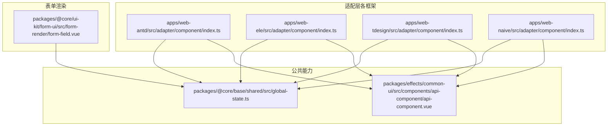
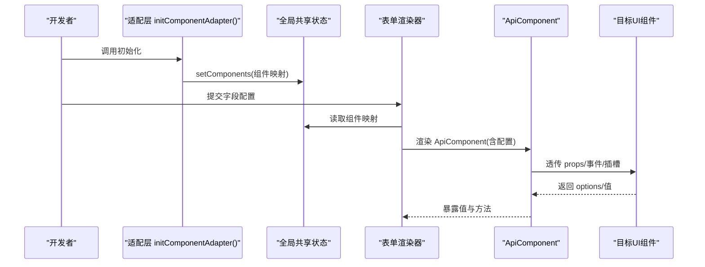
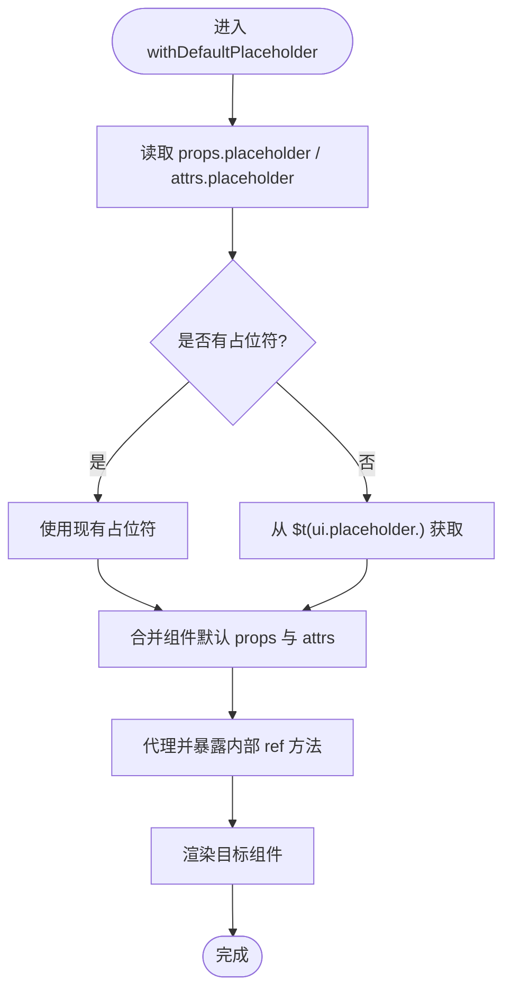
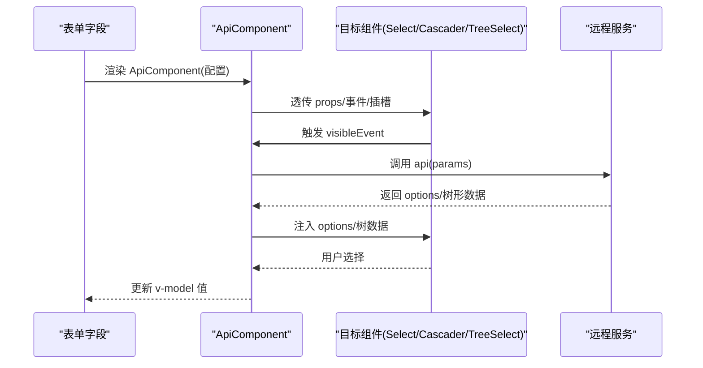
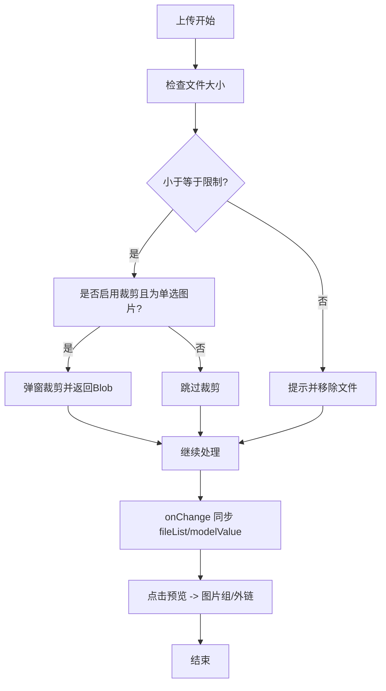
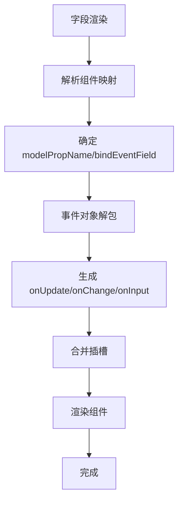
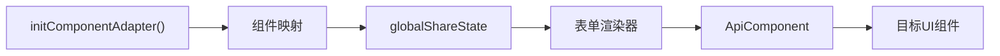

# 表单组件适配

<cite>
**本文引用的文件**
- [apps/web-antd/src/adapter/component/index.ts](file://apps/web-antd/src/adapter/component/index.ts)
- [apps/web-ele/src/adapter/component/index.ts](file://apps/web-ele/src/adapter/component/index.ts)
- [apps/web-tdesign/src/adapter/component/index.ts](file://apps/web-tdesign/src/adapter/component/index.ts)
- [apps/web-naive/src/adapter/component/index.ts](file://apps/web-naive/src/adapter/component/index.ts)
- [packages/effects/common-ui/src/components/api-component/api-component.vue](file://packages/effects/common-ui/src/components/api-component/api-component.vue)
- [packages/@core/ui-kit/form-ui/src/form-render/form-field.vue](file://packages/@core/ui-kit/form-ui/src/form-render/form-field.vue)
- [packages/@core/base/shared/src/global-state.ts](file://packages/@core/base/shared/src/global-state.ts)
- [docs/src/components/common-ui/vben-api-component.md](file://docs/src/components/common-ui/vben-api-component.md)
</cite>

## 目录
1. [简介](#简介)
2. [项目结构](#项目结构)
3. [核心组件](#核心组件)
4. [架构总览](#架构总览)
5. [详细组件分析](#详细组件分析)
6. [依赖关系分析](#依赖关系分析)
7. [性能考量](#性能考量)
8. [故障排查指南](#故障排查指南)
9. [结论](#结论)
10. [附录](#附录)

## 简介
本文件系统性阐述表单组件适配方案，覆盖 Input、Select、DatePicker、Upload 等常用控件；深入解析 withDefaultPlaceholder 高阶组件如何为输入类组件自动注入占位符；详解 ApiSelect、ApiCascader、ApiTreeSelect 等 API 组件的动态加载机制；总结表单组件的属性映射策略（props 转换、事件绑定、插槽处理）；并提供扩展指南与实际使用路径参考，帮助快速添加新组件适配与自定义适配逻辑。

## 项目结构
各 UI 框架（Ant Design Vue、Element Plus、TDesign、Naive UI）在各自应用目录下的适配层负责：
- 注册基础组件别名与增强组件（如带默认占位符的 Input/Select）
- 为 API 组件（ApiSelect/ApiTreeSelect/ApiCascader）提供统一的桥接配置
- 通过全局共享状态导出组件映射，供表单渲染器按组件名解析

图表来源
- [apps/web-antd/src/adapter/component/index.ts:526-608](file://apps/web-antd/src/adapter/component/index.ts#L526-L608)
- [apps/web-ele/src/adapter/component/index.ts:175-332](file://apps/web-ele/src/adapter/component/index.ts#L175-L332)
- [apps/web-tdesign/src/adapter/component/index.ts:129-230](file://apps/web-tdesign/src/adapter/component/index.ts#L129-L230)
- [apps/web-naive/src/adapter/component/index.ts:121-232](file://apps/web-naive/src/adapter/component/index.ts#L121-L232)
- [packages/@core/base/shared/src/global-state.ts:19-45](file://packages/@core/base/shared/src/global-state.ts#L19-L45)
- [packages/effects/common-ui/src/components/api-component/api-component.vue](file://packages/effects/common-ui/src/components/api-component/api-component.vue)

章节来源
- [apps/web-antd/src/adapter/component/index.ts:526-608](file://apps/web-antd/src/adapter/component/index.ts#L526-L608)
- [apps/web-ele/src/adapter/component/index.ts:175-332](file://apps/web-ele/src/adapter/component/index.ts#L175-L332)
- [apps/web-tdesign/src/adapter/component/index.ts:129-230](file://apps/web-tdesign/src/adapter/component/index.ts#L129-L230)
- [apps/web-naive/src/adapter/component/index.ts:121-232](file://apps/web-naive/src/adapter/component/index.ts#L121-L232)

## 核心组件
- withDefaultPlaceholder：为输入/选择类组件自动注入占位符，透传组件实例方法，统一 placeholder 来源（优先 props/attrs，其次 i18n 键）。
- ApiComponent：统一的 API 组件桥接器，支持延迟加载、可见事件触发、loading 插槽、字段映射、自动选中策略等。
- Upload 增强：在 Element/Naive/TDesign/AntD 四套适配中，针对上传组件提供预览、裁剪、尺寸校验、默认插槽等增强行为。
- 全局共享状态：initComponentAdapter 将组件映射注册到全局共享状态，供表单渲染器按组件名解析。

章节来源
- [apps/web-antd/src/adapter/component/index.ts:103-135](file://apps/web-antd/src/adapter/component/index.ts#L103-L135)
- [apps/web-ele/src/adapter/component/index.ts:121-153](file://apps/web-ele/src/adapter/component/index.ts#L121-L153)
- [apps/web-tdesign/src/adapter/component/index.ts:66-98](file://apps/web-tdesign/src/adapter/component/index.ts#L66-L98)
- [apps/web-naive/src/adapter/component/index.ts:67-99](file://apps/web-naive/src/adapter/component/index.ts#L67-L99)
- [packages/effects/common-ui/src/components/api-component/api-component.vue](file://packages/effects/common-ui/src/components/api-component/api-component.vue)
- [packages/@core/base/shared/src/global-state.ts:19-45](file://packages/@core/base/shared/src/global-state.ts#L19-L45)

## 架构总览
表单组件适配的整体流程如下：
- 各框架适配层在初始化时，将组件映射注册到全局共享状态。
- 表单渲染器根据字段配置中的 component 名称，从全局状态中解析对应组件。
- 对于 API 组件，通过 ApiComponent 包裹目标组件，并按配置注入 options、事件、loading 插槽、字段名等。
- 输入/选择类组件通过 withDefaultPlaceholder 自动注入占位符与 ref 代理，保证一致的交互体验。

图表来源
- [apps/web-antd/src/adapter/component/index.ts:526-608](file://apps/web-antd/src/adapter/component/index.ts#L526-L608)
- [packages/@core/base/shared/src/global-state.ts:19-45](file://packages/@core/base/shared/src/global-state.ts#L19-L45)
- [packages/effects/common-ui/src/components/api-component/api-component.vue](file://packages/effects/common-ui/src/components/api-component/api-component.vue)

## 详细组件分析

### withDefaultPlaceholder 高阶组件
作用
- 自动注入占位符：优先使用 props.placeholder 或 attrs.placeholder，否则回退到 i18n 键 ui.placeholder.input 或 ui.placeholder.select。
- 透传 ref：通过 Proxy 将内部组件实例方法暴露给父组件，保证可调用性。
- 统一渲染：将组件、props、attrs、插槽合并后渲染，保持与原组件一致的 API。

适用组件
- Input、InputNumber、InputPassword、Textarea、Select、TreeSelect、ApiSelect、ApiTreeSelect、IconPicker 等。

图表来源
- [apps/web-antd/src/adapter/component/index.ts:103-135](file://apps/web-antd/src/adapter/component/index.ts#L103-L135)
- [apps/web-ele/src/adapter/component/index.ts:121-153](file://apps/web-ele/src/adapter/component/index.ts#L121-L153)
- [apps/web-tdesign/src/adapter/component/index.ts:66-98](file://apps/web-tdesign/src/adapter/component/index.ts#L66-L98)
- [apps/web-naive/src/adapter/component/index.ts:67-99](file://apps/web-naive/src/adapter/component/index.ts#L67-L99)

章节来源
- [apps/web-antd/src/adapter/component/index.ts:103-135](file://apps/web-antd/src/adapter/component/index.ts#L103-L135)
- [apps/web-ele/src/adapter/component/index.ts:121-153](file://apps/web-ele/src/adapter/component/index.ts#L121-L153)
- [apps/web-tdesign/src/adapter/component/index.ts:66-98](file://apps/web-tdesign/src/adapter/component/index.ts#L66-L98)
- [apps/web-naive/src/adapter/component/index.ts:67-99](file://apps/web-naive/src/adapter/component/index.ts#L67-L99)

### API 组件（ApiSelect、ApiCascader、ApiTreeSelect）动态加载机制
- 统一桥接：ApiComponent 作为包装器，承载远程数据加载、字段映射、自动选中等能力。
- 触发策略：通过 visibleEvent（如 onVisibleChange、onDropdownVisibleChange）在下拉展开时触发请求；immediate 控制是否立即加载。
- 数据映射：labelField/valueField/childrenField/resultField 等字段名可配置；optionsPropName 指定目标组件接收 options 的属性名。
- 加载态：loadingSlot 指定目标组件的 loading 插槽名，统一显示加载图标。
- 自动选中：autoSelect 支持 first/last/one 或自定义函数，自动填充默认值。

图表来源
- [packages/effects/common-ui/src/components/api-component/api-component.vue](file://packages/effects/common-ui/src/components/api-component/api-component.vue)
- [apps/web-antd/src/adapter/component/index.ts:532-552](file://apps/web-antd/src/adapter/component/index.ts#L532-L552)
- [apps/web-ele/src/adapter/component/index.ts:180-206](file://apps/web-ele/src/adapter/component/index.ts#L180-L206)
- [apps/web-tdesign/src/adapter/component/index.ts:134-161](file://apps/web-tdesign/src/adapter/component/index.ts#L134-L161)
- [apps/web-naive/src/adapter/component/index.ts:127-153](file://apps/web-naive/src/adapter/component/index.ts#L127-L153)

章节来源
- [packages/effects/common-ui/src/components/api-component/api-component.vue](file://packages/effects/common-ui/src/components/api-component/api-component.vue)
- [apps/web-antd/src/adapter/component/index.ts:532-552](file://apps/web-antd/src/adapter/component/index.ts#L532-L552)
- [apps/web-ele/src/adapter/component/index.ts:180-206](file://apps/web-ele/src/adapter/component/index.ts#L180-L206)
- [apps/web-tdesign/src/adapter/component/index.ts:134-161](file://apps/web-tdesign/src/adapter/component/index.ts#L134-L161)
- [apps/web-naive/src/adapter/component/index.ts:127-153](file://apps/web-naive/src/adapter/component/index.ts#L127-L153)
- [docs/src/components/common-ui/vben-api-component.md:130-154](file://docs/src/components/common-ui/vben-api-component.md#L130-L154)

### Input/Textarea/InputNumber/Select/TreeSelect 等基础组件适配
- Ant Design Vue 适配：Input、Textarea、InputNumber、Select、TreeSelect、DatePicker、TimePicker、Cascader、Upload 等均通过 withDefaultPlaceholder 或直接注册。
- Element Plus 适配：Input、Textarea、InputNumber、SelectV2、TreeSelect、DatePicker、TimePicker、Upload 等，部分组件对 range 场景做了额外处理（如双值 name/id）。
- TDesign 适配：Input、Textarea、InputNumber、Select、TreeSelect、DatePicker、TimePicker、RangePicker、Upload 等，部分按钮变体做了兼容。
- Naive UI 适配：Input、Textarea、InputNumber、Select、TreeSelect、DatePicker、TimePicker、Upload 等，CheckboxGroup/RadioGroup 支持 options 动态渲染。

章节来源
- [apps/web-antd/src/adapter/component/index.ts:554-589](file://apps/web-antd/src/adapter/component/index.ts#L554-L589)
- [apps/web-ele/src/adapter/component/index.ts:207-311](file://apps/web-ele/src/adapter/component/index.ts#L207-L311)
- [apps/web-tdesign/src/adapter/component/index.ts:162-211](file://apps/web-tdesign/src/adapter/component/index.ts#L162-L211)
- [apps/web-naive/src/adapter/component/index.ts:154-215](file://apps/web-naive/src/adapter/component/index.ts#L154-L215)

### Upload 组件增强（Ant Design Vue）
- 占位符与列表类型：根据 listType 自动生成默认插槽（文本/卡片），并支持 i18n 占位符。
- 上传前置校验：支持 maxSize 限制与错误提示；多选或非图片不触发裁剪。
- 图片裁剪：可选 aspectRatio，弹窗裁剪后返回 DataURL。
- 预览：支持图片预览组与非图片外部打开；无预览时尝试生成 base64。
- v-model 同步：onChange 中维护 fileList 并更新 modelValue。

图表来源
- [apps/web-antd/src/adapter/component/index.ts:378-491](file://apps/web-antd/src/adapter/component/index.ts#L378-L491)

章节来源
- [apps/web-antd/src/adapter/component/index.ts:378-491](file://apps/web-antd/src/adapter/component/index.ts#L378-L491)

### 表单字段到组件的属性映射与事件绑定
- 字段绑定：根据字段配置中的 component 名称解析组件；若为字符串组件名，使用内置映射决定 modelPropName（如 value）。
- 值解包：当组件值为事件对象时，按 bindEventField 解包后再绑定到目标属性。
- 事件桥接：统一生成 onUpdate:<field> 与 onChange/onInput 绑定，支持禁用特定监听器。
- 插槽处理：保留原始插槽与默认插槽组合，确保 API 组件与 Upload 增强后的插槽生效。

图表来源
- [packages/@core/ui-kit/form-ui/src/form-render/form-field.vue:218-252](file://packages/@core/ui-kit/form-ui/src/form-render/form-field.vue#L218-L252)

章节来源
- [packages/@core/ui-kit/form-ui/src/form-render/form-field.vue:218-252](file://packages/@core/ui-kit/form-ui/src/form-render/form-field.vue#L218-L252)

## 依赖关系分析
- 组件注册：各适配层 initComponentAdapter 将组件映射写入全局共享状态。
- 渲染依赖：表单渲染器仅依赖全局共享状态中的组件映射，不直接依赖具体 UI 库。
- API 组件：统一依赖 ApiComponent，通过 props 配置与目标组件解耦。
- 语言与主题：占位符与消息提示通过 i18n 与各 UI 框架的消息组件统一输出。

图表来源
- [packages/@core/base/shared/src/global-state.ts:19-45](file://packages/@core/base/shared/src/global-state.ts#L19-L45)
- [apps/web-antd/src/adapter/component/index.ts:591-592](file://apps/web-antd/src/adapter/component/index.ts#L591-L592)
- [apps/web-ele/src/adapter/component/index.ts:313-314](file://apps/web-ele/src/adapter/component/index.ts#L313-L314)
- [apps/web-tdesign/src/adapter/component/index.ts:213-214](file://apps/web-tdesign/src/adapter/component/index.ts#L213-L214)
- [apps/web-naive/src/adapter/component/index.ts:217-218](file://apps/web-naive/src/adapter/component/index.ts#L217-L218)

章节来源
- [packages/@core/base/shared/src/global-state.ts:19-45](file://packages/@core/base/shared/src/global-state.ts#L19-L45)
- [apps/web-antd/src/adapter/component/index.ts:591-592](file://apps/web-antd/src/adapter/component/index.ts#L591-L592)
- [apps/web-ele/src/adapter/component/index.ts:313-314](file://apps/web-ele/src/adapter/component/index.ts#L313-L314)
- [apps/web-tdesign/src/adapter/component/index.ts:213-214](file://apps/web-tdesign/src/adapter/component/index.ts#L213-L214)
- [apps/web-naive/src/adapter/component/index.ts:217-218](file://apps/web-naive/src/adapter/component/index.ts#L217-L218)

## 性能考量
- 异步组件：大量基础组件采用 defineAsyncComponent，按需加载，降低首屏体积。
- 懒加载 API：ApiComponent 支持 immediate=false 与 visibleEvent，避免不必要的请求。
- 事件解包：仅在必要时解包事件对象，减少不必要计算。
- 上传优化：图片预览组按需渲染，裁剪弹窗销毁时及时释放资源与 URL 对象。

章节来源
- [apps/web-antd/src/adapter/component/index.ts:42-89](file://apps/web-antd/src/adapter/component/index.ts#L42-L89)
- [apps/web-ele/src/adapter/component/index.ts:18-119](file://apps/web-ele/src/adapter/component/index.ts#L18-L119)
- [apps/web-tdesign/src/adapter/component/index.ts:18-64](file://apps/web-tdesign/src/adapter/component/index.ts#L18-L64)
- [apps/web-naive/src/adapter/component/index.ts:18-65](file://apps/web-naive/src/adapter/component/index.ts#L18-L65)

## 故障排查指南
- 占位符未生效
  - 检查是否显式传入 placeholder；若未传，确认 i18n 键 ui.placeholder.input/select 是否存在。
  - 章节来源: [apps/web-antd/src/adapter/component/index.ts:112-115](file://apps/web-antd/src/adapter/component/index.ts#L112-L115)
- API 组件未加载数据
  - 确认 visibleEvent 是否与目标组件事件名一致；immediate 是否为 true。
  - 章节来源: [docs/src/components/common-ui/vben-api-component.md:130-154](file://docs/src/components/common-ui/vben-api-component.md#L130-L154)
- Upload 无法预览或裁剪失败
  - 检查 maxSize 与裁剪开关；确认图片类型识别与 URL 解析。
  - 章节来源: [apps/web-antd/src/adapter/component/index.ts:400-428](file://apps/web-antd/src/adapter/component/index.ts#L400-L428)
- 表单值未同步
  - 检查 bindEventField 与 modelPropName；确认事件桥接 onUpdate/onChange 是否正确生成。
  - 章节来源: [packages/@core/ui-kit/form-ui/src/form-render/form-field.vue:218-252](file://packages/@core/ui-kit/form-ui/src/form-render/form-field.vue#L218-L252)

## 结论
该适配体系通过 withDefaultPlaceholder 与 ApiComponent 实现了跨 UI 框架的一致性与可扩展性。借助全局共享状态，表单渲染器无需关心底层 UI 差异，即可稳定地渲染各类表单控件。Upload 增强与 API 组件的动态加载策略进一步提升了用户体验与开发效率。遵循本文的扩展指南，可快速为新组件或新 UI 框架添加适配。

## 附录

### 扩展指南：新增表单组件适配步骤
- 新增组件别名与增强
  - 在对应框架的适配文件中，使用 withDefaultPlaceholder 包装输入/选择类组件，或直接注册基础组件。
  - 对于 API 组件，使用 ApiComponent 包裹目标组件，并配置 component、loadingSlot、visibleEvent、modelPropName、optionsPropName、fieldNames 等。
  - 章节来源: [apps/web-antd/src/adapter/component/index.ts:526-589](file://apps/web-antd/src/adapter/component/index.ts#L526-L589)
- 注册到全局共享状态
  - 在 initComponentAdapter 中将组件映射写入 globalShareState.setComponents。
  - 章节来源: [packages/@core/base/shared/src/global-state.ts:40](file://packages/@core/base/shared/src/global-state.ts#L40)
- 验证字段映射
  - 在表单字段配置中使用 component 名称，确保渲染器能正确解析并绑定事件/插槽。
  - 章节来源: [packages/@core/ui-kit/form-ui/src/form-render/form-field.vue:218-252](file://packages/@core/ui-kit/form-ui/src/form-render/form-field.vue#L218-L252)

### 使用路径参考（不含代码内容）
- Ant Design Vue 示例（ApiSelect/ApiTreeSelect/Upload 等）
  - 章节来源: [apps/web-antd/src/adapter/component/index.ts:532-589](file://apps/web-antd/src/adapter/component/index.ts#L532-L589)
- Element Plus 示例（SelectV2/TreeSelect/TimePicker 等）
  - 章节来源: [apps/web-ele/src/adapter/component/index.ts:180-311](file://apps/web-ele/src/adapter/component/index.ts#L180-L311)
- TDesign 示例（Select/TreeSelect/RangePicker 等）
  - 章节来源: [apps/web-tdesign/src/adapter/component/index.ts:134-211](file://apps/web-tdesign/src/adapter/component/index.ts#L134-L211)
- Naive UI 示例（Select/TreeSelect/RadioGroup 等）
  - 章节来源: [apps/web-naive/src/adapter/component/index.ts:127-215](file://apps/web-naive/src/adapter/component/index.ts#L127-L215)
- API 组件属性与方法参考
  - 章节来源: [docs/src/components/common-ui/vben-api-component.md:130-154](file://docs/src/components/common-ui/vben-api-component.md#L130-L154)