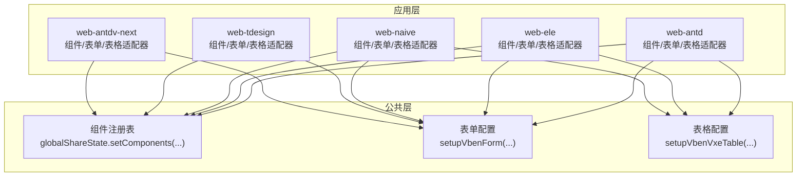
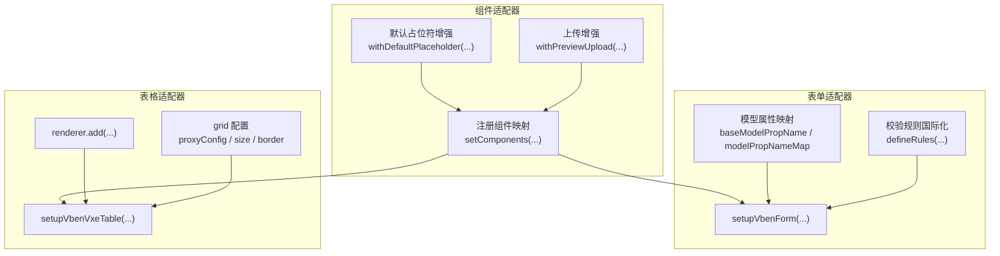
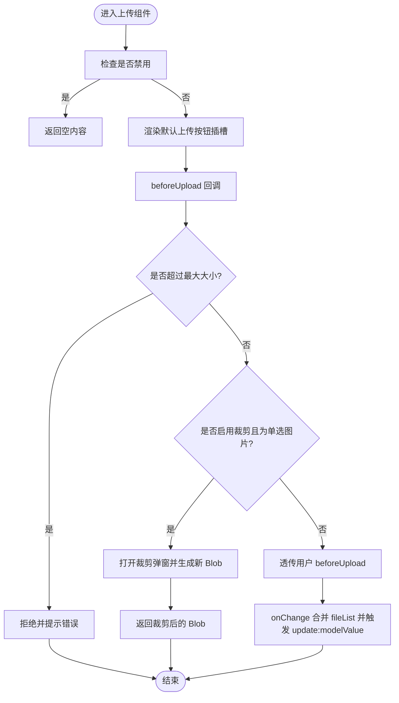
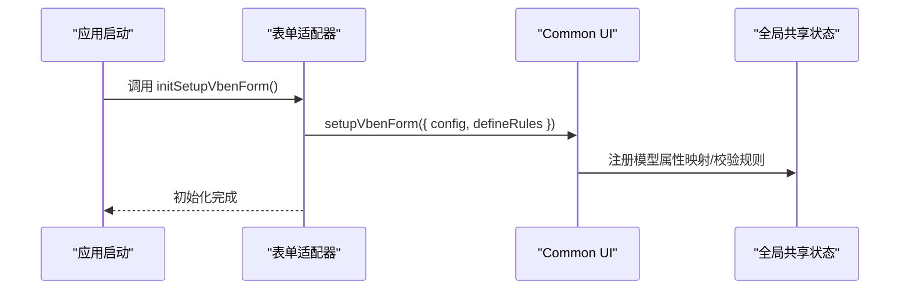
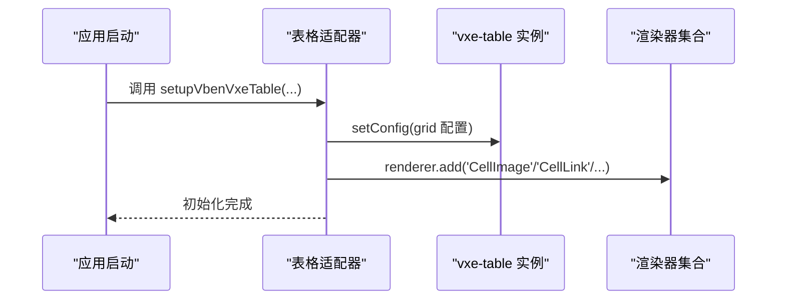
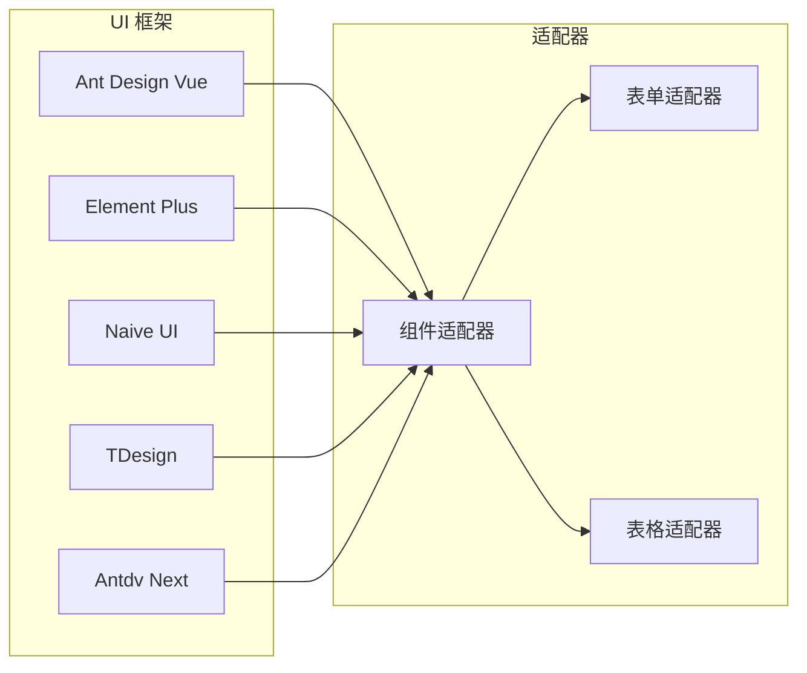

# 适配器模式实现

<cite>
**本文引用的文件**
- [apps/web-antd/src/adapter/component/index.ts](file://apps/web-antd/src/adapter/component/index.ts)
- [apps/web-antdv-next/src/adapter/component/index.ts](file://apps/web-antdv-next/src/adapter/component/index.ts)
- [apps/web-ele/src/adapter/component/index.ts](file://apps/web-ele/src/adapter/component/index.ts)
- [apps/web-naive/src/adapter/component/index.ts](file://apps/web-naive/src/adapter/component/index.ts)
- [apps/web-tdesign/src/adapter/component/index.ts](file://apps/web-tdesign/src/adapter/component/index.ts)
- [apps/web-antd/src/adapter/form.ts](file://apps/web-antd/src/adapter/form.ts)
- [apps/web-ele/src/adapter/form.ts](file://apps/web-ele/src/adapter/form.ts)
- [apps/web-naive/src/adapter/form.ts](file://apps/web-naive/src/adapter/form.ts)
- [apps/web-antd/src/adapter/vxe-table.ts](file://apps/web-antd/src/adapter/vxe-table.ts)
- [apps/web-ele/src/adapter/vxe-table.ts](file://apps/web-ele/src/adapter/vxe-table.ts)
- [apps/web-naive/src/adapter/vxe-table.ts](file://apps/web-naive/src/adapter/vxe-table.ts)
</cite>

## 目录

1. [简介](#简介)
2. [项目结构](#项目结构)
3. [核心组件](#核心组件)
4. [架构总览](#架构总览)
5. [详细组件分析](#详细组件分析)
6. [依赖关系分析](#依赖关系分析)
7. [性能考量](#性能考量)
8. [故障排查指南](#故障排查指南)
9. [结论](#结论)
10. [附录](#附录)

## 简介

本文件系统性阐述 Vben Admin 在多 UI 框架（Ant Design Vue、Element Plus、Naive UI、TDesign、Antdv Next）下，通过“适配器模式”实现的统一组件与表单/表格能力。其目标是在不改变上层调用方式的前提下，屏蔽各 UI 框架在属性命名、事件模型、插槽结构、默认行为等方面的差异，形成一致的开发体验与可维护性。

## 项目结构

- 每个前端应用子包（如 web-antd、web-ele、web-naive、web-tdesign、web-antdv-next）均包含三类适配器：
  - 组件适配器：将具体 UI 组件封装为统一的组件注册表，供表单/表格等上层组件使用。
  - 表单适配器：统一表单模型属性名、校验规则、空值语义等。
  - 表格适配器：统一 vxe-table 的渲染器、分页响应结构、默认样式等。

图示来源

- [apps/web-antd/src/adapter/component/index.ts:526-608](file://apps/web-antd/src/adapter/component/index.ts#L526-L608)
- [apps/web-ele/src/adapter/component/index.ts:175-332](file://apps/web-ele/src/adapter/component/index.ts#L175-L332)
- [apps/web-naive/src/adapter/component/index.ts:121-232](file://apps/web-naive/src/adapter/component/index.ts#L121-L232)
- [apps/web-tdesign/src/adapter/component/index.ts:129-230](file://apps/web-tdesign/src/adapter/component/index.ts#L129-L230)
- [apps/web-antdv-next/src/adapter/component/index.ts:524-604](file://apps/web-antdv-next/src/adapter/component/index.ts#L524-L604)

章节来源

- [apps/web-antd/src/adapter/component/index.ts:526-608](file://apps/web-antd/src/adapter/component/index.ts#L526-L608)
- [apps/web-ele/src/adapter/component/index.ts:175-332](file://apps/web-ele/src/adapter/component/index.ts#L175-L332)
- [apps/web-naive/src/adapter/component/index.ts:121-232](file://apps/web-naive/src/adapter/component/index.ts#L121-L232)
- [apps/web-tdesign/src/adapter/component/index.ts:129-230](file://apps/web-tdesign/src/adapter/component/index.ts#L129-L230)
- [apps/web-antdv-next/src/adapter/component/index.ts:524-604](file://apps/web-antdv-next/src/adapter/component/index.ts#L524-L604)

## 核心组件

- 组件适配器（Component Adapter）
  - 职责：将各 UI 框架的原生组件封装为统一的组件注册表；提供默认占位符注入、上传预览/裁剪、可见性事件桥接等增强能力。
  - 关键机制：
    - 统一组件类型枚举与注册：通过 globalShareState.setComponents(...) 将组件映射注入全局共享状态。
    - 默认占位符增强：withDefaultPlaceholder 包装输入/选择类组件，自动注入本地化占位符并透传内部 ref 方法。
    - 上传组件增强：withPreviewUpload 包装上传组件，支持图片预览组、裁剪弹窗、尺寸限制、默认按钮插槽等。
    - 可见性事件桥接：为 ApiSelect/ApiTreeSelect 等远程组件桥接下拉展开/可见事件。
- 表单适配器（Form Adapter）
  - 职责：统一表单模型属性名、空值语义、校验规则国际化。
  - 关键机制：
    - baseModelPropName：如 Ant Design Vue 默认为 'value'。
    - modelPropNameMap：覆盖特定组件的 v-model 属性名，如 Upload 为 'fileList'，Checkbox/Radio/Switch 为 'checked'。
    - emptyStateValue：如 Naive UI 使用 null 作为空值，保证重置生效。
    - defineRules：提供 required/selectRequired 等规则的国际化提示。
- 表格适配器（Vxe Table Adapter）
  - 职责：统一 vxe-table 的全局配置、渲染器注册、分页响应结构、默认样式等。
  - 关键机制：
    - configVxeTable：设置 grid 默认样式、代理响应字段映射、分页开关等。
    - renderer.add：注册 CellImage/CellLink/CellTag/CellSwitch/CellOperation/DictSelect/UserSelect/CellProgress 等渲染器。
    - useVbenForm：复用表单适配器能力，使表格内的单元格编辑/查询与表单保持一致。

章节来源

- [apps/web-antd/src/adapter/component/index.ts:103-135](file://apps/web-antd/src/adapter/component/index.ts#L103-L135)
- [apps/web-antd/src/adapter/component/index.ts:137-491](file://apps/web-antd/src/adapter/component/index.ts#L137-L491)
- [apps/web-antd/src/adapter/form.ts:11-42](file://apps/web-antd/src/adapter/form.ts#L11-L42)
- [apps/web-ele/src/adapter/form.ts:11-34](file://apps/web-ele/src/adapter/form.ts#L11-L34)
- [apps/web-naive/src/adapter/form.ts:11-38](file://apps/web-naive/src/adapter/form.ts#L11-L38)
- [apps/web-antd/src/adapter/vxe-table.ts:34-104](file://apps/web-antd/src/adapter/vxe-table.ts#L34-L104)

## 架构总览

下图展示了“组件适配器 → 表单/表格适配器 → 上层业务组件”的调用链路与职责边界：

图示来源

- [apps/web-antd/src/adapter/component/index.ts:526-608](file://apps/web-antd/src/adapter/component/index.ts#L526-L608)
- [apps/web-antd/src/adapter/form.ts:11-42](file://apps/web-antd/src/adapter/form.ts#L11-L42)
- [apps/web-antd/src/adapter/vxe-table.ts:34-104](file://apps/web-antd/src/adapter/vxe-table.ts#L34-L104)

## 详细组件分析

### 组件适配器：统一组件注册与增强

- 设计要点
  - 组件注册：将各 UI 框架的原生组件映射为统一的 ComponentType，并通过 globalShareState.setComponents(...) 注入全局共享状态，供上层表单/表格按名称动态渲染。
  - 默认占位符：对输入/选择类组件统一注入本地化占位符，避免重复配置；同时透传内部 ref，保证外部可调用内部方法。
  - 上传增强：针对上传组件提供预览组、图片裁剪、尺寸限制、默认按钮插槽等增强逻辑，屏蔽不同 UI 框架在事件/属性上的差异。
  - 可见性事件桥接：为远程选择组件桥接下拉展开/可见事件，统一回调命名。
- 关键流程（上传组件增强）

图示来源

- [apps/web-antd/src/adapter/component/index.ts:137-491](file://apps/web-antd/src/adapter/component/index.ts#L137-L491)
- [apps/web-antdv-next/src/adapter/component/index.ts:137-491](file://apps/web-antdv-next/src/adapter/component/index.ts#L137-L491)

章节来源

- [apps/web-antd/src/adapter/component/index.ts:103-135](file://apps/web-antd/src/adapter/component/index.ts#L103-L135)
- [apps/web-antd/src/adapter/component/index.ts:137-491](file://apps/web-antd/src/adapter/component/index.ts#L137-L491)
- [apps/web-ele/src/adapter/component/index.ts:121-153](file://apps/web-ele/src/adapter/component/index.ts#L121-L153)
- [apps/web-ele/src/adapter/component/index.ts:175-332](file://apps/web-ele/src/adapter/component/index.ts#L175-L332)
- [apps/web-naive/src/adapter/component/index.ts:67-99](file://apps/web-naive/src/adapter/component/index.ts#L67-L99)
- [apps/web-naive/src/adapter/component/index.ts:121-232](file://apps/web-naive/src/adapter/component/index.ts#L121-L232)
- [apps/web-tdesign/src/adapter/component/index.ts:66-98](file://apps/web-tdesign/src/adapter/component/index.ts#L66-L98)
- [apps/web-tdesign/src/adapter/component/index.ts:129-230](file://apps/web-tdesign/src/adapter/component/index.ts#L129-L230)
- [apps/web-antdv-next/src/adapter/component/index.ts:103-135](file://apps/web-antdv-next/src/adapter/component/index.ts#L103-L135)
- [apps/web-antdv-next/src/adapter/component/index.ts:137-491](file://apps/web-antdv-next/src/adapter/component/index.ts#L137-L491)

### 表单适配器：统一模型属性与校验

- 设计要点
  - baseModelPropName：统一 v-model 基础属性名，如 Ant Design Vue 默认 'value'。
  - modelPropNameMap：覆盖特定组件的 v-model 属性名，如 Upload 为 'fileList'，Checkbox/Radio/Switch 为 'checked'。
  - emptyStateValue：针对不同框架的空值语义（如 Naive UI 使用 null），保证表单重置行为一致。
  - defineRules：提供国际化校验规则，如 required/selectRequired，结合 $t 提示用户。
- 关键流程（表单初始化）

图示来源

- [apps/web-antd/src/adapter/form.ts:11-42](file://apps/web-antd/src/adapter/form.ts#L11-L42)
- [apps/web-ele/src/adapter/form.ts:11-34](file://apps/web-ele/src/adapter/form.ts#L11-L34)
- [apps/web-naive/src/adapter/form.ts:11-38](file://apps/web-naive/src/adapter/form.ts#L11-L38)

章节来源

- [apps/web-antd/src/adapter/form.ts:11-42](file://apps/web-antd/src/adapter/form.ts#L11-L42)
- [apps/web-ele/src/adapter/form.ts:11-34](file://apps/web-ele/src/adapter/form.ts#L11-L34)
- [apps/web-naive/src/adapter/form.ts:11-38](file://apps/web-naive/src/adapter/form.ts#L11-L38)

### 表格适配器：统一渲染器与响应结构

- 设计要点
  - configVxeTable：设置 grid 默认样式、代理响应字段映射（result/total/list）、分页开关、边框/圆角/溢出等。
  - renderer.add：注册多种单元格渲染器（如 CellImage、CellLink、CellTag、CellSwitch、CellOperation、DictSelect、UserSelect、CellProgress），统一不同 UI 框架下的渲染行为。
  - useVbenForm：复用表单适配器，使表格内的查询/编辑与表单保持一致的模型属性与校验规则。
- 关键流程（表格初始化）

图示来源

- [apps/web-antd/src/adapter/vxe-table.ts:34-104](file://apps/web-antd/src/adapter/vxe-table.ts#L34-L104)
- [apps/web-ele/src/adapter/vxe-table.ts:11-72](file://apps/web-ele/src/adapter/vxe-table.ts#L11-L72)
- [apps/web-naive/src/adapter/vxe-table.ts:11-71](file://apps/web-naive/src/adapter/vxe-table.ts#L11-L71)

章节来源

- [apps/web-antd/src/adapter/vxe-table.ts:34-104](file://apps/web-antd/src/adapter/vxe-table.ts#L34-L104)
- [apps/web-ele/src/adapter/vxe-table.ts:11-72](file://apps/web-ele/src/adapter/vxe-table.ts#L11-L72)
- [apps/web-naive/src/adapter/vxe-table.ts:11-71](file://apps/web-naive/src/adapter/vxe-table.ts#L11-L71)

## 依赖关系分析

- 组件适配器对 UI 框架的依赖通过 defineAsyncComponent 异步加载，降低首屏体积并隔离差异。
- 表单/表格适配器依赖公共 UI 能力（setupVbenForm/setupVbenVxeTable）与全局共享状态（globalShareState），实现跨框架一致性。
- 不同 UI 框架的适配器彼此独立，互不影响，便于按需引入与替换。

图示来源

- [apps/web-antd/src/adapter/component/index.ts:526-608](file://apps/web-antd/src/adapter/component/index.ts#L526-L608)
- [apps/web-ele/src/adapter/component/index.ts:175-332](file://apps/web-ele/src/adapter/component/index.ts#L175-L332)
- [apps/web-naive/src/adapter/component/index.ts:121-232](file://apps/web-naive/src/adapter/component/index.ts#L121-L232)
- [apps/web-tdesign/src/adapter/component/index.ts:129-230](file://apps/web-tdesign/src/adapter/component/index.ts#L129-L230)
- [apps/web-antdv-next/src/adapter/component/index.ts:524-604](file://apps/web-antdv-next/src/adapter/component/index.ts#L524-L604)

章节来源

- [apps/web-antd/src/adapter/component/index.ts:526-608](file://apps/web-antd/src/adapter/component/index.ts#L526-L608)
- [apps/web-ele/src/adapter/component/index.ts:175-332](file://apps/web-ele/src/adapter/component/index.ts#L175-L332)
- [apps/web-naive/src/adapter/component/index.ts:121-232](file://apps/web-naive/src/adapter/component/index.ts#L121-L232)
- [apps/web-tdesign/src/adapter/component/index.ts:129-230](file://apps/web-tdesign/src/adapter/component/index.ts#L129-L230)
- [apps/web-antdv-next/src/adapter/component/index.ts:524-604](file://apps/web-antdv-next/src/adapter/component/index.ts#L524-L604)

## 性能考量

- 异步组件加载：通过 defineAsyncComponent 按需加载 UI 组件，减少首屏体积与冷启动时间。
- 渲染器缓存：表格适配器在热更新场景主动清理旧渲染器，避免重复注册导致的内存与渲染开销。
- 文件预览与裁剪：上传增强仅在需要时创建临时 DOM 与裁剪弹窗，完成后延迟清理，避免资源泄漏。
- 事件与回调：上传 handleChange 中对用户回调异常进行捕获，避免影响内部 v-model 同步，提升稳定性。

## 故障排查指南

- 上传组件无法预览或裁剪
  - 检查 beforeUpload 返回值与文件尺寸限制配置。
  - 确认裁剪弹窗是否被禁用（multiple 或 非图片）。
- 表单重置无效
  - 检查 emptyStateValue 是否与目标 UI 框架的空值语义一致（如 Naive UI 使用 null）。
- 表格渲染器不生效
  - 确认 renderer.add 是否正确注册，且 cellRender.name 与注册名一致。
- vxe-table 热更新报错
  - 确认表格适配器在初始化时执行了渲染器清理与重新注册。

章节来源

- [apps/web-antd/src/adapter/component/index.ts:400-428](file://apps/web-antd/src/adapter/component/index.ts#L400-L428)
- [apps/web-antd/src/adapter/form.ts:11-42](file://apps/web-antd/src/adapter/form.ts#L11-L42)
- [apps/web-antd/src/adapter/vxe-table.ts:65-72](file://apps/web-antd/src/adapter/vxe-table.ts#L65-L72)

## 结论

通过组件/表单/表格三层适配器，Vben Admin 在多 UI 框架间实现了高度一致的开发体验与可维护性。组件适配器负责“外观统一”，表单适配器负责“行为统一”，表格适配器负责“渲染统一”。该设计既保留了各框架的特性优势，又通过统一抽象降低了迁移与扩展成本。

## 附录

- 适配器扩展最佳实践
  - 新增组件：在对应 UI 框架的组件适配器中新增映射，并通过 withDefaultPlaceholder/withPreviewUpload 增强必要能力。
  - 新增 UI 框架：复制现有适配器结构，按需实现组件注册、表单配置、表格渲染器注册。
  - 自定义适配规则：在表单适配器中补充 modelPropNameMap 与 defineRules，确保与目标框架一致。
  - 配置选项参考路径
    - 组件注册表：[apps/web-antd/src/adapter/component/index.ts:526-608](file://apps/web-antd/src/adapter/component/index.ts#L526-L608)
    - 表单配置：[apps/web-antd/src/adapter/form.ts:11-42](file://apps/web-antd/src/adapter/form.ts#L11-L42)
    - 表格配置：[apps/web-antd/src/adapter/vxe-table.ts:34-104](file://apps/web-antd/src/adapter/vxe-table.ts#L34-L104)
