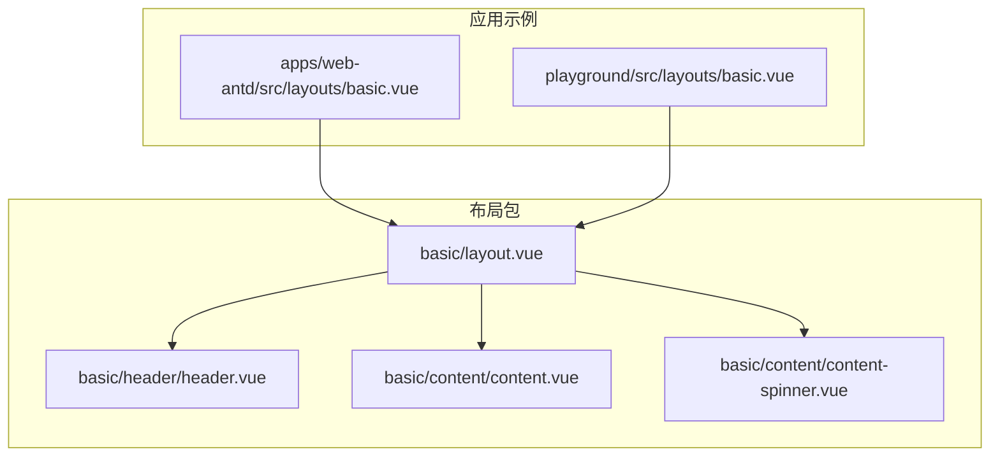
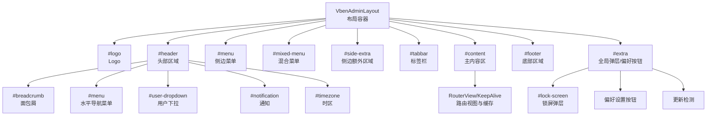
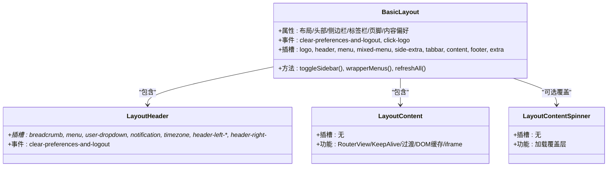
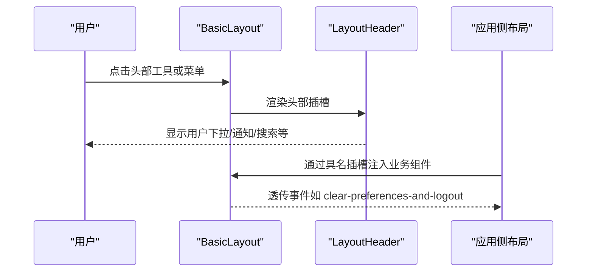
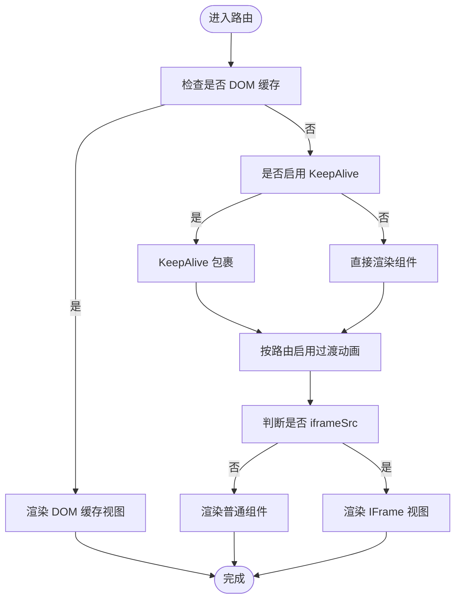
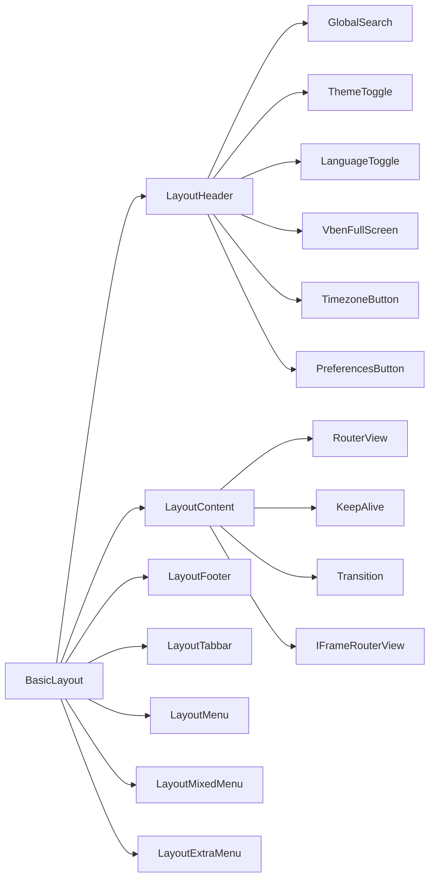

# 基础布局

<cite>
**本文引用的文件**
- [packages/effects/layouts/src/basic/layout.vue](file://packages/effects/layouts/src/basic/layout.vue)
- [packages/effects/layouts/src/basic/content/content.vue](file://packages/effects/layouts/src/basic/content/content.vue)
- [packages/effects/layouts/src/basic/content/content-spinner.vue](file://packages/effects/layouts/src/basic/content/content-spinner.vue)
- [packages/effects/layouts/src/basic/header/header.vue](file://packages/effects/layouts/src/basic/header/header.vue)
- [apps/web-antd/src/layouts/basic.vue](file://apps/web-antd/src/layouts/basic.vue)
- [playground/src/layouts/basic.vue](file://playground/src/layouts/basic.vue)
</cite>

## 目录
1. [简介](#简介)
2. [项目结构](#项目结构)
3. [核心组件](#核心组件)
4. [架构总览](#架构总览)
5. [详细组件分析](#详细组件分析)
6. [依赖关系分析](#依赖关系分析)
7. [性能考虑](#性能考虑)
8. [故障排查指南](#故障排查指南)
9. [结论](#结论)
10. [附录](#附录)

## 简介
本指南围绕 Vben Admin 的基础布局组件 BasicLayout 展开，系统讲解其设计架构与实现细节，覆盖以下主题：
- 布局四大区域：头部、侧边栏、主内容区、底部的职责与协作方式
- 响应式设计与移动端适配策略
- 槽位系统（slots）的使用与扩展，包括 user-dropdown、notification、extra、lock-screen 等
- 与状态管理的集成：用户信息、通知状态、锁屏状态等
- 样式定制与 CSS 变量配置
- 性能优化策略与最佳实践

## 项目结构
BasicLayout 所在的包位于 effects/layouts，核心文件组织如下：
- 基础布局容器：basic/layout.vue
- 内容区与过渡：basic/content/*.vue
- 头部区域：basic/header/header.vue
- 应用侧通过各框架示例工程（如 web-antd、playground）进行装配与插槽注入

图表来源
- [packages/effects/layouts/src/basic/layout.vue:1-432](file://packages/effects/layouts/src/basic/layout.vue#L1-L432)
- [packages/effects/layouts/src/basic/header/header.vue:1-196](file://packages/effects/layouts/src/basic/header/header.vue#L1-L196)
- [packages/effects/layouts/src/basic/content/content.vue:1-89](file://packages/effects/layouts/src/basic/content/content.vue#L1-L89)
- [packages/effects/layouts/src/basic/content/content-spinner.vue:1-13](file://packages/effects/layouts/src/basic/content/content-spinner.vue#L1-L13)
- [apps/web-antd/src/layouts/basic.vue:1-207](file://apps/web-antd/src/layouts/basic.vue#L1-L207)
- [playground/src/layouts/basic.vue:1-233](file://playground/src/layouts/basic.vue#L1-L233)

章节来源
- [packages/effects/layouts/src/basic/layout.vue:1-432](file://packages/effects/layouts/src/basic/layout.vue#L1-L432)
- [packages/effects/layouts/src/basic/header/header.vue:1-196](file://packages/effects/layouts/src/basic/header/header.vue#L1-L196)
- [packages/effects/layouts/src/basic/content/content.vue:1-89](file://packages/effects/layouts/src/basic/content/content.vue#L1-L89)
- [apps/web-antd/src/layouts/basic.vue:1-207](file://apps/web-antd/src/layouts/basic.vue#L1-L207)
- [playground/src/layouts/basic.vue:1-233](file://playground/src/layouts/basic.vue#L1-L233)

## 核心组件
- BasicLayout 容器：负责布局骨架、主题与尺寸参数绑定、菜单与标签页、内容区与覆盖层、页脚、全局弹层（锁屏、偏好设置、更新检测）等
- LayoutHeader：头部工具条与菜单渲染，支持左右槽位与内置小部件（搜索、主题切换、语言切换、全屏、时区、通知）
- LayoutContent：路由视图渲染、缓存控制、过渡动画、DOM 缓存与 iframe 视图
- ContentSpinner：内容加载覆盖层（可选）

章节来源
- [packages/effects/layouts/src/basic/layout.vue:1-432](file://packages/effects/layouts/src/basic/layout.vue#L1-L432)
- [packages/effects/layouts/src/basic/header/header.vue:1-196](file://packages/effects/layouts/src/basic/header/header.vue#L1-L196)
- [packages/effects/layouts/src/basic/content/content.vue:1-89](file://packages/effects/layouts/src/basic/content/content.vue#L1-L89)
- [packages/effects/layouts/src/basic/content/content-spinner.vue:1-13](file://packages/effects/layouts/src/basic/content/content-spinner.vue#L1-L13)

## 架构总览
BasicLayout 以 VbenAdminLayout 为核心容器，内部通过多个子区域模板（#logo/#header/#menu/#mixed-menu/#side-extra/#tabbar/#content/#footer/#extra）组合形成完整布局。应用侧通过具名插槽注入用户下拉、通知、锁屏等业务组件。

图表来源
- [packages/effects/layouts/src/basic/layout.vue:216-431](file://packages/effects/layouts/src/basic/layout.vue#L216-L431)

## 详细组件分析

### BasicLayout 组件分析
- 职责与边界
  - 统一接收主题、布局模式、尺寸、显隐等偏好配置，并将其映射到容器属性
  - 管理菜单激活态、侧边栏显隐与折叠、混合菜单与额外侧栏
  - 提供内容区紧凑模式、内边距、过渡覆盖层等能力
  - 集成标签栏、页脚、全局弹层（锁屏、偏好、更新检测）、回到顶部
- 关键特性
  - 响应式：根据 isMobile 切换布局行为；移动端强制隐藏侧边栏标题
  - 菜单联动：头部导航与侧边菜单联动激活态；混合模式下支持二级扩展菜单
  - 插槽扩展：支持 header-/logo-/side-extra-title 等命名插槽
  - 事件透传：clear-preferences-and-logout、click-logo 等事件向上抛出
- 参数与事件
  - 属性：绑定大量偏好项（布局、头部、侧边栏、标签栏、页脚、内容等）
  - 事件：clear-preferences-and-logout、click-logo、toggle-sidebar、update:* 等
- 与状态管理
  - 使用 usePreferences/useAccessStore/useTabbarStore 等集中管理布局状态与菜单数据
  - 监听语言与时区变化触发刷新，确保国际化与本地化正确生效

图表来源
- [packages/effects/layouts/src/basic/layout.vue:37-431](file://packages/effects/layouts/src/basic/layout.vue#L37-L431)
- [packages/effects/layouts/src/basic/header/header.vue:1-196](file://packages/effects/layouts/src/basic/header/header.vue#L1-L196)
- [packages/effects/layouts/src/basic/content/content.vue:1-89](file://packages/effects/layouts/src/basic/content/content.vue#L1-L89)
- [packages/effects/layouts/src/basic/content/content-spinner.vue:1-13](file://packages/effects/layouts/src/basic/content/content-spinner.vue#L1-L13)

章节来源
- [packages/effects/layouts/src/basic/layout.vue:1-432](file://packages/effects/layouts/src/basic/layout.vue#L1-L432)

### 响应式设计与移动端适配
- 移动端策略
  - 当 isMobile 为真时，强制隐藏侧边栏标题，避免空间不足
  - 在头部导航模式下，移动端不折叠侧边栏，保证交互可用性
- 尺寸与主题
  - 通过偏好配置控制头部高度、侧边栏宽度、紧凑模式、内边距等
  - 主题色与半暗主题（头部/侧边栏/子级）按需启用
- 菜单模式自适应
  - 根据布局类型（侧边混合、头部混合、侧边-头部混合）动态调整菜单可见性与激活态

章节来源
- [packages/effects/layouts/src/basic/layout.vue:73-102](file://packages/effects/layouts/src/basic/layout.vue#L73-L102)
- [packages/effects/layouts/src/basic/layout.vue:183-194](file://packages/effects/layouts/src/basic/layout.vue#L183-L194)

### 槽位系统详解
- 头部槽位（优先级与顺序）
  - 左侧：refresh、header-left-*（带索引排序）
  - 中部：menu（水平导航）
  - 右侧：global-search、preferences、theme-toggle、language-toggle、fullscreen、timezone、notification、header-right-*（带索引排序）
  - 面包屑：当非头部导航且启用时显示
- 其他关键槽位
  - logo：Logo 区域，支持自定义文本
  - menu：侧边垂直菜单
  - mixed-menu：混合模式下的顶部扩展菜单
  - side-extra：侧边额外区域（二级菜单）
  - side-extra-title：额外区域的 Logo 占位
  - tabbar：标签栏
  - content：主内容区
  - footer：底部区域
  - extra：全局弹层与偏好按钮
- 应用侧插槽注入示例
  - user-dropdown：用户信息与操作菜单
  - notification：消息通知列表与交互
  - extra：登录过期弹窗与登录表单
  - lock-screen：锁屏弹层

图表来源
- [packages/effects/layouts/src/basic/layout.vue:294-334](file://packages/effects/layouts/src/basic/layout.vue#L294-L334)
- [packages/effects/layouts/src/basic/header/header.vue:43-115](file://packages/effects/layouts/src/basic/header/header.vue#L43-L115)
- [apps/web-antd/src/layouts/basic.vue:172-205](file://apps/web-antd/src/layouts/basic.vue#L172-L205)
- [playground/src/layouts/basic.vue:194-231](file://playground/src/layouts/basic.vue#L194-L231)

章节来源
- [packages/effects/layouts/src/basic/layout.vue:210-214](file://packages/effects/layouts/src/basic/layout.vue#L210-L214)
- [packages/effects/layouts/src/basic/header/header.vue:43-115](file://packages/effects/layouts/src/basic/header/header.vue#L43-L115)
- [apps/web-antd/src/layouts/basic.vue:172-205](file://apps/web-antd/src/layouts/basic.vue#L172-L205)
- [playground/src/layouts/basic.vue:194-231](file://playground/src/layouts/basic.vue#L194-L231)

### 与状态管理的集成
- 用户信息与头像
  - 从用户仓库获取头像与昵称，作为用户下拉组件的输入
- 通知状态
  - 通知列表在应用侧维护，BasicLayout 仅消费插槽
- 锁屏功能
  - 通过 accessStore 控制锁屏弹层显示；应用侧通过插槽注入 LockScreen 组件
- 偏好设置与全局弹层
  - 偏好设置按钮位置可固定于 header 或固定定位；支持一键清空偏好并退出

章节来源
- [apps/web-antd/src/layouts/basic.vue:78-82](file://apps/web-antd/src/layouts/basic.vue#L78-L82)
- [apps/web-antd/src/layouts/basic.vue:124-130](file://apps/web-antd/src/layouts/basic.vue#L124-L130)
- [playground/src/layouts/basic.vue:91-95](file://playground/src/layouts/basic.vue#L91-L95)
- [playground/src/layouts/basic.vue:137-143](file://playground/src/layouts/basic.vue#L137-L143)
- [packages/effects/layouts/src/basic/layout.vue:418-429](file://packages/effects/layouts/src/basic/layout.vue#L418-L429)

### 样式定制与 CSS 变量
- 主题与半暗主题
  - 头部/侧边栏/子级主题按需启用，支持深浅风格
- 菜单圆角样式
  - 根据导航样式类型决定是否启用圆角
- 头部菜单对齐
  - 通过 CSS 类控制菜单对齐（start/center/end），便于自定义布局
- Logo 与标题显示
  - 折叠时标题显示策略与侧边混合模式下的居中显示
- 偏好驱动的尺寸与间距
  - 头部高度、侧边栏宽度、紧凑模式、内容内边距等均来自偏好配置

章节来源
- [packages/effects/layouts/src/basic/layout.vue:58-86](file://packages/effects/layouts/src/basic/layout.vue#L58-L86)
- [packages/effects/layouts/src/basic/layout.vue:88-90](file://packages/effects/layouts/src/basic/layout.vue#L88-L90)
- [packages/effects/layouts/src/basic/layout.vue:183-194](file://packages/effects/layouts/src/basic/layout.vue#L183-L194)
- [packages/effects/layouts/src/basic/header/header.vue:183-195](file://packages/effects/layouts/src/basic/header/header.vue#L183-L195)

### 主内容区渲染流程
- DOM 缓存与 KeepAlive
  - 支持 DOM 缓存与路由缓存，结合标签页键值控制组件复用
- 过渡动画
  - 可按路由启用过渡动画，支持 out-in 模式
- IFrame 视图
  - 通过 IFrameRouterView 渲染外链页面，避免与 SPA 冲突
- 加载覆盖层
  - 当启用过渡时，可显示内容加载覆盖层

图表来源
- [packages/effects/layouts/src/basic/content/content.vue:24-85](file://packages/effects/layouts/src/basic/content/content.vue#L24-L85)

章节来源
- [packages/effects/layouts/src/basic/content/content.vue:1-89](file://packages/effects/layouts/src/basic/content/content.vue#L1-L89)
- [packages/effects/layouts/src/basic/content/content-spinner.vue:1-13](file://packages/effects/layouts/src/basic/content/content-spinner.vue#L1-L13)

## 依赖关系分析
- 组件耦合
  - BasicLayout 作为中枢，聚合 Header、Content、Footer、Tabbar、Menu 等子组件
  - Header 依赖偏好与访问仓库，用于控制右侧小部件的显示与顺序
  - Content 依赖路由与标签栏仓库，实现缓存与过渡控制
- 外部依赖
  - VbenAdminLayout、VbenLogo、VbenBackTop 等 UI 容器与通用组件
  - hooks、stores、preferences、locales、icons 等工具与状态模块
- 插槽耦合点
  - 应用侧通过具名插槽注入业务组件，降低与布局的耦合度

图表来源
- [packages/effects/layouts/src/basic/layout.vue:21-35](file://packages/effects/layouts/src/basic/layout.vue#L21-L35)
- [packages/effects/layouts/src/basic/header/header.vue:11-17](file://packages/effects/layouts/src/basic/header/header.vue#L11-L17)
- [packages/effects/layouts/src/basic/content/content.vue:4-12](file://packages/effects/layouts/src/basic/content/content.vue#L4-L12)

章节来源
- [packages/effects/layouts/src/basic/layout.vue:1-432](file://packages/effects/layouts/src/basic/layout.vue#L1-L432)
- [packages/effects/layouts/src/basic/header/header.vue:1-196](file://packages/effects/layouts/src/basic/header/header.vue#L1-L196)
- [packages/effects/layouts/src/basic/content/content.vue:1-89](file://packages/effects/layouts/src/basic/content/content.vue#L1-L89)

## 性能考虑
- 路由缓存与 KeepAlive
  - 合理配置 include/exclude，避免不必要的缓存导致内存占用上升
  - 对大组件或长列表页面谨慎开启缓存，必要时在路由 meta 中禁用缓存
- 过渡动画
  - 仅在需要时启用过渡，减少不必要的 DOM 变更与重绘
- 图标与资源
  - 使用图标组件按需引入，避免打包冗余
- 响应式与布局切换
  - 在布局切换时尽量避免频繁写入偏好，合并更新以减少重渲染
- 水印与全局弹层
  - 水印按需启用，避免在移动端或低端设备上造成额外负担
  - 锁屏弹层仅在需要时显示，减少不必要的挂载

## 故障排查指南
- 通知未显示红点
  - 检查通知列表中是否存在未读项，以及应用侧是否正确计算 dot 状态
- 锁屏弹层不出现
  - 确认 accessStore.isLockScreen 已置为 true，且偏好中启用了锁屏弹层
  - 检查应用侧是否正确注入了 #lock-screen 插槽
- 头部菜单不显示
  - 确认当前布局模式是否为头部导航或混合模式
  - 检查 wrapperMenus 是否正确翻译菜单名称
- 移动端侧边栏标题不显示
  - 这是预期行为：移动端折叠时隐藏标题，以节省空间
- 偏好设置按钮位置异常
  - 检查 preferencesButtonPosition 的配置，确认 header 或 fixed 位置是否符合预期
- 更新检测不生效
  - 确认偏好中已启用检查更新，并设置了合理的检查间隔

章节来源
- [apps/web-antd/src/layouts/basic.vue:83-85](file://apps/web-antd/src/layouts/basic.vue#L83-L85)
- [playground/src/layouts/basic.vue:220-230](file://playground/src/layouts/basic.vue#L220-L230)
- [packages/effects/layouts/src/basic/layout.vue:104-109](file://packages/effects/layouts/src/basic/layout.vue#L104-L109)
- [packages/effects/layouts/src/basic/layout.vue:422-427](file://packages/effects/layouts/src/basic/layout.vue#L422-L427)

## 结论
BasicLayout 通过“容器 + 子区域 + 插槽”的架构，实现了高内聚、低耦合的布局体系。它将主题、尺寸、菜单、标签栏、内容渲染、页脚与全局弹层等能力统一抽象，配合应用侧的具名插槽注入，既能满足通用场景，又具备良好的扩展性。建议在实际项目中：
- 明确各布局模式的适用场景，合理配置偏好
- 通过插槽扩展业务组件，避免在布局内部硬编码业务逻辑
- 关注缓存与过渡策略，平衡体验与性能
- 在移动端与低端设备上适度降载，提升稳定性

## 附录
- 常用插槽清单
  - 头部：breadcrumb、menu、user-dropdown、notification、timezone、header-left-*、header-right-*
  - 其他：logo、menu、mixed-menu、side-extra、side-extra-title、tabbar、content、footer、extra
- 事件清单
  - clear-preferences-and-logout：清空偏好并退出
  - click-logo：点击 Logo
  - toggle-sidebar：切换侧边栏
  - update:*：各类偏好更新事件（如 sidebar-collapse、sidebar-width 等）