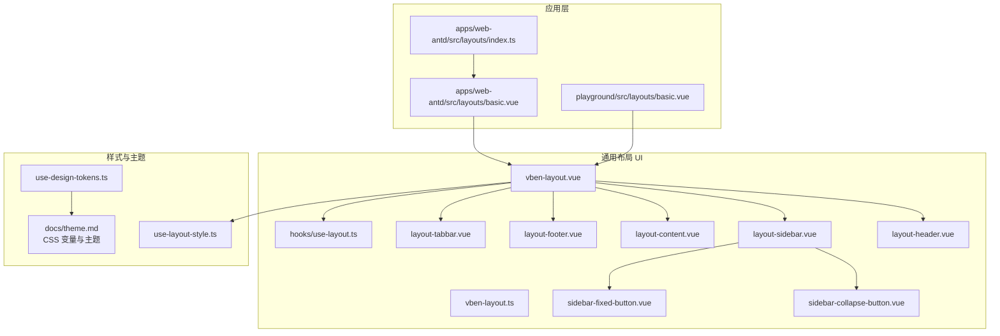
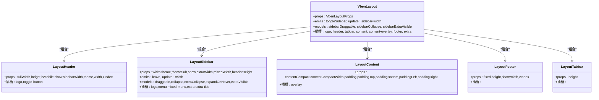
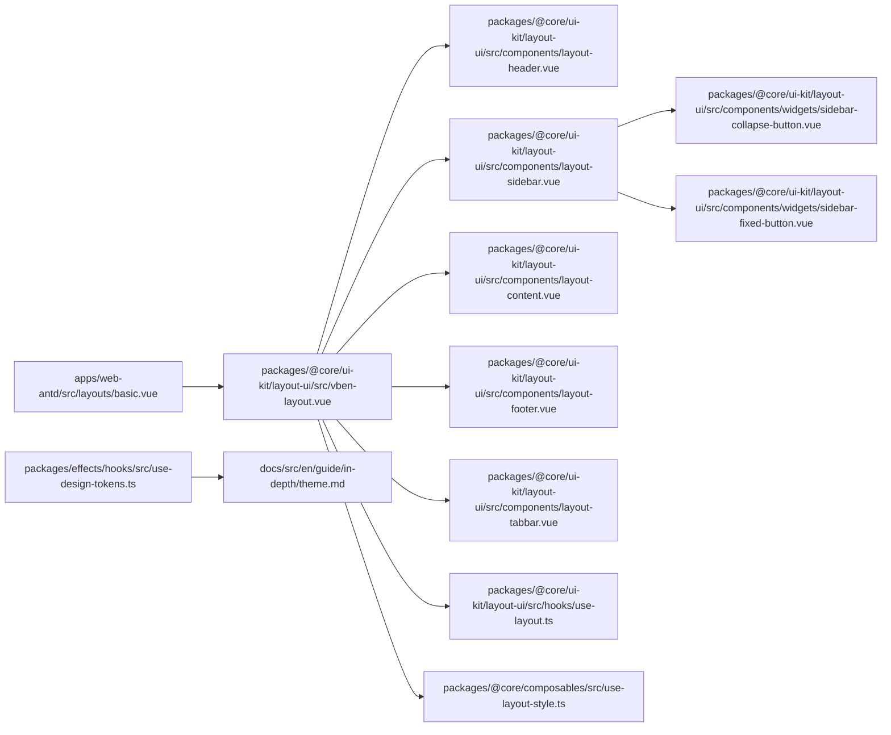

# 布局定制

<cite>
**本文引用的文件**
- [apps/web-antd/src/layouts/basic.vue](file://apps/web-antd/src/layouts/basic.vue)
- [apps/web-antd/src/layouts/index.ts](file://apps/web-antd/src/layouts/index.ts)
- [playground/src/layouts/basic.vue](file://playground/src/layouts/basic.vue)
- [packages/@core/ui-kit/layout-ui/src/vben-layout.vue](file://packages/@core/ui-kit/layout-ui/src/vben-layout.vue)
- [packages/@core/ui-kit/layout-ui/src/vben-layout.ts](file://packages/@core/ui-kit/layout-ui/src/vben-layout.ts)
- [packages/@core/ui-kit/layout-ui/src/components/layout-header.vue](file://packages/@core/ui-kit/layout-ui/src/components/layout-header.vue)
- [packages/@core/ui-kit/layout-ui/src/components/layout-sidebar.vue](file://packages/@core/ui-kit/layout-ui/src/components/layout-sidebar.vue)
- [packages/@core/ui-kit/layout-ui/src/components/layout-content.vue](file://packages/@core/ui-kit/layout-ui/src/components/layout-content.vue)
- [packages/@core/ui-kit/layout-ui/src/components/layout-footer.vue](file://packages/@core/ui-kit/layout-ui/src/components/layout-footer.vue)
- [packages/@core/ui-kit/layout-ui/src/components/layout-tabbar.vue](file://packages/@core/ui-kit/layout-ui/src/components/layout-tabbar.vue)
- [packages/@core/ui-kit/layout-ui/src/components/widgets/sidebar-collapse-button.vue](file://packages/@core/ui-kit/layout-ui/src/components/widgets/sidebar-collapse-button.vue)
- [packages/@core/ui-kit/layout-ui/src/components/widgets/sidebar-fixed-button.vue](file://packages/@core/ui-kit/layout-ui/src/components/widgets/sidebar-fixed-button.vue)
- [packages/@core/ui-kit/layout-ui/src/hooks/use-layout.ts](file://packages/@core/ui-kit/layout-ui/src/hooks/use-layout.ts)
- [packages/@core/composables/src/use-layout-style.ts](file://packages/@core/composables/src/use-layout-style.ts)
- [packages/effects/hooks/src/use-design-tokens.ts](file://packages/effects/hooks/src/use-design-tokens.ts)
- [docs/src/en/guide/in-depth/theme.md](file://docs/src/en/guide/in-depth/theme.md)
</cite>

## 目录

1. [简介](#简介)
2. [项目结构](#项目结构)
3. [核心组件](#核心组件)
4. [架构总览](#架构总览)
5. [详细组件解析](#详细组件解析)
6. [依赖关系分析](#依赖关系分析)
7. [性能考量](#性能考量)
8. [故障排查指南](#故障排查指南)
9. [结论](#结论)
10. [附录](#附录)

## 简介

本指南面向希望在 Vben Admin 中进行“布局定制”的开发者，系统讲解如何基于现有布局体系创建自定义布局组件、继承基础布局并重写关键方法、利用插槽系统实现内容替换、通过 CSS 变量与主题变量定制样式、理解生命周期与事件处理机制，并提供可落地的实践案例（如自定义侧边栏、修改头部样式、集成第三方组件）及测试与性能建议。

## 项目结构

Vben Admin 的布局体系由“应用层布局”和“通用布局 UI 组件库”两部分组成：

- 应用层布局：各框架适配包下的 basic.vue 作为业务布局容器，负责注入用户下拉、通知、锁屏等业务插槽内容。
- 通用布局 UI 组件库：提供 VbenLayout 及其子组件（Header/Sidebar/Content/Footer/Tabbar），并通过 hooks/use-layout.ts 进行布局模式计算与行为控制。

图表来源

- [apps/web-antd/src/layouts/basic.vue:1-207](file://apps/web-antd/src/layouts/basic.vue#L1-L207)
- [apps/web-antd/src/layouts/index.ts:1-7](file://apps/web-antd/src/layouts/index.ts#L1-L7)
- [playground/src/layouts/basic.vue:1-233](file://playground/src/layouts/basic.vue#L1-L233)
- [packages/@core/ui-kit/layout-ui/src/vben-layout.vue:1-635](file://packages/@core/ui-kit/layout-ui/src/vben-layout.vue#L1-L635)
- [packages/@core/ui-kit/layout-ui/src/vben-layout.ts:1-181](file://packages/@core/ui-kit/layout-ui/src/vben-layout.ts#L1-L181)
- [packages/@core/ui-kit/layout-ui/src/components/layout-header.vue:1-78](file://packages/@core/ui-kit/layout-ui/src/components/layout-header.vue#L1-L78)
- [packages/@core/ui-kit/layout-ui/src/components/layout-sidebar.vue:1-382](file://packages/@core/ui-kit/layout-ui/src/components/layout-sidebar.vue#L1-L382)
- [packages/@core/ui-kit/layout-ui/src/components/layout-content.vue:1-66](file://packages/@core/ui-kit/layout-ui/src/components/layout-content.vue#L1-L66)
- [packages/@core/ui-kit/layout-ui/src/components/layout-footer.vue:1-45](file://packages/@core/ui-kit/layout-ui/src/components/layout-footer.vue#L1-L45)
- [packages/@core/ui-kit/layout-ui/src/components/layout-tabbar.vue:1-31](file://packages/@core/ui-kit/layout-ui/src/components/layout-tabbar.vue#L1-L31)
- [packages/@core/ui-kit/layout-ui/src/components/widgets/sidebar-collapse-button.vue:1-20](file://packages/@core/ui-kit/layout-ui/src/components/widgets/sidebar-collapse-button.vue#L1-L20)
- [packages/@core/ui-kit/layout-ui/src/components/widgets/sidebar-fixed-button.vue:1-20](file://packages/@core/ui-kit/layout-ui/src/components/widgets/sidebar-fixed-button.vue#L1-L20)
- [packages/@core/ui-kit/layout-ui/src/hooks/use-layout.ts:1-54](file://packages/@core/ui-kit/layout-ui/src/hooks/use-layout.ts#L1-L54)
- [packages/@core/composables/src/use-layout-style.ts:48-87](file://packages/@core/composables/src/use-layout-style.ts#L48-L87)
- [packages/effects/hooks/src/use-design-tokens.ts:47-149](file://packages/effects/hooks/src/use-design-tokens.ts#L47-L149)
- [docs/src/en/guide/in-depth/theme.md:27-219](file://docs/src/en/guide/in-depth/theme.md#L27-L219)

章节来源

- [apps/web-antd/src/layouts/basic.vue:1-207](file://apps/web-antd/src/layouts/basic.vue#L1-L207)
- [packages/@core/ui-kit/layout-ui/src/vben-layout.vue:1-635](file://packages/@core/ui-kit/layout-ui/src/vben-layout.vue#L1-L635)

## 核心组件

- VbenLayout：布局根容器，负责计算布局模式、尺寸、z-index、遮罩、滚动与自动隐藏等行为；提供大量插槽用于注入内容。
- 子组件：
  - LayoutHeader：顶部区域，支持 logo 插槽、切换按钮插槽与通用 header 插槽。
  - LayoutSidebar：侧边栏，支持 logo、菜单、扩展区、折叠按钮、固定按钮等插槽。
  - LayoutContent：内容区，支持 overlay 插槽与普通内容插槽。
  - LayoutFooter：底部区域，支持插槽。
  - LayoutTabbar：页签区，支持插槽。
- 工具与样式：
  - hooks/use-layout.ts：根据 props 计算当前布局类型与模式（如混合导航、侧边混合等）。
  - use-layout-style.ts：通过 CSS 变量维护 Header/Foot 高度，供布局计算使用。
  - use-design-tokens.ts：从 CSS 变量映射设计令牌，便于 UI 框架消费。

章节来源

- [packages/@core/ui-kit/layout-ui/src/vben-layout.vue:1-635](file://packages/@core/ui-kit/layout-ui/src/vben-layout.vue#L1-L635)
- [packages/@core/ui-kit/layout-ui/src/components/layout-header.vue:1-78](file://packages/@core/ui-kit/layout-ui/src/components/layout-header.vue#L1-L78)
- [packages/@core/ui-kit/layout-ui/src/components/layout-sidebar.vue:1-382](file://packages/@core/ui-kit/layout-ui/src/components/layout-sidebar.vue#L1-L382)
- [packages/@core/ui-kit/layout-ui/src/components/layout-content.vue:1-66](file://packages/@core/ui-kit/layout-ui/src/components/layout-content.vue#L1-L66)
- [packages/@core/ui-kit/layout-ui/src/components/layout-footer.vue:1-45](file://packages/@core/ui-kit/layout-ui/src/components/layout-footer.vue#L1-L45)
- [packages/@core/ui-kit/layout-ui/src/components/layout-tabbar.vue:1-31](file://packages/@core/ui-kit/layout-ui/src/components/layout-tabbar.vue#L1-L31)
- [packages/@core/ui-kit/layout-ui/src/hooks/use-layout.ts:1-54](file://packages/@core/ui-kit/layout-ui/src/hooks/use-layout.ts#L1-L54)
- [packages/@core/composables/src/use-layout-style.ts:48-87](file://packages/@core/composables/src/use-layout-style.ts#L48-L87)
- [packages/effects/hooks/src/use-design-tokens.ts:47-149](file://packages/effects/hooks/src/use-design-tokens.ts#L47-L149)

## 架构总览

VbenLayout 将 Header、Sidebar、Content、Footer、Tabbar 组织为一个完整的页面骨架，通过 props 控制布局模式与外观，通过 emits 与 v-model 暴露交互状态，通过插槽实现内容替换与扩展。

图表来源

- [packages/@core/ui-kit/layout-ui/src/vben-layout.vue:1-635](file://packages/@core/ui-kit/layout-ui/src/vben-layout.vue#L1-L635)
- [packages/@core/ui-kit/layout-ui/src/components/layout-header.vue:1-78](file://packages/@core/ui-kit/layout-ui/src/components/layout-header.vue#L1-L78)
- [packages/@core/ui-kit/layout-ui/src/components/layout-sidebar.vue:1-382](file://packages/@core/ui-kit/layout-ui/src/components/layout-sidebar.vue#L1-L382)
- [packages/@core/ui-kit/layout-ui/src/components/layout-content.vue:1-66](file://packages/@core/ui-kit/layout-ui/src/components/layout-content.vue#L1-L66)
- [packages/@core/ui-kit/layout-ui/src/components/layout-footer.vue:1-45](file://packages/@core/ui-kit/layout-ui/src/components/layout-footer.vue#L1-L45)
- [packages/@core/ui-kit/layout-ui/src/components/layout-tabbar.vue:1-31](file://packages/@core/ui-kit/layout-ui/src/components/layout-tabbar.vue#L1-L31)

## 详细组件解析

### 基础布局与继承要点

- 应用层布局（如 basic.vue）通常直接包裹 VbenLayout，并通过具名插槽注入业务组件（如用户下拉、通知、锁屏等）。
- 自定义布局应遵循相同模式：引入 VbenLayout，按需开启/关闭各区域，使用插槽注入自定义内容，必要时重写事件或暴露新的 emits。

章节来源

- [apps/web-antd/src/layouts/basic.vue:172-206](file://apps/web-antd/src/layouts/basic.vue#L172-L206)
- [playground/src/layouts/basic.vue:194-232](file://playground/src/layouts/basic.vue#L194-L232)

### 插槽系统与内容替换机制

- VbenLayout 提供丰富插槽：
  - 顶部：logo、toggle-button、header
  - 侧边：logo、menu/mixed-menu、extra、extra-title
  - 内容：content、content-overlay
  - 底部：footer
  - 其他：extra、tabbar
- 子组件内部也提供插槽（如 LayoutHeader 的 logo/toggle-button；LayoutSidebar 的 logo/menu 等），形成“容器-子块”的多级插槽体系。
- 内容替换策略：
  - 在应用层布局中，将业务组件插入对应插槽，即可完成替换。
  - 若需更深层定制，可在应用层布局中直接渲染自定义子组件，覆盖默认子组件行为。

章节来源

- [packages/@core/ui-kit/layout-ui/src/vben-layout.vue:497-635](file://packages/@core/ui-kit/layout-ui/src/vben-layout.vue#L497-L635)
- [packages/@core/ui-kit/layout-ui/src/components/layout-header.vue:63-78](file://packages/@core/ui-kit/layout-ui/src/components/layout-header.vue#L63-L78)
- [packages/@core/ui-kit/layout-ui/src/components/layout-sidebar.vue:300-382](file://packages/@core/ui-kit/layout-ui/src/components/layout-sidebar.vue#L300-L382)

### 布局样式定制（CSS 变量、主题变量、响应式）

- CSS 变量与主题：
  - 文档提供了默认主题的 CSS 变量清单，涵盖背景、前景、主色、次色、强调色、输入边框、圆角等。
  - 使用 use-design-tokens.ts 可将 CSS 变量映射为 UI 框架可用的设计令牌，便于统一主题风格。
- 布局样式控制：
  - use-layout-style.ts 通过 CSS 变量维护 Header/Foot 高度，VbenLayout 在计算 HeaderWrapper 高度与内容区 marginTop 时会读取这些变量。
  - 响应式与移动端：props.isMobile 会强制切换为 sidebar-nav 布局，并影响侧边栏折叠状态与遮罩显示。
- 实践建议：
  - 通过修改 CSS 变量快速切换主题色板与组件色系。
  - 对于复杂主题切换，建议在根节点切换 data-theme 属性，配合暗色变量段生效。

章节来源

- [docs/src/en/guide/in-depth/theme.md:27-219](file://docs/src/en/guide/in-depth/theme.md#L27-L219)
- [packages/effects/hooks/src/use-design-tokens.ts:47-149](file://packages/effects/hooks/src/use-design-tokens.ts#L47-L149)
- [packages/@core/composables/src/use-layout-style.ts:48-87](file://packages/@core/composables/src/use-layout-style.ts#L48-L87)
- [packages/@core/ui-kit/layout-ui/src/vben-layout.vue:386-396](file://packages/@core/ui-kit/layout-ui/src/vben-layout.vue#L386-L396)

### 生命周期钩子与事件处理机制

- 生命周期：
  - VbenLayout 在 mounted 后初始化滚动监听、鼠标位置监听、水印更新等逻辑；在 unmounted 时清理 ResizeObserver 与拖拽事件。
  - 子组件在 mounted/unmounted 时执行自身资源管理（如拖拽、滚动锁定）。
- 事件与状态：
  - VbenLayout 暴露 toggleSidebar、update:sidebar-width、sideMouseLeave 等事件；通过 v-model 控制 sidebarDraggable、sidebarCollapse、sidebarExtraVisible 等状态。
  - LayoutSidebar 支持拖拽调整宽度，并通过 update:width 事件回传给父容器。
  - 自动隐藏 Header：根据 headerMode 与鼠标位置或滚动方向动态隐藏/显示。

章节来源

- [packages/@core/ui-kit/layout-ui/src/vben-layout.vue:482-494](file://packages/@core/ui-kit/layout-ui/src/vben-layout.vue#L482-L494)
- [packages/@core/ui-kit/layout-ui/src/vben-layout.vue:418-480](file://packages/@core/ui-kit/layout-ui/src/vben-layout.vue#L418-L480)
- [packages/@core/ui-kit/layout-ui/src/components/layout-sidebar.vue:265-297](file://packages/@core/ui-kit/layout-ui/src/components/layout-sidebar.vue#L265-L297)

### 关键方法与配置项重写

- 布局模式计算：hooks/use-layout.ts 根据 props.isMobile 与 props.layout 计算 currentLayout，并导出 isSidebarMixedNav、isHeaderNav、isMixedNav、isHeaderMixedNav 等布尔值，用于模板条件渲染。
- 样式计算：VbenLayout 内部大量 computed 用于计算 HeaderWrapper 高度、主内容区宽度、Tabbar 宽度、Footer 宽度、遮罩样式等，均可作为重写点。
- 行为开关：props 如 headerMode、footerEnable、tabbarEnable、sidebarEnable、sidebarHidden、sidebarCollapseShowTitle 等，均可在自定义布局中按需启用/禁用。

章节来源

- [packages/@core/ui-kit/layout-ui/src/hooks/use-layout.ts:1-54](file://packages/@core/ui-kit/layout-ui/src/hooks/use-layout.ts#L1-L54)
- [packages/@core/ui-kit/layout-ui/src/vben-layout.vue:116-322](file://packages/@core/ui-kit/layout-ui/src/vben-layout.vue#L116-L322)
- [packages/@core/ui-kit/layout-ui/src/vben-layout.ts:1-181](file://packages/@core/ui-kit/layout-ui/src/vben-layout.ts#L1-L181)

### 实际定制案例

#### 案例一：添加自定义侧边栏

- 步骤：
  - 在应用层布局中，将自定义侧边栏组件放入 LayoutSidebar 的 menu 或 extra 插槽。
  - 若需与混合导航联动，可结合 isSidebarMixedNav/isHeaderMixedNav 条件渲染。
  - 如需拖拽宽度，确保监听 update:width 并同步到自定义侧边栏状态。
- 参考路径：
  - [packages/@core/ui-kit/layout-ui/src/components/layout-sidebar.vue:300-382](file://packages/@core/ui-kit/layout-ui/src/components/layout-sidebar.vue#L300-L382)
  - [packages/@core/ui-kit/layout-ui/src/vben-layout.vue:524-542](file://packages/@core/ui-kit/layout-ui/src/vben-layout.vue#L524-L542)

#### 案例二：修改头部样式

- 步骤：
  - 通过 props.headerTheme 切换主题；或在 LayoutHeader 上直接绑定类名。
  - 使用 logo 插槽替换 Logo 区域；使用 header 插槽注入自定义头部组件。
  - 结合 use-layout-style.ts 设置 Header 高度，确保内容区 marginTop 正确。
- 参考路径：
  - [packages/@core/ui-kit/layout-ui/src/components/layout-header.vue:63-78](file://packages/@core/ui-kit/layout-ui/src/components/layout-header.vue#L63-L78)
  - [packages/@core/ui-kit/layout-ui/src/vben-layout.vue:558-584](file://packages/@core/ui-kit/layout-ui/src/vben-layout.vue#L558-L584)
  - [packages/@core/composables/src/use-layout-style.ts:63-74](file://packages/@core/composables/src/use-layout-style.ts#L63-L74)

#### 案例三：集成第三方组件

- 步骤：
  - 在应用层布局中，将第三方组件插入对应插槽（如 notification、user-dropdown、lock-screen 等）。
  - 注意第三方组件的尺寸与主题一致性，必要时通过 CSS 变量或内联样式微调。
- 参考路径：
  - [apps/web-antd/src/layouts/basic.vue:172-206](file://apps/web-antd/src/layouts/basic.vue#L172-L206)
  - [playground/src/layouts/basic.vue:194-232](file://playground/src/layouts/basic.vue#L194-L232)

### 测试方法与最佳实践

- 单元测试思路（以 Page 组件为例，展示插槽行为）：
  - 验证当提供 title/description 时，不会渲染对应插槽内容，体现“优先级”规则。
  - 验证插槽内容被正确渲染，避免误删。
- 建议：
  - 为自定义布局编写 E2E 测试，覆盖不同布局模式（移动端/桌面端）、不同 headerMode（fixed/auto/auto-scroll）、侧边栏折叠/展开、遮罩点击等场景。
  - 对于复杂交互（拖拽、滚动、自动隐藏），使用工具函数节流/防抖，避免频繁重排。

章节来源

- [packages/effects/common-ui/src/components/page/**tests**/page.test.ts:58-89](file://packages/effects/common-ui/src/components/page/__tests__/page.test.ts#L58-L89)

## 依赖关系分析

图表来源

- [apps/web-antd/src/layouts/basic.vue:1-207](file://apps/web-antd/src/layouts/basic.vue#L1-L207)
- [packages/@core/ui-kit/layout-ui/src/vben-layout.vue:1-635](file://packages/@core/ui-kit/layout-ui/src/vben-layout.vue#L1-L635)
- [packages/@core/ui-kit/layout-ui/src/components/layout-header.vue:1-78](file://packages/@core/ui-kit/layout-ui/src/components/layout-header.vue#L1-L78)
- [packages/@core/ui-kit/layout-ui/src/components/layout-sidebar.vue:1-382](file://packages/@core/ui-kit/layout-ui/src/components/layout-sidebar.vue#L1-L382)
- [packages/@core/ui-kit/layout-ui/src/components/layout-content.vue:1-66](file://packages/@core/ui-kit/layout-ui/src/components/layout-content.vue#L1-L66)
- [packages/@core/ui-kit/layout-ui/src/components/layout-footer.vue:1-45](file://packages/@core/ui-kit/layout-ui/src/components/layout-footer.vue#L1-L45)
- [packages/@core/ui-kit/layout-ui/src/components/layout-tabbar.vue:1-31](file://packages/@core/ui-kit/layout-ui/src/components/layout-tabbar.vue#L1-L31)
- [packages/@core/ui-kit/layout-ui/src/components/widgets/sidebar-collapse-button.vue:1-20](file://packages/@core/ui-kit/layout-ui/src/components/widgets/sidebar-collapse-button.vue#L1-L20)
- [packages/@core/ui-kit/layout-ui/src/components/widgets/sidebar-fixed-button.vue:1-20](file://packages/@core/ui-kit/layout-ui/src/components/widgets/sidebar-fixed-button.vue#L1-L20)
- [packages/@core/ui-kit/layout-ui/src/hooks/use-layout.ts:1-54](file://packages/@core/ui-kit/layout-ui/src/hooks/use-layout.ts#L1-L54)
- [packages/@core/composables/src/use-layout-style.ts:48-87](file://packages/@core/composables/src/use-layout-style.ts#L48-L87)
- [packages/effects/hooks/src/use-design-tokens.ts:47-149](file://packages/effects/hooks/src/use-design-tokens.ts#L47-L149)
- [docs/src/en/guide/in-depth/theme.md:27-219](file://docs/src/en/guide/in-depth/theme.md#L27-L219)

## 性能考量

- 渲染与重排：
  - VbenLayout 内部大量 computed 与监听器（滚动、鼠标、尺寸变化）可能引发频繁重排。建议：
    - 对滚动与鼠标事件使用节流/防抖。
    - 合理设置 contentPadding、contentCompact 等属性，避免不必要的大范围重绘。
- 拖拽与遮罩：
  - 拖拽侧边栏时限制最小/最大宽度，减少 DOM 更新频率。
  - 遮罩仅在移动端或特定模式下显示，避免常驻渲染。
- 主题切换：
  - 通过 CSS 变量切换主题，避免全量替换类名导致的重排；必要时批量更新。

## 故障排查指南

- 问题：Header 未正确隐藏/显示
  - 排查：headerMode 是否为 auto/auto-scroll；鼠标位置与滚动方向是否触发；isHeaderAutoMode 计算是否符合预期。
  - 参考路径：
    - [packages/@core/ui-kit/layout-ui/src/vben-layout.vue:418-480](file://packages/@core/ui-kit/layout-ui/src/vben-layout.vue#L418-L480)
- 问题：侧边栏宽度不生效或无法拖拽
  - 排查：update:width 事件是否正确回传；min/max 限制是否合理；isSidebarMixed 与 extraCollapse 是否影响宽度计算。
  - 参考路径：
    - [packages/@core/ui-kit/layout-ui/src/components/layout-sidebar.vue:265-297](file://packages/@core/ui-kit/layout-ui/src/components/layout-sidebar.vue#L265-L297)
- 问题：内容区 marginTop 异常
  - 排查：use-layout-style.ts 中 Header 高度是否正确设置；headerWrapperHeight 计算是否包含 Tabbar 高度。
  - 参考路径：
    - [packages/@core/composables/src/use-layout-style.ts:63-74](file://packages/@core/composables/src/use-layout-style.ts#L63-L74)
    - [packages/@core/ui-kit/layout-ui/src/vben-layout.vue:116-127](file://packages/@core/ui-kit/layout-ui/src/vben-layout.vue#L116-L127)

章节来源

- [packages/@core/ui-kit/layout-ui/src/vben-layout.vue:418-480](file://packages/@core/ui-kit/layout-ui/src/vben-layout.vue#L418-L480)
- [packages/@core/ui-kit/layout-ui/src/components/layout-sidebar.vue:265-297](file://packages/@core/ui-kit/layout-ui/src/components/layout-sidebar.vue#L265-L297)
- [packages/@core/composables/src/use-layout-style.ts:63-74](file://packages/@core/composables/src/use-layout-style.ts#L63-L74)

## 结论

通过 VbenLayout 的插槽体系与丰富的 props/emit，开发者可以灵活地定制布局：替换任意区域内容、控制布局模式、接入第三方组件、统一主题风格。结合 CSS 变量与设计令牌，既能快速迭代视觉风格，又能保证跨组件的一致性。建议在定制过程中关注性能与可测试性，确保在多场景下稳定运行。

## 附录

### 常用插槽一览

- VbenLayout：logo、header、tabbar、content、content-overlay、footer、extra
- LayoutHeader：logo、toggle-button
- LayoutSidebar：logo、menu/mixed-menu、extra、extra-title
- LayoutContent：overlay
- LayoutTabbar：无具名插槽，直接放置内容
- LayoutFooter：无具名插槽，直接放置内容

章节来源

- [packages/@core/ui-kit/layout-ui/src/vben-layout.vue:497-635](file://packages/@core/ui-kit/layout-ui/src/vben-layout.vue#L497-L635)
- [packages/@core/ui-kit/layout-ui/src/components/layout-header.vue:63-78](file://packages/@core/ui-kit/layout-ui/src/components/layout-header.vue#L63-L78)
- [packages/@core/ui-kit/layout-ui/src/components/layout-sidebar.vue:300-382](file://packages/@core/ui-kit/layout-ui/src/components/layout-sidebar.vue#L300-L382)
- [packages/@core/ui-kit/layout-ui/src/components/layout-content.vue:58-66](file://packages/@core/ui-kit/layout-ui/src/components/layout-content.vue#L58-L66)
- [packages/@core/ui-kit/layout-ui/src/components/layout-tabbar.vue:23-31](file://packages/@core/ui-kit/layout-ui/src/components/layout-tabbar.vue#L23-L31)
- [packages/@core/ui-kit/layout-ui/src/components/layout-footer.vue:37-45](file://packages/@core/ui-kit/layout-ui/src/components/layout-footer.vue#L37-L45)
