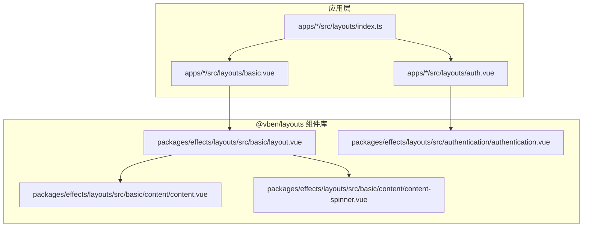
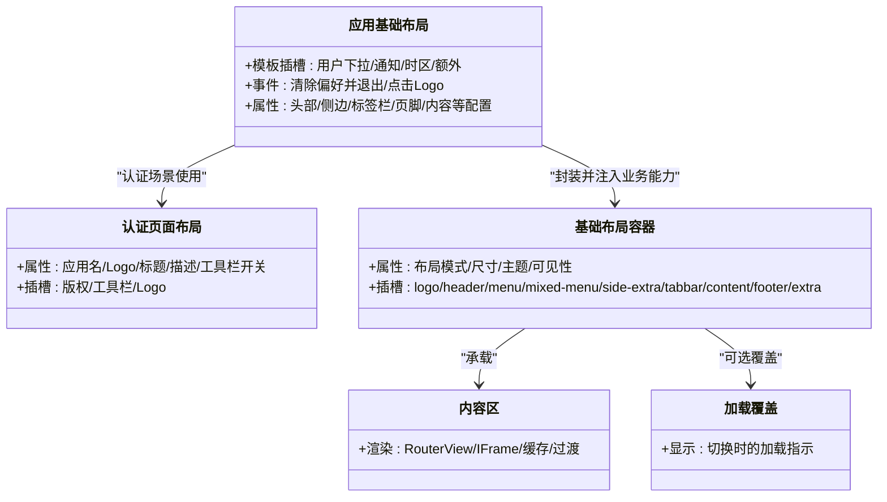
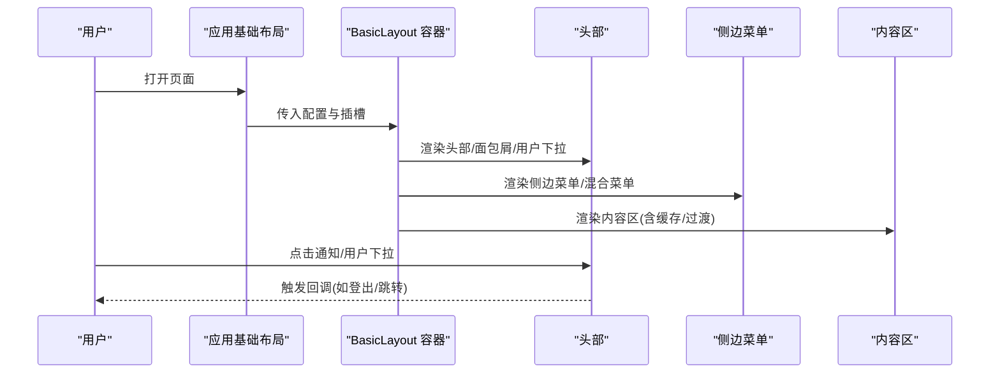
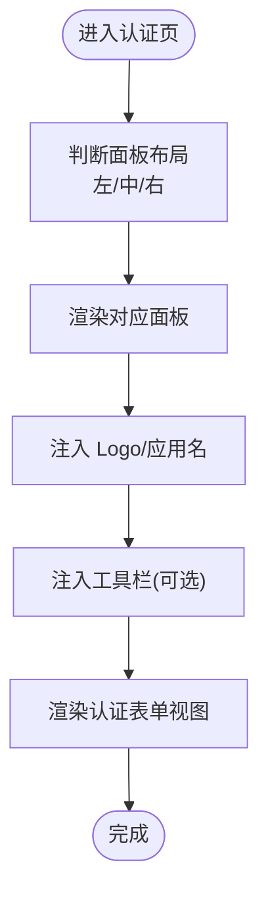
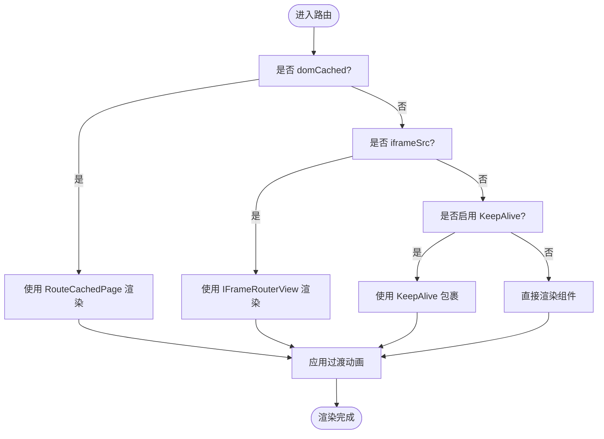
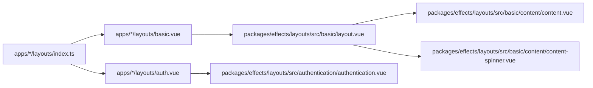

# 布局系统

<cite>
**本文引用的文件**
- [apps/web-antd/src/layouts/basic.vue](file://apps/web-antd/src/layouts/basic.vue)
- [apps/web-antd/src/layouts/auth.vue](file://apps/web-antd/src/layouts/auth.vue)
- [apps/web-antd/src/layouts/index.ts](file://apps/web-antd/src/layouts/index.ts)
- [playground/src/layouts/basic.vue](file://playground/src/layouts/basic.vue)
- [playground/src/layouts/auth.vue](file://playground/src/layouts/auth.vue)
- [playground/src/layouts/index.ts](file://playground/src/layouts/index.ts)
- [packages/effects/layouts/src/basic/layout.vue](file://packages/effects/layouts/src/basic/layout.vue)
- [packages/effects/layouts/src/authentication/authentication.vue](file://packages/effects/layouts/src/authentication/authentication.vue)
- [packages/effects/layouts/src/basic/content/content.vue](file://packages/effects/layouts/src/basic/content/content.vue)
- [packages/effects/layouts/src/basic/content/content-spinner.vue](file://packages/effects/layouts/src/basic/content/content-spinner.vue)
</cite>

## 目录
1. [简介](#简介)
2. [项目结构](#项目结构)
3. [核心组件](#核心组件)
4. [架构总览](#架构总览)
5. [详细组件分析](#详细组件分析)
6. [依赖分析](#依赖分析)
7. [性能考虑](#性能考虑)
8. [故障排查指南](#故障排查指南)
9. [结论](#结论)
10. [附录](#附录)

## 简介
本指南聚焦于 Vben Admin 的布局系统实现，系统性阐述基础布局、认证布局与自定义布局的设计模式与落地方式；解释布局的嵌套结构与内容区域划分；介绍响应式与适配机制；提供样式与行为的可定制路径；说明布局与路由的联动关系及动态切换策略，并总结生命周期管理与性能优化实践。

## 项目结构
Vben Admin 将“布局”抽象为可复用的组件库（@vben/layouts），并在各 Web 应用中以“业务封装层”进行二次组合与注入。典型结构如下：
- 基础布局：由 @vben/layouts 提供的 BasicLayout 组件承载头部、侧边、标签页、内容区、页脚等区域，并通过插槽扩展用户下拉、通知、锁屏等能力。
- 认证布局：用于登录/注册等页面，支持左右/中心三面板布局与工具栏、版权信息等。
- 业务封装层：在 apps/*/src/layouts 下，对基础布局进行业务化封装，注入用户态、权限态、水印、过期弹窗等。

图表来源
- [apps/web-antd/src/layouts/basic.vue:172-206](file://apps/web-antd/src/layouts/basic.vue#L172-L206)
- [apps/web-antd/src/layouts/auth.vue:14-25](file://apps/web-antd/src/layouts/auth.vue#L14-L25)
- [apps/web-antd/src/layouts/index.ts:1-7](file://apps/web-antd/src/layouts/index.ts#L1-L7)
- [packages/effects/layouts/src/basic/layout.vue:216-431](file://packages/effects/layouts/src/basic/layout.vue#L216-L431)
- [packages/effects/layouts/src/authentication/authentication.vue:55-171](file://packages/effects/layouts/src/authentication/authentication.vue#L55-L171)
- [packages/effects/layouts/src/basic/content/content.vue:33-88](file://packages/effects/layouts/src/basic/content/content.vue#L33-L88)
- [packages/effects/layouts/src/basic/content/content-spinner.vue:10-12](file://packages/effects/layouts/src/basic/content/content-spinner.vue#L10-L12)

章节来源
- [apps/web-antd/src/layouts/basic.vue:1-207](file://apps/web-antd/src/layouts/basic.vue#L1-L207)
- [apps/web-antd/src/layouts/auth.vue:1-26](file://apps/web-antd/src/layouts/auth.vue#L1-L26)
- [apps/web-antd/src/layouts/index.ts:1-7](file://apps/web-antd/src/layouts/index.ts#L1-L7)
- [playground/src/layouts/basic.vue:1-233](file://playground/src/layouts/basic.vue#L1-L233)
- [playground/src/layouts/auth.vue:1-26](file://playground/src/layouts/auth.vue#L1-L26)
- [playground/src/layouts/index.ts:1-7](file://playground/src/layouts/index.ts#L1-L7)
- [packages/effects/layouts/src/basic/layout.vue:1-432](file://packages/effects/layouts/src/basic/layout.vue#L1-L432)
- [packages/effects/layouts/src/authentication/authentication.vue:1-197](file://packages/effects/layouts/src/authentication/authentication.vue#L1-L197)
- [packages/effects/layouts/src/basic/content/content.vue:1-89](file://packages/effects/layouts/src/basic/content/content.vue#L1-L89)
- [packages/effects/layouts/src/basic/content/content-spinner.vue:1-13](file://packages/effects/layouts/src/basic/content/content-spinner.vue#L1-L13)

## 核心组件
- 基础布局容器（BasicLayout）
  - 职责：统一承载头部、侧边、混合菜单、标签栏、内容区、页脚、全局覆盖层（如加载动画）、偏好设置按钮、锁屏等。
  - 关键点：通过大量属性与事件绑定控制布局状态（如折叠、固定、宽度、主题等）；通过具名插槽扩展用户下拉、通知、时区、额外内容等。
- 认证布局（AuthPageLayout）
  - 职责：为登录/注册等页面提供三面板布局（左/中/右）与工具栏、Logo、标题描述、版权等。
- 内容区（LayoutContent）
  - 职责：根据路由与缓存策略渲染页面或 iframe；支持过渡动画、KeepAlive 缓存、DOM 缓存等。
- 加载覆盖（LayoutContentSpinner）
  - 职责：在内容切换时显示加载指示器。

章节来源
- [packages/effects/layouts/src/basic/layout.vue:216-431](file://packages/effects/layouts/src/basic/layout.vue#L216-L431)
- [packages/effects/layouts/src/authentication/authentication.vue:55-171](file://packages/effects/layouts/src/authentication/authentication.vue#L55-L171)
- [packages/effects/layouts/src/basic/content/content.vue:33-88](file://packages/effects/layouts/src/basic/content/content.vue#L33-L88)
- [packages/effects/layouts/src/basic/content/content-spinner.vue:10-12](file://packages/effects/layouts/src/basic/content/content-spinner.vue#L10-L12)

## 架构总览
下面的类图展示了“应用层布局封装”与“@vben/layouts 组件库”的关系，以及关键交互：

图表来源
- [apps/web-antd/src/layouts/basic.vue:172-206](file://apps/web-antd/src/layouts/basic.vue#L172-L206)
- [apps/web-antd/src/layouts/auth.vue:14-25](file://apps/web-antd/src/layouts/auth.vue#L14-L25)
- [packages/effects/layouts/src/basic/layout.vue:216-431](file://packages/effects/layouts/src/basic/layout.vue#L216-L431)
- [packages/effects/layouts/src/basic/content/content.vue:33-88](file://packages/effects/layouts/src/basic/content/content.vue#L33-L88)
- [packages/effects/layouts/src/basic/content/content-spinner.vue:10-12](file://packages/effects/layouts/src/basic/content/content-spinner.vue#L10-L12)

## 详细组件分析

### 基础布局（BasicLayout）设计与嵌套结构
- 嵌套层次
  - 外层容器：VbenAdminLayout（@vben-core/ui），负责整体布局骨架与状态管理。
  - 顶部区域：LayoutHeader（头部菜单、面包屑、用户下拉、通知、时区等）。
  - 侧边区域：LayoutMenu（垂直侧边菜单）+ LayoutExtraMenu（侧边额外区域，如混合菜单的扩展）。
  - 标签栏：LayoutTabbar（多页签导航）。
  - 内容区：LayoutContent（RouterView/IFrame/缓存/过渡）。
  - 页脚：LayoutFooter（可选版权）。
  - 额外层：锁屏、偏好设置按钮、回到顶部等。
- 插槽与事件
  - 具名插槽：logo、header、menu、mixed-menu、side-extra、side-extra-title、tabbar、content、content-overlay、footer、extra。
  - 事件：toggle-sidebar、update:*、clear-preferences-and-logout、click-logo。
- 动态行为
  - 响应式：isMobile 控制移动端体验；不同布局模式（如 header-mixed-nav、sidebar-mixed-nav）下菜单与可见性自动调整。
  - 菜单联动：根据路由 meta 控制菜单激活与混合菜单展开；语言/时区变化触发刷新。
  - 偏好设置：通过 usePreferences 更新布局参数，驱动容器属性实时变化。

图表来源
- [apps/web-antd/src/layouts/basic.vue:172-206](file://apps/web-antd/src/layouts/basic.vue#L172-L206)
- [packages/effects/layouts/src/basic/layout.vue:294-395](file://packages/effects/layouts/src/basic/layout.vue#L294-L395)

章节来源
- [packages/effects/layouts/src/basic/layout.vue:216-431](file://packages/effects/layouts/src/basic/layout.vue#L216-L431)

### 认证布局（AuthPageLayout）设计与使用
- 结构特性
  - 支持左侧/右侧/中心三种认证面板布局，配合工具栏（颜色/语言/布局/主题）与 Logo 展示。
  - 支持版权信息插槽与自定义 Logo 区域。
- 使用方式
  - 在应用层通过 AuthPageLayout 包裹认证表单视图，注入应用名、Logo、标题描述等。
  - 可通过插槽扩展版权、工具栏、Logo 点击行为等。

图表来源
- [packages/effects/layouts/src/authentication/authentication.vue:55-171](file://packages/effects/layouts/src/authentication/authentication.vue#L55-L171)
- [apps/web-antd/src/layouts/auth.vue:14-25](file://apps/web-antd/src/layouts/auth.vue#L14-L25)

章节来源
- [packages/effects/layouts/src/authentication/authentication.vue:1-197](file://packages/effects/layouts/src/authentication/authentication.vue#L1-L197)
- [apps/web-antd/src/layouts/auth.vue:1-26](file://apps/web-antd/src/layouts/auth.vue#L1-L26)

### 内容区渲染与路由联动
- 渲染策略
  - DOM 缓存：支持将路由标记为 domCached，采用 RouteCachedPage 渲染，避免重复挂载。
  - IFrame：当路由 meta.iframeSrc 存在时，使用 IFrameRouterView 承载外部页面。
  - KeepAlive：根据 tabbar 缓存策略 include/exclude 控制缓存范围。
  - 过渡动画：根据 useLayoutHook 返回的过渡名称与启用状态，为页面切换提供动效。
- 生命周期与刷新
  - 语言/时区变更时触发刷新，确保菜单与文案正确展示。
  - 路由 meta 控制菜单隐藏与混合菜单展开状态。

图表来源
- [packages/effects/layouts/src/basic/content/content.vue:33-88](file://packages/effects/layouts/src/basic/content/content.vue#L33-L88)

章节来源
- [packages/effects/layouts/src/basic/content/content.vue:1-89](file://packages/effects/layouts/src/basic/content/content.vue#L1-L89)

### 响应式设计与适配机制
- 移动端适配
  - isMobile 模式下，侧边栏默认折叠；Logo 在折叠时居中显示；头部导航模式自动切换。
- 布局模式
  - 支持多种布局模式（如 header-mixed-nav、sidebar-mixed-nav 等），在切换时自动处理侧边可见性与宽度。
- 主题与外观
  - 头部/侧边/子菜单主题根据 isDark 与偏好配置动态计算，支持半暗主题。
- 偏好设置联动
  - 通过 usePreferences 获取/更新布局参数，容器属性随偏好变化即时生效。

章节来源
- [packages/effects/layouts/src/basic/layout.vue:58-102](file://packages/effects/layouts/src/basic/layout.vue#L58-L102)
- [packages/effects/layouts/src/basic/layout.vue:183-194](file://packages/effects/layouts/src/basic/layout.vue#L183-L194)

### 样式定制与组件配置
- 头部区域
  - 通过插槽注入用户下拉、通知、时区等；可按需显示面包屑与水平菜单。
- 侧边区域
  - 侧边菜单与混合菜单支持圆角风格、手风琴模式、折叠/展开行为、主题等。
- 标签栏
  - 可配置高度、图标显示、主题等。
- 内容区
  - 支持内容定宽(compact)、内边距、过渡动画等。
- 页脚与版权
  - 可开启/关闭、固定、高度、版权信息等。
- 偏好设置按钮
  - 可固定定位到右侧，支持一键清除偏好并退出。

章节来源
- [packages/effects/layouts/src/basic/layout.vue:216-431](file://packages/effects/layouts/src/basic/layout.vue#L216-L431)

### 布局与路由的联动与动态切换
- 菜单激活与路由联动
  - 根据当前路由与菜单树映射，自动高亮匹配菜单项；混合菜单模式下根据路由 meta 控制额外菜单展开。
- 动态布局切换
  - 切换布局模式时，自动处理侧边可见性与折叠状态，保证用户体验一致。
- 语言与时区刷新
  - 语言与时间变更后触发页面刷新，确保菜单与文案同步更新。

章节来源
- [packages/effects/layouts/src/basic/layout.vue:164-181](file://packages/effects/layouts/src/basic/layout.vue#L164-L181)
- [packages/effects/layouts/src/basic/layout.vue:203-208](file://packages/effects/layouts/src/basic/layout.vue#L203-L208)

### 生命周期管理与性能优化
- 生命周期
  - onMounted 中根据路由 meta 自动处理混合菜单展开状态。
  - watch 监听布局模式与偏好设置，实时更新容器属性。
- 性能优化
  - KeepAlive 缓存：仅缓存必要页面，排除不需要的页面，减少重复渲染。
  - DOM 缓存：对复杂页面采用 domCached，避免重复挂载。
  - 过渡动画：按需启用，避免不必要的动画开销。
  - 水印与锁屏：按需启用，避免无用渲染。

章节来源
- [packages/effects/layouts/src/basic/layout.vue:177-181](file://packages/effects/layouts/src/basic/layout.vue#L177-L181)
- [packages/effects/layouts/src/basic/layout.vue:183-194](file://packages/effects/layouts/src/basic/layout.vue#L183-L194)
- [apps/web-antd/src/layouts/basic.vue:150-169](file://apps/web-antd/src/layouts/basic.vue#L150-L169)

## 依赖分析
- 应用层到组件库
  - apps/*/src/layouts/basic.vue 与 auth.vue 分别封装 @vben/layouts 的 BasicLayout 与 AuthPageLayout。
  - 通过 index.ts 导出懒加载组件，降低首屏体积。
- 组件库内部
  - BasicLayout 依赖 @vben-core/ui 的 VbenAdminLayout 作为容器；内部组合 LayoutHeader、LayoutMenu、LayoutTabbar、LayoutContent、LayoutFooter 等。
  - LayoutContent 依赖 RouterView、IFrameRouterView、RouteCachedPage/View 与缓存策略。
- 外部依赖
  - 偏好设置（preferences）、国际化（i18n）、访问/用户/标签栏 Store、刷新 Hook 等。

图表来源
- [apps/web-antd/src/layouts/index.ts:1-7](file://apps/web-antd/src/layouts/index.ts#L1-L7)
- [apps/web-antd/src/layouts/basic.vue:172-206](file://apps/web-antd/src/layouts/basic.vue#L172-L206)
- [apps/web-antd/src/layouts/auth.vue:14-25](file://apps/web-antd/src/layouts/auth.vue#L14-L25)
- [packages/effects/layouts/src/basic/layout.vue:216-431](file://packages/effects/layouts/src/basic/layout.vue#L216-L431)
- [packages/effects/layouts/src/authentication/authentication.vue:55-171](file://packages/effects/layouts/src/authentication/authentication.vue#L55-L171)
- [packages/effects/layouts/src/basic/content/content.vue:33-88](file://packages/effects/layouts/src/basic/content/content.vue#L33-L88)
- [packages/effects/layouts/src/basic/content/content-spinner.vue:10-12](file://packages/effects/layouts/src/basic/content/content-spinner.vue#L10-L12)

章节来源
- [apps/web-antd/src/layouts/index.ts:1-7](file://apps/web-antd/src/layouts/index.ts#L1-L7)
- [playground/src/layouts/index.ts:1-7](file://playground/src/layouts/index.ts#L1-L7)

## 性能考虑
- 缓存策略
  - 合理使用 KeepAlive 与 domCached，避免重复渲染与挂载。
- 过渡与动画
  - 仅在必要时启用过渡动画，减少不必要的 DOM 变化。
- 懒加载与拆分
  - 通过动态导入与按需加载，降低首屏体积。
- 偏好设置与主题
  - 避免频繁更新导致的重绘，尽量批量更新或节流。

## 故障排查指南
- 登录过期弹窗未出现
  - 检查 accessStore.loginExpired 状态与应用层注入的 AuthenticationLoginExpiredModal 绑定。
- 通知列表不显示红点
  - 检查通知数组中是否存在未读项，以及 showDot 的计算逻辑。
- 水印未生效或异常
  - 检查偏好设置中水印开关与内容，确认 watch 偏好设置的更新逻辑已执行。
- 页面切换闪烁或白屏
  - 检查过渡动画配置与缓存策略；确认 iframeSrc 与 domCached 的路由 meta 设置。
- 移动端菜单不可见
  - 检查 isMobile 模式下的侧边可见性与折叠状态，确认布局模式与偏好设置一致。

章节来源
- [apps/web-antd/src/layouts/basic.vue:150-169](file://apps/web-antd/src/layouts/basic.vue#L150-L169)
- [playground/src/layouts/basic.vue:166-191](file://playground/src/layouts/basic.vue#L166-L191)

## 结论
Vben Admin 的布局系统以“组件库 + 应用封装”的方式实现高内聚、低耦合的布局能力。通过 @vben/layouts 提供的基础布局容器与认证布局，结合应用层的业务封装，实现了灵活的布局模式、完善的路由联动与良好的性能表现。开发者可通过插槽与偏好设置快速定制头部、侧边、标签栏、内容区与页脚等模块，并在移动端与多主题环境下保持一致体验。

## 附录
- 快速定位
  - 基础布局封装：[apps/web-antd/src/layouts/basic.vue:1-207](file://apps/web-antd/src/layouts/basic.vue#L1-L207)
  - 认证布局封装：[apps/web-antd/src/layouts/auth.vue:1-26](file://apps/web-antd/src/layouts/auth.vue#L1-L26)
  - 基础布局容器：[packages/effects/layouts/src/basic/layout.vue:1-432](file://packages/effects/layouts/src/basic/layout.vue#L1-L432)
  - 认证布局容器：[packages/effects/layouts/src/authentication/authentication.vue:1-197](file://packages/effects/layouts/src/authentication/authentication.vue#L1-L197)
  - 内容区渲染：[packages/effects/layouts/src/basic/content/content.vue:1-89](file://packages/effects/layouts/src/basic/content/content.vue#L1-L89)
  - 加载覆盖：[packages/effects/layouts/src/basic/content/content-spinner.vue:1-13](file://packages/effects/layouts/src/basic/content/content-spinner.vue#L1-L13)