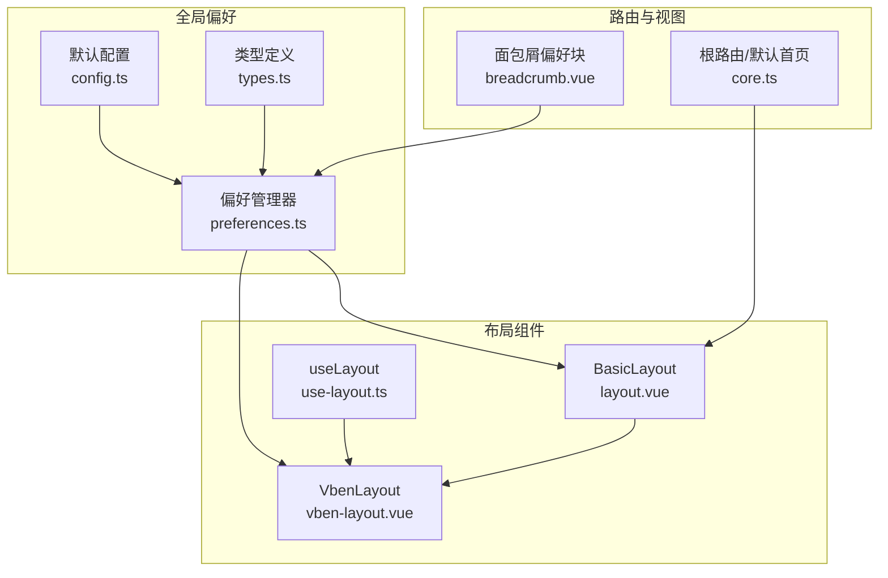
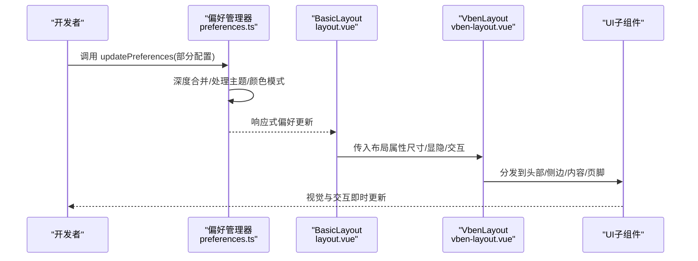
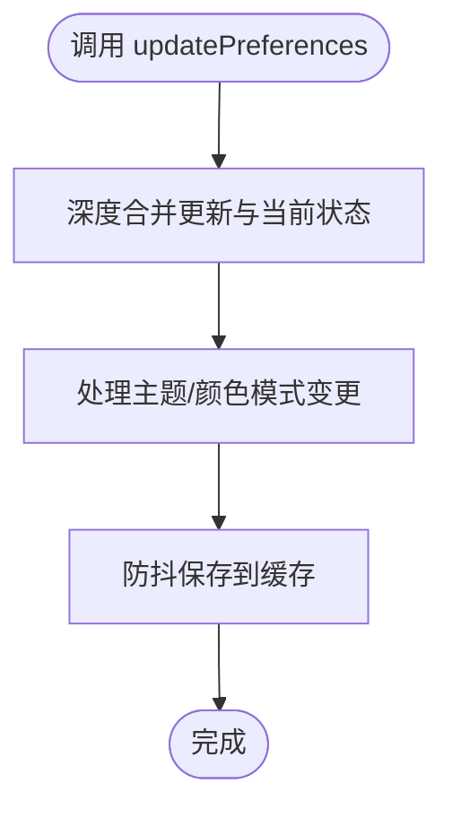
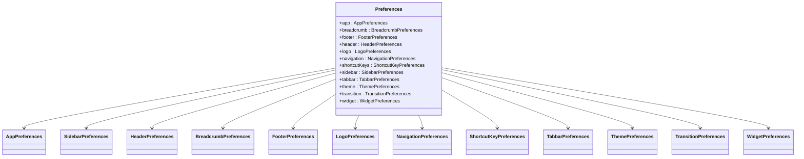
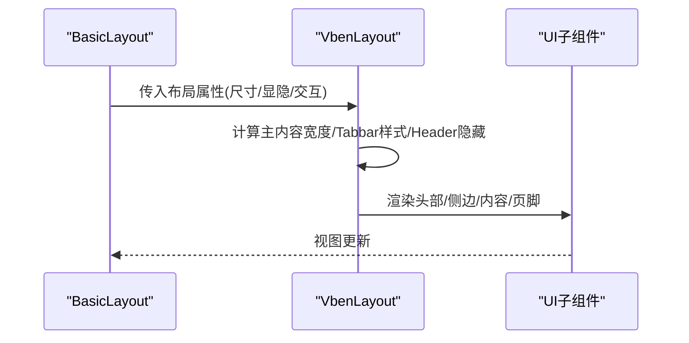
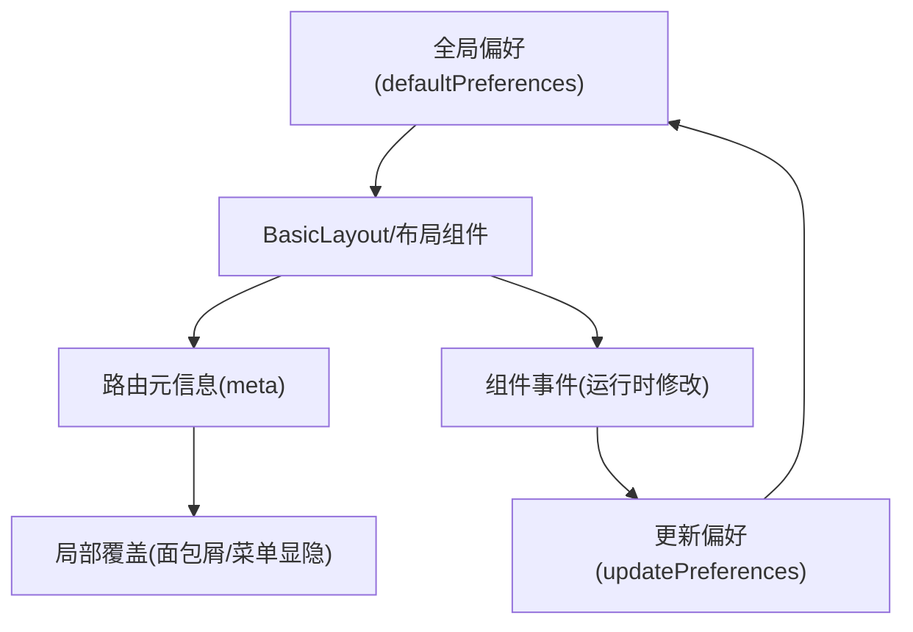
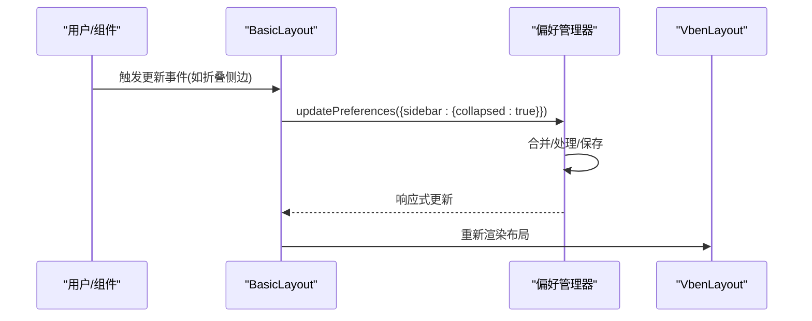
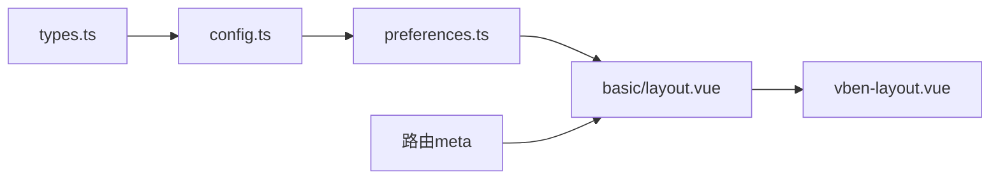

# 布局配置

<cite>
**本文引用的文件**
- [packages/@core/preferences/src/preferences.ts](file://packages/@core/preferences/src/preferences.ts)
- [packages/@core/preferences/src/config.ts](file://packages/@core/preferences/src/config.ts)
- [packages/@core/preferences/src/types.ts](file://packages/@core/preferences/src/types.ts)
- [packages/@core/ui-kit/layout-ui/src/vben-layout.vue](file://packages/@core/ui-kit/layout-ui/src/vben-layout.vue)
- [packages/@core/ui-kit/layout-ui/src/hooks/use-layout.ts](file://packages/@core/ui-kit/layout-ui/src/hooks/use-layout.ts)
- [packages/effects/layouts/src/basic/layout.vue](file://packages/effects/layouts/src/basic/layout.vue)
- [apps/web-antd/src/preferences.ts](file://apps/web-antd/src/preferences.ts)
- [apps/web-antd/src/router/routes/core.ts](file://apps/web-antd/src/router/routes/core.ts)
- [packages/effects/layouts/src/widgets/preferences/blocks/layout/breadcrumb.vue](file://packages/effects/layouts/src/widgets/preferences/blocks/layout/breadcrumb.vue)
</cite>

## 目录
1. [简介](#简介)
2. [项目结构](#项目结构)
3. [核心组件](#核心组件)
4. [架构总览](#架构总览)
5. [详细组件分析](#详细组件分析)
6. [依赖关系分析](#依赖关系分析)
7. [性能考量](#性能考量)
8. [故障排查指南](#故障排查指南)
9. [结论](#结论)
10. [附录](#附录)

## 简介
本指南聚焦于 Vben Admin 的布局配置系统，系统性阐述三层配置层次（全局偏好、路由级元信息、组件级覆盖）、配置项语义与作用、优先级与继承机制、运行时动态修改方式、最佳实践与调试方法。目标是帮助开发者在不破坏默认行为的前提下，灵活定制布局外观与交互。

## 项目结构
布局配置体系由“偏好设置（全局）—布局组件（渲染）—路由元信息（场景化）”三层构成：
- 全局偏好：集中定义在偏好管理器中，支持命名空间隔离、本地缓存、主题与颜色模式联动、响应式更新。
- 布局组件：基于通用 UI 组件库封装，将偏好映射为布局尺寸、显隐、交互等属性。
- 路由元信息：通过路由 meta 控制面包屑、标签页、菜单显隐等局部行为。

**图表来源**
- [packages/@core/preferences/src/preferences.ts:1-235](file://packages/@core/preferences/src/preferences.ts#L1-L235)
- [packages/@core/preferences/src/config.ts:1-148](file://packages/@core/preferences/src/config.ts#L1-L148)
- [packages/@core/preferences/src/types.ts:1-349](file://packages/@core/preferences/src/types.ts#L1-L349)
- [packages/@core/ui-kit/layout-ui/src/vben-layout.vue:1-635](file://packages/@core/ui-kit/layout-ui/src/vben-layout.vue#L1-L635)
- [packages/@core/ui-kit/layout-ui/src/hooks/use-layout.ts:1-54](file://packages/@core/ui-kit/layout-ui/src/hooks/use-layout.ts#L1-L54)
- [packages/effects/layouts/src/basic/layout.vue:1-432](file://packages/effects/layouts/src/basic/layout.vue#L1-L432)
- [apps/web-antd/src/router/routes/core.ts:1-98](file://apps/web-antd/src/router/routes/core.ts#L1-L98)
- [packages/effects/layouts/src/widgets/preferences/blocks/layout/breadcrumb.vue:1-56](file://packages/effects/layouts/src/widgets/preferences/blocks/layout/breadcrumb.vue#L1-L56)

**章节来源**
- [packages/@core/preferences/src/preferences.ts:1-235](file://packages/@core/preferences/src/preferences.ts#L1-L235)
- [packages/@core/preferences/src/config.ts:1-148](file://packages/@core/preferences/src/config.ts#L1-L148)
- [packages/@core/preferences/src/types.ts:1-349](file://packages/@core/preferences/src/types.ts#L1-L349)
- [packages/@core/ui-kit/layout-ui/src/vben-layout.vue:1-635](file://packages/@core/ui-kit/layout-ui/src/vben-layout.vue#L1-L635)
- [packages/@core/ui-kit/layout-ui/src/hooks/use-layout.ts:1-54](file://packages/@core/ui-kit/layout-ui/src/hooks/use-layout.ts#L1-L54)
- [packages/effects/layouts/src/basic/layout.vue:1-432](file://packages/effects/layouts/src/basic/layout.vue#L1-L432)
- [apps/web-antd/src/router/routes/core.ts:1-98](file://apps/web-antd/src/router/routes/core.ts#L1-L98)
- [packages/effects/layouts/src/widgets/preferences/blocks/layout/breadcrumb.vue:1-56](file://packages/effects/layouts/src/widgets/preferences/blocks/layout/breadcrumb.vue#L1-L56)

## 核心组件
- 偏好管理器（PreferenceManager）
  - 负责初始化、合并、持久化、响应式更新与主题联动。
  - 提供命名空间隔离与防抖保存，确保性能与一致性。
- 默认配置（defaultPreferences）
  - 定义各模块默认值，涵盖 app、breadcrumb、footer、header、logo、navigation、shortcutKeys、sidebar、tabbar、theme、transition、widget。
- 类型定义（Preferences/各子模块类型）
  - 严格约束配置结构，便于 IDE 提示与静态校验。
- 布局容器（VbenLayout）
  - 将偏好映射为布局尺寸、显隐、交互（拖拽、折叠、悬停展开、遮罩等），并计算主内容区宽度与 z-index。
- 基础布局（BasicLayout）
  - 将偏好注入到具体 UI 区域（头部、侧边、面包屑、标签页、页脚），并暴露事件以支持运行时修改（如折叠侧边、调整宽度）。

**章节来源**
- [packages/@core/preferences/src/preferences.ts:25-235](file://packages/@core/preferences/src/preferences.ts#L25-L235)
- [packages/@core/preferences/src/config.ts:3-148](file://packages/@core/preferences/src/config.ts#L3-L148)
- [packages/@core/preferences/src/types.ts:296-349](file://packages/@core/preferences/src/types.ts#L296-L349)
- [packages/@core/ui-kit/layout-ui/src/vben-layout.vue:34-111](file://packages/@core/ui-kit/layout-ui/src/vben-layout.vue#L34-L111)
- [packages/effects/layouts/src/basic/layout.vue:11-53](file://packages/effects/layouts/src/basic/layout.vue#L11-L53)

## 架构总览
全局偏好通过响应式状态驱动布局组件，布局组件再将属性传递给具体 UI 子组件；路由元信息在特定场景（如面包屑）影响局部展示。

**图表来源**
- [packages/@core/preferences/src/preferences.ts:120-152](file://packages/@core/preferences/src/preferences.ts#L120-L152)
- [packages/effects/layouts/src/basic/layout.vue:216-274](file://packages/effects/layouts/src/basic/layout.vue#L216-L274)
- [packages/@core/ui-kit/layout-ui/src/vben-layout.vue:497-524](file://packages/@core/ui-kit/layout-ui/src/vben-layout.vue#L497-L524)

## 详细组件分析

### 全局布局配置（偏好管理器）
- 初始化与命名空间
  - 支持按命名空间隔离不同应用或租户的配置。
  - 合并 overrides 与默认配置，再与本地缓存合并，保证首次加载即正确。
- 响应式与持久化
  - 使用响应式对象保存当前状态，变更后触发处理逻辑并防抖写入缓存。
  - 主题与颜色模式变更时，自动更新 CSS 变量与 DOM 类名。
- 运行时更新
  - 通过 updatePreferences 接口进行细粒度更新，避免全量替换。
  - 支持监听断点与系统主题变化，自动同步移动端状态与暗色模式。

**图表来源**
- [packages/@core/preferences/src/preferences.ts:120-152](file://packages/@core/preferences/src/preferences.ts#L120-L152)
- [packages/@core/preferences/src/preferences.ts:173-177](file://packages/@core/preferences/src/preferences.ts#L173-L177)

**章节来源**
- [packages/@core/preferences/src/preferences.ts:70-100](file://packages/@core/preferences/src/preferences.ts#L70-L100)
- [packages/@core/preferences/src/preferences.ts:136-152](file://packages/@core/preferences/src/preferences.ts#L136-L152)
- [packages/@core/preferences/src/preferences.ts:182-217](file://packages/@core/preferences/src/preferences.ts#L182-L217)

### 默认配置与类型约束
- 默认配置（defaultPreferences）
  - app：布局类型、默认首页、紧凑模式、内容内边距、国际化、主题模式、z-index 等。
  - breadcrumb/footer/header/logo/navigation/sidebar/tabbar/theme/transition/widget：各模块开关、尺寸、风格与行为。
- 类型定义（Preferences 与子模块）
  - 严格约束字段与取值范围，确保配置合法与可维护。

**图表来源**
- [packages/@core/preferences/src/types.ts:296-349](file://packages/@core/preferences/src/types.ts#L296-L349)
- [packages/@core/preferences/src/config.ts:3-148](file://packages/@core/preferences/src/config.ts#L3-L148)

**章节来源**
- [packages/@core/preferences/src/config.ts:3-148](file://packages/@core/preferences/src/config.ts#L3-L148)
- [packages/@core/preferences/src/types.ts:21-349](file://packages/@core/preferences/src/types.ts#L21-L349)

### 布局容器（VbenLayout）与基础布局（BasicLayout）
- VbenLayout
  - 将 props 映射为布局尺寸、显隐、交互（拖拽、折叠、悬停展开、遮罩、z-index）。
  - 计算主内容宽度、Tabbar 宽度、Header 自动隐藏策略等。
- BasicLayout
  - 从偏好中读取布局类型、面包屑、侧边栏、头部、标签页、版权等配置。
  - 暴露事件（如折叠侧边、更新宽度）以支持运行时修改。
  - 根据路由布局策略自动展开/收起侧边栏。

**图表来源**
- [packages/effects/layouts/src/basic/layout.vue:216-274](file://packages/effects/layouts/src/basic/layout.vue#L216-L274)
- [packages/@core/ui-kit/layout-ui/src/vben-layout.vue:232-306](file://packages/@core/ui-kit/layout-ui/src/vben-layout.vue#L232-L306)

**章节来源**
- [packages/@core/ui-kit/layout-ui/src/vben-layout.vue:34-111](file://packages/@core/ui-kit/layout-ui/src/vben-layout.vue#L34-L111)
- [packages/@core/ui-kit/layout-ui/src/vben-layout.vue:118-187](file://packages/@core/ui-kit/layout-ui/src/vben-layout.vue#L118-L187)
- [packages/effects/layouts/src/basic/layout.vue:148-194](file://packages/effects/layouts/src/basic/layout.vue#L148-L194)

### 路由级布局配置与继承机制
- 根路由与默认首页
  - 根路由使用基础布局，并将 redirect 指向偏好中的默认首页路径。
- 面包屑与菜单显隐
  - 通过路由 meta 控制面包屑、标签页、菜单显隐等行为，影响局部展示。
- 继承与覆盖
  - 全局偏好为默认值；路由元信息在局部场景覆盖默认行为；组件层可通过事件直接修改当前视图的布局属性。

**图表来源**
- [apps/web-antd/src/router/routes/core.ts:30-40](file://apps/web-antd/src/router/routes/core.ts#L30-L40)
- [packages/effects/layouts/src/widgets/preferences/blocks/layout/breadcrumb.vue:34-56](file://packages/effects/layouts/src/widgets/preferences/blocks/layout/breadcrumb.vue#L34-L56)
- [packages/effects/layouts/src/basic/layout.vue:164-175](file://packages/effects/layouts/src/basic/layout.vue#L164-L175)

**章节来源**
- [apps/web-antd/src/router/routes/core.ts:30-40](file://apps/web-antd/src/router/routes/core.ts#L30-L40)
- [packages/effects/layouts/src/widgets/preferences/blocks/layout/breadcrumb.vue:28-56](file://packages/effects/layouts/src/widgets/preferences/blocks/layout/breadcrumb.vue#L28-L56)
- [packages/effects/layouts/src/basic/layout.vue:164-175](file://packages/effects/layouts/src/basic/layout.vue#L164-L175)

### 动态布局配置实现
- 运行时修改入口
  - BasicLayout 暴露多种更新事件（如侧边栏折叠、宽度、启用/禁用、悬停展开等），回调中调用 updatePreferences 实现即时生效。
- 偏好更新流程
  - updatePreferences 合并更新并触发处理逻辑（如主题变量更新、颜色模式切换），随后防抖保存到缓存。
- 与路由的联动
  - 布局类型变化时，BasicLayout 会根据策略自动调整侧边栏可见性，确保双列或多列布局一致可用。

**图表来源**
- [packages/effects/layouts/src/basic/layout.vue:148-154](file://packages/effects/layouts/src/basic/layout.vue#L148-L154)
- [packages/effects/layouts/src/basic/layout.vue:257-273](file://packages/effects/layouts/src/basic/layout.vue#L257-L273)
- [packages/@core/preferences/src/preferences.ts:120-130](file://packages/@core/preferences/src/preferences.ts#L120-L130)

**章节来源**
- [packages/effects/layouts/src/basic/layout.vue:148-154](file://packages/effects/layouts/src/basic/layout.vue#L148-L154)
- [packages/effects/layouts/src/basic/layout.vue:257-273](file://packages/effects/layouts/src/basic/layout.vue#L257-L273)
- [packages/@core/preferences/src/preferences.ts:120-130](file://packages/@core/preferences/src/preferences.ts#L120-L130)

## 依赖关系分析
- 偏好管理器依赖默认配置与类型定义，负责初始化、合并、持久化与响应式更新。
- 布局组件依赖偏好状态，将配置映射为 UI 属性，并计算布局样式。
- 基础布局在模板中绑定偏好，同时通过事件桥接运行时修改。
- 路由元信息在局部场景影响展示，与全局偏好形成“默认—覆盖”的关系。

**图表来源**
- [packages/@core/preferences/src/types.ts:1-349](file://packages/@core/preferences/src/types.ts#L1-L349)
- [packages/@core/preferences/src/config.ts:1-148](file://packages/@core/preferences/src/config.ts#L1-L148)
- [packages/@core/preferences/src/preferences.ts:1-235](file://packages/@core/preferences/src/preferences.ts#L1-L235)
- [packages/effects/layouts/src/basic/layout.vue:1-432](file://packages/effects/layouts/src/basic/layout.vue#L1-L432)
- [packages/@core/ui-kit/layout-ui/src/vben-layout.vue:1-635](file://packages/@core/ui-kit/layout-ui/src/vben-layout.vue#L1-L635)

**章节来源**
- [packages/@core/preferences/src/types.ts:1-349](file://packages/@core/preferences/src/types.ts#L1-L349)
- [packages/@core/preferences/src/config.ts:1-148](file://packages/@core/preferences/src/config.ts#L1-L148)
- [packages/@core/preferences/src/preferences.ts:1-235](file://packages/@core/preferences/src/preferences.ts#L1-L235)
- [packages/effects/layouts/src/basic/layout.vue:1-432](file://packages/effects/layouts/src/basic/layout.vue#L1-L432)
- [packages/@core/ui-kit/layout-ui/src/vben-layout.vue:1-635](file://packages/@core/ui-kit/layout-ui/src/vben-layout.vue#L1-L635)

## 性能考量
- 防抖保存：对偏好更新进行防抖，降低频繁写入缓存带来的性能开销。
- 响应式最小化：仅在必要时触发主题变量更新与颜色模式切换，避免不必要的重绘。
- 布局计算：VbenLayout 对主内容宽度、Tabbar 样式、Header 隐藏策略进行一次性计算，减少重复计算成本。
- 移动端优化：在移动端自动折叠侧边栏，减少布局复杂度。

[本节为通用性能建议，无需特定文件引用]

## 故障排查指南
- 偏好未生效
  - 检查是否调用了 updatePreferences 并传入了正确的路径（如 sidebar.width）。
  - 确认命名空间与 overrides 是否正确，避免被缓存覆盖。
- 主题/颜色模式异常
  - 确认主题模式为 auto 时系统主题变化是否触发；检查颜色模式开关（灰色/色弱）对应的 DOM 类是否正确添加。
- 布局错位或宽度异常
  - 检查侧边栏宽度、折叠宽度、混合宽度与内容内边距配置；确认 isMobile 状态与布局类型是否匹配。
- 面包屑不显示
  - 检查路由 meta 中 hideInBreadcrumb 或 hideInMenu 的设置；确认面包屑总开关与图标显示开关。

**章节来源**
- [packages/@core/preferences/src/preferences.ts:182-217](file://packages/@core/preferences/src/preferences.ts#L182-L217)
- [packages/@core/ui-kit/layout-ui/src/vben-layout.vue:129-141](file://packages/@core/ui-kit/layout-ui/src/vben-layout.vue#L129-L141)
- [packages/effects/layouts/src/widgets/preferences/blocks/layout/breadcrumb.vue:34-56](file://packages/effects/layouts/src/widgets/preferences/blocks/layout/breadcrumb.vue#L34-L56)

## 结论
Vben Admin 的布局配置体系以“全局偏好—布局组件—路由元信息”三层协同工作：全局偏好提供默认值与持久化，布局组件负责将偏好映射为视觉与交互，路由元信息在局部场景提供覆盖能力。通过运行时事件与 updatePreferences，可在不破坏默认行为的前提下灵活调整布局。遵循本文的优先级与最佳实践，可获得稳定、可维护且高性能的布局体验。

[本节为总结性内容，无需特定文件引用]

## 附录

### 配置项速览与作用
- app
  - 布局类型、默认首页、紧凑模式、内容内边距、国际化、主题模式、z-index 等。
- breadcrumb
  - 面包屑开关、仅一项时隐藏、首页图标、图标显示、风格。
- footer
  - 底栏开关、固定、高度。
- header
  - 顶栏开关、高度、隐藏、菜单对齐、显示模式。
- logo
  - logo 开关、适配方式、地址与暗色主题地址。
- navigation
  - 手风琴模式、分割（混合导航）、风格。
- sidebar
  - 折叠、折叠按钮、折叠时显示标题、折叠宽度、拖拽、启用/禁用、悬停展开、扩展区域折叠与宽度、固定按钮、隐藏、混合宽度、宽度。
- tabbar
  - 标签页开关、高度、拖拽、缓存、最大数量、中键关闭、持久化、图标、最大化、更多、刷新、风格、访问历史、滚轮响应。
- theme
  - 内置主题、主色/成功/警告/破坏色、字体大小、圆角、主题模式、半深色 header/侧边/子菜单。
- transition
  - 页面切换动画开关、加载动画、过渡名称、进度条。
- widget
  - 全屏、全局搜索、语言切换、锁屏、通知、刷新、侧边栏切换、主题切换、时区。

**章节来源**
- [packages/@core/preferences/src/config.ts:3-148](file://packages/@core/preferences/src/config.ts#L3-L148)
- [packages/@core/preferences/src/types.ts:21-349](file://packages/@core/preferences/src/types.ts#L21-L349)

### 最佳实践
- 配置文件组织
  - 在项目入口处使用 defineOverridesPreferences 覆盖少量关键配置（如主题模式、默认首页、权限模式），其余沿用默认值。
- 默认值设置
  - 仅覆盖必要字段，避免冗余配置；利用默认配置提供的合理缺省值。
- 主题适配
  - 使用 theme.mode 与 auto 模式跟随系统；通过颜色模式开关快速适配色弱/灰色需求。
- 运行时修改
  - 通过 BasicLayout 暴露的事件与 updatePreferences 实现局部/全局的即时调整；注意使用防抖与最小化更新。

**章节来源**
- [apps/web-antd/src/preferences.ts:8-30](file://apps/web-antd/src/preferences.ts#L8-L30)
- [packages/@core/preferences/src/preferences.ts:120-130](file://packages/@core/preferences/src/preferences.ts#L120-L130)