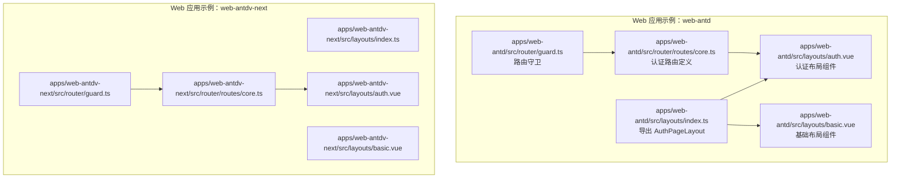
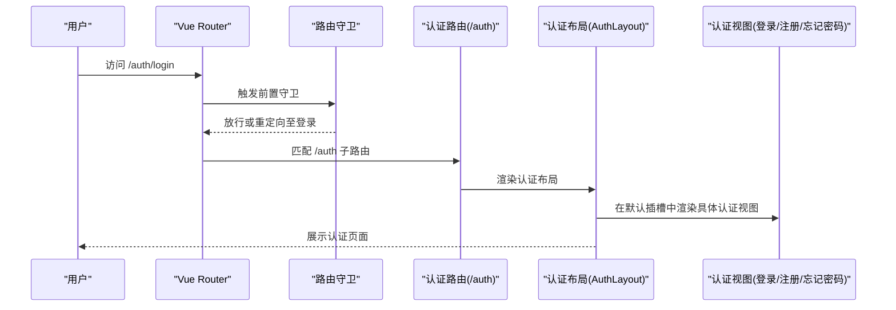
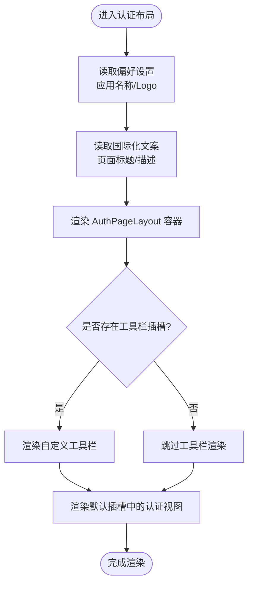
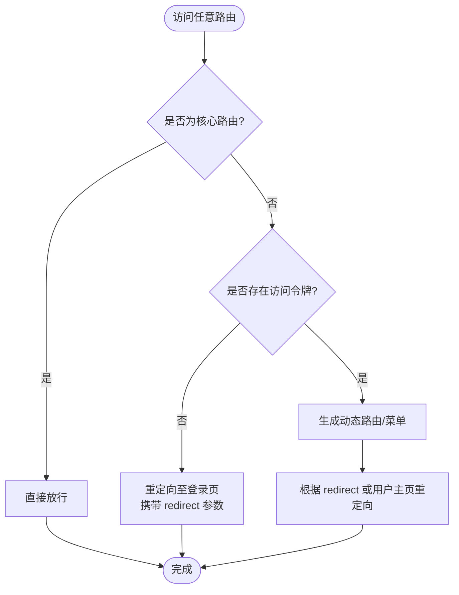
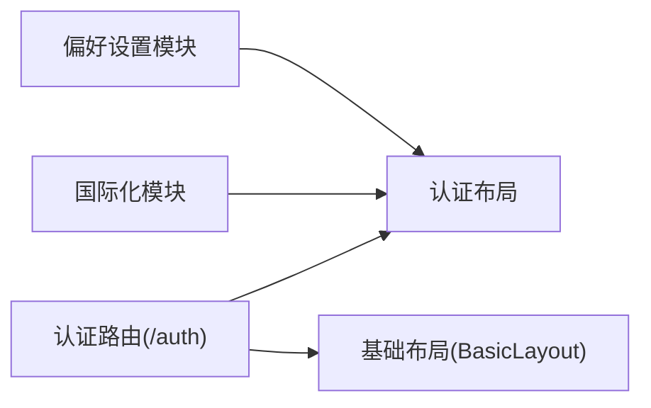

# 认证布局

<cite>
**本文引用的文件**
- [apps/web-antd/src/layouts/auth.vue](file://apps/web-antd/src/layouts/auth.vue)
- [apps/web-antd/src/layouts/basic.vue](file://apps/web-antd/src/layouts/basic.vue)
- [apps/web-antd/src/layouts/index.ts](file://apps/web-antd/src/layouts/index.ts)
- [apps/web-antdv-next/src/layouts/auth.vue](file://apps/web-antdv-next/src/layouts/auth.vue)
- [apps/web-antdv-next/src/layouts/basic.vue](file://apps/web-antdv-next/src/layouts/basic.vue)
- [apps/web-antdv-next/src/layouts/index.ts](file://apps/web-antdv-next/src/layouts/index.ts)
- [apps/web-antd/src/router/guard.ts](file://apps/web-antd/src/router/guard.ts)
- [apps/web-antd/src/router/routes/core.ts](file://apps/web-antd/src/router/routes/core.ts)
- [apps/web-antd/src/views/_core/fallback/not-found.vue](file://apps/web-antd/src/views/_core/fallback/not-found.vue)
</cite>

## 目录

1. [简介](#简介)
2. [项目结构](#项目结构)
3. [核心组件](#核心组件)
4. [架构总览](#架构总览)
5. [详细组件分析](#详细组件分析)
6. [依赖分析](#依赖分析)
7. [性能考虑](#性能考虑)
8. [故障排查指南](#故障排查指南)
9. [结论](#结论)
10. [附录](#附录)

## 简介

本指南聚焦于 Vben Admin 的“认证布局”（Auth Layout）组件，系统性阐述其设计目的、使用场景、与基础布局的区别、模板结构与内容区域划分、与路由系统的集成方式、样式定制与主题适配，以及在单页应用中的使用模式与最佳实践。认证布局专用于登录、注册、忘记密码等认证相关页面，强调简洁、专注与一致性，通常不包含侧边栏与复杂头部功能，以提升用户在认证流程中的操作效率。

## 项目结构

认证布局在多套 UI 框架适配中保持一致的组织方式：各前端应用通过本地布局入口导出统一的 AuthPageLayout，并在路由层将其作为认证域的父级布局容器。

图表来源

- [apps/web-antd/src/layouts/index.ts:1-7](file://apps/web-antd/src/layouts/index.ts#L1-L7)
- [apps/web-antd/src/layouts/auth.vue:1-26](file://apps/web-antd/src/layouts/auth.vue#L1-L26)
- [apps/web-antd/src/layouts/basic.vue:1-207](file://apps/web-antd/src/layouts/basic.vue#L1-L207)
- [apps/web-antd/src/router/routes/core.ts:1-98](file://apps/web-antd/src/router/routes/core.ts#L1-L98)
- [apps/web-antd/src/router/guard.ts:1-133](file://apps/web-antd/src/router/guard.ts#L1-L133)
- [apps/web-antdv-next/src/layouts/index.ts:1-7](file://apps/web-antdv-next/src/layouts/index.ts#L1-L7)
- [apps/web-antdv-next/src/layouts/auth.vue:1-26](file://apps/web-antdv-next/src/layouts/auth.vue#L1-L26)
- [apps/web-antdv-next/src/layouts/basic.vue:1-207](file://apps/web-antdv-next/src/layouts/basic.vue#L1-L207)
- [apps/web-antdv-next/src/router/routes/core.ts:1-98](file://apps/web-antdv-next/src/router/routes/core.ts#L1-L98)
- [apps/web-antdv-next/src/router/guard.ts:1-133](file://apps/web-antdv-next/src/router/guard.ts#L1-L133)

章节来源

- [apps/web-antd/src/layouts/index.ts:1-7](file://apps/web-antd/src/layouts/index.ts#L1-L7)
- [apps/web-antd/src/layouts/auth.vue:1-26](file://apps/web-antd/src/layouts/auth.vue#L1-L26)
- [apps/web-antd/src/layouts/basic.vue:1-207](file://apps/web-antd/src/layouts/basic.vue#L1-L207)
- [apps/web-antdv-next/src/layouts/index.ts:1-7](file://apps/web-antdv-next/src/layouts/index.ts#L1-L7)
- [apps/web-antdv-next/src/layouts/auth.vue:1-26](file://apps/web-antdv-next/src/layouts/auth.vue#L1-L26)
- [apps/web-antdv-next/src/layouts/basic.vue:1-207](file://apps/web-antdv-next/src/layouts/basic.vue#L1-L207)

## 核心组件

- 认证布局组件（Auth Layout）
  - 设计目的：承载认证相关页面（登录、注册、忘记密码等），提供统一的标题、描述、Logo 展示与可选工具栏区域。
  - 特点：无侧边栏、简化头部、聚焦内容区，便于用户完成认证任务。
  - 组件形态：通过本地布局封装对外暴露的 AuthPageLayout，内部读取偏好设置与国际化文案，透传给底层布局容器。
- 基础布局组件（Basic Layout）
  - 设计目的：承载业务主应用页面，包含侧边栏、顶部导航、通知、用户下拉等完整功能。
  - 与认证布局区别：认证布局不包含侧边栏与复杂头部，适合短流程、高专注度的认证页面。

章节来源

- [apps/web-antd/src/layouts/auth.vue:1-26](file://apps/web-antd/src/layouts/auth.vue#L1-L26)
- [apps/web-antd/src/layouts/basic.vue:1-207](file://apps/web-antd/src/layouts/basic.vue#L1-L207)
- [apps/web-antdv-next/src/layouts/auth.vue:1-26](file://apps/web-antdv-next/src/layouts/auth.vue#L1-L26)
- [apps/web-antdv-next/src/layouts/basic.vue:1-207](file://apps/web-antdv-next/src/layouts/basic.vue#L1-L207)

## 架构总览

认证布局与路由系统的集成路径如下：路由定义中将 /auth 作为认证域父级，子路由包含登录、验证码登录、二维码登录、忘记密码、注册等；当用户访问这些子路由时，由认证布局作为父级容器渲染，确保页面风格统一。

图表来源

- [apps/web-antd/src/router/routes/core.ts:42-94](file://apps/web-antd/src/router/routes/core.ts#L42-L94)
- [apps/web-antd/src/router/guard.ts:47-119](file://apps/web-antd/src/router/guard.ts#L47-L119)
- [apps/web-antd/src/layouts/auth.vue:14-25](file://apps/web-antd/src/layouts/auth.vue#L14-L25)

章节来源

- [apps/web-antd/src/router/routes/core.ts:1-98](file://apps/web-antd/src/router/routes/core.ts#L1-L98)
- [apps/web-antd/src/router/guard.ts:1-133](file://apps/web-antd/src/router/guard.ts#L1-L133)
- [apps/web-antd/src/layouts/auth.vue:1-26](file://apps/web-antd/src/layouts/auth.vue#L1-L26)

## 详细组件分析

### 认证布局组件（Auth Layout）

- 模板结构与内容区域划分
  - 外层容器：通过 AuthPageLayout 容器承载页面骨架。
  - 插槽区域：支持自定义工具栏插槽，便于在特定认证页面扩展操作按钮或辅助控件。
  - 文案与品牌：从偏好设置与国际化资源读取应用名称、Logo（明/暗）、页面标题与描述，保证全局一致的品牌呈现。
- 数据流与依赖
  - 依赖偏好设置模块获取品牌信息与应用名称。
  - 依赖国际化模块获取认证页面标题与描述文案。
  - 依赖 @vben/layouts 中的 AuthPageLayout 容器能力。
- 与基础布局差异
  - 认证布局不包含侧边栏、通知、用户下拉等复杂头部功能，页面更简洁，利于快速完成认证任务。
  - 基础布局面向业务主页面，提供完整的导航与交互能力。

图表来源

- [apps/web-antd/src/layouts/auth.vue:9-25](file://apps/web-antd/src/layouts/auth.vue#L9-L25)
- [apps/web-antdv-next/src/layouts/auth.vue:9-25](file://apps/web-antdv-next/src/layouts/auth.vue#L9-L25)

章节来源

- [apps/web-antd/src/layouts/auth.vue:1-26](file://apps/web-antd/src/layouts/auth.vue#L1-L26)
- [apps/web-antdv-next/src/layouts/auth.vue:1-26](file://apps/web-antdv-next/src/layouts/auth.vue#L1-L26)

### 路由系统集成与自动选择

- 路由定义
  - 认证域父路由 /auth 将 AuthPageLayout 作为其组件，子路由覆盖登录、验证码登录、二维码登录、忘记密码、注册等。
  - 根路由 / 采用基础布局 BasicLayout，作为业务主页面的父容器。
- 路由守卫
  - 对非核心路由进行访问控制：若无有效令牌且未声明忽略权限，则重定向至登录页并携带 redirect 参数。
  - 已登录用户访问登录页时，根据用户主页或默认首页进行重定向，避免重复登录。
- 自动选择机制
  - 当访问 /auth/\* 子路由时，路由匹配到认证域父级，自动选择认证布局；访问其他业务路由时，选择基础布局。

图表来源

- [apps/web-antd/src/router/guard.ts:47-119](file://apps/web-antd/src/router/guard.ts#L47-L119)
- [apps/web-antd/src/router/routes/core.ts:24-94](file://apps/web-antd/src/router/routes/core.ts#L24-L94)

章节来源

- [apps/web-antd/src/router/routes/core.ts:1-98](file://apps/web-antd/src/router/routes/core.ts#L1-L98)
- [apps/web-antd/src/router/guard.ts:1-133](file://apps/web-antd/src/router/guard.ts#L1-L133)

### 样式定制与主题适配

- 品牌与文案定制
  - 通过偏好设置模块统一管理应用名称与 Logo（明/暗模式），认证布局自动读取并渲染。
  - 通过国际化模块集中管理认证页面标题与描述文案，便于多语言适配。
- 主题适配
  - 认证布局基于底层 AuthPageLayout 容器，遵循统一的主题变量与样式体系，无需额外样式注入即可适配深浅主题。
- 扩展点
  - 工具栏插槽可用于在特定认证页面添加品牌化元素或辅助操作，但需保持整体简洁，避免干扰认证流程。

章节来源

- [apps/web-antd/src/layouts/auth.vue:9-25](file://apps/web-antd/src/layouts/auth.vue#L9-L25)
- [apps/web-antdv-next/src/layouts/auth.vue:9-25](file://apps/web-antdv-next/src/layouts/auth.vue#L9-L25)

### 单页应用使用模式与最佳实践

- 使用模式
  - 将认证相关页面统一挂载在 /auth 下，利用认证布局提供一致的视觉与交互体验。
  - 登录成功后，根据用户主页或默认首页进行重定向，避免重复登录。
- 最佳实践
  - 保持认证页面简洁：仅保留必要的输入与提交按钮，减少认知负担。
  - 合理使用工具栏插槽：如需添加“返回首页”“切换语言”等操作，应置于显眼但不喧宾夺主的位置。
  - 国际化与品牌化：统一使用偏好设置与国际化资源，确保跨语言与多主题的一致性。
  - 错误处理：结合 404 页面与路由守卫，确保异常访问得到友好提示与正确重定向。

章节来源

- [apps/web-antd/src/router/guard.ts:47-119](file://apps/web-antd/src/router/guard.ts#L47-L119)
- [apps/web-antd/src/views/\_core/fallback/not-found.vue:1-10](file://apps/web-antd/src/views/_core/fallback/not-found.vue#L1-L10)

## 依赖分析

- 认证布局对偏好设置与国际化的依赖
  - 通过偏好设置模块读取应用名称与 Logo，确保品牌一致性。
  - 通过国际化模块读取页面标题与描述，便于多语言支持。
- 认证布局与路由的关系
  - 认证布局由路由系统在 /auth 域内自动选择与渲染，子路由负责承载具体认证视图。
- 与基础布局的耦合
  - 认证布局与基础布局分别服务于不同场景，耦合度低，便于独立演进与维护。

图表来源

- [apps/web-antd/src/layouts/auth.vue:9-25](file://apps/web-antd/src/layouts/auth.vue#L9-L25)
- [apps/web-antd/src/router/routes/core.ts:42-94](file://apps/web-antd/src/router/routes/core.ts#L42-L94)
- [apps/web-antd/src/layouts/basic.vue:1-207](file://apps/web-antd/src/layouts/basic.vue#L1-L207)

章节来源

- [apps/web-antd/src/layouts/auth.vue:1-26](file://apps/web-antd/src/layouts/auth.vue#L1-L26)
- [apps/web-antd/src/router/routes/core.ts:1-98](file://apps/web-antd/src/router/routes/core.ts#L1-L98)
- [apps/web-antd/src/layouts/basic.vue:1-207](file://apps/web-antd/src/layouts/basic.vue#L1-L207)

## 性能考虑

- 路由懒加载
  - 认证布局与视图均采用动态导入，降低首屏包体与初次渲染压力。
- 进度条与页面切换
  - 路由守卫中按需开启/关闭进度条，避免不必要的 UI 开销。
- 品牌与文案缓存
  - 偏好设置与国际化资源在组件内计算属性中读取，避免重复请求与渲染抖动。

章节来源

- [apps/web-antd/src/router/guard.ts:21-41](file://apps/web-antd/src/router/guard.ts#L21-L41)
- [apps/web-antd/src/layouts/auth.vue:9-25](file://apps/web-antd/src/layouts/auth.vue#L9-L25)

## 故障排查指南

- 访问认证页面白屏或空白
  - 检查认证路由是否正确挂载在 /auth 下，确认子路由组件已正确导入。
  - 确认路由守卫未错误拦截，必要时检查 ignoreAccess 与 redirect 逻辑。
- 品牌信息未显示
  - 检查偏好设置模块中的应用名称与 Logo 配置是否正确。
  - 确认国际化资源中认证页面标题与描述是否存在对应键值。
- 登录后未跳转预期页面
  - 检查用户主页或默认首页配置，确认路由守卫中的重定向逻辑生效。
- 404 页面展示
  - 若出现 404，检查路由表与回退路由配置，确保异常路径被正确捕获。

章节来源

- [apps/web-antd/src/router/routes/core.ts:11-21](file://apps/web-antd/src/router/routes/core.ts#L11-L21)
- [apps/web-antd/src/router/guard.ts:47-119](file://apps/web-antd/src/router/guard.ts#L47-L119)
- [apps/web-antd/src/views/\_core/fallback/not-found.vue:1-10](file://apps/web-antd/src/views/_core/fallback/not-found.vue#L1-L10)

## 结论

认证布局通过统一的容器与品牌化配置，为登录、注册、忘记密码等认证流程提供了简洁一致的用户体验。配合路由系统与路由守卫，实现了自动化的布局选择与访问控制。在实际开发中，建议严格遵循“简洁、一致、可扩展”的原则，充分利用工具栏插槽与国际化能力，在不破坏认证流程效率的前提下进行适度定制。

## 附录

- 相关文件索引
  - 认证布局组件：[apps/web-antd/src/layouts/auth.vue:1-26](file://apps/web-antd/src/layouts/auth.vue#L1-L26)、[apps/web-antdv-next/src/layouts/auth.vue:1-26](file://apps/web-antdv-next/src/layouts/auth.vue#L1-L26)
  - 基础布局组件：[apps/web-antd/src/layouts/basic.vue:1-207](file://apps/web-antd/src/layouts/basic.vue#L1-L207)、[apps/web-antdv-next/src/layouts/basic.vue:1-207](file://apps/web-antdv-next/src/layouts/basic.vue#L1-L207)
  - 路由与守卫：[apps/web-antd/src/router/routes/core.ts:1-98](file://apps/web-antd/src/router/routes/core.ts#L1-L98)、[apps/web-antd/src/router/guard.ts:1-133](file://apps/web-antd/src/router/guard.ts#L1-L133)
  - 布局导出入口：[apps/web-antd/src/layouts/index.ts:1-7](file://apps/web-antd/src/layouts/index.ts#L1-L7)、[apps/web-antdv-next/src/layouts/index.ts:1-7](file://apps/web-antdv-next/src/layouts/index.ts#L1-L7)
  - 404 回退页面：[apps/web-antd/src/views/\_core/fallback/not-found.vue:1-10](file://apps/web-antd/src/views/_core/fallback/not-found.vue#L1-L10)
