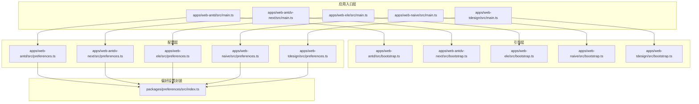
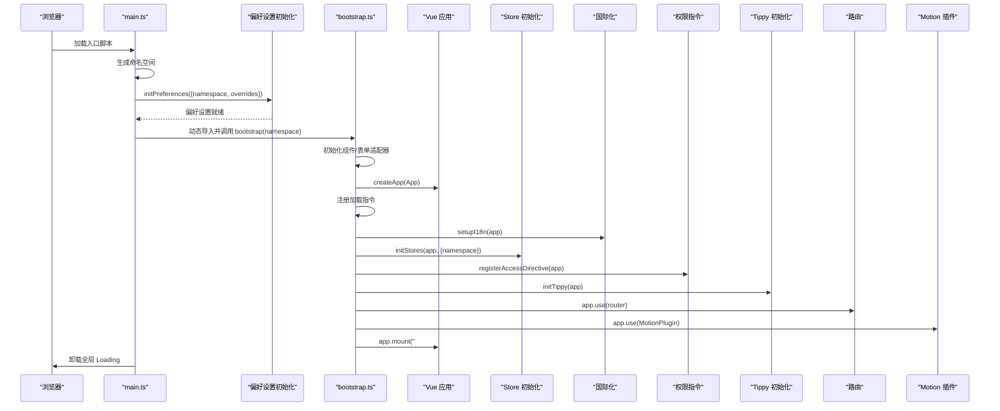
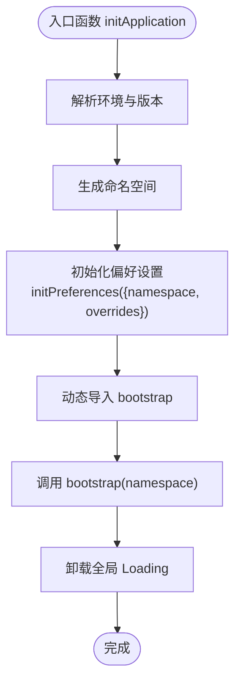
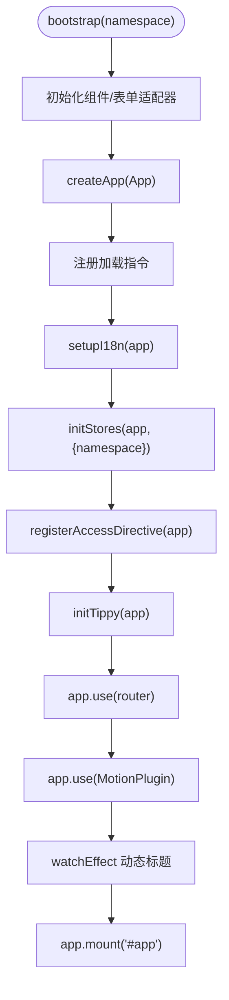
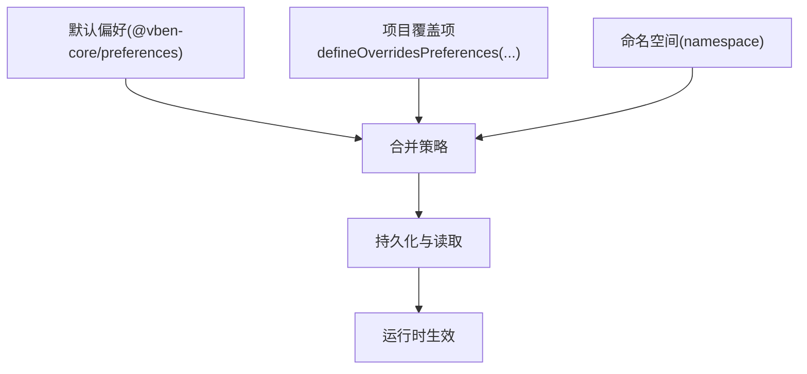
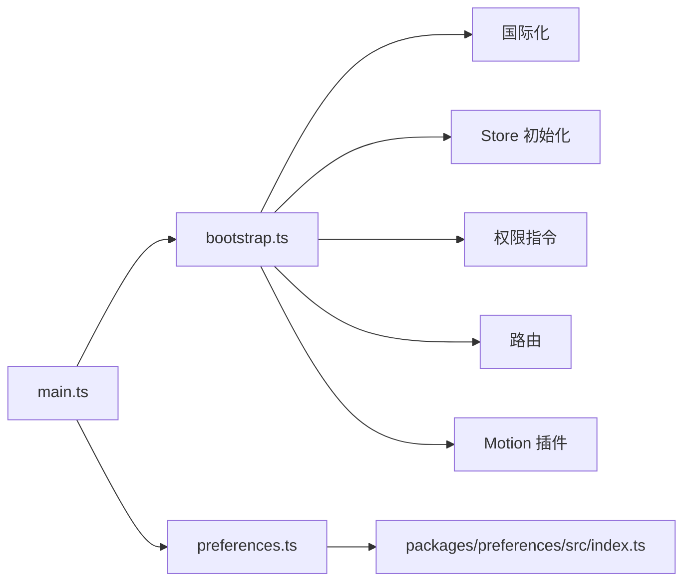

# 应用入口与初始化

<cite>
**本文档引用的文件**
- [apps/web-antd/src/main.ts](file://apps/web-antd/src/main.ts)
- [apps/web-antd/src/bootstrap.ts](file://apps/web-antd/src/bootstrap.ts)
- [apps/web-antd/src/preferences.ts](file://apps/web-antd/src/preferences.ts)
- [apps/web-antdv-next/src/main.ts](file://apps/web-antdv-next/src/main.ts)
- [apps/web-antdv-next/src/bootstrap.ts](file://apps/web-antdv-next/src/bootstrap.ts)
- [apps/web-ele/src/main.ts](file://apps/web-ele/src/main.ts)
- [apps/web-ele/src/bootstrap.ts](file://apps/web-ele/src/bootstrap.ts)
- [apps/web-naive/src/main.ts](file://apps/web-naive/src/main.ts)
- [apps/web-naive/src/bootstrap.ts](file://apps/web-naive/src/bootstrap.ts)
- [apps/web-tdesign/src/main.ts](file://apps/web-tdesign/src/main.ts)
- [apps/web-tdesign/src/bootstrap.ts](file://apps/web-tdesign/src/bootstrap.ts)
- [packages/preferences/src/index.ts](file://packages/preferences/src/index.ts)
</cite>

## 目录

1. [引言](#引言)
2. [项目结构](#项目结构)
3. [核心组件](#核心组件)
4. [架构总览](#架构总览)
5. [详细组件分析](#详细组件分析)
6. [依赖关系分析](#依赖关系分析)
7. [性能考量](#性能考量)
8. [故障排查指南](#故障排查指南)
9. [结论](#结论)
10. [附录](#附录)

## 引言

本文件聚焦于 Vben Admin 应用的入口与初始化流程，系统性解析以下关键点：

- main.ts 的应用启动流程：环境变量解析、命名空间生成、偏好设置初始化与覆盖机制、最终挂载与全局 Loading 销毁。
- bootstrap.ts 的引导程序：应用装配、依赖注入、核心服务初始化、国际化、权限指令、动态标题、路由与插件安装。
- 偏好设置覆盖与配置优先级：如何通过 overridesPreferences 覆盖默认偏好，并结合命名空间实现多实例隔离。
- 实践示例：如何自定义应用配置与扩展初始化逻辑。
- 最佳实践：错误处理与加载状态管理。

## 项目结构

各 Web 应用共享一致的入口与引导模式，差异主要体现在 UI 框架与样式引入上。核心文件分布如下：

- 入口文件：apps/<web-xxx>/src/main.ts
- 引导文件：apps/<web-xxx>/src/bootstrap.ts
- 偏好设置覆盖：apps/<web-xxx>/src/preferences.ts
- 偏好设置封装：packages/preferences/src/index.ts

图表来源

- [apps/web-antd/src/main.ts:1-32](file://apps/web-antd/src/main.ts#L1-L32)
- [apps/web-antd/src/bootstrap.ts:1-85](file://apps/web-antd/src/bootstrap.ts#L1-L85)
- [apps/web-antd/src/preferences.ts:1-31](file://apps/web-antd/src/preferences.ts#L1-L31)
- [packages/preferences/src/index.ts:1-18](file://packages/preferences/src/index.ts#L1-L18)

章节来源

- [apps/web-antd/src/main.ts:1-32](file://apps/web-antd/src/main.ts#L1-L32)
- [apps/web-antd/src/bootstrap.ts:1-85](file://apps/web-antd/src/bootstrap.ts#L1-L85)
- [apps/web-antd/src/preferences.ts:1-31](file://apps/web-antd/src/preferences.ts#L1-L31)
- [packages/preferences/src/index.ts:1-18](file://packages/preferences/src/index.ts#L1-L18)

## 核心组件

- 应用入口 main.ts
  - 解析运行时环境与版本，生成命名空间。
  - 初始化偏好设置（含命名空间与覆盖项）。
  - 动态导入引导模块并执行 bootstrap。
  - 卸载全局 Loading。
- 引导程序 bootstrap.ts
  - 组件与表单适配器初始化。
  - 注册加载指令、国际化、Pinia Store、权限指令、Tippy、路由与 Motion 插件。
  - 动态标题联动偏好设置与路由元信息。
  - 挂载应用到 DOM。
- 偏好设置覆盖 preferences.ts
  - 使用 defineOverridesPreferences 定义覆盖项，仅覆盖所需字段。
  - 支持主题模式、应用名称、更新检查、访问控制模式、默认首页路径、语言切换与时区小部件等。
- 偏好设置封装 packages/preferences/src/index.ts
  - 提供 defineOverridesPreferences 工具函数与默认偏好类型导出。

章节来源

- [apps/web-antd/src/main.ts:9-31](file://apps/web-antd/src/main.ts#L9-L31)
- [apps/web-antd/src/bootstrap.ts:20-82](file://apps/web-antd/src/bootstrap.ts#L20-L82)
- [apps/web-antd/src/preferences.ts:8-30](file://apps/web-antd/src/preferences.ts#L8-L30)
- [packages/preferences/src/index.ts:11-15](file://packages/preferences/src/index.ts#L11-L15)

## 架构总览

下图展示了从入口到引导再到核心服务初始化的整体流程与模块交互：

图表来源

- [apps/web-antd/src/main.ts:9-29](file://apps/web-antd/src/main.ts#L9-L29)
- [apps/web-antd/src/bootstrap.ts:20-82](file://apps/web-antd/src/bootstrap.ts#L20-L82)

## 详细组件分析

### 应用入口 main.ts 分析

- 环境变量与命名空间
  - 依据生产/开发环境与应用版本生成命名空间，确保多实例或多版本场景下的数据隔离。
- 偏好设置初始化
  - 传入命名空间与覆盖项，完成偏好设置的初始化与持久化准备。
- 引导与卸载
  - 动态导入引导模块并执行 bootstrap，随后卸载全局 Loading，避免首屏闪烁。

图表来源

- [apps/web-antd/src/main.ts:9-29](file://apps/web-antd/src/main.ts#L9-L29)

章节来源

- [apps/web-antd/src/main.ts:9-31](file://apps/web-antd/src/main.ts#L9-L31)

### 引导程序 bootstrap.ts 分析

- 组件与表单适配器
  - 初始化组件适配器与表单适配器，保证 UI 框架与通用组件的一致行为。
- 指令与国际化
  - 注册加载指令（支持自定义指令名或禁用），完成国际化配置。
- 状态与安全
  - 初始化 Pinia Store 并注入命名空间；注册权限指令。
- 交互与插件
  - 初始化 Tippy；安装路由；按需安装 Motion 插件。
- 动态标题
  - 基于偏好设置与路由元信息动态更新页面标题。
- 挂载
  - 将应用挂载至 DOM。

图表来源

- [apps/web-antd/src/bootstrap.ts:20-82](file://apps/web-antd/src/bootstrap.ts#L20-L82)

章节来源

- [apps/web-antd/src/bootstrap.ts:20-82](file://apps/web-antd/src/bootstrap.ts#L20-L82)

### 偏好设置覆盖与优先级

- 覆盖机制
  - 通过 defineOverridesPreferences 定义覆盖项，仅覆盖所需字段，未覆盖部分沿用默认值。
- 命名空间隔离
  - 命名空间由 UI 框架、版本与环境组合而成，确保不同实例或版本的偏好设置互不干扰。
- 优先级
  - 运行时覆盖 > 默认偏好 > 命名空间隔离键。

图表来源

- [packages/preferences/src/index.ts:11-15](file://packages/preferences/src/index.ts#L11-L15)
- [apps/web-antd/src/preferences.ts:8-30](file://apps/web-antd/src/preferences.ts#L8-L30)
- [apps/web-antd/src/main.ts:17-20](file://apps/web-antd/src/main.ts#L17-L20)

章节来源

- [packages/preferences/src/index.ts:11-15](file://packages/preferences/src/index.ts#L11-L15)
- [apps/web-antd/src/preferences.ts:8-30](file://apps/web-antd/src/preferences.ts#L8-L30)
- [apps/web-antd/src/main.ts:17-20](file://apps/web-antd/src/main.ts#L17-L20)

### 多框架应用的入口与引导对比

- web-antd 与 web-antdv-next
  - 主要差异在于样式引入与部分 UI 框架适配。
- web-ele
  - 使用 Element Plus 的加载指令，并可选择性注册 Vben 的加载指令。
- web-naive
  - 采用 Naive UI 的样式与组件适配。
- web-tdesign
  - 引入 TDesign 的基础样式并保持引导流程一致。

章节来源

- [apps/web-antdv-next/src/main.ts:9-29](file://apps/web-antdv-next/src/main.ts#L9-L29)
- [apps/web-antdv-next/src/bootstrap.ts:19-74](file://apps/web-antdv-next/src/bootstrap.ts#L19-L74)
- [apps/web-ele/src/main.ts:9-29](file://apps/web-ele/src/main.ts#L9-L29)
- [apps/web-ele/src/bootstrap.ts:20-77](file://apps/web-ele/src/bootstrap.ts#L20-L77)
- [apps/web-naive/src/main.ts:9-29](file://apps/web-naive/src/main.ts#L9-L29)
- [apps/web-naive/src/bootstrap.ts:19-74](file://apps/web-naive/src/bootstrap.ts#L19-L74)
- [apps/web-tdesign/src/main.ts:9-29](file://apps/web-tdesign/src/main.ts#L9-L29)
- [apps/web-tdesign/src/bootstrap.ts:22-77](file://apps/web-tdesign/src/bootstrap.ts#L22-L77)

## 依赖关系分析

- 入口对引导的依赖：main.ts 通过动态导入的方式解耦入口与引导，便于按需加载。
- 引导对核心服务的依赖：bootstrap.ts 串联国际化、状态管理、权限、路由与插件。
- 偏好设置对封装的依赖：通过 packages/preferences/src/index.ts 的工具函数统一定义覆盖项。

图表来源

- [apps/web-antd/src/main.ts:24-25](file://apps/web-antd/src/main.ts#L24-L25)
- [apps/web-antd/src/bootstrap.ts:44-69](file://apps/web-antd/src/bootstrap.ts#L44-L69)
- [apps/web-antd/src/preferences.ts:1](file://apps/web-antd/src/preferences.ts#L1)

章节来源

- [apps/web-antd/src/main.ts:24-25](file://apps/web-antd/src/main.ts#L24-L25)
- [apps/web-antd/src/bootstrap.ts:44-69](file://apps/web-antd/src/bootstrap.ts#L44-L69)
- [apps/web-antd/src/preferences.ts:1](file://apps/web-antd/src/preferences.ts#L1)

## 性能考量

- 按需加载与懒执行
  - 入口仅在必要时动态导入引导模块，减少首屏负担。
- 命名空间隔离
  - 通过命名空间降低跨实例/版本的数据冲突风险，提升缓存命中与持久化效率。
- 指令与插件
  - 仅注册必要的指令与插件，避免冗余初始化。
- 国际化与路由
  - 在引导阶段集中初始化，避免后续重复计算。

## 故障排查指南

- 偏好设置不生效
  - 检查命名空间是否正确生成与传递。
  - 确认覆盖项是否通过 defineOverridesPreferences 正确定义。
  - 清理本地缓存后重试。
- 标题未动态更新
  - 确认偏好设置中动态标题开关已启用。
  - 检查路由元信息是否存在标题键。
- 加载状态异常
  - 确保全局 Loading 在入口完成后被卸载。
  - 若使用 UI 框架自带加载指令，注意与 Vben 指令的冲突与选择。

章节来源

- [apps/web-antd/src/preferences.ts:8-30](file://apps/web-antd/src/preferences.ts#L8-L30)
- [apps/web-antd/src/bootstrap.ts:72-79](file://apps/web-antd/src/bootstrap.ts#L72-L79)
- [apps/web-antd/src/main.ts:27-28](file://apps/web-antd/src/main.ts#L27-L28)

## 结论

Vben Admin 的入口与初始化流程以“入口解耦 + 引导聚合”的方式实现高内聚、低耦合的应用装配。通过命名空间与覆盖机制，既能保证默认行为一致性，又能灵活适配多实例与多版本场景。建议在扩展初始化逻辑时遵循“先覆盖、后装配、最后挂载”的顺序，并关注加载状态与错误处理的边界。

## 附录

- 自定义应用配置示例（步骤说明）
  - 在对应应用的 preferences.ts 中使用 defineOverridesPreferences 覆盖所需字段。
  - 在 main.ts 中确认命名空间生成逻辑与 initPreferences 调用参数。
  - 如需扩展引导逻辑，在 bootstrap.ts 中新增初始化步骤并保持命名空间传递。
- 扩展初始化逻辑最佳实践
  - 将异步初始化操作集中在引导阶段，确保依赖顺序与错误捕获。
  - 对外暴露的配置尽量通过覆盖项与命名空间实现，避免硬编码。
  - 关注首屏性能，避免在入口阶段执行重型任务。
