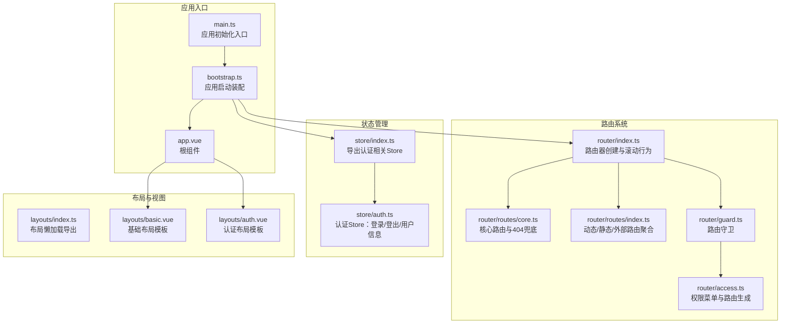
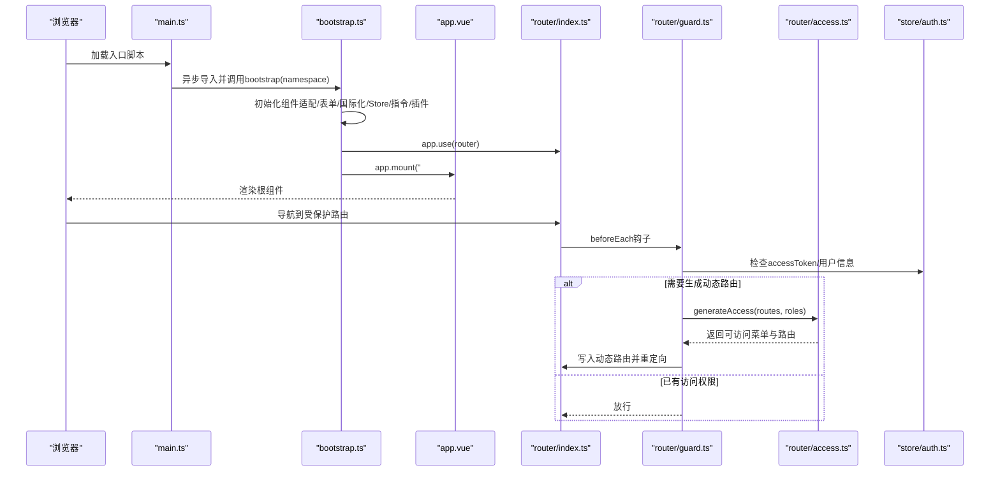
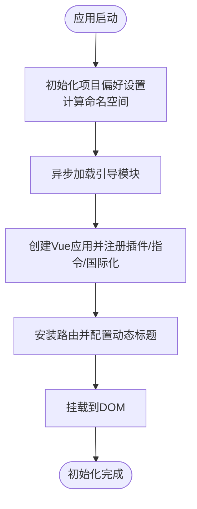
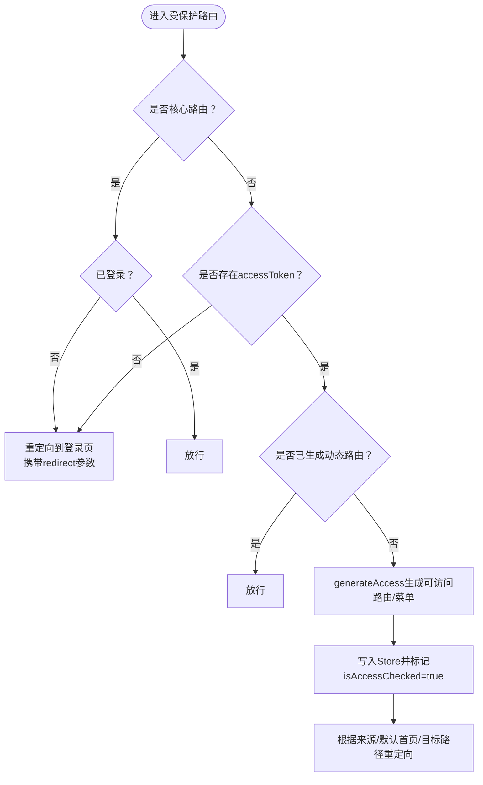
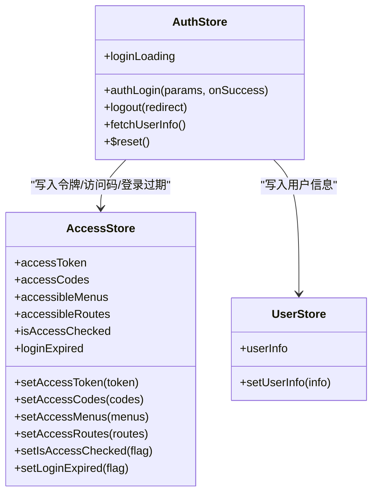
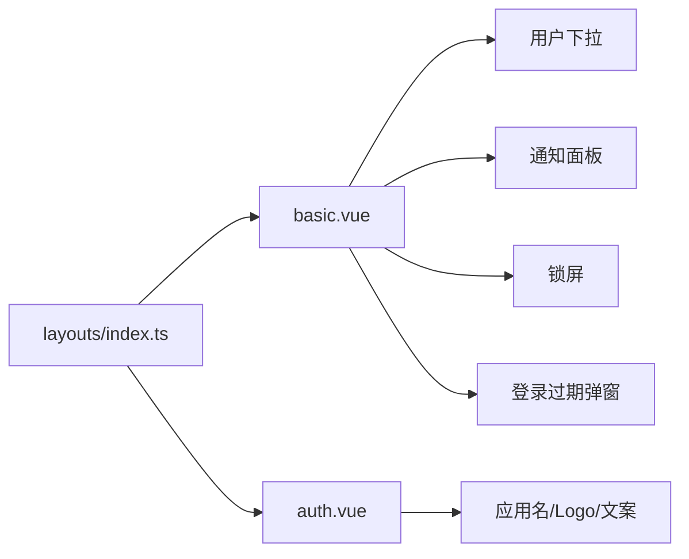
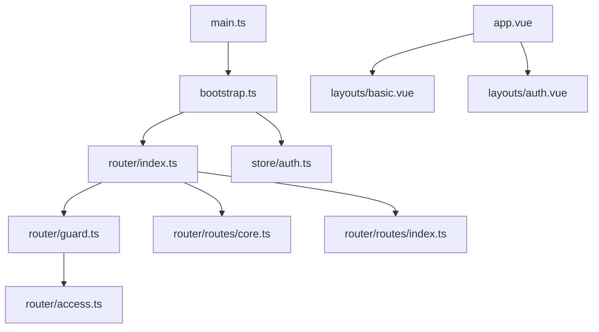

# 应用开发

<cite>
**本文档引用的文件**
- [apps/web-antd/src/main.ts](file://apps/web-antd/src/main.ts)
- [apps/web-antd/src/bootstrap.ts](file://apps/web-antd/src/bootstrap.ts)
- [apps/web-antd/src/app.vue](file://apps/web-antd/src/app.vue)
- [apps/web-antd/src/preferences.ts](file://apps/web-antd/src/preferences.ts)
- [apps/web-antd/src/router/index.ts](file://apps/web-antd/src/router/index.ts)
- [apps/web-antd/src/router/routes/index.ts](file://apps/web-antd/src/router/routes/index.ts)
- [apps/web-antd/src/router/routes/core.ts](file://apps/web-antd/src/router/routes/core.ts)
- [apps/web-antd/src/router/guard.ts](file://apps/web-antd/src/router/guard.ts)
- [apps/web-antd/src/router/access.ts](file://apps/web-antd/src/router/access.ts)
- [apps/web-antd/src/store/index.ts](file://apps/web-antd/src/store/index.ts)
- [apps/web-antd/src/store/auth.ts](file://apps/web-antd/src/store/auth.ts)
- [apps/web-antd/src/layouts/index.ts](file://apps/web-antd/src/layouts/index.ts)
- [apps/web-antd/src/layouts/basic.vue](file://apps/web-antd/src/layouts/basic.vue)
- [apps/web-antd/src/layouts/auth.vue](file://apps/web-antd/src/layouts/auth.vue)
</cite>

## 目录
1. [简介](#简介)
2. [项目结构](#项目结构)
3. [核心组件](#核心组件)
4. [架构总览](#架构总览)
5. [详细组件分析](#详细组件分析)
6. [依赖关系分析](#依赖关系分析)
7. [性能考量](#性能考量)
8. [故障排查指南](#故障排查指南)
9. [结论](#结论)
10. [附录](#附录)

## 简介
本指南面向Vben Admin应用开发者，围绕应用入口初始化、路由系统、状态管理、布局与视图组件、开发示例与规范展开，帮助快速理解并高效扩展应用。

## 项目结构
本仓库采用多应用工作区结构，每个前端应用位于 apps 下的不同包中（如 web-antd、web-antdv-next 等）。本文档聚焦 web-antd 应用的入口、路由、状态与布局实现，其他应用遵循相同模式。

图表来源
- [apps/web-antd/src/main.ts:1-32](file://apps/web-antd/src/main.ts#L1-L32)
- [apps/web-antd/src/bootstrap.ts:1-85](file://apps/web-antd/src/bootstrap.ts#L1-L85)
- [apps/web-antd/src/app.vue:1-48](file://apps/web-antd/src/app.vue#L1-L48)
- [apps/web-antd/src/router/index.ts:1-38](file://apps/web-antd/src/router/index.ts#L1-L38)
- [apps/web-antd/src/router/routes/core.ts:1-98](file://apps/web-antd/src/router/routes/core.ts#L1-L98)
- [apps/web-antd/src/router/routes/index.ts:1-48](file://apps/web-antd/src/router/routes/index.ts#L1-L48)
- [apps/web-antd/src/router/guard.ts:1-133](file://apps/web-antd/src/router/guard.ts#L1-L133)
- [apps/web-antd/src/router/access.ts:1-54](file://apps/web-antd/src/router/access.ts#L1-L54)
- [apps/web-antd/src/store/index.ts:1-2](file://apps/web-antd/src/store/index.ts#L1-L2)
- [apps/web-antd/src/store/auth.ts:1-118](file://apps/web-antd/src/store/auth.ts#L1-L118)
- [apps/web-antd/src/layouts/index.ts:1-7](file://apps/web-antd/src/layouts/index.ts#L1-L7)
- [apps/web-antd/src/layouts/basic.vue:1-207](file://apps/web-antd/src/layouts/basic.vue#L1-L207)
- [apps/web-antd/src/layouts/auth.vue:1-26](file://apps/web-antd/src/layouts/auth.vue#L1-L26)

章节来源
- [apps/web-antd/src/main.ts:1-32](file://apps/web-antd/src/main.ts#L1-L32)
- [apps/web-antd/src/bootstrap.ts:1-85](file://apps/web-antd/src/bootstrap.ts#L1-L85)
- [apps/web-antd/src/router/index.ts:1-38](file://apps/web-antd/src/router/index.ts#L1-L38)
- [apps/web-antd/src/router/routes/index.ts:1-48](file://apps/web-antd/src/router/routes/index.ts#L1-L48)
- [apps/web-antd/src/router/routes/core.ts:1-98](file://apps/web-antd/src/router/routes/core.ts#L1-L98)
- [apps/web-antd/src/router/guard.ts:1-133](file://apps/web-antd/src/router/guard.ts#L1-L133)
- [apps/web-antd/src/router/access.ts:1-54](file://apps/web-antd/src/router/access.ts#L1-L54)
- [apps/web-antd/src/store/index.ts:1-2](file://apps/web-antd/src/store/index.ts#L1-L2)
- [apps/web-antd/src/store/auth.ts:1-118](file://apps/web-antd/src/store/auth.ts#L1-L118)
- [apps/web-antd/src/layouts/index.ts:1-7](file://apps/web-antd/src/layouts/index.ts#L1-L7)
- [apps/web-antd/src/layouts/basic.vue:1-207](file://apps/web-antd/src/layouts/basic.vue#L1-L207)
- [apps/web-antd/src/layouts/auth.vue:1-26](file://apps/web-antd/src/layouts/auth.vue#L1-L26)

## 核心组件
- 应用入口与初始化
  - main.ts：负责应用偏好设置命名空间初始化、异步加载引导模块并挂载、最后移除全局loading。
  - bootstrap.ts：创建Vue应用、注册指令与国际化、初始化Pinia Store、安装路由与UI框架、配置动态标题、最终挂载到DOM。
  - app.vue：根组件，包裹RouterView并通过ConfigProvider注入主题与本地化。
  - preferences.ts：项目级偏好覆盖，如主题模式、访问控制模式、默认首页等。
- 路由系统
  - router/index.ts：创建路由器实例，支持hash/history两种历史记录模式；统一滚动行为；导出路由重置方法。
  - router/routes/index.ts：聚合核心路由、动态路由、外部路由与404兜底；扫描视图组件路径。
  - router/routes/core.ts：定义根路由、认证模块子路由与404兜底。
  - router/guard.ts：通用守卫（进度条）与权限守卫（登录态、角色、动态路由生成与重定向）。
  - router/access.ts：根据访问模式生成可访问菜单与路由，映射页面与布局组件。
- 状态管理（Pinia）
  - store/index.ts：导出认证相关Store。
  - store/auth.ts：登录、登出、获取用户信息、访问码等，结合用户与访问Store完成权限闭环。
- 布局系统
  - layouts/index.ts：懒加载基础布局、认证布局与IFrame视图。
  - layouts/basic.vue：基础布局模板，集成用户下拉、通知、水印、锁屏与登录过期弹窗等。
  - layouts/auth.vue：认证页布局模板，注入应用名、Logo与文案。

章节来源
- [apps/web-antd/src/main.ts:1-32](file://apps/web-antd/src/main.ts#L1-L32)
- [apps/web-antd/src/bootstrap.ts:1-85](file://apps/web-antd/src/bootstrap.ts#L1-L85)
- [apps/web-antd/src/app.vue:1-48](file://apps/web-antd/src/app.vue#L1-L48)
- [apps/web-antd/src/preferences.ts:1-31](file://apps/web-antd/src/preferences.ts#L1-L31)
- [apps/web-antd/src/router/index.ts:1-38](file://apps/web-antd/src/router/index.ts#L1-L38)
- [apps/web-antd/src/router/routes/index.ts:1-48](file://apps/web-antd/src/router/routes/index.ts#L1-L48)
- [apps/web-antd/src/router/routes/core.ts:1-98](file://apps/web-antd/src/router/routes/core.ts#L1-L98)
- [apps/web-antd/src/router/guard.ts:1-133](file://apps/web-antd/src/router/guard.ts#L1-L133)
- [apps/web-antd/src/router/access.ts:1-54](file://apps/web-antd/src/router/access.ts#L1-L54)
- [apps/web-antd/src/store/index.ts:1-2](file://apps/web-antd/src/store/index.ts#L1-L2)
- [apps/web-antd/src/store/auth.ts:1-118](file://apps/web-antd/src/store/auth.ts#L1-L118)
- [apps/web-antd/src/layouts/index.ts:1-7](file://apps/web-antd/src/layouts/index.ts#L1-L7)
- [apps/web-antd/src/layouts/basic.vue:1-207](file://apps/web-antd/src/layouts/basic.vue#L1-L207)
- [apps/web-antd/src/layouts/auth.vue:1-26](file://apps/web-antd/src/layouts/auth.vue#L1-L26)

## 架构总览
应用启动从main.ts开始，通过bootstrap.ts完成依赖注入与应用装配，随后进入路由与状态管理协同工作的阶段。权限守卫在首次访问受保护路由时触发，动态生成菜单与路由并写入Store，最终完成页面渲染。

图表来源
- [apps/web-antd/src/main.ts:9-29](file://apps/web-antd/src/main.ts#L9-L29)
- [apps/web-antd/src/bootstrap.ts:20-82](file://apps/web-antd/src/bootstrap.ts#L20-L82)
- [apps/web-antd/src/router/index.ts:15-37](file://apps/web-antd/src/router/index.ts#L15-L37)
- [apps/web-antd/src/router/guard.ts:47-119](file://apps/web-antd/src/router/guard.ts#L47-L119)
- [apps/web-antd/src/router/access.ts:18-51](file://apps/web-antd/src/router/access.ts#L18-L51)
- [apps/web-antd/src/store/auth.ts:28-78](file://apps/web-antd/src/store/auth.ts#L28-L78)

## 详细组件分析

### 应用入口与初始化流程
- main.ts职责
  - 计算命名空间（版本+环境），初始化项目偏好设置。
  - 异步加载bootstrap.ts并传入命名空间。
  - 应用初始化完成后移除全局loading。
- bootstrap.ts职责
  - 初始化组件适配器与表单适配。
  - 注册全局指令（加载中、权限指令）、国际化、Pinia Store、Tippy、Ant Design Vue。
  - 安装路由并配置动态标题（当启用动态标题时）。
  - 最终挂载应用。
- app.vue职责
  - 通过ConfigProvider注入Ant Design主题与本地化。
  - 渲染RouterView作为页面出口。
- preferences.ts职责
  - 覆盖主题模式、访问模式、默认首页、语言切换与时区等偏好项。

图表来源
- [apps/web-antd/src/main.ts:9-29](file://apps/web-antd/src/main.ts#L9-L29)
- [apps/web-antd/src/bootstrap.ts:20-82](file://apps/web-antd/src/bootstrap.ts#L20-L82)
- [apps/web-antd/src/app.vue:34-39](file://apps/web-antd/src/app.vue#L34-L39)
- [apps/web-antd/src/preferences.ts:8-30](file://apps/web-antd/src/preferences.ts#L8-L30)

章节来源
- [apps/web-antd/src/main.ts:1-32](file://apps/web-antd/src/main.ts#L1-L32)
- [apps/web-antd/src/bootstrap.ts:1-85](file://apps/web-antd/src/bootstrap.ts#L1-L85)
- [apps/web-antd/src/app.vue:1-48](file://apps/web-antd/src/app.vue#L1-L48)
- [apps/web-antd/src/preferences.ts:1-31](file://apps/web-antd/src/preferences.ts#L1-L31)

### 路由系统：动态路由、权限控制与嵌套路由
- 路由创建与历史模式
  - 支持hash与history两种模式，由环境变量决定；统一滚动行为。
- 路由聚合
  - 核心路由（根路由、认证模块、404）与动态/外部/静态路由合并。
  - 动态路由通过模块扫描自动聚合，便于按功能域拆分。
- 权限守卫
  - 通用守卫：记录已加载页面、按配置显示进度条。
  - 权限守卫：校验accessToken、识别核心路由、未登录或无权限时重定向至登录页并携带redirect参数。
  - 首次访问受保护路由时，依据用户角色生成可访问菜单与路由，写入Store并重定向。
- 嵌套路由
  - 根路由使用基础布局作为父容器，子路由无需重复声明父布局。
  - 认证模块为独立嵌套路由组，包含登录、验证码登录、二维码登录、忘记密码、注册等页面。

图表来源
- [apps/web-antd/src/router/guard.ts:47-119](file://apps/web-antd/src/router/guard.ts#L47-L119)
- [apps/web-antd/src/router/routes/core.ts:24-95](file://apps/web-antd/src/router/routes/core.ts#L24-L95)
- [apps/web-antd/src/router/routes/index.ts:15-47](file://apps/web-antd/src/router/routes/index.ts#L15-L47)
- [apps/web-antd/src/router/access.ts:18-51](file://apps/web-antd/src/router/access.ts#L18-L51)

章节来源
- [apps/web-antd/src/router/index.ts:1-38](file://apps/web-antd/src/router/index.ts#L1-L38)
- [apps/web-antd/src/router/routes/index.ts:1-48](file://apps/web-antd/src/router/routes/index.ts#L1-L48)
- [apps/web-antd/src/router/routes/core.ts:1-98](file://apps/web-antd/src/router/routes/core.ts#L1-L98)
- [apps/web-antd/src/router/guard.ts:1-133](file://apps/web-antd/src/router/guard.ts#L1-L133)
- [apps/web-antd/src/router/access.ts:1-54](file://apps/web-antd/src/router/access.ts#L1-L54)

### 状态管理：Pinia Store与模块设计
- Store导出
  - store/index.ts导出认证相关Store，便于在应用层统一引用。
- 认证Store（useAuthStore）
  - 登录：调用登录接口获取accessToken，同时并发获取用户信息与访问码，写入对应Store，成功后推送至用户首页或回调。
  - 登出：调用登出接口，重置所有Store，清除登录过期标记，并回退到登录页携带当前路由。
  - 获取用户信息：封装用户信息读取，写入用户Store。
  - 状态：包含登录loading状态与重置函数。

图表来源
- [apps/web-antd/src/store/auth.ts:16-118](file://apps/web-antd/src/store/auth.ts#L16-L118)
- [apps/web-antd/src/store/index.ts:1-2](file://apps/web-antd/src/store/index.ts#L1-L2)

章节来源
- [apps/web-antd/src/store/index.ts:1-2](file://apps/web-antd/src/store/index.ts#L1-L2)
- [apps/web-antd/src/store/auth.ts:1-118](file://apps/web-antd/src/store/auth.ts#L1-L118)

### 布局系统：基础布局、认证布局与自定义布局
- 布局导出
  - layouts/index.ts懒加载基础布局、认证布局与IFrame视图，避免首屏加载非必要资源。
- 基础布局（basic.vue）
  - 提供用户下拉菜单、通知面板、水印、锁屏与登录过期弹窗等能力。
  - 通过模板插槽扩展用户下拉、通知、额外内容与锁屏区域。
- 认证布局（auth.vue）
  - 用于登录、注册等认证相关页面，注入应用名、Logo与文案，支持自定义工具栏插槽。

图表来源
- [apps/web-antd/src/layouts/index.ts:1-7](file://apps/web-antd/src/layouts/index.ts#L1-L7)
- [apps/web-antd/src/layouts/basic.vue:172-206](file://apps/web-antd/src/layouts/basic.vue#L172-L206)
- [apps/web-antd/src/layouts/auth.vue:14-25](file://apps/web-antd/src/layouts/auth.vue#L14-L25)

章节来源
- [apps/web-antd/src/layouts/index.ts:1-7](file://apps/web-antd/src/layouts/index.ts#L1-L7)
- [apps/web-antd/src/layouts/basic.vue:1-207](file://apps/web-antd/src/layouts/basic.vue#L1-L207)
- [apps/web-antd/src/layouts/auth.vue:1-26](file://apps/web-antd/src/layouts/auth.vue#L1-L26)

### 视图组件开发模式
- 页面组件
  - 位于views目录，按功能域分层组织（如dashboard、system、dev等）。
  - 路由通过扫描views下的.vue文件构建componentKeys，配合权限生成器映射页面组件。
- 业务组件
  - 位于components目录，按领域拆分（如AiEditor、DictTag、UserAvatar等），复用性强。
- 通用组件
  - 位于packages或内部共享包，提供跨应用复用的基础UI与工具。

章节来源
- [apps/web-antd/src/router/routes/index.ts:38-45](file://apps/web-antd/src/router/routes/index.ts#L38-L45)

## 依赖关系分析
- 入口与引导
  - main.ts依赖bootstrap.ts与偏好设置；bootstrap.ts依赖路由、国际化、Store、指令与UI库。
- 路由与权限
  - 路由守卫依赖Store与访问生成器；访问生成器依赖菜单API与页面/布局映射。
- 布局与视图
  - 基础布局与认证布局分别被根路由与认证路由引用，形成父子关系。

图表来源
- [apps/web-antd/src/main.ts:24-25](file://apps/web-antd/src/main.ts#L24-L25)
- [apps/web-antd/src/bootstrap.ts:18-58](file://apps/web-antd/src/bootstrap.ts#L18-L58)
- [apps/web-antd/src/router/index.ts:9-37](file://apps/web-antd/src/router/index.ts#L9-L37)
- [apps/web-antd/src/router/guard.ts:8-11](file://apps/web-antd/src/router/guard.ts#L8-L11)
- [apps/web-antd/src/router/access.ts:12-14](file://apps/web-antd/src/router/access.ts#L12-L14)
- [apps/web-antd/src/router/routes/core.ts:8-95](file://apps/web-antd/src/router/routes/core.ts#L8-L95)
- [apps/web-antd/src/router/routes/index.ts:5-47](file://apps/web-antd/src/router/routes/index.ts#L5-L47)
- [apps/web-antd/src/app.vue:34-39](file://apps/web-antd/src/app.vue#L34-L39)
- [apps/web-antd/src/layouts/basic.vue:172-206](file://apps/web-antd/src/layouts/basic.vue#L172-L206)
- [apps/web-antd/src/layouts/auth.vue:14-25](file://apps/web-antd/src/layouts/auth.vue#L14-L25)

章节来源
- [apps/web-antd/src/main.ts:1-32](file://apps/web-antd/src/main.ts#L1-L32)
- [apps/web-antd/src/bootstrap.ts:1-85](file://apps/web-antd/src/bootstrap.ts#L1-L85)
- [apps/web-antd/src/router/index.ts:1-38](file://apps/web-antd/src/router/index.ts#L1-L38)
- [apps/web-antd/src/router/guard.ts:1-133](file://apps/web-antd/src/router/guard.ts#L1-L133)
- [apps/web-antd/src/router/access.ts:1-54](file://apps/web-antd/src/router/access.ts#L1-L54)
- [apps/web-antd/src/router/routes/core.ts:1-98](file://apps/web-antd/src/router/routes/core.ts#L1-L98)
- [apps/web-antd/src/router/routes/index.ts:1-48](file://apps/web-antd/src/router/routes/index.ts#L1-L48)
- [apps/web-antd/src/app.vue:1-48](file://apps/web-antd/src/app.vue#L1-L48)
- [apps/web-antd/src/layouts/basic.vue:1-207](file://apps/web-antd/src/layouts/basic.vue#L1-L207)
- [apps/web-antd/src/layouts/auth.vue:1-26](file://apps/web-antd/src/layouts/auth.vue#L1-L26)

## 性能考量
- 路由懒加载
  - 布局与页面均采用动态导入，减少首屏体积。
- 进度条与滚动优化
  - 路由守卫按配置显示进度条；滚动行为统一处理，提升体验。
- 组件与指令
  - 全局指令与插件按需注册，避免不必要的开销。
- 主题与国际化
  - 通过ConfigProvider集中注入，减少重复渲染。

## 故障排查指南
- 登录后无法跳转
  - 检查登录Store返回的用户首页或默认首页配置，确认权限守卫中的重定向逻辑。
- 403/404问题
  - 确认权限生成器返回的可访问路由是否包含目标路径；核对菜单API返回结构与映射。
- 动态标题不生效
  - 确认偏好设置中动态标题开关与路由meta.title配置。
- 布局错位或样式异常
  - 检查ConfigProvider主题与本地化配置；确认基础布局模板插槽使用正确。

章节来源
- [apps/web-antd/src/store/auth.ts:58-61](file://apps/web-antd/src/store/auth.ts#L58-L61)
- [apps/web-antd/src/router/guard.ts:109-117](file://apps/web-antd/src/router/guard.ts#L109-L117)
- [apps/web-antd/src/router/access.ts:26-50](file://apps/web-antd/src/router/access.ts#L26-L50)
- [apps/web-antd/src/preferences.ts:24](file://apps/web-antd/src/preferences.ts#L24)
- [apps/web-antd/src/app.vue:34-39](file://apps/web-antd/src/app.vue#L34-L39)
- [apps/web-antd/src/layouts/basic.vue:172-206](file://apps/web-antd/src/layouts/basic.vue#L172-L206)

## 结论
本文档梳理了Vben Admin应用的入口初始化、路由与权限、状态管理、布局与视图的关键实现与最佳实践。遵循本文档的组织方式与开发规范，可快速扩展页面与功能模块，并保持良好的可维护性与一致性。

## 附录

### 开发示例：创建一个新的页面与功能模块
- 新增页面
  - 在views目录下创建页面组件（如views/demo/new-page.vue）。
  - 在router/routes/modules下新增模块文件（如demo.ts），定义路由记录并导出。
  - 若需权限控制，在菜单API中新增对应菜单项，确保权限生成器可映射到该页面。
- 新增功能模块
  - 将通用组件放入components目录，按领域命名。
  - 在api目录新增接口封装，统一导出并在页面中调用。
  - 在store中新增对应模块（如demo.ts），按需与auth/store联动。
- 验证流程
  - 启动应用，访问新页面；若为受保护路由，先登录再验证权限生成是否正确。
  - 检查导航菜单是否出现新入口，点击后能否正确渲染页面。

章节来源
- [apps/web-antd/src/router/routes/index.ts:7-16](file://apps/web-antd/src/router/routes/index.ts#L7-L16)
- [apps/web-antd/src/router/routes/index.ts:38-45](file://apps/web-antd/src/router/routes/index.ts#L38-L45)
- [apps/web-antd/src/router/access.ts:18-51](file://apps/web-antd/src/router/access.ts#L18-L51)

### 开发规范与代码组织建议
- 文件命名与目录
  - 页面组件：views/模块/页面.vue；业务组件：components/领域/组件.vue；通用工具：packages/或internal/。
- 路由组织
  - 动态路由按模块拆分，文件名语义清晰；核心路由与404兜底集中管理。
- 状态管理
  - Store按领域拆分，避免单体Store膨胀；登录态与用户态分离。
- 布局与视图
  - 基础布局承载通用UI能力；认证布局仅用于认证相关页面；通过插槽扩展个性化内容。
- 国际化与偏好
  - 文案统一通过国际化；偏好设置集中于preferences.ts，按需覆盖默认值。