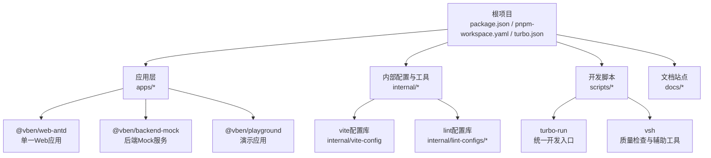
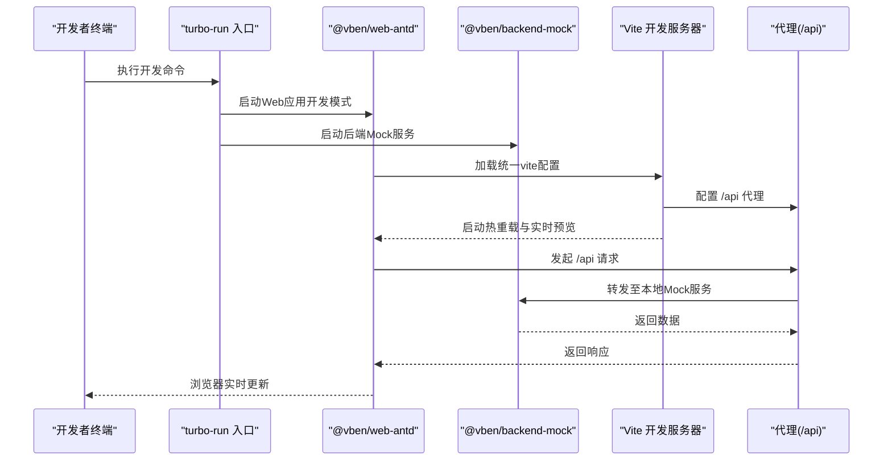
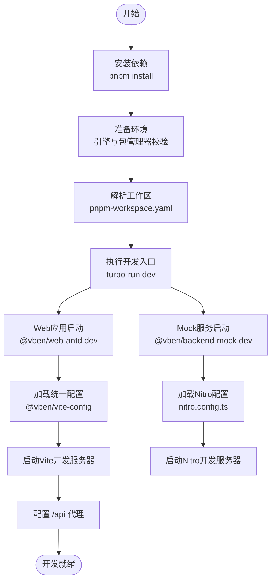
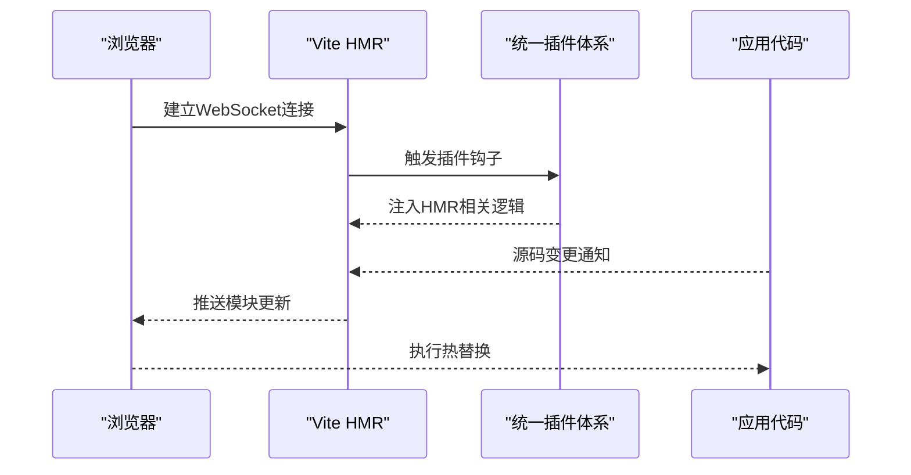
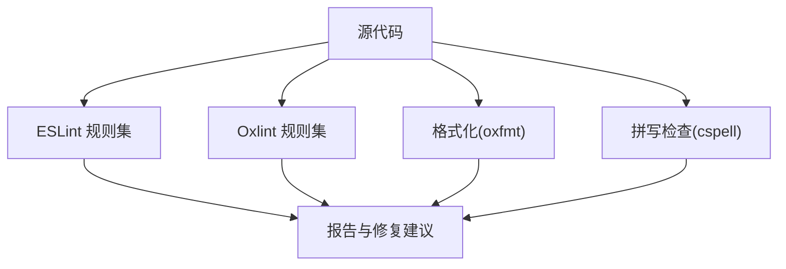
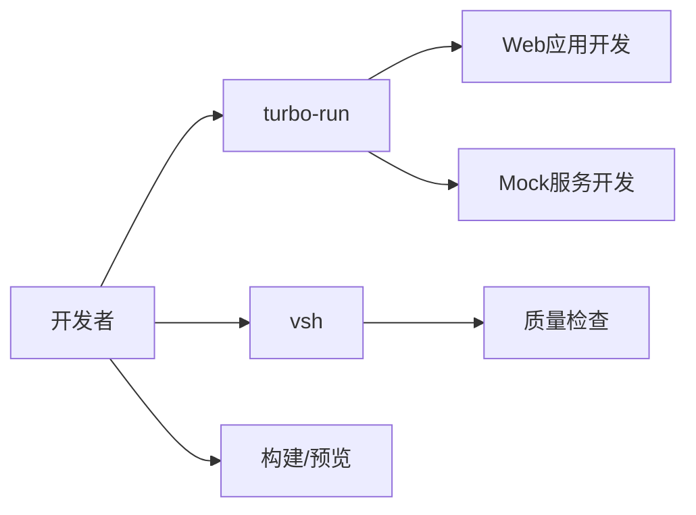
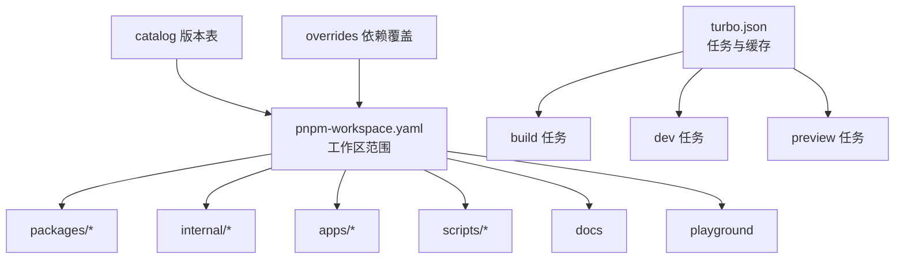

# 开发工作流

<cite>
**本文引用的文件**
- [package.json](file://package.json)
- [pnpm-workspace.yaml](file://pnpm-workspace.yaml)
- [turbo.json](file://turbo.json)
- [README.md](file://README.md)
- [apps/web-antd/package.json](file://apps/web-antd/package.json)
- [apps/web-antd/vite.config.ts](file://apps/web-antd/vite.config.ts)
- [apps/backend-mock/package.json](file://apps/backend-mock/package.json)
- [apps/backend-mock/nitro.config.ts](file://apps/backend-mock/nitro.config.ts)
- [playground/vite.config.ts](file://playground/vite.config.ts)
- [internal/vite-config/src/index.ts](file://internal/vite-config/src/index.ts)
- [internal/lint-configs/eslint-config/src/index.ts](file://internal/lint-configs/eslint-config/src/index.ts)
- [eslint.config.mjs](file://eslint.config.mjs)
- [oxlint.config.ts](file://oxlint.config.ts)
- [scripts/vsh/bin/vsh.mjs](file://scripts/vsh/bin/vsh.mjs)
- [scripts/turbo-run/bin/turbo-run.mjs](file://scripts/turbo-run/bin/turbo-run.mjs)
</cite>

## 更新摘要

**所做更改**

- 更新项目结构章节，反映从多应用架构向单一应用架构的转变
- 修订开发环境搭建章节，移除多应用启动说明，强调单一应用开发流程
- 更新架构总览图，展示新的开发工作流
- 新增后端Mock服务集成说明
- 调整开发调试章节，增加Mock服务调试内容

## 目录

1. [简介](#简介)
2. [项目结构](#项目结构)
3. [核心组件](#核心组件)
4. [架构总览](#架构总览)
5. [详细组件分析](#详细组件分析)
6. [依赖分析](#依赖分析)
7. [性能考虑](#性能考虑)
8. [故障排查指南](#故障排查指南)
9. [结论](#结论)
10. [附录](#附录)

## 简介

本指南面向Vben Admin的前端开发工作流，聚焦于开发环境搭建与配置、依赖管理、开发服务器启动、热重载与实时预览机制、调试方法与技巧（浏览器调试、网络监控、性能分析）、代码规范与质量保障（ESLint、Oxlint、格式化、拼写检查）、以及开发效率工具与自动化脚本的使用。文档以仓库现有配置为依据，提供可操作的步骤与可视化图示，帮助开发者快速上手并高效迭代。

**重要更新**：项目已从传统的多应用架构（web-antd、web-ele、web-naive、web-tdesign）转向单一应用架构，简化了开发流程和部署策略。

## 项目结构

该仓库采用Monorepo结构，使用pnpm进行包管理与workspace组织，结合Turbo进行任务编排与缓存优化。核心应用位于apps目录下，包含单一Web应用和后端Mock服务；内部工具与配置位于internal目录；开发脚本位于scripts目录；文档站点位于docs目录；根级配置文件定义了统一的脚本命令、引擎要求与工作区范围。

**图表来源**

- [package.json:1-109](file://package.json#L1-L109)
- [pnpm-workspace.yaml:1-193](file://pnpm-workspace.yaml#L1-L193)
- [turbo.json:1-49](file://turbo.json#L1-L49)
- [apps/web-antd/vite.config.ts:1-21](file://apps/web-antd/vite.config.ts#L1-L21)

**章节来源**

- [package.json:1-109](file://package.json#L1-L109)
- [pnpm-workspace.yaml:1-193](file://pnpm-workspace.yaml#L1-L193)
- [turbo.json:1-49](file://turbo.json#L1-L49)

## 核心组件

- 包管理与工作区：通过pnpm-workspace.yaml声明所有子包与覆盖规则，确保依赖版本一致性与共享。
- 任务编排与缓存：通过turbo.json定义构建、预览、开发等任务的依赖关系与缓存策略，支持增量构建与持久化开发进程。
- 应用配置：单一Web应用通过vite.config.ts加载统一的vite配置库，集中处理代理、插件与开发服务器参数。
- 后端Mock服务：独立的Nitro后端Mock服务，提供API模拟和数据管理功能。
- 质量工具链：ESLint与Oxlint配置由内部lint-configs提供，配合格式化与拼写检查工具，形成统一的代码规范。
- 开发脚本：turbo-run与vsh作为统一入口，简化开发与质量检查流程。

**章节来源**

- [pnpm-workspace.yaml:1-193](file://pnpm-workspace.yaml#L1-L193)
- [turbo.json:1-49](file://turbo.json#L1-L49)
- [apps/web-antd/vite.config.ts:1-21](file://apps/web-antd/vite.config.ts#L1-L21)
- [apps/backend-mock/package.json:1-22](file://apps/backend-mock/package.json#L1-L22)
- [internal/vite-config/src/index.ts:1-6](file://internal/vite-config/src/index.ts#L1-L6)
- [internal/lint-configs/eslint-config/src/index.ts:1-47](file://internal/lint-configs/eslint-config/src/index.ts#L1-L47)
- [eslint.config.mjs:1-4](file://eslint.config.mjs#L1-L4)
- [oxlint.config.ts:1-6](file://oxlint.config.ts#L1-L6)
- [scripts/turbo-run/bin/turbo-run.mjs:1-4](file://scripts/turbo-run/bin/turbo-run.mjs#L1-L4)
- [scripts/vsh/bin/vsh.mjs:1-4](file://scripts/vsh/bin/vsh.mjs#L1-L4)

## 架构总览

下图展示了从开发命令到具体应用启动、代理与预览的整体流程，体现单一应用开发与后端Mock服务集成的协作关系。

**图表来源**

- [scripts/turbo-run/bin/turbo-run.mjs:1-4](file://scripts/turbo-run/bin/turbo-run.mjs#L1-L4)
- [apps/web-antd/package.json:18-24](file://apps/web-antd/package.json#L18-L24)
- [apps/web-antd/vite.config.ts:1-21](file://apps/web-antd/vite.config.ts#L1-L21)
- [apps/backend-mock/package.json:8-11](file://apps/backend-mock/package.json#L8-L11)

## 详细组件分析

### 开发环境搭建与启动

- 安装与准备
  - 使用pnpm管理依赖，并遵循根级engines与packageManager约束。
  - 通过workspaces自动解析子包依赖，避免重复安装。
- 启动开发服务器
  - 根级脚本提供统一入口，turbo-run负责协调Web应用和后端Mock服务开发。
  - Web应用通过vite脚本启动开发模式，加载统一的vite配置库。
  - 后端Mock服务通过Nitro框架提供API模拟功能。
- 环境变量与模式
  - 通过loadAndConvertEnv加载.env与环境变量，确保开发模式正确注入。
  - 模式切换（development/production/analyze）在应用脚本中定义。

**图表来源**

- [package.json:27-66](file://package.json#L27-L66)
- [pnpm-workspace.yaml:1-193](file://pnpm-workspace.yaml#L1-L193)
- [turbo.json:38-43](file://turbo.json#L38-L43)
- [apps/web-antd/package.json:18-24](file://apps/web-antd/package.json#L18-L24)
- [apps/web-antd/vite.config.ts:1-21](file://apps/web-antd/vite.config.ts#L1-L21)
- [apps/backend-mock/package.json:8-11](file://apps/backend-mock/package.json#L8-L11)
- [apps/backend-mock/nitro.config.ts](file://apps/backend-mock/nitro.config.ts)

**章节来源**

- [package.json:27-66](file://package.json#L27-L66)
- [pnpm-workspace.yaml:1-193](file://pnpm-workspace.yaml#L1-L193)
- [turbo.json:38-43](file://turbo.json#L38-L43)
- [apps/web-antd/package.json:18-24](file://apps/web-antd/package.json#L18-L24)
- [apps/web-antd/vite.config.ts:1-21](file://apps/web-antd/vite.config.ts#L1-L21)
- [apps/backend-mock/package.json:8-11](file://apps/backend-mock/package.json#L8-L11)
- [apps/backend-mock/nitro.config.ts](file://apps/backend-mock/nitro.config.ts)
- [internal/vite-config/src/index.ts:1-6](file://internal/vite-config/src/index.ts#L1-L6)

### 代码编辑器与开发工具配置

- ESLint与Oxlint
  - 通过@vben/eslint-config与@vben/oxlint-config提供统一规则集，支持Vue、TypeScript、Node、YAML、JSONC等生态。
  - 根级eslint.config.mjs与oxlint.config.ts分别导出配置，便于IDE与CI集成。
- 格式化与拼写检查
  - 结合oxfmt与cspell，确保代码风格一致与术语拼写准确。
- IDE集成建议
  - 在VS Code中启用ESLint与Prettier扩展，结合oxlint与cspell插件，实现保存即格式化与拼写提示。

**章节来源**

- [internal/lint-configs/eslint-config/src/index.ts:1-47](file://internal/lint-configs/eslint-config/src/index.ts#L1-L47)
- [eslint.config.mjs:1-4](file://eslint.config.mjs#L1-L4)
- [oxlint.config.ts:1-6](file://oxlint.config.ts#L1-L6)

### 热重载与实时预览机制

- Vite热重载
  - 开发模式下，Vite监听源码变更并触发模块热替换，实现页面无刷新更新。
- 插件与中间件
  - 统一的vite配置库提供插件注册与选项扩展能力，确保应用行为一致。
- WebSocket与代理
  - 代理配置支持ws连接，保障实时通信场景下的热更新体验。

**图表来源**

- [apps/web-antd/vite.config.ts:1-21](file://apps/web-antd/vite.config.ts#L1-L21)
- [internal/vite-config/src/index.ts:1-6](file://internal/vite-config/src/index.ts#L1-L6)

**章节来源**

- [apps/web-antd/vite.config.ts:1-21](file://apps/web-antd/vite.config.ts#L1-L21)
- [internal/vite-config/src/index.ts:1-6](file://internal/vite-config/src/index.ts#L1-L6)

### 开发调试方法与技巧

- 浏览器调试
  - 使用浏览器开发者工具断点调试、查看网络请求与响应、分析渲染性能。
- 网络监控
  - 利用代理配置定位接口调用路径，结合浏览器Network面板观察请求头、状态码与耗时。
- 性能分析
  - 使用Vite DevTools或浏览器性能面板分析首屏渲染、资源加载与重绘情况。
- 单元测试与端到端测试
  - 提供单元测试与端到端测试脚本，便于在开发过程中验证功能稳定性。
- Mock服务调试
  - 后端Mock服务提供完整的API模拟环境，支持数据管理和接口调试。

**章节来源**

- [package.json:61-62](file://package.json#L61-L62)
- [apps/backend-mock/package.json:8-11](file://apps/backend-mock/package.json#L8-L11)

### 代码规范与质量保证

- 规则聚合
  - ESLint配置按生态模块聚合，支持Vue单文件、TypeScript、Node、YAML、JSONC等。
- 自定义规则
  - 支持自定义配置扩展，满足团队特定规范。
- 质量检查脚本
  - 通过vsh与turbo集成，提供循环依赖检测、依赖检查、类型检查与拼写检查等。

**图表来源**

- [internal/lint-configs/eslint-config/src/index.ts:1-47](file://internal/lint-configs/eslint-config/src/index.ts#L1-L47)
- [eslint.config.mjs:1-4](file://eslint.config.mjs#L1-L4)
- [oxlint.config.ts:1-6](file://oxlint.config.ts#L1-L6)

**章节来源**

- [internal/lint-configs/eslint-config/src/index.ts:1-47](file://internal/lint-configs/eslint-config/src/index.ts#L1-L47)
- [eslint.config.mjs:1-4](file://eslint.config.mjs#L1-L4)
- [oxlint.config.ts:1-6](file://oxlint.config.ts#L1-L6)

### 开发效率工具与自动化脚本

- 统一开发入口
  - turbo-run提供统一开发入口，同时启动Web应用和后端Mock服务。
- 质量检查工具
  - vsh封装循环依赖、依赖、类型与拼写检查，一键运行。
- 构建与预览
  - 根级脚本提供构建、分析与预览命令，支持按应用过滤构建。

**图表来源**

- [scripts/turbo-run/bin/turbo-run.mjs:1-4](file://scripts/turbo-run/bin/turbo-run.mjs#L1-L4)
- [scripts/vsh/bin/vsh.mjs:1-4](file://scripts/vsh/bin/vsh.mjs#L1-L4)
- [package.json:27-66](file://package.json#L27-L66)

**章节来源**

- [scripts/turbo-run/bin/turbo-run.mjs:1-4](file://scripts/turbo-run/bin/turbo-run.mjs#L1-L4)
- [scripts/vsh/bin/vsh.mjs:1-4](file://scripts/vsh/bin/vsh.mjs#L1-L4)
- [package.json:27-66](file://package.json#L27-L66)

## 依赖分析

- 工作区范围
  - pnpm-workspace.yaml声明了internal、packages、apps、scripts、docs与playground等包范围，确保Monorepo内依赖共享与版本统一。
- 依赖覆盖与Catalog
  - overrides与catalog字段集中管理依赖版本，减少重复声明与冲突。
- 任务依赖与缓存
  - turbo.json定义构建依赖链与缓存输出，提升构建效率与可重复性。

**图表来源**

- [pnpm-workspace.yaml:1-193](file://pnpm-workspace.yaml#L1-L193)
- [turbo.json:1-49](file://turbo.json#L1-L49)

**章节来源**

- [pnpm-workspace.yaml:1-193](file://pnpm-workspace.yaml#L1-L193)
- [turbo.json:1-49](file://turbo.json#L1-L49)

## 性能考虑

- 构建与分析
  - 使用分析模式构建，识别体积瓶颈与依赖冗余。
- 缓存与增量构建
  - 利用Turbo的任务缓存与增量构建，缩短开发等待时间。
- 代理与网络
  - 合理配置代理与ws，避免不必要的网络往返与阻塞。

## 故障排查指南

- 依赖安装问题
  - 确认Node与pnpm版本满足根级engines要求；若lockfile不一致，尝试清理并重新安装。
- 开发服务器无法启动
  - 检查端口占用与代理配置是否正确；确认应用脚本中的开发模式参数。
- 热重载失效
  - 确认Vite配置已加载统一插件；检查浏览器控制台是否有错误信息。
- 质量检查失败
  - 运行vsh lint --format自动修复；逐条处理ESLint与Oxlint报告。
- Mock服务问题
  - 检查Nitro配置文件是否正确；确认API路由是否按约定命名。

**章节来源**

- [package.json:103-108](file://package.json#L103-L108)
- [apps/web-antd/vite.config.ts:1-21](file://apps/web-antd/vite.config.ts#L1-L21)
- [apps/backend-mock/nitro.config.ts](file://apps/backend-mock/nitro.config.ts)
- [eslint.config.mjs:1-4](file://eslint.config.mjs#L1-L4)
- [oxlint.config.ts:1-6](file://oxlint.config.ts#L1-L6)

## 结论

本指南基于仓库现有配置，系统梳理了Vben Admin的开发工作流：从环境搭建、依赖管理、开发服务器启动，到热重载与调试、代码规范与质量保障、以及效率工具与自动化脚本。项目已从多应用架构转向单一应用架构，简化了开发流程并提升了开发效率。建议在实际开发中结合应用的vite配置与统一的vite配置库，确保开发体验的一致性与可维护性。

## 附录

- 快速开始
  - 获取代码、安装依赖、启动开发、构建与预览，参考根级README与脚本命令。
- 浏览器支持
  - 推荐使用现代浏览器进行开发与调试。

**章节来源**

- [README.md:55-82](file://README.md#L55-L82)
- [package.json:27-66](file://package.json#L27-L66)
