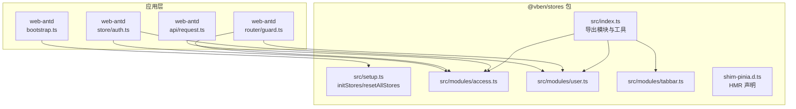
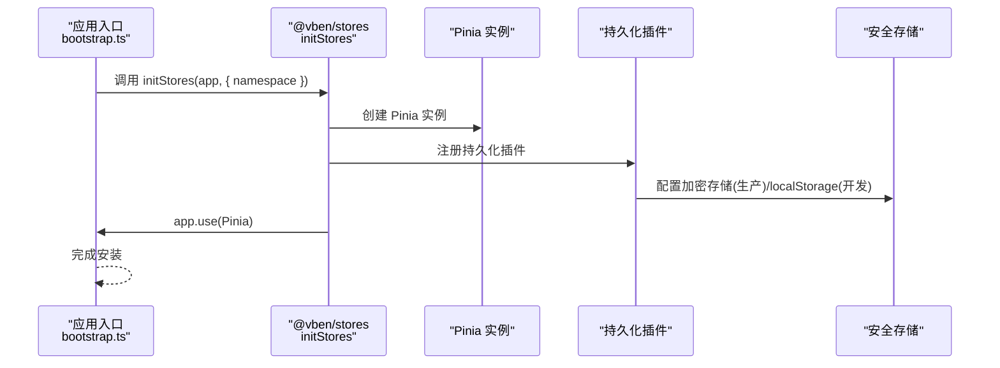
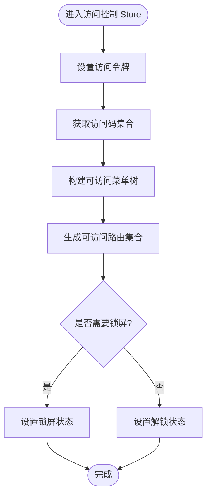
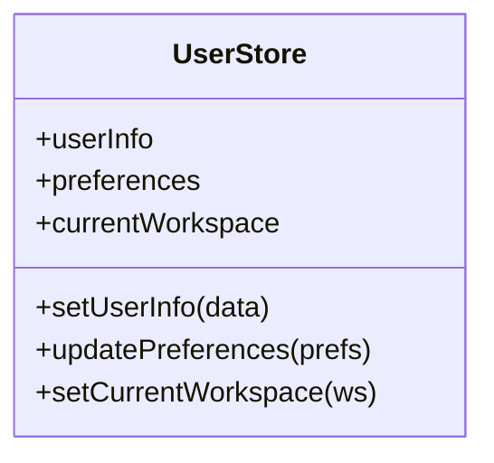
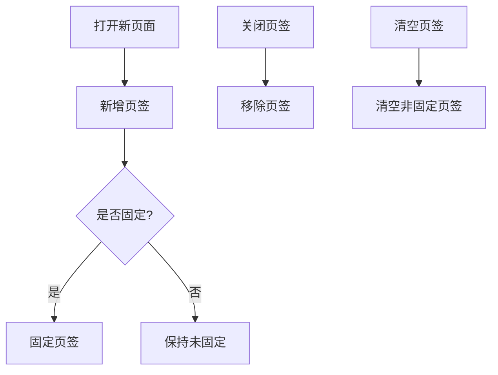
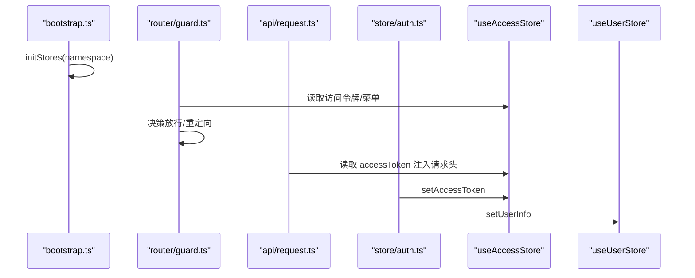
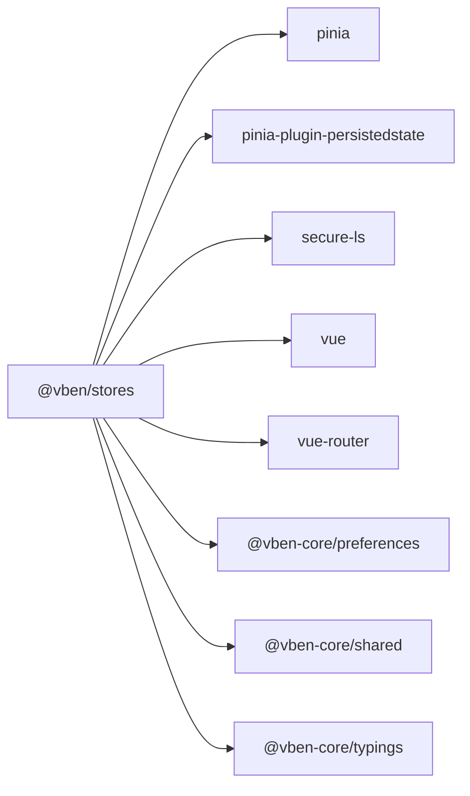

# Pinia Store 设计

<cite>
**本文档引用的文件**
- [packages/stores/package.json](file://packages/stores/package.json)
- [packages/stores/shim-pinia.d.ts](file://packages/stores/shim-pinia.d.ts)
- [packages/stores/src/index.ts](file://packages/stores/src/index.ts)
- [packages/stores/src/setup.ts](file://packages/stores/src/setup.ts)
- [packages/stores/src/modules/access.ts](file://packages/stores/src/modules/access.ts)
- [packages/stores/src/modules/user.ts](file://packages/stores/src/modules/user.ts)
- [packages/stores/src/modules/tabbar.ts](file://packages/stores/src/modules/tabbar.ts)
- [apps/web-antd/src/store/auth.ts](file://apps/web-antd/src/store/auth.ts)
- [apps/web-antd/src/bootstrap.ts](file://apps/web-antd/src/bootstrap.ts)
- [apps/web-antd/src/router/guard.ts](file://apps/web-antd/src/router/guard.ts)
- [apps/web-antd/src/api/request.ts](file://apps/web-antd/src/api/request.ts)
</cite>

## 目录

1. [简介](#简介)
2. [项目结构](#项目结构)
3. [核心组件](#核心组件)
4. [架构总览](#架构总览)
5. [详细组件分析](#详细组件分析)
6. [依赖分析](#依赖分析)
7. [性能考虑](#性能考虑)
8. [故障排除指南](#故障排除指南)
9. [结论](#结论)

## 简介

本文件系统性阐述 Vben Admin 中基于 Pinia 的状态管理设计，重点覆盖以下方面：

- Store 模块化组织与命名空间管理
- 注册机制与持久化策略
- Store 设计模式（状态、Action、Getter）
- 模块间依赖关系与最佳实践
- 与 Vue 组件的集成与响应式更新机制

该设计以统一的 @vben/stores 包为核心，提供跨前端框架（Ant Design、Element Plus、Naive UI、TDesign）共享的状态层，并通过应用侧初始化与模块化导出实现解耦。

## 项目结构

Vben Admin 将状态管理抽象为独立包 @vben/stores，提供：

- 统一的 Pinia 初始化与持久化插件配置
- 核心业务 Store 模块（如访问控制、用户、标签页等）
- 类型与 HMR 兼容声明

图表来源

- [packages/stores/src/index.ts:1-3](file://packages/stores/src/index.ts#L1-L3)
- [packages/stores/src/setup.ts:42-70](file://packages/stores/src/setup.ts#L42-L70)
- [packages/stores/src/modules/access.ts:51-97](file://packages/stores/src/modules/access.ts#L51-L97)
- [packages/stores/src/modules/user.ts:40-60](file://packages/stores/src/modules/user.ts#L40-L60)
- [packages/stores/src/modules/tabbar.ts:74-90](file://packages/stores/src/modules/tabbar.ts#L74-L90)
- [apps/web-antd/src/store/auth.ts:16-48](file://apps/web-antd/src/store/auth.ts#L16-L48)
- [apps/web-antd/src/bootstrap.ts:1-10](file://apps/web-antd/src/bootstrap.ts#L1-L10)
- [apps/web-antd/src/router/guard.ts:1-10](file://apps/web-antd/src/router/guard.ts#L1-L10)
- [apps/web-antd/src/api/request.ts:1-25](file://apps/web-antd/src/api/request.ts#L1-L25)

章节来源

- [packages/stores/package.json:1-33](file://packages/stores/package.json#L1-L33)
- [packages/stores/src/index.ts:1-3](file://packages/stores/src/index.ts#L1-L3)
- [packages/stores/src/setup.ts:42-70](file://packages/stores/src/setup.ts#L42-L70)

## 核心组件

- 统一初始化器：负责创建 Pinia 实例、注入持久化插件与安全存储，挂载到应用实例。
- Store 模块：按领域划分（访问控制、用户、标签页），每个模块暴露 useXxxStore Hook。
- 工具导出：统一 re-export defineStore、storeToRefs，便于上层直接使用。
- HMR 兼容：通过类型声明确保开发时热更新正常工作。

关键职责与行为：

- 初始化阶段：根据环境变量选择存储介质（开发用 localStorage，生产用加密存储），并以应用命名空间前缀隔离键值。
- 运行时：各模块通过 defineStore 定义状态、Action 与 Getter；组件通过 useXxxStore 访问。
- 重置：提供 resetAllStores 统一键控重置能力，便于登出或切换用户场景。

章节来源

- [packages/stores/src/setup.ts:42-70](file://packages/stores/src/setup.ts#L42-L70)
- [packages/stores/src/index.ts:1-3](file://packages/stores/src/index.ts#L1-L3)
- [packages/stores/shim-pinia.d.ts:1-9](file://packages/stores/shim-pinia.d.ts#L1-L9)

## 架构总览

整体架构采用“包内模块化 + 应用侧初始化”的双层设计：

- 包内：模块化 Store 定义与导出，统一工具与类型声明。
- 应用侧：在入口处调用 initStores 完成 Pinia 安装与持久化配置，随后在路由守卫、API 层、业务组件中按需使用 Store。

图表来源

- [apps/web-antd/src/bootstrap.ts:1-10](file://apps/web-antd/src/bootstrap.ts#L1-L10)
- [packages/stores/src/setup.ts:42-70](file://packages/stores/src/setup.ts#L42-L70)

## 详细组件分析

### 访问控制 Store（useAccessStore）

- 角色定位：集中管理访问令牌、菜单树、路由集合、访问码、锁屏状态等。
- 关键能力：
  - 设置/获取访问令牌与刷新令牌
  - 维护可访问菜单与路由集合
  - 提供按路径检索菜单的方法
  - 锁屏/解锁流程
- 数据流：登录成功后，从后端获取令牌与访问码，写入 Store；路由守卫与菜单渲染基于该状态进行决策。

图表来源

- [packages/stores/src/modules/access.ts:51-97](file://packages/stores/src/modules/access.ts#L51-L97)

章节来源

- [packages/stores/src/modules/access.ts:51-97](file://packages/stores/src/modules/access.ts#L51-L97)

### 用户 Store（useUserStore）

- 角色定位：维护用户基本信息、偏好设置、当前工作区等。
- 关键能力：
  - 设置用户信息
  - 更新偏好与工作区
  - 与访问控制 Store 协作，驱动权限与导航变化
- 数据流：登录后拉取用户信息，写入用户 Store；UI 组件订阅用户状态以渲染头像、昵称等。

图表来源

- [packages/stores/src/modules/user.ts:40-60](file://packages/stores/src/modules/user.ts#L40-L60)

章节来源

- [packages/stores/src/modules/user.ts:40-60](file://packages/stores/src/modules/user.ts#L40-L60)

### 标签页 Store（useTabbarStore）

- 角色定位：管理多页签状态，支持新增、关闭、固定、清空等操作。
- 关键能力：
  - 新增/关闭页签
  - 固定/取消固定
  - 清空非固定页签
- 数据流：页面跳转触发新增页签；用户交互触发关闭/固定；持久化插件保证刷新后恢复。

图表来源

- [packages/stores/src/modules/tabbar.ts:74-90](file://packages/stores/src/modules/tabbar.ts#L74-L90)

章节来源

- [packages/stores/src/modules/tabbar.ts:74-90](file://packages/stores/src/modules/tabbar.ts#L74-L90)

### 应用侧集成示例（web-antd）

- 初始化：应用入口调用 initStores 完成 Pinia 安装与持久化配置。
- 路由守卫：使用 useAccessStore 与 useUserStore 决策放行与导航。
- API 层：在请求拦截器中读取访问令牌，注入到请求头。
- 业务 Store：如认证 Store 使用 useAccessStore 与 useUserStore 完成登录流程。

图表来源

- [apps/web-antd/src/bootstrap.ts:1-10](file://apps/web-antd/src/bootstrap.ts#L1-L10)
- [apps/web-antd/src/router/guard.ts:1-10](file://apps/web-antd/src/router/guard.ts#L1-L10)
- [apps/web-antd/src/api/request.ts:1-25](file://apps/web-antd/src/api/request.ts#L1-L25)
- [apps/web-antd/src/store/auth.ts:16-48](file://apps/web-antd/src/store/auth.ts#L16-L48)
- [packages/stores/src/modules/access.ts:51-97](file://packages/stores/src/modules/access.ts#L51-L97)
- [packages/stores/src/modules/user.ts:40-60](file://packages/stores/src/modules/user.ts#L40-L60)

章节来源

- [apps/web-antd/src/bootstrap.ts:1-10](file://apps/web-antd/src/bootstrap.ts#L1-L10)
- [apps/web-antd/src/router/guard.ts:1-10](file://apps/web-antd/src/router/guard.ts#L1-L10)
- [apps/web-antd/src/api/request.ts:1-25](file://apps/web-antd/src/api/request.ts#L1-L25)
- [apps/web-antd/src/store/auth.ts:16-48](file://apps/web-antd/src/store/auth.ts#L16-L48)

## 依赖分析

- 外部依赖：Pinia、pinia-plugin-persistedstate、secure-ls、vue、vue-router。
- 内部依赖：@vben-core/\* 系列包（preferences、shared、typings）。
- 包导出：统一 re-export defineStore、storeToRefs，便于上层直接使用。

图表来源

- [packages/stores/package.json:22-31](file://packages/stores/package.json#L22-L31)

章节来源

- [packages/stores/package.json:1-33](file://packages/stores/package.json#L1-L33)

## 性能考虑

- 存储介质选择：开发环境使用 localStorage，生产环境使用加密存储，兼顾易调试与安全性。
- 持久化键命名：以应用命名空间前缀区分不同应用的持久化数据，避免冲突。
- 重置策略：提供 resetAllStores 统一键控重置，减少内存泄漏风险。
- 模块化拆分：按领域拆分 Store，降低单模块复杂度，提升可维护性与测试性。

## 故障排除指南

- HMR 更新异常：确认已正确引入 shim-pinia.d.ts，确保 acceptHMRUpdate 声明可用。
- 持久化不生效：检查环境变量 VITE_APP_STORE_SECURE_KEY 是否配置，以及命名空间是否一致。
- 登录后状态未更新：确认在登录成功后调用了 setAccessToken/setUserInfo 等写入方法，并在路由守卫中读取最新状态。
- 重置 Store 后页面异常：确保在登出流程中调用 resetAllStores，并重新初始化必要的状态。

章节来源

- [packages/stores/shim-pinia.d.ts:1-9](file://packages/stores/shim-pinia.d.ts#L1-L9)
- [packages/stores/src/setup.ts:42-70](file://packages/stores/src/setup.ts#L42-L70)
- [packages/stores/src/setup.ts:72-81](file://packages/stores/src/setup.ts#L72-L81)

## 结论

Vben Admin 的 Pinia Store 设计通过“包内模块化 + 应用侧初始化”的架构，实现了跨前端框架的一致状态管理体验。其核心优势在于：

- 统一的初始化与持久化策略，保障开发与生产的无缝衔接
- 明确的模块边界与清晰的命名空间，便于扩展与维护
- 与路由守卫、API 层、业务组件的自然集成，形成完整的状态流转闭环

建议在实际项目中遵循本文档的最佳实践，持续优化模块拆分与命名规范，确保状态管理的可演进性与可测试性。
