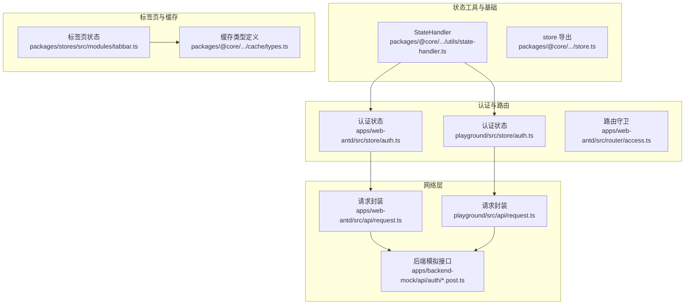
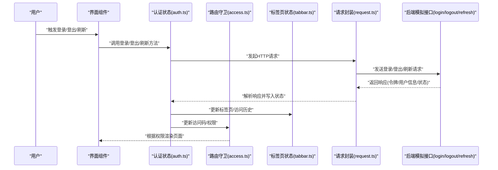
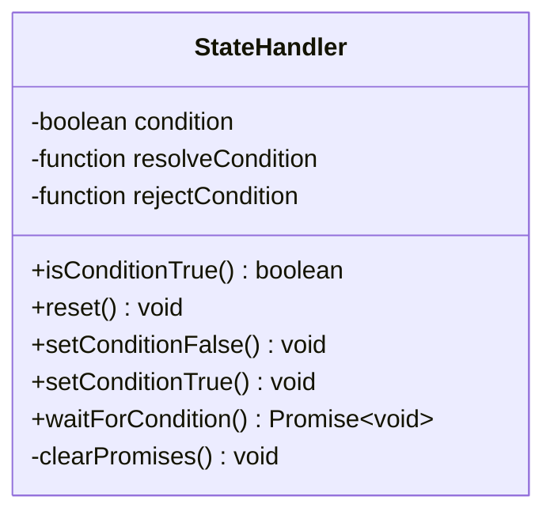
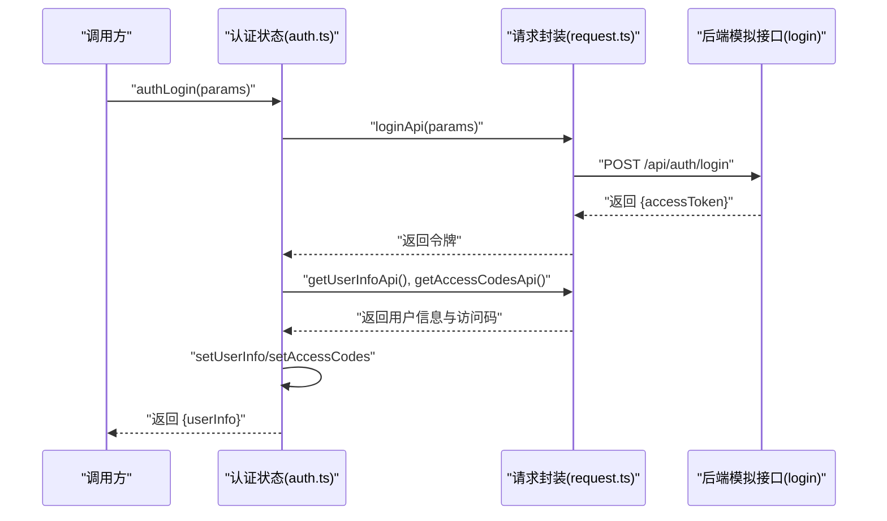
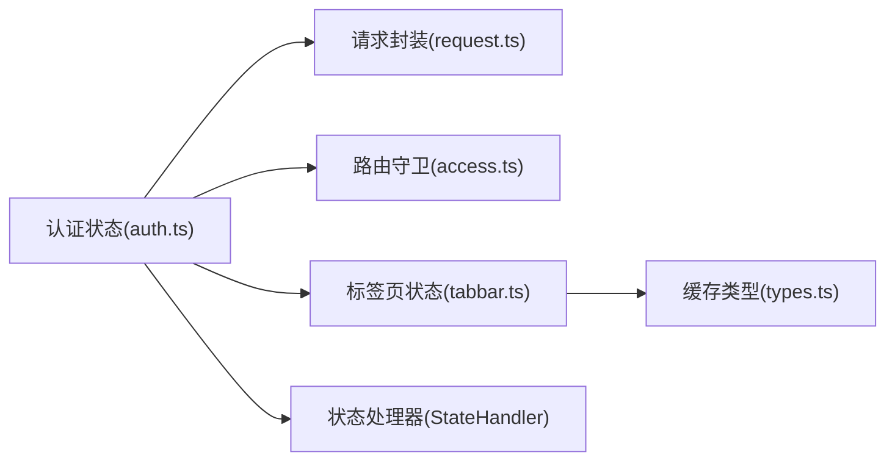

# 状态同步

<cite>
**本文引用的文件**
- [state-handler.ts](file://packages/@core/base/shared/src/utils/state-handler.ts)
- [state-handler.test.ts](file://packages/@core/base/shared/src/utils/__tests__/state-handler.test.ts)
- [store.ts](file://packages/@core/base/shared/src/store.ts)
- [auth.ts（web-antd）](file://apps/web-antd/src/store/auth.ts)
- [auth.ts（playground）](file://playground/src/store/auth.ts)
- [access.ts（web-antd）](file://apps/web-antd/src/router/access.ts)
- [tabbar.ts](file://packages/stores/src/modules/tabbar.ts)
- [types.ts（缓存类型）](file://packages/@core/base/shared/src/cache/types.ts)
- [storage-manager.test.ts](file://packages/@core/base/shared/src/cache/__tests__/storage-manager.test.ts)
- [login.post.ts（后端模拟）](file://apps/backend-mock/api/auth/login.post.ts)
- [logout.post.ts（后端模拟）](file://apps/backend-mock/api/auth/logout.post.ts)
- [refresh.post.ts（后端模拟）](file://apps/backend-mock/api/auth/refresh.post.ts)
- [request.ts（前端请求封装）](file://apps/web-antd/src/api/request.ts)
- [request.ts（playground）](file://playground/src/api/request.ts)
</cite>

## 目录
1. [简介](#简介)
2. [项目结构](#项目结构)
3. [核心组件](#核心组件)
4. [架构总览](#架构总览)
5. [详细组件分析](#详细组件分析)
6. [依赖关系分析](#依赖关系分析)
7. [性能考虑](#性能考虑)
8. [故障排查指南](#故障排查指南)
9. [结论](#结论)
10. [附录](#附录)

## 简介
本文件系统性阐述 Vben Admin 的“状态同步”机制，聚焦于客户端状态与服务器状态之间的同步策略、实时数据更新与离线状态处理、触发条件与更新时机、冲突解决（乐观更新与悲观锁）、性能优化（批量更新与防抖）、以及跨标签页状态共享与 WebSocket 实时同步的实现思路。文档以仓库现有代码为依据，结合可落地的实践建议，帮助开发者在不破坏既有架构的前提下扩展或优化状态同步能力。

## 项目结构
围绕状态同步的关键目录与文件如下：
- 状态工具与基础：packages/@core/base/shared/src/utils/state-handler.ts
- 状态库导出：packages/@core/base/shared/src/store.ts（导出 @tanstack/vue-store）
- 认证状态：apps/web-antd/src/store/auth.ts、playground/src/store/auth.ts
- 路由守卫与访问控制：apps/web-antd/src/router/access.ts
- 标签页状态持久化：packages/stores/src/modules/tabbar.ts
- 缓存与本地存储：packages/@core/base/shared/src/cache/types.ts、packages/@core/base/shared/src/cache/__tests__/storage-manager.test.ts
- 前端请求封装：apps/web-antd/src/api/request.ts、playground/src/api/request.ts
- 后端模拟接口：apps/backend-mock/api/auth/*.post.ts

图表来源
- [state-handler.ts:1-51](file://packages/@core/base/shared/src/utils/state-handler.ts#L1-L51)
- [store.ts:1-2](file://packages/@core/base/shared/src/store.ts#L1-L2)
- [auth.ts（web-antd）:1-118](file://apps/web-antd/src/store/auth.ts#L1-L118)
- [auth.ts（playground）:1-127](file://playground/src/store/auth.ts#L1-L127)
- [access.ts（web-antd）](file://apps/web-antd/src/router/access.ts)
- [tabbar.ts:67-626](file://packages/stores/src/modules/tabbar.ts#L67-L626)
- [types.ts（缓存类型）:1-17](file://packages/@core/base/shared/src/cache/types.ts#L1-L17)
- [request.ts（前端请求封装）](file://apps/web-antd/src/api/request.ts)
- [request.ts（playground）](file://playground/src/api/request.ts)
- [login.post.ts（后端模拟）](file://apps/backend-mock/api/auth/login.post.ts)
- [logout.post.ts（后端模拟）](file://apps/backend-mock/api/auth/logout.post.ts)
- [refresh.post.ts（后端模拟）](file://apps/backend-mock/api/auth/refresh.post.ts)

章节来源
- [state-handler.ts:1-51](file://packages/@core/base/shared/src/utils/state-handler.ts#L1-L51)
- [store.ts:1-2](file://packages/@core/base/shared/src/store.ts#L1-L2)
- [auth.ts（web-antd）:1-118](file://apps/web-antd/src/store/auth.ts#L1-L118)
- [auth.ts（playground）:1-127](file://playground/src/store/auth.ts#L1-L127)
- [access.ts（web-antd）](file://apps/web-antd/src/router/access.ts)
- [tabbar.ts:67-626](file://packages/stores/src/modules/tabbar.ts#L67-L626)
- [types.ts（缓存类型）:1-17](file://packages/@core/base/shared/src/cache/types.ts#L1-L17)
- [request.ts（前端请求封装）](file://apps/web-antd/src/api/request.ts)
- [request.ts（playground）](file://playground/src/api/request.ts)
- [login.post.ts（后端模拟）](file://apps/backend-mock/api/auth/login.post.ts)
- [logout.post.ts（后端模拟）](file://apps/backend-mock/api/auth/logout.post.ts)
- [refresh.post.ts（后端模拟）](file://apps/backend-mock/api/auth/refresh.post.ts)

## 核心组件
- 状态处理器 StateHandler：提供布尔条件等待与切换能力，支持显式 resolve/reject 与重置，用于协调异步流程中的状态达成。
- 认证状态管理：封装登录、登出、用户信息拉取等流程，统一写入用户与访问状态，并处理登录过期标记。
- 路由守卫：基于访问码与权限进行页面级拦截与放行。
- 标签页状态：维护标签页列表与访问历史，支持持久化与序列化重建。
- 请求封装：统一处理请求/响应、错误与鉴权头注入，作为状态同步的数据通道。
- 缓存与本地存储：提供带过期的本地存储抽象，支撑离线场景下的状态恢复。

章节来源
- [state-handler.ts:1-51](file://packages/@core/base/shared/src/utils/state-handler.ts#L1-L51)
- [auth.ts（web-antd）:16-118](file://apps/web-antd/src/store/auth.ts#L16-L118)
- [auth.ts（playground）:16-127](file://playground/src/store/auth.ts#L16-L127)
- [access.ts（web-antd）](file://apps/web-antd/src/router/access.ts)
- [tabbar.ts:67-626](file://packages/stores/src/modules/tabbar.ts#L67-L626)
- [types.ts（缓存类型）:1-17](file://packages/@core/base/shared/src/cache/types.ts#L1-L17)
- [request.ts（前端请求封装）](file://apps/web-antd/src/api/request.ts)
- [request.ts（playground）](file://playground/src/api/request.ts)

## 架构总览
下图展示“状态同步”的整体交互：客户端通过认证状态管理发起登录/登出与用户信息拉取；路由守卫根据访问码进行权限控制；标签页状态负责页面上下文的持久化；请求封装负责与后端模拟接口通信；缓存与本地存储提供离线恢复能力。

图表来源
- [auth.ts（web-antd）:28-78](file://apps/web-antd/src/store/auth.ts#L28-L78)
- [auth.ts（playground）:29-79](file://playground/src/store/auth.ts#L29-L79)
- [access.ts（web-antd）](file://apps/web-antd/src/router/access.ts)
- [tabbar.ts:67-626](file://packages/stores/src/modules/tabbar.ts#L67-L626)
- [request.ts（前端请求封装）](file://apps/web-antd/src/api/request.ts)
- [login.post.ts（后端模拟）](file://apps/backend-mock/api/auth/login.post.ts)
- [logout.post.ts（后端模拟）](file://apps/backend-mock/api/auth/logout.post.ts)
- [refresh.post.ts（后端模拟）](file://apps/backend-mock/api/auth/refresh.post.ts)

## 详细组件分析

### 状态处理器 StateHandler
StateHandler 提供“条件等待”能力：当外部将条件置为 true 时，等待 Promise resolve；若置为 false，则 reject。该组件常用于协调异步流程（如登录完成、权限就绪）后再继续后续步骤。

图表来源
- [state-handler.ts:1-51](file://packages/@core/base/shared/src/utils/state-handler.ts#L1-L51)

章节来源
- [state-handler.ts:1-51](file://packages/@core/base/shared/src/utils/state-handler.ts#L1-L51)
- [state-handler.test.ts:1-60](file://packages/@core/base/shared/src/utils/__tests__/state-handler.test.ts#L1-L60)

### 认证状态管理（登录/登出/用户信息）
认证状态管理负责：
- 登录：调用登录接口获取令牌，随后并发拉取用户信息与访问码，成功后写入用户与访问状态，并处理登录过期标记与路由跳转。
- 登出：调用登出接口，清理所有状态，重置登录过期标记，并跳转至登录页。
- 用户信息：拉取并写入用户信息，供其他模块使用。

图表来源
- [auth.ts（web-antd）:28-78](file://apps/web-antd/src/store/auth.ts#L28-L78)
- [auth.ts（playground）:29-79](file://playground/src/store/auth.ts#L29-L79)
- [request.ts（前端请求封装）](file://apps/web-antd/src/api/request.ts)
- [login.post.ts（后端模拟）](file://apps/backend-mock/api/auth/login.post.ts)

章节来源
- [auth.ts（web-antd）:16-118](file://apps/web-antd/src/store/auth.ts#L16-L118)
- [auth.ts（playground）:16-127](file://playground/src/store/auth.ts#L16-L127)

### 路由守卫与访问控制
路由守卫基于访问码与权限进行拦截与放行，确保只有具备相应权限的用户才能访问特定页面。该模块与认证状态紧密协作，保证“状态同步”在导航层面的一致性。

章节来源
- [access.ts（web-antd）](file://apps/web-antd/src/router/access.ts)

### 标签页状态与持久化
标签页状态模块维护标签页列表与访问历史，并对部分状态进行持久化（如 sessionStorage）。其序列化/反序列化逻辑包含对复杂数据结构的重建，确保状态恢复的完整性。

章节来源
- [tabbar.ts:67-626](file://packages/stores/src/modules/tabbar.ts#L67-L626)

### 请求封装与后端接口
请求封装负责统一处理请求与响应、错误处理与鉴权头注入，是“状态同步”的数据通道。后端模拟接口提供登录、登出、刷新等关键路径，便于前端联调与测试。

章节来源
- [request.ts（前端请求封装）](file://apps/web-antd/src/api/request.ts)
- [request.ts（playground）](file://playground/src/api/request.ts)
- [login.post.ts（后端模拟）](file://apps/backend-mock/api/auth/login.post.ts)
- [logout.post.ts（后端模拟）](file://apps/backend-mock/api/auth/logout.post.ts)
- [refresh.post.ts（后端模拟）](file://apps/backend-mock/api/auth/refresh.post.ts)

### 离线状态与本地缓存
本地缓存提供带过期时间的存储能力，支持默认值回退与过期清理，有助于在弱网/离线场景下提供基本可用的状态恢复。

章节来源
- [types.ts（缓存类型）:1-17](file://packages/@core/base/shared/src/cache/types.ts#L1-L17)
- [storage-manager.test.ts:1-79](file://packages/@core/base/shared/src/cache/__tests__/storage-manager.test.ts#L1-L79)

## 依赖关系分析
- 认证状态依赖请求封装与后端模拟接口，用于获取令牌与用户信息。
- 路由守卫依赖访问码与权限状态，保障导航一致性。
- 标签页状态依赖缓存类型定义与持久化策略，确保跨会话状态恢复。
- StateHandler 作为通用工具，可被多个业务模块复用以协调异步流程。

图表来源
- [auth.ts（web-antd）:1-118](file://apps/web-antd/src/store/auth.ts#L1-L118)
- [access.ts（web-antd）](file://apps/web-antd/src/router/access.ts)
- [tabbar.ts:67-626](file://packages/stores/src/modules/tabbar.ts#L67-L626)
- [types.ts（缓存类型）:1-17](file://packages/@core/base/shared/src/cache/types.ts#L1-L17)
- [state-handler.ts:1-51](file://packages/@core/base/shared/src/utils/state-handler.ts#L1-L51)
- [request.ts（前端请求封装）](file://apps/web-antd/src/api/request.ts)

章节来源
- [auth.ts（web-antd）:1-118](file://apps/web-antd/src/store/auth.ts#L1-L118)
- [access.ts（web-antd）](file://apps/web-antd/src/router/access.ts)
- [tabbar.ts:67-626](file://packages/stores/src/modules/tabbar.ts#L67-L626)
- [types.ts（缓存类型）:1-17](file://packages/@core/base/shared/src/cache/types.ts#L1-L17)
- [state-handler.ts:1-51](file://packages/@core/base/shared/src/utils/state-handler.ts#L1-L51)
- [request.ts（前端请求封装）](file://apps/web-antd/src/api/request.ts)

## 性能考虑
- 批量更新
  - 在认证流程中，用户信息与访问码采用并发拉取，减少总等待时间。
  - 标签页状态的批量关闭与去重操作使用集合结构，降低遍历成本。
- 防抖与节流
  - 对频繁触发的导航或搜索事件，可在调用方引入防抖/节流，避免状态抖动与重复请求。
- 缓存与本地存储
  - 利用带过期时间的本地缓存，优先读取本地数据，再异步刷新，提升首屏与弱网体验。
- 并发控制
  - 对同一资源的多次更新请求，应合并或去重，避免竞态与重复渲染。

## 故障排查指南
- 登录后状态未更新
  - 检查登录流程是否正确写入令牌与用户信息，确认并发拉取用户信息与访问码的执行顺序。
  - 关注路由跳转与权限标记的更新时机。
- 登出后仍可访问受限页面
  - 排查路由守卫是否正确读取访问码与权限，确认登出流程是否重置了相关状态。
- 标签页状态异常
  - 检查持久化配置与序列化重建逻辑，确保复杂数据结构在反序列化后保持可用。
- 离线状态下数据不同步
  - 核对本地缓存的过期策略与默认值回退逻辑，确认在网络恢复后能正确刷新。

章节来源
- [auth.ts（web-antd）:28-78](file://apps/web-antd/src/store/auth.ts#L28-L78)
- [auth.ts（playground）:29-79](file://playground/src/store/auth.ts#L29-L79)
- [access.ts（web-antd）](file://apps/web-antd/src/router/access.ts)
- [tabbar.ts:67-626](file://packages/stores/src/modules/tabbar.ts#L67-L626)
- [types.ts（缓存类型）:1-17](file://packages/@core/base/shared/src/cache/types.ts#L1-L17)

## 结论
Vben Admin 的状态同步以“认证状态管理”为核心，配合“路由守卫”“标签页状态”“请求封装”与“本地缓存”，形成从登录到导航再到页面上下文的完整闭环。通过并发拉取、批量更新与本地缓存策略，系统在性能与可用性之间取得平衡。未来可在以下方向演进：引入 WebSocket 实时推送、完善乐观/悲观冲突处理、增强跨标签页共享与一致性校验。

## 附录
- 状态同步触发条件与更新时机
  - 登录成功：写入令牌与用户信息，更新访问码与权限，触发路由跳转。
  - 登出：清理所有状态，重置登录过期标记，触发登录页跳转。
  - 用户信息变更：通过用户信息接口拉取最新数据，写入用户状态。
- 冲突解决方案
  - 乐观更新：在提交前先更新本地状态，提交失败时回滚。
  - 悲观锁：在提交期间锁定资源，提交完成后释放。
- 跨标签页状态共享与 WebSocket 实时同步
  - 建议通过浏览器广播通道或共享存储事件实现跨标签页通知；WebSocket 用于服务端主动推送，客户端收到消息后触发状态刷新。