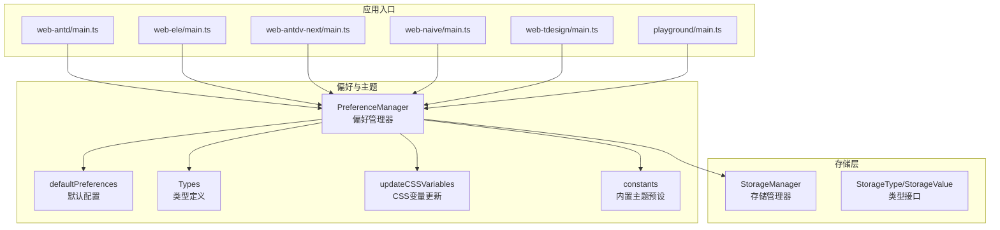
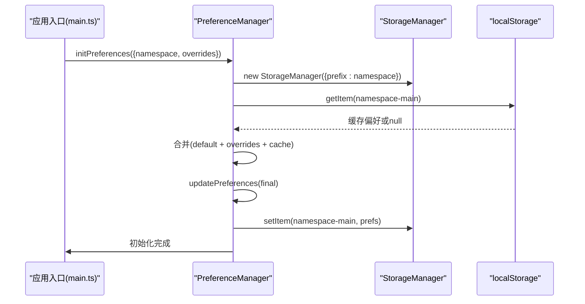
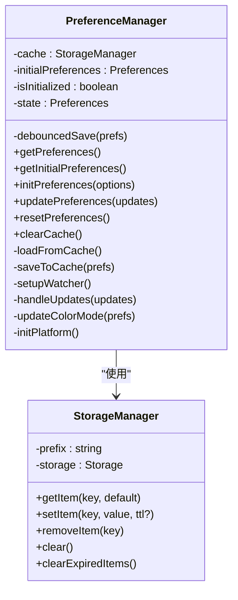
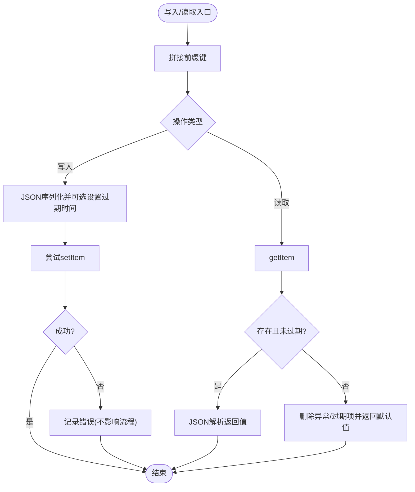
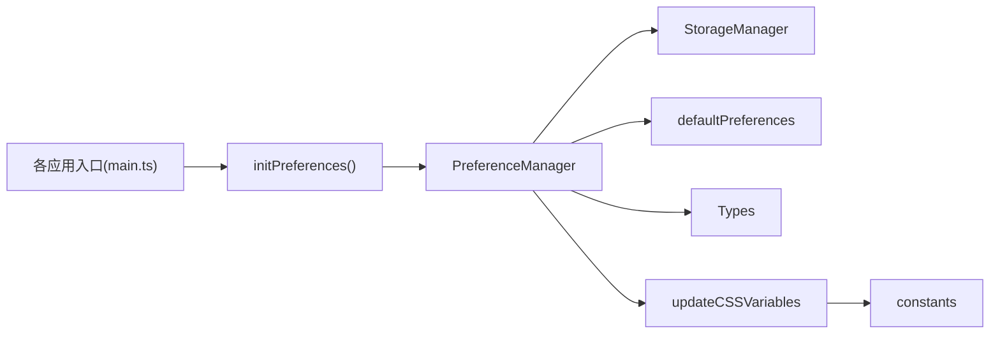

# 状态持久化

<cite>
**本文引用的文件**
- [packages/@core/preferences/src/preferences.ts](file://packages/@core/preferences/src/preferences.ts)
- [packages/@core/preferences/src/config.ts](file://packages/@core/preferences/src/config.ts)
- [packages/@core/preferences/src/types.ts](file://packages/@core/preferences/src/types.ts)
- [packages/@core/preferences/src/update-css-variables.ts](file://packages/@core/preferences/src/update-css-variables.ts)
- [packages/@core/preferences/src/constants.ts](file://packages/@core/preferences/src/constants.ts)
- [packages/@core/base/shared/src/cache/storage-manager.ts](file://packages/@core/base/shared/src/cache/storage-manager.ts)
- [packages/@core/base/shared/src/cache/types.ts](file://packages/@core/base/shared/src/cache/types.ts)
- [apps/web-antd/src/main.ts](file://apps/web-antd/src/main.ts)
- [apps/web-ele/src/main.ts](file://apps/web-ele/src/main.ts)
- [apps/web-antdv-next/src/main.ts](file://apps/web-antdv-next/src/main.ts)
- [apps/web-naive/src/main.ts](file://apps/web-naive/src/main.ts)
- [apps/web-tdesign/src/main.ts](file://apps/web-tdesign/src/main.ts)
- [playground/src/main.ts](file://playground/src/main.ts)
- [apps/web-antd/src/preferences.ts](file://apps/web-antd/src/preferences.ts)
</cite>

## 目录

1. [简介](#简介)
2. [项目结构](#项目结构)
3. [核心组件](#核心组件)
4. [架构总览](#架构总览)
5. [组件详解](#组件详解)
6. [依赖关系分析](#依赖关系分析)
7. [性能与容量优化](#性能与容量优化)
8. [故障排查指南](#故障排查指南)
9. [结论](#结论)

## 简介

本文件系统性阐述 Vben Admin 的状态持久化机制，重点覆盖以下方面：

- 持久化介质与策略：localStorage、sessionStorage 的选择与使用边界
- 需要持久化的状态域：用户偏好设置、主题配置、会话状态
- 序列化与反序列化：JSON 编解码、类型安全与版本兼容
- 状态恢复：应用启动时的初始化流程、错误兜底与回退策略
- 性能优化：去抖写入、批量持久化、容量与异常处理

## 项目结构

围绕“状态持久化”的关键模块分布如下：

- 偏好设置与主题：偏好管理器、默认配置、类型定义、CSS 变量更新
- 存储抽象：统一的 StorageManager，封装 localStorage/sessionStorage
- 应用入口：各 UI 框架示例应用在启动阶段调用偏好初始化
- 项目级覆盖：通过 overridesPreferences 定义项目特定偏好

图表来源

- [packages/@core/preferences/src/preferences.ts:25-230](file://packages/@core/preferences/src/preferences.ts#L25-L230)
- [packages/@core/preferences/src/config.ts:3-148](file://packages/@core/preferences/src/config.ts#L3-L148)
- [packages/@core/preferences/src/types.ts:296-348](file://packages/@core/preferences/src/types.ts#L296-L348)
- [packages/@core/preferences/src/update-css-variables.ts:12-82](file://packages/@core/preferences/src/update-css-variables.ts#L12-L82)
- [packages/@core/base/shared/src/cache/storage-manager.ts:13-116](file://packages/@core/base/shared/src/cache/storage-manager.ts#L13-L116)
- [packages/@core/base/shared/src/cache/types.ts:1-17](file://packages/@core/base/shared/src/cache/types.ts#L1-L17)
- [apps/web-antd/src/main.ts:9-29](file://apps/web-antd/src/main.ts#L9-L29)
- [apps/web-ele/src/main.ts:9-29](file://apps/web-ele/src/main.ts#L9-L29)
- [apps/web-antdv-next/src/main.ts:9-29](file://apps/web-antdv-next/src/main.ts#L9-L29)
- [apps/web-naive/src/main.ts:9-29](file://apps/web-naive/src/main.ts#L9-L29)
- [apps/web-tdesign/src/main.ts:9-29](file://apps/web-tdesign/src/main.ts#L9-L29)
- [playground/src/main.ts:9-29](file://playground/src/main.ts#L9-L29)

章节来源

- [packages/@core/preferences/src/preferences.ts:25-230](file://packages/@core/preferences/src/preferences.ts#L25-L230)
- [packages/@core/base/shared/src/cache/storage-manager.ts:13-116](file://packages/@core/base/shared/src/cache/storage-manager.ts#L13-L116)
- [apps/web-antd/src/main.ts:9-29](file://apps/web-antd/src/main.ts#L9-L29)

## 核心组件

- 偏好管理器（PreferenceManager）
  - 负责偏好设置的初始化、更新、持久化与监听
  - 提供只读访问、重置、清理缓存等能力
- 存储管理器（StorageManager）
  - 统一封装 localStorage/sessionStorage
  - 支持带前缀的键空间隔离、TTL 过期、JSON 序列化
- 默认配置与类型
  - defaultPreferences 定义全量偏好默认值
  - Types 定义偏好结构与枚举类型
- CSS 变量更新
  - 根据主题与颜色配置动态更新根节点 CSS 变量

章节来源

- [packages/@core/preferences/src/preferences.ts:25-230](file://packages/@core/preferences/src/preferences.ts#L25-L230)
- [packages/@core/base/shared/src/cache/storage-manager.ts:13-116](file://packages/@core/base/shared/src/cache/storage-manager.ts#L13-L116)
- [packages/@core/preferences/src/config.ts:3-148](file://packages/@core/preferences/src/config.ts#L3-L148)
- [packages/@core/preferences/src/types.ts:296-348](file://packages/@core/preferences/src/types.ts#L296-L348)
- [packages/@core/preferences/src/update-css-variables.ts:12-82](file://packages/@core/preferences/src/update-css-variables.ts#L12-L82)

## 架构总览

应用启动时，入口脚本根据环境生成命名空间（namespace），随后调用偏好初始化。初始化流程将默认配置、项目覆盖配置与缓存中的历史偏好进行合并，得到最终状态，并持久化到存储层。

图表来源

- [apps/web-antd/src/main.ts:9-29](file://apps/web-antd/src/main.ts#L9-L29)
- [packages/@core/preferences/src/preferences.ts:70-100](file://packages/@core/preferences/src/preferences.ts#L70-L100)
- [packages/@core/base/shared/src/cache/storage-manager.ts:97-106](file://packages/@core/base/shared/src/cache/storage-manager.ts#L97-L106)

## 组件详解

### 偏好管理器（PreferenceManager）

- 初始化与命名空间
  - 通过 namespace 隔离不同项目/版本/环境的偏好数据
  - 合并顺序：项目覆盖配置 → 默认配置 → 历史缓存
- 状态更新与持久化
  - updatePreferences 执行深度合并，触发主题与颜色模式更新
  - 使用去抖函数（约 150ms）批量写入，降低频繁 IO
  - 同步写入主键与派生键（locale、theme.mode）
- 监听与响应
  - 监听断点变化，自动更新移动端标记
  - 监听系统深色偏好，自动跟随（仅在自动模式）
- 平台标识
  - 在 documentElement 上设置平台 dataset，便于样式适配

图表来源

- [packages/@core/preferences/src/preferences.ts:25-230](file://packages/@core/preferences/src/preferences.ts#L25-L230)
- [packages/@core/base/shared/src/cache/storage-manager.ts:13-116](file://packages/@core/base/shared/src/cache/storage-manager.ts#L13-L116)

章节来源

- [packages/@core/preferences/src/preferences.ts:25-230](file://packages/@core/preferences/src/preferences.ts#L25-L230)

### 存储管理器（StorageManager）

- 键空间与前缀
  - 所有键以 “prefix-key” 形式存储，支持按前缀批量清理
- TTL 与过期清理
  - 写入时可设置存活时间；读取时自动判断过期并清理
- 异常处理
  - setItem/getItem 包裹 try/catch，解析失败自动删除异常条目并返回默认值
- 介质选择
  - 默认使用 localStorage；可通过构造参数切换 sessionStorage

图表来源

- [packages/@core/base/shared/src/cache/storage-manager.ts:55-106](file://packages/@core/base/shared/src/cache/storage-manager.ts#L55-L106)

章节来源

- [packages/@core/base/shared/src/cache/storage-manager.ts:13-116](file://packages/@core/base/shared/src/cache/storage-manager.ts#L13-L116)
- [packages/@core/base/shared/src/cache/types.ts:1-17](file://packages/@core/base/shared/src/cache/types.ts#L1-L17)

### 应用入口与命名空间

- 各 UI 框架示例应用在启动时计算 namespace，包含命名空间标识、应用版本与环境标识
- 调用 initPreferences 完成偏好初始化与应用挂载

章节来源

- [apps/web-antd/src/main.ts:9-29](file://apps/web-antd/src/main.ts#L9-L29)
- [apps/web-ele/src/main.ts:9-29](file://apps/web-ele/src/main.ts#L9-L29)
- [apps/web-antdv-next/src/main.ts:9-29](file://apps/web-antdv-next/src/main.ts#L9-L29)
- [apps/web-naive/src/main.ts:9-29](file://apps/web-naive/src/main.ts#L9-L29)
- [apps/web-tdesign/src/main.ts:9-29](file://apps/web-tdesign/src/main.ts#L9-L29)
- [playground/src/main.ts:9-29](file://playground/src/main.ts#L9-L29)

### 项目覆盖配置（overridesPreferences）

- 项目可在 overrides 中仅覆盖所需配置项，未覆盖项沿用默认
- 示例中覆盖主题模式、权限模式、默认首页等

章节来源

- [apps/web-antd/src/preferences.ts:8-30](file://apps/web-antd/src/preferences.ts#L8-L30)

## 依赖关系分析

- PreferenceManager 依赖 StorageManager 实现持久化
- PreferenceManager 依赖 defaultPreferences 与类型定义确保结构正确
- updateCSSVariables 依赖 constants 与颜色工具，将偏好映射为 CSS 变量
- 应用入口通过 initPreferences 串联偏好初始化与应用启动

图表来源

- [apps/web-antd/src/main.ts:9-29](file://apps/web-antd/src/main.ts#L9-L29)
- [packages/@core/preferences/src/preferences.ts:70-100](file://packages/@core/preferences/src/preferences.ts#L70-L100)
- [packages/@core/preferences/src/config.ts:3-148](file://packages/@core/preferences/src/config.ts#L3-L148)
- [packages/@core/preferences/src/types.ts:296-348](file://packages/@core/preferences/src/types.ts#L296-L348)
- [packages/@core/preferences/src/update-css-variables.ts:12-82](file://packages/@core/preferences/src/update-css-variables.ts#L12-L82)
- [packages/@core/base/shared/src/cache/storage-manager.ts:13-116](file://packages/@core/base/shared/src/cache/storage-manager.ts#L13-L116)

章节来源

- [packages/@core/preferences/src/preferences.ts:25-230](file://packages/@core/preferences/src/preferences.ts#L25-L230)
- [packages/@core/preferences/src/update-css-variables.ts:12-82](file://packages/@core/preferences/src/update-css-variables.ts#L12-L82)

## 性能与容量优化

- 去抖写入
  - 使用去抖函数对频繁更新进行节流，减少存储写入次数
- 批量持久化
  - 主键与派生键（locale、theme.mode）同步写入，避免多次 IO
- 前缀隔离与批量清理
  - 通过前缀实现命名空间隔离；clear() 支持按前缀批量清理
- TTL 与过期清理
  - 写入时设置过期时间；运行时可主动清理过期项
- 异常兜底
  - 解析失败自动删除异常条目并返回默认值，保证稳定性
- 存储介质选择
  - 默认 localStorage；如需会话级临时状态，可切换 sessionStorage

章节来源

- [packages/@core/preferences/src/preferences.ts:37-40](file://packages/@core/preferences/src/preferences.ts#L37-L40)
- [packages/@core/base/shared/src/cache/storage-manager.ts:45-53](file://packages/@core/base/shared/src/cache/storage-manager.ts#L45-L53)
- [packages/@core/base/shared/src/cache/storage-manager.ts:97-106](file://packages/@core/base/shared/src/cache/storage-manager.ts#L97-L106)

## 故障排查指南

- 现象：偏好设置未生效或被重置
  - 排查步骤
    - 确认命名空间（namespace）是否正确生成且稳定
    - 检查缓存键是否存在与是否过期
    - 查看控制台是否有 JSON 解析错误日志
- 现象：主题或颜色模式未按预期更新
  - 排查步骤
    - 确认 theme.mode 与 app.colorGrayMode/colorWeakMode 是否触发 handleUpdates
    - 检查 updateCSSVariables 是否被调用
- 现象：存储异常或容量不足
  - 排查步骤
    - 使用 clearExpiredItems 清理过期项
    - 使用 clear 清理当前命名空间下的全部缓存
    - 如需会话级状态，考虑切换 sessionStorage

章节来源

- [packages/@core/base/shared/src/cache/storage-manager.ts:45-53](file://packages/@core/base/shared/src/cache/storage-manager.ts#L45-L53)
- [packages/@core/base/shared/src/cache/storage-manager.ts:61-80](file://packages/@core/base/shared/src/cache/storage-manager.ts#L61-L80)
- [packages/@core/preferences/src/preferences.ts:136-152](file://packages/@core/preferences/src/preferences.ts#L136-L152)
- [packages/@core/preferences/src/update-css-variables.ts:12-82](file://packages/@core/preferences/src/update-css-variables.ts#L12-L82)

## 结论

Vben Admin 的状态持久化以 PreferenceManager 为核心，结合 StorageManager 提供的统一存储抽象，实现了：

- 可靠的本地持久化（localStorage），支持命名空间隔离与 TTL
- 以去抖与批量写入为核心的性能优化
- 对主题与颜色模式的即时响应与 CSS 变量同步
- 启动时的稳健恢复与异常兜底

该方案在易用性、可维护性与性能之间取得平衡，适合在多框架、多版本场景下复用与扩展。
