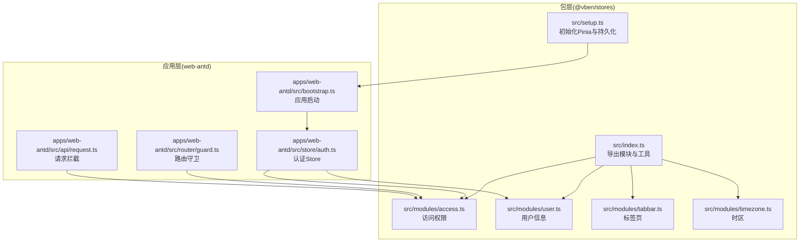
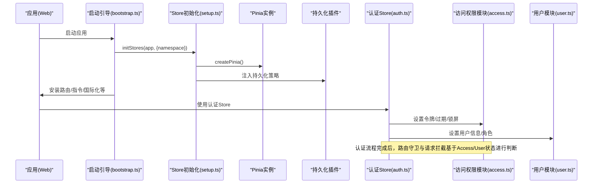
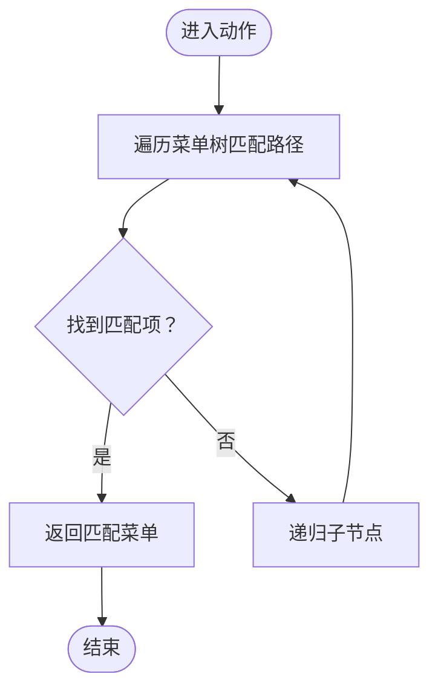
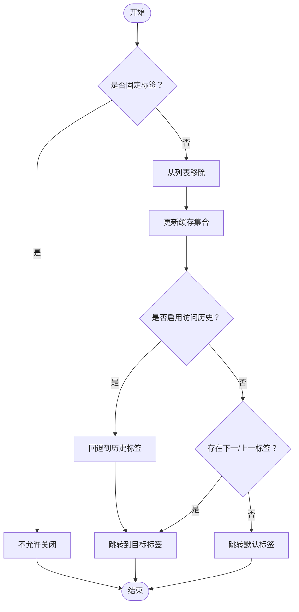
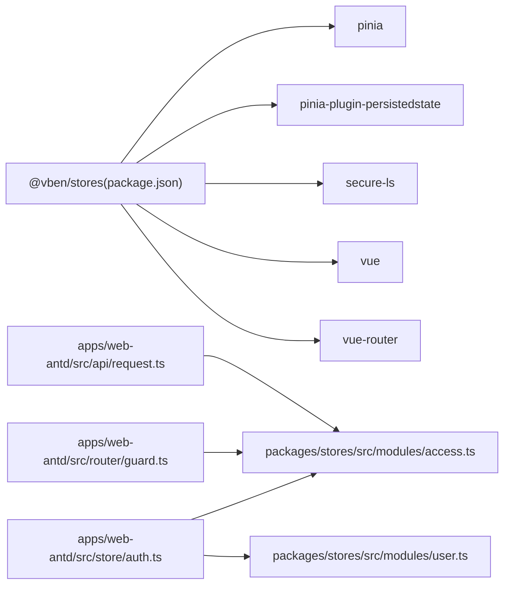

# 状态管理

<cite>
**本文引用的文件**
- [packages/stores/package.json](file://packages/stores/package.json)
- [packages/stores/src/index.ts](file://packages/stores/src/index.ts)
- [packages/stores/src/setup.ts](file://packages/stores/src/setup.ts)
- [packages/stores/src/modules/access.ts](file://packages/stores/src/modules/access.ts)
- [packages/stores/src/modules/user.ts](file://packages/stores/src/modules/user.ts)
- [packages/stores/src/modules/tabbar.ts](file://packages/stores/src/modules/tabbar.ts)
- [packages/stores/src/modules/timezone.ts](file://packages/stores/src/modules/timezone.ts)
- [apps/web-antd/src/store/auth.ts](file://apps/web-antd/src/store/auth.ts)
- [apps/web-antd/src/bootstrap.ts](file://apps/web-antd/src/bootstrap.ts)
- [apps/web-antd/src/router/guard.ts](file://apps/web-antd/src/router/guard.ts)
- [apps/web-antd/src/api/request.ts](file://apps/web-antd/src/api/request.ts)
- [packages/@core/base/shared/src/store.ts](file://packages/@core/base/shared/src/store.ts)
</cite>

## 目录

1. [简介](#简介)
2. [项目结构](#项目结构)
3. [核心组件](#核心组件)
4. [架构总览](#架构总览)
5. [详细组件分析](#详细组件分析)
6. [依赖分析](#依赖分析)
7. [性能考量](#性能考量)
8. [故障排查指南](#故障排查指南)
9. [结论](#结论)
10. [附录](#附录)

## 简介

本指南聚焦于 Vben Admin 的状态管理系统，系统采用 Pinia 作为状态管理核心，围绕“全局状态分层”“响应式更新机制”“状态持久化策略”“最佳实践”“跨组件共享与同步”“调试与性能优化”等方面进行深入解析。文档以代码为依据，结合架构图与流程图，帮助读者快速理解并高效使用状态管理。

## 项目结构

Vben Admin 将状态管理能力沉淀为独立包 @vben/stores，并在各 Web 应用中按需引入与初始化。整体结构如下：

- 包层：@vben/stores 提供统一的 Store 导出、初始化与持久化配置
- 模块层：核心模块包括用户、访问权限、标签页、时区等
- 应用层：各 Web 应用在启动阶段初始化 Pinia 并注入持久化插件；业务 Store（如认证）在应用内定义并组合使用核心模块

图表来源

- [packages/stores/src/index.ts:1-4](file://packages/stores/src/index.ts#L1-L4)
- [packages/stores/src/setup.ts:42-70](file://packages/stores/src/setup.ts#L42-L70)
- [packages/stores/src/modules/access.ts:51-123](file://packages/stores/src/modules/access.ts#L51-L123)
- [packages/stores/src/modules/user.ts:41-58](file://packages/stores/src/modules/user.ts#L41-L58)
- [packages/stores/src/modules/tabbar.ts:75-657](file://packages/stores/src/modules/tabbar.ts#L75-L657)
- [packages/stores/src/modules/timezone.ts:62-124](file://packages/stores/src/modules/timezone.ts#L62-L124)
- [apps/web-antd/src/bootstrap.ts:20-82](file://apps/web-antd/src/bootstrap.ts#L20-L82)
- [apps/web-antd/src/store/auth.ts:16-117](file://apps/web-antd/src/store/auth.ts#L16-L117)
- [apps/web-antd/src/router/guard.ts:1-10](file://apps/web-antd/src/router/guard.ts#L1-L10)
- [apps/web-antd/src/api/request.ts:1-25](file://apps/web-antd/src/api/request.ts#L1-L25)

章节来源

- [packages/stores/src/index.ts:1-4](file://packages/stores/src/index.ts#L1-L4)
- [packages/stores/src/setup.ts:42-70](file://packages/stores/src/setup.ts#L42-L70)
- [apps/web-antd/src/bootstrap.ts:20-82](file://apps/web-antd/src/bootstrap.ts#L20-L82)

## 核心组件

- Store 导出与工具
  - 统一导出模块与 defineStore、storeToRefs，便于应用侧按需引入
- Pinia 初始化与持久化
  - 创建 Pinia 实例，注入持久化插件，支持开发环境与生产环境不同存储介质
  - 支持加密存储（SecureLS），并以命名空间隔离多应用缓存
- 核心模块
  - 访问权限模块：维护令牌、菜单、路由、锁屏、登录过期等状态与动作
  - 用户模块：维护用户信息与角色集合
  - 标签页模块：维护标签页列表、缓存、访问历史、固定标签等复杂交互
  - 时区模块：维护时区选择与默认时区初始化

章节来源

- [packages/stores/src/index.ts:1-4](file://packages/stores/src/index.ts#L1-L4)
- [packages/stores/src/setup.ts:42-70](file://packages/stores/src/setup.ts#L42-L70)
- [packages/stores/src/modules/access.ts:51-123](file://packages/stores/src/modules/access.ts#L51-L123)
- [packages/stores/src/modules/user.ts:41-58](file://packages/stores/src/modules/user.ts#L41-L58)
- [packages/stores/src/modules/tabbar.ts:75-657](file://packages/stores/src/modules/tabbar.ts#L75-L657)
- [packages/stores/src/modules/timezone.ts:62-124](file://packages/stores/src/modules/timezone.ts#L62-L124)

## 架构总览

下图展示应用启动、Store 初始化、持久化注入以及业务 Store 如何协作完成认证流程与路由守卫联动。

图表来源

- [apps/web-antd/src/bootstrap.ts:20-82](file://apps/web-antd/src/bootstrap.ts#L20-L82)
- [packages/stores/src/setup.ts:42-70](file://packages/stores/src/setup.ts#L42-L70)
- [apps/web-antd/src/store/auth.ts:16-117](file://apps/web-antd/src/store/auth.ts#L16-L117)
- [packages/stores/src/modules/access.ts:51-123](file://packages/stores/src/modules/access.ts#L51-L123)
- [packages/stores/src/modules/user.ts:41-58](file://packages/stores/src/modules/user.ts#L41-L58)

## 详细组件分析

### 访问权限模块（Access）

- 设计要点
  - 状态字段覆盖令牌、菜单、路由、锁屏、登录过期等
  - 动作集中管理状态变更，职责清晰
  - 持久化仅保留必要字段，避免冗余
- 响应式与持久化
  - 通过 Pinia 响应式更新，持久化 pick 指定字段
- 典型流程（菜单查找）

图表来源

- [packages/stores/src/modules/access.ts:53-71](file://packages/stores/src/modules/access.ts#L53-L71)

章节来源

- [packages/stores/src/modules/access.ts:51-123](file://packages/stores/src/modules/access.ts#L51-L123)

### 用户模块（User）

- 设计要点
  - 用户信息与角色解耦，便于扩展
  - 设置用户信息时自动同步角色
- 响应式与持久化
  - 状态轻量，通常不持久化或由上层策略决定

章节来源

- [packages/stores/src/modules/user.ts:41-58](file://packages/stores/src/modules/user.ts#L41-L58)

### 标签页模块（Tabbar）

- 设计要点
  - 维护标签页列表、缓存集合、访问历史、右键菜单等
  - 支持固定标签、拖拽排序、批量关闭、刷新等复杂交互
  - 缓存与渲染控制，避免不必要的重渲染
- 持久化策略
  - 使用 sessionStorage 保存标签页与访问历史，自定义序列化/反序列化恢复 Stack 实例
- 关键流程（关闭标签页）

图表来源

- [packages/stores/src/modules/tabbar.ts:283-339](file://packages/stores/src/modules/tabbar.ts#L283-L339)
- [packages/stores/src/modules/tabbar.ts:612-635](file://packages/stores/src/modules/tabbar.ts#L612-L635)

章节来源

- [packages/stores/src/modules/tabbar.ts:75-657](file://packages/stores/src/modules/tabbar.ts#L75-L657)

### 时区模块（Timezone）

- 设计要点
  - 通过可插拔处理器支持默认或自定义时区获取/设置
  - 初始化时尝试从远端或本地获取时区，并设置默认时区
- 持久化策略
  - 仅持久化时区字段，简化存储

章节来源

- [packages/stores/src/modules/timezone.ts:62-124](file://packages/stores/src/modules/timezone.ts#L62-L124)

### 认证 Store（应用内）

- 设计要点
  - 组合使用访问权限与用户模块，封装登录、登出、获取用户信息等业务逻辑
  - 登录成功后并行拉取用户信息与权限码，提升首屏体验
  - 登出时重置所有 Store 并清理状态
- 与全局状态的协作
  - 通过 Access/User 模块实现权限校验与用户上下文
  - 与路由守卫、请求拦截配合，形成完整的鉴权闭环

章节来源

- [apps/web-antd/src/store/auth.ts:16-117](file://apps/web-antd/src/store/auth.ts#L16-L117)

## 依赖分析

- 包依赖
  - @vben/stores 依赖 Pinia、pinia-plugin-persistedstate、secure-ls、vue、vue-router 等
- 模块间关系
  - 应用内认证 Store 依赖核心模块（Access/User）
  - 路由守卫与请求拦截依赖 Access 状态进行判定
- 外部集成
  - @tanstack/vue-store 通过共享入口导出，保持生态一致性

图表来源

- [packages/stores/package.json:22-31](file://packages/stores/package.json#L22-L31)
- [apps/web-antd/src/store/auth.ts:8,17-18:8-18](file://apps/web-antd/src/store/auth.ts#L8-L18)
- [apps/web-antd/src/router/guard.ts:4-8](file://apps/web-antd/src/router/guard.ts#L4-L8)
- [apps/web-antd/src/api/request.ts:13-19](file://apps/web-antd/src/api/request.ts#L13-L19)

章节来源

- [packages/stores/package.json:22-31](file://packages/stores/package.json#L22-L31)
- [packages/@core/base/shared/src/store.ts:1](file://packages/@core/base/shared/src/store.ts#L1)

## 性能考量

- 粒度控制
  - 将状态拆分为用户、访问权限、标签页、时区等模块，降低耦合并减少无关响应
- 持久化策略
  - 对大体量或频繁变动的数据（如标签页）采用 sessionStorage 或精简 pick 字段，避免阻塞主线程
- 渲染优化
  - 标签页模块通过缓存集合与渲染开关控制，避免每次变更都触发全量重渲染
- 并行加载
  - 登录成功后并行获取用户信息与权限码，缩短首屏等待时间
- 加密与压缩
  - 生产环境使用 SecureLS 进行加密与压缩，兼顾安全与体积

## 故障排查指南

- 现象：登录后页面未更新或权限异常
  - 排查点：确认登录流程中是否调用了设置令牌、用户信息与权限码的动作；检查 Access/User 模块状态是否正确更新
  - 参考路径：[apps/web-antd/src/store/auth.ts:34-51](file://apps/web-antd/src/store/auth.ts#L34-L51)，[packages/stores/src/modules/access.ts:76-96](file://packages/stores/src/modules/access.ts#L76-L96)，[packages/stores/src/modules/user.ts:43-48](file://packages/stores/src/modules/user.ts#L43-L48)
- 现象：标签页关闭后无法跳转或历史记录异常
  - 排查点：确认关闭逻辑是否更新访问历史与标签列表；检查固定标签与排序逻辑
  - 参考路径：[packages/stores/src/modules/tabbar.ts:283-339](file://packages/stores/src/modules/tabbar.ts#L283-L339)，[packages/stores/src/modules/tabbar.ts:585-611](file://packages/stores/src/modules/tabbar.ts#L585-L611)
- 现象：刷新后状态丢失
  - 排查点：确认持久化插件是否生效、pick 字段是否包含所需状态、命名空间是否正确
  - 参考路径：[packages/stores/src/setup.ts:52-67](file://packages/stores/src/setup.ts#L52-L67)，[packages/stores/src/modules/access.ts:102-111](file://packages/stores/src/modules/access.ts#L102-L111)，[packages/stores/src/modules/tabbar.ts:612-635](file://packages/stores/src/modules/tabbar.ts#L612-L635)
- 现象：时区未生效或切换失败
  - 排查点：确认时区处理器是否正确设置与调用；检查初始化与设置时区的链路
  - 参考路径：[packages/stores/src/modules/timezone.ts:62-124](file://packages/stores/src/modules/timezone.ts#L62-L124)

## 结论

Vben Admin 的状态管理以 Pinia 为核心，通过模块化设计实现了用户、访问权限、标签页与时区等领域的清晰分离；借助持久化插件与加密存储，兼顾了可用性与安全性；在应用层通过认证 Store 将核心模块串联，形成完善的鉴权与状态同步闭环。遵循本文的最佳实践与排障建议，可在保证性能的同时提升开发效率与稳定性。

## 附录

- 最佳实践清单
  - 状态设计：单一职责、最小必要字段、避免嵌套过深
  - Action 编写：幂等、错误兜底、异步并行优化
  - 订阅与同步：利用 getters 与 watchEffect 建立派生视图，避免过度订阅
  - 跨组件共享：优先使用 Store，避免深层 props 传递
  - 调试与可观测：结合浏览器 DevTools 与日志定位状态变更来源
  - 性能优化：合理划分模块、选择合适存储介质、控制持久化范围
