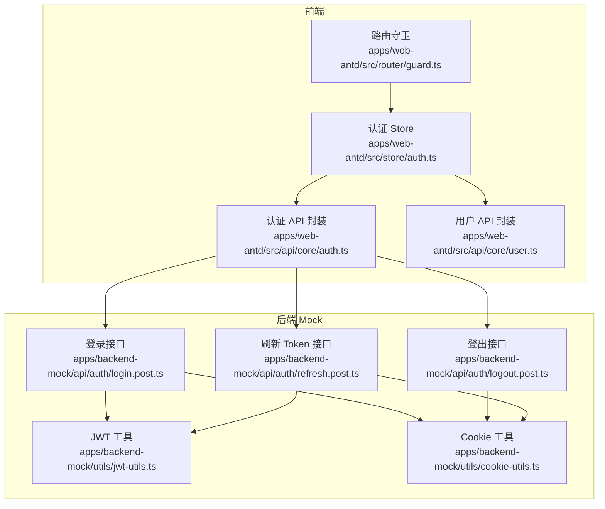
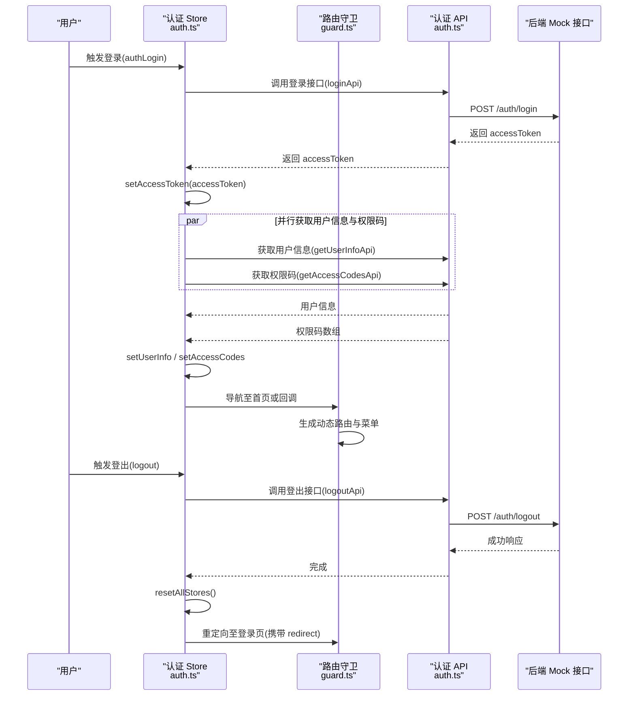
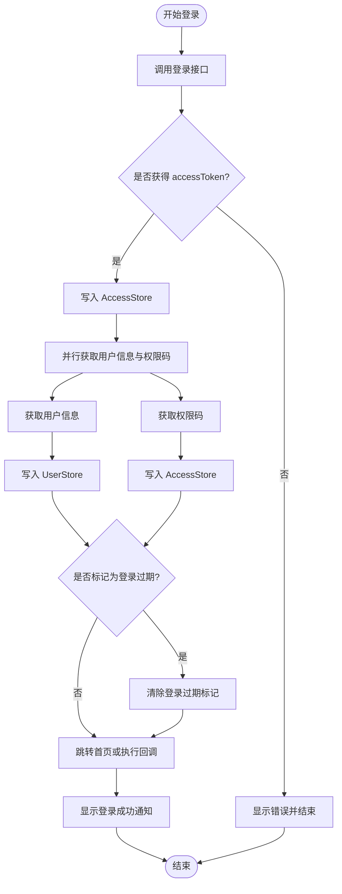
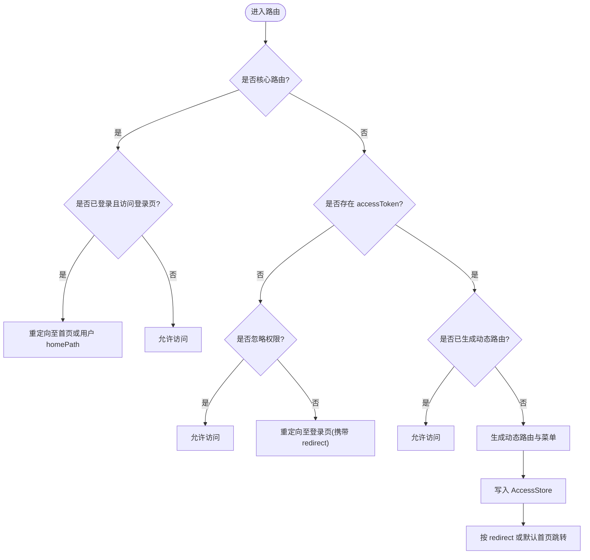
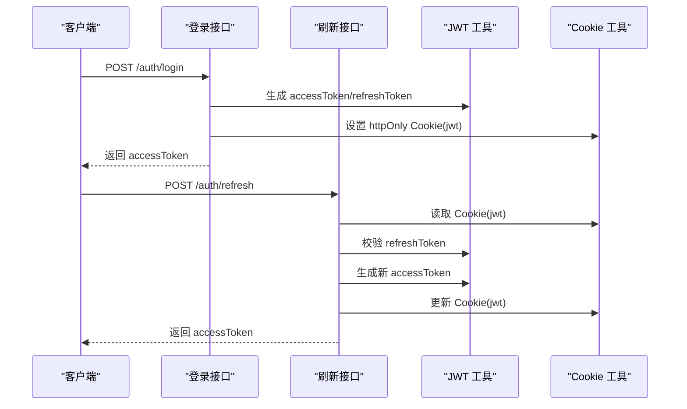
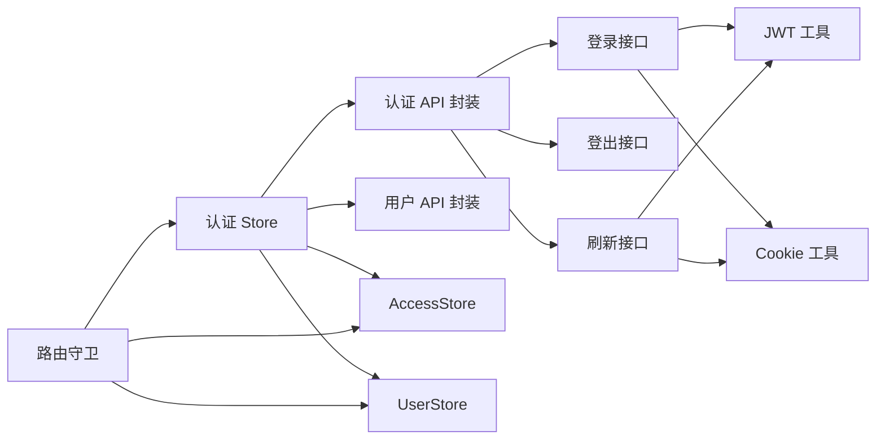

# 认证状态管理

<cite>
**本文引用的文件**
- [apps/web-antd/src/store/auth.ts](file://apps/web-antd/src/store/auth.ts)
- [apps/web-antd/src/store/index.ts](file://apps/web-antd/src/store/index.ts)
- [apps/web-antd/src/router/guard.ts](file://apps/web-antd/src/router/guard.ts)
- [apps/web-antd/src/api/core/auth.ts](file://apps/web-antd/src/api/core/auth.ts)
- [apps/web-antd/src/api/core/user.ts](file://apps/web-antd/src/api/core/user.ts)
- [apps/backend-mock/api/auth/login.post.ts](file://apps/backend-mock/api/auth/login.post.ts)
- [apps/backend-mock/api/auth/logout.post.ts](file://apps/backend-mock/api/auth/logout.post.ts)
- [apps/backend-mock/api/auth/refresh.post.ts](file://apps/backend-mock/api/auth/refresh.post.ts)
- [apps/backend-mock/utils/jwt-utils.ts](file://apps/backend-mock/utils/jwt-utils.ts)
- [apps/backend-mock/utils/cookie-utils.ts](file://apps/backend-mock/utils/cookie-utils.ts)
</cite>

## 目录
1. [引言](#引言)
2. [项目结构](#项目结构)
3. [核心组件](#核心组件)
4. [架构总览](#架构总览)
5. [详细组件分析](#详细组件分析)
6. [依赖关系分析](#依赖关系分析)
7. [性能考量](#性能考量)
8. [故障排查指南](#故障排查指南)
9. [结论](#结论)

## 引言
本技术指南聚焦于 Vben Admin 的认证状态管理，系统性阐述以下主题：
- 用户认证状态的存储结构：登录状态、用户信息、权限角色与 Token 管理
- 认证状态生命周期：从登录到登出的完整流程
- 权限状态维护机制：动态权限加载与权限验证
- 安全考虑：Token 存储策略、过期处理与安全刷新机制
- 与其他 Store 模块的交互与状态同步策略

## 项目结构
认证相关代码主要分布在前端 Store、路由守卫与后端 Mock 接口三部分：
- 前端 Store：集中管理认证状态与用户信息，并协调权限与路由生成
- 路由守卫：在导航阶段进行权限校验与动态路由注入
- 后端 Mock：提供登录、登出、刷新 Token 以及 Cookie 管理的示例实现

图表来源
- [apps/web-antd/src/store/auth.ts:1-118](file://apps/web-antd/src/store/auth.ts#L1-L118)
- [apps/web-antd/src/router/guard.ts:1-133](file://apps/web-antd/src/router/guard.ts#L1-L133)
- [apps/web-antd/src/api/core/auth.ts:1-52](file://apps/web-antd/src/api/core/auth.ts#L1-L52)
- [apps/web-antd/src/api/core/user.ts:1-11](file://apps/web-antd/src/api/core/user.ts#L1-L11)
- [apps/backend-mock/api/auth/login.post.ts:1-43](file://apps/backend-mock/api/auth/login.post.ts#L1-L43)
- [apps/backend-mock/api/auth/logout.post.ts:1-18](file://apps/backend-mock/api/auth/logout.post.ts#L1-L18)
- [apps/backend-mock/api/auth/refresh.post.ts:1-36](file://apps/backend-mock/api/auth/refresh.post.ts#L1-L36)
- [apps/backend-mock/utils/jwt-utils.ts:1-115](file://apps/backend-mock/utils/jwt-utils.ts#L1-L115)
- [apps/backend-mock/utils/cookie-utils.ts:1-29](file://apps/backend-mock/utils/cookie-utils.ts#L1-L29)

章节来源
- [apps/web-antd/src/store/auth.ts:1-118](file://apps/web-antd/src/store/auth.ts#L1-L118)
- [apps/web-antd/src/router/guard.ts:1-133](file://apps/web-antd/src/router/guard.ts#L1-L133)
- [apps/web-antd/src/api/core/auth.ts:1-52](file://apps/web-antd/src/api/core/auth.ts#L1-L52)
- [apps/web-antd/src/api/core/user.ts:1-11](file://apps/web-antd/src/api/core/user.ts#L1-L11)
- [apps/backend-mock/api/auth/login.post.ts:1-43](file://apps/backend-mock/api/auth/login.post.ts#L1-L43)
- [apps/backend-mock/api/auth/logout.post.ts:1-18](file://apps/backend-mock/api/auth/logout.post.ts#L1-L18)
- [apps/backend-mock/api/auth/refresh.post.ts:1-36](file://apps/backend-mock/api/auth/refresh.post.ts#L1-L36)
- [apps/backend-mock/utils/jwt-utils.ts:1-115](file://apps/backend-mock/utils/jwt-utils.ts#L1-L115)
- [apps/backend-mock/utils/cookie-utils.ts:1-29](file://apps/backend-mock/utils/cookie-utils.ts#L1-L29)

## 核心组件
- 认证 Store（Pinia）：负责登录、登出、用户信息获取与权限码拉取；协调 AccessStore 与 UserStore；控制登录 Loading 状态；触发路由跳转与通知提示
- 路由守卫：在导航前进行权限检查、动态路由与菜单生成；处理已登录用户访问登录页的重定向
- 认证 API 封装：统一登录、刷新 Token、登出、获取权限码的请求方法
- 用户 API 封装：统一获取用户信息的请求方法
- 后端 Mock：提供登录、登出、刷新 Token 的接口实现，使用 JWT 与 Cookie 进行 Token 管理

章节来源
- [apps/web-antd/src/store/auth.ts:16-118](file://apps/web-antd/src/store/auth.ts#L16-L118)
- [apps/web-antd/src/router/guard.ts:47-119](file://apps/web-antd/src/router/guard.ts#L47-L119)
- [apps/web-antd/src/api/core/auth.ts:21-52](file://apps/web-antd/src/api/core/auth.ts#L21-L52)
- [apps/web-antd/src/api/core/user.ts:5-11](file://apps/web-antd/src/api/core/user.ts#L5-L11)
- [apps/backend-mock/api/auth/login.post.ts:14-43](file://apps/backend-mock/api/auth/login.post.ts#L14-L43)
- [apps/backend-mock/api/auth/logout.post.ts:8-18](file://apps/backend-mock/api/auth/logout.post.ts#L8-L18)
- [apps/backend-mock/api/auth/refresh.post.ts:11-36](file://apps/backend-mock/api/auth/refresh.post.ts#L11-L36)

## 架构总览
认证状态管理采用“前端 Store + 路由守卫 + 后端 API”的分层设计：
- 前端通过认证 Store 发起登录请求，接收并持久化 accessToken
- 同时并行拉取用户信息与权限码，写入对应 Store
- 路由守卫在首次访问受保护路由时，基于用户角色生成动态路由与菜单
- 登录态失效或登出时，清理所有 Store 并重定向至登录页

图表来源
- [apps/web-antd/src/store/auth.ts:28-98](file://apps/web-antd/src/store/auth.ts#L28-L98)
- [apps/web-antd/src/router/guard.ts:47-119](file://apps/web-antd/src/router/guard.ts#L47-L119)
- [apps/web-antd/src/api/core/auth.ts:24-44](file://apps/web-antd/src/api/core/auth.ts#L24-L44)
- [apps/backend-mock/api/auth/login.post.ts:14-43](file://apps/backend-mock/api/auth/login.post.ts#L14-L43)
- [apps/backend-mock/api/auth/logout.post.ts:8-18](file://apps/backend-mock/api/auth/logout.post.ts#L8-L18)

## 详细组件分析

### 认证 Store（状态与流程）
- 登录流程
  - 调用登录接口获取 accessToken
  - setAccessToken 写入 AccessStore
  - 并行获取用户信息与权限码，setUserInfo 与 setAccessCodes 写入对应 Store
  - 若未标记登录过期则执行回调或跳转首页
  - 成功后展示通知
- 登出流程
  - 调用登出接口（即使失败也继续清理）
  - resetAllStores 清空所有 Store
  - 清除登录过期标记
  - 重定向至登录页并携带当前路径作为 redirect 参数
- 用户信息获取
  - 提供 fetchUserInfo 方法，用于在需要时主动拉取用户信息并写入 UserStore

图表来源
- [apps/web-antd/src/store/auth.ts:28-78](file://apps/web-antd/src/store/auth.ts#L28-L78)

章节来源
- [apps/web-antd/src/store/auth.ts:16-118](file://apps/web-antd/src/store/auth.ts#L16-L118)

### 路由守卫（权限与动态路由）
- 基础路由豁免：核心路由无需权限拦截
- 未登录访问受保护路由：若目标路由未声明忽略权限，则重定向至登录页并携带 redirect
- 已登录但未生成动态路由：根据用户角色生成可访问菜单与路由，写入 AccessStore，并按 redirect 或默认首页进行跳转
- 已登录访问登录页：自动重定向至首页或用户 homePath

图表来源
- [apps/web-antd/src/router/guard.ts:47-119](file://apps/web-antd/src/router/guard.ts#L47-L119)

章节来源
- [apps/web-antd/src/router/guard.ts:1-133](file://apps/web-antd/src/router/guard.ts#L1-L133)

### 认证 API 封装（请求层）
- 登录：POST /auth/login，返回 accessToken
- 刷新 Token：POST /auth/refresh，携带 Cookie withCredentials
- 登出：POST /auth/logout，携带 Cookie withCredentials
- 获取权限码：GET /auth/codes
- 获取用户信息：GET /user/info

章节来源
- [apps/web-antd/src/api/core/auth.ts:21-52](file://apps/web-antd/src/api/core/auth.ts#L21-L52)
- [apps/web-antd/src/api/core/user.ts:5-11](file://apps/web-antd/src/api/core/user.ts#L5-L11)

### 后端 Mock（登录/登出/刷新与 Token 管理）
- 登录：校验用户名密码，签发 accessToken 与 refreshToken，设置 httpOnly Cookie（secure、sameSite、maxAge）
- 刷新：读取 Cookie 中的 refreshToken，校验通过后签发新的 accessToken，更新 Cookie
- 登出：读取 Cookie 中的 refreshToken，清除 Cookie

图表来源
- [apps/backend-mock/api/auth/login.post.ts:14-43](file://apps/backend-mock/api/auth/login.post.ts#L14-L43)
- [apps/backend-mock/api/auth/refresh.post.ts:11-36](file://apps/backend-mock/api/auth/refresh.post.ts#L11-L36)
- [apps/backend-mock/utils/jwt-utils.ts:17-75](file://apps/backend-mock/utils/jwt-utils.ts#L17-L75)
- [apps/backend-mock/utils/cookie-utils.ts:5-28](file://apps/backend-mock/utils/cookie-utils.ts#L5-L28)

章节来源
- [apps/backend-mock/api/auth/login.post.ts:1-43](file://apps/backend-mock/api/auth/login.post.ts#L1-L43)
- [apps/backend-mock/api/auth/logout.post.ts:1-18](file://apps/backend-mock/api/auth/logout.post.ts#L1-L18)
- [apps/backend-mock/api/auth/refresh.post.ts:1-36](file://apps/backend-mock/api/auth/refresh.post.ts#L1-L36)
- [apps/backend-mock/utils/jwt-utils.ts:1-115](file://apps/backend-mock/utils/jwt-utils.ts#L1-L115)
- [apps/backend-mock/utils/cookie-utils.ts:1-29](file://apps/backend-mock/utils/cookie-utils.ts#L1-L29)

## 依赖关系分析
- 认证 Store 依赖：
  - 认证 API 封装（登录、登出、刷新、权限码）
  - 用户 API 封装（用户信息）
  - AccessStore 与 UserStore（状态写入）
  - 路由器（导航跳转）
- 路由守卫依赖：
  - 认证 Store（读取 accessToken、用户信息）
  - AccessStore（写入动态路由与菜单）
  - UserStore（读取用户信息）
- 后端 Mock 依赖：
  - JWT 工具（签名与校验）
  - Cookie 工具（读写 httpOnly Cookie）

图表来源
- [apps/web-antd/src/store/auth.ts:13-18](file://apps/web-antd/src/store/auth.ts#L13-L18)
- [apps/web-antd/src/router/guard.ts:47-108](file://apps/web-antd/src/router/guard.ts#L47-L108)
- [apps/web-antd/src/api/core/auth.ts:24-44](file://apps/web-antd/src/api/core/auth.ts#L24-L44)
- [apps/backend-mock/api/auth/login.post.ts:33-36](file://apps/backend-mock/api/auth/login.post.ts#L33-L36)
- [apps/backend-mock/api/auth/refresh.post.ts:30-32](file://apps/backend-mock/api/auth/refresh.post.ts#L30-L32)
- [apps/backend-mock/utils/jwt-utils.ts:17-25](file://apps/backend-mock/utils/jwt-utils.ts#L17-L25)
- [apps/backend-mock/utils/cookie-utils.ts:13-22](file://apps/backend-mock/utils/cookie-utils.ts#L13-L22)

章节来源
- [apps/web-antd/src/store/auth.ts:1-118](file://apps/web-antd/src/store/auth.ts#L1-L118)
- [apps/web-antd/src/router/guard.ts:1-133](file://apps/web-antd/src/router/guard.ts#L1-L133)
- [apps/web-antd/src/api/core/auth.ts:1-52](file://apps/web-antd/src/api/core/auth.ts#L1-L52)
- [apps/backend-mock/api/auth/login.post.ts:1-43](file://apps/backend-mock/api/auth/login.post.ts#L1-L43)
- [apps/backend-mock/api/auth/refresh.post.ts:1-36](file://apps/backend-mock/api/auth/refresh.post.ts#L1-L36)
- [apps/backend-mock/utils/jwt-utils.ts:1-115](file://apps/backend-mock/utils/jwt-utils.ts#L1-L115)
- [apps/backend-mock/utils/cookie-utils.ts:1-29](file://apps/backend-mock/utils/cookie-utils.ts#L1-L29)

## 性能考量
- 并行请求：登录成功后并行获取用户信息与权限码，减少首屏等待时间
- 动态路由缓存：路由守卫会记录已加载路径，避免重复生成动态路由与菜单
- 进度条优化：在路由切换时按配置开启/关闭进度条，提升用户体验

章节来源
- [apps/web-antd/src/store/auth.ts:43-46](file://apps/web-antd/src/store/auth.ts#L43-L46)
- [apps/web-antd/src/router/guard.ts:17-41](file://apps/web-antd/src/router/guard.ts#L17-L41)

## 故障排查指南
- 登录无响应或白屏
  - 检查登录接口返回与 accessToken 写入
  - 确认并行获取用户信息与权限码是否成功
- 登录后无法跳转或循环重定向
  - 检查路由守卫对登录页的重定向逻辑与 redirect 参数
- 权限不足或 403
  - 确认权限码拉取与动态路由生成是否完成
  - 检查用户角色与菜单/路由生成逻辑
- 登出后仍可访问受保护路由
  - 确认 resetAllStores 是否被调用
  - 检查路由守卫对 accessToken 的判断
- Token 过期或刷新失败
  - 检查 Cookie 中 refreshToken 的读取与写入
  - 校验 JWT 秘钥与过期时间配置

章节来源
- [apps/web-antd/src/store/auth.ts:80-98](file://apps/web-antd/src/store/auth.ts#L80-L98)
- [apps/web-antd/src/router/guard.ts:47-119](file://apps/web-antd/src/router/guard.ts#L47-L119)
- [apps/backend-mock/api/auth/refresh.post.ts:11-36](file://apps/backend-mock/api/auth/refresh.post.ts#L11-L36)
- [apps/backend-mock/utils/cookie-utils.ts:5-28](file://apps/backend-mock/utils/cookie-utils.ts#L5-L28)

## 结论
Vben Admin 的认证状态管理以 Pinia Store 为核心，结合路由守卫与后端 Mock 接口，实现了从登录到登出的闭环流程。通过并行请求、动态路由生成与 Cookie 管理，既保证了用户体验，也为权限控制提供了基础。建议在生产环境中替换为真实后端服务与更严格的 Token 安全策略。