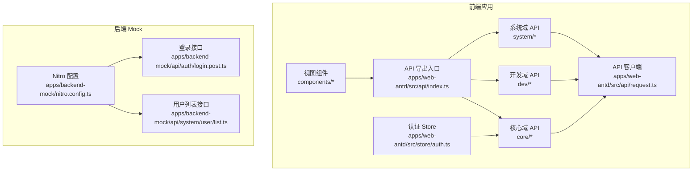
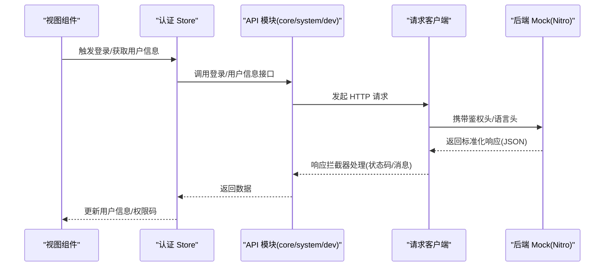
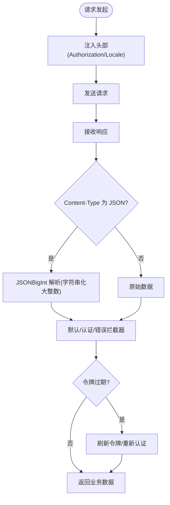
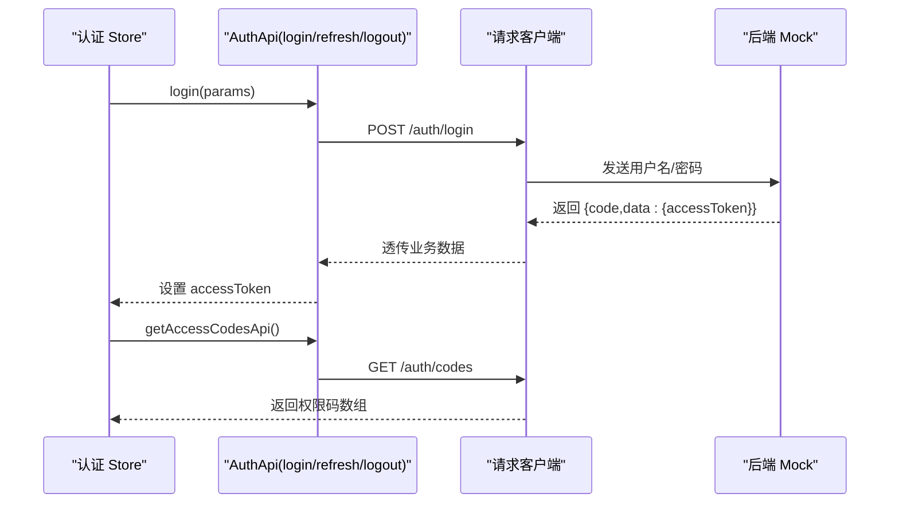
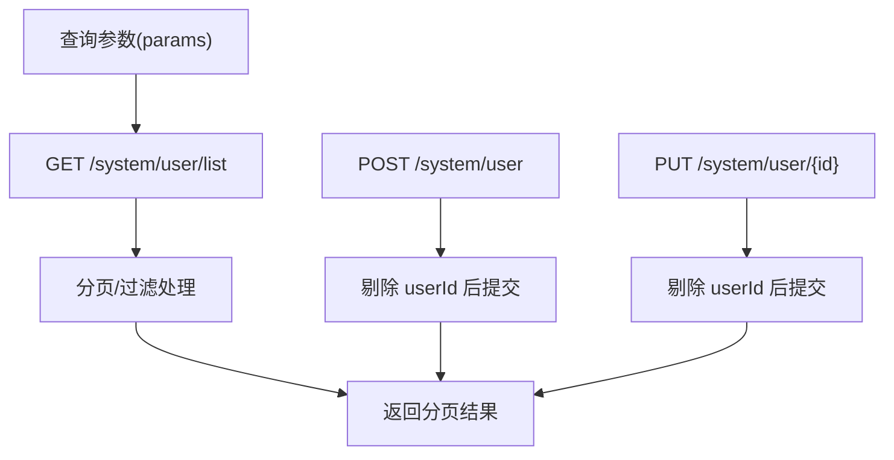
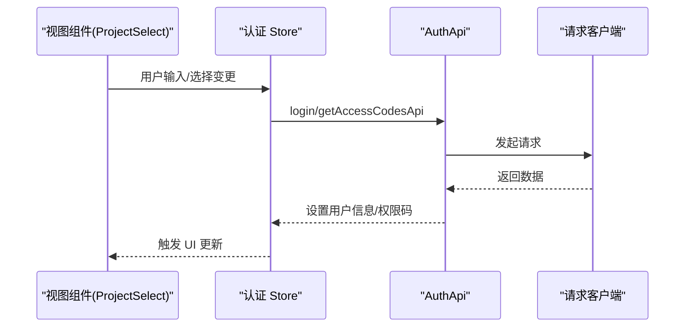
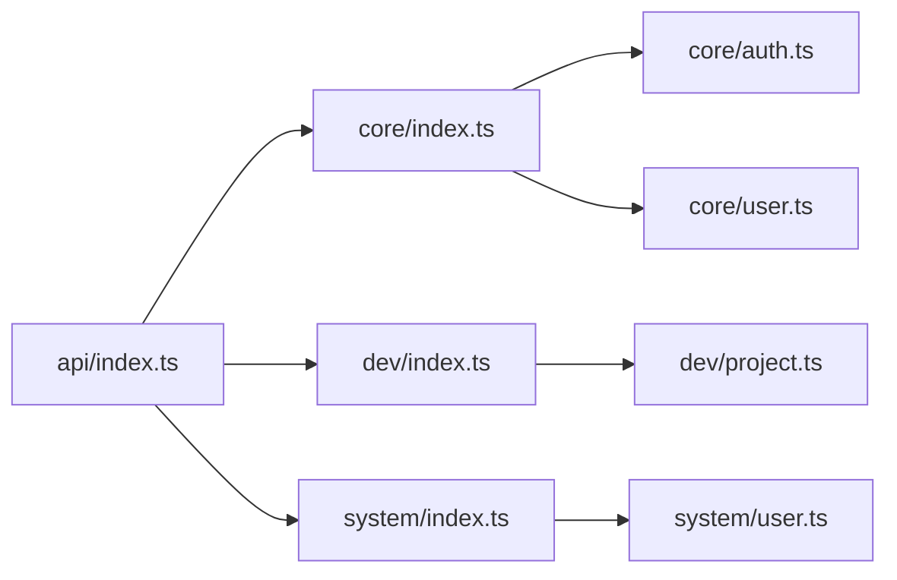

# API集成开发

<cite>
**本文引用的文件**
- [apps/web-antd/src/api/request.ts](file://apps/web-antd/src/api/request.ts)
- [apps/web-antd/src/api/index.ts](file://apps/web-antd/src/api/index.ts)
- [apps/web-antd/src/api/core/index.ts](file://apps/web-antd/src/api/core/index.ts)
- [apps/web-antd/src/api/core/auth.ts](file://apps/web-antd/src/api/core/auth.ts)
- [apps/web-antd/src/api/core/user.ts](file://apps/web-antd/src/api/core/user.ts)
- [apps/web-antd/src/api/dev/index.ts](file://apps/web-antd/src/api/dev/index.ts)
- [apps/web-antd/src/api/dev/project.ts](file://apps/web-antd/src/api/dev/project.ts)
- [apps/web-antd/src/api/system/index.ts](file://apps/web-antd/src/api/system/index.ts)
- [apps/web-antd/src/api/system/user.ts](file://apps/web-antd/src/api/system/user.ts)
- [apps/web-antd/src/store/auth.ts](file://apps/web-antd/src/store/auth.ts)
- [apps/web-antd/src/components/dev/ProjectSelect/index.vue](file://apps/web-antd/src/components/dev/ProjectSelect/index.vue)
- [apps/backend-mock/nitro.config.ts](file://apps/backend-mock/nitro.config.ts)
- [apps/backend-mock/api/auth/login.post.ts](file://apps/backend-mock/api/auth/login.post.ts)
- [apps/backend-mock/api/system/user/list.ts](file://apps/backend-mock/api/system/user/list.ts)
</cite>

## 目录

1. [简介](#简介)
2. [项目结构](#项目结构)
3. [核心组件](#核心组件)
4. [架构总览](#架构总览)
5. [详细组件分析](#详细组件分析)
6. [依赖分析](#依赖分析)
7. [性能考虑](#性能考虑)
8. [故障排查指南](#故障排查指南)
9. [结论](#结论)
10. [附录](#附录)

## 简介

本指南面向在 Vben Admin 中进行 API 集成开发的工程师，围绕“请求封装、响应处理、错误管理”三大主题，系统讲解核心 API、开发相关 API（dev）与系统 API（system）的调用模式；阐述 API 与视图组件的数据绑定、状态同步与实时更新机制；给出请求拦截器、响应转换与缓存策略的最佳实践；并覆盖版本管理与向后兼容处理、调试技巧与性能优化建议。

## 项目结构

前端 API 层采用按功能域分层组织：核心域（core）、开发域（dev）、系统域（system），统一通过请求客户端封装网络层能力，并在 Pinia Store 中协调状态与视图交互。

**图表来源**

- [apps/web-antd/src/api/request.ts:1-124](file://apps/web-antd/src/api/request.ts#L1-L124)
- [apps/web-antd/src/api/index.ts:1-6](file://apps/web-antd/src/api/index.ts#L1-L6)
- [apps/web-antd/src/api/core/index.ts:1-4](file://apps/web-antd/src/api/core/index.ts#L1-L4)
- [apps/web-antd/src/api/dev/index.ts:1-8](file://apps/web-antd/src/api/dev/index.ts#L1-L8)
- [apps/web-antd/src/api/system/index.ts:1-6](file://apps/web-antd/src/api/system/index.ts#L1-L6)
- [apps/web-antd/src/store/auth.ts:1-118](file://apps/web-antd/src/store/auth.ts#L1-L118)
- [apps/backend-mock/nitro.config.ts:1-21](file://apps/backend-mock/nitro.config.ts#L1-L21)

**章节来源**

- [apps/web-antd/src/api/index.ts:1-6](file://apps/web-antd/src/api/index.ts#L1-L6)
- [apps/web-antd/src/api/core/index.ts:1-4](file://apps/web-antd/src/api/core/index.ts#L1-L4)
- [apps/web-antd/src/api/dev/index.ts:1-8](file://apps/web-antd/src/api/dev/index.ts#L1-L8)
- [apps/web-antd/src/api/system/index.ts:1-6](file://apps/web-antd/src/api/system/index.ts#L1-L6)

## 核心组件

- 请求客户端与拦截器
  - 统一基地址、请求头注入（鉴权令牌、语言）、响应体转换（JSONBigInt 字符串化）、错误处理与刷新令牌流程均在请求客户端中集中配置。
  - 参考路径：[apps/web-antd/src/api/request.ts:26-124](file://apps/web-antd/src/api/request.ts#L26-L124)

- API 模块导出
  - 通过聚合导出，将 core、dev、system 下的子模块统一暴露，便于上层按需导入。
  - 参考路径：[apps/web-antd/src/api/index.ts:1-6](file://apps/web-antd/src/api/index.ts#L1-L6)

- 认证与用户信息
  - 认证 API：登录、刷新令牌、登出、权限码获取。
  - 用户 API：获取当前用户信息。
  - 参考路径：
    - [apps/web-antd/src/api/core/auth.ts:1-52](file://apps/web-antd/src/api/core/auth.ts#L1-L52)
    - [apps/web-antd/src/api/core/user.ts:1-11](file://apps/web-antd/src/api/core/user.ts#L1-L11)

- 系统用户管理
  - 列表查询、全量查询、新增、修改等典型 CRUD 接口。
  - 参考路径：[apps/web-antd/src/api/system/user.ts:1-54](file://apps/web-antd/src/api/system/user.ts#L1-L54)

- 开发域项目管理
  - 项目列表、新增、编辑等接口。
  - 参考路径：[apps/web-antd/src/api/dev/project.ts:1-49](file://apps/web-antd/src/api/dev/project.ts#L1-L49)

**章节来源**

- [apps/web-antd/src/api/request.ts:1-124](file://apps/web-antd/src/api/request.ts#L1-L124)
- [apps/web-antd/src/api/index.ts:1-6](file://apps/web-antd/src/api/index.ts#L1-L6)
- [apps/web-antd/src/api/core/auth.ts:1-52](file://apps/web-antd/src/api/core/auth.ts#L1-L52)
- [apps/web-antd/src/api/core/user.ts:1-11](file://apps/web-antd/src/api/core/user.ts#L1-L11)
- [apps/web-antd/src/api/system/user.ts:1-54](file://apps/web-antd/src/api/system/user.ts#L1-L54)
- [apps/web-antd/src/api/dev/project.ts:1-49](file://apps/web-antd/src/api/dev/project.ts#L1-L49)

## 架构总览

下图展示从前端 API 调用到后端 Mock 的完整链路，以及认证与状态管理的协作关系。

**图表来源**

- [apps/web-antd/src/store/auth.ts:28-78](file://apps/web-antd/src/store/auth.ts#L28-L78)
- [apps/web-antd/src/api/core/auth.ts:24-51](file://apps/web-antd/src/api/core/auth.ts#L24-L51)
- [apps/web-antd/src/api/core/user.ts:8-10](file://apps/web-antd/src/api/core/user.ts#L8-L10)
- [apps/web-antd/src/api/request.ts:74-114](file://apps/web-antd/src/api/request.ts#L74-L114)
- [apps/backend-mock/nitro.config.ts:4-20](file://apps/backend-mock/nitro.config.ts#L4-L20)

## 详细组件分析

### 请求客户端与拦截器

- 请求拦截器
  - 注入 Authorization 与 Accept-Language 头部，确保每次请求携带令牌与语言。
  - 参考路径：[apps/web-antd/src/api/request.ts:74-82](file://apps/web-antd/src/api/request.ts#L74-L82)

- 响应拦截器
  - 默认拦截器：约定 code/data/successCode 字段，自动解析业务状态。
  - 认证拦截器：处理 token 过期与刷新，支持弹窗或强制登出两种模式。
  - 错误拦截器：兜底错误提示，从响应体提取错误消息。
  - 参考路径：[apps/web-antd/src/api/request.ts:84-114](file://apps/web-antd/src/api/request.ts#L84-L114)

- 响应体转换
  - 对 JSON 类型响应使用 JSONBigInt 将大整数序列化为字符串，避免精度丢失。
  - 参考路径：[apps/web-antd/src/api/request.ts:30-37](file://apps/web-antd/src/api/request.ts#L30-L37)

- 刷新令牌与重新认证
  - 刷新令牌接口使用独立客户端，确保跨域凭据传递。
  - 过期时根据偏好设置决定弹窗提示还是直接登出。
  - 参考路径：[apps/web-antd/src/api/request.ts:43-67](file://apps/web-antd/src/api/request.ts#L43-L67)

**图表来源**

- [apps/web-antd/src/api/request.ts:26-114](file://apps/web-antd/src/api/request.ts#L26-L114)

**章节来源**

- [apps/web-antd/src/api/request.ts:26-124](file://apps/web-antd/src/api/request.ts#L26-L124)

### 认证与用户信息 API

- 登录
  - 参数：用户名/密码
  - 返回：访问令牌
  - 参考路径：[apps/web-antd/src/api/core/auth.ts:24-26](file://apps/web-antd/src/api/core/auth.ts#L24-L26)

- 刷新令牌
  - 使用独立客户端，withCredentials 保证 Cookie 传递
  - 参考路径：[apps/web-antd/src/api/core/auth.ts:31-35](file://apps/web-antd/src/api/core/auth.ts#L31-L35)

- 登出
  - 参考路径：[apps/web-antd/src/api/core/auth.ts:40-44](file://apps/web-antd/src/api/core/auth.ts#L40-L44)

- 权限码
  - 参考路径：[apps/web-antd/src/api/core/auth.ts:49-51](file://apps/web-antd/src/api/core/auth.ts#L49-L51)

- 获取当前用户信息
  - 参考路径：[apps/web-antd/src/api/core/user.ts:8-10](file://apps/web-antd/src/api/core/user.ts#L8-L10)

**图表来源**

- [apps/web-antd/src/api/core/auth.ts:24-51](file://apps/web-antd/src/api/core/auth.ts#L24-L51)
- [apps/web-antd/src/api/request.ts:84-114](file://apps/web-antd/src/api/request.ts#L84-L114)
- [apps/backend-mock/api/auth/login.post.ts:14-42](file://apps/backend-mock/api/auth/login.post.ts#L14-L42)

**章节来源**

- [apps/web-antd/src/api/core/auth.ts:1-52](file://apps/web-antd/src/api/core/auth.ts#L1-L52)
- [apps/web-antd/src/api/core/user.ts:1-11](file://apps/web-antd/src/api/core/user.ts#L1-L11)

### 系统用户管理 API

- 列表查询
  - 支持分页与多条件过滤
  - 参考路径：[apps/web-antd/src/api/system/user.ts:24-31](file://apps/web-antd/src/api/system/user.ts#L24-L31)

- 全量查询
  - 参考路径：[apps/web-antd/src/api/system/user.ts:33-38](file://apps/web-antd/src/api/system/user.ts#L33-L38)

- 新增/修改
  - 自动剔除 userId 字段，避免后端约束
  - 参考路径：[apps/web-antd/src/api/system/user.ts:40-53](file://apps/web-antd/src/api/system/user.ts#L40-L53)

**图表来源**

- [apps/web-antd/src/api/system/user.ts:24-53](file://apps/web-antd/src/api/system/user.ts#L24-L53)
- [apps/backend-mock/api/system/user/list.ts:85-119](file://apps/backend-mock/api/system/user/list.ts#L85-L119)

**章节来源**

- [apps/web-antd/src/api/system/user.ts:1-54](file://apps/web-antd/src/api/system/user.ts#L1-L54)
- [apps/backend-mock/api/system/user/list.ts:1-120](file://apps/backend-mock/api/system/user/list.ts#L1-L120)

### 开发域项目管理 API

- 列表查询
  - 参考路径：[apps/web-antd/src/api/dev/project.ts:18-22](file://apps/web-antd/src/api/dev/project.ts#L18-L22)

- 新增/修改
  - 自动剔除 projectId，避免后端约束
  - 参考路径：[apps/web-antd/src/api/dev/project.ts:29-48](file://apps/web-antd/src/api/dev/project.ts#L29-L48)

**章节来源**

- [apps/web-antd/src/api/dev/project.ts:1-49](file://apps/web-antd/src/api/dev/project.ts#L1-L49)

### API 与视图组件的数据绑定

- 认证 Store 协调登录、获取用户信息与权限码，并在成功后导航至首页或自定义路径
- 视图组件通过事件与双向绑定更新父级状态，如项目选择器的级联变更
- 参考路径：
  - [apps/web-antd/src/store/auth.ts:28-78](file://apps/web-antd/src/store/auth.ts#L28-L78)
  - [apps/web-antd/src/components/dev/ProjectSelect/index.vue:14-136](file://apps/web-antd/src/components/dev/ProjectSelect/index.vue#L14-L136)

**图表来源**

- [apps/web-antd/src/store/auth.ts:28-78](file://apps/web-antd/src/store/auth.ts#L28-L78)
- [apps/web-antd/src/api/core/auth.ts:24-51](file://apps/web-antd/src/api/core/auth.ts#L24-L51)
- [apps/web-antd/src/api/request.ts:74-114](file://apps/web-antd/src/api/request.ts#L74-L114)

**章节来源**

- [apps/web-antd/src/store/auth.ts:1-118](file://apps/web-antd/src/store/auth.ts#L1-L118)
- [apps/web-antd/src/components/dev/ProjectSelect/index.vue:1-136](file://apps/web-antd/src/components/dev/ProjectSelect/index.vue#L1-L136)

## 依赖分析

- 模块聚合
  - API 导出入口统一导出 core/dev/examples/system/statistics 子模块，便于上层按域使用。
  - 参考路径：[apps/web-antd/src/api/index.ts:1-6](file://apps/web-antd/src/api/index.ts#L1-L6)

- 域内聚合
  - core/dev/system 各自再聚合子模块，形成清晰的功能边界。
  - 参考路径：
    - [apps/web-antd/src/api/core/index.ts:1-4](file://apps/web-antd/src/api/core/index.ts#L1-L4)
    - [apps/web-antd/src/api/dev/index.ts:1-8](file://apps/web-antd/src/api/dev/index.ts#L1-L8)
    - [apps/web-antd/src/api/system/index.ts:1-6](file://apps/web-antd/src/api/system/index.ts#L1-L6)

**图表来源**

- [apps/web-antd/src/api/index.ts:1-6](file://apps/web-antd/src/api/index.ts#L1-L6)
- [apps/web-antd/src/api/core/index.ts:1-4](file://apps/web-antd/src/api/core/index.ts#L1-L4)
- [apps/web-antd/src/api/dev/index.ts:1-8](file://apps/web-antd/src/api/dev/index.ts#L1-L8)
- [apps/web-antd/src/api/system/index.ts:1-6](file://apps/web-antd/src/api/system/index.ts#L1-L6)

**章节来源**

- [apps/web-antd/src/api/index.ts:1-6](file://apps/web-antd/src/api/index.ts#L1-L6)
- [apps/web-antd/src/api/core/index.ts:1-4](file://apps/web-antd/src/api/core/index.ts#L1-L4)
- [apps/web-antd/src/api/dev/index.ts:1-8](file://apps/web-antd/src/api/dev/index.ts#L1-L8)
- [apps/web-antd/src/api/system/index.ts:1-6](file://apps/web-antd/src/api/system/index.ts#L1-L6)

## 性能考虑

- 请求去重与并发控制
  - 对相同请求参数的重复请求进行去重，避免重复网络开销。
  - 对高并发场景使用并发限制，防止风暴效应。
- 响应缓存策略
  - 对只读列表数据启用内存缓存，结合失效时间与手动刷新触发。
  - 对高频查询接口提供本地分页/虚拟滚动，降低渲染压力。
- 网络层优化
  - 合理设置超时与重试次数，避免阻塞 UI。
  - 对大对象传输启用压缩（服务端支持时）。
- 前端渲染优化
  - 使用懒加载与动态导入减少首屏体积。
  - 对复杂表格与表单控件采用虚拟化与节流/防抖。

## 故障排查指南

- 常见错误与定位
  - 401 未授权：检查令牌是否注入、是否过期；确认刷新策略与偏好设置。
  - 403 禁止访问：核对权限码与路由守卫配置。
  - 500 服务器错误：查看后端日志与 Nitro 错误处理器输出。
- 调试技巧
  - 打开浏览器开发者工具 Network 面板，观察请求头与响应体结构。
  - 在请求客户端中临时打印拦截器入参，定位异常分支。
  - 使用 Mock 数据快速验证接口契约与组件渲染。
- 建议的日志与监控
  - 记录请求 URL、方法、耗时与状态码。
  - 对错误拦截器中的 message/error 字段进行统一采集。

**章节来源**

- [apps/web-antd/src/api/request.ts:105-114](file://apps/web-antd/src/api/request.ts#L105-L114)
- [apps/backend-mock/nitro.config.ts:1-21](file://apps/backend-mock/nitro.config.ts#L1-L21)

## 结论

通过统一的请求客户端与拦截器体系，Vben Admin 实现了认证、错误与响应转换的一致化处理；按域划分的 API 模块提升了可维护性；配合 Pinia Store 与视图组件，实现了数据驱动的状态同步与实时更新。遵循本文最佳实践，可在保证开发效率的同时提升系统的稳定性与可扩展性。

## 附录

- 版本管理与向后兼容
  - 采用语义化版本号，对破坏性变更进行标记并在变更日志中说明迁移步骤。
  - 保留过渡期的兼容接口，逐步淘汰旧接口。
- API 设计规范
  - 统一响应结构：{ code, data, msg }，约定成功码与错误码范围。
  - 参数校验：前后端一致的参数校验与错误提示。
  - 文档化：为每个接口提供简要说明与示例，便于集成与测试。
