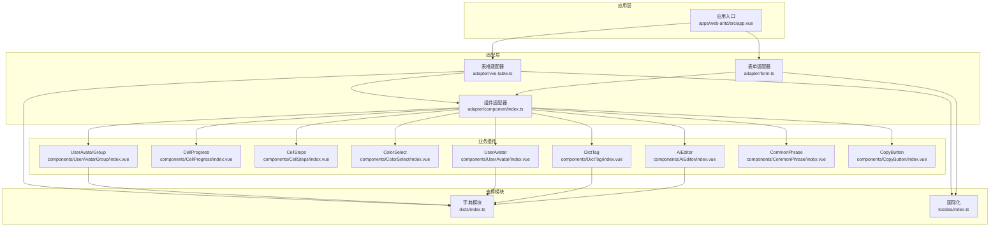
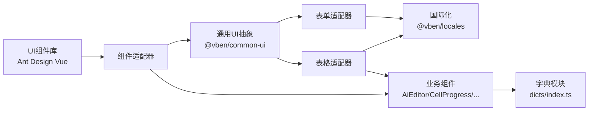
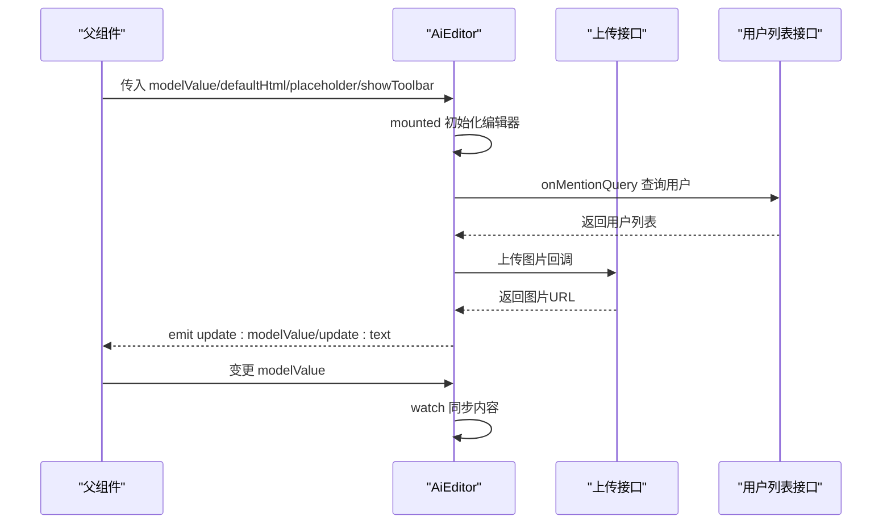
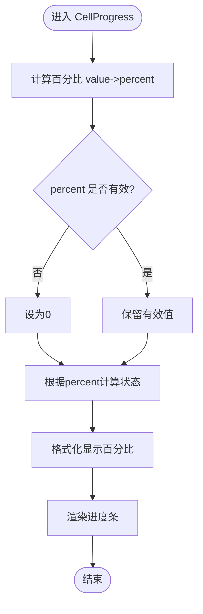
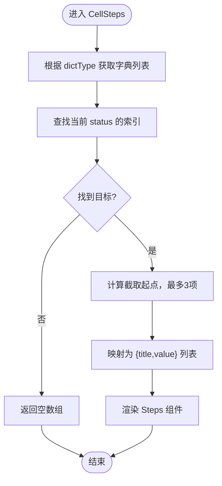

# 业务组件开发

<cite>
**本文引用的文件**
- [apps/web-antd/src/adapter/component/index.ts](file://apps/web-antd/src/adapter/component/index.ts)
- [apps/web-antd/src/adapter/form.ts](file://apps/web-antd/src/adapter/form.ts)
- [apps/web-antd/src/adapter/vxe-table.ts](file://apps/web-antd/src/adapter/vxe-table.ts)
- [apps/web-antd/src/components/AiEditor/index.vue](file://apps/web-antd/src/components/AiEditor/index.vue)
- [apps/web-antd/src/components/CellProgress/index.vue](file://apps/web-antd/src/components/CellProgress/index.vue)
- [apps/web-antd/src/components/CellSteps/index.vue](file://apps/web-antd/src/components/CellSteps/index.vue)
- [apps/web-antd/src/components/ColorSelect/index.vue](file://apps/web-antd/src/components/ColorSelect/index.vue)
- [apps/web-antd/src/components/CommonPhrase/index.vue](file://apps/web-antd/src/components/CommonPhrase/index.vue)
- [apps/web-antd/src/components/CopyButton/index.vue](file://apps/web-antd/src/components/CopyButton/index.vue)
- [apps/web-antd/src/components/DictTag/index.vue](file://apps/web-antd/src/components/DictTag/index.vue)
- [apps/web-antd/src/components/UserAvatar/index.vue](file://apps/web-antd/src/components/UserAvatar/index.vue)
- [apps/web-antd/src/components/UserAvatarGroup/index.vue](file://apps/web-antd/src/components/UserAvatarGroup/index.vue)
- [apps/web-antd/src/dicts/index.ts](file://apps/web-antd/src/dicts/index.ts)
- [apps/web-antd/src/locales/index.ts](file://apps/web-antd/src/locales/index.ts)
</cite>

## 目录

1. [简介](#简介)
2. [项目结构](#项目结构)
3. [核心组件](#核心组件)
4. [架构总览](#架构总览)
5. [详细组件分析](#详细组件分析)
6. [依赖关系分析](#依赖关系分析)
7. [性能考量](#性能考量)
8. [故障排查指南](#故障排查指南)
9. [结论](#结论)
10. [附录](#附录)

## 简介

本指南面向Vben Admin业务组件开发，系统阐述通用业务组件与特定场景组件的设计原则、适配器模式在多UI框架间的统一策略、组件API设计（props、事件、插槽）、最佳实践（命名、样式、国际化），并覆盖复杂组件（富文本编辑器、进度条、步骤条等）的开发要点与测试调试建议。文档基于仓库中实际代码进行分析，确保内容可落地、可复用。

## 项目结构

Vben Admin采用“多UI框架变体”架构，每个前端应用（如web-antd、web-ele、web-naive、web-tdesign）均拥有独立的适配层，负责将通用组件抽象映射到具体UI库。业务组件通常位于各应用的components目录，适配层位于adapter目录，字典与国际化分别在dicts与locales目录。

- 适配层职责
  - 组件适配：将通用组件类型映射到具体UI库组件（如Input、Select、Upload等）
  - 表单规则与模型名映射：统一v-model命名差异（如checked、fileList）
  - 表格单元格渲染器注册：将业务单元格组件注册为vxe-table渲染器
  - 国际化与第三方库语言包加载：统一$te/$t与antd/dayjs语言包

- 业务组件示例
  - 富文本编辑器：AiEditor
  - 表格单元格：CellProgress、CellSteps
  - 选择器：ColorSelect
  - 展示型：DictTag、UserAvatar、UserAvatarGroup、CommonPhrase、CopyButton

图表来源

- [apps/web-antd/src/adapter/component/index.ts:1-608](file://apps/web-antd/src/adapter/component/index.ts#L1-L608)
- [apps/web-antd/src/adapter/form.ts:1-50](file://apps/web-antd/src/adapter/form.ts#L1-L50)
- [apps/web-antd/src/adapter/vxe-table.ts:1-119](file://apps/web-antd/src/adapter/vxe-table.ts#L1-L119)
- [apps/web-antd/src/components/AiEditor/index.vue:1-153](file://apps/web-antd/src/components/AiEditor/index.vue#L1-L153)
- [apps/web-antd/src/components/CellProgress/index.vue:1-56](file://apps/web-antd/src/components/CellProgress/index.vue#L1-L56)
- [apps/web-antd/src/components/CellSteps/index.vue:1-93](file://apps/web-antd/src/components/CellSteps/index.vue#L1-L93)
- [apps/web-antd/src/components/ColorSelect/index.vue:1-76](file://apps/web-antd/src/components/ColorSelect/index.vue#L1-L76)
- [apps/web-antd/src/components/DictTag/index.vue:1-20](file://apps/web-antd/src/components/DictTag/index.vue#L1-L20)
- [apps/web-antd/src/components/UserAvatar/index.vue:1-33](file://apps/web-antd/src/components/UserAvatar/index.vue#L1-L33)
- [apps/web-antd/src/components/UserAvatarGroup/index.vue:1-31](file://apps/web-antd/src/components/UserAvatarGroup/index.vue#L1-L31)
- [apps/web-antd/src/components/CommonPhrase/index.vue:1-31](file://apps/web-antd/src/components/CommonPhrase/index.vue#L1-L31)
- [apps/web-antd/src/components/CopyButton/index.vue:1-75](file://apps/web-antd/src/components/CopyButton/index.vue#L1-L75)
- [apps/web-antd/src/dicts/index.ts:1-76](file://apps/web-antd/src/dicts/index.ts#L1-L76)
- [apps/web-antd/src/locales/index.ts:1-103](file://apps/web-antd/src/locales/index.ts#L1-L103)

章节来源

- [apps/web-antd/src/adapter/component/index.ts:1-608](file://apps/web-antd/src/adapter/component/index.ts#L1-L608)
- [apps/web-antd/src/adapter/form.ts:1-50](file://apps/web-antd/src/adapter/form.ts#L1-L50)
- [apps/web-antd/src/adapter/vxe-table.ts:1-119](file://apps/web-antd/src/adapter/vxe-table.ts#L1-L119)

## 核心组件

本节聚焦通用业务组件与适配器模式，说明如何在不同UI框架间保持一致性。

- 通用组件适配器
  - 作用：将通用组件类型映射到具体UI库组件；提供默认占位符注入、上传预览与裁剪、按钮封装等能力
  - 关键点：通过globalShareState集中注册组件，统一对外暴露；对v-model命名差异进行映射
  - 示例路径
    - [组件注册与默认占位符注入:103-135](file://apps/web-antd/src/adapter/component/index.ts#L103-L135)
    - [上传组件增强：预览、裁剪、尺寸校验、默认插槽:137-491](file://apps/web-antd/src/adapter/component/index.ts#L137-L491)
    - [组件类型枚举与注册:494-608](file://apps/web-antd/src/adapter/component/index.ts#L494-L608)

- 表单适配器
  - 作用：统一v-model命名（如Checkbox/Radio/Switch/Upload），并提供国际化校验规则
  - 示例路径
    - [v-model命名映射与规则定义:11-42](file://apps/web-antd/src/adapter/form.ts#L11-L42)

- 表格适配器
  - 作用：注册单元格渲染器（如CellImage、CellLink、CellTag、CellSwitch、CellOperation、DictTag、UserAvatar、UserAvatarGroup、DictSelect、UserSelect、CellProgress），并集成表单能力
  - 示例路径
    - [渲染器注册与全局表格配置:34-104](file://apps/web-antd/src/adapter/vxe-table.ts#L34-L104)

章节来源

- [apps/web-antd/src/adapter/component/index.ts:103-608](file://apps/web-antd/src/adapter/component/index.ts#L103-L608)
- [apps/web-antd/src/adapter/form.ts:11-42](file://apps/web-antd/src/adapter/form.ts#L11-L42)
- [apps/web-antd/src/adapter/vxe-table.ts:34-104](file://apps/web-antd/src/adapter/vxe-table.ts#L34-L104)

## 架构总览

下图展示业务组件在适配层与UI库之间的交互关系，以及国际化与字典模块的支撑作用。

图表来源

- [apps/web-antd/src/adapter/component/index.ts:1-608](file://apps/web-antd/src/adapter/component/index.ts#L1-L608)
- [apps/web-antd/src/adapter/form.ts:1-50](file://apps/web-antd/src/adapter/form.ts#L1-L50)
- [apps/web-antd/src/adapter/vxe-table.ts:1-119](file://apps/web-antd/src/adapter/vxe-table.ts#L1-L119)
- [apps/web-antd/src/dicts/index.ts:1-76](file://apps/web-antd/src/dicts/index.ts#L1-L76)
- [apps/web-antd/src/locales/index.ts:1-103](file://apps/web-antd/src/locales/index.ts#L1-L103)

## 详细组件分析

### 富文本编辑器（AiEditor）

- 设计目标：提供带提及、占位符、工具栏、图片上传、主题切换、文本计数等功能的富文本编辑器
- 关键特性
  - v-model双向绑定：通过update:modelValue与update:text同步HTML与纯文本
  - 主题适配：根据偏好切换暗/亮主题
  - 图片上传：封装上传接口，返回标准结构
  - 提及查询：对接用户列表接口，返回标签、ID、头像
  - 工具栏控制：通过showToolbar动态显隐工具栏
- API设计
  - props
    - modelValue: String（HTML内容）
    - defaultHtml: String（默认HTML）
    - width/height: String（容器尺寸）
    - placeholder: String（占位符）
    - showToolbar: Boolean（是否显示工具栏）
  - events
    - update:modelValue: HTML变更
    - update:text: 文本变更
  - exposed
    - aiEditor(): 返回底层实例
- 开发要点
  - 生命周期：mounted初始化，unmounted销毁
  - watch同步：监听父组件modelValue变化并更新内容
  - 国际化：占位符与提示文案使用$te/$t
  - 插槽：编辑器内部插槽由第三方库提供，组件不额外定义

图表来源

- [apps/web-antd/src/components/AiEditor/index.vue:1-153](file://apps/web-antd/src/components/AiEditor/index.vue#L1-L153)

章节来源

- [apps/web-antd/src/components/AiEditor/index.vue:1-153](file://apps/web-antd/src/components/AiEditor/index.vue#L1-L153)

### 进度条单元格（CellProgress）

- 设计目标：在vxe-table中展示进度条，支持百分比与状态区分
- API设计
  - props
    - value: Number（当前值）
  - 渲染
    - 计算percent与status，格式化显示百分比
- 最佳实践
  - 使用scoped样式控制宽度与间距
  - 状态判断：超过100按异常状态展示

图表来源

- [apps/web-antd/src/components/CellProgress/index.vue:1-56](file://apps/web-antd/src/components/CellProgress/index.vue#L1-L56)

章节来源

- [apps/web-antd/src/components/CellProgress/index.vue:1-56](file://apps/web-antd/src/components/CellProgress/index.vue#L1-L56)

### 步骤条单元格（CellSteps）

- 设计目标：在vxe-table中展示与字典联动的步骤条，仅展示目标节点前后有限个步骤
- API设计
  - props
    - status: String（当前状态值）
    - dictType: String（字典类型）
- 实现要点
  - 从字典模块获取步骤列表
  - 计算目标索引，截取前后最多3项
  - 将字典项映射为标题与值

图表来源

- [apps/web-antd/src/components/CellSteps/index.vue:1-93](file://apps/web-antd/src/components/CellSteps/index.vue#L1-L93)
- [apps/web-antd/src/dicts/index.ts:1-76](file://apps/web-antd/src/dicts/index.ts#L1-L76)

章节来源

- [apps/web-antd/src/components/CellSteps/index.vue:1-93](file://apps/web-antd/src/components/CellSteps/index.vue#L1-L93)
- [apps/web-antd/src/dicts/index.ts:1-76](file://apps/web-antd/src/dicts/index.ts#L1-L76)

### 颜色选择器（ColorSelect）

- 设计目标：基于Ant Design Vue Select展示颜色标签，支持v-model与change事件
- API设计
  - props
    - value: String（当前选中颜色）
  - events
    - update:value: 双向绑定
    - change: 值变更
- 最佳实践
  - 使用withDefaults提供默认值
  - watch同步外部value变化
  - 使用a-tag展示颜色标签

章节来源

- [apps/web-antd/src/components/ColorSelect/index.vue:1-76](file://apps/web-antd/src/components/ColorSelect/index.vue#L1-L76)

### 字典标签（DictTag）

- 设计目标：根据字典类型与值渲染带颜色的标签
- API设计
  - props
    - dictType: String（字典类型）
    - value: any（字典值）
- 实现要点
  - 通过字典模块获取颜色与标签

章节来源

- [apps/web-antd/src/components/DictTag/index.vue:1-20](file://apps/web-antd/src/components/DictTag/index.vue#L1-L20)
- [apps/web-antd/src/dicts/index.ts:1-76](file://apps/web-antd/src/dicts/index.ts#L1-L76)

### 用户头像（UserAvatar）与头像组（UserAvatarGroup）

- 设计目标：展示用户头像与姓名，支持头像组与省略
- API设计
  - UserAvatar
    - props: avatar(String), name(String)
  - UserAvatarGroup
    - props: userList(Array), maxCount(Number)
- 实现要点
  - 优先使用传入头像或用户信息，否则回退至偏好默认头像
  - 头像组支持tooltip与最大数量

章节来源

- [apps/web-antd/src/components/UserAvatar/index.vue:1-33](file://apps/web-antd/src/components/UserAvatar/index.vue#L1-L33)
- [apps/web-antd/src/components/UserAvatarGroup/index.vue:1-31](file://apps/web-antd/src/components/UserAvatarGroup/index.vue#L1-L31)

### 常用短语（CommonPhrase）

- 设计目标：展示文本列表，双击触发事件
- API设计
  - props: textList(required)
  - events: dblClick(text)

章节来源

- [apps/web-antd/src/components/CommonPhrase/index.vue:1-31](file://apps/web-antd/src/components/CommonPhrase/index.vue#L1-L31)

### 复制按钮（CopyButton）

- 设计目标：一键复制文本到剪贴板，支持图标与文本显示开关
- API设计
  - props: text(String), showIcon(Boolean), showText(Boolean)
  - events: copy-success, copy-error
  - exposed: copy(), copied
- 实现要点
  - 使用useClipboard钩子
  - 暴露实例方法供外部调用

章节来源

- [apps/web-antd/src/components/CopyButton/index.vue:1-75](file://apps/web-antd/src/components/CopyButton/index.vue#L1-L75)

## 依赖关系分析

- 组件耦合
  - 业务组件依赖适配器提供的通用组件类型与全局状态
  - 表格单元格组件依赖字典模块与表单适配器
- 外部依赖
  - UI库：Ant Design Vue
  - 国际化：@vben/locales
  - 工具库：@vueuse/core、dayjs
- 潜在循环依赖
  - 适配器通过globalShareState集中注册，避免直接互相引用
  - 表格渲染器注册在初始化阶段完成，减少运行时耦合

```mermaid
graph TB
COMP_INDEX["adapter/component/index.ts"] --> COMMON_UI["@vben/common-ui"]
COMP_INDEX --> ANT_DESIGN["ant-design-vue"]
FORM_TS["adapter/form.ts"] --> COMMON_UI
FORM_TS --> LOCALES["@vben/locales"]
TABLE_TS["adapter/vxe-table.ts"] --> COMMON_UI
TABLE_TS --> LOCALES
TABLE_TS --> DICTS["dicts/index.ts"]
AI_EDITOR["components/AiEditor/index.vue"] --> DICTS
DICT_TAG["components/DictTag/index.vue"] --> DICTS
CELL_PROGRESS["components/CellProgress/index.vue"] --> ANT_DESIGN
CELL_STEPS["components/CellSteps/index.vue"] --> DICTS
COLOR_SELECT["components/ColorSelect/index.vue"] --> ANT_DESIGN
USER_AVATAR["components/UserAvatar/index.vue"] --> DICTS
USER_AVATAR_GROUP["components/UserAvatarGroup/index.vue"] --> DICTS
```

图表来源

- [apps/web-antd/src/adapter/component/index.ts:1-608](file://apps/web-antd/src/adapter/component/index.ts#L1-L608)
- [apps/web-antd/src/adapter/form.ts:1-50](file://apps/web-antd/src/adapter/form.ts#L1-L50)
- [apps/web-antd/src/adapter/vxe-table.ts:1-119](file://apps/web-antd/src/adapter/vxe-table.ts#L1-L119)
- [apps/web-antd/src/components/AiEditor/index.vue:1-153](file://apps/web-antd/src/components/AiEditor/index.vue#L1-L153)
- [apps/web-antd/src/components/CellProgress/index.vue:1-56](file://apps/web-antd/src/components/CellProgress/index.vue#L1-L56)
- [apps/web-antd/src/components/CellSteps/index.vue:1-93](file://apps/web-antd/src/components/CellSteps/index.vue#L1-L93)
- [apps/web-antd/src/components/ColorSelect/index.vue:1-76](file://apps/web-antd/src/components/ColorSelect/index.vue#L1-L76)
- [apps/web-antd/src/components/DictTag/index.vue:1-20](file://apps/web-antd/src/components/DictTag/index.vue#L1-L20)
- [apps/web-antd/src/components/UserAvatar/index.vue:1-33](file://apps/web-antd/src/components/UserAvatar/index.vue#L1-L33)
- [apps/web-antd/src/components/UserAvatarGroup/index.vue:1-31](file://apps/web-antd/src/components/UserAvatarGroup/index.vue#L1-L31)
- [apps/web-antd/src/dicts/index.ts:1-76](file://apps/web-antd/src/dicts/index.ts#L1-L76)

章节来源

- [apps/web-antd/src/adapter/component/index.ts:1-608](file://apps/web-antd/src/adapter/component/index.ts#L1-L608)
- [apps/web-antd/src/adapter/form.ts:1-50](file://apps/web-antd/src/adapter/form.ts#L1-L50)
- [apps/web-antd/src/adapter/vxe-table.ts:1-119](file://apps/web-antd/src/adapter/vxe-table.ts#L1-L119)

## 性能考量

- 组件懒加载
  - 通过defineAsyncComponent按需加载大型组件（如AiEditor、Upload等），降低首屏体积
- 渲染优化
  - 表格单元格组件尽量使用computed与浅拷贝，避免不必要的重渲染
  - 上传预览图片组按需生成base64，及时释放URL对象
- 国际化与字典
  - 字典数据一次性拉取并缓存，避免重复请求
  - 使用本地查询函数（getLocalDictList/Text/Color/Row）减少远程调用
- 事件与watch
  - 在AiEditor中仅在值变化时更新内容，避免循环更新
  - ColorSelect通过watch同步外部value，保持双向绑定一致性

## 故障排查指南

- 上传组件常见问题
  - 无法预览非图片文件：检查isImageFile判定逻辑与URL解析
  - 裁剪失败：确认cropImage流程与错误提示文案
  - v-model未同步：检查handleChange中fileList过滤与emit(update:modelValue)
- 富文本编辑器
  - 占位符不生效：确认withDefaultPlaceholder与attrs优先级
  - 图片上传失败：核对upload接口返回结构与错误回调
  - 主题不一致：检查usePreferences与编辑器theme映射
- 步骤条
  - 未找到目标状态：检查dictType与value是否匹配
  - 截取异常：验证startIndex边界与slice长度
- 国际化
  - 语言包未加载：确认locales/index.ts中loadMessages与第三方语言包加载顺序
  - 表单规则提示不显示：检查adapter/form.ts中defineRules与$te/$t使用

章节来源

- [apps/web-antd/src/adapter/component/index.ts:137-491](file://apps/web-antd/src/adapter/component/index.ts#L137-L491)
- [apps/web-antd/src/components/AiEditor/index.vue:1-153](file://apps/web-antd/src/components/AiEditor/index.vue#L1-L153)
- [apps/web-antd/src/components/CellSteps/index.vue:1-93](file://apps/web-antd/src/components/CellSteps/index.vue#L1-L93)
- [apps/web-antd/src/locales/index.ts:1-103](file://apps/web-antd/src/locales/index.ts#L1-L103)
- [apps/web-antd/src/adapter/form.ts:11-42](file://apps/web-antd/src/adapter/form.ts#L11-L42)

## 结论

通过适配器模式，Vben Admin实现了在不同UI框架下的组件一致性与可扩展性。业务组件遵循统一的API设计与最佳实践，在国际化、字典与表格渲染器的支持下，能够快速构建复杂业务场景。建议在新增组件时优先考虑通用抽象、懒加载与性能优化，并完善测试与调试流程。

## 附录

- 组件命名规范
  - 业务组件采用帕斯卡命名（如AiEditor、CellProgress、CellSteps）
  - 文件夹与组件同名，便于导入与查找
- 样式管理
  - 使用scoped样式隔离单元格组件
  - 表格单元格通过类名与深度选择器控制布局
- 国际化支持
  - 使用$te/$t进行文案与提示国际化
  - 第三方库语言包（antd、dayjs）按语言动态加载
