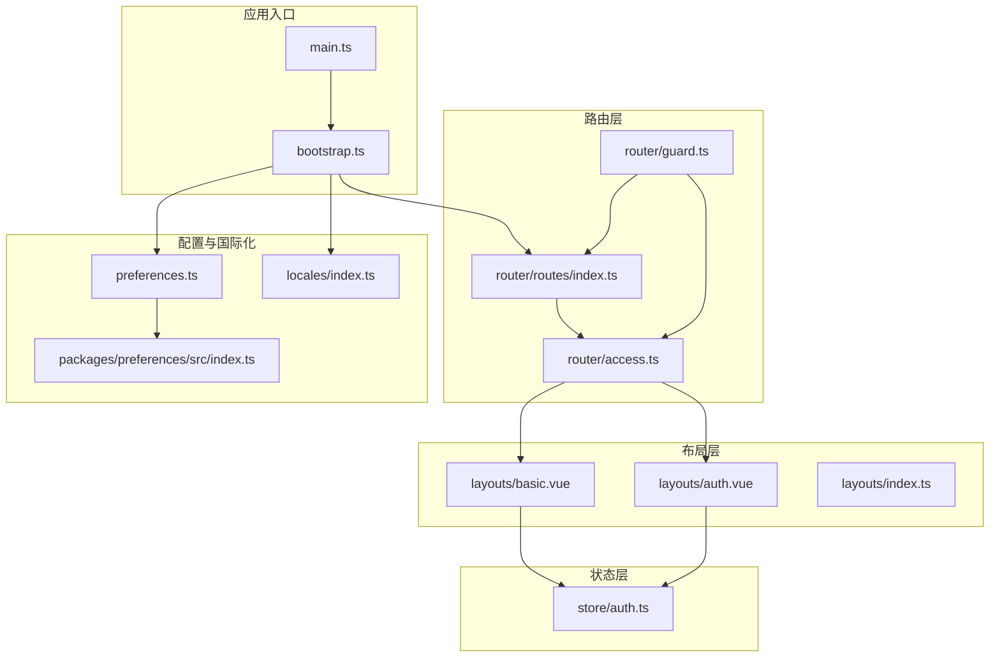
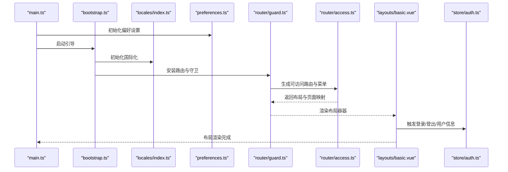
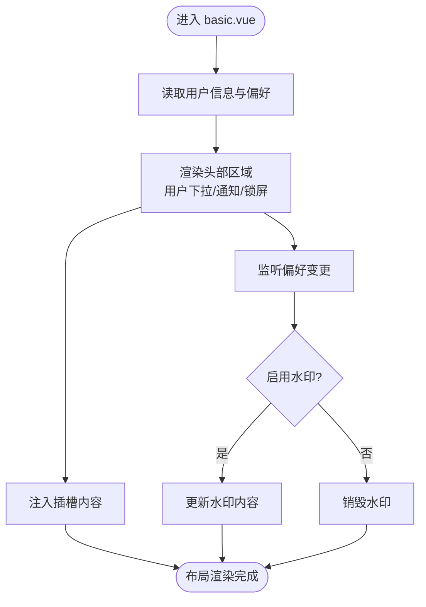
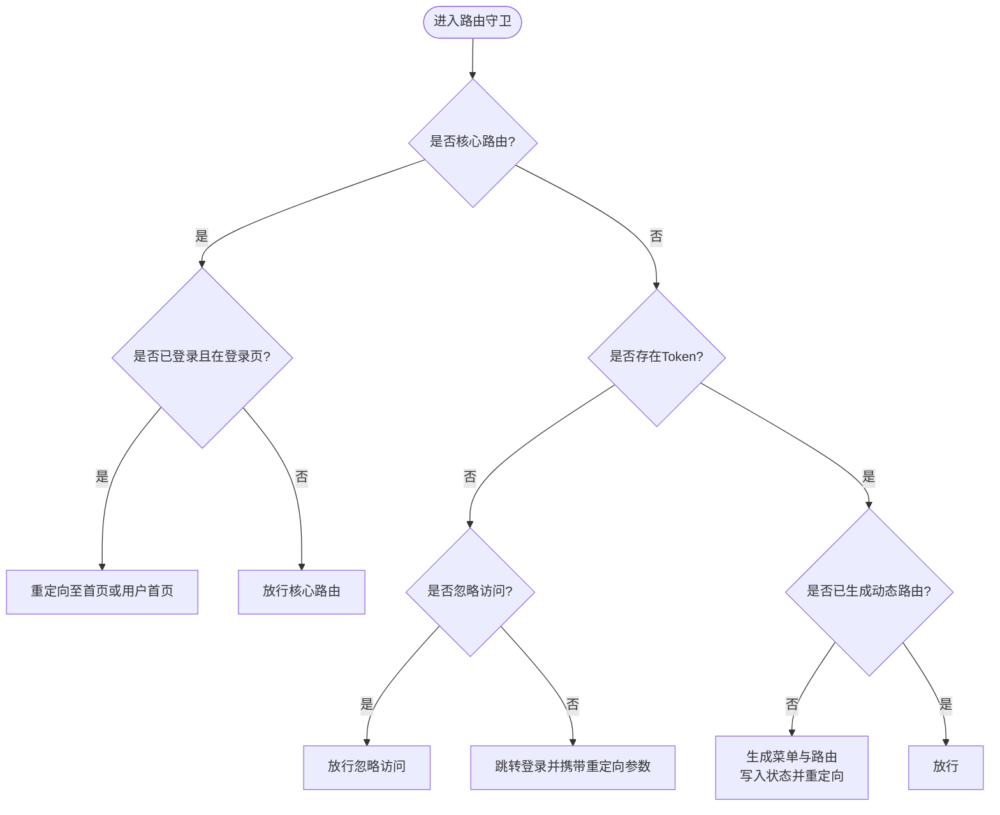
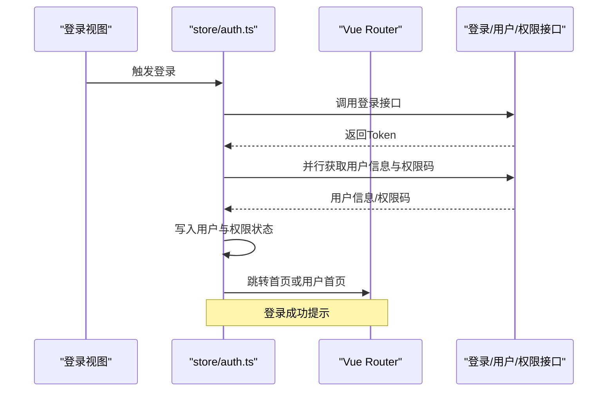
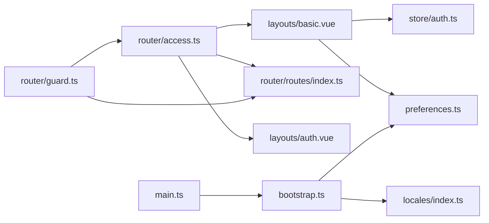

# 布局集成开发

<cite>
**本文档引用的文件**
- [apps/web-antd/src/layouts/basic.vue](file://apps/web-antd/src/layouts/basic.vue)
- [apps/web-antd/src/layouts/auth.vue](file://apps/web-antd/src/layouts/auth.vue)
- [apps/web-antd/src/layouts/index.ts](file://apps/web-antd/src/layouts/index.ts)
- [apps/web-antd/src/router/guard.ts](file://apps/web-antd/src/router/guard.ts)
- [apps/web-antd/src/router/access.ts](file://apps/web-antd/src/router/access.ts)
- [apps/web-antd/src/router/routes/index.ts](file://apps/web-antd/src/router/routes/index.ts)
- [apps/web-antd/src/store/auth.ts](file://apps/web-antd/src/store/auth.ts)
- [apps/web-antd/src/preferences.ts](file://apps/web-antd/src/preferences.ts)
- [packages/preferences/src/index.ts](file://packages/preferences/src/index.ts)
- [apps/web-antd/src/locales/index.ts](file://apps/web-antd/src/locales/index.ts)
- [apps/web-antd/src/main.ts](file://apps/web-antd/src/main.ts)
- [apps/web-antd/src/bootstrap.ts](file://apps/web-antd/src/bootstrap.ts)
</cite>

## 目录
1. [引言](#引言)
2. [项目结构](#项目结构)
3. [核心组件](#核心组件)
4. [架构总览](#架构总览)
5. [详细组件分析](#详细组件分析)
6. [依赖关系分析](#依赖关系分析)
7. [性能考虑](#性能考虑)
8. [故障排查指南](#故障排查指南)
9. [结论](#结论)
10. [附录](#附录)

## 引言
本指南面向Vben Admin布局集成开发，围绕“基本布局”“认证布局”“自定义布局”的架构设计与实现展开，系统阐述布局与路由系统的集成方式（路由守卫、权限控制、动态布局切换）、布局状态管理（用户偏好设置、主题切换、响应式布局）、最佳实践（组件复用、嵌套布局、条件渲染）、国际化支持与多语言切换，以及调试技巧与性能优化策略。目标是帮助开发者快速理解并高效扩展布局体系。

## 项目结构
Vben Admin采用多应用分层组织，布局相关代码集中在各Web应用的src/layouts目录，配合路由守卫、权限生成、状态管理与国际化模块协同工作。核心路径如下：
- 布局层：apps/web-antd/src/layouts（basic.vue、auth.vue、index.ts）
- 路由层：apps/web-antd/src/router（guard.ts、access.ts、routes/index.ts）
- 状态层：apps/web-antd/src/store（auth.ts）
- 配置层：apps/web-antd/src/preferences.ts、packages/preferences/src/index.ts
- 国际化：apps/web-antd/src/locales/index.ts
- 应用入口：apps/web-antd/src/main.ts、apps/web-antd/src/bootstrap.ts

图表来源
- [apps/web-antd/src/main.ts:1-32](file://apps/web-antd/src/main.ts#L1-L32)
- [apps/web-antd/src/bootstrap.ts:1-85](file://apps/web-antd/src/bootstrap.ts#L1-L85)
- [apps/web-antd/src/layouts/basic.vue:1-207](file://apps/web-antd/src/layouts/basic.vue#L1-L207)
- [apps/web-antd/src/layouts/auth.vue:1-26](file://apps/web-antd/src/layouts/auth.vue#L1-L26)
- [apps/web-antd/src/layouts/index.ts:1-7](file://apps/web-antd/src/layouts/index.ts#L1-L7)
- [apps/web-antd/src/router/guard.ts:1-133](file://apps/web-antd/src/router/guard.ts#L1-L133)
- [apps/web-antd/src/router/access.ts:1-54](file://apps/web-antd/src/router/access.ts#L1-L54)
- [apps/web-antd/src/router/routes/index.ts:1-48](file://apps/web-antd/src/router/routes/index.ts#L1-L48)
- [apps/web-antd/src/store/auth.ts:1-118](file://apps/web-antd/src/store/auth.ts#L1-L118)
- [apps/web-antd/src/preferences.ts:1-31](file://apps/web-antd/src/preferences.ts#L1-L31)
- [packages/preferences/src/index.ts:1-18](file://packages/preferences/src/index.ts#L1-L18)
- [apps/web-antd/src/locales/index.ts:1-103](file://apps/web-antd/src/locales/index.ts#L1-L103)

章节来源
- [apps/web-antd/src/main.ts:1-32](file://apps/web-antd/src/main.ts#L1-L32)
- [apps/web-antd/src/bootstrap.ts:1-85](file://apps/web-antd/src/bootstrap.ts#L1-L85)

## 核心组件
- 基本布局 basic.vue：封装导航、通知、用户下拉、锁屏、水印等通用能力，作为大多数页面的容器布局。
- 认证布局 auth.vue：用于登录/注册等认证页面，提供品牌化容器与可选工具栏占位。
- 布局导出 index.ts：按需异步加载布局组件，便于懒加载与体积优化。
- 路由守卫 guard.ts：统一处理进度条、登录态与权限拦截、动态路由生成与重定向。
- 权限生成 access.ts：基于配置的访问模式，动态生成菜单与路由，映射页面与布局。
- 路由聚合 routes/index.ts：合并动态模块路由，暴露核心路由名集合与可访问路由集合。
- 认证状态 store/auth.ts：登录、登出、用户信息拉取与路由跳转。
- 偏好设置 preferences.ts：覆盖默认偏好，如访问模式、默认首页、主题模式、语言开关等。
- 国际化 locales/index.ts：加载应用与第三方语言包，支持antd与dayjs本地化。

章节来源
- [apps/web-antd/src/layouts/basic.vue:1-207](file://apps/web-antd/src/layouts/basic.vue#L1-L207)
- [apps/web-antd/src/layouts/auth.vue:1-26](file://apps/web-antd/src/layouts/auth.vue#L1-L26)
- [apps/web-antd/src/layouts/index.ts:1-7](file://apps/web-antd/src/layouts/index.ts#L1-L7)
- [apps/web-antd/src/router/guard.ts:1-133](file://apps/web-antd/src/router/guard.ts#L1-L133)
- [apps/web-antd/src/router/access.ts:1-54](file://apps/web-antd/src/router/access.ts#L1-L54)
- [apps/web-antd/src/router/routes/index.ts:1-48](file://apps/web-antd/src/router/routes/index.ts#L1-L48)
- [apps/web-antd/src/store/auth.ts:1-118](file://apps/web-antd/src/store/auth.ts#L1-L118)
- [apps/web-antd/src/preferences.ts:1-31](file://apps/web-antd/src/preferences.ts#L1-L31)
- [apps/web-antd/src/locales/index.ts:1-103](file://apps/web-antd/src/locales/index.ts#L1-L103)

## 架构总览
下图展示从应用启动到布局渲染的关键流程：入口初始化偏好与国际化 → 注册路由与守卫 → 权限生成与动态路由注入 → 布局组件渲染与状态联动。

图表来源
- [apps/web-antd/src/main.ts:1-32](file://apps/web-antd/src/main.ts#L1-L32)
- [apps/web-antd/src/bootstrap.ts:1-85](file://apps/web-antd/src/bootstrap.ts#L1-L85)
- [apps/web-antd/src/locales/index.ts:1-103](file://apps/web-antd/src/locales/index.ts#L1-L103)
- [apps/web-antd/src/preferences.ts:1-31](file://apps/web-antd/src/preferences.ts#L1-L31)
- [apps/web-antd/src/router/guard.ts:1-133](file://apps/web-antd/src/router/guard.ts#L1-L133)
- [apps/web-antd/src/router/access.ts:1-54](file://apps/web-antd/src/router/access.ts#L1-L54)
- [apps/web-antd/src/layouts/basic.vue:1-207](file://apps/web-antd/src/layouts/basic.vue#L1-L207)
- [apps/web-antd/src/store/auth.ts:1-118](file://apps/web-antd/src/store/auth.ts#L1-L118)

## 详细组件分析

### 基本布局 basic.vue
- 组成：基础布局容器、用户下拉菜单、通知面板、锁屏、登录过期弹窗、水印联动。
- 关键点：
  - 使用用户信息与偏好设置动态计算头像、水印内容。
  - 通过模板插槽向布局注入用户下拉、通知、额外内容与锁屏区域。
  - 监听偏好设置变化，动态启用/销毁水印。
  - 提供“清空偏好并退出”事件，触发认证状态清理与路由跳转。

图表来源
- [apps/web-antd/src/layouts/basic.vue:1-207](file://apps/web-antd/src/layouts/basic.vue#L1-L207)

章节来源
- [apps/web-antd/src/layouts/basic.vue:1-207](file://apps/web-antd/src/layouts/basic.vue#L1-L207)

### 认证布局 auth.vue
- 组成：认证页面容器，绑定应用名称、Logo（明暗主题）、标题与描述，预留工具栏插槽。
- 关键点：
  - 从偏好设置读取品牌信息，确保与全局主题一致。
  - 通过插槽扩展认证页工具栏（如社交登录、语言切换等）。

章节来源
- [apps/web-antd/src/layouts/auth.vue:1-26](file://apps/web-antd/src/layouts/auth.vue#L1-L26)

### 布局导出 index.ts
- 作用：按需异步导入布局组件，降低首屏负载，提升可维护性。
- 关键点：对布局与iframe视图采用动态导入，便于懒加载与按需打包。

章节来源
- [apps/web-antd/src/layouts/index.ts:1-7](file://apps/web-antd/src/layouts/index.ts#L1-L7)

### 路由守卫 guard.ts
- 通用守卫：记录已加载页面、控制进度条、避免重复动画。
- 权限守卫：
  - 忽略核心路由（无需权限拦截）。
  - 无Token时，根据是否忽略访问跳转登录或放行。
  - 已有Token但未生成动态路由时，拉取用户信息与权限码，生成菜单与路由，写入状态并重定向。
  - 已生成动态路由则直接放行。
- 关键点：结合核心路由名集合与默认首页策略，保证用户体验与安全。

图表来源
- [apps/web-antd/src/router/guard.ts:1-133](file://apps/web-antd/src/router/guard.ts#L1-L133)
- [apps/web-antd/src/router/routes/index.ts:1-48](file://apps/web-antd/src/router/routes/index.ts#L1-L48)

章节来源
- [apps/web-antd/src/router/guard.ts:1-133](file://apps/web-antd/src/router/guard.ts#L1-L133)
- [apps/web-antd/src/router/routes/index.ts:1-48](file://apps/web-antd/src/router/routes/index.ts#L1-L48)

### 权限生成 access.ts
- 作用：根据访问模式（前端/混合/后端），动态构建菜单树与路由表，映射页面组件与布局。
- 关键点：
  - 通过 import.meta.glob 收集页面组件与布局映射。
  - 异步拉取菜单树，解析meta中的查询参数，排序与映射。
  - 指定无权限时的兜底组件与布局映射，保证界面一致性。

章节来源
- [apps/web-antd/src/router/access.ts:1-54](file://apps/web-antd/src/router/access.ts#L1-L54)

### 路由聚合 routes/index.ts
- 作用：合并动态模块路由，生成核心路由名集合与可访问路由集合，提供组件键集合辅助。
- 关键点：核心路由不参与权限拦截；动态路由参与权限生成与菜单渲染。

章节来源
- [apps/web-antd/src/router/routes/index.ts:1-48](file://apps/web-antd/src/router/routes/index.ts#L1-L48)

### 认证状态 store/auth.ts
- 作用：登录、登出、获取用户信息、登录成功提示与路由跳转。
- 关键点：登录成功后并行拉取用户信息与权限码，写入状态并跳转；登出时重置所有状态并回退登录页。

图表来源
- [apps/web-antd/src/store/auth.ts:1-118](file://apps/web-antd/src/store/auth.ts#L1-L118)

章节来源
- [apps/web-antd/src/store/auth.ts:1-118](file://apps/web-antd/src/store/auth.ts#L1-L118)

### 偏好设置与主题
- 偏好覆盖：在项目中覆盖默认偏好，如访问模式、默认首页、主题模式、语言切换等。
- 主题模式：支持自动/明/暗主题，结合布局与组件实现视觉一致性。
- 响应式布局：偏好设置可驱动布局行为（如侧边栏折叠、顶部高度等），需在布局组件中读取并应用。

章节来源
- [apps/web-antd/src/preferences.ts:1-31](file://apps/web-antd/src/preferences.ts#L1-L31)
- [packages/preferences/src/index.ts:1-18](file://packages/preferences/src/index.ts#L1-L18)

### 国际化与多语言
- 初始化：在引导阶段加载应用与第三方语言包，支持antd与dayjs本地化。
- 语言切换：通过偏好设置与指令/组件联动，动态切换语言与本地化资源。
- 布局文案：认证页标题/描述、通知面板文案均来自语言包，确保一致性。

章节来源
- [apps/web-antd/src/locales/index.ts:1-103](file://apps/web-antd/src/locales/index.ts#L1-L103)

## 依赖关系分析
- 布局依赖状态与偏好：basic.vue依赖用户信息、偏好设置与认证状态，形成“状态驱动布局”的闭环。
- 路由依赖权限生成：guard.ts依赖access.ts生成的可访问路由，access.ts依赖路由聚合与页面映射。
- 入口依赖国际化与偏好：main.ts与bootstrap.ts负责初始化偏好与国际化，为后续模块提供上下文。

图表来源
- [apps/web-antd/src/layouts/basic.vue:1-207](file://apps/web-antd/src/layouts/basic.vue#L1-L207)
- [apps/web-antd/src/layouts/auth.vue:1-26](file://apps/web-antd/src/layouts/auth.vue#L1-L26)
- [apps/web-antd/src/router/guard.ts:1-133](file://apps/web-antd/src/router/guard.ts#L1-L133)
- [apps/web-antd/src/router/access.ts:1-54](file://apps/web-antd/src/router/access.ts#L1-L54)
- [apps/web-antd/src/router/routes/index.ts:1-48](file://apps/web-antd/src/router/routes/index.ts#L1-L48)
- [apps/web-antd/src/store/auth.ts:1-118](file://apps/web-antd/src/store/auth.ts#L1-L118)
- [apps/web-antd/src/main.ts:1-32](file://apps/web-antd/src/main.ts#L1-L32)
- [apps/web-antd/src/bootstrap.ts:1-85](file://apps/web-antd/src/bootstrap.ts#L1-L85)
- [apps/web-antd/src/locales/index.ts:1-103](file://apps/web-antd/src/locales/index.ts#L1-L103)
- [apps/web-antd/src/preferences.ts:1-31](file://apps/web-antd/src/preferences.ts#L1-L31)

章节来源
- [apps/web-antd/src/layouts/basic.vue:1-207](file://apps/web-antd/src/layouts/basic.vue#L1-L207)
- [apps/web-antd/src/router/guard.ts:1-133](file://apps/web-antd/src/router/guard.ts#L1-L133)
- [apps/web-antd/src/router/access.ts:1-54](file://apps/web-antd/src/router/access.ts#L1-L54)
- [apps/web-antd/src/router/routes/index.ts:1-48](file://apps/web-antd/src/router/routes/index.ts#L1-L48)
- [apps/web-antd/src/store/auth.ts:1-118](file://apps/web-antd/src/store/auth.ts#L1-L118)
- [apps/web-antd/src/main.ts:1-32](file://apps/web-antd/src/main.ts#L1-L32)
- [apps/web-antd/src/bootstrap.ts:1-85](file://apps/web-antd/src/bootstrap.ts#L1-L85)
- [apps/web-antd/src/locales/index.ts:1-103](file://apps/web-antd/src/locales/index.ts#L1-L103)
- [apps/web-antd/src/preferences.ts:1-31](file://apps/web-antd/src/preferences.ts#L1-L31)

## 性能考虑
- 按需加载：通过布局导出与动态导入减少首屏体积，提升加载速度。
- 路由懒加载：结合动态路由与组件键集合，仅在需要时加载页面组件。
- 进度条与重复加载：通用守卫避免重复动画与重复加载，提升切换体验。
- 水印与国际化：按需启用/销毁水印，延迟加载第三方语言包，降低初始化开销。
- 主题与响应式：偏好设置驱动布局行为，建议在布局组件中做节流/防抖处理，避免频繁重排。

## 故障排查指南
- 登录后无法跳转或循环跳转
  - 检查核心路由名集合与默认首页策略，确认登录页重定向逻辑。
  - 章节来源
    - [apps/web-antd/src/router/guard.ts:54-86](file://apps/web-antd/src/router/guard.ts#L54-L86)
    - [apps/web-antd/src/router/routes/index.ts:32-33](file://apps/web-antd/src/router/routes/index.ts#L32-L33)
- 动态路由未生成或菜单不显示
  - 检查权限生成函数的菜单拉取与映射逻辑，确认layoutMap与pageMap配置。
  - 章节来源
    - [apps/web-antd/src/router/access.ts:18-51](file://apps/web-antd/src/router/access.ts#L18-L51)
- 布局不显示或插槽内容缺失
  - 检查布局插槽注入与模板渲染，确认用户信息与偏好设置可用。
  - 章节来源
    - [apps/web-antd/src/layouts/basic.vue:172-206](file://apps/web-antd/src/layouts/basic.vue#L172-L206)
- 国际化文案不生效
  - 检查语言包加载顺序与默认语言设置，确认第三方本地化资源已加载。
  - 章节来源
    - [apps/web-antd/src/locales/index.ts:93-100](file://apps/web-antd/src/locales/index.ts#L93-L100)
- 水印未显示或异常
  - 检查偏好设置中的水印开关与内容，确认watch逻辑与水印钩子调用。
  - 章节来源
    - [apps/web-antd/src/layouts/basic.vue:150-169](file://apps/web-antd/src/layouts/basic.vue#L150-L169)

## 结论
Vben Admin的布局集成以“布局即容器、路由即入口、状态即驱动”为核心理念，通过路由守卫与权限生成实现安全可控的页面访问，借助偏好设置与国际化实现一致的用户体验。遵循本文档的最佳实践与调试策略，可高效扩展与维护布局体系。

## 附录
- 最佳实践清单
  - 布局组件尽量无副作用，通过插槽与状态驱动渲染。
  - 使用按需异步导入布局与页面，控制首屏体积。
  - 将权限判断与路由生成解耦，集中于权限模块。
  - 偏好设置与国际化在入口阶段初始化，避免运行时闪烁。
  - 对高频状态变更（如主题、水印）做节流/防抖处理。
- 扩展建议
  - 新增自定义布局时，遵循现有插槽约定，保持与认证布局的差异化。
  - 动态布局切换可通过路由meta或偏好设置驱动，避免硬编码。
  - 条件渲染与嵌套布局建议通过路由层级与命名视图实现，保持清晰的URL语义。