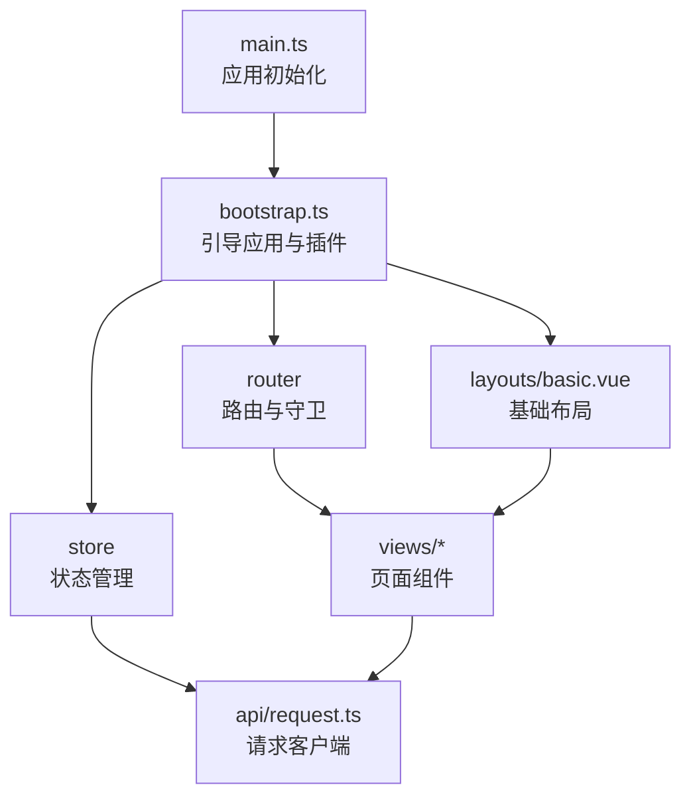
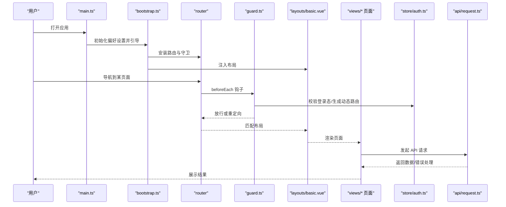
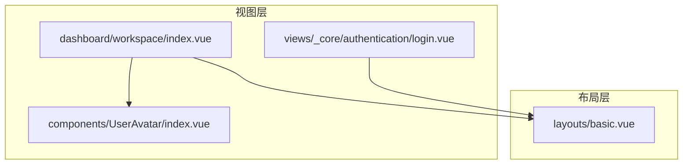
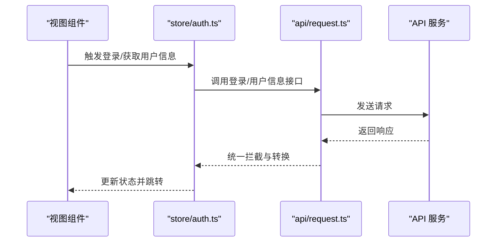
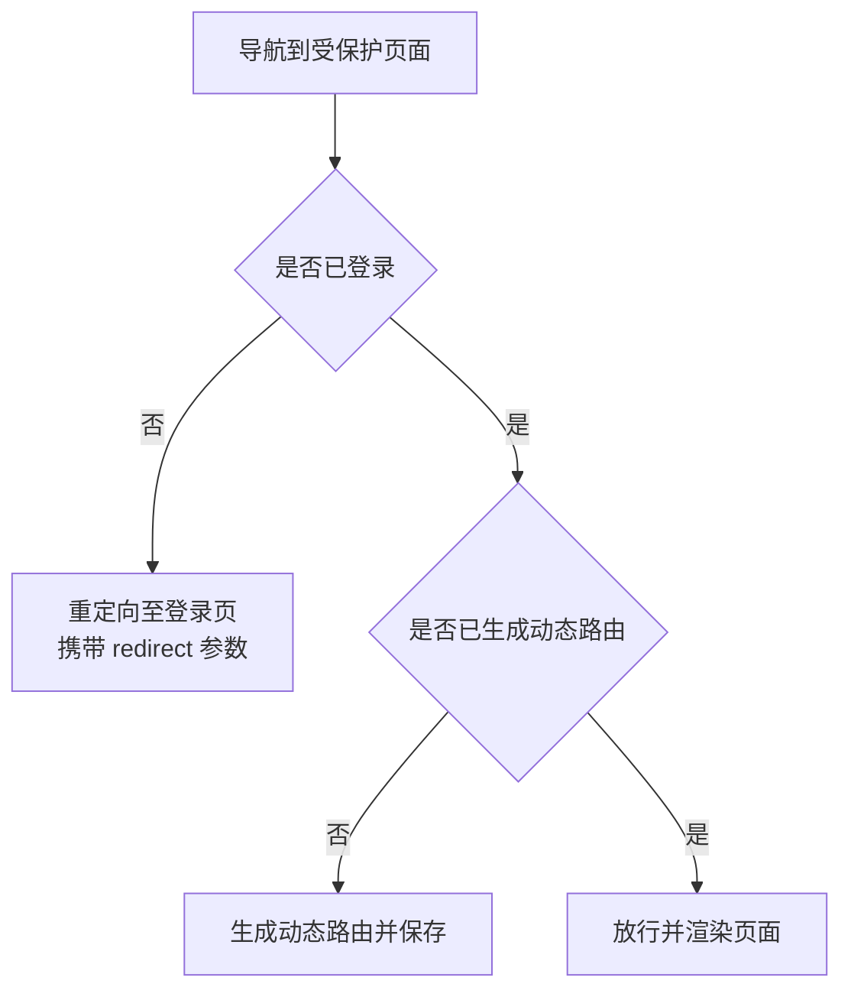
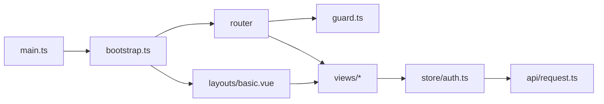

# 视图开发

<cite>
**本文档引用的文件**
- [apps/web-antd/src/router/routes/index.ts](file://apps/web-antd/src/router/routes/index.ts)
- [apps/web-antd/src/router/guard.ts](file://apps/web-antd/src/router/guard.ts)
- [apps/web-antd/src/bootstrap.ts](file://apps/web-antd/src/bootstrap.ts)
- [apps/web-antd/src/main.ts](file://apps/web-antd/src/main.ts)
- [apps/web-antd/src/layouts/basic.vue](file://apps/web-antd/src/layouts/basic.vue)
- [apps/web-antd/src/store/auth.ts](file://apps/web-antd/src/store/auth.ts)
- [apps/web-antd/src/api/request.ts](file://apps/web-antd/src/api/request.ts)
- [apps/web-antd/src/views/dashboard/workspace/index.vue](file://apps/web-antd/src/views/dashboard/workspace/index.vue)
- [apps/web-antd/src/views/_core/authentication/login.vue](file://apps/web-antd/src/views/_core/authentication/login.vue)
- [apps/web-antd/src/components/UserAvatar/index.vue](file://apps/web-antd/src/components/UserAvatar/index.vue)
</cite>

## 目录

1. [引言](#引言)
2. [项目结构](#项目结构)
3. [核心组件](#核心组件)
4. [架构总览](#架构总览)
5. [详细组件分析](#详细组件分析)
6. [依赖关系分析](#依赖关系分析)
7. [性能考虑](#性能考虑)
8. [故障排查指南](#故障排查指南)
9. [结论](#结论)
10. [附录](#附录)

## 引言

本指南面向使用 Vben Admin 的前端开发者，聚焦“视图开发”的完整流程：页面组件的组织方式（业务页面、功能页面、通用页面）、视图与 API 的集成模式（数据获取、状态管理、错误处理）、视图生命周期与性能优化、组件开发最佳实践（props 传递、事件处理）、视图与布局的集成、路由参数处理，以及调试与测试策略。文档以实际代码为依据，配合可视化图表帮助快速理解与落地。

## 项目结构

Vben Admin 采用多应用与多 UI 框架的工程化组织方式，视图层位于各 web-\* 应用的 views 目录下，路由与守卫集中于 router 目录，状态管理与 API 请求封装集中在 store 与 api 目录，布局与通用 UI 组件位于 layouts 与 components 目录。

- 应用入口与引导
  - main.ts 负责初始化偏好设置、引导应用启动与全局卸载加载态
  - bootstrap.ts 负责创建应用实例、注册国际化、Pinia Store、权限指令、路由、UI 插件、动态标题等
- 路由与守卫
  - routes/index.ts 聚合核心路由、动态模块路由、404兜底路由，并扫描视图组件键
  - guard.ts 实现通用守卫与权限守卫，控制页面加载进度、登录态与动态路由注入
- 布局与通用 UI
  - layouts/basic.vue 提供基础布局模板、通知、用户下拉、锁屏、水印等能力
- 视图与业务页面
  - views 下按领域划分目录（如 dashboard、dev、system），页面组件直接使用通用 UI 与 API
- 状态与请求
  - store/auth.ts 管理登录、登出、用户信息获取与权限码获取
  - api/request.ts 封装请求客户端、统一响应拦截、鉴权刷新与错误提示

**图表来源**

- [apps/web-antd/src/main.ts:1-32](file://apps/web-antd/src/main.ts#L1-L32)
- [apps/web-antd/src/bootstrap.ts:1-85](file://apps/web-antd/src/bootstrap.ts#L1-L85)
- [apps/web-antd/src/router/routes/index.ts:1-48](file://apps/web-antd/src/router/routes/index.ts#L1-L48)
- [apps/web-antd/src/router/guard.ts:1-133](file://apps/web-antd/src/router/guard.ts#L1-L133)
- [apps/web-antd/src/layouts/basic.vue:1-207](file://apps/web-antd/src/layouts/basic.vue#L1-L207)
- [apps/web-antd/src/api/request.ts:1-124](file://apps/web-antd/src/api/request.ts#L1-L124)

**章节来源**

- [apps/web-antd/src/main.ts:1-32](file://apps/web-antd/src/main.ts#L1-L32)
- [apps/web-antd/src/bootstrap.ts:1-85](file://apps/web-antd/src/bootstrap.ts#L1-L85)
- [apps/web-antd/src/router/routes/index.ts:1-48](file://apps/web-antd/src/router/routes/index.ts#L1-L48)
- [apps/web-antd/src/router/guard.ts:1-133](file://apps/web-antd/src/router/guard.ts#L1-L133)
- [apps/web-antd/src/layouts/basic.vue:1-207](file://apps/web-antd/src/layouts/basic.vue#L1-L207)
- [apps/web-antd/src/api/request.ts:1-124](file://apps/web-antd/src/api/request.ts#L1-L124)

## 核心组件

- 应用引导与入口
  - main.ts：命名空间隔离偏好设置，异步初始化并启动 bootstrap，最后卸载全局 loading
  - bootstrap.ts：注册指令、i18n、Pinia、权限指令、路由、UI 插件、动态标题，最终挂载应用
- 路由与守卫
  - routes/index.ts：聚合核心路由、动态模块路由、404 路由；扫描视图组件路径生成 componentKeys
  - guard.ts：beforeEach 通用守卫（进度条、loaded 标记）与权限守卫（登录态、动态路由生成、重定向）
- 布局
  - basic.vue：基础布局模板，集成通知、用户下拉、锁屏、水印、登录过期弹窗等
- 状态与认证
  - store/auth.ts：登录、登出、获取用户信息、获取权限码、成功提示与路由跳转
- 请求与错误处理
  - api/request.ts：统一请求客户端、响应拦截、鉴权刷新、错误消息提示

**章节来源**

- [apps/web-antd/src/main.ts:1-32](file://apps/web-antd/src/main.ts#L1-L32)
- [apps/web-antd/src/bootstrap.ts:1-85](file://apps/web-antd/src/bootstrap.ts#L1-L85)
- [apps/web-antd/src/router/routes/index.ts:1-48](file://apps/web-antd/src/router/routes/index.ts#L1-L48)
- [apps/web-antd/src/router/guard.ts:1-133](file://apps/web-antd/src/router/guard.ts#L1-L133)
- [apps/web-antd/src/layouts/basic.vue:1-207](file://apps/web-antd/src/layouts/basic.vue#L1-L207)
- [apps/web-antd/src/store/auth.ts:1-118](file://apps/web-antd/src/store/auth.ts#L1-L118)
- [apps/web-antd/src/api/request.ts:1-124](file://apps/web-antd/src/api/request.ts#L1-L124)

## 架构总览

下图展示从应用启动到页面渲染、路由守卫、布局集成与 API 请求的整体流程。

**图表来源**

- [apps/web-antd/src/main.ts:1-32](file://apps/web-antd/src/main.ts#L1-L32)
- [apps/web-antd/src/bootstrap.ts:1-85](file://apps/web-antd/src/bootstrap.ts#L1-L85)
- [apps/web-antd/src/router/guard.ts:1-133](file://apps/web-antd/src/router/guard.ts#L1-L133)
- [apps/web-antd/src/layouts/basic.vue:1-207](file://apps/web-antd/src/layouts/basic.vue#L1-L207)
- [apps/web-antd/src/store/auth.ts:1-118](file://apps/web-antd/src/store/auth.ts#L1-L118)
- [apps/web-antd/src/api/request.ts:1-124](file://apps/web-antd/src/api/request.ts#L1-L124)

## 详细组件分析

### 页面组织方式：业务页面、功能页面与通用页面

- 业务页面（如工作台）
  - 示例：dashboard/workspace/index.vue
  - 特点：承载具体业务数据与交互，组合通用 UI 卡片、列表、图表等组件，内部通过 API 获取数据并在生命周期中初始化
- 功能页面（如登录）
  - 示例：views/\_core/authentication/login.vue
  - 特点：表单驱动、规则校验、验证码组件、提交后错误回退与验证码重置
- 通用页面（布局与通用 UI）
  - 示例：layouts/basic.vue、components/UserAvatar/index.vue
  - 特点：布局模板、用户头像、通知、下拉菜单等可复用 UI

**图表来源**

- [apps/web-antd/src/views/dashboard/workspace/index.vue:1-304](file://apps/web-antd/src/views/dashboard/workspace/index.vue#L1-L304)
- [apps/web-antd/src/views/\_core/authentication/login.vue:1-133](file://apps/web-antd/src/views/_core/authentication/login.vue#L1-L133)
- [apps/web-antd/src/components/UserAvatar/index.vue:1-33](file://apps/web-antd/src/components/UserAvatar/index.vue#L1-L33)
- [apps/web-antd/src/layouts/basic.vue:1-207](file://apps/web-antd/src/layouts/basic.vue#L1-L207)

**章节来源**

- [apps/web-antd/src/views/dashboard/workspace/index.vue:1-304](file://apps/web-antd/src/views/dashboard/workspace/index.vue#L1-L304)
- [apps/web-antd/src/views/\_core/authentication/login.vue:1-133](file://apps/web-antd/src/views/_core/authentication/login.vue#L1-L133)
- [apps/web-antd/src/components/UserAvatar/index.vue:1-33](file://apps/web-antd/src/components/UserAvatar/index.vue#L1-L33)
- [apps/web-antd/src/layouts/basic.vue:1-207](file://apps/web-antd/src/layouts/basic.vue#L1-L207)

### 视图与 API 集成模式：数据获取、状态管理与错误处理

- 数据获取
  - 页面在生命周期中调用 API 获取数据，如工作台页面在挂载后请求任务列表并填充视图
- 状态管理
  - 登录流程通过 store/auth.ts 管理登录态、用户信息与权限码，并在成功后进行路由跳转
- 错误处理
  - 请求客户端统一拦截错误并提示，支持刷新令牌与重新认证流程

**图表来源**

- [apps/web-antd/src/views/dashboard/workspace/index.vue:1-304](file://apps/web-antd/src/views/dashboard/workspace/index.vue#L1-L304)
- [apps/web-antd/src/store/auth.ts:1-118](file://apps/web-antd/src/store/auth.ts#L1-L118)
- [apps/web-antd/src/api/request.ts:1-124](file://apps/web-antd/src/api/request.ts#L1-L124)

**章节来源**

- [apps/web-antd/src/views/dashboard/workspace/index.vue:92-102](file://apps/web-antd/src/views/dashboard/workspace/index.vue#L92-L102)
- [apps/web-antd/src/store/auth.ts:28-78](file://apps/web-antd/src/store/auth.ts#L28-L78)
- [apps/web-antd/src/api/request.ts:84-114](file://apps/web-antd/src/api/request.ts#L84-L114)

### 视图生命周期管理与性能优化

- 生命周期
  - 页面在 onMounted 中初始化数据与交互（如排序、列表加载）
- 性能优化建议
  - 按需加载：仅在需要时引入重型组件或库
  - 列表虚拟化：对长列表使用虚拟滚动
  - 缓存策略：利用缓存避免重复请求
  - 图标与图片懒加载：减少首屏压力
  - 路由懒加载：结合路由模块化与动态导入

**章节来源**

- [apps/web-antd/src/views/dashboard/workspace/index.vue:92-102](file://apps/web-antd/src/views/dashboard/workspace/index.vue#L92-L102)

### 组件开发最佳实践：props 传递与事件处理

- props 设计
  - 明确必填与可选属性，提供合理的默认值
  - 对复杂对象使用类型约束，避免运行时错误
- 事件处理
  - 使用 emits 明确对外暴露的事件
  - 在父组件中通过事件回调处理子组件状态变化
- 与通用 UI 集成
  - 使用统一的表单与卡片组件，保持一致的交互体验

**章节来源**

- [apps/web-antd/src/components/UserAvatar/index.vue:5-14](file://apps/web-antd/src/components/UserAvatar/index.vue#L5-L14)

### 视图与布局集成：路由参数处理

- 路由参数
  - 路由守卫根据登录态与权限决定放行或重定向，支持携带 redirect 参数实现登录后跳转
- 布局集成
  - 基础布局提供用户下拉、通知、锁屏、水印等功能，页面只需专注于业务内容

**图表来源**

- [apps/web-antd/src/router/guard.ts:48-118](file://apps/web-antd/src/router/guard.ts#L48-L118)

**章节来源**

- [apps/web-antd/src/router/guard.ts:48-118](file://apps/web-antd/src/router/guard.ts#L48-L118)
- [apps/web-antd/src/layouts/basic.vue:172-206](file://apps/web-antd/src/layouts/basic.vue#L172-L206)

## 依赖关系分析

- 入口与引导
  - main.ts 依赖 bootstrap.ts 完成应用初始化
- 路由与守卫
  - routes/index.ts 提供路由集合，guard.ts 在 beforeEach 中使用路由与状态进行判断
- 布局与视图
  - layouts/basic.vue 作为全局布局，视图组件在其模板中渲染
- 状态与请求
  - store/auth.ts 依赖 api/request.ts 进行网络请求，视图组件通过 store 调用状态逻辑

**图表来源**

- [apps/web-antd/src/main.ts:1-32](file://apps/web-antd/src/main.ts#L1-L32)
- [apps/web-antd/src/bootstrap.ts:1-85](file://apps/web-antd/src/bootstrap.ts#L1-L85)
- [apps/web-antd/src/router/routes/index.ts:1-48](file://apps/web-antd/src/router/routes/index.ts#L1-L48)
- [apps/web-antd/src/router/guard.ts:1-133](file://apps/web-antd/src/router/guard.ts#L1-L133)
- [apps/web-antd/src/layouts/basic.vue:1-207](file://apps/web-antd/src/layouts/basic.vue#L1-L207)
- [apps/web-antd/src/store/auth.ts:1-118](file://apps/web-antd/src/store/auth.ts#L1-L118)
- [apps/web-antd/src/api/request.ts:1-124](file://apps/web-antd/src/api/request.ts#L1-L124)

**章节来源**

- [apps/web-antd/src/main.ts:1-32](file://apps/web-antd/src/main.ts#L1-L32)
- [apps/web-antd/src/bootstrap.ts:1-85](file://apps/web-antd/src/bootstrap.ts#L1-L85)
- [apps/web-antd/src/router/routes/index.ts:1-48](file://apps/web-antd/src/router/routes/index.ts#L1-L48)
- [apps/web-antd/src/router/guard.ts:1-133](file://apps/web-antd/src/router/guard.ts#L1-L133)
- [apps/web-antd/src/layouts/basic.vue:1-207](file://apps/web-antd/src/layouts/basic.vue#L1-L207)
- [apps/web-antd/src/store/auth.ts:1-118](file://apps/web-antd/src/store/auth.ts#L1-L118)
- [apps/web-antd/src/api/request.ts:1-124](file://apps/web-antd/src/api/request.ts#L1-L124)

## 性能考虑

- 路由与页面
  - 使用路由懒加载与按需导入，避免首屏加载过多资源
  - 利用守卫中的 loaded 标记减少重复动画与副作用
- 视图与组件
  - 对长列表使用虚拟滚动或分页
  - 图标与图片采用懒加载策略
  - 合理拆分组件，避免不必要的重渲染
- 状态与请求
  - 使用缓存与去抖节流减少重复请求
  - 统一错误处理与提示，避免频繁弹窗影响体验

[本节为通用指导，无需列出具体文件来源]

## 故障排查指南

- 登录失败与验证码重置
  - 登录失败时刷新验证码并恢复组件状态，便于用户重试
- 请求错误与提示
  - 请求拦截器统一处理错误消息，若无特定错误字段则根据状态码提示
- 登录过期与自动登出
  - 刷新令牌失败或令牌无效时，根据配置选择弹窗提示或直接登出
- 页面加载进度
  - 守卫中开启/关闭进度条，便于感知页面切换耗时

**章节来源**

- [apps/web-antd/src/views/\_core/authentication/login.vue:111-122](file://apps/web-antd/src/views/_core/authentication/login.vue#L111-L122)
- [apps/web-antd/src/api/request.ts:105-114](file://apps/web-antd/src/api/request.ts#L105-L114)
- [apps/web-antd/src/api/request.ts:43-56](file://apps/web-antd/src/api/request.ts#L43-L56)
- [apps/web-antd/src/router/guard.ts:21-40](file://apps/web-antd/src/router/guard.ts#L21-L40)

## 结论

本指南基于 Vben Admin 的实际代码，梳理了视图开发的全链路：从应用引导、路由与守卫、布局集成，到视图与 API 的协作、状态管理与错误处理、生命周期与性能优化、组件开发最佳实践，以及调试与测试策略。遵循本文档的组织方式与实践建议，可高效构建高质量的业务页面与功能页面。

[本节为总结性内容，无需列出具体文件来源]

## 附录

- 路由模块化与动态导入
  - routes/index.ts 通过 import.meta.glob 自动扫描模块路由并合并
- 布局扩展
  - basic.vue 提供多个插槽（用户下拉、通知、额外内容、锁屏），便于按需扩展

**章节来源**

- [apps/web-antd/src/router/routes/index.ts:7-16](file://apps/web-antd/src/router/routes/index.ts#L7-L16)
- [apps/web-antd/src/layouts/basic.vue:172-206](file://apps/web-antd/src/layouts/basic.vue#L172-L206)
