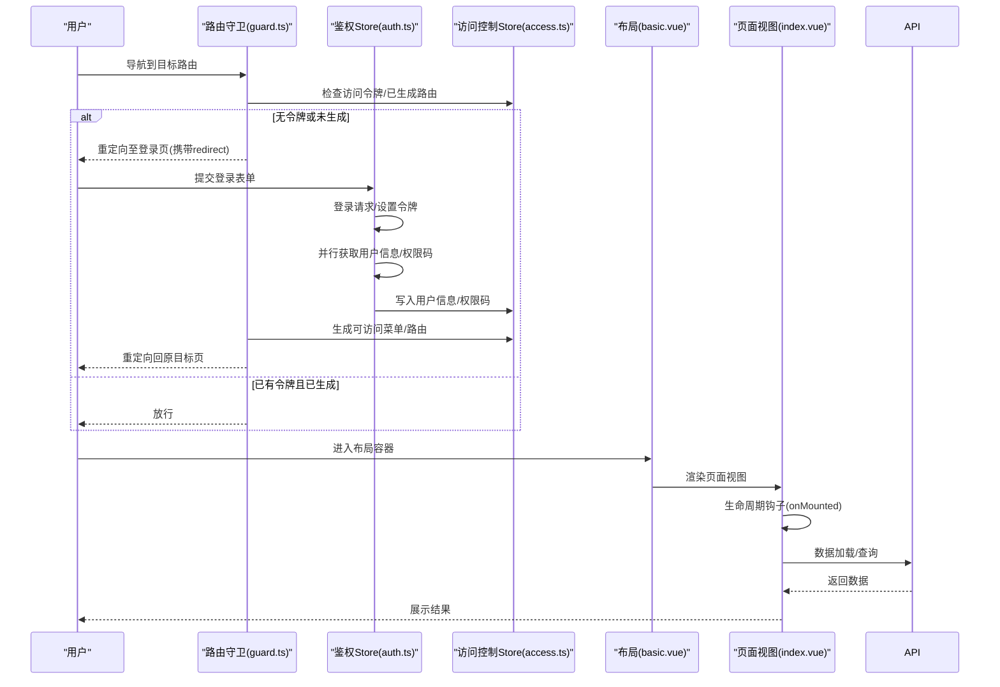
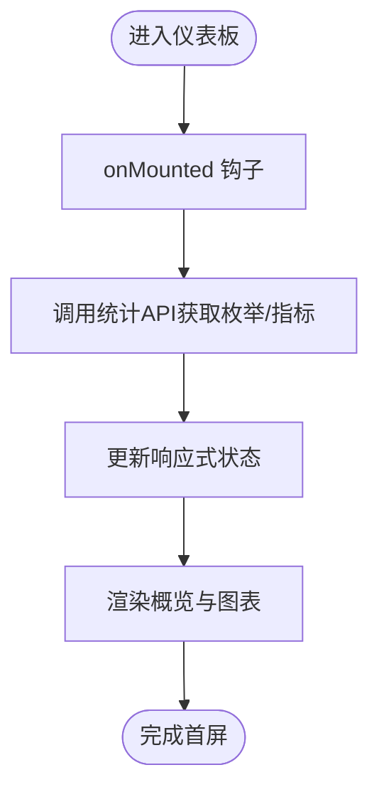
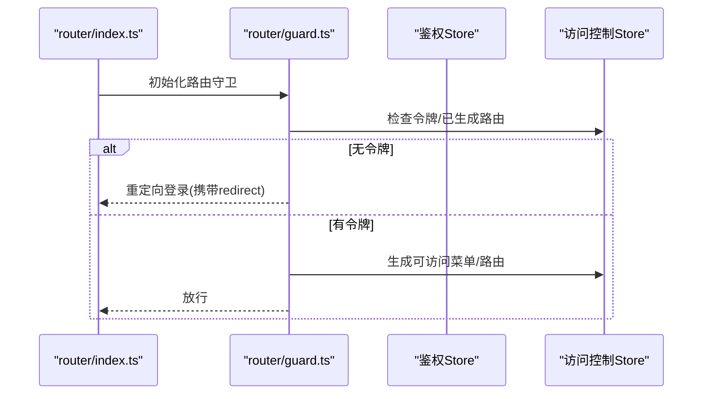
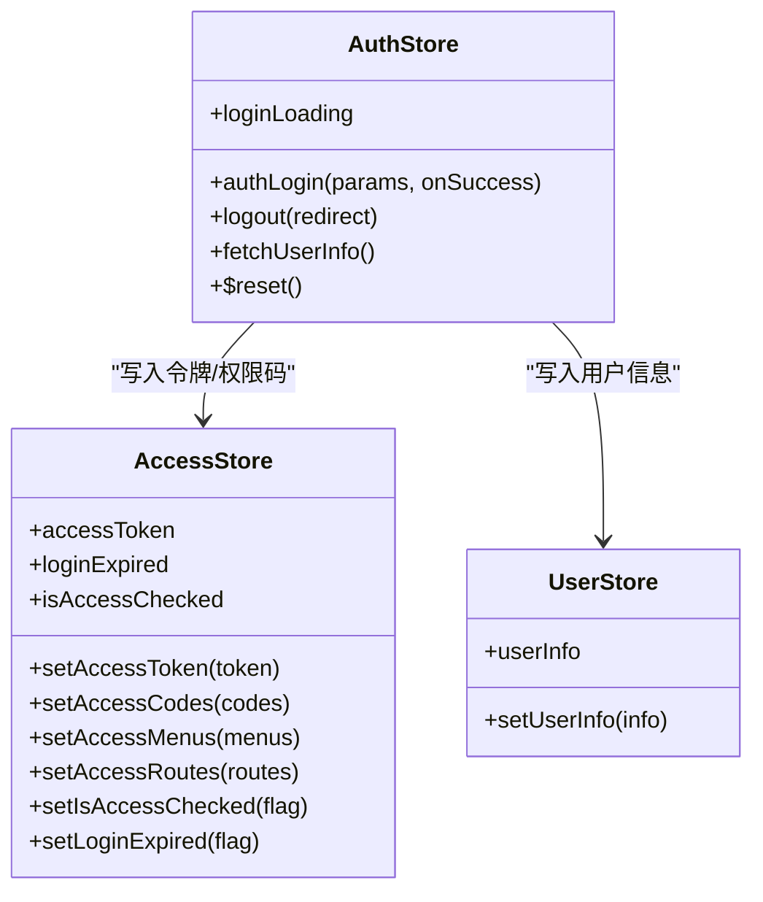
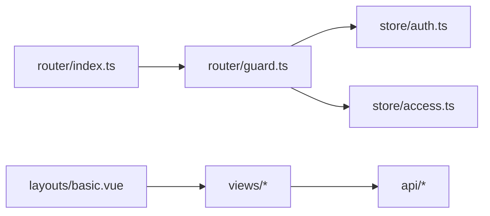

# 页面组件开发

<cite>
**本文引用的文件**
- [apps/web-antd/src/layouts/basic.vue](file://apps/web-antd/src/layouts/basic.vue)
- [apps/web-antd/src/router/index.ts](file://apps/web-antd/src/router/index.ts)
- [apps/web-antd/src/router/guard.ts](file://apps/web-antd/src/router/guard.ts)
- [apps/web-antd/src/router/routes/index.ts](file://apps/web-antd/src/router/routes/index.ts)
- [apps/web-antd/src/store/auth.ts](file://apps/web-antd/src/store/auth.ts)
- [apps/web-antd/src/views/dashboard/analytics/index.vue](file://apps/web-antd/src/views/dashboard/analytics/index.vue)
- [apps/web-antd/src/views/_core/authentication/login.vue](file://apps/web-antd/src/views/_core/authentication/login.vue)
- [apps/web-antd/src/api/statistics/dev.ts](file://apps/web-antd/src/api/statistics/dev.ts)
- [apps/web-antd/src/components/AiEditor/index.vue](file://apps/web-antd/src/components/AiEditor/index.vue)
- [apps/web-antd/src/components/CellProgress/index.vue](file://apps/web-antd/src/components/CellProgress/index.vue)
- [apps/web-antd/src/components/CellSteps/index.vue](file://apps/web-antd/src/components/CellSteps/index.vue)
- [apps/web-antd/src/components/ColorSelect/index.vue](file://apps/web-antd/src/components/ColorSelect/index.vue)
- [apps/web-antd/src/components/CommonPhrase/index.vue](file://apps/web-antd/src/components/CommonPhrase/index.vue)
- [apps/web-antd/src/components/UserAvatar/index.vue](file://apps/web-antd/src/components/UserAvatar/index.vue)
- [apps/web-antd/src/components/UserAvatarGroup/index.vue](file://apps/web-antd/src/components/UserAvatarGroup/index.vue)
- [apps/web-antd/src/components/dev/ProjectSelect/index.vue](file://apps/web-antd/src/components/dev/ProjectSelect/index.vue)
- [apps/web-antd/src/dicts/index.ts](file://apps/web-antd/src/dicts/index.ts)
- [apps/web-antd/src/locales/index.ts](file://apps/web-antd/src/locales/index.ts)
- [apps/web-antd/src/vtable/index.ts](file://apps/web-antd/src/vtable/index.ts)
- [apps/web-antd/src/preferences.ts](file://apps/web-antd/src/preferences.ts)
- [apps/web-antd/src/main.ts](file://apps/web-antd/src/main.ts)
- [apps/web-antd/src/bootstrap.ts](file://apps/web-antd/src/bootstrap.ts)
- [apps/web-antd/src/app.vue](file://apps/web-antd/src/app.vue)
- [apps/web-antd/src/utils/index.ts](file://apps/web-antd/src/utils/index.ts)
- [apps/web-antd/src/utils/enumUtils.ts](file://apps/web-antd/src/utils/enumUtils.ts)
- [apps/web-antd/src/utils/versionUtils.ts](file://apps/web-antd/src/utils/versionUtils.ts)
- [apps/web-antd/src/locales/langs/zh-CN/index.ts](file://apps/web-antd/src/locales/langs/zh-CN/index.ts)
- [apps/web-antd/src/locales/langs/en-US/index.ts](file://apps/web-antd/src/locales/langs/en-US/index.ts)
- [apps/web-antd/src/layouts/auth.vue](file://apps/web-antd/src/layouts/auth.vue)
- [apps/web-antd/src/layouts/basic.vue](file://apps/web-antd/src/layouts/basic.vue)
- [apps/web-antd/src/router/access.ts](file://apps/web-antd/src/router/access.ts)
- [apps/web-antd/src/router/routes/modules/dashboard.ts](file://apps/web-antd/src/router/routes/modules/dashboard.ts)
- [apps/web-antd/src/router/routes/modules/system.ts](file://apps/web-antd/src/router/routes/modules/system.ts)
- [apps/web-antd/src/router/routes/modules/dev.ts](file://apps/web-antd/src/router/routes/modules/dev.ts)
- [apps/web-antd/src/router/routes/modules/demos.ts](file://apps/web-antd/src/router/routes/modules/demos.ts)
- [apps/web-antd/src/router/routes/core.ts](file://apps/web-antd/src/router/routes/core.ts)
- [apps/web-antd/src/router/routes/fallback.ts](file://apps/web-antd/src/router/routes/fallback.ts)
- [apps/web-antd/src/store/index.ts](file://apps/web-antd/src/store/index.ts)
- [apps/web-antd/src/store/auth.ts](file://apps/web-antd/src/store/auth.ts)
- [apps/web-antd/src/store/user.ts](file://apps/web-antd/src/store/user.ts)
- [apps/web-antd/src/store/access.ts](file://apps/web-antd/src/store/access.ts)
- [apps/web-antd/src/api/core/auth.ts](file://apps/web-antd/src/api/core/auth.ts)
- [apps/web-antd/src/api/core/menu.ts](file://apps/web-antd/src/api/core/menu.ts)
- [apps/web-antd/src/api/core/user.ts](file://apps/web-antd/src/api/core/user.ts)
- [apps/web-antd/src/api/system/dept.ts](file://apps/web-antd/src/api/system/dept.ts)
- [apps/web-antd/src/api/system/menu.ts](file://apps/web-antd/src/api/system/menu.ts)
- [apps/web-antd/src/api/system/role.ts](file://apps/web-antd/src/api/system/role.ts)
- [apps/web-antd/src/api/system/user.ts](file://apps/web-antd/src/api/system/user.ts)
- [apps/web-antd/src/api/dev/bug.ts](file://apps/web-antd/src/api/dev/bug.ts)
- [apps/web-antd/src/api/dev/change.ts](file://apps/web-antd/src/api/dev/change.ts)
- [apps/web-antd/src/api/dev/module.ts](file://apps/web-antd/src/api/dev/module.ts)
- [apps/web-antd/src/api/dev/project.ts](file://apps/web-antd/src/api/dev/project.ts)
- [apps/web-antd/src/api/dev/story.ts](file://apps/web-antd/src/api/dev/story.ts)
- [apps/web-antd/src/api/dev/task.ts](file://apps/web-antd/src/api/dev/task.ts)
- [apps/web-antd/src/api/dev/versions.ts](file://apps/web-antd/src/api/dev/versions.ts)
- [apps/web-antd/src/api/examples/upload.ts](file://apps/web-antd/src/api/examples/upload.ts)
- [apps/web-antd/src/api/statistics/dev.ts](file://apps/web-antd/src/api/statistics/dev.ts)
- [apps/web-antd/src/api/request.ts](file://apps/web-antd/src/api/request.ts)
- [apps/web-antd/src/api/index.ts](file://apps/web-antd/src/api/index.ts)
- [apps/web-antd/src/vite.config.ts](file://apps/web-antd/src/vite.config.ts)
- [apps/web-antd/src/tsconfig.json](file://apps/web-antd/src/tsconfig.json)
- [apps/web-antd/package.json](file://apps/web-antd/package.json)
</cite>

## 目录

1. [简介](#简介)
2. [项目结构](#项目结构)
3. [核心组件](#核心组件)
4. [架构总览](#架构总览)
5. [组件详解](#组件详解)
6. [依赖关系分析](#依赖关系分析)
7. [性能考量](#性能考量)
8. [故障排查指南](#故障排查指南)
9. [结论](#结论)
10. [附录](#附录)

## 简介

本指南面向使用 Vben Admin 的前端开发者，聚焦“页面组件”的开发方法论与最佳实践。内容涵盖：

- 页面组件的结构设计与开发模式：仪表板、系统管理、开发相关页面
- 生命周期管理、数据加载策略与状态管理
- 页面与布局系统的集成：头部、侧边栏、面包屑配置
- 性能优化：懒加载、虚拟滚动、缓存策略
- 路由配置、权限控制与 SEO 优化
- 实战案例与可复用模板

## 项目结构

应用采用多框架适配方案，以 web-antd 为例，核心目录组织如下：

- 布局层：layouts（基础布局、认证布局）
- 路由层：router（路由定义、守卫、权限生成）
- 状态层：store（鉴权、用户、访问控制）
- 视图层：views（页面组件，按功能域分层）
- 组件库：components（通用 UI 组件与业务组件）
- API 层：api（按领域拆分的接口模块）
- 工具与偏好：utils、preferences、locales、vtable 等

```mermaid
graph TB
subgraph "应用入口"
APP["app.vue"]
MAIN["main.ts"]
BOOT["bootstrap.ts"]
end
subgraph "布局"
BASIC["layouts/basic.vue"]
AUTH["layouts/auth.vue"]
end
subgraph "路由"
ROUTER_IDX["router/index.ts"]
ROUTE_GUARD["router/guard.ts"]
ROUTE_INDEX["router/routes/index.ts"]
ROUTE_CORE["router/routes/core.ts"]
ROUTE_MOD_DASH["router/routes/modules/dashboard.ts"]
ROUTE_MOD_SYS["router/routes/modules/system.ts"]
ROUTE_MOD_DEV["router/routes/modules/dev.ts"]
ROUTE_MOD_DEMOS["router/routes/modules/demos.ts"]
end
subgraph "状态"
STORE_AUTH["store/auth.ts"]
STORE_USER["store/user.ts"]
STORE_ACCESS["store/access.ts"]
end
subgraph "视图"
VIEW_DASH["views/dashboard/analytics/index.vue"]
end
subgraph "组件"
CMP_AI["components/AiEditor/index.vue"]
CMP_CELLPROG["components/CellProgress/index.vue"]
CMP_CELLSTEP["components/CellSteps/index.vue"]
CMP_COLORSEL["components/ColorSelect/index.vue"]
CMP_COMMONPHRASE["components/CommonPhrase/index.vue"]
CMP_AVATAR["components/UserAvatar/index.vue"]
CMP_AVATARGRP["components/UserAvatarGroup/index.vue"]
CMP_PROJSEL["components/dev/ProjectSelect/index.vue"]
end
subgraph "API"
API_STAT_DEV["api/statistics/dev.ts"]
API_SYS_USER["api/system/user.ts"]
API_SYS_MENU["api/system/menu.ts"]
API_SYS_DEPT["api/system/dept.ts"]
API_SYS_ROLE["api/system/role.ts"]
API_DEV_TASK["api/dev/task.ts"]
API_DEV_PROJECT["api/dev/project.ts"]
end
APP --> MAIN --> BOOT
MAIN --> ROUTER_IDX
ROUTER_IDX --> ROUTE_INDEX
ROUTE_INDEX --> ROUTE_CORE
ROUTE_INDEX --> ROUTE_MOD_DASH
ROUTE_INDEX --> ROUTE_MOD_SYS
ROUTE_INDEX --> ROUTE_MOD_DEV
ROUTE_INDEX --> ROUTE_MOD_DEMOS
ROUTER_IDX --> ROUTE_GUARD
ROUTE_GUARD --> STORE_AUTH
ROUTE_GUARD --> STORE_USER
ROUTE_GUARD --> STORE_ACCESS
VIEW_DASH --> API_STAT_DEV
VIEW_DASH --> CMP_CELLPROG
VIEW_DASH --> CMP_CELLSTEP
VIEW_DASH --> CMP_COLORSEL
VIEW_DASH --> CMP_COMMONPHRASE
VIEW_DASH --> CMP_AVATAR
VIEW_DASH --> CMP_AVATARGRP
VIEW_DASH --> CMP_PROJSEL
VIEW_DASH --> CMP_AI
```

图表来源

- [apps/web-antd/src/app.vue](file://apps/web-antd/src/app.vue)
- [apps/web-antd/src/main.ts](file://apps/web-antd/src/main.ts)
- [apps/web-antd/src/bootstrap.ts](file://apps/web-antd/src/bootstrap.ts)
- [apps/web-antd/src/layouts/basic.vue](file://apps/web-antd/src/layouts/basic.vue)
- [apps/web-antd/src/router/index.ts](file://apps/web-antd/src/router/index.ts)
- [apps/web-antd/src/router/guard.ts](file://apps/web-antd/src/router/guard.ts)
- [apps/web-antd/src/router/routes/index.ts](file://apps/web-antd/src/router/routes/index.ts)
- [apps/web-antd/src/router/routes/core.ts](file://apps/web-antd/src/router/routes/core.ts)
- [apps/web-antd/src/router/routes/modules/dashboard.ts](file://apps/web-antd/src/router/routes/modules/dashboard.ts)
- [apps/web-antd/src/router/routes/modules/system.ts](file://apps/web-antd/src/router/routes/modules/system.ts)
- [apps/web-antd/src/router/routes/modules/dev.ts](file://apps/web-antd/src/router/routes/modules/dev.ts)
- [apps/web-antd/src/router/routes/modules/demos.ts](file://apps/web-antd/src/router/routes/modules/demos.ts)
- [apps/web-antd/src/store/auth.ts](file://apps/web-antd/src/store/auth.ts)
- [apps/web-antd/src/store/user.ts](file://apps/web-antd/src/store/user.ts)
- [apps/web-antd/src/store/access.ts](file://apps/web-antd/src/store/access.ts)
- [apps/web-antd/src/views/dashboard/analytics/index.vue](file://apps/web-antd/src/views/dashboard/analytics/index.vue)
- [apps/web-antd/src/api/statistics/dev.ts](file://apps/web-antd/src/api/statistics/dev.ts)
- [apps/web-antd/src/components/AiEditor/index.vue](file://apps/web-antd/src/components/AiEditor/index.vue)
- [apps/web-antd/src/components/CellProgress/index.vue](file://apps/web-antd/src/components/CellProgress/index.vue)
- [apps/web-antd/src/components/CellSteps/index.vue](file://apps/web-antd/src/components/CellSteps/index.vue)
- [apps/web-antd/src/components/ColorSelect/index.vue](file://apps/web-antd/src/components/ColorSelect/index.vue)
- [apps/web-antd/src/components/CommonPhrase/index.vue](file://apps/web-antd/src/components/CommonPhrase/index.vue)
- [apps/web-antd/src/components/UserAvatar/index.vue](file://apps/web-antd/src/components/UserAvatar/index.vue)
- [apps/web-antd/src/components/UserAvatarGroup/index.vue](file://apps/web-antd/src/components/UserAvatarGroup/index.vue)
- [apps/web-antd/src/components/dev/ProjectSelect/index.vue](file://apps/web-antd/src/components/dev/ProjectSelect/index.vue)

章节来源

- [apps/web-antd/src/app.vue](file://apps/web-antd/src/app.vue)
- [apps/web-antd/src/main.ts](file://apps/web-antd/src/main.ts)
- [apps/web-antd/src/bootstrap.ts](file://apps/web-antd/src/bootstrap.ts)
- [apps/web-antd/src/layouts/basic.vue](file://apps/web-antd/src/layouts/basic.vue)
- [apps/web-antd/src/router/index.ts](file://apps/web-antd/src/router/index.ts)
- [apps/web-antd/src/router/guard.ts](file://apps/web-antd/src/router/guard.ts)
- [apps/web-antd/src/router/routes/index.ts](file://apps/web-antd/src/router/routes/index.ts)

## 核心组件

- 布局系统：基础布局 basic.vue 集成头部、通知、锁屏、登录过期弹窗等，作为页面容器承载视图与交互。
- 路由系统：统一创建路由实例、注册守卫；通过动态模块聚合生成权限路由。
- 状态管理：鉴权 store 负责登录、登出、用户信息拉取与令牌管理；配合访问控制 store 生成菜单与路由。
- 视图组件：页面组件遵循“视图 + 业务子组件 + API 调用”的分层，便于复用与测试。

章节来源

- [apps/web-antd/src/layouts/basic.vue](file://apps/web-antd/src/layouts/basic.vue)
- [apps/web-antd/src/router/index.ts](file://apps/web-antd/src/router/index.ts)
- [apps/web-antd/src/router/guard.ts](file://apps/web-antd/src/router/guard.ts)
- [apps/web-antd/src/store/auth.ts](file://apps/web-antd/src/store/auth.ts)

## 架构总览

下图展示了从路由到布局再到页面组件的数据流与控制流：

图表来源

- [apps/web-antd/src/router/guard.ts](file://apps/web-antd/src/router/guard.ts)
- [apps/web-antd/src/store/auth.ts](file://apps/web-antd/src/store/auth.ts)
- [apps/web-antd/src/store/access.ts](file://apps/web-antd/src/store/access.ts)
- [apps/web-antd/src/layouts/basic.vue](file://apps/web-antd/src/layouts/basic.vue)
- [apps/web-antd/src/views/dashboard/analytics/index.vue](file://apps/web-antd/src/views/dashboard/analytics/index.vue)

## 组件详解

### 仪表板页面开发模式

- 结构设计
  - 页面容器：使用布局 basic.vue 作为外层容器，自动注入头部、通知、锁屏等能力。
  - 视图组件：analytics/index.vue 作为仪表板主页面，内部组合多个分析卡片与图表区域。
  - 子组件：分析趋势、访问数据、来源分布、销售统计等子组件按需渲染。
- 生命周期与数据加载
  - 在 mounted 钩子中发起数据请求，填充概览指标与图表数据。
  - 使用异步 API 获取枚举/统计数据，避免阻塞首屏渲染。
- 状态管理
  - 用户信息与权限码在登录阶段写入全局状态，仪表板页面仅消费状态与调用 API。
- 最佳实践
  - 将“指标计算”与“UI 展示”解耦，子组件专注单一职责。
  - 对高频更新的数据采用节流/防抖策略，减少不必要的重渲染。

图表来源

- [apps/web-antd/src/views/dashboard/analytics/index.vue](file://apps/web-antd/src/views/dashboard/analytics/index.vue)
- [apps/web-antd/src/api/statistics/dev.ts](file://apps/web-antd/src/api/statistics/dev.ts)

章节来源

- [apps/web-antd/src/views/dashboard/analytics/index.vue](file://apps/web-antd/src/views/dashboard/analytics/index.vue)
- [apps/web-antd/src/layouts/basic.vue](file://apps/web-antd/src/layouts/basic.vue)

### 系统管理页面开发模式

- 路由与权限
  - 路由模块化：system.ts 定义系统管理相关页面（如用户、角色、菜单、部门）。
  - 权限生成：路由守卫根据用户角色生成可访问菜单与路由，确保页面安全。
- 视图与组件
  - 页面组件按功能拆分（用户管理、角色管理、菜单管理、部门管理），每个页面独立维护 CRUD 逻辑。
  - 复用通用组件：表格、表单、模态框、抽屉等，提升一致性与开发效率。
- 状态与 API
  - 用户信息与权限码在登录阶段拉取；系统管理页面通过对应 API 模块进行数据交互。
- 最佳实践
  - 表格分页/搜索参数集中管理，支持刷新与重置。
  - 对敏感操作增加二次确认与权限校验。

章节来源

- [apps/web-antd/src/router/routes/modules/system.ts](file://apps/web-antd/src/router/routes/modules/system.ts)
- [apps/web-antd/src/router/guard.ts](file://apps/web-antd/src/router/guard.ts)
- [apps/web-antd/src/api/system/user.ts](file://apps/web-antd/src/api/system/user.ts)
- [apps/web-antd/src/api/system/role.ts](file://apps/web-antd/src/api/system/role.ts)
- [apps/web-antd/src/api/system/menu.ts](file://apps/web-antd/src/api/system/menu.ts)
- [apps/web-antd/src/api/system/dept.ts](file://apps/web-antd/src/api/system/dept.ts)

### 开发相关页面开发模式

- 路由与模块
  - dev.ts 定义开发相关页面（如任务、项目、故事、变更、版本等）。
  - 与系统管理类似，通过权限生成与菜单渲染，保障访问安全。
- 视图与组件
  - 页面组件围绕“工作台/看板/列表”等场景构建，结合字典、枚举工具与 vtable 能力。
- 最佳实践
  - 对长列表采用虚拟滚动与分页，降低内存占用。
  - 对复杂筛选条件提供快捷预设与本地缓存。

章节来源

- [apps/web-antd/src/router/routes/modules/dev.ts](file://apps/web-antd/src/router/routes/modules/dev.ts)
- [apps/web-antd/src/dicts/index.ts](file://apps/web-antd/src/dicts/index.ts)
- [apps/web-antd/src/vtable/index.ts](file://apps/web-antd/src/vtable/index.ts)

### 页面与布局系统集成

- 头部集成
  - basic.vue 注入用户头像、下拉菜单、通知面板、文档与 GitHub 链接等。
  - 通过偏好设置控制水印、语言、主题等，影响头部行为。
- 侧边栏与面包屑
  - 侧边栏菜单由权限生成，支持多级展开与图标配置。
  - 面包屑基于路由元信息自动生成，可通过 meta.breadcrumb 控制显示。
- 锁屏与登录过期
  - basic.vue 提供锁屏与登录过期弹窗，增强安全性与用户体验。

章节来源

- [apps/web-antd/src/layouts/basic.vue](file://apps/web-antd/src/layouts/basic.vue)
- [apps/web-antd/src/preferences.ts](file://apps/web-antd/src/preferences.ts)
- [apps/web-antd/src/locales/index.ts](file://apps/web-antd/src/locales/index.ts)

### 路由配置与权限控制

- 路由创建
  - router/index.ts 统一创建路由实例，支持 hash/history 模式，内置滚动行为与重置静态路由能力。
- 权限守卫
  - guard.ts 实现通用守卫与访问守卫：记录页面加载状态、进度条、令牌检查、动态路由生成与重定向。
  - access.ts 定义权限规则与菜单生成策略，结合角色与路由元信息生成可访问集合。
- 路由聚合
  - routes/index.ts 通过 import.meta.glob 聚合模块化路由，形成完整路由表。

图表来源

- [apps/web-antd/src/router/index.ts](file://apps/web-antd/src/router/index.ts)
- [apps/web-antd/src/router/guard.ts](file://apps/web-antd/src/router/guard.ts)
- [apps/web-antd/src/store/auth.ts](file://apps/web-antd/src/store/auth.ts)
- [apps/web-antd/src/store/access.ts](file://apps/web-antd/src/store/access.ts)

章节来源

- [apps/web-antd/src/router/index.ts](file://apps/web-antd/src/router/index.ts)
- [apps/web-antd/src/router/guard.ts](file://apps/web-antd/src/router/guard.ts)
- [apps/web-antd/src/router/routes/index.ts](file://apps/web-antd/src/router/routes/index.ts)

### 状态管理

- 鉴权状态
  - auth.ts 提供登录、登出、用户信息拉取、令牌设置与成功提示等能力。
- 用户与访问控制
  - user.ts 与 access.ts 分别负责用户信息与可访问资源的持久化与查询。
- 生命周期与副作用
  - 登录成功后并行拉取用户信息与权限码，减少等待时间；登出时重置所有状态并跳转登录页。

图表来源

- [apps/web-antd/src/store/auth.ts](file://apps/web-antd/src/store/auth.ts)
- [apps/web-antd/src/store/access.ts](file://apps/web-antd/src/store/access.ts)
- [apps/web-antd/src/store/user.ts](file://apps/web-antd/src/store/user.ts)

章节来源

- [apps/web-antd/src/store/auth.ts](file://apps/web-antd/src/store/auth.ts)
- [apps/web-antd/src/store/access.ts](file://apps/web-antd/src/store/access.ts)
- [apps/web-antd/src/store/user.ts](file://apps/web-antd/src/store/user.ts)

### 性能优化技巧

- 懒加载
  - 路由层面：将页面组件按需加载，减少首屏体积。
  - 组件层面：对重型图表/编辑器组件使用动态导入与 v-if 控制渲染时机。
- 虚拟滚动
  - 长列表场景优先采用虚拟滚动组件，限制可视区域渲染节点数量。
- 缓存策略
  - 对不频繁变动的数据采用本地缓存（如枚举、字典），结合失效策略与手动刷新。
  - 利用浏览器缓存与服务端协商缓存，减少重复请求。
- 渲染优化
  - 合理拆分组件，避免大组件重复渲染；使用 keep-alive 缓存非关键页面。
  - 对高频事件（滚动、输入）使用防抖/节流。

章节来源

- [apps/web-antd/src/router/routes/index.ts](file://apps/web-antd/src/router/routes/index.ts)
- [apps/web-antd/src/components/AiEditor/index.vue](file://apps/web-antd/src/components/AiEditor/index.vue)
- [apps/web-antd/src/components/CellProgress/index.vue](file://apps/web-antd/src/components/CellProgress/index.vue)
- [apps/web-antd/src/components/CellSteps/index.vue](file://apps/web-antd/src/components/CellSteps/index.vue)
- [apps/web-antd/src/components/ColorSelect/index.vue](file://apps/web-antd/src/components/ColorSelect/index.vue)
- [apps/web-antd/src/components/CommonPhrase/index.vue](file://apps/web-antd/src/components/CommonPhrase/index.vue)
- [apps/web-antd/src/components/UserAvatar/index.vue](file://apps/web-antd/src/components/UserAvatar/index.vue)
- [apps/web-antd/src/components/UserAvatarGroup/index.vue](file://apps/web-antd/src/components/UserAvatarGroup/index.vue)
- [apps/web-antd/src/components/dev/ProjectSelect/index.vue](file://apps/web-antd/src/components/dev/ProjectSelect/index.vue)

### SEO 优化

- 元信息
  - 在路由元信息中配置标题、关键词、描述等，便于搜索引擎抓取。
- 静态资源
  - 合理使用 preload/prefetch 加速关键资源加载。
- 可访问性
  - 为图片/图标提供替代文本，保证键盘导航与屏幕阅读器可用性。

章节来源

- [apps/web-antd/src/router/routes/index.ts](file://apps/web-antd/src/router/routes/index.ts)

### 实际开发案例与最佳实践

- 仪表板页面
  - 使用响应式状态承载指标与图表数据；在 mounted 中发起一次性数据请求。
  - 将子组件拆分为趋势、访问、来源、销售等，便于独立维护与测试。
- 系统管理页面
  - 采用统一的 CRUD 模板：查询表单 + 表格 + 操作按钮 + 弹窗/抽屉详情。
  - 对敏感操作（删除、停用）增加二次确认与权限校验。
- 开发相关页面
  - 长列表使用虚拟滚动与分页；复杂筛选提供快捷预设。
  - 字典与枚举统一管理，避免硬编码。

章节来源

- [apps/web-antd/src/views/dashboard/analytics/index.vue](file://apps/web-antd/src/views/dashboard/analytics/index.vue)
- [apps/web-antd/src/api/statistics/dev.ts](file://apps/web-antd/src/api/statistics/dev.ts)
- [apps/web-antd/src/api/system/user.ts](file://apps/web-antd/src/api/system/user.ts)
- [apps/web-antd/src/api/system/role.ts](file://apps/web-antd/src/api/system/role.ts)
- [apps/web-antd/src/api/system/menu.ts](file://apps/web-antd/src/api/system/menu.ts)
- [apps/web-antd/src/api/system/dept.ts](file://apps/web-antd/src/api/system/dept.ts)
- [apps/web-antd/src/api/dev/task.ts](file://apps/web-antd/src/api/dev/task.ts)
- [apps/web-antd/src/api/dev/project.ts](file://apps/web-antd/src/api/dev/project.ts)

## 依赖关系分析

- 路由到状态
  - 路由守卫依赖鉴权与访问控制状态，生成可访问菜单与路由。
- 视图到 API
  - 页面组件通过 API 模块进行数据交互，遵循按域拆分的组织方式。
- 布局到视图
  - 布局容器承载页面视图，注入头部、通知、锁屏等通用能力。

图表来源

- [apps/web-antd/src/router/index.ts](file://apps/web-antd/src/router/index.ts)
- [apps/web-antd/src/router/guard.ts](file://apps/web-antd/src/router/guard.ts)
- [apps/web-antd/src/store/auth.ts](file://apps/web-antd/src/store/auth.ts)
- [apps/web-antd/src/store/access.ts](file://apps/web-antd/src/store/access.ts)
- [apps/web-antd/src/layouts/basic.vue](file://apps/web-antd/src/layouts/basic.vue)

章节来源

- [apps/web-antd/src/router/index.ts](file://apps/web-antd/src/router/index.ts)
- [apps/web-antd/src/router/guard.ts](file://apps/web-antd/src/router/guard.ts)
- [apps/web-antd/src/store/auth.ts](file://apps/web-antd/src/store/auth.ts)
- [apps/web-antd/src/store/access.ts](file://apps/web-antd/src/store/access.ts)
- [apps/web-antd/src/layouts/basic.vue](file://apps/web-antd/src/layouts/basic.vue)

## 性能考量

- 资源加载
  - 使用动态导入与路由懒加载，减少首屏 JS 体积。
  - 对第三方库按需引入，避免全量打包。
- 渲染性能
  - 长列表使用虚拟滚动；对昂贵计算使用计算属性与缓存。
  - 合理拆分组件，避免不必要的重渲染。
- 网络优化
  - 对静态资源启用压缩与缓存；合理设置缓存头。
  - 对接口请求进行去重与合并，避免重复请求。

## 故障排查指南

- 登录后无法进入目标页
  - 检查路由守卫中的令牌与重定向逻辑，确认 redirect 参数是否正确传递。
- 权限不足导致白屏
  - 检查权限生成逻辑与菜单/路由映射，确认用户角色是否包含相应权限。
- 首屏加载缓慢
  - 使用浏览器性能分析工具定位瓶颈；对大组件与大资源进行懒加载与分包。
- 头部/通知异常
  - 检查布局容器的插槽使用与状态绑定，确认水印、通知数据是否正确更新。

章节来源

- [apps/web-antd/src/router/guard.ts](file://apps/web-antd/src/router/guard.ts)
- [apps/web-antd/src/layouts/basic.vue](file://apps/web-antd/src/layouts/basic.vue)
- [apps/web-antd/src/store/auth.ts](file://apps/web-antd/src/store/auth.ts)

## 结论

本文从结构设计、生命周期、状态管理、布局集成、性能优化、路由与权限、SEO 以及实战案例等方面，系统梳理了 Vben Admin 页面组件的开发要点。建议在实际项目中：

- 严格遵循“视图 + 组件 + API”的分层组织
- 将权限与路由解耦，通过守卫集中处理访问控制
- 重视首屏性能与交互体验，采用懒加载与虚拟滚动
- 建立统一的 CRUD 模板与组件库，提升复用性与一致性

## 附录

- 术语
  - 鉴权：登录态与令牌管理
  - 访问控制：基于角色的菜单与路由生成
  - 路由懒加载：按需加载页面组件
  - 虚拟滚动：只渲染可视区域内的列表项
- 参考路径
  - 应用入口与引导：[apps/web-antd/src/app.vue](file://apps/web-antd/src/app.vue)，[apps/web-antd/src/main.ts](file://apps/web-antd/src/main.ts)，[apps/web-antd/src/bootstrap.ts](file://apps/web-antd/src/bootstrap.ts)
  - 布局与国际化：[apps/web-antd/src/layouts/basic.vue](file://apps/web-antd/src/layouts/basic.vue)，[apps/web-antd/src/locales/index.ts](file://apps/web-antd/src/locales/index.ts)
  - 偏好设置与工具：[apps/web-antd/src/preferences.ts](file://apps/web-antd/src/preferences.ts)，[apps/web-antd/src/utils/index.ts](file://apps/web-antd/src/utils/index.ts)
