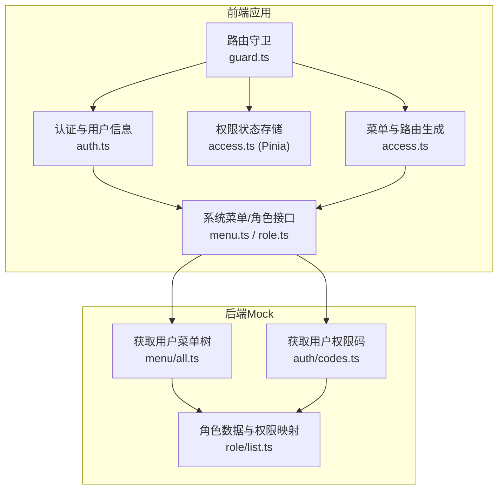
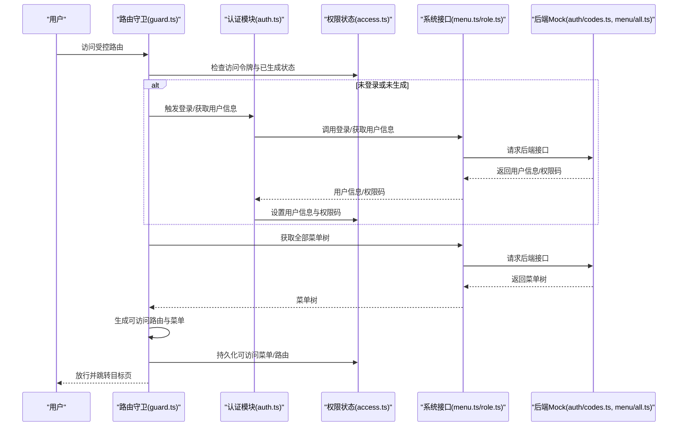
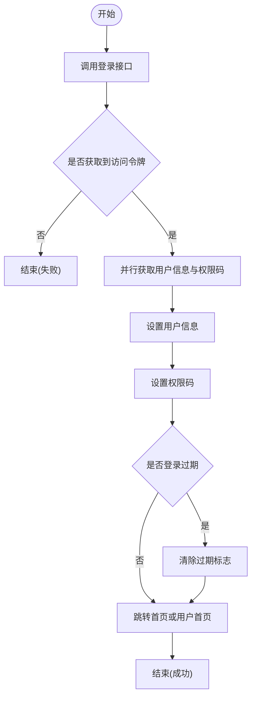
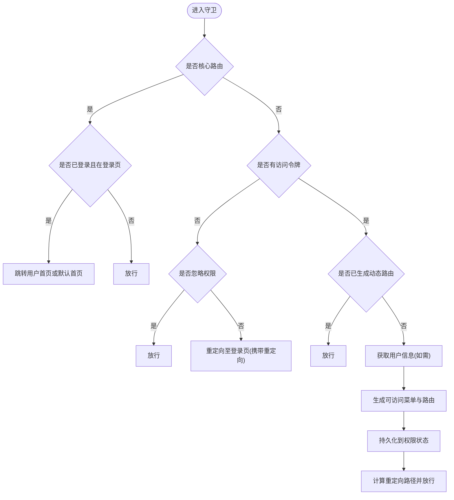
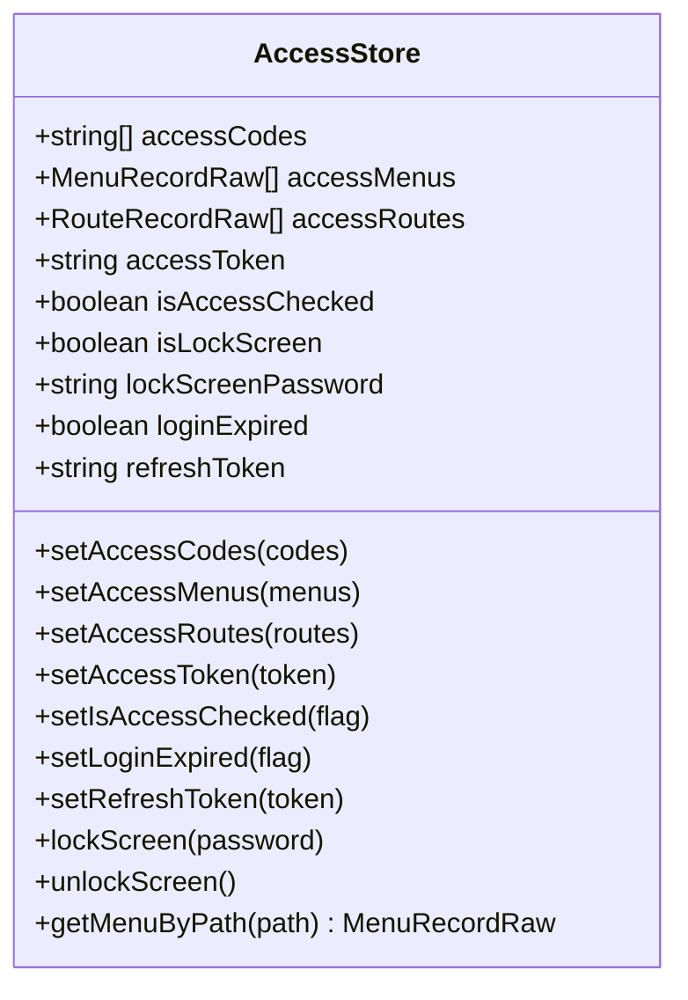
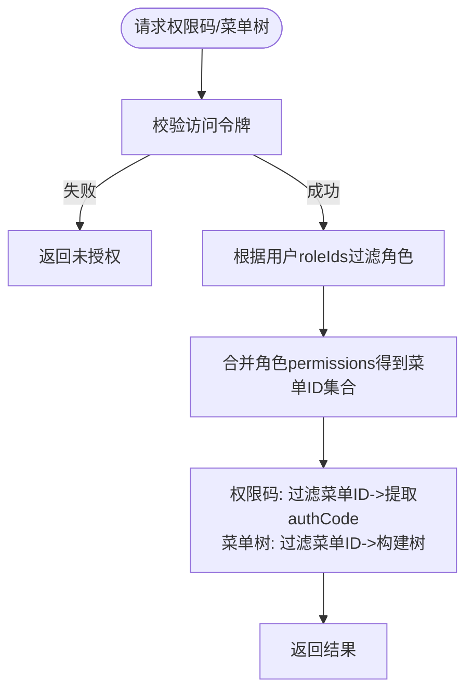
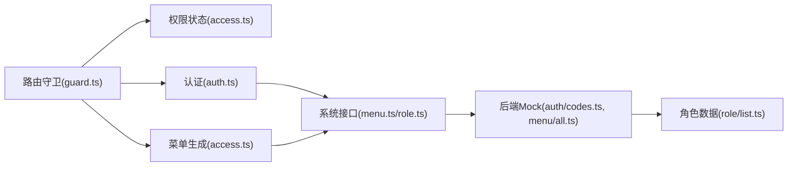

# 权限控制

<cite>
**本文引用的文件**
- [apps/web-antd/src/store/auth.ts](file://apps/web-antd/src/store/auth.ts)
- [apps/web-antd/src/router/guard.ts](file://apps/web-antd/src/router/guard.ts)
- [apps/web-antd/src/router/access.ts](file://apps/web-antd/src/router/access.ts)
- [apps/web-antd/src/api/core/auth.ts](file://apps/web-antd/src/api/core/auth.ts)
- [apps/web-antd/src/api/system/menu.ts](file://apps/web-antd/src/api/system/menu.ts)
- [apps/web-antd/src/api/system/role.ts](file://apps/web-antd/src/api/system/role.ts)
- [packages/stores/src/modules/access.ts](file://packages/stores/src/modules/access.ts)
- [apps/backend-mock/api/auth/codes.ts](file://apps/backend-mock/api/auth/codes.ts)
- [apps/backend-mock/api/menu/all.ts](file://apps/backend-mock/api/menu/all.ts)
- [apps/backend-mock/api/system/role/list.ts](file://apps/backend-mock/api/system/role/list.ts)
- [docs/src/en/guide/in-depth/access.md](file://docs/src/en/guide/in-depth/access.md)
</cite>

## 目录

1. [简介](#简介)
2. [项目结构](#项目结构)
3. [核心组件](#核心组件)
4. [架构总览](#架构总览)
5. [详细组件分析](#详细组件分析)
6. [依赖分析](#依赖分析)
7. [性能考量](#性能考量)
8. [故障排查指南](#故障排查指南)
9. [结论](#结论)
10. [附录](#附录)

## 简介

本文件系统性阐述 Vben Admin 的权限控制系统，围绕基于角色的访问控制（RBAC）展开，覆盖用户角色、权限集合与菜单权限的关联关系；详解多层级权限验证机制（路由级、组件级、按钮级）；梳理权限数据的获取与缓存策略（权限树构建、权限标识生成、状态同步）；给出角色权限分配、菜单权限设置与动态权限更新的实操示例；说明权限控制与 UI 组件的集成方式（菜单显示控制、按钮禁用处理、页面内容过滤）；最后总结安全考虑与性能优化建议。

## 项目结构

权限控制涉及前端应用层（web-antd）、权限状态存储（Pinia stores）、路由守卫与菜单生成、以及后端 Mock 接口四大部分。前端通过路由守卫在首次访问受控路由时拉取用户信息与权限码，并动态生成可访问的菜单与路由；权限状态通过 Pinia 持久化存储；后端提供角色与菜单数据、权限码接口，用于模拟 RBAC 数据流。

**图表来源**

- [apps/web-antd/src/router/guard.ts:1-133](file://apps/web-antd/src/router/guard.ts#L1-L133)
- [apps/web-antd/src/router/access.ts:1-54](file://apps/web-antd/src/router/access.ts#L1-L54)
- [packages/stores/src/modules/access.ts:1-130](file://packages/stores/src/modules/access.ts#L1-L130)
- [apps/web-antd/src/store/auth.ts:1-118](file://apps/web-antd/src/store/auth.ts#L1-L118)
- [apps/web-antd/src/api/system/menu.ts:1-160](file://apps/web-antd/src/api/system/menu.ts#L1-L160)
- [apps/web-antd/src/api/system/role.ts:1-56](file://apps/web-antd/src/api/system/role.ts#L1-L56)
- [apps/backend-mock/api/auth/codes.ts:1-29](file://apps/backend-mock/api/auth/codes.ts#L1-L29)
- [apps/backend-mock/api/menu/all.ts:1-31](file://apps/backend-mock/api/menu/all.ts#L1-L31)
- [apps/backend-mock/api/system/role/list.ts:1-118](file://apps/backend-mock/api/system/role/list.ts#L1-L118)

**章节来源**

- [apps/web-antd/src/router/guard.ts:1-133](file://apps/web-antd/src/router/guard.ts#L1-L133)
- [apps/web-antd/src/router/access.ts:1-54](file://apps/web-antd/src/router/access.ts#L1-L54)
- [packages/stores/src/modules/access.ts:1-130](file://packages/stores/src/modules/access.ts#L1-L130)
- [apps/web-antd/src/store/auth.ts:1-118](file://apps/web-antd/src/store/auth.ts#L1-L118)
- [apps/web-antd/src/api/system/menu.ts:1-160](file://apps/web-antd/src/api/system/menu.ts#L1-L160)
- [apps/web-antd/src/api/system/role.ts:1-56](file://apps/web-antd/src/api/system/role.ts#L1-L56)
- [apps/backend-mock/api/auth/codes.ts:1-29](file://apps/backend-mock/api/auth/codes.ts#L1-L29)
- [apps/backend-mock/api/menu/all.ts:1-31](file://apps/backend-mock/api/menu/all.ts#L1-L31)
- [apps/backend-mock/api/system/role/list.ts:1-118](file://apps/backend-mock/api/system/role/list.ts#L1-L118)

## 核心组件

- 认证与登录流程：负责登录、获取用户信息、获取权限码、设置状态与路由跳转。
- 路由守卫：统一处理未登录、忽略权限、动态生成菜单与路由、权限状态标记。
- 权限状态存储：集中管理访问令牌、权限码、可访问菜单与路由、登录过期等状态，并持久化关键字段。
- 菜单与路由生成：根据后端返回的菜单树与前端页面映射，生成可访问的路由与菜单。
- 后端接口：提供权限码、菜单树、角色列表等数据，支撑 RBAC 数据模型。

**章节来源**

- [apps/web-antd/src/store/auth.ts:1-118](file://apps/web-antd/src/store/auth.ts#L1-L118)
- [apps/web-antd/src/router/guard.ts:1-133](file://apps/web-antd/src/router/guard.ts#L1-L133)
- [packages/stores/src/modules/access.ts:1-130](file://packages/stores/src/modules/access.ts#L1-L130)
- [apps/web-antd/src/router/access.ts:1-54](file://apps/web-antd/src/router/access.ts#L1-L54)
- [apps/web-antd/src/api/core/auth.ts:1-52](file://apps/web-antd/src/api/core/auth.ts#L1-L52)
- [apps/web-antd/src/api/system/menu.ts:1-160](file://apps/web-antd/src/api/system/menu.ts#L1-L160)
- [apps/web-antd/src/api/system/role.ts:1-56](file://apps/web-antd/src/api/system/role.ts#L1-L56)
- [apps/backend-mock/api/auth/codes.ts:1-29](file://apps/backend-mock/api/auth/codes.ts#L1-L29)
- [apps/backend-mock/api/menu/all.ts:1-31](file://apps/backend-mock/api/menu/all.ts#L1-L31)
- [apps/backend-mock/api/system/role/list.ts:1-118](file://apps/backend-mock/api/system/role/list.ts#L1-L118)

## 架构总览

下图展示从登录到动态路由生成与菜单渲染的关键交互，体现“令牌校验—拉取用户信息—拉取权限码—生成可访问菜单与路由—持久化状态—页面渲染”的闭环。

**图表来源**

- [apps/web-antd/src/router/guard.ts:47-118](file://apps/web-antd/src/router/guard.ts#L47-L118)
- [apps/web-antd/src/store/auth.ts:28-78](file://apps/web-antd/src/store/auth.ts#L28-L78)
- [packages/stores/src/modules/access.ts:76-100](file://packages/stores/src/modules/access.ts#L76-L100)
- [apps/web-antd/src/api/system/menu.ts:96-100](file://apps/web-antd/src/api/system/menu.ts#L96-L100)
- [apps/web-antd/src/api/system/role.ts:19-24](file://apps/web-antd/src/api/system/role.ts#L19-L24)
- [apps/backend-mock/api/auth/codes.ts:8-28](file://apps/backend-mock/api/auth/codes.ts#L8-L28)
- [apps/backend-mock/api/menu/all.ts:10-30](file://apps/backend-mock/api/menu/all.ts#L10-L30)

## 详细组件分析

### 认证与登录流程（auth.ts）

- 并行获取访问令牌与用户信息、权限码，确保登录成功后立即具备访问上下文。
- 登录成功后写入访问令牌与用户信息，设置权限码，按用户首页或默认首页进行路由跳转。
- 提供登出逻辑，清理所有状态并回退至登录页，携带当前路由以便登录后重定向。

**图表来源**

- [apps/web-antd/src/store/auth.ts:28-78](file://apps/web-antd/src/store/auth.ts#L28-L78)

**章节来源**

- [apps/web-antd/src/store/auth.ts:1-118](file://apps/web-antd/src/store/auth.ts#L1-L118)

### 路由守卫与动态权限（guard.ts 与 access.ts）

- 通用守卫：记录页面加载状态、控制进度条。
- 访问守卫：
  - 忽略基本路由与显式忽略权限的路由。
  - 无令牌时，若目标路由允许忽略权限则放行，否则重定向至登录页并携带重定向参数。
  - 若尚未生成动态路由，拉取用户信息（必要时），调用菜单生成器生成可访问菜单与路由，持久化到权限状态，并重定向至目标页。
- 菜单与路由生成：
  - 通过统一入口生成可访问菜单与路由，支持“可见但禁止访问”场景（显示菜单，访问跳转 403）。
  - 将页面组件与布局映射注入生成器，保证菜单项能正确渲染。

**图表来源**

- [apps/web-antd/src/router/guard.ts:47-118](file://apps/web-antd/src/router/guard.ts#L47-L118)
- [apps/web-antd/src/router/access.ts:18-51](file://apps/web-antd/src/router/access.ts#L18-L51)

**章节来源**

- [apps/web-antd/src/router/guard.ts:1-133](file://apps/web-antd/src/router/guard.ts#L1-L133)
- [apps/web-antd/src/router/access.ts:1-54](file://apps/web-antd/src/router/access.ts#L1-L54)

### 权限状态存储（access.ts）

- 状态字段：访问令牌、刷新令牌、权限码数组、可访问菜单、可访问路由、是否已检查权限、登录是否过期、锁屏状态与密码等。
- 行为方法：设置/获取访问令牌、设置权限码、设置可访问菜单与路由、设置是否已检查权限、设置登录过期、锁屏/解锁等。
- 持久化策略：仅对访问令牌、刷新令牌、权限码、锁屏状态与密码进行持久化，避免敏感信息泄露。

**图表来源**

- [packages/stores/src/modules/access.ts:9-122](file://packages/stores/src/modules/access.ts#L9-L122)

**章节来源**

- [packages/stores/src/modules/access.ts:1-130](file://packages/stores/src/modules/access.ts#L1-L130)

### 后端接口与 RBAC 数据模型

- 权限码接口：根据用户的角色集合，合并各角色关联的菜单 ID，再映射为权限码集合返回。
- 菜单树接口：根据用户的角色集合，合并菜单 ID，过滤出可访问菜单，并转换为树形结构返回。
- 角色数据：包含角色 ID、名称、状态、备注及权限菜单 ID 列表，用于构建 RBAC 关系。

**图表来源**

- [apps/backend-mock/api/auth/codes.ts:8-28](file://apps/backend-mock/api/auth/codes.ts#L8-L28)
- [apps/backend-mock/api/menu/all.ts:10-30](file://apps/backend-mock/api/menu/all.ts#L10-L30)
- [apps/backend-mock/api/system/role/list.ts:7-73](file://apps/backend-mock/api/system/role/list.ts#L7-L73)

**章节来源**

- [apps/backend-mock/api/auth/codes.ts:1-29](file://apps/backend-mock/api/auth/codes.ts#L1-L29)
- [apps/backend-mock/api/menu/all.ts:1-31](file://apps/backend-mock/api/menu/all.ts#L1-L31)
- [apps/backend-mock/api/system/role/list.ts:1-118](file://apps/backend-mock/api/system/role/list.ts#L1-L118)

### 菜单与路由生成（access.ts）

- 通过统一入口生成可访问菜单与路由，支持：
  - 动态加载页面组件与布局映射；
  - 对菜单 meta.query 的解析与注入；
  - “可见但禁止访问”场景下的 403 跳转；
  - 菜单树的映射与排序。

**章节来源**

- [apps/web-antd/src/router/access.ts:1-54](file://apps/web-antd/src/router/access.ts#L1-L54)

### 前端接口封装（auth.ts 与 menu.ts/role.ts）

- 认证接口：登录、刷新令牌、退出登录、获取权限码。
- 系统接口：菜单列表、菜单名称/路径存在性检查、创建/更新/删除菜单；角色列表、创建/更新/删除角色。

**章节来源**

- [apps/web-antd/src/api/core/auth.ts:1-52](file://apps/web-antd/src/api/core/auth.ts#L1-L52)
- [apps/web-antd/src/api/system/menu.ts:1-160](file://apps/web-antd/src/api/system/menu.ts#L1-L160)
- [apps/web-antd/src/api/system/role.ts:1-56](file://apps/web-antd/src/api/system/role.ts#L1-L56)

## 依赖分析

- 组件耦合：
  - 路由守卫依赖权限状态存储与认证模块，用于判断令牌与生成状态。
  - 菜单与路由生成依赖系统菜单接口与页面/布局映射。
  - 认证模块依赖系统接口与权限状态存储，完成登录后的状态初始化。
- 外部依赖：
  - 后端 Mock 提供角色、菜单、权限码接口，支撑 RBAC 数据流。
- 潜在循环依赖：
  - 当前结构清晰分层，未见明显循环依赖风险。

**图表来源**

- [apps/web-antd/src/router/guard.ts:1-133](file://apps/web-antd/src/router/guard.ts#L1-L133)
- [apps/web-antd/src/router/access.ts:1-54](file://apps/web-antd/src/router/access.ts#L1-L54)
- [apps/web-antd/src/store/auth.ts:1-118](file://apps/web-antd/src/store/auth.ts#L1-L118)
- [apps/web-antd/src/api/system/menu.ts:1-160](file://apps/web-antd/src/api/system/menu.ts#L1-L160)
- [apps/web-antd/src/api/system/role.ts:1-56](file://apps/web-antd/src/api/system/role.ts#L1-L56)
- [apps/backend-mock/api/auth/codes.ts:1-29](file://apps/backend-mock/api/auth/codes.ts#L1-L29)
- [apps/backend-mock/api/menu/all.ts:1-31](file://apps/backend-mock/api/menu/all.ts#L1-L31)
- [apps/backend-mock/api/system/role/list.ts:1-118](file://apps/backend-mock/api/system/role/list.ts#L1-L118)

**章节来源**

- [apps/web-antd/src/router/guard.ts:1-133](file://apps/web-antd/src/router/guard.ts#L1-L133)
- [apps/web-antd/src/router/access.ts:1-54](file://apps/web-antd/src/router/access.ts#L1-L54)
- [apps/web-antd/src/store/auth.ts:1-118](file://apps/web-antd/src/store/auth.ts#L1-L118)
- [apps/web-antd/src/api/system/menu.ts:1-160](file://apps/web-antd/src/api/system/menu.ts#L1-L160)
- [apps/web-antd/src/api/system/role.ts:1-56](file://apps/web-antd/src/api/system/role.ts#L1-L56)
- [apps/backend-mock/api/auth/codes.ts:1-29](file://apps/backend-mock/api/auth/codes.ts#L1-L29)
- [apps/backend-mock/api/menu/all.ts:1-31](file://apps/backend-mock/api/menu/all.ts#L1-L31)
- [apps/backend-mock/api/system/role/list.ts:1-118](file://apps/backend-mock/api/system/role/list.ts#L1-L118)

## 性能考量

- 并行请求：登录阶段并行获取用户信息与权限码，缩短首屏等待时间。
- 动态路由一次性生成：首次访问时生成可访问路由与菜单并持久化，避免重复计算。
- 菜单树映射：对后端返回的菜单树进行一次映射处理，减少后续渲染开销。
- 缓存策略：权限状态中的关键字段持久化，提升二次进入应用的体验。
- 进度条与页面加载状态：统一的进度条与已加载页面记录，改善用户体验。

[本节为通用性能建议，不直接分析具体文件，故无“章节来源”]

## 故障排查指南

- 登录后无法进入受控页面
  - 检查访问令牌是否正确设置与持久化。
  - 确认用户信息中角色列表与后端角色数据一致。
  - 查看路由守卫是否成功生成可访问路由与菜单。
- 菜单可见但访问被拒绝
  - 检查后端返回的菜单是否包含“可见但禁止访问”标记，确认前端生成器是否正确处理。
- 权限码缺失导致按钮/功能不可用
  - 确认权限码接口返回值是否包含所需权限码。
  - 检查权限状态中权限码数组是否正确写入。
- 登录成功但未跳转
  - 检查用户首页路径与默认首页配置，确认重定向逻辑。

**章节来源**

- [apps/web-antd/src/router/guard.ts:47-118](file://apps/web-antd/src/router/guard.ts#L47-L118)
- [apps/web-antd/src/store/auth.ts:28-78](file://apps/web-antd/src/store/auth.ts#L28-L78)
- [packages/stores/src/modules/access.ts:76-100](file://packages/stores/src/modules/access.ts#L76-L100)
- [apps/backend-mock/api/auth/codes.ts:8-28](file://apps/backend-mock/api/auth/codes.ts#L8-L28)

## 结论

Vben Admin 的权限控制以 RBAC 为核心，结合前端路由守卫与动态菜单生成，实现了从登录到页面渲染的全链路权限管控。通过并行请求、一次性生成与状态持久化，兼顾了可用性与性能。配合后端 Mock 的角色、菜单与权限码接口，能够稳定地演示与验证权限体系。实际生产中应强化令牌安全、接口鉴权与权限最小化原则，并持续优化菜单树与权限码的缓存策略。

[本节为总结性内容，不直接分析具体文件，故无“章节来源”]

## 附录

### 多层级权限验证机制

- 路由级别：通过路由守卫在进入受控路由前进行令牌与权限检查，必要时生成可访问路由与菜单。
- 组件级别：基于权限码与菜单元信息，控制组件内功能的可见与可用。
- 按钮级别：依据权限码决定按钮的启用/禁用状态，确保操作层面的细粒度控制。

**章节来源**

- [apps/web-antd/src/router/guard.ts:47-118](file://apps/web-antd/src/router/guard.ts#L47-L118)
- [apps/web-antd/src/router/access.ts:18-51](file://apps/web-antd/src/router/access.ts#L18-L51)
- [docs/src/en/guide/in-depth/access.md:51-81](file://docs/src/en/guide/in-depth/access.md#L51-L81)

### 权限数据获取与缓存策略

- 获取流程：登录成功后并行拉取用户信息与权限码，随后拉取菜单树并生成可访问路由与菜单。
- 缓存策略：权限状态中的访问令牌、刷新令牌、权限码、锁屏状态与密码持久化，其余状态在内存中维护。
- 状态同步：生成可访问菜单与路由后写入权限状态，后续路由切换不再重复生成。

**章节来源**

- [apps/web-antd/src/store/auth.ts:28-78](file://apps/web-antd/src/store/auth.ts#L28-L78)
- [packages/stores/src/modules/access.ts:102-122](file://packages/stores/src/modules/access.ts#L102-L122)
- [apps/web-antd/src/router/guard.ts:93-118](file://apps/web-antd/src/router/guard.ts#L93-L118)

### 权限配置示例（RBAC）

- 角色权限分配
  - 在角色数据中为每个角色配置权限菜单 ID 列表，后端据此生成权限码与菜单树。
- 菜单权限设置
  - 菜单元数据包含权限标识与多种元信息，前端据此控制菜单显示与路由行为。
- 动态权限更新
  - 登录后拉取最新权限码与菜单树，替换本地可访问集合，实现权限变更的即时生效。

**章节来源**

- [apps/backend-mock/api/system/role/list.ts:7-73](file://apps/backend-mock/api/system/role/list.ts#L7-L73)
- [apps/web-antd/src/api/system/menu.ts:25-90](file://apps/web-antd/src/api/system/menu.ts#L25-L90)
- [apps/backend-mock/api/auth/codes.ts:14-27](file://apps/backend-mock/api/auth/codes.ts#L14-L27)
- [apps/backend-mock/api/menu/all.ts:16-29](file://apps/backend-mock/api/menu/all.ts#L16-L29)

### 权限控制与 UI 组件集成

- 菜单显示控制：根据可访问菜单集合渲染菜单树，隐藏不可访问项。
- 按钮禁用处理：依据权限码判断按钮可用性，动态禁用不可用按钮。
- 页面内容过滤：在组件内根据权限码决定内容渲染与交互逻辑。

**章节来源**

- [apps/web-antd/src/router/access.ts:18-51](file://apps/web-antd/src/router/access.ts#L18-L51)
- [packages/stores/src/modules/access.ts:53-71](file://packages/stores/src/modules/access.ts#L53-L71)

### 安全考虑与最佳实践

- 令牌安全：严格校验访问令牌与刷新令牌，避免敏感信息落盘；仅持久化必要的状态字段。
- 最小权限：角色权限分配遵循最小权限原则，避免过度授权。
- 接口鉴权：后端接口必须校验访问令牌，防止越权访问。
- 前端降级：在令牌失效或权限不足时，统一跳转至登录页或 403 页面，保障界面一致性。

**章节来源**

- [packages/stores/src/modules/access.ts:102-122](file://packages/stores/src/modules/access.ts#L102-L122)
- [apps/web-antd/src/router/guard.ts:65-86](file://apps/web-antd/src/router/guard.ts#L65-L86)
- [apps/backend-mock/api/auth/codes.ts:8-12](file://apps/backend-mock/api/auth/codes.ts#L8-L12)
