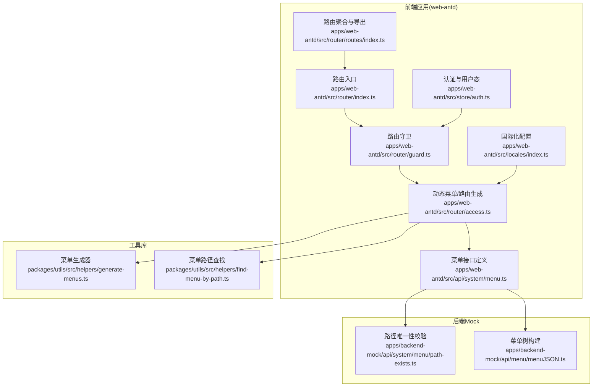
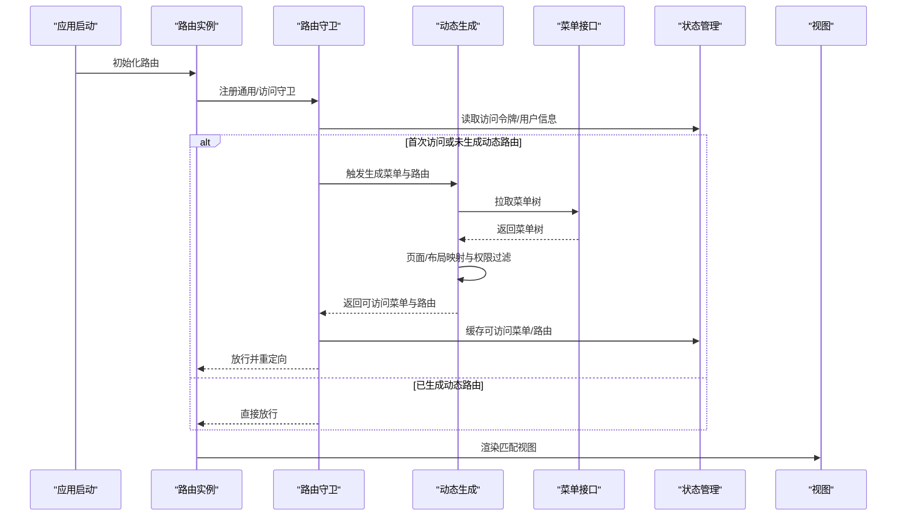
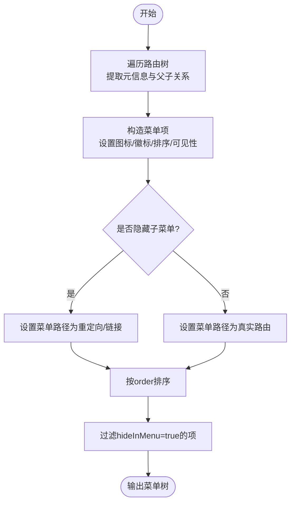
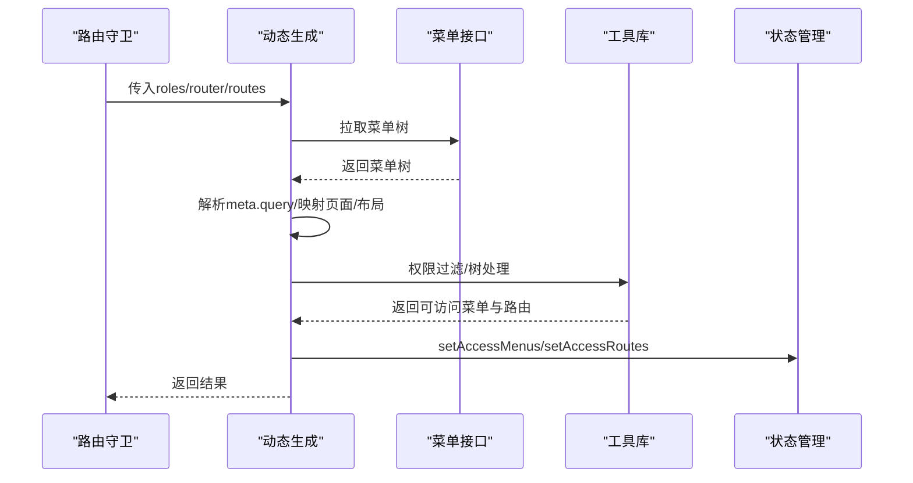
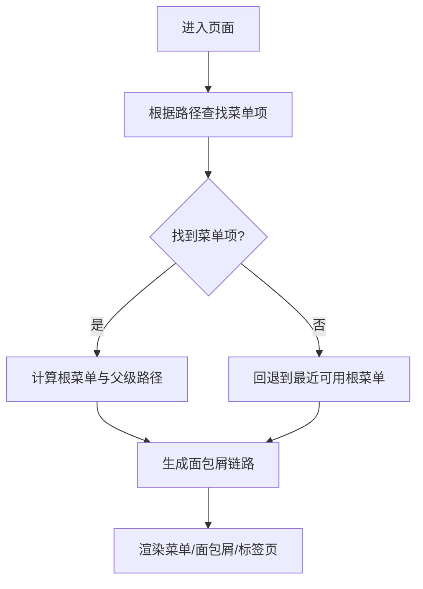
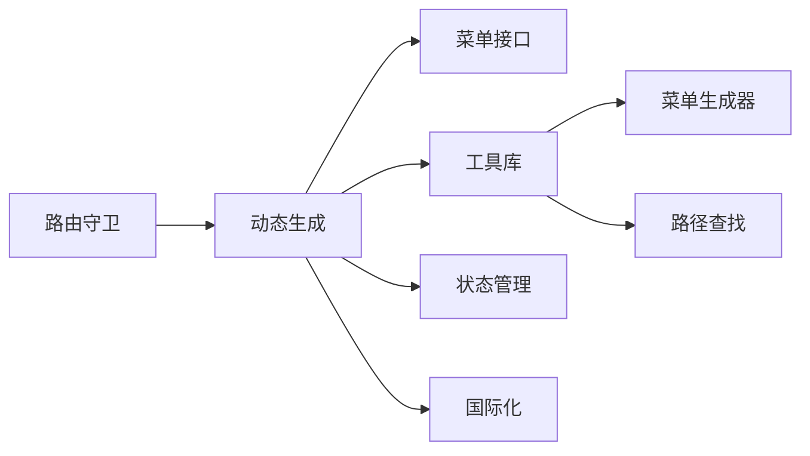

# 菜单路由集成

<cite>
**本文引用的文件**
- [apps/web-antd/src/router/index.ts](file://apps/web-antd/src/router/index.ts)
- [apps/web-antd/src/router/guard.ts](file://apps/web-antd/src/router/guard.ts)
- [apps/web-antd/src/router/access.ts](file://apps/web-antd/src/router/access.ts)
- [apps/web-antd/src/router/routes/index.ts](file://apps/web-antd/src/router/routes/index.ts)
- [apps/web-antd/src/api/system/menu.ts](file://apps/web-antd/src/api/system/menu.ts)
- [apps/web-antd/src/store/auth.ts](file://apps/web-antd/src/store/auth.ts)
- [apps/web-antd/src/locales/index.ts](file://apps/web-antd/src/locales/index.ts)
- [packages/utils/src/helpers/generate-menus.ts](file://packages/utils/src/helpers/generate-menus.ts)
- [packages/utils/src/helpers/find-menu-by-path.ts](file://packages/utils/src/helpers/find-menu-by-path.ts)
- [apps/backend-mock/api/system/menu/path-exists.ts](file://apps/backend-mock/api/system/menu/path-exists.ts)
- [apps/backend-mock/api/menu/menuJSON.ts](file://apps/backend-mock/api/menu/menuJSON.ts)
- [docs/src/en/guide/essentials/route.md](file://docs/src/en/guide/essentials/route.md)
</cite>

## 目录
1. [简介](#简介)
2. [项目结构](#项目结构)
3. [核心组件](#核心组件)
4. [架构总览](#架构总览)
5. [详细组件分析](#详细组件分析)
6. [依赖分析](#依赖分析)
7. [性能考虑](#性能考虑)
8. [故障排查指南](#故障排查指南)
9. [结论](#结论)
10. [附录](#附录)

## 简介
本技术文档围绕 Vben Admin 的“菜单路由集成”体系，系统阐述菜单与路由的双向绑定机制、菜单数据结构与路由配置映射、动态菜单生成流程、权限控制与面包屑联动、国际化集成以及最佳实践与常见问题。文档以代码为依据，结合可视化图示，帮助开发者快速理解并高效扩展菜单路由能力。

## 项目结构
本项目采用多应用与多框架并行的工程化组织方式，菜单路由集成主要集中在前端应用层（如 web-antd），并通过统一的工具库与访问控制模块完成动态菜单与路由的生成与绑定。

图表来源
- [apps/web-antd/src/router/index.ts:1-38](file://apps/web-antd/src/router/index.ts#L1-L38)
- [apps/web-antd/src/router/guard.ts:1-133](file://apps/web-antd/src/router/guard.ts#L1-L133)
- [apps/web-antd/src/router/access.ts:1-54](file://apps/web-antd/src/router/access.ts#L1-L54)
- [apps/web-antd/src/router/routes/index.ts:1-48](file://apps/web-antd/src/router/routes/index.ts#L1-L48)
- [apps/web-antd/src/store/auth.ts:1-118](file://apps/web-antd/src/store/auth.ts#L1-L118)
- [apps/web-antd/src/api/system/menu.ts:1-160](file://apps/web-antd/src/api/system/menu.ts#L1-L160)
- [apps/web-antd/src/locales/index.ts:1-103](file://apps/web-antd/src/locales/index.ts#L1-L103)
- [packages/utils/src/helpers/generate-menus.ts:1-93](file://packages/utils/src/helpers/generate-menus.ts#L1-L93)
- [packages/utils/src/helpers/find-menu-by-path.ts:1-38](file://packages/utils/src/helpers/find-menu-by-path.ts#L1-L38)
- [apps/backend-mock/api/system/menu/path-exists.ts:1-29](file://apps/backend-mock/api/system/menu/path-exists.ts#L1-L29)
- [apps/backend-mock/api/menu/menuJSON.ts:402-425](file://apps/backend-mock/api/menu/menuJSON.ts#L402-L425)

章节来源
- [apps/web-antd/src/router/index.ts:1-38](file://apps/web-antd/src/router/index.ts#L1-L38)
- [apps/web-antd/src/router/guard.ts:1-133](file://apps/web-antd/src/router/guard.ts#L1-L133)
- [apps/web-antd/src/router/access.ts:1-54](file://apps/web-antd/src/router/access.ts#L1-L54)
- [apps/web-antd/src/router/routes/index.ts:1-48](file://apps/web-antd/src/router/routes/index.ts#L1-L48)
- [apps/web-antd/src/store/auth.ts:1-118](file://apps/web-antd/src/store/auth.ts#L1-L118)
- [apps/web-antd/src/api/system/menu.ts:1-160](file://apps/web-antd/src/api/system/menu.ts#L1-L160)
- [apps/web-antd/src/locales/index.ts:1-103](file://apps/web-antd/src/locales/index.ts#L1-L103)
- [packages/utils/src/helpers/generate-menus.ts:1-93](file://packages/utils/src/helpers/generate-menus.ts#L1-L93)
- [packages/utils/src/helpers/find-menu-by-path.ts:1-38](file://packages/utils/src/helpers/find-menu-by-path.ts#L1-L38)
- [apps/backend-mock/api/system/menu/path-exists.ts:1-29](file://apps/backend-mock/api/system/menu/path-exists.ts#L1-L29)
- [apps/backend-mock/api/menu/menuJSON.ts:402-425](file://apps/backend-mock/api/menu/menuJSON.ts#L402-L425)

## 核心组件
- 路由入口与守卫：负责创建路由实例、注册通用与访问守卫，触发动态菜单与路由生成。
- 动态菜单/路由生成：根据后端菜单树与前端页面映射，生成可访问的菜单与路由。
- 菜单生成器：将路由树转换为菜单树，处理父子关系、排序、可见性与最终路径。
- 菜单路径查找：在菜单树中按路径定位菜单项与根菜单，支撑面包屑与高亮。
- 菜单接口：定义菜单字段、元信息与校验接口（名称/路径唯一性）。
- 国际化：提供多语言消息加载与切换，菜单标题通过翻译键渲染。
- 后端Mock：提供菜单树构建与路径唯一性校验，便于开发调试。

章节来源
- [apps/web-antd/src/router/index.ts:1-38](file://apps/web-antd/src/router/index.ts#L1-L38)
- [apps/web-antd/src/router/guard.ts:1-133](file://apps/web-antd/src/router/guard.ts#L1-L133)
- [apps/web-antd/src/router/access.ts:1-54](file://apps/web-antd/src/router/access.ts#L1-L54)
- [packages/utils/src/helpers/generate-menus.ts:1-93](file://packages/utils/src/helpers/generate-menus.ts#L1-L93)
- [packages/utils/src/helpers/find-menu-by-path.ts:1-38](file://packages/utils/src/helpers/find-menu-by-path.ts#L1-L38)
- [apps/web-antd/src/api/system/menu.ts:1-160](file://apps/web-antd/src/api/system/menu.ts#L1-L160)
- [apps/web-antd/src/locales/index.ts:1-103](file://apps/web-antd/src/locales/index.ts#L1-L103)

## 架构总览
下图展示了从路由初始化到菜单生成、权限校验与页面渲染的关键交互：

图表来源
- [apps/web-antd/src/router/index.ts:1-38](file://apps/web-antd/src/router/index.ts#L1-L38)
- [apps/web-antd/src/router/guard.ts:1-133](file://apps/web-antd/src/router/guard.ts#L1-L133)
- [apps/web-antd/src/router/access.ts:1-54](file://apps/web-antd/src/router/access.ts#L1-L54)
- [apps/web-antd/src/store/auth.ts:1-118](file://apps/web-antd/src/store/auth.ts#L1-L118)

## 详细组件分析

### 菜单与路由的双向绑定机制
- 路由到菜单：通过菜单生成器将路由树映射为菜单树，保留父子关系与最终路径，同时应用元信息（图标、徽标、排序、可见性等）。
- 菜单到路由：动态生成阶段将后端菜单树转换为前端路由记录，结合页面映射与布局映射，形成可访问的路由表。
- 最终路径策略：当存在“隐藏子菜单”时，菜单指向重定向或链接；否则指向真实路由路径。

图表来源
- [packages/utils/src/helpers/generate-menus.ts:17-90](file://packages/utils/src/helpers/generate-menus.ts#L17-L90)

章节来源
- [packages/utils/src/helpers/generate-menus.ts:1-93](file://packages/utils/src/helpers/generate-menus.ts#L1-L93)

### 菜单数据结构与路由配置映射
- 菜单字段：包含路径、标题、图标、徽标、排序、父子关系、可见性、重定向、链接等，均来自路由元信息与后端菜单树。
- 路由元信息：通过路由 record 的 meta 字段承载菜单属性，如 keepAlive、affixTab、hideInMenu、hideInBreadcrumb、order、icon、badge 等。
- 路由命名规范：建议使用语义化 name，配合路径 path 与 redirect，确保菜单与路由一一对应且可定位。

章节来源
- [apps/web-antd/src/api/system/menu.ts:25-91](file://apps/web-antd/src/api/system/menu.ts#L25-L91)
- [docs/src/en/guide/essentials/route.md:116-228](file://docs/src/en/guide/essentials/route.md#L116-L228)

### 动态菜单生成流程
- 数据来源：调用菜单接口获取后端菜单树，必要时对元信息中的查询参数进行解析。
- 页面映射：基于 import.meta.glob 扫描视图组件，建立页面映射表。
- 权限过滤：根据角色与后端返回的权限码，过滤不可访问的菜单与路由。
- 结果缓存：将可访问的菜单与路由写入状态管理，避免重复生成。

图表来源
- [apps/web-antd/src/router/guard.ts:98-118](file://apps/web-antd/src/router/guard.ts#L98-L118)
- [apps/web-antd/src/router/access.ts:18-51](file://apps/web-antd/src/router/access.ts#L18-L51)

章节来源
- [apps/web-antd/src/router/guard.ts:1-133](file://apps/web-antd/src/router/guard.ts#L1-L133)
- [apps/web-antd/src/router/access.ts:1-54](file://apps/web-antd/src/router/access.ts#L1-L54)

### 菜单权限与路由权限的对应关系
- 菜单可见性：由 meta.hideInMenu 控制；生成器会过滤掉隐藏项。
- 子菜单展开：由 meta.hideChildrenInMenu 控制；若开启则菜单指向重定向或链接，不显示子菜单。
- 面包屑导航：通过 findMenuByPath 与 findRootMenuByPath 定位当前路径对应的菜单与其根菜单，从而生成面包屑链路。
- 路由访问：访问守卫根据角色与权限码决定是否允许进入，未授权时可重定向至登录或403页面。

图表来源
- [packages/utils/src/helpers/find-menu-by-path.ts:3-35](file://packages/utils/src/helpers/find-menu-by-path.ts#L3-L35)

章节来源
- [packages/utils/src/helpers/find-menu-by-path.ts:1-38](file://packages/utils/src/helpers/find-menu-by-path.ts#L1-L38)
- [apps/web-antd/src/router/guard.ts:1-133](file://apps/web-antd/src/router/guard.ts#L1-L133)

### 菜单数据的获取与更新
- 获取：通过菜单接口拉取后端菜单树，支持名称/路径唯一性校验，保障菜单结构一致性。
- 更新：后端菜单变更后，前端通过重新拉取菜单树并刷新状态，即可更新菜单与路由。
- 树构建：后端提供将线性菜单列表转换为树形结构的逻辑，便于前端消费。

章节来源
- [apps/web-antd/src/api/system/menu.ts:96-160](file://apps/web-antd/src/api/system/menu.ts#L96-L160)
- [apps/backend-mock/api/system/menu/path-exists.ts:1-29](file://apps/backend-mock/api/system/menu/path-exists.ts#L1-L29)
- [apps/backend-mock/api/menu/menuJSON.ts:402-425](file://apps/backend-mock/api/menu/menuJSON.ts#L402-L425)

### 菜单与国际化系统的集成
- 翻译键：菜单标题通过翻译键注入，运行时根据当前语言动态渲染。
- 语言包加载：应用启动时加载本地化资源与第三方组件库语言包，支持动态切换。
- 切换流程：切换语言后，菜单标题与全局文案自动更新。

章节来源
- [apps/web-antd/src/locales/index.ts:1-103](file://apps/web-antd/src/locales/index.ts#L1-L103)

### 路由守卫与登录流程
- 登录成功：获取访问令牌与用户信息，同时拉取权限码，随后进入动态菜单生成流程。
- 未登录/过期：拦截并重定向至登录页，携带目标页面地址以便登录后回跳。
- 已登录：若已生成动态路由则直接放行，否则生成后重定向至目标页面。

章节来源
- [apps/web-antd/src/store/auth.ts:28-78](file://apps/web-antd/src/store/auth.ts#L28-L78)
- [apps/web-antd/src/router/guard.ts:47-118](file://apps/web-antd/src/router/guard.ts#L47-L118)

## 依赖分析
- 组件耦合
  - 路由守卫依赖状态管理与动态生成模块，确保权限与菜单的一致性。
  - 动态生成模块依赖菜单接口与工具库，完成树处理与权限过滤。
  - 菜单生成器与路径查找器独立于UI框架，便于跨框架复用。
- 外部依赖
  - 国际化与第三方组件库语言包加载。
  - 后端菜单接口与Mock数据，保证开发与联调效率。

图表来源
- [apps/web-antd/src/router/guard.ts:1-133](file://apps/web-antd/src/router/guard.ts#L1-L133)
- [apps/web-antd/src/router/access.ts:1-54](file://apps/web-antd/src/router/access.ts#L1-L54)
- [packages/utils/src/helpers/generate-menus.ts:1-93](file://packages/utils/src/helpers/generate-menus.ts#L1-L93)
- [packages/utils/src/helpers/find-menu-by-path.ts:1-38](file://packages/utils/src/helpers/find-menu-by-path.ts#L1-L38)

## 性能考虑
- 菜单树处理：使用树映射与排序算法，复杂度近似 O(n log n)，建议在菜单规模较大时分页或懒加载。
- 路由生成：仅在首次登录或权限变更时生成，避免重复计算；可利用状态缓存减少开销。
- 组件懒加载：路由与视图组件采用动态导入，降低首屏体积。
- 国际化：语言包按需加载，避免一次性加载全部语言资源。

## 故障排查指南
- 菜单不显示
  - 检查 meta.hideInMenu 是否为 true。
  - 确认权限码与角色是否满足访问条件。
- 子菜单不展开
  - 检查 meta.hideChildrenInMenu 与 redirect/link 配置。
- 面包屑异常
  - 使用路径查找函数确认当前路径是否能命中菜单项。
- 路由无法访问
  - 确认访问令牌与登录状态；检查路由守卫中的忽略访问标记。
- 菜单标题未国际化
  - 检查翻译键是否存在与语言包是否正确加载。

章节来源
- [packages/utils/src/helpers/find-menu-by-path.ts:1-38](file://packages/utils/src/helpers/find-menu-by-path.ts#L1-L38)
- [apps/web-antd/src/router/guard.ts:1-133](file://apps/web-antd/src/router/guard.ts#L1-L133)
- [apps/web-antd/src/locales/index.ts:1-103](file://apps/web-antd/src/locales/index.ts#L1-L103)

## 结论
Vben Admin 的菜单路由集成以“路由驱动菜单、菜单反向约束路由”为核心理念，通过统一的动态生成模块与工具库，实现了菜单树与路由树的双向绑定、权限过滤与国际化支持。遵循本文的最佳实践，可在保证一致性的前提下，灵活扩展菜单层级、路由命名与元信息配置，提升系统的可维护性与用户体验。

## 附录

### 菜单与路由配置最佳实践
- 菜单层级设计
  - 优先使用清晰的父子关系，避免过深嵌套；合理使用 meta.hideChildrenInMenu 控制子菜单展示。
- 路由命名规范
  - 使用语义化 name，路径 path 与 redirect 保持一致；避免同名路由覆盖。
- 元信息配置
  - icon、badge、order、keepAlive、affixTab、hideInMenu、hideInBreadcrumb 等应与业务需求匹配。
- 权限与可见性
  - 通过角色与权限码控制菜单与路由的可访问性；对无权限但需展示的菜单可启用“带禁止状态可见”。

章节来源
- [apps/web-antd/src/api/system/menu.ts:25-91](file://apps/web-antd/src/api/system/menu.ts#L25-L91)
- [docs/src/en/guide/essentials/route.md:116-228](file://docs/src/en/guide/essentials/route.md#L116-L228)

### 实际配置示例与参考
- 多级路由示例：参见文档中的多级路由配置片段，展示嵌套路由与重定向的组合使用。
- 菜单树构建：后端提供将线性菜单转为树形结构的实现，便于前后端协作。

章节来源
- [docs/src/en/guide/essentials/route.md:116-228](file://docs/src/en/guide/essentials/route.md#L116-L228)
- [apps/backend-mock/api/menu/menuJSON.ts:402-425](file://apps/backend-mock/api/menu/menuJSON.ts#L402-L425)