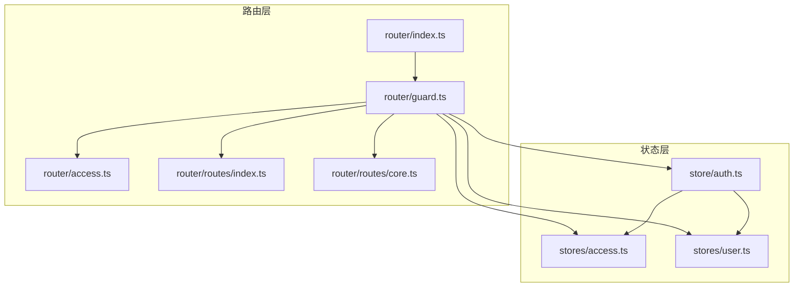
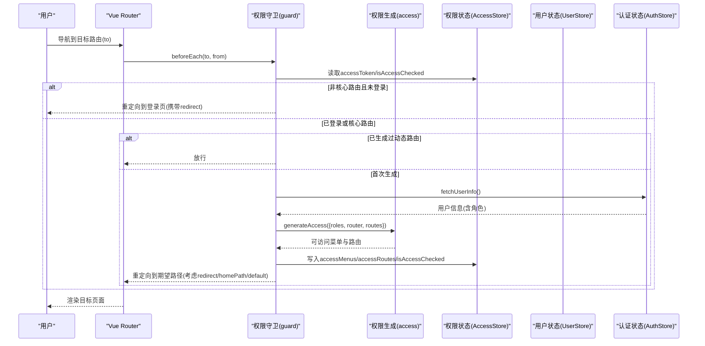
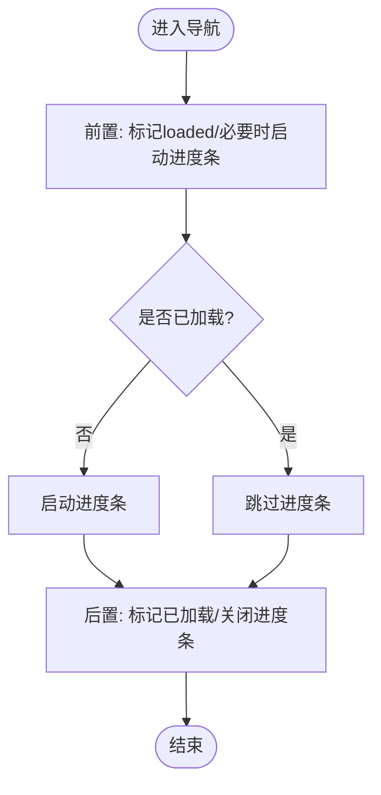
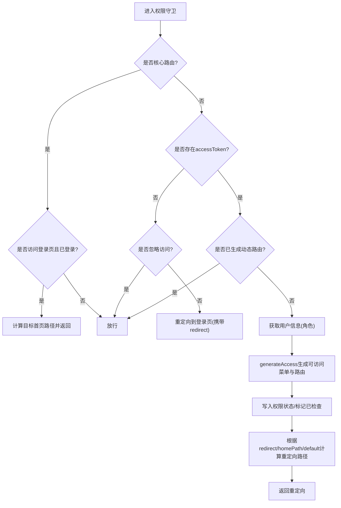
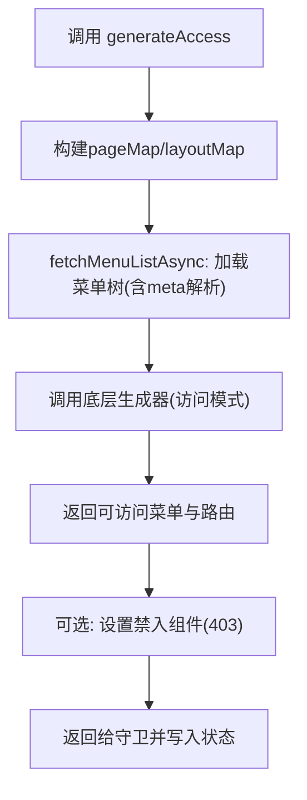
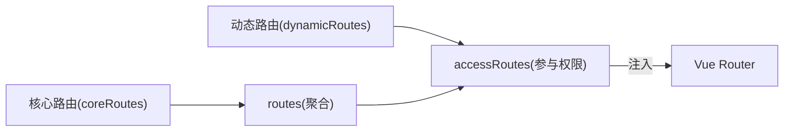
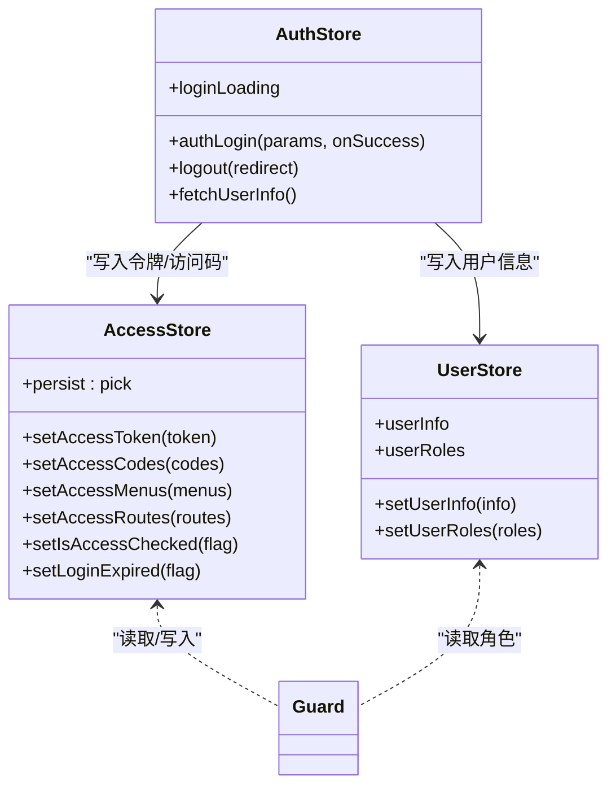
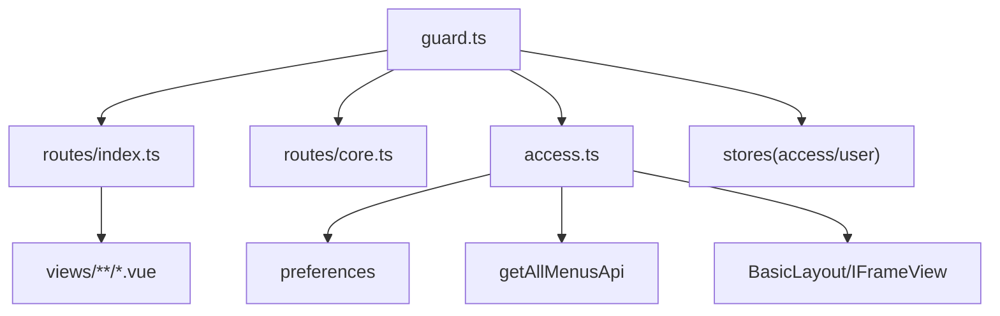

# 路由守卫

<cite>
**本文引用的文件**
- [apps/web-antd/src/router/guard.ts](file://apps/web-antd/src/router/guard.ts)
- [apps/web-antd/src/router/access.ts](file://apps/web-antd/src/router/access.ts)
- [apps/web-antd/src/router/index.ts](file://apps/web-antd/src/router/index.ts)
- [apps/web-antd/src/router/routes/index.ts](file://apps/web-antd/src/router/routes/index.ts)
- [apps/web-antd/src/router/routes/core.ts](file://apps/web-antd/src/router/routes/core.ts)
- [apps/web-antd/src/store/auth.ts](file://apps/web-antd/src/store/auth.ts)
- [packages/stores/src/modules/access.ts](file://packages/stores/src/modules/access.ts)
- [packages/stores/src/modules/user.ts](file://packages/stores/src/modules/user.ts)
- [playground/src/router/guard.ts](file://playground/src/router/guard.ts)
- [playground/src/router/access.ts](file://playground/src/router/access.ts)
</cite>

## 目录
1. [简介](#简介)
2. [项目结构](#项目结构)
3. [核心组件](#核心组件)
4. [架构总览](#架构总览)
5. [详细组件分析](#详细组件分析)
6. [依赖关系分析](#依赖关系分析)
7. [性能考量](#性能考量)
8. [故障排查指南](#故障排查指南)
9. [结论](#结论)
10. [附录](#附录)

## 简介
本文件面向 Vben Admin 的路由守卫体系，系统性阐述全局前置守卫与后置守卫的职责、执行顺序与配置方式；详解权限验证链路（登录态检查、角色权限与菜单权限）、导航控制（未授权跳转、权限不足处理、动态路由生成）以及与状态管理（用户信息、权限数据、路由缓存）的集成方案。文末提供可直接参考的配置要点与常见问题处理建议。

## 项目结构
围绕路由守卫的关键目录与文件如下：
- 守卫与权限生成：apps/web-antd/src/router/guard.ts、apps/web-antd/src/router/access.ts
- 路由注册与入口：apps/web-antd/src/router/index.ts
- 路由定义与核心路由：apps/web-antd/src/router/routes/index.ts、apps/web-antd/src/router/routes/core.ts
- 状态管理：apps/web-antd/src/store/auth.ts、packages/stores/src/modules/access.ts、packages/stores/src/modules/user.ts
- Playground 对照实现：playground/src/router/guard.ts、playground/src/router/access.ts

图表来源
- [apps/web-antd/src/router/index.ts:1-38](file://apps/web-antd/src/router/index.ts#L1-L38)
- [apps/web-antd/src/router/guard.ts:1-133](file://apps/web-antd/src/router/guard.ts#L1-L133)
- [apps/web-antd/src/router/access.ts:1-54](file://apps/web-antd/src/router/access.ts#L1-L54)
- [apps/web-antd/src/router/routes/index.ts:1-48](file://apps/web-antd/src/router/routes/index.ts#L1-L48)
- [apps/web-antd/src/router/routes/core.ts:1-98](file://apps/web-antd/src/router/routes/core.ts#L1-L98)
- [apps/web-antd/src/store/auth.ts:1-118](file://apps/web-antd/src/store/auth.ts#L1-L118)
- [packages/stores/src/modules/access.ts:1-130](file://packages/stores/src/modules/access.ts#L1-L130)
- [packages/stores/src/modules/user.ts:1-65](file://packages/stores/src/modules/user.ts#L1-L65)

章节来源
- [apps/web-antd/src/router/index.ts:1-38](file://apps/web-antd/src/router/index.ts#L1-L38)
- [apps/web-antd/src/router/guard.ts:1-133](file://apps/web-antd/src/router/guard.ts#L1-L133)
- [apps/web-antd/src/router/access.ts:1-54](file://apps/web-antd/src/router/access.ts#L1-L54)
- [apps/web-antd/src/router/routes/index.ts:1-48](file://apps/web-antd/src/router/routes/index.ts#L1-L48)
- [apps/web-antd/src/router/routes/core.ts:1-98](file://apps/web-antd/src/router/routes/core.ts#L1-L98)
- [apps/web-antd/src/store/auth.ts:1-118](file://apps/web-antd/src/store/auth.ts#L1-L118)
- [packages/stores/src/modules/access.ts:1-130](file://packages/stores/src/modules/access.ts#L1-L130)
- [packages/stores/src/modules/user.ts:1-65](file://packages/stores/src/modules/user.ts#L1-L65)

## 核心组件
- 通用守卫（全局前置/后置）
  - 前置：记录页面加载状态、按需开启进度条
  - 后置：标记已加载页面、关闭进度条
- 权限访问守卫（核心）
  - 忽略访问：支持路由元信息忽略权限拦截
  - 登录态：无令牌时重定向至登录页并携带 redirect
  - 动态路由：首次访问时根据用户角色生成可访问菜单与路由，写入状态并重定向
- 权限生成器
  - 基于访问模式与菜单 API，构建可访问菜单树与路由表，支持“可见但禁入”场景
- 路由与核心路由
  - 基础路由（根、认证页等）不参与权限拦截
  - 动态路由模块化聚合，配合守卫注入
- 状态管理
  - 认证态：登录、登出、获取用户信息、设置令牌
  - 权限态：访问码、可访问菜单、可访问路由、是否已检查、令牌持久化
  - 用户态：用户信息、角色集合

章节来源
- [apps/web-antd/src/router/guard.ts:17-41](file://apps/web-antd/src/router/guard.ts#L17-L41)
- [apps/web-antd/src/router/guard.ts:47-119](file://apps/web-antd/src/router/guard.ts#L47-L119)
- [apps/web-antd/src/router/access.ts:18-51](file://apps/web-antd/src/router/access.ts#L18-L51)
- [apps/web-antd/src/router/routes/index.ts:15-47](file://apps/web-antd/src/router/routes/index.ts#L15-L47)
- [apps/web-antd/src/router/routes/core.ts:23-95](file://apps/web-antd/src/router/routes/core.ts#L23-L95)
- [apps/web-antd/src/store/auth.ts:28-78](file://apps/web-antd/src/store/auth.ts#L28-L78)
- [packages/stores/src/modules/access.ts:51-123](file://packages/stores/src/modules/access.ts#L51-L123)
- [packages/stores/src/modules/user.ts:41-58](file://packages/stores/src/modules/user.ts#L41-L58)

## 架构总览
下图展示从路由导航到权限生成与状态落盘的整体流程，以及与状态管理的交互。

图表来源
- [apps/web-antd/src/router/guard.ts:47-119](file://apps/web-antd/src/router/guard.ts#L47-L119)
- [apps/web-antd/src/router/access.ts:18-51](file://apps/web-antd/src/router/access.ts#L18-L51)
- [apps/web-antd/src/store/auth.ts:100-104](file://apps/web-antd/src/store/auth.ts#L100-L104)
- [packages/stores/src/modules/access.ts:76-90](file://packages/stores/src/modules/access.ts#L76-L90)
- [packages/stores/src/modules/user.ts:42-52](file://packages/stores/src/modules/user.ts#L42-L52)

## 详细组件分析

### 通用守卫（全局前置/后置）
- 前置守卫职责
  - 标记页面是否已加载，避免重复执行切换动画等副作用
  - 若未加载且启用过渡进度条，启动进度条
- 后置守卫职责
  - 标记页面已加载
  - 关闭进度条

图表来源
- [apps/web-antd/src/router/guard.ts:17-41](file://apps/web-antd/src/router/guard.ts#L17-L41)

章节来源
- [apps/web-antd/src/router/guard.ts:17-41](file://apps/web-antd/src/router/guard.ts#L17-L41)

### 权限访问守卫（核心）
- 核心路由放行
  - 根路由与认证相关路由不参与权限拦截
  - 已登录访问登录页时自动跳转首页或用户首页
- 登录态检查
  - 无令牌且非忽略访问：重定向至登录页，携带 redirect 参数
- 动态路由生成
  - 首次访问时拉取用户信息与角色，调用权限生成器
  - 将可访问菜单与路由写入权限状态，并标记已检查
  - 依据来源 redirect、默认首页或用户首页进行重定向

图表来源
- [apps/web-antd/src/router/guard.ts:47-119](file://apps/web-antd/src/router/guard.ts#L47-L119)
- [apps/web-antd/src/router/routes/core.ts:23-95](file://apps/web-antd/src/router/routes/core.ts#L23-L95)

章节来源
- [apps/web-antd/src/router/guard.ts:47-119](file://apps/web-antd/src/router/guard.ts#L47-L119)
- [apps/web-antd/src/router/routes/core.ts:23-95](file://apps/web-antd/src/router/routes/core.ts#L23-L95)

### 权限生成器（菜单与路由）
- 组件映射与布局映射
  - pageMap：基于视图目录扫描
  - layoutMap：基础布局与 iframe 布局
- 菜单拉取与转换
  - 异步获取菜单树，对 meta.query 进行解析
  - 提示“加载菜单中”
- 权限模式
  - 通过偏好配置决定访问模式（如“前端白名单/后端树”等），交由底层生成器产出可访问菜单与路由
- 禁止访问处理
  - 可配置“可见但禁入”的组件，用于 403 场景

图表来源
- [apps/web-antd/src/router/access.ts:18-51](file://apps/web-antd/src/router/access.ts#L18-L51)

章节来源
- [apps/web-antd/src/router/access.ts:18-51](file://apps/web-antd/src/router/access.ts#L18-L51)

### 路由与核心路由
- 路由聚合
  - 动态路由模块化导入并合并
  - 核心路由（根、认证页）固定存在
  - 404兜底路由
- 核心路由名称
  - 通过遍历核心路由树提取名称集合，供守卫判断是否放行

图表来源
- [apps/web-antd/src/router/routes/index.ts:15-47](file://apps/web-antd/src/router/routes/index.ts#L15-L47)
- [apps/web-antd/src/router/routes/core.ts:23-95](file://apps/web-antd/src/router/routes/core.ts#L23-L95)

章节来源
- [apps/web-antd/src/router/routes/index.ts:15-47](file://apps/web-antd/src/router/routes/index.ts#L15-L47)
- [apps/web-antd/src/router/routes/core.ts:23-95](file://apps/web-antd/src/router/routes/core.ts#L23-L95)

### 状态管理集成
- 认证状态（登录/登出/获取用户信息）
  - 登录成功写入 accessToken，异步拉取用户信息与访问码，写入用户与权限状态
  - 登出清理全部状态并回退登录页（可携带当前路由）
- 权限状态
  - 存储可访问菜单、可访问路由、访问码、令牌、是否已检查等
  - 部分字段持久化，提升体验
- 用户状态
  - 存储用户信息与角色集合，供守卫与渲染使用

图表来源
- [apps/web-antd/src/store/auth.ts:28-104](file://apps/web-antd/src/store/auth.ts#L28-L104)
- [packages/stores/src/modules/access.ts:51-123](file://packages/stores/src/modules/access.ts#L51-L123)
- [packages/stores/src/modules/user.ts:41-58](file://packages/stores/src/modules/user.ts#L41-L58)

章节来源
- [apps/web-antd/src/store/auth.ts:28-104](file://apps/web-antd/src/store/auth.ts#L28-L104)
- [packages/stores/src/modules/access.ts:51-123](file://packages/stores/src/modules/access.ts#L51-L123)
- [packages/stores/src/modules/user.ts:41-58](file://packages/stores/src/modules/user.ts#L41-L58)

## 依赖关系分析
- 守卫依赖
  - 路由实例、核心路由名称集合、偏好配置、进度条工具
  - 权限生成器、用户/权限/认证状态
- 权限生成器依赖
  - 访问模式、菜单 API、页面与布局映射、提示与禁入组件
- 路由依赖
  - 路由聚合、核心路由、404兜底

图表来源
- [apps/web-antd/src/router/guard.ts:1-133](file://apps/web-antd/src/router/guard.ts#L1-L133)
- [apps/web-antd/src/router/access.ts:1-54](file://apps/web-antd/src/router/access.ts#L1-L54)
- [apps/web-antd/src/router/routes/index.ts:1-48](file://apps/web-antd/src/router/routes/index.ts#L1-L48)
- [apps/web-antd/src/router/routes/core.ts:1-98](file://apps/web-antd/src/router/routes/core.ts#L1-L98)

章节来源
- [apps/web-antd/src/router/guard.ts:1-133](file://apps/web-antd/src/router/guard.ts#L1-L133)
- [apps/web-antd/src/router/access.ts:1-54](file://apps/web-antd/src/router/access.ts#L1-L54)
- [apps/web-antd/src/router/routes/index.ts:1-48](file://apps/web-antd/src/router/routes/index.ts#L1-L48)
- [apps/web-antd/src/router/routes/core.ts:1-98](file://apps/web-antd/src/router/routes/core.ts#L1-L98)

## 性能考量
- 避免重复生成
  - 通过“是否已检查”标志位，仅在首次导航时生成动态路由，减少重复开销
- 视图懒加载
  - 页面组件与布局采用动态导入，结合守卫的“已加载”标记，避免重复初始化
- 进度条控制
  - 仅对首次加载页面开启进度条，降低不必要的 UI 更新
- 并发优化
  - 登录时并发拉取用户信息与访问码，缩短首屏等待

章节来源
- [apps/web-antd/src/router/guard.ts:88-118](file://apps/web-antd/src/router/guard.ts#L88-L118)
- [apps/web-antd/src/store/auth.ts:43-46](file://apps/web-antd/src/store/auth.ts#L43-L46)

## 故障排查指南
- 登录后仍被重定向到登录页
  - 检查是否正确写入 accessToken 与用户信息
  - 确认守卫中核心路由判断与登录页重定向逻辑
- 首次进入页面白屏或无限重定向
  - 确认动态路由生成完成后再放行
  - 检查 redirect 参数编码/解码是否一致
- 菜单可见但无法访问
  - 确认权限生成器的“可见但禁入”组件配置
  - 检查访问码与角色是否正确下发
- 登录成功未跳转预期首页
  - 检查用户信息中的 homePath 与默认首页优先级
  - 确认守卫重定向逻辑分支

章节来源
- [apps/web-antd/src/router/guard.ts:53-85](file://apps/web-antd/src/router/guard.ts#L53-L85)
- [apps/web-antd/src/router/guard.ts:109-117](file://apps/web-antd/src/router/guard.ts#L109-L117)
- [apps/web-antd/src/router/access.ts:45-49](file://apps/web-antd/src/router/access.ts#L45-L49)
- [apps/web-antd/src/store/auth.ts:58-61](file://apps/web-antd/src/store/auth.ts#L58-L61)

## 结论
Vben Admin 的路由守卫以“通用守卫+权限守卫”为核心，结合状态管理与权限生成器，实现了登录态检查、角色权限与菜单权限的统一治理，以及动态路由的按需生成与缓存。通过清晰的守卫职责划分与完善的错误处理，既保证了安全性，也兼顾了用户体验与性能。

## 附录
- 配置要点
  - 在路由入口创建守卫并传入路由实例
  - 在核心路由中保留登录页等不受权限拦截的页面
  - 在权限生成器中配置访问模式、菜单 API、布局与页面映射
  - 在状态层持久化必要的令牌与访问码，提升体验
- 最佳实践
  - 将“忽略访问”元信息用于特殊页面（如验证码登录）
  - 首次生成动态路由后，使用“已检查”标志位避免重复生成
  - 登录成功后优先跳转用户首页或默认首页，保持一致性
  - 对于 iframe 或外部页面，使用外部路由配置并避免布局包裹