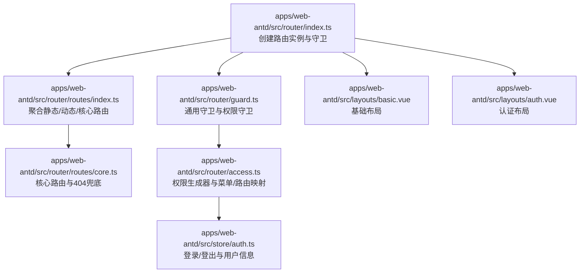
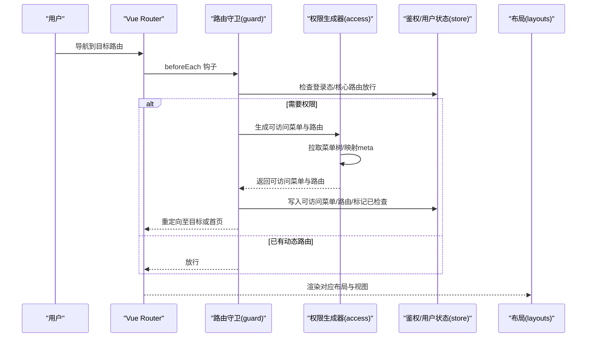
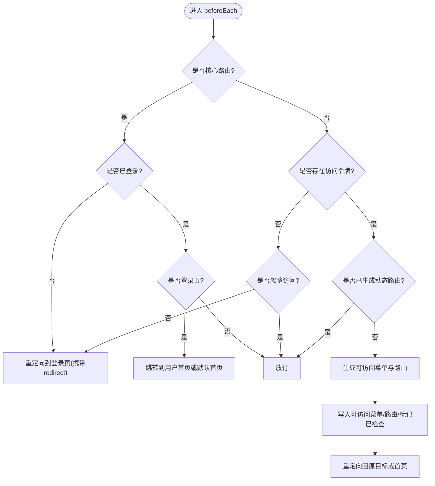
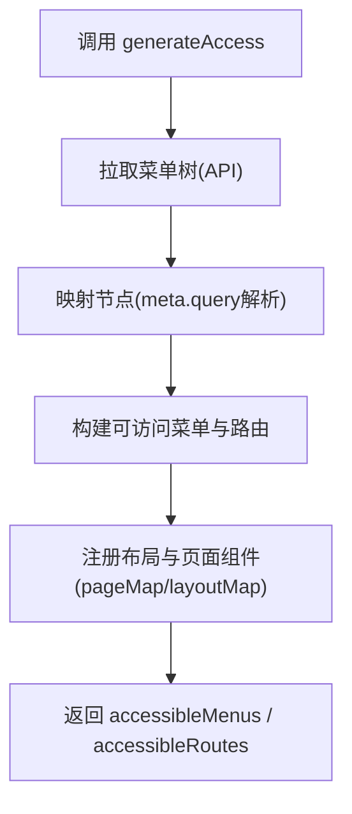
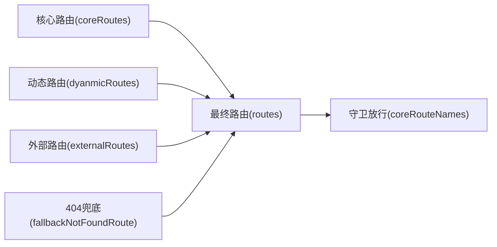
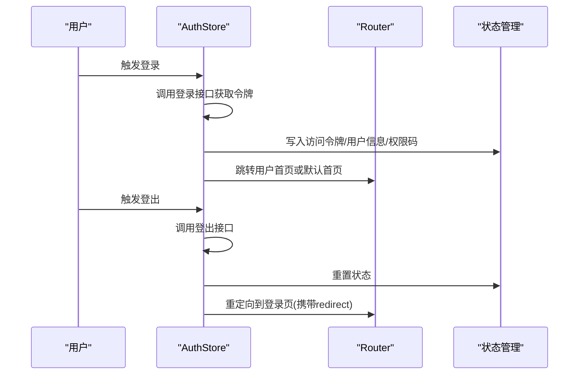
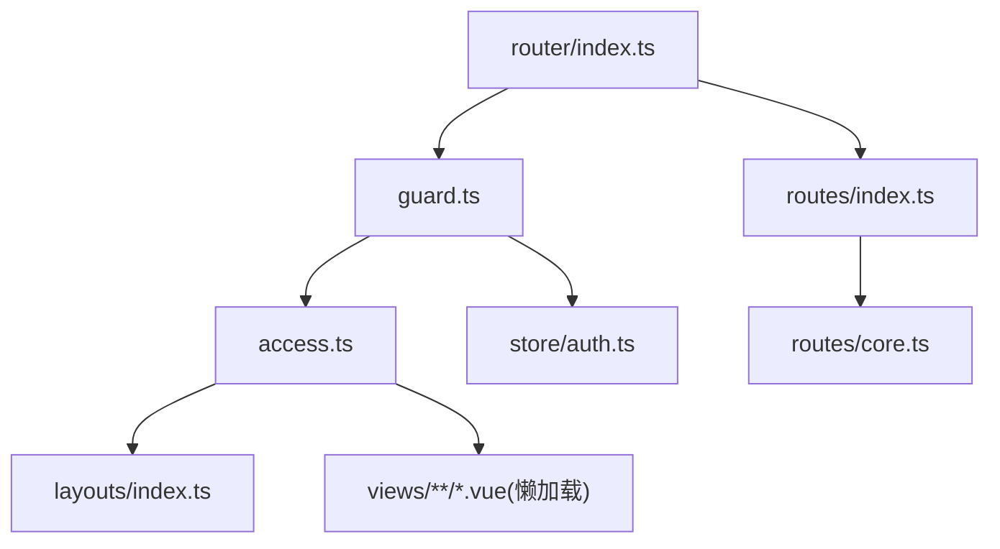

# 路由系统

<cite>
**本文引用的文件**
- [apps/web-antd/src/router/index.ts](file://apps/web-antd/src/router/index.ts)
- [apps/web-antd/src/router/guard.ts](file://apps/web-antd/src/router/guard.ts)
- [apps/web-antd/src/router/access.ts](file://apps/web-antd/src/router/access.ts)
- [apps/web-antd/src/router/routes/index.ts](file://apps/web-antd/src/router/routes/index.ts)
- [apps/web-antd/src/router/routes/core.ts](file://apps/web-antd/src/router/routes/core.ts)
- [apps/web-antd/src/store/auth.ts](file://apps/web-antd/src/store/auth.ts)
- [apps/web-antd/src/layouts/basic.vue](file://apps/web-antd/src/layouts/basic.vue)
- [apps/web-antd/src/layouts/auth.vue](file://apps/web-antd/src/layouts/auth.vue)
- [apps/web-antd/src/layouts/index.ts](file://apps/web-antd/src/layouts/index.ts)
</cite>

## 目录

1. [简介](#简介)
2. [项目结构](#项目结构)
3. [核心组件](#核心组件)
4. [架构总览](#架构总览)
5. [详细组件分析](#详细组件分析)
6. [依赖分析](#依赖分析)
7. [性能考虑](#性能考虑)
8. [故障排查指南](#故障排查指南)
9. [结论](#结论)
10. [附录](#附录)

## 简介

本文件面向 Vben Admin 的前端路由系统，围绕“静态路由与动态路由”“路由守卫与权限控制”“模块化设计与业务解耦”“菜单联动与权限落地”等主题进行系统性技术说明。重点覆盖：

- 路由配置结构与组织：静态路由、动态路由、核心路由与业务路由的分层与合并策略
- 路由守卫机制：登录检查、权限拦截、导航控制与进度条联动
- 权限控制实现：角色权限、菜单权限、按钮权限的生成与应用
- 路由特性：嵌套路由、懒加载、路由元信息（meta）
- 路由与菜单联动：菜单树生成、权限过滤、面包屑与标签页联动

## 项目结构

Vben Admin 在 Web 前端应用中采用“根路由 + 子模块路由”的组织方式，核心入口负责创建路由实例与挂载守卫；路由模块通过约定式扫描聚合动态路由；权限控制通过守卫与权限生成器协同完成。

图表来源

- [apps/web-antd/src/router/index.ts:1-38](file://apps/web-antd/src/router/index.ts#L1-L38)
- [apps/web-antd/src/router/routes/index.ts:1-48](file://apps/web-antd/src/router/routes/index.ts#L1-L48)
- [apps/web-antd/src/router/routes/core.ts:1-98](file://apps/web-antd/src/router/routes/core.ts#L1-L98)
- [apps/web-antd/src/router/guard.ts:1-133](file://apps/web-antd/src/router/guard.ts#L1-L133)
- [apps/web-antd/src/router/access.ts:1-54](file://apps/web-antd/src/router/access.ts#L1-L54)
- [apps/web-antd/src/layouts/basic.vue:1-207](file://apps/web-antd/src/layouts/basic.vue#L1-L207)
- [apps/web-antd/src/layouts/auth.vue:1-26](file://apps/web-antd/src/layouts/auth.vue#L1-L26)
- [apps/web-antd/src/store/auth.ts:1-118](file://apps/web-antd/src/store/auth.ts#L1-L118)

章节来源

- [apps/web-antd/src/router/index.ts:1-38](file://apps/web-antd/src/router/index.ts#L1-L38)
- [apps/web-antd/src/router/routes/index.ts:1-48](file://apps/web-antd/src/router/routes/index.ts#L1-L48)
- [apps/web-antd/src/router/routes/core.ts:1-98](file://apps/web-antd/src/router/routes/core.ts#L1-L98)

## 核心组件

- 路由实例与历史模式
  - 通过环境变量选择 Hash 或 HTML5 History 模式，统一滚动行为与基础路径
  - 提供重置静态路由能力，便于运行时刷新或重建
- 路由守卫
  - 通用守卫：记录已加载页面、按配置开启进度条
  - 权限守卫：核心路由白名单、登录态检查、动态路由生成、重定向回跳
- 权限生成器
  - 统一从 API 拉取菜单树，映射为可访问的菜单与路由集合
  - 支持“无权限可见但跳转 403”的策略
- 路由聚合
  - 核心路由、外部路由、动态路由、静态路由合并为最终路由表
  - 提供核心路由名称集合，用于守卫放行判断

章节来源

- [apps/web-antd/src/router/index.ts:12-38](file://apps/web-antd/src/router/index.ts#L12-L38)
- [apps/web-antd/src/router/guard.ts:17-119](file://apps/web-antd/src/router/guard.ts#L17-L119)
- [apps/web-antd/src/router/access.ts:18-51](file://apps/web-antd/src/router/access.ts#L18-L51)
- [apps/web-antd/src/router/routes/index.ts:5-47](file://apps/web-antd/src/router/routes/index.ts#L5-L47)

## 架构总览

下图展示从用户导航到页面渲染的关键链路，以及权限生成与菜单联动的时序关系。

图表来源

- [apps/web-antd/src/router/guard.ts:47-119](file://apps/web-antd/src/router/guard.ts#L47-L119)
- [apps/web-antd/src/router/access.ts:18-51](file://apps/web-antd/src/router/access.ts#L18-L51)
- [apps/web-antd/src/store/auth.ts:28-78](file://apps/web-antd/src/store/auth.ts#L28-L78)
- [apps/web-antd/src/layouts/basic.vue:172-206](file://apps/web-antd/src/layouts/basic.vue#L172-L206)

## 详细组件分析

### 路由实例与历史模式

- 历史模式选择
  - 依据环境变量决定 Hash 或 HTML5 History，支持自定义基础路径
- 滚动行为
  - 支持返回上次位置与锚点平滑滚动
- 路由重置
  - 提供重置静态路由能力，便于运行时重建

章节来源

- [apps/web-antd/src/router/index.ts:15-30](file://apps/web-antd/src/router/index.ts#L15-L30)
- [apps/web-antd/src/router/index.ts:32-37](file://apps/web-antd/src/router/index.ts#L32-L37)

### 路由守卫机制

- 通用守卫
  - 记录已加载页面，避免重复执行切换动画
  - 按配置开启/关闭进度条
- 权限守卫
  - 核心路由白名单：不参与权限拦截
  - 登录态检查：未登录且非忽略访问则跳转登录并携带重定向参数
  - 动态路由生成：首次登录后根据角色生成可访问菜单与路由
  - 重定向逻辑：优先使用来源重定向，否则回到默认首页或目标页

图表来源

- [apps/web-antd/src/router/guard.ts:47-119](file://apps/web-antd/src/router/guard.ts#L47-L119)

章节来源

- [apps/web-antd/src/router/guard.ts:17-41](file://apps/web-antd/src/router/guard.ts#L17-L41)
- [apps/web-antd/src/router/guard.ts:47-119](file://apps/web-antd/src/router/guard.ts#L47-L119)

### 权限生成器与菜单联动

- 菜单拉取与映射
  - 从 API 拉取菜单树，转换为路由可用的树结构，解析 meta.query 字段
- 路由与布局映射
  - 将页面组件与布局组件注册到生成器，支持 BasicLayout 与 IFrameView
- 权限策略
  - 可配置“无权限可见但跳转 403”的策略，结合 forbiddenComponent 实现
- 菜单与路由联动
  - 生成后的菜单与路由可用于菜单渲染、面包屑、标签页等 UI 展示

图表来源

- [apps/web-antd/src/router/access.ts:18-51](file://apps/web-antd/src/router/access.ts#L18-L51)

章节来源

- [apps/web-antd/src/router/access.ts:18-51](file://apps/web-antd/src/router/access.ts#L18-L51)

### 路由聚合与模块化设计

- 聚合策略
  - 核心路由：始终存在，不参与权限拦截
  - 动态路由：约定式扫描 modules 下的路由模块并合并
  - 外部路由/静态路由：预留扩展点，默认为空
  - 最终路由表：核心路由 + 外部路由 + 404兜底
- 名称集合
  - 提取核心路由名称集合，用于守卫快速放行
- 组件键收集
  - 收集所有视图组件路径，辅助运行时组件注册与懒加载

图表来源

- [apps/web-antd/src/router/routes/index.ts:5-36](file://apps/web-antd/src/router/routes/index.ts#L5-L36)
- [apps/web-antd/src/router/routes/core.ts:24-95](file://apps/web-antd/src/router/routes/core.ts#L24-L95)

章节来源

- [apps/web-antd/src/router/routes/index.ts:5-47](file://apps/web-antd/src/router/routes/index.ts#L5-L47)
- [apps/web-antd/src/router/routes/core.ts:11-95](file://apps/web-antd/src/router/routes/core.ts#L11-L95)

### 嵌套路由、懒加载与路由元信息

- 嵌套路由
  - 根路由使用基础布局作为父容器，子路由无需重复包裹
  - 认证相关页面位于 /auth 子路由下，便于统一认证布局
- 懒加载
  - 视图组件与布局均采用动态导入，实现按需加载
- 路由元信息
  - 通过 meta 控制菜单显示/隐藏、面包屑、标签页、标题等
  - meta.query 支持字符串化查询参数的解析与传递

章节来源

- [apps/web-antd/src/router/routes/core.ts:30-94](file://apps/web-antd/src/router/routes/core.ts#L30-L94)
- [apps/web-antd/src/router/access.ts:19-24](file://apps/web-antd/src/router/access.ts#L19-L24)
- [apps/web-antd/src/router/access.ts:34-42](file://apps/web-antd/src/router/access.ts#L34-L42)

### 登录流程与登出重定向

- 登录
  - 获取访问令牌与用户信息，写入状态管理，跳转用户首页或默认首页
- 登出
  - 调用后端登出接口，重置全部状态，回退到登录页并携带当前路由地址

图表来源

- [apps/web-antd/src/store/auth.ts:28-98](file://apps/web-antd/src/store/auth.ts#L28-L98)

章节来源

- [apps/web-antd/src/store/auth.ts:28-98](file://apps/web-antd/src/store/auth.ts#L28-L98)

### 布局与菜单联动

- 基础布局
  - 注入用户下拉、通知中心、锁屏等插槽，承载菜单与用户交互
- 认证布局
  - 用于登录/注册等认证页面，统一品牌与标题文案
- 菜单联动
  - 路由生成的菜单可用于菜单组件渲染、面包屑与标签页联动

章节来源

- [apps/web-antd/src/layouts/basic.vue:172-206](file://apps/web-antd/src/layouts/basic.vue#L172-L206)
- [apps/web-antd/src/layouts/auth.vue:14-25](file://apps/web-antd/src/layouts/auth.vue#L14-L25)
- [apps/web-antd/src/layouts/index.ts:1-6](file://apps/web-antd/src/layouts/index.ts#L1-L6)

## 依赖分析

- 组件耦合
  - 守卫依赖权限与用户状态、布局与视图懒加载
  - 权限生成器依赖菜单 API、布局与页面映射
- 外部依赖
  - Vue Router、Pinia、Ant Design Vue（消息/通知）、@vben/\* 工具与类型库
- 循环依赖
  - 路由模块间通过导出聚合，避免直接循环引用

图表来源

- [apps/web-antd/src/router/guard.ts:1-133](file://apps/web-antd/src/router/guard.ts#L1-L133)
- [apps/web-antd/src/router/access.ts:1-54](file://apps/web-antd/src/router/access.ts#L1-L54)
- [apps/web-antd/src/store/auth.ts:1-118](file://apps/web-antd/src/store/auth.ts#L1-L118)
- [apps/web-antd/src/layouts/index.ts:1-6](file://apps/web-antd/src/layouts/index.ts#L1-L6)
- [apps/web-antd/src/router/index.ts:1-38](file://apps/web-antd/src/router/index.ts#L1-L38)
- [apps/web-antd/src/router/routes/index.ts:1-48](file://apps/web-antd/src/router/routes/index.ts#L1-L48)
- [apps/web-antd/src/router/routes/core.ts:1-98](file://apps/web-antd/src/router/routes/core.ts#L1-L98)

## 性能考虑

- 懒加载与按需渲染
  - 视图与布局均采用动态导入，减少首屏体积
- 进度条与已加载页面缓存
  - 通过通用守卫控制进度条与页面加载状态，避免重复执行
- 菜单与路由一次性生成
  - 首次登录后生成并缓存，后续导航直接放行

## 故障排查指南

- 登录后无法进入首页
  - 检查用户首页路径与默认首页配置是否正确
  - 确认权限生成器返回的可访问路由是否包含首页
- 403 页面显示但菜单仍可见
  - 确认权限生成器的 forbiddenComponent 配置与策略开关
- 路由刷新丢失
  - 确认是否调用了重置静态路由方法，确保静态路由被重建
- 进度条不消失
  - 检查通用守卫的 after 每次钩子是否正确关闭进度条

章节来源

- [apps/web-antd/src/router/guard.ts:31-40](file://apps/web-antd/src/router/guard.ts#L31-L40)
- [apps/web-antd/src/router/access.ts:16-16](file://apps/web-antd/src/router/access.ts#L16-L16)
- [apps/web-antd/src/router/index.ts:32-32](file://apps/web-antd/src/router/index.ts#L32-L32)

## 结论

Vben Admin 的路由系统以“核心路由白名单 + 动态权限生成 + 懒加载 + 布局插槽”为核心设计，实现了清晰的权限边界与良好的用户体验。通过约定式模块聚合与统一的权限生成器，既保证了开发效率，又便于扩展与维护。建议在业务路由中遵循 meta 元信息规范，配合菜单联动组件，实现一致的导航体验。

## 附录

- 路由元信息常用字段
  - hideInMenu/hideInBreadcrumb/hideInTab：控制菜单/面包屑/标签页显示
  - title：页面标题
  - ignoreAccess：忽略权限拦截
  - meta.query：字符串化查询参数，将在生成时解析
- 常见问题定位清单
  - 登录后重定向异常：核对登录成功后的跳转逻辑与用户首页配置
  - 403 与菜单可见冲突：确认 forbiddenComponent 与策略开关
  - 首次进入空白页：确认动态路由生成是否成功与组件懒加载是否正常
